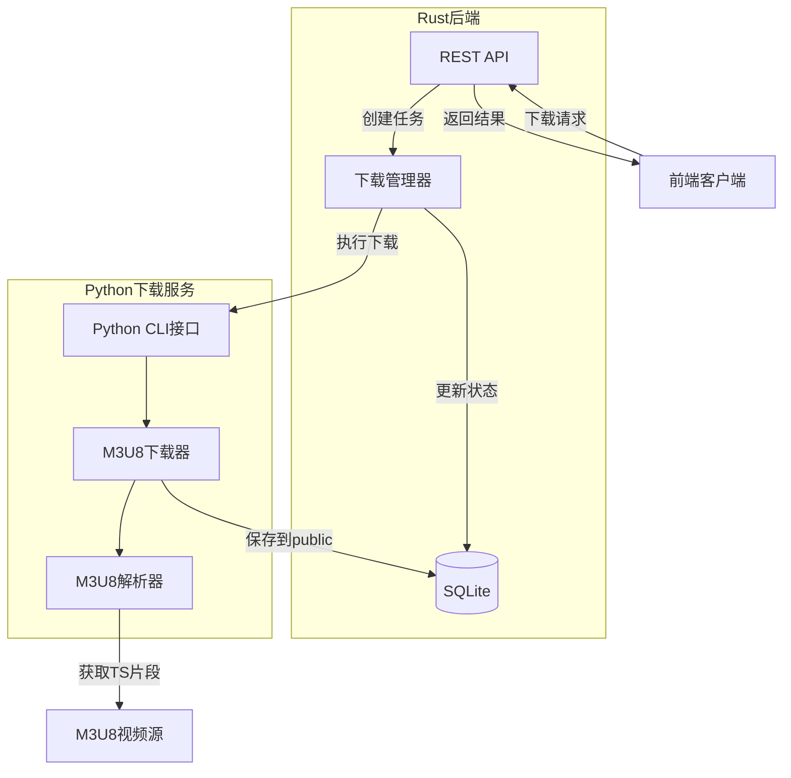

# 视频管理系统扩展与Python下载模块整理方案

## 概述

本文档包含两个主要内容：
1. 视频管理系统的功能扩展分析
2. Python M3U8下载模块的整理和集成方案

---

## 第一部分：Python下载模块整理方案

### 模块现状分析

#### 当前目录结构
```
app/download/
├── .git/                      # 独立Git仓库
├── .gitignore                 #Git忽略配置
├── __pycache__/               # Python缓存
├── temp/                      # 临时下载目录
├── output/                    # 输出目录
├── README.md                  # 项目说明文档
├── USAGE.md                   # 使用指南
├── __init__.py                # 包初始化(v2.1.0)
├── config.py                  # 配置模块
├── parser.py                  # M3U8解析器
├── downloader.py              # 基础下载器
├── advanced_downloader.py     # 高级下载器(流式下载、JSON配置)
├── utils.py                   # 工具函数
├── m3u8_downloader.py         # M3U8下载器
├── cli.py                     # 基础命令行工具
├── advanced_cli.py            # 高级命令行工具
├── example_usage.py           # 使用示例
├── demo.py                    # 功能演示
├── test_basic.py              # 基础测试
├── test_advanced.py           # 高级测试
├── test_progress.py           # 进度测试
├── download.log               # 日志文件(121KB)
└── download_tasks.json        # 任务配置示例
```

#### 模块功能特性

**核心能力**：
- M3U8视频文件下载
- 多线程并发下载
- 断点续传
- 错误重试机制（指数退避）
- 流式下载（逐个下载TS片段）
- JSON批量任务配置
- 实时进度显示
- 配置模板（快速、稳定、低带宽）

**技术栈**：
- Python 3.x
- requests（HTTP请求）
- tqdm（进度条）

### 整理目标

1. **与视频管理系统集成**：将下载功能整合到主项目中，作为视频获取和管理的扩展能力
2. **清理冗余文件**：移除临时文件、日志文件、测试输出等不必要的运行时产物
3. **优化目录结构**：调整目录结构，使其符合主项目的组织方式
4. **规范代码风格**：确保代码风格与主项目一致，添加必要的文档

### 整理方案

#### 方案一：保持独立子模块（推荐）

**适用场景**：下载模块可能单独使用或被其他项目引用

**调整后的目录结构**：
```
app/
├── server/                    # Rust后端（现有）
├── web/                       # Next.js前端（现有）
└── downloader/                # Python下载模块（重命名）
    ├── core/                  # 核心功能
    │   ├── __init__.py
    │   ├── config.py
    │   ├── parser.py
    │   ├── downloader.py
    │   ├── advanced_downloader.py
    │   └── utils.py
    ├── cli/                   # 命令行工具
    │   ├── __init__.py
    │   ├── cli.py
    │   └── advanced_cli.py
    ├── tests/                 # 测试文件
    │   ├── __init__.py
    │   ├── test_basic.py
    │   ├── test_advanced.py
    │   └── test_progress.py
    ├── examples/              # 示例代码
    │   ├── example_usage.py
    │   ├── demo.py
    │   └── tasks.example.json
    ├── docs/                  # 文档
    │   ├── README.md
    │   └── USAGE.md
    ├── .gitignore
    ├── __init__.py
    └── requirements.txt       # 依赖声明
```

**操作步骤**：

| 步骤 | 操作 | 说明 |
|------|------|------|
| 1 | 重命名目录 | `download` → `downloader` |
| 2 | 创建子目录 | 创建 `core/`, `cli/`, `tests/`, `examples/`, `docs/` |
| 3 | 移动文件 | 按功能分类移动文件到对应子目录 |
| 4 | 清理临时文件 | 删除 `.git/`, `__pycache__/`, `temp/`, `output/`, `*.log` |
| 5 | 更新导入路径 | 修改所有文件的import语句 |
| 6 | 创建requirements.txt | 声明依赖：requests, tqdm |
| 7 | 移动文档 | 将README.md和USAGE.md移到docs/目录 |
| 8 | 更新.gitignore | 添加运行时文件忽略规则 |

**.gitignore内容**：
```
# Python缓存
__pycache__/
*.py[cod]
*$py.class
*.so

# 运行时产物
*.log
temp/
output/
download_tasks.json

# IDE
.vscode/
.idea/
*.swp
*.swo

# 环境
.env
venv/
env/
```

**requirements.txt内容**：
```
requests>=2.25.0
tqdm>=4.60.0
```

#### 方案二：深度集成到后端

**适用场景**：下载功能仅为视频管理系统内部使用

**架构设计**：

将Python下载模块作为Rust后端的辅助服务，通过进程间通信调用：



**API扩展设计**：

新增Rust端点：

| 端点 | 方法 | 功能 |
|------|------|------|
| /api/download/create | POST | 创建下载任务 |
| /api/download/status/:id | GET | 查询任务状态 |
| /api/download/list | GET | 任务列表 |
| /api/download/cancel/:id | POST | 取消任务 |
| /api/download/retry/:id | POST | 重试失败任务 |

**请求/响应格式**：

创建下载任务：
```json
POST /api/download/create
{
  "url": "https://example.com/video.m3u8",
  "name": "video_name",
  "quality": "1080p",
  "output_dir": "public/downloads"
}

响应：
{
  "task_id": "uuid-123",
  "status": "pending",
  "created_at": "2025-01-13T10:00:00Z"
}
```

查询任务状态：
```json
GET /api/download/status/uuid-123

响应：
{
  "task_id": "uuid-123",
  "status": "downloading",
  "progress": 65,
  "downloaded_segments": 92,
  "total_segments": 141,
  "current_file": "seg-092.ts",
  "speed": "5.2 MB/s",
  "eta": "00:02:15",
  "message": "正在下载..."
}
```

**数据库扩展**：
```sql
CREATE TABLE download_tasks (
    id TEXT PRIMARY KEY,
    name TEXT NOT NULL,
    url TEXT NOT NULL,
    status TEXT NOT NULL,  -- pending, downloading, completed, failed, cancelled
    progress INTEGER DEFAULT 0,
    total_segments INTEGER,
    downloaded_segments INTEGER DEFAULT 0,
    output_path TEXT,
    created_at TEXT NOT NULL,
    started_at TEXT,
    completed_at TEXT,
    error_message TEXT,
    metadata TEXT  -- JSON格式存储额外信息
);

CREATE INDEX idx_download_status ON download_tasks(status);
CREATE INDEX idx_download_created ON download_tasks(created_at);
```

### 文件迁移清单

#### 需要修改的文件

| 文件 | 修改内容 | 优先级 |
|------|---------|--------|
| __init__.py | 更新导入路径 | 高 |
| cli.py | 适配新的模块结构 | 高 |
| advanced_cli.py | 适配新的模块结构 | 高 |
| downloader.py | 无需修改（核心逻辑） | - |
| advanced_downloader.py | 无需修改（核心逻辑） | - |
| config.py | 添加配置文件支持 | 中 |
| parser.py | 无需修改 | - |
| utils.py | 无需修改 | - |
| test_*.py | 更新导入路径 | 中 |
| example_usage.py | 更新导入路径和文档 | 低 |

#### 需要删除的文件

| 文件/目录 | 原因 |
|-----------|------|
| .git/ | 主项目已有Git管理 |
| __pycache__/ | 自动生成的缓存 |
| temp/ | 运行时临时目录 |
| output/ | 运行时输出目录 |
| download.log | 运行时日志 |
| download_tasks.json | 应放在examples中作为示例 |
| m3u8_downloader.py | 功能与downloader.py重复（需确认） |

#### 需要新增的文件

| 文件 | 内容 |
|------|------|
| requirements.txt | 依赖声明 |
| setup.py | 安装配置（可选） |
| config.yaml.example | 配置文件示例 |
| docs/API.md | API文档（如集成到后端） |
| docs/INTEGRATION.md | 集成指南 |

### 与前端集成方案

#### UI扩展设计

在Web前端增加下载管理界面：

**新增页面**：`app/web/app/downloads/page.tsx`

**功能模块**：
- 下载任务创建表单
- 任务列表和状态展示
- 实时进度更新（WebSocket或轮询）
- 任务操作（取消、重试、删除）

**TypeScript类型定义**：
```typescript
// types/download.ts
export interface DownloadTask {
  id: string
  name: string
  url: string
  status: 'pending' | 'downloading' | 'completed' | 'failed' | 'cancelled'
  progress: number
  totalSegments: number
  downloadedSegments: number
  speed?: string
  eta?: string
  createdAt: string
  errorMessage?: string
}
```

**React组件示例**：
```typescript
// components/download-manager.tsx
export function DownloadManager() {
  const [tasks, setTasks] = useState<DownloadTask[]>([])
  
  // 轮询获取任务状态
  useEffect(() => {
    const interval = setInterval(async () => {
      const response = await fetch('/api/download/list')
      const data = await response.json()
      setTasks(data.tasks)
    }, 2000)
    
    return () => clearInterval(interval)
  }, [])
  
  return (
    <div className="download-manager">
      {tasks.map(task => (
        <DownloadTaskItem key={task.id} task={task} />
      ))}
    </div>
  )
}
```

### 配置管理

#### 统一配置文件

在项目根目录创建 `config/downloader.yaml`：

```yaml
downloader:
  # 基础配置
  default_profile: stable
  
  # 目录配置
  temp_dir: ./app/server/public/temp
  output_dir: ./app/server/public/downloads
  
  # 线程配置
  default_threads: 8
  max_threads: 16
  
  # 重试配置
  max_retries: 3
  retry_delay: 2.0
  
  # 超时配置
  connect_timeout: 15
  read_timeout: 60
  
  # 日志配置
  log_file: ./logs/downloader.log
  log_level: INFO
  
  # 并发控制
  max_concurrent_tasks: 3
  
  # 预设模板
  profiles:
    fast:
      threads: 16
      max_retries: 1
      retry_delay: 0.5
    
    stable:
      threads: 8
      max_retries: 5
      retry_delay: 2.0
    
    low_bandwidth:
      threads: 2
      max_retries: 3
      chunk_size: 4096
```

#### 环境变量支持

在 `.env` 文件中添加：
```env
# 下载模块配置
DOWNLOADER_ENABLED=true
DOWNLOADER_PYTHON_PATH=python3
DOWNLOADER_MAX_CONCURRENT=3
DOWNLOADER_TEMP_DIR=./app/server/public/temp
DOWNLOADER_OUTPUT_DIR=./app/server/public/downloads
```

### 测试策略

#### 单元测试

保留现有测试文件，确保核心功能正常：
- `test_basic.py`: 基础下载功能
- `test_advanced.py`: 高级功能（JSON配置、并发）
- `test_progress.py`: 进度显示

#### 集成测试

新增集成测试：
```python
# tests/test_integration.py
import pytest
from app.downloader.core import AdvancedM3U8Downloader

def test_download_to_public_dir():
    """测试下载到public目录"""
    downloader = AdvancedM3U8Downloader()
    result = downloader.download_single(
        name="test_video",
        url="https://test.example.com/video.m3u8",
        output_dir="./app/server/public/downloads"
    )
    assert result == True

def test_api_integration():
    """测试与Rust API集成"""
    response = requests.post('http://localhost:3000/api/download/create', json={
        'url': 'https://test.example.com/video.m3u8',
        'name': 'test_video'
    })
    assert response.status_code == 200
```

### 文档更新

#### 需要更新的文档

| 文档 | 更新内容 |
|------|----------|
| README.md（主项目） | 添加下载功能说明 |
| app/downloader/docs/README.md | 模块独立文档 |
| app/downloader/docs/USAGE.md | 使用指南 |
| app/downloader/docs/INTEGRATION.md | 集成指南（新增） |
| app/downloader/docs/API.md | API文档（新增） |

#### 主项目README扩展

在主项目README中添加：

```markdown
## 视频下载功能

本项目集成了Python M3U8下载模块，支持从M3U8源下载视频到本地。

### 功能特性
- M3U8视频下载
- 多线程并发
- 断点续传
- 实时进度显示
- JSON批量任务

### 快速使用

命令行方式：
```bash
cd app/downloader
python -m cli.cli https://example.com/video.m3u8 -o output.mp4
```

API方式：
```bash
curl -X POST http://localhost:3000/api/download/create \
  -H "Content-Type: application/json" \
  -d '{"url":"https://example.com/video.m3u8","name":"my_video"}'
```

详细文档见：[app/downloader/docs/README.md](app/downloader/docs/README.md)
```

### 迁移风险评估

#### 潜在问题

| 风险项 | 影响 | 缓解措施 |
|--------|------|----------|
| 导入路径变更 | 已有使用代码失效 | 保留旧路径别名，逐步迁移 |
| Git历史丢失 | 下载模块历史不可追溯 | 保留.git作为子模块或文档记录 |
| 依赖冲突 | Python依赖与其他模块冲突 | 使用虚拟环境隔离 |
| 性能影响 | Rust调用Python开销 | 异步执行，避免阻塞主线程 |
| 跨平台兼容性 | Windows/Linux路径问题 | 使用pathlib统一路径处理 |

#### 回滚策略

如果整理后出现问题，可以：
1. Git回滚到整理前的commit
2. 恢复原始download目录结构
3. 保持独立运行，不集成到主项目

### 实施步骤建议

#### 阶段一：基础整理（1-2小时）

1. 备份当前download目录
2. 清理临时文件和日志
3. 重命名为downloader
4. 创建子目录结构
5. 移动文件到对应目录
6. 创建requirements.txt
7. 更新.gitignore
8. 测试基本功能

#### 阶段二：代码重构（2-4小时）

1. 更新所有import路径
2. 修改CLI工具适配新结构
3. 更新测试文件
4. 添加配置文件支持
5. 运行所有测试确保功能正常

#### 阶段三：文档更新（1-2小时）

1. 移动README和USAGE到docs/
2. 创建INTEGRATION.md
3. 更新主项目README
4. 添加代码注释和docstring

#### 阶段四：API集成（可选，4-8小时）

1. 设计Rust API端点
2. 实现下载任务管理
3. 添加数据库表
4. 实现前端UI
5. 编写集成测试

### 推荐方案总结

**短期（立即执行）**：
- 采用**方案一**：保持独立子模块
- 完成目录结构整理和代码重构
- 清理临时文件
- 更新文档

**中期（1-2周内）**：
- 评估**方案二**的必要性
- 如需集成，逐步实现Rust API
- 添加前端下载管理界面

**长期（按需）**：
- 如下载需求增长，考虑微服务化
- 使用消息队列和分布式Worker

### 决策参考

选择哪个方案，取决于以下因素：

| 因素 | 方案一（独立） | 方案二（集成） |
|------|---------------|---------------|
| 开发成本 | 低 | 中 |
| 维护成本 | 低 | 中 |
| 功能独立性 | 高 | 低 |
| 用户体验 | 中 | 高 |
| 扩展性 | 中 | 中 |
| 适用规模 | 小型 | 中型 |

**建议**：如果下载功能仅作为辅助工具，选择方案一；如果要深度集成到系统核心功能，选择方案二。

---

## 第二部分：视频管理系统扩展方向概览

### 高优先级扩展

1. **视频搜索与过滤**
   - 关键词搜索
   - 按类型、分辨率、时长过滤
   - 标签系统

2. **播放历史与进度记忆**
   - 自动保存观看进度
   - 断点续播
   - 观看历史记录

3. **性能优化**
   - API结果缓存
   - 分页与虚拟滚动
   - 图片懒加载

4. **批量操作**
   - 批量移动、删除
   - 批量标签管理

### 中优先级扩展

1. **用户系统**
   - 用户注册与登录
   - 角色权限管理
   - JWT认证

2. **播放列表**
   - 自定义播放列表
   - 收藏夹
   - 连续播放

3. **元数据管理**
   - 手动编辑元数据
   - EXIF信息提取
   - 智能分类

4. **播放器增强**
   - 倍速播放
   - 画质切换
   - 字幕样式定制

### 低优先级扩展

1. **视频转码**
   - 格式转换
   - 分辨率转换
   - 水印添加

2. **AI功能**
   - 场景识别
   - 语音转文字
   - 智能推荐

3. **分布式存储**
   - 对象存储集成
   - CDN加速
   - 多存储源

详细扩展分析请参考完整的功能扩展文档。
