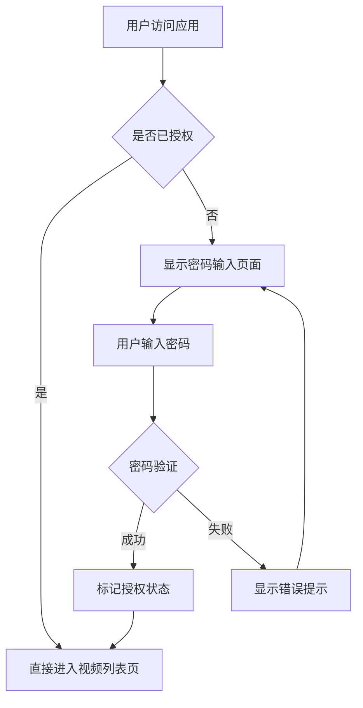
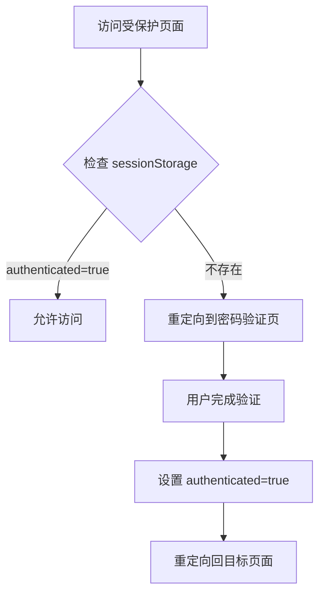
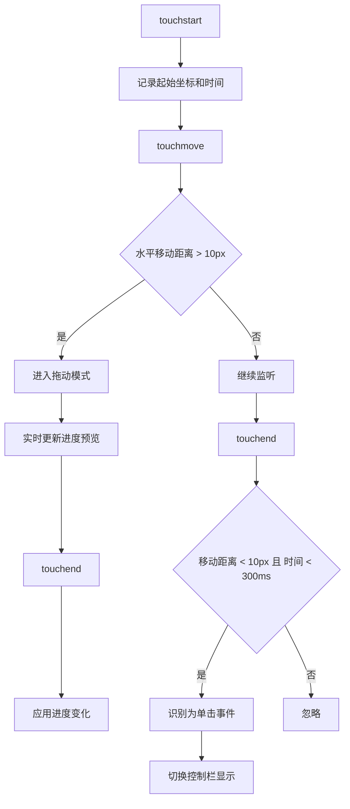
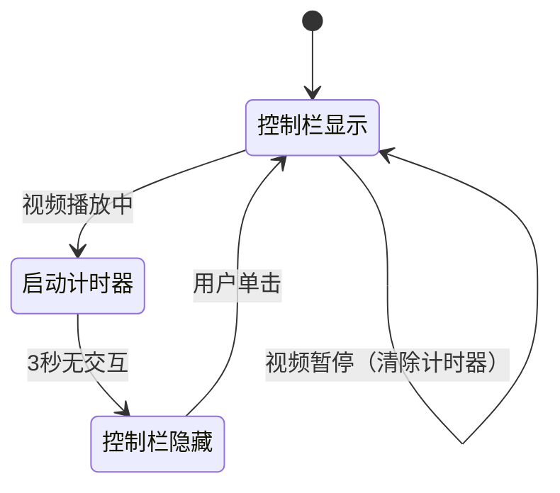
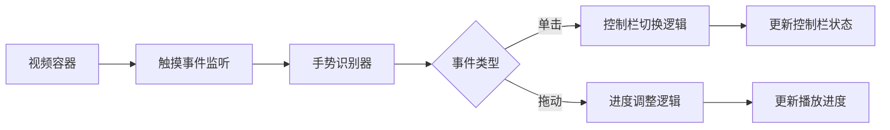

# Web 应用功能增强设计

## 一、需求概述

为现有的视频播放 Web 应用新增以下功能：

1. **密码验证功能**：用户访问应用时需要输入密码验证，验证通过后才能进入视频列表页面
2. **移动端视频播放交互优化**：
   - 支持在视频画面任意位置拖动进行进度调整（不限于进度条）
   - 单击视频画面显示控制栏，再次单击隐藏控制栏

## 二、功能设计

### 2.1 密码验证功能

#### 2.1.1 功能目标

- 在用户首次访问应用时要求输入密码
- 验证成功后记录授权状态，允许访问视频列表
- 提供简单的会话管理机制

#### 2.1.2 交互流程

#### 2.1.3 页面结构设计

**密码验证页面组件**（新建）

| 组件元素 | 说明 |
|---------|------|
| 页面标题 | 显示应用名称或提示信息（如"视频库访问验证"） |
| 密码输入框 | 类型为 password，支持回车键提交 |
| 提交按钮 | 触发密码验证逻辑 |
| 错误提示区 | 密码错误时显示提示信息 |
| 视觉设计 | 采用居中卡片布局，与现有设计风格保持一致 |

#### 2.1.4 验证机制设计

**验证方式**

采用客户端验证方式，密码配置在前端环境变量中：

| 配置项 | 说明 |
|--------|------|
| 密码存储位置 | 环境变量文件（.env.local） |
| 密码变量名 | NEXT_PUBLIC_APP_PASSWORD |
| 默认密码 | 可设置为空或预设值（如 "video123"） |

**授权状态管理**

| 存储方式 | sessionStorage |
|---------|---------------|
| 存储键名 | authenticated |
| 存储值 | "true"（已授权）或不存在（未授权） |
| 生命周期 | 浏览器标签页关闭后失效 |

#### 2.1.5 路由守卫逻辑

需要在以下页面添加访问控制：

| 页面路径 | 访问控制逻辑 |
|---------|-------------|
| /videos | 检查授权状态，未授权则重定向到密码验证页 |
| /videos/play | 检查授权状态，未授权则重定向到密码验证页 |
| / (首页) | 不需要验证，但"浏览视频库"按钮需检查授权 |

**路由守卫流程**

---

### 2.2 移动端视频播放交互优化

#### 2.2.1 功能目标

- 提升移动端观看体验，减少误操作
- 支持更自然的手势交互方式
- 保持控制栏显示逻辑的合理性

#### 2.2.2 交互行为设计

**控制栏显示/隐藏逻辑**

| 触发条件 | 行为 |
|---------|------|
| 单击视频画面 | 切换控制栏显示状态（显示↔隐藏） |
| 播放器初始化 | 控制栏默认显示 |
| 播放状态下3秒无操作 | 自动隐藏控制栏 |
| 暂停状态 | 控制栏保持显示 |
| 用户与控制栏交互 | 重置自动隐藏计时器 |

**视频画面拖动进度控制**

| 交互方式 | 实现逻辑 |
|---------|---------|
| 触摸事件监听 | 监听 touchstart、touchmove、touchend 事件 |
| 拖动方向 | 水平拖动（左右滑动） |
| 进度计算 | 根据拖动距离占屏幕宽度的比例计算进度变化 |
| 反馈提示 | 拖动时显示进度时间预览气泡 |
| 避免冲突 | 区分单击和拖动事件，防止误触发 |

#### 2.2.3 手势识别规则

**手势判断参数**

| 参数 | 值 | 说明 |
|------|-----|------|
| 拖动触发阈值 | 10px | 水平移动超过此距离视为拖动 |
| 单击时间阈值 | 300ms | 触摸时长小于此值视为单击 |
| 单击移动容差 | 10px | 单击允许的最大移动距离 |
| 进度变化倍率 | 0.1% | 每像素移动对应的进度百分比 |

#### 2.2.4 进度预览气泡设计

在拖动过程中，显示半透明提示气泡：

| 元素 | 说明 |
|------|------|
| 显示位置 | 视频画面中央偏上 |
| 显示内容 | 预览时间 / 总时长（如 "1:23 / 5:45"） |
| 视觉样式 | 半透明黑色背景 + 白色文字，圆角矩形 |
| 显示时机 | 拖动开始时显示，touchend 时延迟 300ms 隐藏 |

#### 2.2.5 控制栏显示状态管理

**状态定义**

| 状态值 | 说明 | 触发条件 |
|--------|------|---------|
| visible | 控制栏可见 | 单击视频、用户交互、初始状态 |
| hidden | 控制栏隐藏 | 播放中超时、再次单击 |

**自动隐藏计时器逻辑**

#### 2.2.6 与现有功能的兼容性

| 现有功能 | 兼容性处理 |
|---------|-----------|
| 进度条拖动 | 保留原有进度条交互，与画面拖动功能并存 |
| 播放/暂停按钮 | 保持原有单击按钮逻辑不变 |
| 全屏控制 | 全屏模式下拖动功能同样生效 |
| 控制栏自动隐藏 | 整合到新的显示逻辑中 |

---

## 三、技术实现要点

### 3.1 密码验证模块

#### 3.1.1 组件结构

| 组件 | 职责 |
|------|------|
| AuthGuard 组件 | 路由守卫逻辑，包裹需要保护的页面 |
| PasswordInput 页面 | 密码输入界面 |
| useAuth Hook | 封装授权状态管理逻辑 |

#### 3.1.2 状态管理

使用 React Hooks 管理授权状态：

| Hook | 功能 |
|------|------|
| useState | 维护授权状态 |
| useEffect | 页面加载时检查授权状态 |
| useRouter | 处理路由跳转 |

#### 3.1.3 环境变量配置

需要在项目中添加环境变量文件：

| 文件名 | 说明 |
|--------|------|
| .env.local | 本地开发环境配置 |
| .env.production | 生产环境配置 |

环境变量示例：
- NEXT_PUBLIC_APP_PASSWORD: 设置访问密码

---

### 3.2 视频播放交互模块

#### 3.2.1 事件处理架构

#### 3.2.2 状态管理增强

在现有 MobileVideoPlayer 组件基础上新增状态：

| 状态变量 | 类型 | 说明 |
|---------|------|------|
| isDragging | boolean | 是否正在拖动 |
| dragStartX | number | 拖动起始X坐标 |
| dragStartTime | number | 拖动起始时间戳 |
| previewTime | number | 拖动预览时间 |
| showPreview | boolean | 是否显示预览气泡 |

#### 3.2.3 触摸事件处理流程

| 事件阶段 | 处理内容 |
|---------|---------|
| onTouchStart | 记录起始坐标、时间、当前播放时间 |
| onTouchMove | 计算移动距离、判断是否进入拖动模式、更新预览时间 |
| onTouchEnd | 应用进度变化或触发单击事件、清除拖动状态 |

#### 3.2.4 进度计算公式

拖动进度变化计算：

- 移动像素转换为时间变化：`deltaTime = (deltaX / screenWidth) * totalDuration`
- 新的播放时间：`newTime = clamp(startTime + deltaTime, 0, duration)`
- 其中 clamp 函数确保时间在有效范围内

#### 3.2.5 控制栏显示逻辑重构

需要修改现有的控制栏显示逻辑：

| 改动点 | 说明 |
|--------|------|
| 移除现有 onClick 的 togglePlay | 将单击事件改为控制栏显示切换 |
| 调整 resetControlsTimeout | 整合到新的显示逻辑中 |
| 播放/暂停操作 | 仅通过控制栏按钮触发 |

---

## 四、用户体验优化

### 4.1 密码验证体验

| 优化点 | 实现方式 |
|--------|---------|
| 错误提示友好性 | 使用温和的提示文案，不显示具体的技术错误 |
| 输入便利性 | 支持回车键提交，自动聚焦到输入框 |
| 记忆功能 | 使用 sessionStorage，同一会话期间无需重复输入 |
| 加载状态 | 验证过程中显示加载指示器 |

### 4.2 移动端交互体验

| 优化点 | 实现方式 |
|--------|---------|
| 拖动流畅性 | 使用 requestAnimationFrame 优化渲染 |
| 防抖处理 | 避免频繁的状态更新导致卡顿 |
| 触摸反馈 | 拖动时显示明显的视觉反馈 |
| 误触防护 | 合理设置阈值，区分单击和拖动 |
| 进度限制 | 防止拖动超出视频范围（0 ~ duration） |

### 4.3 视觉一致性

| 设计元素 | 要求 |
|---------|------|
| 配色方案 | 沿用现有的主题色（primary、accent、muted） |
| 字体样式 | 与现有页面保持一致 |
| 动画效果 | 使用 Tailwind CSS 的 transition 类 |
| 响应式设计 | 确保在不同屏幕尺寸下正常显示 |

---

## 五、边界条件与异常处理

### 5.1 密码验证场景

| 场景 | 处理方式 |
|------|---------|
| 未配置密码 | 直接跳过验证，允许访问 |
| 多次输入错误 | 仅提示错误，不锁定（前端无法实现安全的锁定） |
| 刷新页面 | 授权状态保留（sessionStorage 生效） |
| 新标签页 | 需要重新验证（sessionStorage 不跨标签共享） |

### 5.2 视频拖动场景

| 场景 | 处理方式 |
|------|---------|
| 视频未加载完成 | 禁用拖动功能，显示加载状态 |
| 拖动超出范围 | 自动限制在 0 ~ duration 范围内 |
| 快速滑动 | 使用节流（throttle）防止性能问题 |
| 多指触摸 | 只响应第一个触摸点，忽略多余触摸 |
| 拖动过程中网络中断 | 不影响拖动，实际播放时自然缓冲 |

### 5.3 控制栏显示场景

| 场景 | 处理方式 |
|------|---------|
| 拖动时显示控制栏 | 拖动结束后才应用自动隐藏逻辑 |
| 暂停时单击 | 切换控制栏显示，不触发播放 |
| 全屏状态 | 控制栏逻辑保持一致 |
| 加载/错误状态 | 不响应单击，不显示控制栏 |

---

## 六、实现优先级

### 优先级分级

| 优先级 | 功能项 | 理由 |
|--------|--------|------|
| P0（必须） | 密码验证功能 | 核心需求，是访问控制的基础 |
| P0（必须） | 单击切换控制栏 | 基础交互改进，实现简单 |
| P1（重要） | 拖动调整进度 | 重要交互优化，但实现相对复杂 |
| P2（可选） | 进度预览气泡 | 增强体验，但非核心功能 |

### 建议实现顺序

1. 实现密码验证功能（包括页面、路由守卫、状态管理）
2. 实现单击切换控制栏逻辑（修改现有 MobileVideoPlayer）
3. 实现基础拖动进度功能（不含预览气泡）
4. 增强拖动体验（添加预览气泡、优化手势识别）
5. 整体测试与体验优化

---

## 七、测试验证要点

### 7.1 密码验证测试

| 测试点 | 预期结果 |
|--------|---------|
| 首次访问 /videos | 重定向到密码验证页 |
| 输入错误密码 | 显示错误提示，不允许进入 |
| 输入正确密码 | 进入视频列表页 |
| 刷新视频列表页 | 保持授权状态，不需要重新验证 |
| 关闭标签页后重新打开 | 需要重新验证 |
| 从首页点击按钮 | 未授权时先跳转到验证页 |

### 7.2 视频交互测试

| 测试点 | 预期结果 |
|--------|---------|
| 单击视频画面（播放中） | 显示控制栏 |
| 再次单击 | 隐藏控制栏 |
| 播放中 3 秒不操作 | 自动隐藏控制栏 |
| 暂停状态单击 | 切换控制栏显示，不播放视频 |
| 水平拖动视频画面 | 调整播放进度 |
| 短距离移动 | 识别为单击，不调整进度 |
| 竖直方向滑动 | 不触发进度调整（可能是页面滚动） |
| 拖动过程显示预览 | 显示当前预览时间 |

### 7.3 兼容性测试

| 测试环境 | 重点测试项 |
|---------|-----------|
| iOS Safari | 触摸事件、HLS 播放、全屏功能 |
| Android Chrome | 触摸事件、视频播放、手势冲突 |
| 不同屏幕尺寸 | 布局适配、拖动距离计算 |
| 横屏模式 | 控制栏布局、拖动交互 |

---

## 八、风险与注意事项

### 8.1 安全风险

| 风险项 | 说明 | 缓解措施 |
|--------|------|---------|
| 密码明文存储 | 环境变量中的密码为明文 | 添加说明：此方案仅适用于低安全场景，敏感内容需后端验证 |
| 前端验证可绕过 | 客户端代码可被修改 | 如需高安全性，必须实现后端 API 验证 |

### 8.2 技术风险

| 风险项 | 说明 | 缓解措施 |
|--------|------|---------|
| 触摸事件冲突 | 可能与浏览器默认行为冲突 | 使用 preventDefault，但需谨慎处理 |
| 性能问题 | touchmove 事件频繁触发 | 使用节流（throttle）限制处理频率 |
| 不同设备行为差异 | iOS 和 Android 触摸表现可能不同 | 充分测试，必要时针对平台调整参数 |

### 8.3 用户体验风险

| 风险项 | 说明 | 缓解措施 |
|--------|------|---------|
| 拖动误触发 | 用户想单击但不小心移动了手指 | 设置合理的拖动阈值 |
| 控制栏难以唤出 | 自动隐藏后用户不知道如何显示 | 单击视频画面即可显示，逻辑简单明确 |
| 进度调整不准确 | 拖动灵敏度过高或过低 | 提供可配置的灵敏度参数，可后续调整 |

---

## 九、后续优化方向

### 9.1 密码功能增强

| 优化项 | 说明 |
|--------|------|
| 后端验证 API | 实现服务端密码验证，提升安全性 |
| 多用户支持 | 支持不同用户有不同密码和权限 |
| 密码重置机制 | 提供忘记密码的处理流程 |
| Token 机制 | 使用 JWT 等 Token 替代 sessionStorage |

### 9.2 交互功能扩展

| 优化项 | 说明 |
|--------|------|
| 竖直拖动调节音量 | 参考主流视频应用的交互方式 |
| 双击快进/快退 | 双击屏幕左右两侧实现快速跳转 |
| 长按倍速播放 | 长按视频进入快速播放模式 |
| 手势自定义配置 | 允许用户自定义手势行为 |

### 9.3 性能与体验优化

| 优化项 | 说明 |
|--------|------|
| 触摸反馈优化 | 添加触觉反馈（vibration API） |
| 进度预览缩略图 | 拖动时显示视频帧预览 |
| 播放历史记录 | 记住上次播放位置 |
| 播放速度调节 | 提供倍速播放选项 |
