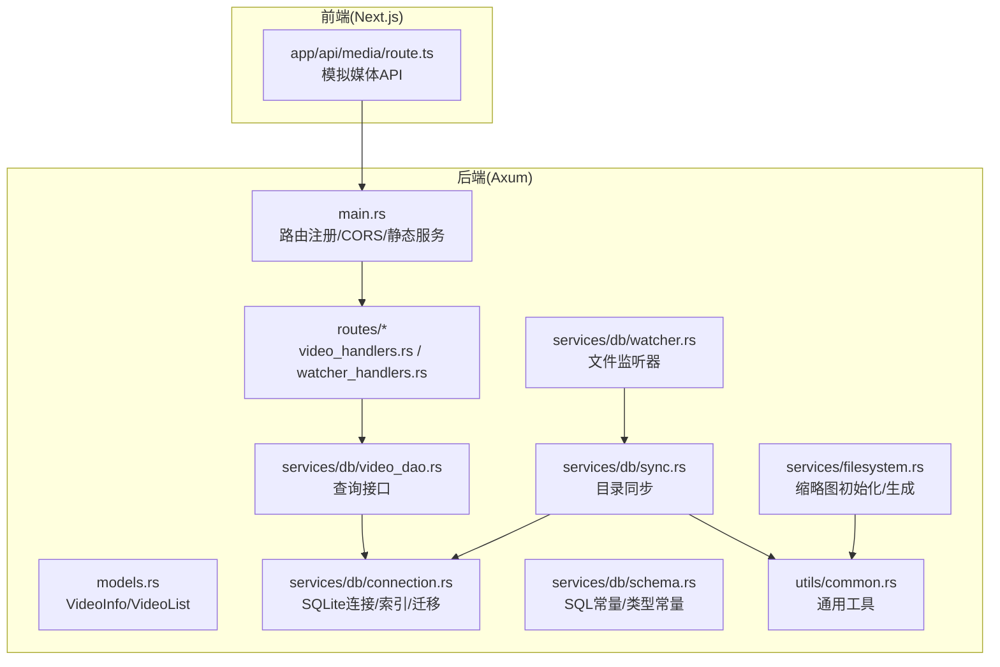
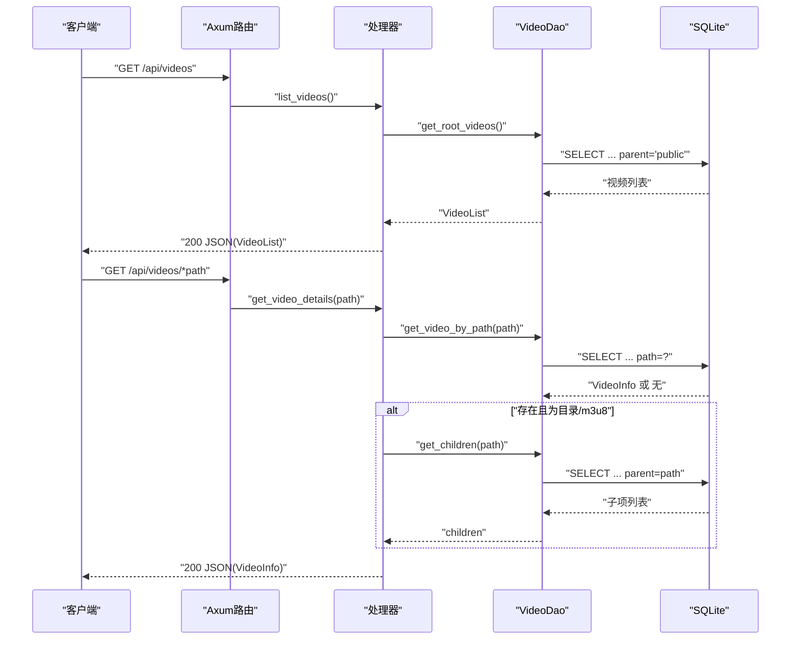
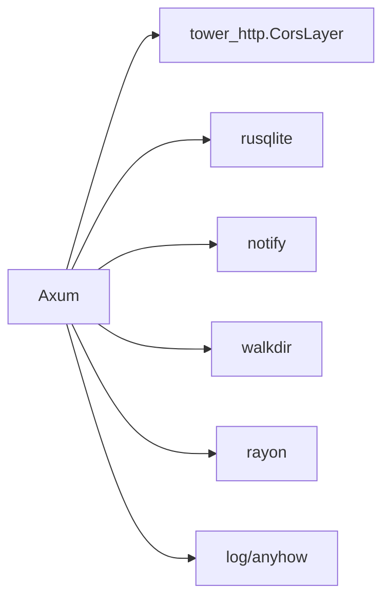

# API参考

<cite>
**本文引用的文件**
- [main.rs](file://app/server/src/main.rs)
- [routes/mod.rs](file://app/server/src/routes/mod.rs)
- [routes/video_handlers.rs](file://app/server/src/routes/video_handlers.rs)
- [routes/watcher_handlers.rs](file://app/server/src/routes/watcher_handlers.rs)
- [models.rs](file://app/server/src/models.rs)
- [services/db/connection.rs](file://app/server/src/services/db/connection.rs)
- [services/db/schema.rs](file://app/server/src/services/db/schema.rs)
- [services/db/video_dao.rs](file://app/server/src/services/db/video_dao.rs)
- [services/db/sync.rs](file://app/server/src/services/db/sync.rs)
- [services/db/tree.rs](file://app/server/src/services/db/tree.rs)
- [services/db/watcher.rs](file://app/server/src/services/db/watcher.rs)
- [services/filesystem.rs](file://app/server/src/services/filesystem.rs)
- [utils/common.rs](file://app/server/src/utils/common.rs)
- [Cargo.toml](file://app/server/Cargo.toml)
- [README.md](file://README.md)
</cite>

## 目录
1. [简介](#简介)
2. [项目结构](#项目结构)
3. [核心组件](#核心组件)
4. [架构总览](#架构总览)
5. [详细组件分析](#详细组件分析)
6. [依赖分析](#依赖分析)
7. [性能考量](#性能考量)
8. [故障排查指南](#故障排查指南)
9. [结论](#结论)
10. [附录](#附录)

## 简介
本文件为视频管理服务的完整API参考文档，覆盖以下内容：
- RESTful API端点清单：HTTP方法、URL模式、请求参数、响应格式
- 视频列表接口、视频详情接口、手动同步接口、文件监控接口的具体实现与行为
- 请求/响应示例（含成功与错误情形）
- 认证机制、CORS配置与安全注意事项
- API版本管理、速率限制与错误代码参考
- 客户端集成指南与最佳实践

## 项目结构
后端采用Rust + Axum框架，提供REST API与静态文件服务；前端位于Next.js应用中，通过路由与类型定义与后端交互。

**图表来源**
- [main.rs](file://app/server/src/main.rs#L62-L90)
- [routes/video_handlers.rs](file://app/server/src/routes/video_handlers.rs#L1-L104)
- [routes/watcher_handlers.rs](file://app/server/src/routes/watcher_handlers.rs#L1-L84)
- [models.rs](file://app/server/src/models.rs#L1-L32)
- [services/db/video_dao.rs](file://app/server/src/services/db/video_dao.rs#L51-L119)
- [services/db/sync.rs](file://app/server/src/services/db/sync.rs#L81-L172)
- [services/db/connection.rs](file://app/server/src/services/db/connection.rs#L10-L47)
- [services/db/schema.rs](file://app/server/src/services/db/schema.rs#L15-L41)
- [services/db/watcher.rs](file://app/server/src/services/db/watcher.rs#L29-L145)
- [services/filesystem.rs](file://app/server/src/services/filesystem.rs#L1-L121)
- [utils/common.rs](file://app/server/src/utils/common.rs#L1-L146)
- [app/web/app/api/media/route.ts](file://app/web/app/api/media/route.ts#L1-L73)

**章节来源**
- [main.rs](file://app/server/src/main.rs#L62-L90)
- [README.md](file://README.md#L130-L164)

## 核心组件
- 应用状态 AppState：封装数据库管理器与文件监听器的共享实例
- 路由层：视频列表、视频详情、手动同步、文件监听器控制
- 数据访问层：VideoDao负责根目录与子目录查询
- 同步层：DirectorySync负责双向同步（文件系统↔数据库）
- 监听层：FileWatcher基于notify实现文件变化监听与自动同步
- 静态服务：/public 与 /thumbnails 提供静态资源访问
- CORS：默认允许所有来源、GET/POST/OPTIONS方法与任意头

**章节来源**
- [main.rs](file://app/server/src/main.rs#L21-L61)
- [main.rs](file://app/server/src/main.rs#L72-L90)
- [routes/mod.rs](file://app/server/src/routes/mod.rs#L1-L6)
- [services/db/video_dao.rs](file://app/server/src/services/db/video_dao.rs#L51-L119)
- [services/db/sync.rs](file://app/server/src/services/db/sync.rs#L81-L172)
- [services/db/watcher.rs](file://app/server/src/services/db/watcher.rs#L29-L145)

## 架构总览
后端启动时初始化数据库、缩略图目录，创建共享状态，挂载路由与CORS中间件；前端Next.js通过本地路由模拟媒体数据API，实际生产中应直接调用后端REST API。

**图表来源**
- [main.rs](file://app/server/src/main.rs#L72-L89)
- [routes/video_handlers.rs](file://app/server/src/routes/video_handlers.rs#L14-L70)
- [services/db/video_dao.rs](file://app/server/src/services/db/video_dao.rs#L51-L119)
- [services/db/schema.rs](file://app/server/src/services/db/schema.rs#L30-L41)

## 详细组件分析

### 视频列表接口
- 方法与路径
  - GET /api/videos
- 请求参数
  - 无
- 成功响应
  - 200 OK
  - 响应体：VideoList
    - videos: VideoInfo[]
- 错误响应
  - 500 Internal Server Error：数据库查询异常
- 响应示例
  - 成功示例：包含若干VideoInfo条目，如 mp4、hls_directory 等类型
  - 失败示例：包含错误信息字符串

**章节来源**
- [main.rs](file://app/server/src/main.rs#L72-L89)
- [routes/video_handlers.rs](file://app/server/src/routes/video_handlers.rs#L14-L28)
- [models.rs](file://app/server/src/models.rs#L28-L32)
- [services/db/video_dao.rs](file://app/server/src/services/db/video_dao.rs#L51-L79)
- [services/db/schema.rs](file://app/server/src/services/db/schema.rs#L30-L34)

### 视频详情接口
- 方法与路径
  - GET /api/videos/{path}
- 请求参数
  - path: 路径参数（相对public目录）
- 成功响应
  - 200 OK
  - 响应体：VideoInfo
    - name: 字符串
    - path: 字符串（/public/...）
    - type: 字符串（mp4、m3u8、ts、subtitle、image、unknown）
    - children?: VideoInfo[]（当type为directory或m3u8时）
    - thumbnail?: 字符串（/thumbnails/...）
    - duration?: 字符串
    - size?: 字符串
    - resolution?: 字符串
    - bitrate?: 字符串
    - codec?: 字符串
    - created_at?: 字符串
    - subtitle?: 字符串（/public/...）
- 错误响应
  - 404 Not Found：数据库中未找到该路径
  - 500 Internal Server Error：数据库查询异常
- 响应示例
  - 成功示例：包含children数组（目录/m3u8）
  - 失败示例：包含错误信息字符串

**章节来源**
- [main.rs](file://app/server/src/main.rs#L76-L84)
- [routes/video_handlers.rs](file://app/server/src/routes/video_handlers.rs#L30-L70)
- [models.rs](file://app/server/src/models.rs#L1-L27)
- [services/db/video_dao.rs](file://app/server/src/services/db/video_dao.rs#L81-L145)
- [services/db/schema.rs](file://app/server/src/services/db/schema.rs#L36-L41)

### 手动同步接口
- 方法与路径
  - GET /api/sync
- 请求参数
  - 无
- 成功响应
  - 200 OK
  - 响应体：JSON对象
    - success: 布尔
    - message: 字符串
    - count: 整数（根目录视频数量）
- 错误响应
  - 500 Internal Server Error：同步过程异常
- 响应示例
  - 成功示例：包含success、message、count
  - 失败示例：包含错误信息字符串

**章节来源**
- [main.rs](file://app/server/src/main.rs#L80-L84)
- [routes/video_handlers.rs](file://app/server/src/routes/video_handlers.rs#L72-L104)
- [services/db/sync.rs](file://app/server/src/services/db/sync.rs#L81-L172)

### 文件监控接口
- 方法与路径
  - GET /api/watcher/start
  - GET /api/watcher/stop
  - GET /api/watcher/status
- 请求参数
  - 无
- 成功响应
  - 200 OK
  - /api/watcher/start：返回WatcherStatus（running: 布尔, message: 字符串）
  - /api/watcher/stop：返回WatcherStatus（running: 布尔, message: 字符串）
  - /api/watcher/status：返回WatcherStatus（running: 布尔, message: 字符串）
- 错误响应
  - 500 Internal Server Error：启动/停止监听器失败
- 响应示例
  - 成功示例：running=true/false，message为对应提示
  - 失败示例：包含错误信息字符串

**章节来源**
- [main.rs](file://app/server/src/main.rs#L82-L88)
- [routes/watcher_handlers.rs](file://app/server/src/routes/watcher_handlers.rs#L18-L84)
- [services/db/watcher.rs](file://app/server/src/services/db/watcher.rs#L29-L145)

### 静态文件服务
- 路径
  - /public/{path}：访问public目录中的文件
  - /thumbnails/{path}：访问缩略图目录中的文件
- 行为
  - 通过ServeDir直接提供静态文件
  - 适合直接播放MP4与HLS资源

**章节来源**
- [main.rs](file://app/server/src/main.rs#L86-L89)
- [services/filesystem.rs](file://app/server/src/services/filesystem.rs#L1-L121)

## 依赖分析
- 框架与中间件
  - Axum、Tokio、tower-http(CorsLayer)
- 数据库与ORM
  - rusqlite（SQLite）
- 文件系统与监控
  - walkdir（目录扫描）、notify（文件监控）、rayon（并行处理）
- 日志与工具
  - log、chrono、regex、anyhow、nu-ansi-term

**图表来源**
- [Cargo.toml](file://app/server/Cargo.toml#L6-L23)

**章节来源**
- [Cargo.toml](file://app/server/Cargo.toml#L6-L23)

## 性能考量
- 监听器防抖：文件变化事件触发后进行5秒防抖，降低频繁同步开销
- 并行缩略图生成：使用rayon对无缩略图文件进行并行处理
- 数据库索引：对path与parent_path建立索引，加速查询
- 仅内容变更过滤：监听器仅对内容变化事件进行处理，减少无关同步
- 建议
  - 大规模视频库建议启用文件监听器并定期调用同步接口
  - 生产环境使用release构建并结合CDN加速静态资源

**章节来源**
- [services/db/watcher.rs](file://app/server/src/services/db/watcher.rs#L54-L88)
- [services/filesystem.rs](file://app/server/src/services/filesystem.rs#L24-L47)
- [services/db/connection.rs](file://app/server/src/services/db/connection.rs#L36-L42)

## 故障排查指南
- CORS相关
  - 默认允许所有来源与方法，若出现跨域问题，检查前端域名与代理配置
- 数据库异常
  - 500错误通常来自数据库查询或同步异常，查看服务日志定位具体SQL或路径
- 监听器问题
  - 若监听器未生效，确认已调用启动接口且路径存在；检查is_watching状态
- 静态资源访问
  - 确认public/thumbnails目录存在且可读；路径需以/public或/thumbnails开头

**章节来源**
- [main.rs](file://app/server/src/main.rs#L62-L90)
- [routes/video_handlers.rs](file://app/server/src/routes/video_handlers.rs#L14-L28)
- [routes/watcher_handlers.rs](file://app/server/src/routes/watcher_handlers.rs#L18-L84)

## 结论
本API提供了视频列表、详情查询、手动同步与文件监控等核心能力，配合静态文件服务可满足MP4与HLS播放需求。默认CORS配置便于前端直连，生产部署建议结合鉴权与限流策略。

## 附录

### API端点一览
- GET /api/videos
  - 请求：无
  - 成功：200，响应体：VideoList
  - 错误：500
- GET /api/videos/{path}
  - 请求：path（相对public目录）
  - 成功：200，响应体：VideoInfo
  - 错误：404、500
- GET /api/sync
  - 请求：无
  - 成功：200，响应体：JSON对象（success/message/count）
  - 错误：500
- GET /api/watcher/start
  - 请求：无
  - 成功：200，响应体：WatcherStatus
  - 错误：500
- GET /api/watcher/stop
  - 请求：无
  - 成功：200，响应体：WatcherStatus
  - 错误：500
- GET /api/watcher/status
  - 请求：无
  - 成功：200，响应体：WatcherStatus

**章节来源**
- [main.rs](file://app/server/src/main.rs#L72-L89)
- [routes/video_handlers.rs](file://app/server/src/routes/video_handlers.rs#L14-L104)
- [routes/watcher_handlers.rs](file://app/server/src/routes/watcher_handlers.rs#L18-L84)

### 数据模型
- VideoInfo
  - 字段：name、path、type、children?、thumbnail?、duration?、size?、resolution?、bitrate?、codec?、created_at?、subtitle?
- VideoList
  - 字段：videos: VideoInfo[]

**章节来源**
- [models.rs](file://app/server/src/models.rs#L1-L32)

### 认证机制、CORS与安全
- 认证
  - 未实现内置认证机制；建议在网关或反向代理层增加鉴权
- CORS
  - 默认允许所有来源、GET/POST/OPTIONS方法与任意头
- 安全
  - 仅提供public/thumbnails静态访问；建议限制写操作与敏感路径
  - 生产环境建议启用HTTPS与速率限制

**章节来源**
- [main.rs](file://app/server/src/main.rs#L62-L90)
- [README.md](file://README.md#L130-L164)

### API版本管理、速率限制与错误代码
- 版本管理
  - 当前未实现版本号路径；建议在路由前缀加入/v1、/v2等
- 速率限制
  - 未内置限流；建议在网关或中间件层实现
- 错误代码
  - 200：成功
  - 404：未找到（视频详情）
  - 500：服务器内部错误（数据库/同步/监听器）

**章节来源**
- [routes/video_handlers.rs](file://app/server/src/routes/video_handlers.rs#L14-L28)
- [routes/video_handlers.rs](file://app/server/src/routes/video_handlers.rs#L30-L70)
- [routes/video_handlers.rs](file://app/server/src/routes/video_handlers.rs#L72-L104)
- [routes/watcher_handlers.rs](file://app/server/src/routes/watcher_handlers.rs#L18-L84)

### 客户端集成指南与最佳实践
- 前端集成
  - 使用fetch或axios调用上述REST端点
  - 播放MP4：直接访问/public/{file}
  - 播放HLS：访问/public/{dir}/index.m3u8
- 最佳实践
  - 先调用视频列表接口，再按需请求详情
  - 对目录/m3u8类型，先获取children再决定播放策略
  - 生产环境启用HTTPS、CORS白名单与鉴权
  - 使用文件监听器自动同步，减少手动调用频率

**章节来源**
- [README.md](file://README.md#L130-L164)
- [main.rs](file://app/server/src/main.rs#L86-L89)