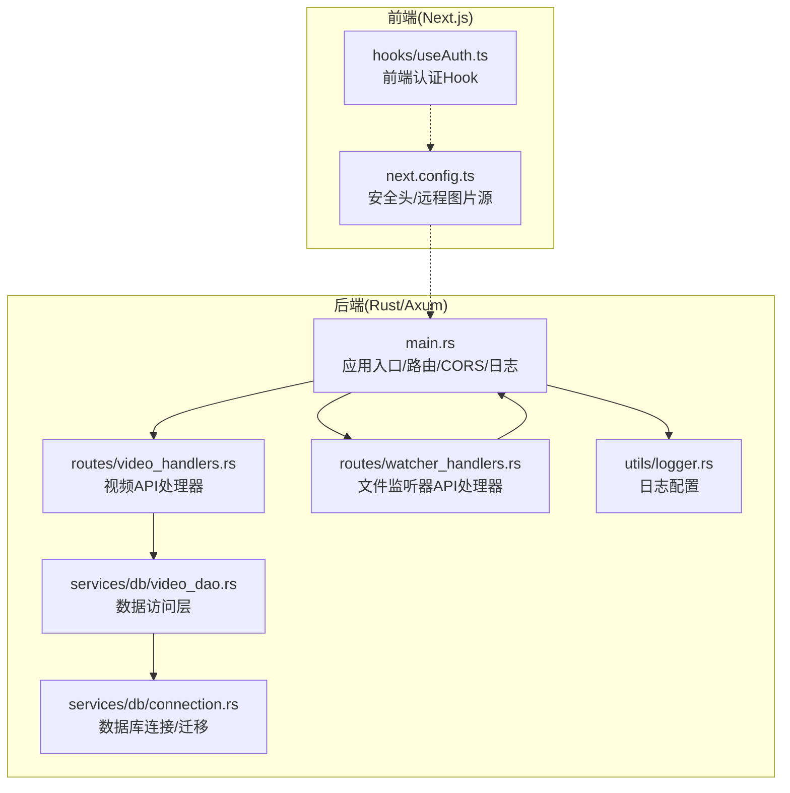
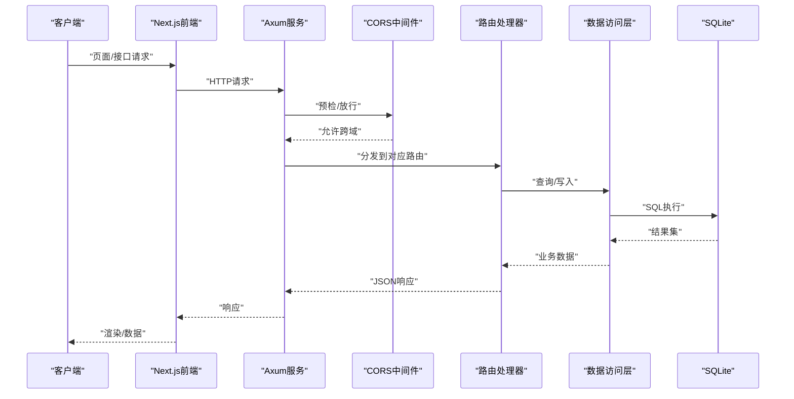
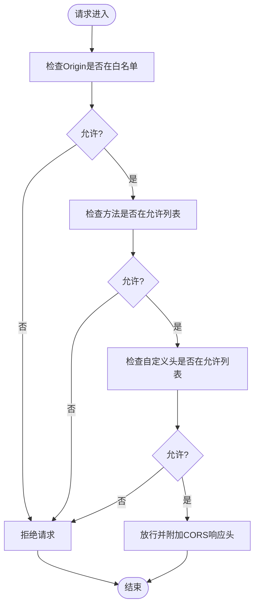
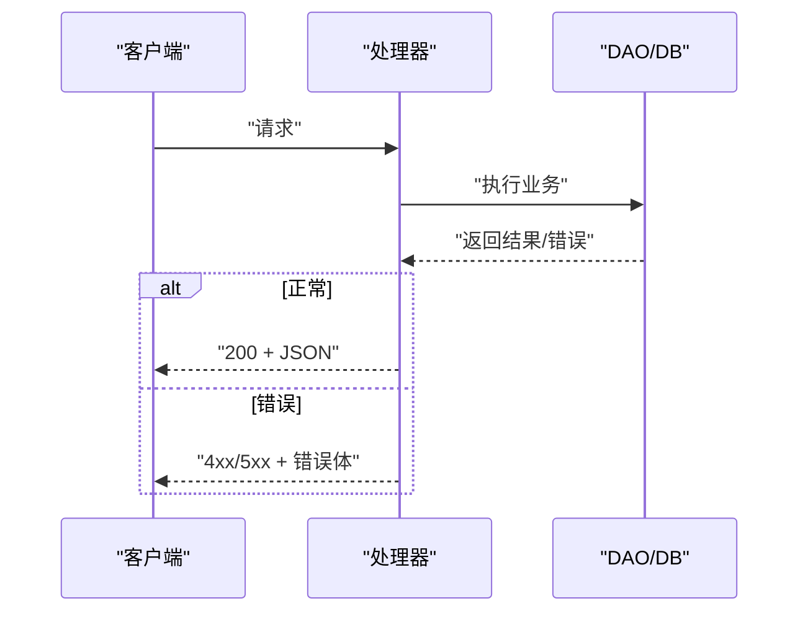
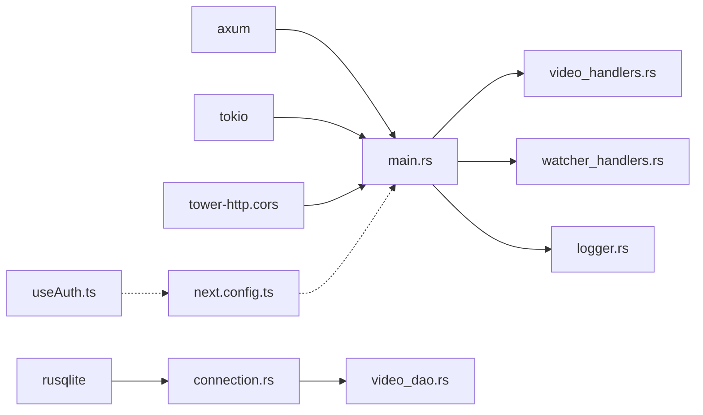

# API认证与安全

<cite>
**本文引用的文件**
- [app/server/src/main.rs](file://app/server/src/main.rs)
- [app/server/src/routes/video_handlers.rs](file://app/server/src/routes/video_handlers.rs)
- [app/server/src/routes/watcher_handlers.rs](file://app/server/src/routes/watcher_handlers.rs)
- [app/server/src/utils/logger.rs](file://app/server/src/utils/logger.rs)
- [app/server/src/services/db/connection.rs](file://app/server/src/services/db/connection.rs)
- [app/server/src/services/db/video_dao.rs](file://app/server/src/services/db/video_dao.rs)
- [app/server/Cargo.toml](file://app/server/Cargo.toml)
- [app/web/next.config.ts](file://app/web/next.config.ts)
- [app/web/hooks/useAuth.ts](file://app/web/hooks/useAuth.ts)
- [app/web/IMPLEMENTATION.md](file://app/web/IMPLEMENTATION.md)
- [app/server/README.md](file://app/server/README.md)
</cite>

## 目录
1. [简介](#简介)
2. [项目结构](#项目结构)
3. [核心组件](#核心组件)
4. [架构总览](#架构总览)
5. [详细组件分析](#详细组件分析)
6. [依赖关系分析](#依赖关系分析)
7. [性能考量](#性能考量)
8. [故障排查指南](#故障排查指南)
9. [结论](#结论)
10. [附录](#附录)

## 简介
本文件聚焦于该视频项目的API认证与安全配置，结合现有实现与可扩展的最佳实践，系统阐述认证机制、CORS配置、安全考虑、API版本管理策略、速率限制、错误处理规范、跨域资源共享（CORS）与浏览器兼容性、API密钥与请求签名、防重放攻击、HTTPS与安全头设置、常见安全威胁防护与监控建议。当前项目为本地应用，因此重点在于记录潜在的安全配置选项与落地建议，帮助未来演进至生产环境时具备明确的参考路径。

## 项目结构
后端采用Rust + Axum框架，前端采用Next.js。后端通过CORS中间件开放全部来源，前端Next配置中预留了安全头与远程图片源的配置空间。认证方面，前端通过会话存储与环境变量实现简易口令校验；后端未实现正式的鉴权/授权机制。

图表来源
- [app/server/src/main.rs](file://app/server/src/main.rs#L1-L110)
- [app/server/src/routes/video_handlers.rs](file://app/server/src/routes/video_handlers.rs#L1-L104)
- [app/server/src/routes/watcher_handlers.rs](file://app/server/src/routes/watcher_handlers.rs#L1-L84)
- [app/server/src/services/db/video_dao.rs](file://app/server/src/services/db/video_dao.rs#L1-L146)
- [app/server/src/services/db/connection.rs](file://app/server/src/services/db/connection.rs#L1-L122)
- [app/server/src/utils/logger.rs](file://app/server/src/utils/logger.rs#L1-L100)
- [app/web/next.config.ts](file://app/web/next.config.ts#L1-L39)
- [app/web/hooks/useAuth.ts](file://app/web/hooks/useAuth.ts#L1-L61)

章节来源
- [app/server/src/main.rs](file://app/server/src/main.rs#L1-L110)
- [app/web/next.config.ts](file://app/web/next.config.ts#L1-L39)

## 核心组件
- 应用入口与路由
  - 路由注册了视频列表、详情、手动同步、文件监听器启停与状态等端点，并挂载CORS中间件。
  - 静态文件服务暴露数据源目录与缩略图目录。
- 视频API处理器
  - 提供视频列表查询、路径详情查询、数据库同步等能力；对数据库错误映射为标准HTTP状态码。
- 文件监听器API处理器
  - 提供监听器启停与状态查询；错误统一映射为HTTP状态码。
- 数据访问层
  - 通过DAO封装数据库查询，支持根目录视频查询、按父路径查询子项、按路径查询单条记录。
- 日志
  - 使用log4rs配置控制台与滚动文件输出，便于审计与问题定位。
- 前端认证
  - 使用sessionStorage存储认证状态，密码来自环境变量，未配置则跳过验证。

章节来源
- [app/server/src/main.rs](file://app/server/src/main.rs#L62-L110)
- [app/server/src/routes/video_handlers.rs](file://app/server/src/routes/video_handlers.rs#L1-L104)
- [app/server/src/routes/watcher_handlers.rs](file://app/server/src/routes/watcher_handlers.rs#L1-L84)
- [app/server/src/services/db/video_dao.rs](file://app/server/src/services/db/video_dao.rs#L1-L146)
- [app/server/src/utils/logger.rs](file://app/server/src/utils/logger.rs#L1-L100)
- [app/web/hooks/useAuth.ts](file://app/web/hooks/useAuth.ts#L1-L61)

## 架构总览
下图展示了从客户端到后端API再到数据库的整体流程，以及CORS中间件在请求链路中的位置。

图表来源
- [app/server/src/main.rs](file://app/server/src/main.rs#L62-L110)
- [app/server/src/routes/video_handlers.rs](file://app/server/src/routes/video_handlers.rs#L1-L104)
- [app/server/src/services/db/video_dao.rs](file://app/server/src/services/db/video_dao.rs#L1-L146)
- [app/server/src/services/db/connection.rs](file://app/server/src/services/db/connection.rs#L1-L122)

## 详细组件分析

### 认证与访问控制
- 当前实现
  - 后端未实现正式的认证/授权机制，所有公开API均可访问。
  - 前端通过sessionStorage与NEXT_PUBLIC_APP_PASSWORD进行简易口令校验；未配置密码时跳过验证。
- 安全建议
  - 引入基于Bearer Token或Cookie的会话/令牌机制，配合HTTPS传输。
  - 在网关或中间件层增加统一的鉴权拦截器，对受保护端点进行权限校验。
  - 对敏感端点（如同步、监听器启停）增加IP白名单或来源校验。
  - 使用CSRF防护（如SameSite Cookie、CSRF Token），防止跨站请求伪造。

章节来源
- [app/web/hooks/useAuth.ts](file://app/web/hooks/useAuth.ts#L1-L61)
- [app/web/IMPLEMENTATION.md](file://app/web/IMPLEMENTATION.md#L55-L114)

### CORS配置与浏览器兼容性
- 当前配置
  - 后端CORS允许任意来源、GET/POST/OPTIONS方法、通配符头部。
  - 前端next.config.ts预留headers钩子，当前未启用。
- 浏览器兼容性
  - 项目文档标注Chrome/Edge/Firefox/Safari移动端均支持。
- 安全建议
  - 生产环境应将allow_origin限制为可信域名集合，避免“*”。
  - 显式列出允许的方法与头，减少预检复杂度。
  - 对于敏感资源，避免暴露凭证或携带敏感头的预检。
  - 结合前端headers钩子，按需注入安全头（如Content-Security-Policy）。

图表来源
- [app/server/src/main.rs](file://app/server/src/main.rs#L62-L71)
- [app/web/next.config.ts](file://app/web/next.config.ts#L1-L39)

章节来源
- [app/server/src/main.rs](file://app/server/src/main.rs#L62-L71)
- [app/web/next.config.ts](file://app/web/next.config.ts#L1-L39)

### API版本管理策略
- 建议
  - 在URL路径中引入版本号（如/api/v1/videos），或通过Accept头协商版本。
  - 对于重大变更，保留旧版本端点一段时间并标注废弃，确保向后兼容。
  - 在OpenAPI/Swagger中维护版本变更日志，便于客户端升级。
- 当前现状
  - 未见显式的版本前缀；建议尽快引入。

章节来源
- [app/server/src/main.rs](file://app/server/src/main.rs#L72-L90)

### 速率限制配置
- 建议
  - 在网关或Axum中间件层实现基于IP/用户/端点的限流，结合内存或Redis存储计数器。
  - 对高频端点（如视频列表、同步）设置更严格的阈值。
  - 返回标准的429状态码与Retry-After头，便于客户端退避重试。
- 当前现状
  - 未实现速率限制；建议在CORS之后、路由分发之前接入中间件。

章节来源
- [app/server/src/main.rs](file://app/server/src/main.rs#L62-L90)

### 错误处理规范
- 现状
  - 视频与监听器处理器对数据库/内部错误统一映射为500，并返回简要错误信息。
  - 成功响应使用标准JSON结构。
- 建议
  - 统一错误模型（含错误码、消息、可选追踪ID），便于前端与日志关联。
  - 区分客户端错误（4xx）与服务端错误（5xx），并在响应体中包含上下文信息。
  - 对敏感错误信息进行脱敏，避免泄露内部细节。

图表来源
- [app/server/src/routes/video_handlers.rs](file://app/server/src/routes/video_handlers.rs#L1-L104)
- [app/server/src/routes/watcher_handlers.rs](file://app/server/src/routes/watcher_handlers.rs#L1-L84)

章节来源
- [app/server/src/routes/video_handlers.rs](file://app/server/src/routes/video_handlers.rs#L1-L104)
- [app/server/src/routes/watcher_handlers.rs](file://app/server/src/routes/watcher_handlers.rs#L1-L84)

### API密钥管理、请求签名与防重放
- 建议
  - 使用短期有效的API密钥（带过期时间），密钥材料仅在服务端存储。
  - 对重要端点启用签名（如HMAC-SHA256），参数包含nonce、timestamp、body摘要等，服务端校验时间窗与nonce唯一性。
  - 对GET/HEAD请求也建议签名，避免缓存劫持。
- 当前现状
  - 未实现API密钥与签名；建议在鉴权中间件中集成。

章节来源
- [app/server/src/main.rs](file://app/server/src/main.rs#L62-L90)

### HTTPS配置、证书管理与安全头
- HTTPS与证书
  - 建议在反向代理（如Nginx/Caddy）或边缘网关启用TLS，使用Let’s Encrypt自动签发与续期。
  - 后端Axum可通过Tokio TLS监听器启用，或由上游代理终止TLS。
- 安全头
  - Content-Security-Policy：限制脚本/样式来源，避免XSS。
  - Strict-Transport-Security：强制HTTPS，提升抗降级风险。
  - X-Content-Type-Options：阻止MIME嗅探。
  - Referrer-Policy：控制引用者信息。
  - Permissions-Policy：声明功能使用范围。
- 前端配置
  - 可在next.config.ts的headers钩子中按需注入上述安全头，注意与CORS策略协调。

章节来源
- [app/web/next.config.ts](file://app/web/next.config.ts#L1-L39)

### 常见安全威胁与防护
- 跨站脚本（XSS）
  - 输入过滤与输出编码；CSP限制内联脚本。
- 跨站请求伪造（CSRF）
  - SameSite Cookie、CSRF Token、来源校验。
- 不安全的直接对象引用（IDOR）
  - 对路径/资源访问进行权限校验，避免越权读取。
- 敏感信息泄露
  - 脱敏错误信息，最小化日志输出；限制敏感头透传。
- 重放攻击
  - 签名+时间窗+nonce；对幂等端点谨慎放宽。
- 速率限制不足
  - 实施IP/用户/端点限流，防止滥用与DoS。

章节来源
- [app/server/src/main.rs](file://app/server/src/main.rs#L62-L110)
- [app/server/src/routes/video_handlers.rs](file://app/server/src/routes/video_handlers.rs#L1-L104)
- [app/server/src/routes/watcher_handlers.rs](file://app/server/src/routes/watcher_handlers.rs#L1-L84)

### 监控与审计
- 日志
  - 使用log4rs输出到文件与控制台，建议区分级别与结构化字段（请求ID、用户、端点、耗时、结果）。
- 指标
  - 暴露Prometheus指标（请求数、错误率、P95/P99延迟、速率限制触发次数）。
- 告警
  - 对异常错误率、慢请求、突发流量、鉴权失败进行告警。
- 审计
  - 对敏感操作（同步、启停监听器）记录审计日志，保留至少90天。

章节来源
- [app/server/src/utils/logger.rs](file://app/server/src/utils/logger.rs#L1-L100)

## 依赖关系分析
- 外部依赖
  - axum、tokio、tower-http（含CORS）、rusqlite、log/log4rs、notify、walkdir、regex、chrono等。
- 内部模块
  - main负责应用生命周期、路由与CORS；routes负责API处理；services/db负责数据访问与SQLite；utils提供日志；web侧提供前端认证与Next配置。

图表来源
- [app/server/Cargo.toml](file://app/server/Cargo.toml#L1-L23)
- [app/server/src/main.rs](file://app/server/src/main.rs#L1-L110)
- [app/server/src/services/db/connection.rs](file://app/server/src/services/db/connection.rs#L1-L122)
- [app/server/src/services/db/video_dao.rs](file://app/server/src/services/db/video_dao.rs#L1-L146)
- [app/web/next.config.ts](file://app/web/next.config.ts#L1-L39)
- [app/web/hooks/useAuth.ts](file://app/web/hooks/useAuth.ts#L1-L61)

章节来源
- [app/server/Cargo.toml](file://app/server/Cargo.toml#L1-L23)

## 性能考量
- 数据库查询
  - 已建立索引以加速路径与父路径查询；建议对常用过滤条件补充索引。
- 并发与锁
  - 处理器中对共享状态使用Mutex，建议评估读多写少场景下的并发粒度，必要时拆分锁或引入RwLock。
- 日志
  - 控制台与文件双通道输出，注意I/O开销；生产环境建议降低级别或异步落盘。
- 静态文件
  - ServeDir直接暴露目录，建议在生产环境由反向代理提供缓存与压缩。

章节来源
- [app/server/src/services/db/connection.rs](file://app/server/src/services/db/connection.rs#L1-L122)
- [app/server/src/utils/logger.rs](file://app/server/src/utils/logger.rs#L1-L100)

## 故障排查指南
- CORS相关
  - 若出现跨域失败，检查后端CORS白名单与前端headers钩子是否冲突。
- 数据库错误
  - 视频API处理器对数据库错误统一返回500，查看日志定位具体SQL与参数。
- 监听器启停
  - 监视器状态与错误返回标准化，结合日志确认启动/停止流程。
- 前端认证
  - 未配置密码时跳过验证；若登录无效，检查环境变量与sessionStorage状态。

章节来源
- [app/server/src/main.rs](file://app/server/src/main.rs#L62-L110)
- [app/server/src/routes/video_handlers.rs](file://app/server/src/routes/video_handlers.rs#L1-L104)
- [app/server/src/routes/watcher_handlers.rs](file://app/server/src/routes/watcher_handlers.rs#L1-L84)
- [app/web/IMPLEMENTATION.md](file://app/web/IMPLEMENTATION.md#L55-L114)

## 结论
当前项目在本地环境下提供了简洁的视频浏览与管理能力，但在认证、CORS白名单、速率限制、安全头与HTTPS等方面尚未完全满足生产安全要求。建议尽快引入鉴权/授权、精细化CORS、限流与签名机制，并完善HTTPS与安全头配置。同时，强化日志与监控体系，持续提升可观测性与安全性。

## 附录
- API端点概览（来源于应用日志打印）
  - GET /api/videos：列出所有视频
  - GET /api/videos/[path]：获取视频详情
  - GET /api/sync：手动数据库同步
  - GET /api/watcher/start：启动文件监听器
  - GET /api/watcher/stop：停止文件监听器
  - GET /api/watcher/status：获取监听器状态
- 前端调用示例（参见后端README）
  - 展示了前端如何调用视频列表与详情端点。

章节来源
- [app/server/src/main.rs](file://app/server/src/main.rs#L92-L107)
- [app/server/README.md](file://app/server/README.md#L177-L219)