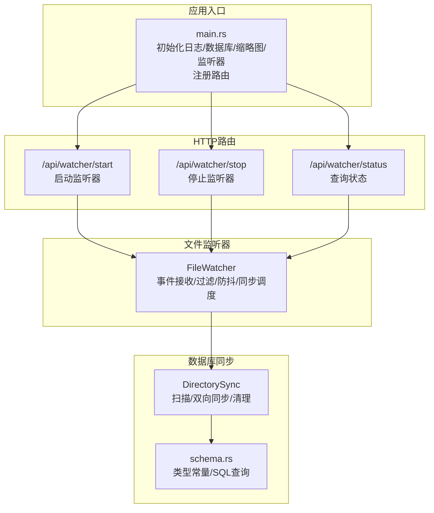
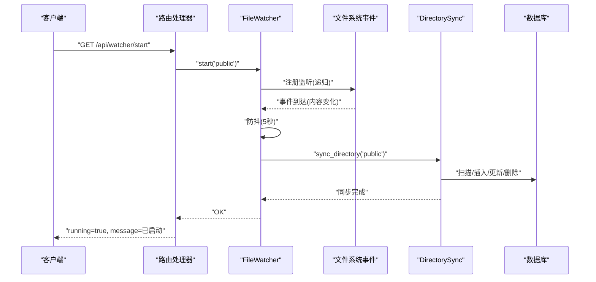
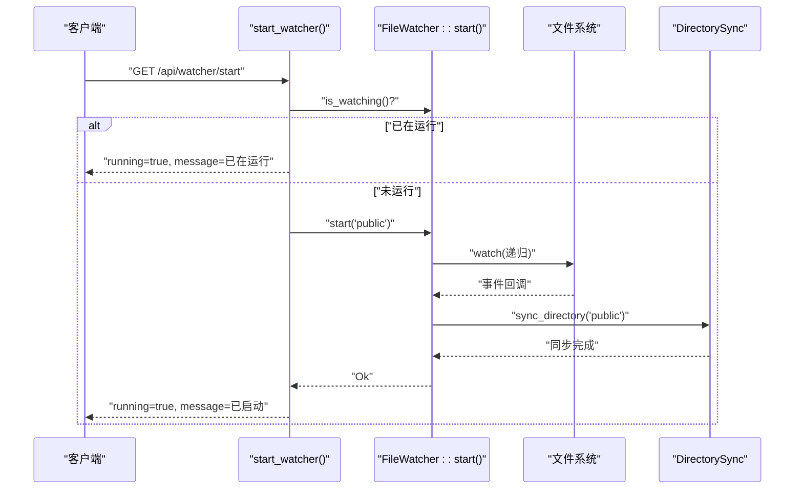
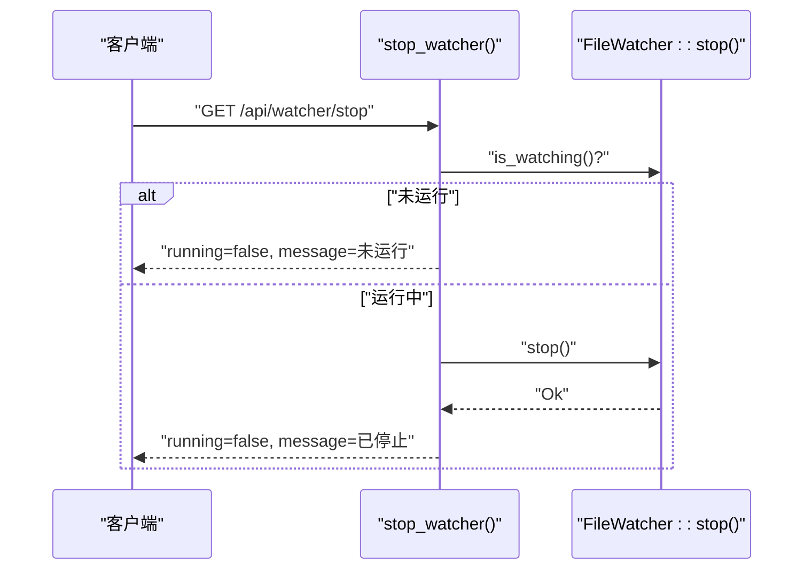
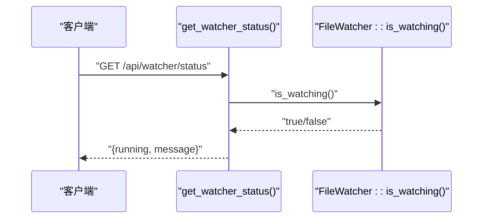
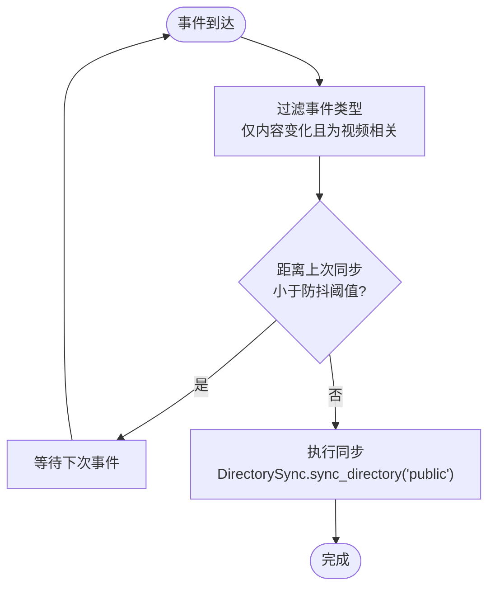
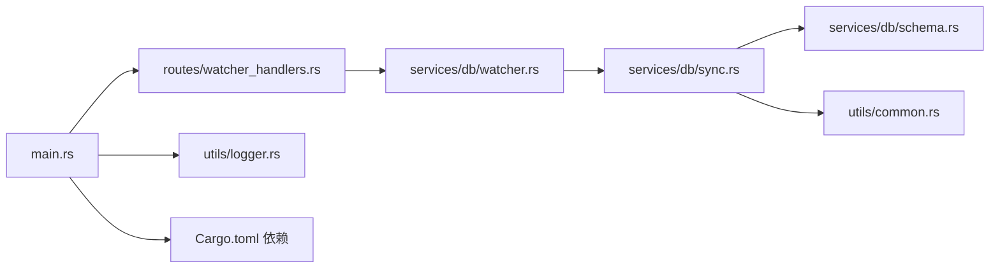

# 文件监控API

<cite>
**本文引用的文件**
- [main.rs](file://app/server/src/main.rs)
- [routes/watcher_handlers.rs](file://app/server/src/routes/watcher_handlers.rs)
- [services/db/watcher.rs](file://app/server/src/services/db/watcher.rs)
- [services/db/sync.rs](file://app/server/src/services/db/sync.rs)
- [services/db/schema.rs](file://app/server/src/services/db/schema.rs)
- [utils/common.rs](file://app/server/src/utils/common.rs)
- [utils/logger.rs](file://app/server/src/utils/logger.rs)
- [Cargo.toml](file://app/server/Cargo.toml)
</cite>

## 目录
1. [简介](#简介)
2. [项目结构](#项目结构)
3. [核心组件](#核心组件)
4. [架构总览](#架构总览)
5. [详细组件分析](#详细组件分析)
6. [依赖关系分析](#依赖关系分析)
7. [性能考量](#性能考量)
8. [故障排查指南](#故障排查指南)
9. [结论](#结论)
10. [附录](#附录)

## 简介
本文件监控API提供对媒体资源目录的自动文件系统事件监听能力，通过HTTP接口实现“启动”“停止”“状态查询”，并在事件触发后自动进行数据库同步。监控器基于跨平台文件系统事件库，采用防抖策略降低频繁同步带来的开销，并支持对视频相关文件类型的过滤与处理。

## 项目结构
- 后端服务入口负责初始化日志、数据库、缩略图目录与文件监听器，并注册API路由。
- 路由层提供三个文件监控相关的HTTP端点：
  - GET /api/watcher/start：启动文件监听器
  - GET /api/watcher/stop：停止文件监听器
  - GET /api/watcher/status：查询监听器状态
- 监听器内部使用事件通道与定时防抖，将文件系统事件转换为数据库同步任务。
- 数据库同步器负责扫描文件系统并双向同步至SQLite数据库。

图表来源
- [main.rs](file://app/server/src/main.rs#L21-L110)
- [routes/watcher_handlers.rs](file://app/server/src/routes/watcher_handlers.rs#L1-L84)
- [services/db/watcher.rs](file://app/server/src/services/db/watcher.rs#L1-L182)
- [services/db/sync.rs](file://app/server/src/services/db/sync.rs#L1-L172)
- [services/db/schema.rs](file://app/server/src/services/db/schema.rs#L1-L42)

章节来源
- [main.rs](file://app/server/src/main.rs#L21-L110)
- [routes/watcher_handlers.rs](file://app/server/src/routes/watcher_handlers.rs#L1-L84)

## 核心组件
- 应用状态 AppState：持有数据库管理器与文件监听器的共享实例，供路由层安全访问。
- 文件监听器 FileWatcher：封装事件监听、过滤、防抖与同步调度逻辑。
- 目录同步器 DirectorySync：负责扫描文件系统并双向同步到数据库。
- 视频类型常量 video_types：统一管理媒体文件类型字符串，便于一致性判断。
- 工具函数：路径过滤、文件类型判定、元数据提取等辅助能力。

章节来源
- [main.rs](file://app/server/src/main.rs#L21-L60)
- [services/db/watcher.rs](file://app/server/src/services/db/watcher.rs#L1-L182)
- [services/db/sync.rs](file://app/server/src/services/db/sync.rs#L1-L172)
- [services/db/schema.rs](file://app/server/src/services/db/schema.rs#L1-L42)
- [utils/common.rs](file://app/server/src/utils/common.rs#L67-L94)

## 架构总览
文件监控API的调用链路如下：
- 客户端通过HTTP请求调用监控端点。
- 路由处理器获取共享状态中的监听器实例，执行相应操作。
- 监听器在收到文件系统事件后，经防抖与过滤，触发数据库同步任务。
- 同步器扫描目标目录，对比数据库记录，执行新增、变更、删除等操作。

图表来源
- [routes/watcher_handlers.rs](file://app/server/src/routes/watcher_handlers.rs#L19-L42)
- [services/db/watcher.rs](file://app/server/src/services/db/watcher.rs#L29-L123)
- [services/db/sync.rs](file://app/server/src/services/db/sync.rs#L81-L172)

## 详细组件分析

### 监控器状态模型
- 状态字段
  - running：布尔值，表示监听器是否处于运行中
  - message：字符串，描述当前状态的简要说明
- 状态枚举值
  - 运行中：running=true，message为“正在运行”
  - 已停止：running=false，message为“已停止”
- 状态来源
  - 通过 is_watching() 返回当前运行状态
  - 路由层根据 is_watching() 构造响应

章节来源
- [routes/watcher_handlers.rs](file://app/server/src/routes/watcher_handlers.rs#L11-L16)
- [routes/watcher_handlers.rs](file://app/server/src/routes/watcher_handlers.rs#L70-L83)
- [services/db/watcher.rs](file://app/server/src/services/db/watcher.rs#L140-L145)

### 启动接口：GET /api/watcher/start
- 功能：启动文件监听器，开始监控指定目录的文件系统事件
- 行为
  - 若监听器已在运行，直接返回“已在运行”的状态
  - 若未运行，尝试启动监听器并返回“已启动”的状态；若启动失败，返回服务器错误
- 关键实现要点
  - 路由层获取 AppState 中的 FileWatcher 并加锁访问
  - 监听器启动时校验目标路径存在性
  - 启动后标记 is_watching=true

图表来源
- [routes/watcher_handlers.rs](file://app/server/src/routes/watcher_handlers.rs#L19-L42)
- [services/db/watcher.rs](file://app/server/src/services/db/watcher.rs#L29-L123)
- [services/db/sync.rs](file://app/server/src/services/db/sync.rs#L81-L172)

章节来源
- [routes/watcher_handlers.rs](file://app/server/src/routes/watcher_handlers.rs#L19-L42)
- [services/db/watcher.rs](file://app/server/src/services/db/watcher.rs#L29-L123)

### 停止接口：GET /api/watcher/stop
- 功能：停止文件监听器，结束监控
- 行为
  - 若监听器未运行，直接返回“未运行”的状态
  - 若运行中，停止监听并清理内部状态，返回“已停止”的状态；若停止失败，返回服务器错误
- 关键实现要点
  - 路由层获取 AppState 中的 FileWatcher 并加锁访问
  - 停止时将 is_watching=false，清理监听器与通道

图表来源
- [routes/watcher_handlers.rs](file://app/server/src/routes/watcher_handlers.rs#L45-L68)
- [services/db/watcher.rs](file://app/server/src/services/db/watcher.rs#L125-L138)

章节来源
- [routes/watcher_handlers.rs](file://app/server/src/routes/watcher_handlers.rs#L45-L68)
- [services/db/watcher.rs](file://app/server/src/services/db/watcher.rs#L125-L138)

### 状态查询接口：GET /api/watcher/status
- 功能：查询文件监听器当前运行状态
- 行为：根据 is_watching() 返回 running 与 message

图表来源
- [routes/watcher_handlers.rs](file://app/server/src/routes/watcher_handlers.rs#L70-L83)
- [services/db/watcher.rs](file://app/server/src/services/db/watcher.rs#L140-L145)

章节来源
- [routes/watcher_handlers.rs](file://app/server/src/routes/watcher_handlers.rs#L70-L83)
- [services/db/watcher.rs](file://app/server/src/services/db/watcher.rs#L140-L145)

### 监控器工作原理与事件处理机制
- 事件监听
  - 使用跨平台事件库创建监听器，递归监控指定目录
  - 设置轮询间隔以提升兼容性
- 事件过滤
  - 仅处理内容变化事件（创建、修改、删除），忽略仅元数据变化
  - 仅对视频相关文件类型进行处理（含容器目录）
- 防抖与同步调度
  - 使用异步通道接收事件，设定固定容量
  - 通过时间戳控制同步频率（默认5秒内去抖）
  - 同步任务在独立任务中运行，避免阻塞事件循环
- 同步策略
  - 扫描文件系统，构建文件映射
  - 对比数据库记录，执行新增、变更（硬删除旧记录再插入新记录）、删除
  - 支持m3u8目录合并与缩略图生成

图表来源
- [services/db/watcher.rs](file://app/server/src/services/db/watcher.rs#L90-L123)
- [services/db/watcher.rs](file://app/server/src/services/db/watcher.rs#L147-L182)
- [services/db/sync.rs](file://app/server/src/services/db/sync.rs#L81-L172)

章节来源
- [services/db/watcher.rs](file://app/server/src/services/db/watcher.rs#L1-L182)
- [services/db/sync.rs](file://app/server/src/services/db/sync.rs#L1-L172)
- [utils/common.rs](file://app/server/src/utils/common.rs#L67-L94)

### 监控器生命周期管理与故障恢复
- 生命周期
  - 启动：创建监听器、启动同步任务、标记运行中
  - 运行：接收事件、防抖、同步
  - 停止：清空监听器与通道、标记停止
- 故障恢复
  - 启动失败：返回服务器错误，提示失败原因（如路径不存在）
  - 停止失败：返回服务器错误，提示失败原因
  - 事件处理失败：记录错误并继续运行，避免中断监听
  - 日志：统一使用日志系统输出运行状态与错误信息

章节来源
- [services/db/watcher.rs](file://app/server/src/services/db/watcher.rs#L29-L138)
- [utils/logger.rs](file://app/server/src/utils/logger.rs#L65-L99)

### 监控器状态枚举值定义与含义
- running：布尔值
  - true：监听器正在运行
  - false：监听器已停止
- message：字符串
  - 正在运行：描述监听器处于运行状态
  - 已停止：描述监听器处于停止状态
  - 已在运行：描述监听器已在运行状态（启动接口特有）

章节来源
- [routes/watcher_handlers.rs](file://app/server/src/routes/watcher_handlers.rs#L11-L16)
- [routes/watcher_handlers.rs](file://app/server/src/routes/watcher_handlers.rs#L24-L31)
- [routes/watcher_handlers.rs](file://app/server/src/routes/watcher_handlers.rs#L48-L57)
- [routes/watcher_handlers.rs](file://app/server/src/routes/watcher_handlers.rs#L70-L83)

### 客户端集成示例与最佳实践
- 客户端集成
  - 启动监控：GET /api/watcher/start
  - 停止监控：GET /api/watcher/stop
  - 轮询状态：GET /api/watcher/status
- 最佳实践
  - 使用轮询查询状态，建议每5-10秒一次，避免过于频繁
  - 在启动前确保目标目录存在且可访问
  - 对错误响应进行友好提示与重试策略
  - 结合业务场景合理设置防抖阈值（默认5秒）

章节来源
- [routes/watcher_handlers.rs](file://app/server/src/routes/watcher_handlers.rs#L19-L83)

## 依赖关系分析
- 外部依赖
  - notify：文件系统事件监听
  - tokio：异步运行时
  - axum：HTTP框架
  - rusqlite：SQLite数据库访问
  - walkdir：目录遍历
  - rayon：并行处理（缩略图生成）
- 内部模块
  - main.rs：应用入口与路由注册
  - routes/watcher_handlers.rs：监控端点路由
  - services/db/watcher.rs：文件监听器实现
  - services/db/sync.rs：目录同步器实现
  - services/db/schema.rs：数据库类型与查询常量
  - utils/common.rs：通用工具函数
  - utils/logger.rs：日志初始化

图表来源
- [main.rs](file://app/server/src/main.rs#L21-L110)
- [routes/watcher_handlers.rs](file://app/server/src/routes/watcher_handlers.rs#L1-L84)
- [services/db/watcher.rs](file://app/server/src/services/db/watcher.rs#L1-L182)
- [services/db/sync.rs](file://app/server/src/services/db/sync.rs#L1-L172)
- [services/db/schema.rs](file://app/server/src/services/db/schema.rs#L1-L42)
- [utils/common.rs](file://app/server/src/utils/common.rs#L67-L94)
- [utils/logger.rs](file://app/server/src/utils/logger.rs#L65-L99)
- [Cargo.toml](file://app/server/Cargo.toml#L1-L23)

章节来源
- [Cargo.toml](file://app/server/Cargo.toml#L1-L23)
- [main.rs](file://app/server/src/main.rs#L21-L110)

## 性能考量
- 事件过滤与防抖
  - 仅处理内容变化且为视频相关文件的事件，减少无效同步
  - 默认5秒防抖，避免频繁同步导致的I/O压力
- 异步处理
  - 事件通过异步通道传递，避免阻塞事件循环
  - 同步任务在独立任务中运行，降低主线程负担
- 目录扫描优化
  - 使用目录映射与哈希表进行快速对比，减少数据库往返
  - 对m3u8目录进行特殊处理，避免重复处理ts文件
- 并行缩略图生成
  - 缩略图生成使用并行迭代器，提高批量处理效率

章节来源
- [services/db/watcher.rs](file://app/server/src/services/db/watcher.rs#L46-L123)
- [services/db/sync.rs](file://app/server/src/services/db/sync.rs#L81-L172)
- [utils/common.rs](file://app/server/src/utils/common.rs#L1-L146)

## 故障排查指南
- 启动失败
  - 路径不存在：检查 DATA_SOURCE_DIR 环境变量与 public 目录
  - 监听器创建失败：查看日志输出，确认系统权限与依赖可用
- 停止失败
  - 监听器未运行：确认状态查询结果
  - 清理失败：查看日志，确认资源释放
- 同步失败
  - 数据库访问异常：检查数据库连接与权限
  - 目录扫描异常：检查目录权限与磁盘空间
- 日志定位
  - 使用日志初始化函数输出运行状态与错误信息
  - 关注 INFO/WARN/ERROR 级别日志，定位问题根因

章节来源
- [services/db/watcher.rs](file://app/server/src/services/db/watcher.rs#L29-L138)
- [utils/logger.rs](file://app/server/src/utils/logger.rs#L65-L99)

## 结论
文件监控API通过简洁的HTTP接口实现了对媒体资源目录的自动化监控与同步。监控器采用事件过滤、防抖与异步处理机制，在保证实时性的同时兼顾性能与稳定性。结合数据库双向同步与类型常量管理，系统能够高效维护媒体索引，满足动态内容场景下的需求。

## 附录
- API端点清单
  - GET /api/watcher/start：启动文件监听器
  - GET /api/watcher/stop：停止文件监听器
  - GET /api/watcher/status：查询监听器状态
- 状态响应结构
  - running：布尔值
  - message：字符串

章节来源
- [routes/watcher_handlers.rs](file://app/server/src/routes/watcher_handlers.rs#L11-L16)
- [routes/watcher_handlers.rs](file://app/server/src/routes/watcher_handlers.rs#L19-L83)