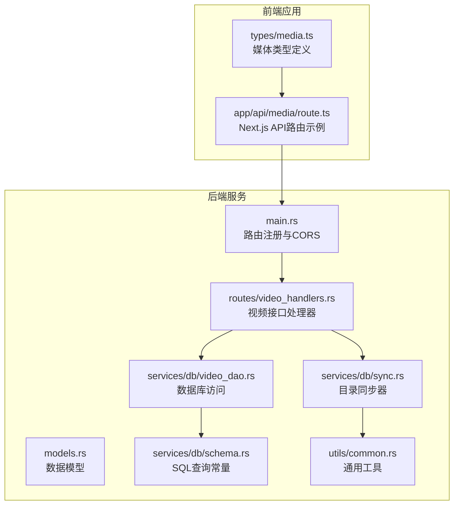
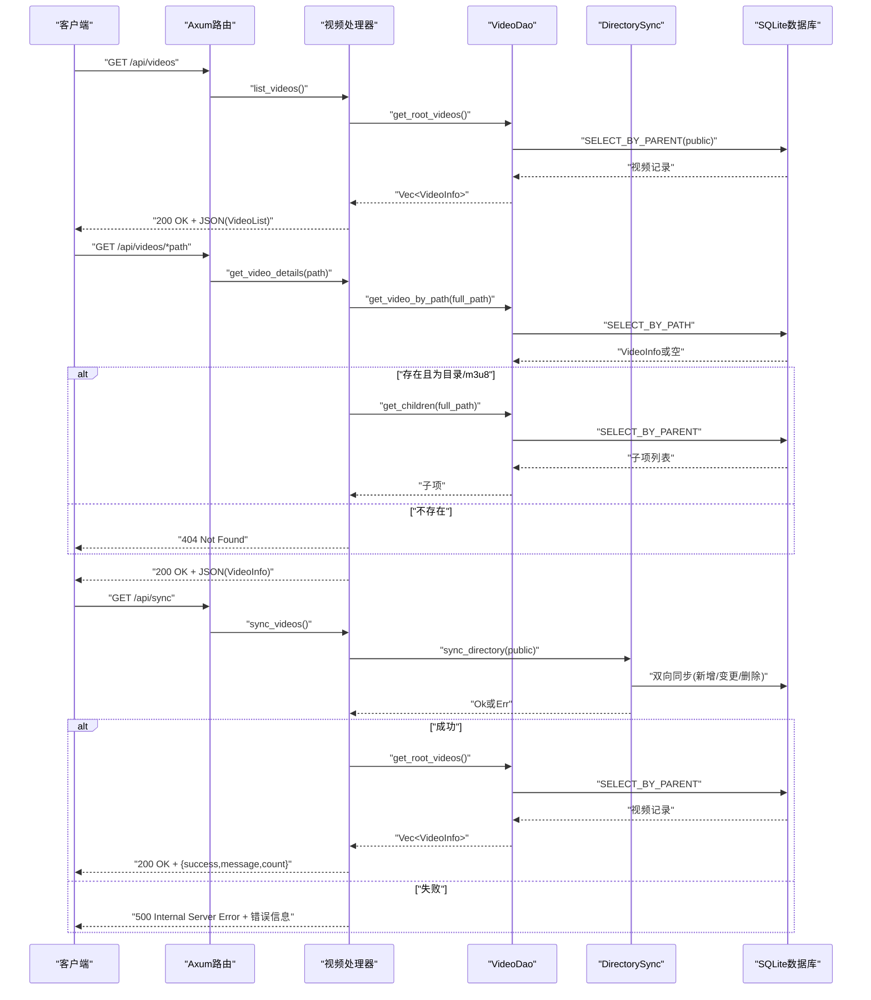
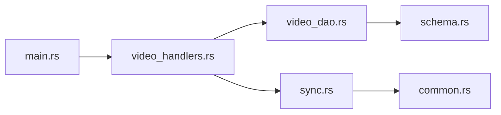

# 视频管理API

<cite>
**本文引用的文件**
- [main.rs](file://app/server/src/main.rs)
- [video_handlers.rs](file://app/server/src/routes/video_handlers.rs)
- [models.rs](file://app/server/src/models.rs)
- [video_dao.rs](file://app/server/src/services/db/video_dao.rs)
- [sync.rs](file://app/server/src/services/db/sync.rs)
- [schema.rs](file://app/server/src/services/db/schema.rs)
- [common.rs](file://app/server/src/utils/common.rs)
- [route.ts](file://app/web/app/api/media/route.ts)
- [media.ts](file://app/web/types/media.ts)
- [README.md](file://README.md)
</cite>

## 目录
1. [简介](#简介)
2. [项目结构](#项目结构)
3. [核心组件](#核心组件)
4. [架构总览](#架构总览)
5. [详细组件分析](#详细组件分析)
6. [依赖关系分析](#依赖关系分析)
7. [性能考量](#性能考量)
8. [故障排查指南](#故障排查指南)
9. [结论](#结论)
10. [附录](#附录)

## 简介
本文件面向视频管理API的使用者与维护者，系统性记录以下三个核心端点：
- 视频列表获取接口：GET /api/videos
- 视频详情获取接口：GET /api/videos/*path
- 数据库同步接口：GET /api/sync

文档覆盖HTTP方法、URL模式、请求参数、响应格式、错误处理策略与状态码说明，并给出客户端调用示例与最佳实践建议。同时对VideoList与VideoInfo数据模型进行结构化说明，帮助前后端协作与集成。

## 项目结构
后端采用Rust + Axum框架，路由在主程序中注册，业务逻辑分布在routes、services与models模块；前端Next.js应用位于web目录，提供媒体页面与API路由示例。

图表来源
- [main.rs](file://app/server/src/main.rs#L70-L90)
- [video_handlers.rs](file://app/server/src/routes/video_handlers.rs#L1-L104)
- [models.rs](file://app/server/src/models.rs#L1-L32)
- [video_dao.rs](file://app/server/src/services/db/video_dao.rs#L1-L146)
- [sync.rs](file://app/server/src/services/db/sync.rs#L1-L413)
- [schema.rs](file://app/server/src/services/db/schema.rs#L1-L42)
- [common.rs](file://app/server/src/utils/common.rs#L1-L146)
- [route.ts](file://app/web/app/api/media/route.ts#L1-L73)
- [media.ts](file://app/web/types/media.ts#L1-L20)

章节来源
- [main.rs](file://app/server/src/main.rs#L70-L110)
- [README.md](file://README.md#L130-L164)

## 核心组件
- 路由与入口
  - 主程序负责注册API路由、CORS中间件与静态文件服务，暴露三个视频相关端点与文件监听器控制端点。
- 视频接口处理器
  - list_videos：从数据库查询public根目录下的视频与目录。
  - get_video_details：根据路径查询视频详情，若为目录或m3u8则返回其子项。
  - sync_videos：手动触发数据库与文件系统的双向同步。
- 数据访问层
  - VideoDao封装数据库查询，提供根目录查询、按路径查询、子项查询等能力。
- 同步器
  - DirectorySync实现文件系统扫描与数据库双向同步，支持m3u8目录特殊处理与增量同步。
- 数据模型
  - VideoInfo与VideoList用于序列化响应，包含名称、路径、类型、可选子项与多媒体元数据。

章节来源
- [main.rs](file://app/server/src/main.rs#L70-L110)
- [video_handlers.rs](file://app/server/src/routes/video_handlers.rs#L1-L104)
- [video_dao.rs](file://app/server/src/services/db/video_dao.rs#L51-L146)
- [models.rs](file://app/server/src/models.rs#L1-L32)
- [sync.rs](file://app/server/src/services/db/sync.rs#L81-L172)

## 架构总览
后端以Axum Router为中心，路由到各处理器；处理器通过VideoDao访问数据库，必要时调用DirectorySync执行同步；响应统一使用JSON序列化，错误通过HTTP状态码与错误消息返回。

图表来源
- [main.rs](file://app/server/src/main.rs#L70-L90)
- [video_handlers.rs](file://app/server/src/routes/video_handlers.rs#L1-L104)
- [video_dao.rs](file://app/server/src/services/db/video_dao.rs#L51-L146)
- [sync.rs](file://app/server/src/services/db/sync.rs#L81-L172)

## 详细组件分析

### 视频列表获取接口：GET /api/videos
- HTTP方法与URL
  - 方法：GET
  - 路径：/api/videos
- 请求参数
  - 无查询参数
- 响应格式
  - 成功：200 OK，JSON对象，包含videos字段，值为VideoInfo数组
  - 失败：500 Internal Server Error，JSON字符串错误信息
- 处理流程
  - 从应用状态中获取数据库管理器，构造VideoDao
  - 调用get_root_videos()查询public根目录下的视频与目录
  - 将结果包装为VideoList并返回
- 错误处理
  - 数据库查询异常时返回500与错误信息
- 响应示例
  - 成功示例：包含若干VideoInfo对象，其中type可能为mp4、m3u8、ts、subtitle、image等
  - 失败示例：{"error":"Database error: ..."}
- 最佳实践
  - 前端应缓存列表结果，减少重复请求
  - 对大列表建议配合分页（当前实现未提供分页）

章节来源
- [main.rs](file://app/server/src/main.rs#L70-L80)
- [video_handlers.rs](file://app/server/src/routes/video_handlers.rs#L14-L28)
- [video_dao.rs](file://app/server/src/services/db/video_dao.rs#L51-L79)
- [schema.rs](file://app/server/src/services/db/schema.rs#L30-L34)

### 视频详情获取接口：GET /api/videos/*path
- HTTP方法与URL
  - 方法：GET
  - 路径：/api/videos/*path
  - 参数：*path为相对路径（例如1221或video1.mp4）
- 请求参数
  - 路径参数：*path（可选前缀斜杠会被移除）
- 响应格式
  - 成功：200 OK，JSON对象，为VideoInfo
  - 失败：404 Not Found（路径不在数据库中），或500 Internal Server Error（数据库错误）
- 处理流程
  - 构造完整路径（public/...）
  - 通过VideoDao.get_video_by_path()查询
  - 若存在且类型为directory或m3u8，则附加children字段（子项列表）
  - 不存在则返回404
- 错误处理
  - 数据库查询异常返回500
  - 路径不存在返回404
- 响应示例
  - 成功示例：包含name、path、type、children（当为目录或m3u8时）、可选thumbnail、duration、size、resolution、bitrate、codec、created_at、subtitle
  - 失败示例：{"error":"Path not found in database"} 或 {"error":"Database error: ..."}
- 最佳实践
  - 前端应区分目录与文件，目录需二次请求子项
  - 对m3u8目录返回空children（文件不单独存储）

章节来源
- [main.rs](file://app/server/src/main.rs#L76-L80)
- [video_handlers.rs](file://app/server/src/routes/video_handlers.rs#L30-L70)
- [video_dao.rs](file://app/server/src/services/db/video_dao.rs#L81-L119)
- [schema.rs](file://app/server/src/services/db/schema.rs#L35-L41)

### 数据库同步接口：GET /api/sync
- HTTP方法与URL
  - 方法：GET
  - 路径：/api/sync
- 请求参数
  - 无查询参数
- 响应格式
  - 成功：200 OK，JSON对象，包含success、message与count（当前根目录视频数量）
  - 失败：500 Internal Server Error，JSON字符串错误信息
- 处理流程
  - 通过DirectorySync.sync_directory()执行双向同步
  - 同步完成后再次查询根目录视频数量，返回count
- 错误处理
  - 同步失败返回500与错误信息
- 响应示例
  - 成功示例：{"success":true,"message":"Database synchronized successfully","count":N}
  - 失败示例：{"error":"Sync error: ..."}
- 最佳实践
  - 在批量文件变更后调用该接口
  - 建议在后台定时任务中定期同步，避免阻塞请求

章节来源
- [main.rs](file://app/server/src/main.rs#L78-L80)
- [video_handlers.rs](file://app/server/src/routes/video_handlers.rs#L72-L104)
- [sync.rs](file://app/server/src/services/db/sync.rs#L81-L172)

### 数据模型：VideoInfo 与 VideoList
- VideoInfo
  - 字段定义与类型
    - name: 字符串，文件或目录名称
    - path: 字符串，数据库中的绝对路径
    - type: 字符串，类型枚举（mp4、m3u8、ts、subtitle、image、unknown）
    - children: 可选数组，VideoInfo[]，仅当type为directory或m3u8时存在
    - thumbnail: 可选字符串，缩略图路径
    - duration: 可选字符串，时长
    - size: 可选字符串，文件大小（格式化字符串）
    - resolution: 可选字符串，分辨率
    - bitrate: 可选字符串，比特率
    - codec: 可选字符串，编码信息
    - created_at: 可选字符串，创建时间
    - subtitle: 可选字符串，字幕文件路径
  - 序列化规则
    - children、thumbnail、duration、size、resolution、bitrate、codec、created_at、subtitle在None时不输出
- VideoList
  - 字段定义与类型
    - videos: 数组，VideoInfo[]
- 关键实现位置
  - VideoInfo定义与序列化规则
  - VideoList定义
  - VideoDao查询结果映射到VideoInfo
  - SQL查询常量定义

章节来源
- [models.rs](file://app/server/src/models.rs#L1-L32)
- [video_dao.rs](file://app/server/src/services/db/video_dao.rs#L19-L145)
- [schema.rs](file://app/server/src/services/db/schema.rs#L15-L41)

### 错误处理策略与状态码
- 404 Not Found
  - 当get_video_details查询不到路径或类型不存在时返回
- 500 Internal Server Error
  - 数据库查询异常或同步失败时返回
- CORS
  - 默认允许所有来源、方法与头部，便于前端跨域调用

章节来源
- [video_handlers.rs](file://app/server/src/routes/video_handlers.rs#L19-L28)
- [video_handlers.rs](file://app/server/src/routes/video_handlers.rs#L44-L70)
- [video_handlers.rs](file://app/server/src/routes/video_handlers.rs#L79-L104)
- [main.rs](file://app/server/src/main.rs#L62-L71)

### 客户端调用示例与最佳实践
- JavaScript（fetch）
  - 获取视频列表
    - fetch("http://localhost:3000/api/videos")
  - 获取视频详情
    - fetch("http://localhost:3000/api/videos/1221")
    - fetch("http://localhost:3000/api/videos/video1.mp4")
  - 手动同步
    - fetch("http://localhost:3000/api/sync")
- 最佳实践
  - 使用缓存与节流，避免频繁请求
  - 对目录型响应（type为directory或m3u8）再请求子项
  - 对HLS目录（m3u8）不单独存储子项，children为空
  - 前端类型定义可参考web/types/media.ts中的MediaItem接口

章节来源
- [README.md](file://README.md#L135-L218)
- [route.ts](file://app/web/app/api/media/route.ts#L1-L73)
- [media.ts](file://app/web/types/media.ts#L1-L20)

## 依赖关系分析
- 组件耦合
  - 路由层仅依赖处理器；处理器依赖DAO与同步器；DAO依赖数据库连接与查询常量；同步器依赖工具函数与数据库连接。
- 外部依赖
  - Axum、Tokio、Tower-HTTP、rusqlite、walkdir、chrono等
- 潜在循环依赖
  - 代码组织清晰，未发现循环导入

图表来源
- [video_handlers.rs](file://app/server/src/routes/video_handlers.rs#L1-L104)
- [video_dao.rs](file://app/server/src/services/db/video_dao.rs#L1-L146)
- [sync.rs](file://app/server/src/services/db/sync.rs#L1-L413)
- [schema.rs](file://app/server/src/services/db/schema.rs#L1-L42)
- [common.rs](file://app/server/src/utils/common.rs#L1-L146)
- [main.rs](file://app/server/src/main.rs#L70-L110)

章节来源
- [main.rs](file://app/server/src/main.rs#L70-L110)
- [video_handlers.rs](file://app/server/src/routes/video_handlers.rs#L1-L104)
- [video_dao.rs](file://app/server/src/services/db/video_dao.rs#L1-L146)
- [sync.rs](file://app/server/src/services/db/sync.rs#L1-L413)
- [schema.rs](file://app/server/src/services/db/schema.rs#L1-L42)
- [common.rs](file://app/server/src/utils/common.rs#L1-L146)

## 性能考量
- 异步I/O与并发
  - 基于Tokio与Axum的异步架构，适合高并发请求
- 数据库查询
  - 使用预编译语句与索引友好查询（按parent_path与排序）
- 目录扫描
  - 使用walkdir递归扫描，注意大目录的性能开销；可考虑限制扫描深度或启用增量同步
- 静态文件服务
  - 通过ServeDir提供public与thumbnails目录的静态访问，建议结合CDN加速

[本节为通用性能建议，不直接分析具体文件]

## 故障排查指南
- 404 Not Found
  - 确认路径是否存在于数据库；首次运行需先执行同步
- 500 Internal Server Error
  - 检查数据库连接与权限；查看服务日志定位具体错误
- 同步无效
  - 确认public目录存在且可读；调用/api/sync后再次查询列表确认
- CORS问题
  - 默认允许所有来源，若前端跨域仍失败，检查代理与网络配置

章节来源
- [video_handlers.rs](file://app/server/src/routes/video_handlers.rs#L19-L28)
- [video_handlers.rs](file://app/server/src/routes/video_handlers.rs#L44-L70)
- [video_handlers.rs](file://app/server/src/routes/video_handlers.rs#L79-L104)
- [main.rs](file://app/server/src/main.rs#L62-L71)

## 结论
本API围绕视频列表、详情与数据库同步三大核心能力，提供了简洁稳定的REST接口。通过VideoInfo与VideoList模型，前后端可以清晰地交换视频元数据与目录结构。建议在生产环境中结合缓存、CDN与定时同步策略，进一步提升性能与可靠性。

[本节为总结性内容，不直接分析具体文件]

## 附录

### API定义汇总
- GET /api/videos
  - 请求：无
  - 成功：200 OK，JSON对象，包含videos数组
  - 失败：500 Internal Server Error
- GET /api/videos/*path
  - 请求：路径参数*path
  - 成功：200 OK，JSON对象，VideoInfo
  - 失败：404 Not Found 或 500 Internal Server Error
- GET /api/sync
  - 请求：无
  - 成功：200 OK，JSON对象，包含success、message与count
  - 失败：500 Internal Server Error

章节来源
- [main.rs](file://app/server/src/main.rs#L70-L80)
- [video_handlers.rs](file://app/server/src/routes/video_handlers.rs#L14-L104)
- [models.rs](file://app/server/src/models.rs#L1-L32)