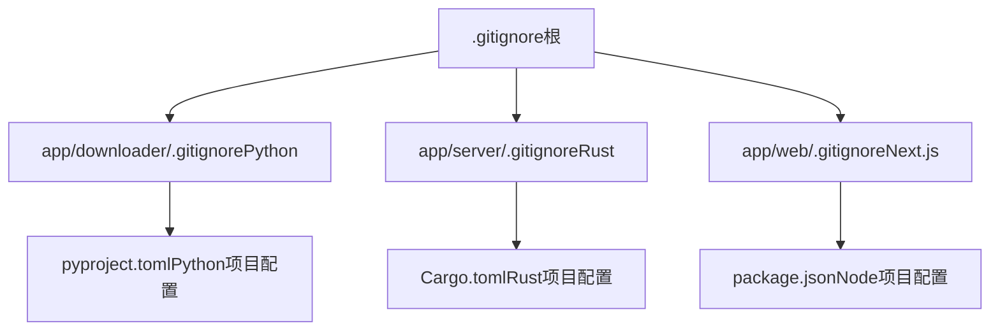
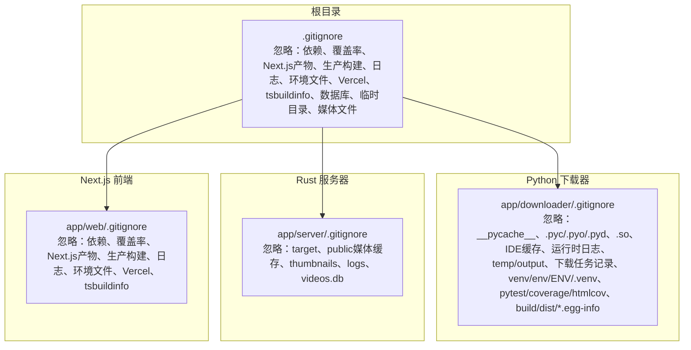
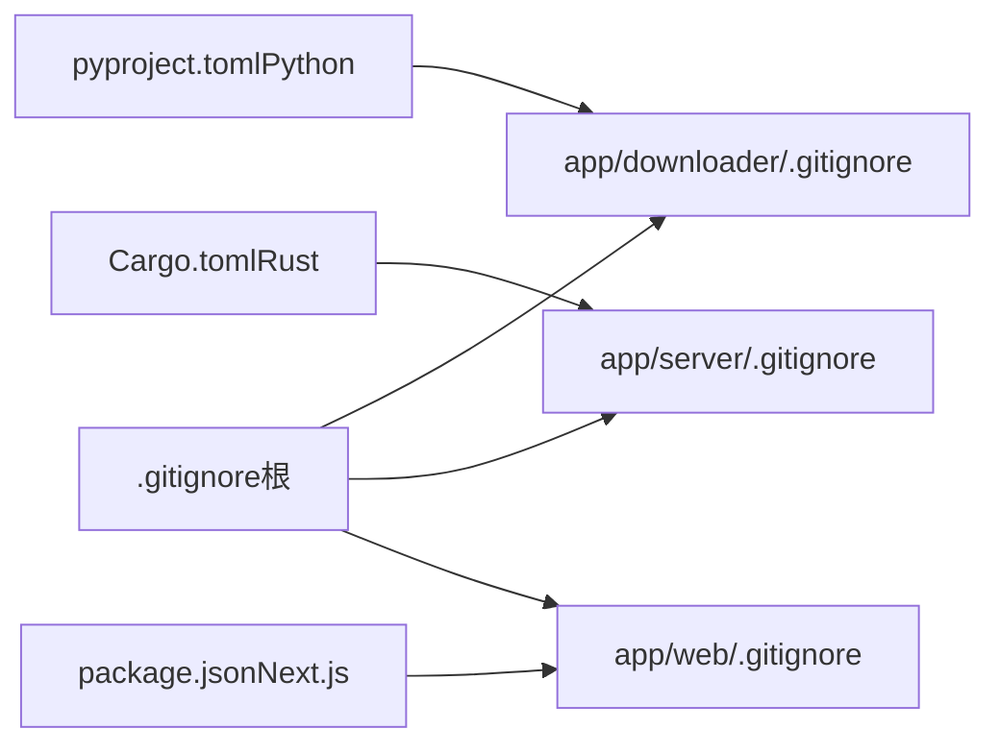

# Git忽略配置

<cite>
**本文引用的文件**
- [.gitignore](file://.gitignore)
- [app/downloader/.gitignore](file://app/downloader/.gitignore)
- [app/server/.gitignore](file://app/server/.gitignore)
- [app/web/.gitignore](file://app/web/.gitignore)
- [app/downloader/pyproject.toml](file://app/downloader/pyproject.toml)
- [app/server/Cargo.toml](file://app/server/Cargo.toml)
- [app/web/package.json](file://app/web/package.json)
- [README.md](file://README.md)
</cite>

## 目录
1. [引言](#引言)
2. [项目结构](#项目结构)
3. [核心组件](#核心组件)
4. [架构总览](#架构总览)
5. [详细组件分析](#详细组件分析)
6. [依赖关系分析](#依赖关系分析)
7. [性能考量](#性能考量)
8. [故障排查指南](#故障排查指南)
9. [结论](#结论)
10. [附录](#附录)

## 引言
本文件聚焦于该仓库中的 Git 忽略配置，系统梳理根目录与各子模块（下载器、服务器、前端）各自的 .gitignore 规则，解释其背后的设计意图与对版本控制的影响，并给出最佳实践建议与常见问题排查方法。读者无需深入代码即可理解如何正确配置忽略规则以避免将临时文件、构建产物、日志与敏感信息纳入版本控制。

## 项目结构
该仓库采用多模块组织方式：
- 根目录包含全局忽略规则，覆盖通用依赖、构建产物、日志与环境文件等。
- app/downloader：Python 下载器模块，包含独立的 .gitignore 与构建/打包产物忽略规则。
- app/server：Rust 服务器模块，包含独立的 .gitignore 与二进制/缓存产物忽略规则。
- app/web：Next.js 前端模块，包含独立的 .gitignore 与 Next.js 构建产物、依赖与调试日志忽略规则。

图表来源
- [.gitignore](file://.gitignore#L1-L46)
- [app/downloader/.gitignore](file://app/downloader/.gitignore#L1-L37)
- [app/server/.gitignore](file://app/server/.gitignore#L1-L5)
- [app/web/.gitignore](file://app/web/.gitignore#L1-L42)
- [app/downloader/pyproject.toml](file://app/downloader/pyproject.toml#L1-L17)
- [app/server/Cargo.toml](file://app/server/Cargo.toml#L1-L23)
- [app/web/package.json](file://app/web/package.json#L1-L74)

章节来源
- [.gitignore](file://.gitignore#L1-L46)
- [app/downloader/.gitignore](file://app/downloader/.gitignore#L1-L37)
- [app/server/.gitignore](file://app/server/.gitignore#L1-L5)
- [app/web/.gitignore](file://app/web/.gitignore#L1-L42)

## 核心组件
- 根目录 .gitignore：统一忽略 Node 依赖、测试覆盖率、Next.js 构建产物、生产构建输出、调试日志、环境文件、Vercel 相关文件、TypeScript 构建信息、数据库文件、临时目录与媒体文件等；同时显式排除部分 Yarn 插件与补丁目录，便于团队协作时保留必要的包管理器扩展。
- app/downloader/.gitignore：针对 Python 环境与产物，忽略 Python 缓存、运行时日志、临时/输出目录、下载任务记录、虚拟环境目录、pytest 缓存与覆盖率产物、构建与分发产物等。
- app/server/.gitignore：针对 Rust 产物，忽略编译输出目录、公共资源与缩略图缓存目录、日志目录与数据库文件，确保只提交源代码与必要的配置。
- app/web/.gitignore：针对 Next.js 产物，忽略 Node 依赖、测试覆盖率、Next.js 构建产物、生产构建输出、调试日志、环境文件、Vercel 相关文件、TypeScript 构建信息等。

章节来源
- [.gitignore](file://.gitignore#L1-L46)
- [app/downloader/.gitignore](file://app/downloader/.gitignore#L1-L37)
- [app/server/.gitignore](file://app/server/.gitignore#L1-L5)
- [app/web/.gitignore](file://app/web/.gitignore#L1-L42)

## 架构总览
下图展示了各模块的忽略策略与其对版本控制的影响范围，帮助理解何时应提交/忽略某类文件。

图表来源
- [.gitignore](file://.gitignore#L1-L46)
- [app/downloader/.gitignore](file://app/downloader/.gitignore#L1-L37)
- [app/server/.gitignore](file://app/server/.gitignore#L1-L5)
- [app/web/.gitignore](file://app/web/.gitignore#L1-L42)

## 详细组件分析

### 根目录 .gitignore（全局）
- 依赖与包管理：忽略 Node 依赖目录与 Yarn/PNPM 特定文件，保留 Yarn 插件与补丁目录以便团队协作。
- 测试与构建：忽略覆盖率目录、Next.js 构建产物与 out 目录、生产构建输出。
- 日志与调试：忽略 npm/yarn/pnpm 调试日志与通用 .log 文件。
- 环境与平台：忽略 .env* 环境文件（可按需提交）、.DS_Store、*.pem；保留 .vercel 以支持 Vercel 部署。
- TypeScript：忽略 tsbuildinfo 与 next-env.d.ts。
- 媒体与数据库：忽略 videos.db、临时目录与媒体文件，避免将大量媒体文件纳入版本库。

章节来源
- [.gitignore](file://.gitignore#L1-L46)

### Python 下载器 .gitignore（app/downloader/.gitignore）
- Python 缓存与字节码：忽略 __pycache__、.pyc/.pyo/.pyd、*.so，避免将编译产物纳入版本控制。
- 运行时与日志：忽略运行时日志与 temp/output 目录，避免将下载过程产生的中间文件提交。
- 下载任务：忽略 download_tasks.json，避免将任务配置与进度记录提交。
- 虚拟环境：忽略 venv/env/ENV/.venv，避免将虚拟环境提交。
- 测试产物：忽略 .pytest_cache、.coverage、htmlcov。
- 构建与分发：忽略 build、dist、*.egg-info。

章节来源
- [app/downloader/.gitignore](file://app/downloader/.gitignore#L1-L37)

### Rust 服务器 .gitignore（app/server/.gitignore）
- 编译产物：忽略 target 目录，确保只提交源代码。
- 静态资源与缓存：忽略 public、thumbnails、logs，避免将媒体缓存与日志提交。
- 数据库：忽略 videos.db，避免将数据库文件提交。

章节来源
- [app/server/.gitignore](file://app/server/.gitignore#L1-L5)

### Next.js 前端 .gitignore（app/web/.gitignore）
- 依赖与包管理：忽略 node_modules、Yarn/PNPM 特定文件，保留 Yarn 插件与补丁目录。
- 测试与构建：忽略 coverage、Next.js 构建产物与 out 目录、build。
- 日志与调试：忽略 npm/yarn/pnpm 调试日志与 .log 文件。
- 环境与平台：忽略 .env*、.DS_Store、*.pem；保留 .vercel。
- TypeScript：忽略 tsbuildinfo 与 next-env.d.ts。

章节来源
- [app/web/.gitignore](file://app/web/.gitignore#L1-L42)

## 依赖关系分析
- 各模块的 .gitignore 与项目配置文件共同决定“应提交”与“应忽略”的边界：
  - Python 模块：pyproject.toml 定义项目元信息与脚本入口，.gitignore 忽略构建与虚拟环境产物，确保仅提交源代码与依赖清单。
  - Rust 模块：Cargo.toml 定义依赖与特性，.gitignore 忽略 target 与媒体缓存，确保仅提交源代码与配置。
  - Next.js 模块：package.json 定义依赖与脚本，.gitignore 忽略 node_modules 与构建产物，确保仅提交源代码与配置。
- 根目录 .gitignore 作为全局兜底，统一处理跨模块的通用忽略项，减少重复与遗漏。

图表来源
- [app/downloader/pyproject.toml](file://app/downloader/pyproject.toml#L1-L17)
- [app/server/Cargo.toml](file://app/server/Cargo.toml#L1-L23)
- [app/web/package.json](file://app/web/package.json#L1-L74)
- [.gitignore](file://.gitignore#L1-L46)
- [app/downloader/.gitignore](file://app/downloader/.gitignore#L1-L37)
- [app/server/.gitignore](file://app/server/.gitignore#L1-L5)
- [app/web/.gitignore](file://app/web/.gitignore#L1-L42)

章节来源
- [app/downloader/pyproject.toml](file://app/downloader/pyproject.toml#L1-L17)
- [app/server/Cargo.toml](file://app/server/Cargo.toml#L1-L23)
- [app/web/package.json](file://app/web/package.json#L1-L74)
- [.gitignore](file://.gitignore#L1-L46)

## 性能考量
- 避免将大型媒体文件、日志与构建产物纳入版本库，可显著降低仓库体积与克隆/拉取时间。
- 将 .gitignore 与项目配置文件（pyproject.toml、Cargo.toml、package.json）配合使用，确保 CI/CD 与本地开发的一致性。
- 对于 Yarn 插件与补丁目录，根 .gitignore 显式保留，有助于团队协作时共享包管理器扩展，但需注意与依赖清单的同步。

## 故障排查指南
- 症状：意外提交了 node_modules、target、__pycache__ 等目录
  - 处理：在根 .gitignore 中确认对应忽略规则已启用；如需移除历史提交中的大文件，可使用过滤重写工具清理历史。
- 症状：环境文件被提交
  - 处理：确认 .env* 已被忽略；如需提交示例配置，应命名为 .env.example 并在文档中说明。
- 症状：媒体文件或数据库文件出现在仓库中
  - 处理：确认根 .gitignore 中对媒体与数据库文件的忽略规则生效；必要时在各模块 .gitignore 中补充更精确的规则。
- 症状：Yarn 插件或补丁未被提交
  - 处理：检查根 .gitignore 中对 Yarn 插件与补丁目录的保留规则；如需团队共享，应在团队范围内统一约定。

章节来源
- [.gitignore](file://.gitignore#L1-L46)
- [app/downloader/.gitignore](file://app/downloader/.gitignore#L1-L37)
- [app/server/.gitignore](file://app/server/.gitignore#L1-L5)
- [app/web/.gitignore](file://app/web/.gitignore#L1-L42)

## 结论
该仓库的 .gitignore 设计遵循“模块化+全局兜底”的原则：根目录统一处理跨模块的通用忽略项，各子模块针对自身语言生态补充更细粒度的忽略规则。结合项目配置文件（pyproject.toml、Cargo.toml、package.json），可有效避免将临时文件、构建产物、日志与敏感信息纳入版本控制，从而提升仓库健康度与协作效率。

## 附录
- 最佳实践建议
  - 为每个模块维护独立的 .gitignore，确保与项目配置文件一致。
  - 对于可能被团队共享的包管理器扩展（如 Yarn 插件），在根 .gitignore 中显式保留并文档化。
  - 对环境文件采用“示例配置 + 忽略真实配置”的策略，避免泄露敏感信息。
  - 定期审查 .gitignore，确保覆盖新增的构建产物与缓存目录。