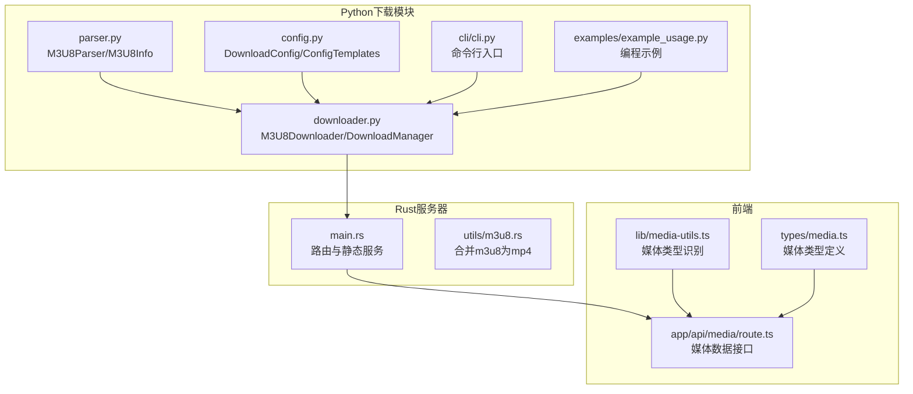
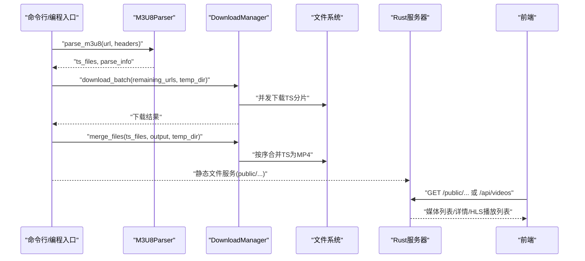
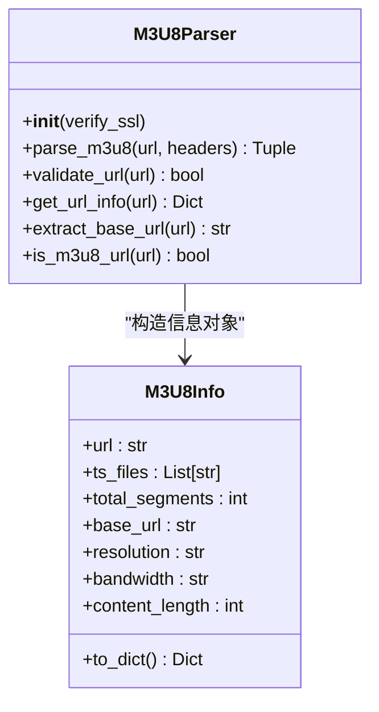
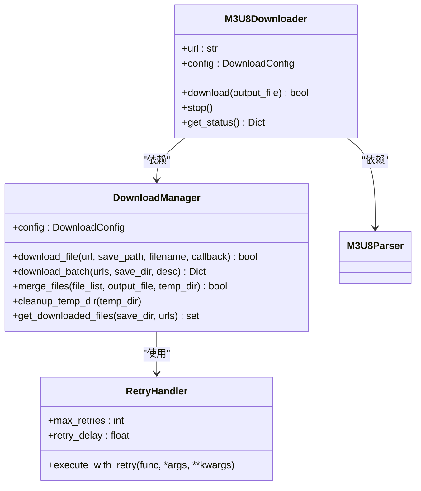
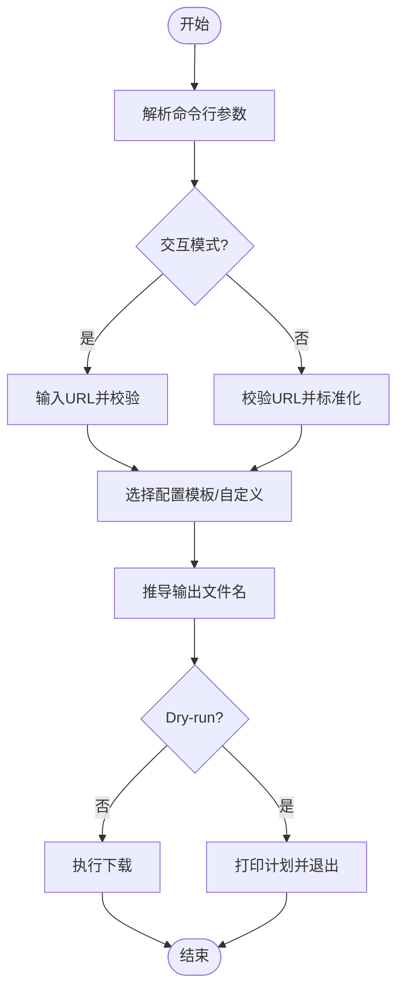
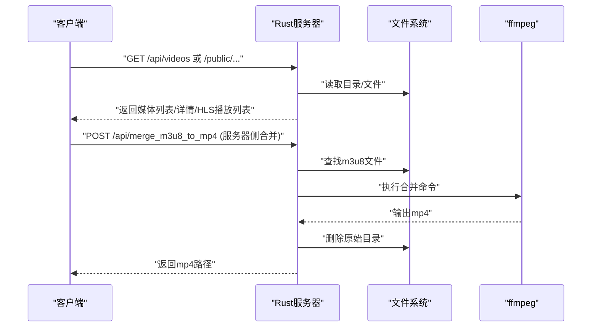
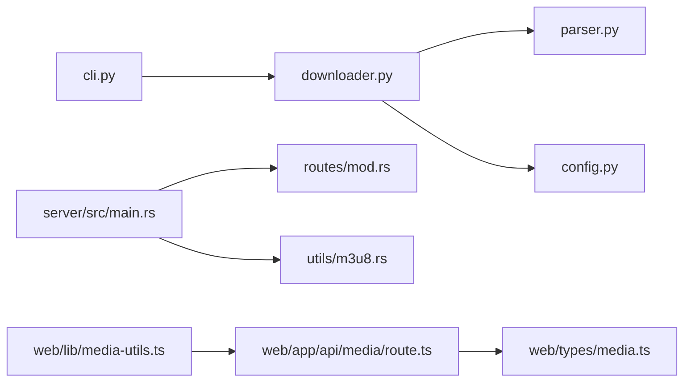

# M3U8解析器

<cite>
**本文引用的文件**
- [README.md](file://README.md)
- [app/downloader/core/parser.py](file://app/downloader/core/parser.py)
- [app/downloader/core/downloader.py](file://app/downloader/core/downloader.py)
- [app/downloader/core/config.py](file://app/downloader/core/config.py)
- [app/downloader/cli/cli.py](file://app/downloader/cli/cli.py)
- [app/downloader/examples/example_usage.py](file://app/downloader/examples/example_usage.py)
- [app/server/src/utils/m3u8.rs](file://app/server/src/utils/m3u8.rs)
- [app/server/src/main.rs](file://app/server/src/main.rs)
- [app/server/src/routes/mod.rs](file://app/server/src/routes/mod.rs)
- [app/web/lib/media-utils.ts](file://app/web/lib/media-utils.ts)
- [app/web/app/api/media/route.ts](file://app/web/app/api/media/route.ts)
- [app/web/types/media.ts](file://app/web/types/media.ts)
</cite>

## 目录
1. [引言](#引言)
2. [项目结构](#项目结构)
3. [核心组件](#核心组件)
4. [架构总览](#架构总览)
5. [组件详解](#组件详解)
6. [依赖关系分析](#依赖关系分析)
7. [性能考量](#性能考量)
8. [故障排查指南](#故障排查指南)
9. [结论](#结论)
10. [附录](#附录)

## 引言
本文件围绕“M3U8解析器”主题，系统梳理了仓库中与M3U8相关的解析、下载、合并与播放能力，覆盖Python下载模块、Rust服务器侧工具、前端媒体类型识别与播放等环节。文档旨在帮助读者快速理解M3U8解析与下载的全链路流程，掌握关键组件的职责与交互方式，并提供可操作的排障与优化建议。

## 项目结构
该项目采用多语言分层组织：
- Python下载模块：负责M3U8解析、TS分片下载、断点续传、合并输出。
- Rust服务器：提供静态文件服务、API接口、目录扫描与HLS目录识别。
- 前端Next.js：媒体列表与播放页面，媒体类型识别与路径规范化。

图表来源
- [app/downloader/core/parser.py](file://app/downloader/core/parser.py#L1-L159)
- [app/downloader/core/downloader.py](file://app/downloader/core/downloader.py#L1-L501)
- [app/downloader/core/config.py](file://app/downloader/core/config.py#L1-L114)
- [app/downloader/cli/cli.py](file://app/downloader/cli/cli.py#L1-L292)
- [app/downloader/examples/example_usage.py](file://app/downloader/examples/example_usage.py#L1-L176)
- [app/server/src/main.rs](file://app/server/src/main.rs#L1-L111)
- [app/server/src/utils/m3u8.rs](file://app/server/src/utils/m3u8.rs#L1-L148)
- [app/web/lib/media-utils.ts](file://app/web/lib/media-utils.ts#L1-L43)
- [app/web/app/api/media/route.ts](file://app/web/app/api/media/route.ts#L1-L73)
- [app/web/types/media.ts](file://app/web/types/media.ts#L1-L20)

章节来源
- [README.md](file://README.md#L1-L200)

## 核心组件
- Python解析器与信息容器
  - M3U8Parser：解析M3U8文本，提取TS分片URL，收集分辨率与带宽信息，提供URL校验与基础URL提取。
  - M3U8Info：封装解析结果，便于序列化与展示。
- 下载器与管理器
  - M3U8Downloader：串联解析、下载、合并、清理全流程。
  - DownloadManager：并发下载、断点续传、重试、进度与日志、信号中断处理、TS文件合并。
  - RetryHandler：指数退避重试策略。
- 配置系统
  - DownloadConfig：统一配置项（线程数、超时、重试、缓冲、路径、请求头、SSL校验、进度与日志开关）。
  - ConfigTemplates：快速模板（fast/stable/low_bandwidth）。
- CLI入口
  - M3U8CLI：命令行参数解析、交互模式、Dry-run、请求头注入、输出文件推导。
- Rust工具与服务器
  - m3u8.rs：在服务器侧将目录中的m3u8合并为mp4，调用系统ffmpeg。
  - main.rs：Axum路由、静态文件服务、CORS、API端点。
- 前端媒体识别
  - media-utils.ts：根据类型字符串识别hls/audio/video。
  - media.ts：媒体类型定义与字段约定。
  - app/api/media/route.ts：前端模拟媒体数据接口。

章节来源
- [app/downloader/core/parser.py](file://app/downloader/core/parser.py#L1-L159)
- [app/downloader/core/downloader.py](file://app/downloader/core/downloader.py#L1-L501)
- [app/downloader/core/config.py](file://app/downloader/core/config.py#L1-L114)
- [app/downloader/cli/cli.py](file://app/downloader/cli/cli.py#L1-L292)
- [app/server/src/utils/m3u8.rs](file://app/server/src/utils/m3u8.rs#L1-L148)
- [app/server/src/main.rs](file://app/server/src/main.rs#L1-L111)
- [app/web/lib/media-utils.ts](file://app/web/lib/media-utils.ts#L1-L43)
- [app/web/app/api/media/route.ts](file://app/web/app/api/media/route.ts#L1-L73)
- [app/web/types/media.ts](file://app/web/types/media.ts#L1-L20)

## 架构总览
整体流程分为“解析—下载—合并—播放”四阶段：
- 解析：Python解析器从M3U8中提取TS分片URL与分辨率/带宽信息。
- 下载：并发下载TS分片，断点续传，失败重试，进度与日志。
- 合并：将TS分片按序合并为MP4；或在服务器侧直接将m3u8目录合并为mp4。
- 播放：前端识别媒体类型，HLS目录通过静态路径访问m3u8，浏览器端播放。

图表来源
- [app/downloader/core/downloader.py](file://app/downloader/core/downloader.py#L379-L501)
- [app/downloader/core/parser.py](file://app/downloader/core/parser.py#L25-L95)
- [app/server/src/main.rs](file://app/server/src/main.rs#L70-L110)
- [app/web/app/api/media/route.ts](file://app/web/app/api/media/route.ts#L1-L73)

## 组件详解

### Python解析器与信息容器
- 职责
  - 从M3U8文本中提取TS分片URL，支持相对路径补全。
  - 解析EXT-X-STREAM-INF行，提取分辨率与带宽信息。
  - 提供URL校验、URL信息拆解、基础URL提取、m3u8判定等辅助方法。
- 关键点
  - 会将相对路径通过基础URL拼接为完整URL。
  - 对嵌套m3u8（如变码率清单）按TS处理，简化流程。
  - 返回解析信息字典，包含总分片数、基础URL、分辨率、带宽、内容长度等。
- 复杂度
  - 时间复杂度：O(N)，N为M3U8行数。
  - 空间复杂度：O(T)，T为TS分片数量。

图表来源
- [app/downloader/core/parser.py](file://app/downloader/core/parser.py#L14-L159)

章节来源
- [app/downloader/core/parser.py](file://app/downloader/core/parser.py#L1-L159)

### 下载器与管理器
- 职责
  - M3U8Downloader：主流程编排，解析、下载、合并、清理、状态记录。
  - DownloadManager：并发下载、断点续传、重试、进度与日志、信号中断、TS合并、临时目录清理。
  - RetryHandler：指数退避重试策略。
- 关键点
  - 并发线程数默认为CPU核数的倍数，可配置。
  - 支持分块下载，避免内存溢出；支持断点续传（检测已存在文件）。
  - 合并时按文件名排序，逐个追加写入，完成后删除临时文件。
  - 支持SIGINT/SIGTERM中断，优雅停止。
- 复杂度
  - 并发下载：O(K)，K为并发线程数。
  - 合并：O(S)，S为TS分片数量。

图表来源
- [app/downloader/core/downloader.py](file://app/downloader/core/downloader.py#L1-L501)
- [app/downloader/core/config.py](file://app/downloader/core/config.py#L1-L114)

章节来源
- [app/downloader/core/downloader.py](file://app/downloader/core/downloader.py#L1-L501)
- [app/downloader/core/config.py](file://app/downloader/core/config.py#L1-L114)

### 配置系统
- DownloadConfig：集中管理下载参数，提供默认值与后处理（确保目录存在、线程数推导）。
- ConfigTemplates：提供fast/stable/low_bandwidth三套模板，快速适配不同网络与性能需求。
- CLI参数映射：命令行参数与配置项一一对应，支持请求头注入、User-Agent/Referer设置、SSL校验开关、进度与日志开关、Dry-run等。

章节来源
- [app/downloader/core/config.py](file://app/downloader/core/config.py#L1-L114)
- [app/downloader/cli/cli.py](file://app/downloader/cli/cli.py#L1-L292)

### CLI入口
- 功能
  - 命令行模式：解析参数、创建配置、推导输出文件名、执行下载。
  - 交互模式：引导用户输入URL、选择配置模板、确认后执行。
  - Dry-run：预检下载计划，不实际下载。
  - 请求头支持：JSON或key=value格式解析，支持User-Agent与Referer。
- 流程
  - 参数解析 → URL校验与标准化 → 配置模板/自定义 → 输出文件推导 → 执行下载 → 状态打印。

图表来源
- [app/downloader/cli/cli.py](file://app/downloader/cli/cli.py#L1-L292)

章节来源
- [app/downloader/cli/cli.py](file://app/downloader/cli/cli.py#L1-L292)

### Rust服务器侧合并与静态服务
- m3u8.rs
  - 检测目录中是否存在m3u8文件，若存在则调用系统ffmpeg将m3u8合并为mp4。
  - 合并策略：直接复制流，修复AAC流，覆盖输出文件；成功后删除原始目录。
- main.rs
  - 提供API端点：列出视频、获取详情、手动同步、文件监听器启停与状态。
  - 静态文件服务：/public与/thumbnails路径映射至数据源目录与缩略图目录。
  - CORS：允许所有来源与方法。
- HLS播放
  - 服务器将HLS目录暴露为静态资源，前端可直接访问m3u8文件进行播放。

图表来源
- [app/server/src/utils/m3u8.rs](file://app/server/src/utils/m3u8.rs#L43-L128)
- [app/server/src/main.rs](file://app/server/src/main.rs#L70-L110)

章节来源
- [app/server/src/utils/m3u8.rs](file://app/server/src/utils/m3u8.rs#L1-L148)
- [app/server/src/main.rs](file://app/server/src/main.rs#L1-L111)
- [app/server/src/routes/mod.rs](file://app/server/src/routes/mod.rs#L1-L6)

### 前端媒体类型识别与播放
- 媒体类型识别：根据字符串包含"hls"或等于"m3u8"识别为hls类型。
- 路径规范化：将后端返回的路径转换为前端可用URL。
- 媒体数据接口：前端路由返回模拟媒体数据，包含名称、路径、类型等字段。
- 类型定义：媒体项包含可选字段（缩略图、时长、大小、分辨率、比特率、创建时间、字幕），便于后续扩展。

章节来源
- [app/web/lib/media-utils.ts](file://app/web/lib/media-utils.ts#L1-L43)
- [app/web/app/api/media/route.ts](file://app/web/app/api/media/route.ts#L1-L73)
- [app/web/types/media.ts](file://app/web/types/media.ts#L1-L20)

## 依赖关系分析
- Python下载模块内部依赖
  - parser.py 与 downloader.py 通过M3U8Parser与DownloadManager耦合。
  - config.py 为两者提供统一配置。
  - cli.py 作为入口，依赖config与downloader。
- Rust服务器
  - main.rs 依赖 routes 与 utils，提供静态服务与API。
  - utils/m3u8.rs 依赖系统ffmpeg，负责合并。
- 前端
  - media-utils.ts 与 types/media.ts 为前端媒体展示提供支撑。
  - app/api/media/route.ts 为前端提供数据接口。

图表来源
- [app/downloader/cli/cli.py](file://app/downloader/cli/cli.py#L1-L292)
- [app/downloader/core/downloader.py](file://app/downloader/core/downloader.py#L1-L501)
- [app/downloader/core/parser.py](file://app/downloader/core/parser.py#L1-L159)
- [app/downloader/core/config.py](file://app/downloader/core/config.py#L1-L114)
- [app/server/src/main.rs](file://app/server/src/main.rs#L1-L111)
- [app/server/src/routes/mod.rs](file://app/server/src/routes/mod.rs#L1-L6)
- [app/server/src/utils/m3u8.rs](file://app/server/src/utils/m3u8.rs#L1-L148)
- [app/web/lib/media-utils.ts](file://app/web/lib/media-utils.ts#L1-L43)
- [app/web/app/api/media/route.ts](file://app/web/app/api/media/route.ts#L1-L73)
- [app/web/types/media.ts](file://app/web/types/media.ts#L1-L20)

章节来源
- [app/downloader/core/downloader.py](file://app/downloader/core/downloader.py#L1-L501)
- [app/server/src/main.rs](file://app/server/src/main.rs#L1-L111)

## 性能考量
- 并发与吞吐
  - 线程数默认为CPU核数的倍数，可根据网络与磁盘I/O调优。
  - 分块下载与缓冲区大小可平衡内存占用与吞吐。
- 重试与稳定性
  - 指数退避重试降低瞬时压力，提高成功率。
  - 断点续传减少重复下载，提升可靠性。
- 合并策略
  - 顺序合并避免乱序导致的播放问题；合并过程使用缓冲读取，避免大文件内存峰值。
- 服务器侧合并
  - 使用ffmpeg直接复制流，避免二次编码开销；修复AAC流以保证播放兼容性。
- 前端播放
  - HLS目录通过静态路径直接访问，减少中间层开销；媒体类型识别有助于前端选择合适播放方案。

[本节为通用指导，不直接分析具体文件]

## 故障排查指南
- 解析失败
  - 检查M3U8 URL有效性与可达性；确认网络代理与证书校验设置。
  - 若解析无TS分片，确认M3U8是否为变码率清单或嵌套清单。
- 下载失败
  - 查看重试次数与延迟设置；检查超时配置与磁盘空间。
  - 若部分分片失败，观察日志定位具体URL；确认网络波动与源站限速。
- 合并失败
  - 确认TS分片是否全部下载完成；检查临时目录权限与磁盘空间。
  - 若合并被中断，检查信号处理与中断标志位。
- 服务器侧合并失败
  - 确认系统已安装ffmpeg；检查m3u8文件是否存在且可读。
  - 查看stderr输出，定位ffmpeg错误原因（如编码器不匹配、路径权限等）。
- 前端播放问题
  - 确认HLS目录路径正确；检查CORS配置与静态服务映射。
  - 使用媒体类型识别确认为hls类型，确保浏览器端播放器支持HLS。

章节来源
- [app/downloader/core/downloader.py](file://app/downloader/core/downloader.py#L1-L501)
- [app/server/src/utils/m3u8.rs](file://app/server/src/utils/m3u8.rs#L43-L128)
- [app/server/src/main.rs](file://app/server/src/main.rs#L70-L110)
- [app/web/lib/media-utils.ts](file://app/web/lib/media-utils.ts#L1-L43)

## 结论
本项目提供了从M3U8解析、并发下载、断点续传、TS合并到服务器侧直接合并与前端播放的完整链路。Python模块侧重灵活的下载体验与可配置性，Rust模块侧重高效稳定的静态服务与合并能力，前端提供媒体类型识别与播放支持。通过合理的配置与排障策略，可在不同网络环境下获得稳定可靠的M3U8下载与播放体验。

[本节为总结，不直接分析具体文件]

## 附录
- 使用示例
  - 编程使用：参考示例脚本，展示基础下载、自定义配置、模板使用、仅解析与错误处理。
  - 命令行使用：参考README与CLI参数，支持快速、稳定、低带宽三种模板，以及交互模式与Dry-run。
- API参考
  - Rust服务器提供视频列表、详情、同步、文件监听器启停与状态等端点；静态服务映射public与thumbnails目录。
- 前端类型
  - 媒体类型定义包含video/audio/hls三类，便于前端差异化处理。

章节来源
- [app/downloader/examples/example_usage.py](file://app/downloader/examples/example_usage.py#L1-L176)
- [README.md](file://README.md#L372-L474)
- [app/server/src/main.rs](file://app/server/src/main.rs#L70-L110)
- [app/web/types/media.ts](file://app/web/types/media.ts#L1-L20)