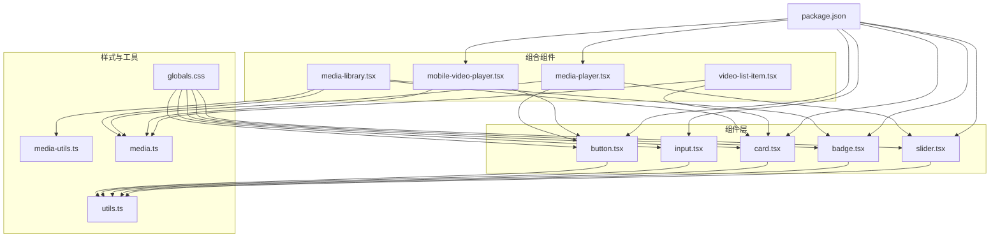
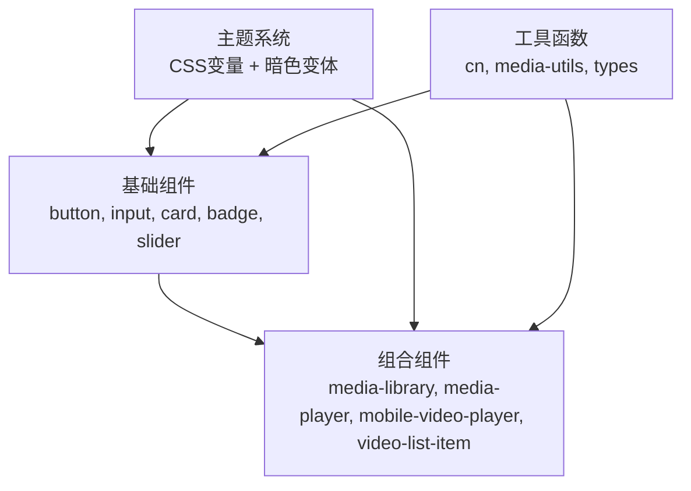
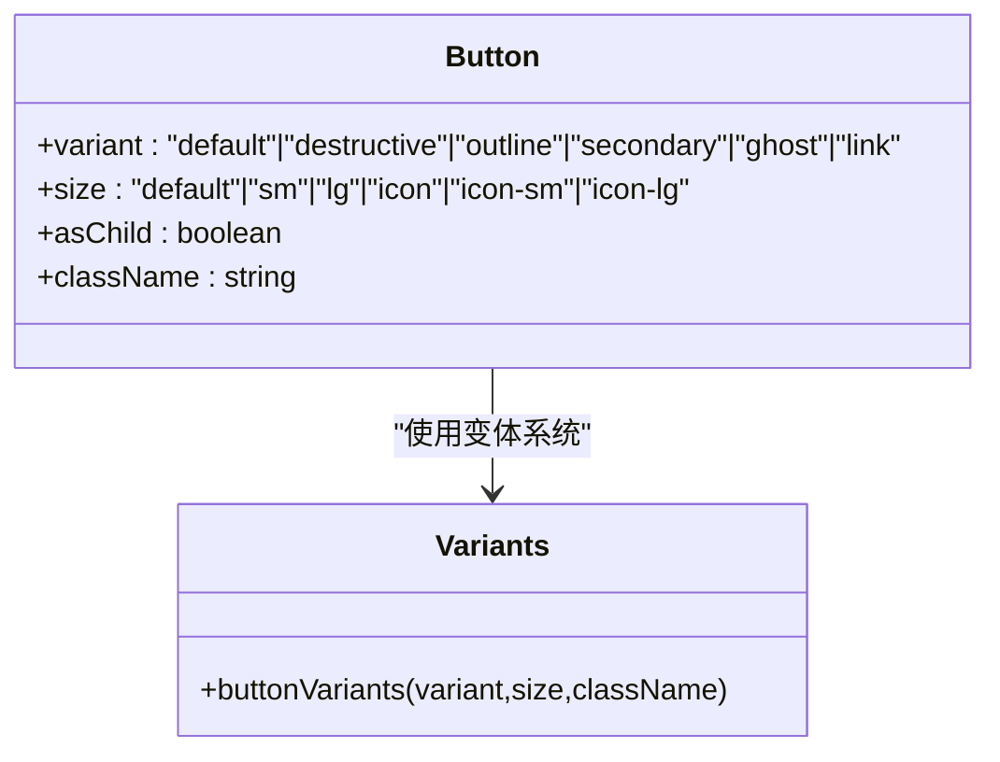
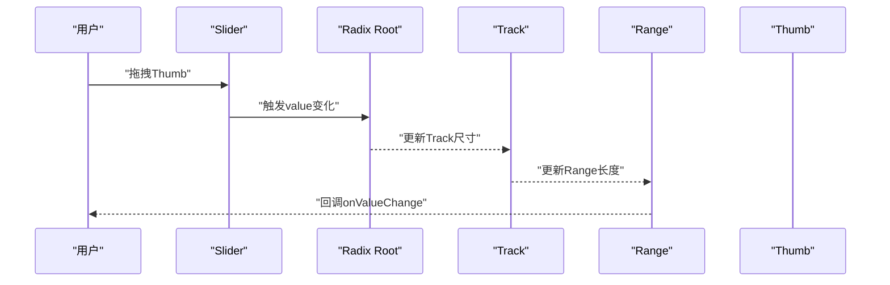
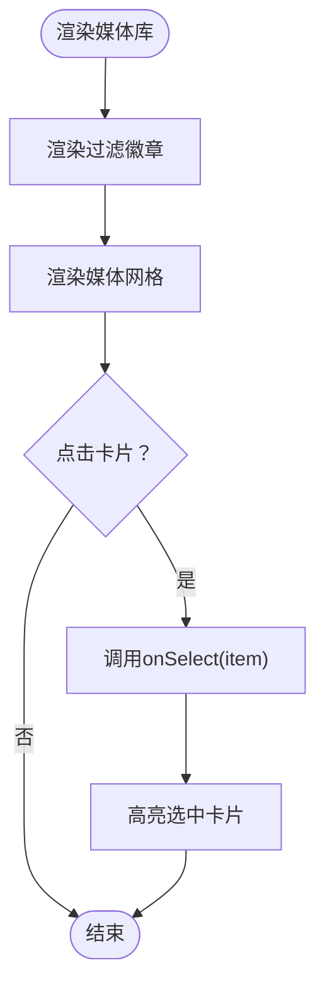
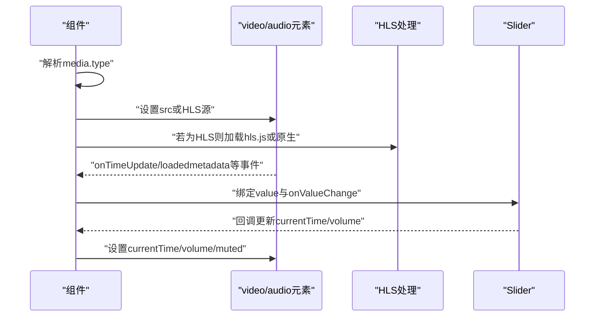
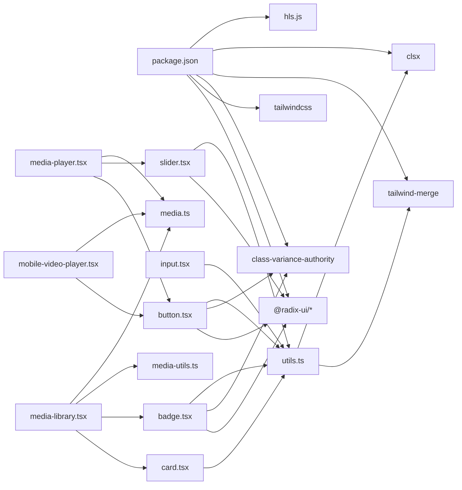

# UI组件库

<cite>
**本文引用的文件**
- [button.tsx](file://app/web/components/ui/button.tsx)
- [input.tsx](file://app/web/components/ui/input.tsx)
- [card.tsx](file://app/web/components/ui/card.tsx)
- [badge.tsx](file://app/web/components/ui/badge.tsx)
- [slider.tsx](file://app/web/components/ui/slider.tsx)
- [utils.ts](file://app/web/lib/utils.ts)
- [globals.css](file://app/web/app/globals.css)
- [media-library.tsx](file://app/web/components/media-library.tsx)
- [media-player.tsx](file://app/web/components/media-player.tsx)
- [mobile-video-player.tsx](file://app/web/components/mobile-video-player.tsx)
- [video-list-item.tsx](file://app/web/components/video-list-item.tsx)
- [media-utils.ts](file://app/web/lib/media-utils.ts)
- [media.ts](file://app/web/types/media.ts)
- [package.json](file://app/web/package.json)
</cite>

## 目录
1. [简介](#简介)
2. [项目结构](#项目结构)
3. [核心组件](#核心组件)
4. [架构总览](#架构总览)
5. [组件详解](#组件详解)
6. [依赖关系分析](#依赖关系分析)
7. [性能与可访问性](#性能与可访问性)
8. [故障排查指南](#故障排查指南)
9. [结论](#结论)
10. [附录](#附录)

## 简介
本UI组件库以Next.js应用为基础，结合Radix UI与Tailwind CSS构建，提供一组高可定制、语义明确且具备良好可访问性的基础UI组件，并围绕媒体播放场景提供了媒体库与播放器组件。组件通过class-variance-authority实现变体系统，借助Tailwind CSS进行样式组合，使用cn工具函数合并类名，确保样式覆盖与主题切换的一致性。组件广泛采用Radix UI的无障碍原生控件，保障键盘导航、焦点可见性与ARIA状态同步。

## 项目结构
- 组件层：位于 app/web/components/ui，包含基础UI组件（按钮、输入框、卡片、徽章、滑块）。
- 组合组件：位于 app/web/components，包含媒体库、媒体播放器、移动端播放器、视频列表项等业务组件。
- 样式层：位于 app/web/app/globals.css，定义CSS变量、主题变体与全局样式。
- 工具层：位于 app/web/lib，包含cn类名合并工具与媒体工具函数。
- 类型定义：位于 app/web/types，定义媒体数据结构与类型别名。
- 依赖声明：位于 app/web/package.json，列出Radix UI、Tailwind、class-variance-authority等依赖。

图表来源
- [button.tsx](file://app/web/components/ui/button.tsx#L1-L63)
- [input.tsx](file://app/web/components/ui/input.tsx#L1-L22)
- [card.tsx](file://app/web/components/ui/card.tsx#L1-L93)
- [badge.tsx](file://app/web/components/ui/badge.tsx#L1-L47)
- [slider.tsx](file://app/web/components/ui/slider.tsx#L1-L64)
- [media-library.tsx](file://app/web/components/media-library.tsx#L1-L120)
- [media-player.tsx](file://app/web/components/media-player.tsx#L1-L322)
- [mobile-video-player.tsx](file://app/web/components/mobile-video-player.tsx#L1-L400)
- [video-list-item.tsx](file://app/web/components/video-list-item.tsx#L1-L93)
- [utils.ts](file://app/web/lib/utils.ts#L1-L7)
- [globals.css](file://app/web/app/globals.css#L1-L131)
- [media-utils.ts](file://app/web/lib/media-utils.ts#L1-L43)
- [media.ts](file://app/web/types/media.ts#L1-L20)
- [package.json](file://app/web/package.json#L1-L74)

章节来源
- [package.json](file://app/web/package.json#L1-L74)

## 核心组件
本节概述基础UI组件的设计原则与通用能力：
- 组件命名与语义：通过data-slot属性标注组件槽位，便于样式选择器与调试。
- 变体系统：使用class-variance-authority定义变体与尺寸，支持variant与size两个维度。
- Radix Slot：asChild属性允许将子元素透传为容器，实现语义化与可组合性。
- Tailwind样式：统一使用cn合并类名，确保默认样式、聚焦环、无效态与暗色主题的兼容。
- 可访问性：遵循Radix UI的无障碍约定，如焦点可见性、ARIA状态映射与键盘交互。

章节来源
- [button.tsx](file://app/web/components/ui/button.tsx#L1-L63)
- [input.tsx](file://app/web/components/ui/input.tsx#L1-L22)
- [badge.tsx](file://app/web/components/ui/badge.tsx#L1-L47)
- [slider.tsx](file://app/web/components/ui/slider.tsx#L1-L64)
- [utils.ts](file://app/web/lib/utils.ts#L1-L7)
- [globals.css](file://app/web/app/globals.css#L1-L131)

## 架构总览
组件库采用“基础组件 + 组合组件”的分层架构：
- 基础组件：提供通用的视觉与交互抽象，面向跨页面复用。
- 组合组件：封装媒体场景的业务逻辑，组合基础组件并处理状态与事件。
- 样式系统：以CSS变量为主题根，配合Tailwind与暗色变体，实现主题切换与一致的视觉语言。
- 工具函数：cn负责类名合并，media-utils提供媒体类型识别与格式化。

图表来源
- [button.tsx](file://app/web/components/ui/button.tsx#L1-L63)
- [input.tsx](file://app/web/components/ui/input.tsx#L1-L22)
- [card.tsx](file://app/web/components/ui/card.tsx#L1-L93)
- [badge.tsx](file://app/web/components/ui/badge.tsx#L1-L47)
- [slider.tsx](file://app/web/components/ui/slider.tsx#L1-L64)
- [media-library.tsx](file://app/web/components/media-library.tsx#L1-L120)
- [media-player.tsx](file://app/web/components/media-player.tsx#L1-L322)
- [mobile-video-player.tsx](file://app/web/components/mobile-video-player.tsx#L1-L400)
- [video-list-item.tsx](file://app/web/components/video-list-item.tsx#L1-L93)
- [globals.css](file://app/web/app/globals.css#L1-L131)
- [utils.ts](file://app/web/lib/utils.ts#L1-L7)
- [media-utils.ts](file://app/web/lib/media-utils.ts#L1-L43)
- [media.ts](file://app/web/types/media.ts#L1-L20)

## 组件详解

### Button（按钮）
- 设计原则
  - 变体：default、destructive、outline、secondary、ghost、link。
  - 尺寸：default、sm、lg、icon、icon-sm、icon-lg。
  - 可组合：支持asChild透传为链接或自定义容器。
  - 焦点与无效态：聚焦可见环、无效态红色强调、禁用透明度与指针事件。
- 关键属性
  - className：追加自定义样式。
  - variant：选择预设样式。
  - size：选择尺寸。
  - asChild：是否将子元素作为容器渲染。
- 交互与可访问性
  - 支持键盘激活与焦点可见性；无效态通过aria-invalid联动样式。
- 使用示例
  - 作为提交按钮：设置variant为default或destructive。
  - 作为图标按钮：设置size为icon系列。
  - 作为链接：设置asChild为true并传入a标签。
- 主题与样式覆盖
  - 通过className覆盖默认背景、边框与阴影；或在globals.css中调整变量值影响所有按钮。

图表来源
- [button.tsx](file://app/web/components/ui/button.tsx#L1-L63)

章节来源
- [button.tsx](file://app/web/components/ui/button.tsx#L1-L63)
- [globals.css](file://app/web/app/globals.css#L1-L131)

### Input（输入框）
- 设计原则
  - 默认样式包含边框、圆角、阴影与过渡；聚焦时显示ring与ring/50环。
  - 无效态通过aria-invalid联动样式。
  - 支持文件输入、占位符文本与选择态颜色。
- 关键属性
  - className：追加自定义样式。
  - type：HTML input类型。
- 交互与可访问性
  - 聚焦可见性与无效态反馈；禁用态禁用指针与降低透明度。
- 使用示例
  - 文本输入：type为text或password。
  - 文件上传：type为file并配合文件选择器。
- 主题与样式覆盖
  - 通过className覆盖边框、背景与文字颜色；或在globals.css中调整变量值。

章节来源
- [input.tsx](file://app/web/components/ui/input.tsx#L1-L22)
- [globals.css](file://app/web/app/globals.css#L1-L131)

### Card（卡片）
- 设计原则
  - 提供Card、CardHeader、CardTitle、CardDescription、CardAction、CardContent、CardFooter等子组件，形成卡片布局的语义化结构。
  - Header支持响应式网格布局，Action区域自动定位到右上角。
- 关键属性
  - className：追加自定义样式。
- 交互与可访问性
  - 子组件均带有data-slot便于样式选择器与调试。
- 使用示例
  - 嵌套使用各子组件构建卡片内容区。
- 主题与样式覆盖
  - 通过className覆盖背景、边框与阴影；或在globals.css中调整变量值。

章节来源
- [card.tsx](file://app/web/components/ui/card.tsx#L1-L93)
- [globals.css](file://app/web/app/globals.css#L1-L131)

### Badge（徽章）
- 设计原则
  - 变体：default、secondary、destructive、outline。
  - 圆角矩形与紧凑内边距，适合标签与状态提示。
  - 支持asChild透传为链接或自定义容器。
- 关键属性
  - className：追加自定义样式。
  - variant：选择预设样式。
  - asChild：是否将子元素作为容器渲染。
- 交互与可访问性
  - 聚焦可见性与无效态联动。
- 使用示例
  - 显示媒体类型标签：根据类型选择不同variant。
- 主题与样式覆盖
  - 通过className覆盖背景、边框与文字颜色；或在globals.css中调整变量值。

章节来源
- [badge.tsx](file://app/web/components/ui/badge.tsx#L1-L47)
- [globals.css](file://app/web/app/globals.css#L1-L131)

### Slider（滑块）
- 设计原则
  - 基于@radix-ui/react-slider，支持单值与多值滑块。
  - 支持水平与垂直方向，Track与Range可视化范围，Thumb为可拖拽手柄。
  - 数据槽位：Root、Track、Range、Thumb均带data-slot便于样式选择器。
- 关键属性
  - className：追加自定义样式。
  - defaultValue、value、min、max：控制初始值与取值范围。
- 交互与可访问性
  - 键盘导航与触摸拖拽；禁用态半透明与禁用指针事件。
- 使用示例
  - 进度条：绑定onValueChange更新当前时间。
  - 音量控制：绑定onValueChange更新音量百分比。
- 主题与样式覆盖
  - 通过className覆盖Track、Range与Thumb的背景、尺寸与阴影；或在globals.css中调整变量值。

图表来源
- [slider.tsx](file://app/web/components/ui/slider.tsx#L1-L64)

章节来源
- [slider.tsx](file://app/web/components/ui/slider.tsx#L1-L64)
- [globals.css](file://app/web/app/globals.css#L1-L131)

### 组合组件：MediaLibrary（媒体库）
- 功能特性
  - 媒体过滤：按类型（全部、视频、音频、流媒体）筛选。
  - 媒体网格：响应式网格展示媒体项，点击选中并高亮。
  - 类型徽章：根据媒体类型显示不同颜色徽章。
  - 信息展示：名称、类型、大小、分辨率等。
- 关键属性
  - items：媒体数组。
  - onSelect(item)：选中回调。
  - selectedItem：当前选中项。
- 交互行为
  - 点击徽章切换过滤器；点击卡片触发onSelect。
- 主题与样式覆盖
  - 通过className覆盖卡片、徽章与网格布局；或在globals.css中调整变量值。

图表来源
- [media-library.tsx](file://app/web/components/media-library.tsx#L1-L120)
- [badge.tsx](file://app/web/components/ui/badge.tsx#L1-L47)
- [card.tsx](file://app/web/components/ui/card.tsx#L1-L93)
- [media-utils.ts](file://app/web/lib/media-utils.ts#L1-L43)
- [media.ts](file://app/web/types/media.ts#L1-L20)

章节来源
- [media-library.tsx](file://app/web/components/media-library.tsx#L1-L120)
- [media-utils.ts](file://app/web/lib/media-utils.ts#L1-L43)
- [media.ts](file://app/web/types/media.ts#L1-L20)

### 组合组件：MediaPlayer（媒体播放器）
- 功能特性
  - 自适应播放：根据类型选择video或audio元素。
  - HLS支持：动态加载hls.js或原生Safari支持。
  - 控制面板：播放/暂停、音量、进度、全屏、下载。
  - 时间格式化：支持分钟:秒格式。
- 关键属性
  - media：媒体对象（name、path、type、thumbnail、duration、size）。
  - autoPlay：自动播放开关。
- 交互行为
  - 播放/暂停：切换isPlaying状态并调用原生播放API。
  - 音量/进度：通过Slider双向绑定value与onValueChange。
  - 全屏：requestFullscreen/exitFullscreen。
- 主题与样式覆盖
  - 通过className覆盖容器、控制栏与按钮样式；或在globals.css中调整变量值。

图表来源
- [media-player.tsx](file://app/web/components/media-player.tsx#L1-L322)
- [slider.tsx](file://app/web/components/ui/slider.tsx#L1-L64)
- [button.tsx](file://app/web/components/ui/button.tsx#L1-L63)
- [media.ts](file://app/web/types/media.ts#L1-L20)

章节来源
- [media-player.tsx](file://app/web/components/media-player.tsx#L1-L322)
- [media.ts](file://app/web/types/media.ts#L1-L20)

### 组合组件：MobileVideoPlayer（移动端播放器）
- 功能特性
  - 移动端手势与控制：触摸开始/移动重置控制栏显示，点击切换播放。
  - 加载与错误状态：加载动画与错误提示，支持重试。
  - 控制层：底部进度条与控制按钮，顶部渐变遮罩。
  - HLS支持：动态加载hls.js或原生Safari支持。
- 关键属性
  - media：媒体对象。
  - autoPlay：自动播放开关。
- 交互行为
  - 触摸控制栏显示/隐藏；点击视频区域切换播放；全屏切换。
- 主题与样式覆盖
  - 通过className覆盖容器、控制层与按钮样式；或在globals.css中调整变量值。

章节来源
- [mobile-video-player.tsx](file://app/web/components/mobile-video-player.tsx#L1-L400)
- [media.ts](file://app/web/types/media.ts#L1-L20)

### 组合组件：VideoListItem（视频列表项）
- 功能特性
  - 缩略图展示：支持占位与图片加载。
  - 悬浮效果：播放覆盖层、时长与格式标签的上移动画。
  - 信息展示：名称、分辨率、大小、比特率、创建时间。
- 关键属性
  - video：媒体对象。
  - onClick：点击回调。
- 交互行为
  - 点击卡片触发onClick；悬停时显示播放覆盖层与标签上移。
- 主题与样式覆盖
  - 通过className覆盖卡片、标签与悬停动画；或在globals.css中调整变量值。

章节来源
- [video-list-item.tsx](file://app/web/components/video-list-item.tsx#L1-L93)
- [media.ts](file://app/web/types/media.ts#L1-L20)

## 依赖关系分析
- 组件依赖
  - 基础组件依赖Radix UI（Slot、Slider）、class-variance-authority与cn工具。
  - 组合组件依赖基础组件与媒体工具函数。
- 样式依赖
  - globals.css定义CSS变量与暗色变体，基础组件与组合组件共享。
- 第三方依赖
  - package.json列出Radix UI、Tailwind、class-variance-authority、hls.js等。

图表来源
- [package.json](file://app/web/package.json#L1-L74)
- [utils.ts](file://app/web/lib/utils.ts#L1-L7)
- [button.tsx](file://app/web/components/ui/button.tsx#L1-L63)
- [input.tsx](file://app/web/components/ui/input.tsx#L1-L22)
- [card.tsx](file://app/web/components/ui/card.tsx#L1-L93)
- [badge.tsx](file://app/web/components/ui/badge.tsx#L1-L47)
- [slider.tsx](file://app/web/components/ui/slider.tsx#L1-L64)
- [media-library.tsx](file://app/web/components/media-library.tsx#L1-L120)
- [media-player.tsx](file://app/web/components/media-player.tsx#L1-L322)
- [mobile-video-player.tsx](file://app/web/components/mobile-video-player.tsx#L1-L400)
- [media-utils.ts](file://app/web/lib/media-utils.ts#L1-L43)
- [media.ts](file://app/web/types/media.ts#L1-L20)

章节来源
- [package.json](file://app/web/package.json#L1-L74)

## 性能与可访问性
- 性能
  - Slider使用useMemo稳定多值数组，避免不必要的重渲染。
  - 组合组件仅在必要时更新状态（如时间更新、音量变化），减少重绘。
  - HLS播放器在销毁时清理资源，避免内存泄漏。
- 可访问性
  - 所有基础组件均支持键盘导航与焦点可见性。
  - 通过aria-invalid联动样式，提供无效输入的视觉反馈。
  - 组合组件提供标题与描述，提升屏幕阅读器体验。

章节来源
- [slider.tsx](file://app/web/components/ui/slider.tsx#L1-L64)
- [media-player.tsx](file://app/web/components/media-player.tsx#L1-L322)
- [mobile-video-player.tsx](file://app/web/components/mobile-video-player.tsx#L1-L400)

## 故障排查指南
- HLS播放失败
  - 检查浏览器是否支持HLS（Safari原生或hls.js）。若加载失败，组件会显示错误提示并提供重试按钮。
  - 章节来源
    - [mobile-video-player.tsx](file://app/web/components/mobile-video-player.tsx#L1-L400)
- 播放器无法控制
  - 确认video/audio元素已正确挂载ref，且事件监听已注册。
  - 章节来源
    - [media-player.tsx](file://app/web/components/media-player.tsx#L1-L322)
- 输入框无效态未生效
  - 确保表单验证通过aria-invalid传递给Input组件，样式会自动响应。
  - 章节来源
    - [input.tsx](file://app/web/components/ui/input.tsx#L1-L22)
- 按钮样式覆盖不生效
  - 使用className叠加样式，或在globals.css中调整变量值；避免与默认变体冲突。
  - 章节来源
    - [button.tsx](file://app/web/components/ui/button.tsx#L1-L63)
    - [globals.css](file://app/web/app/globals.css#L1-L131)

## 结论
该UI组件库以Radix UI与Tailwind CSS为核心，构建了高可定制、语义清晰且具备良好可访问性的组件体系。基础组件通过变体系统与Slot机制实现灵活组合，组合组件围绕媒体场景提供完整的播放与浏览体验。通过CSS变量与暗色变体，组件在主题切换下保持一致的视觉语言。建议在实际项目中优先使用基础组件的变体与尺寸，结合className进行局部覆盖，并充分利用ARIA与焦点可见性增强可访问性。

## 附录
- 主题定制与样式覆盖
  - 在globals.css中调整CSS变量可统一改变主色、背景、边框等；暗色变体通过.custom-variant dark自动生效。
  - 使用cn工具合并类名，确保默认样式与自定义样式的正确叠加。
  - 章节来源
    - [globals.css](file://app/web/app/globals.css#L1-L131)
    - [utils.ts](file://app/web/lib/utils.ts#L1-L7)
- 组件组合模式
  - 媒体库：Badge用于类型过滤，Card用于媒体项展示。
  - 媒体播放器：Button与Slider组合实现播放控制，支持HLS与普通媒体。
  - 章节来源
    - [media-library.tsx](file://app/web/components/media-library.tsx#L1-L120)
    - [media-player.tsx](file://app/web/components/media-player.tsx#L1-L322)
    - [mobile-video-player.tsx](file://app/web/components/mobile-video-player.tsx#L1-L400)
- 最佳实践
  - 使用asChild透传容器，保持语义化结构。
  - 通过data-slot与className组合实现精确样式覆盖。
  - 对于复杂交互，优先使用Radix UI原生控件，确保可访问性。
  - 章节来源
    - [button.tsx](file://app/web/components/ui/button.tsx#L1-L63)
    - [slider.tsx](file://app/web/components/ui/slider.tsx#L1-L64)