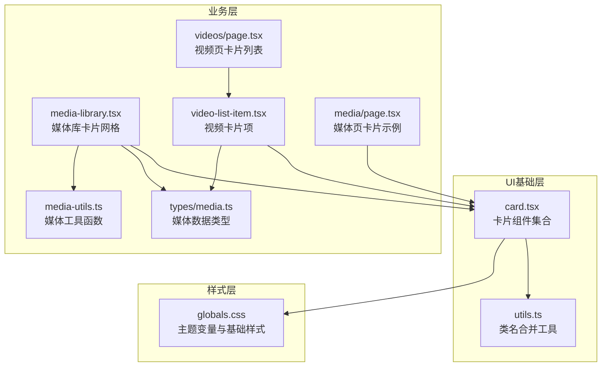
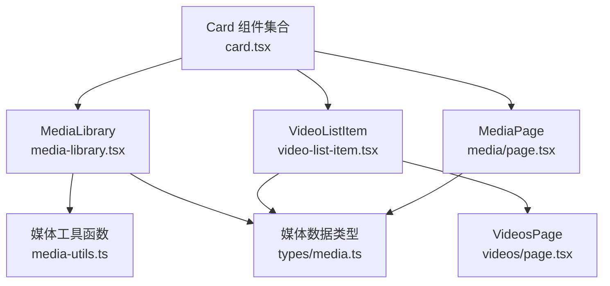
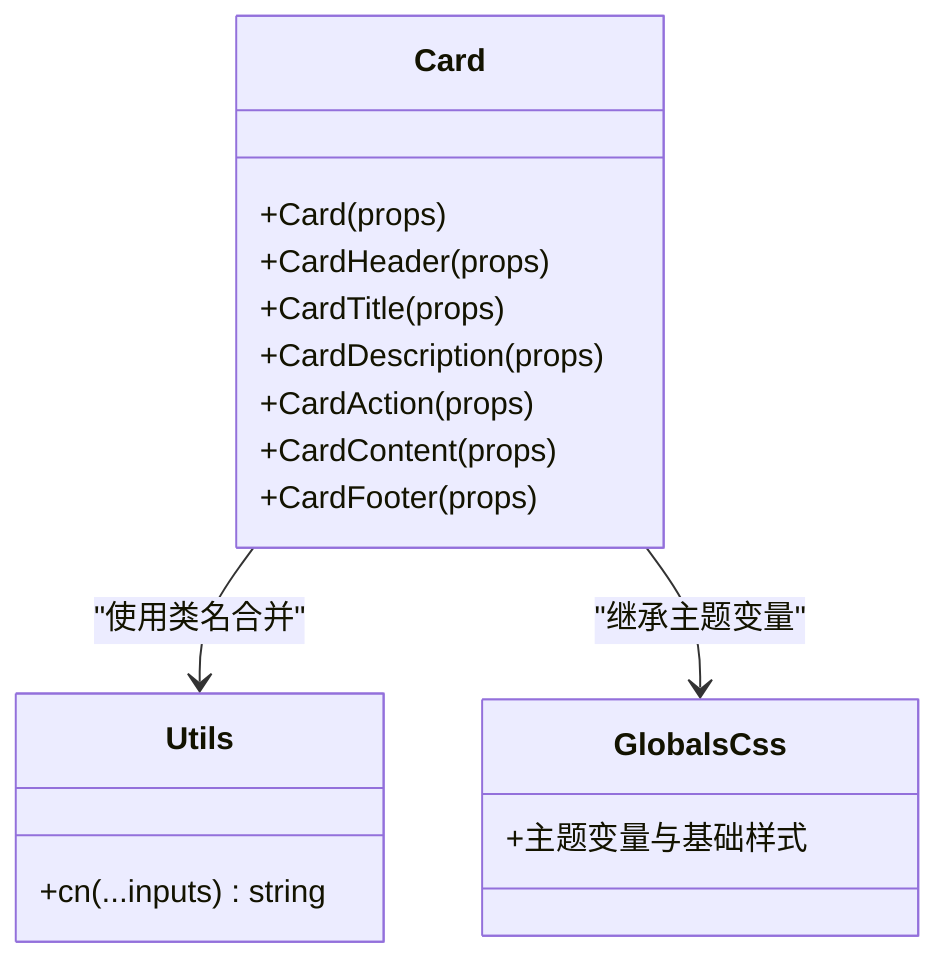
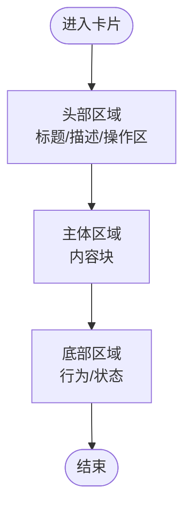
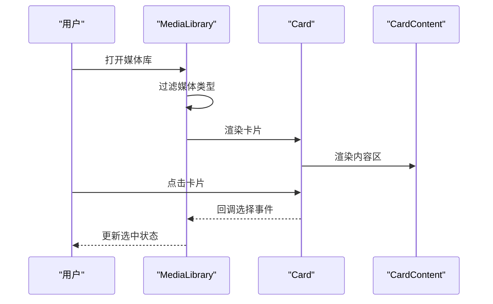
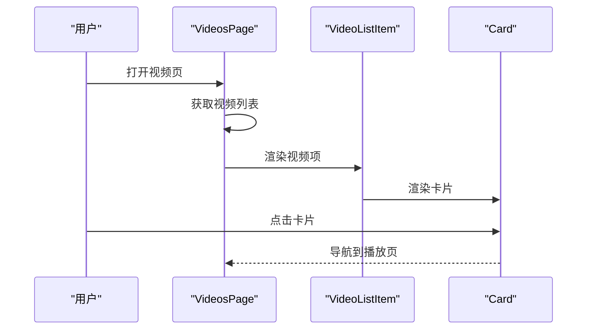
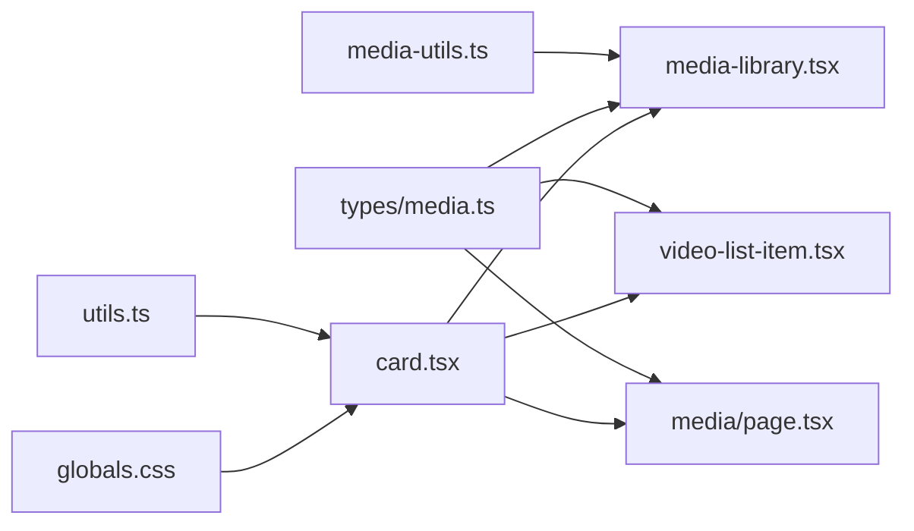

# 卡片组件

<cite>
**本文引用的文件**
- [app/web/components/ui/card.tsx](file://app/web/components/ui/card.tsx)
- [app/web/lib/utils.ts](file://app/web/lib/utils.ts)
- [app/web/app/globals.css](file://app/web/app/globals.css)
- [app/web/components/media-library.tsx](file://app/web/components/media-library.tsx)
- [app/web/components/video-list-item.tsx](file://app/web/components/video-list-item.tsx)
- [app/web/app/media/page.tsx](file://app/web/app/media/page.tsx)
- [app/web/app/videos/page.tsx](file://app/web/app/videos/page.tsx)
- [app/web/types/media.ts](file://app/web/types/media.ts)
- [app/web/lib/media-utils.ts](file://app/web/lib/media-utils.ts)
</cite>

## 目录
1. [简介](#简介)
2. [项目结构](#项目结构)
3. [核心组件](#核心组件)
4. [架构总览](#架构总览)
5. [详细组件分析](#详细组件分析)
6. [依赖关系分析](#依赖关系分析)
7. [性能考量](#性能考量)
8. [故障排查指南](#故障排查指南)
9. [结论](#结论)
10. [附录](#附录)

## 简介
本文件围绕“卡片组件”进行系统化文档化，目标包括：
- 解释卡片组件的设计原则与布局结构
- 说明卡片头部、主体、底部区域的组织方式
- 提供样式变体、阴影与边框配置
- 总结内容排版规则、间距控制与响应式设计
- 展示在媒体库展示、视频信息展示等场景中的实际用法
- 说明卡片与其他UI组件的组合使用模式

## 项目结构
卡片组件位于前端Next.js工程中，采用分层组织：
- UI基础组件：位于 components/ui 下，提供通用卡片及其子区域组件
- 页面与业务组件：位于 app 与 components 下，展示卡片在不同场景下的使用
- 样式与主题：通过全局CSS变量与Tailwind配置提供统一风格

图表来源
- [app/web/components/ui/card.tsx](file://app/web/components/ui/card.tsx#L1-L93)
- [app/web/lib/utils.ts](file://app/web/lib/utils.ts#L1-L7)
- [app/web/app/globals.css](file://app/web/app/globals.css#L1-L131)
- [app/web/components/media-library.tsx](file://app/web/components/media-library.tsx#L1-L120)
- [app/web/components/video-list-item.tsx](file://app/web/components/video-list-item.tsx#L1-L93)
- [app/web/app/media/page.tsx](file://app/web/app/media/page.tsx#L1-L147)
- [app/web/app/videos/page.tsx](file://app/web/app/videos/page.tsx#L1-L267)
- [app/web/types/media.ts](file://app/web/types/media.ts#L1-L20)
- [app/web/lib/media-utils.ts](file://app/web/lib/media-utils.ts#L1-L43)

章节来源
- [app/web/components/ui/card.tsx](file://app/web/components/ui/card.tsx#L1-L93)
- [app/web/app/globals.css](file://app/web/app/globals.css#L1-L131)

## 核心组件
卡片组件由一组语义化子组件构成，便于在不同布局中灵活组合：
- 卡片容器：提供背景、圆角、边框、阴影与整体布局
- 卡片头部：用于标题、描述与操作区的布局
- 卡片标题：强调性文本
- 卡片描述：辅助性说明文字
- 卡片动作：右上角操作区
- 卡片主体：内容区
- 卡片底部：底部行为区

实现要点
- 使用类名合并工具统一处理className
- 通过data-slot属性标识各子区域，便于主题与样式扩展
- 头部区域支持“带操作区”的网格布局，自动根据是否存在操作区调整列数
- 底部区域支持带边框线时的上下间距

章节来源
- [app/web/components/ui/card.tsx](file://app/web/components/ui/card.tsx#L1-L93)
- [app/web/lib/utils.ts](file://app/web/lib/utils.ts#L1-L7)

## 架构总览
卡片组件在多个页面中被复用，形成“基础卡片组件 → 业务卡片组件 → 页面使用”的层次化架构。

图表来源
- [app/web/components/ui/card.tsx](file://app/web/components/ui/card.tsx#L1-L93)
- [app/web/components/media-library.tsx](file://app/web/components/media-library.tsx#L1-L120)
- [app/web/components/video-list-item.tsx](file://app/web/components/video-list-item.tsx#L1-L93)
- [app/web/app/media/page.tsx](file://app/web/app/media/page.tsx#L1-L147)
- [app/web/app/videos/page.tsx](file://app/web/app/videos/page.tsx#L1-L267)
- [app/web/types/media.ts](file://app/web/types/media.ts#L1-L20)
- [app/web/lib/media-utils.ts](file://app/web/lib/media-utils.ts#L1-L43)

## 详细组件分析

### 卡片组件类图

图表来源
- [app/web/components/ui/card.tsx](file://app/web/components/ui/card.tsx#L1-L93)
- [app/web/lib/utils.ts](file://app/web/lib/utils.ts#L1-L7)
- [app/web/app/globals.css](file://app/web/app/globals.css#L1-L131)

章节来源
- [app/web/components/ui/card.tsx](file://app/web/components/ui/card.tsx#L1-L93)
- [app/web/lib/utils.ts](file://app/web/lib/utils.ts#L1-L7)
- [app/web/app/globals.css](file://app/web/app/globals.css#L1-L131)

### 布局与区域组织
- 卡片容器：纵向堆叠、统一圆角、浅边框、轻微阴影，提供视觉层级
- 卡片头部：网格布局，支持右侧操作区；当存在操作区时，标题与描述自动占满左侧列
- 卡片主体：内边距统一，承载主要内容
- 卡片底部：底部对齐、左右内边距一致；当存在上边框时自动增加顶部间距

图表来源
- [app/web/components/ui/card.tsx](file://app/web/components/ui/card.tsx#L1-L93)

章节来源
- [app/web/components/ui/card.tsx](file://app/web/components/ui/card.tsx#L1-L93)

### 样式变体、阴影与边框
- 背景与前景色：继承主题变量，适配明暗主题
- 圆角：统一使用较小半径，保持现代感
- 边框：轻量边框，配合卡片容器的浅阴影
- 阴影：轻微阴影，hover时可叠加更强阴影，增强交互反馈
- 边框线：底部区域在存在上边框时自动增加顶部间距，避免重复留白

章节来源
- [app/web/app/globals.css](file://app/web/app/globals.css#L1-L131)
- [app/web/components/ui/card.tsx](file://app/web/components/ui/card.tsx#L1-L93)

### 排版规则与间距控制
- 字体：标题使用强调字重，描述使用小号与次级色彩
- 行高与截断：标题行高适中，支持多行截断
- 内边距：主体与底部统一左右内边距，垂直方向有明确间距
- 头部网格：标题与描述在网格中按行排列，操作区右对齐

章节来源
- [app/web/components/ui/card.tsx](file://app/web/components/ui/card.tsx#L1-L93)

### 响应式设计
- 媒体库网格：在小屏单列、中屏双列、大屏三列，保证信息密度与可读性
- 视频卡片：缩略图采用宽高比，hover时缩放与过渡，提升交互体验
- 顶部导航：固定定位与模糊背景，适配移动端滚动场景

章节来源
- [app/web/components/media-library.tsx](file://app/web/components/media-library.tsx#L1-L120)
- [app/web/components/video-list-item.tsx](file://app/web/components/video-list-item.tsx#L1-L93)
- [app/web/app/videos/page.tsx](file://app/web/app/videos/page.tsx#L1-L267)

### 实际使用示例

#### 媒体库展示卡片
- 场景：展示多种媒体类型的网格卡片，支持过滤与选中态
- 关键点：卡片容器承载缩略图标与元信息，点击触发选择；hover时阴影增强；选中项添加强调边框

图表来源
- [app/web/components/media-library.tsx](file://app/web/components/media-library.tsx#L1-L120)
- [app/web/components/ui/card.tsx](file://app/web/components/ui/card.tsx#L1-L93)

章节来源
- [app/web/components/media-library.tsx](file://app/web/components/media-library.tsx#L1-L120)

#### 视频信息展示卡片
- 场景：视频列表项，包含缩略图、时长、格式标签、悬停效果
- 关键点：缩略图区域使用宽高比，hover时播放覆盖层与标签上移动画；信息区使用分组标签展示分辨率、大小、码率等

图表来源
- [app/web/app/videos/page.tsx](file://app/web/app/videos/page.tsx#L1-L267)
- [app/web/components/video-list-item.tsx](file://app/web/components/video-list-item.tsx#L1-L93)
- [app/web/components/ui/card.tsx](file://app/web/components/ui/card.tsx#L1-L93)

章节来源
- [app/web/components/video-list-item.tsx](file://app/web/components/video-list-item.tsx#L1-L93)
- [app/web/app/videos/page.tsx](file://app/web/app/videos/page.tsx#L1-L267)

#### 媒体页卡片示例
- 场景：媒体页中展示视频与音频列表，并在底部提供功能说明卡片
- 关键点：列表卡片统一使用卡片容器，说明卡片使用背景色与内边距

章节来源
- [app/web/app/media/page.tsx](file://app/web/app/media/page.tsx#L1-L147)

### 与其它UI组件的组合模式
- 与按钮、输入框组合：在卡片头部放置操作按钮与搜索输入，形成工具栏
- 与徽章组合：在媒体库中使用徽章进行类型筛选，徽章与卡片同属一个工具区
- 与图像组件组合：视频卡片中使用图片组件展示缩略图，支持hover动画
- 与布局组件组合：媒体库使用网格布局，视频页使用列表布局，卡片作为单元格

章节来源
- [app/web/components/media-library.tsx](file://app/web/components/media-library.tsx#L1-L120)
- [app/web/components/video-list-item.tsx](file://app/web/components/video-list-item.tsx#L1-L93)
- [app/web/app/videos/page.tsx](file://app/web/app/videos/page.tsx#L1-L267)

## 依赖关系分析
- 卡片组件依赖类名合并工具，确保传入的className与默认样式正确合并
- 卡片组件依赖主题变量，保证明暗主题下的一致外观
- 业务组件依赖卡片组件，形成稳定的组合模式
- 媒体工具函数与类型定义为卡片承载的内容提供数据支撑

图表来源
- [app/web/lib/media-utils.ts](file://app/web/lib/media-utils.ts#L1-L43)
- [app/web/types/media.ts](file://app/web/types/media.ts#L1-L20)
- [app/web/components/media-library.tsx](file://app/web/components/media-library.tsx#L1-L120)
- [app/web/components/video-list-item.tsx](file://app/web/components/video-list-item.tsx#L1-L93)
- [app/web/app/media/page.tsx](file://app/web/app/media/page.tsx#L1-L147)
- [app/web/components/ui/card.tsx](file://app/web/components/ui/card.tsx#L1-L93)
- [app/web/lib/utils.ts](file://app/web/lib/utils.ts#L1-L7)
- [app/web/app/globals.css](file://app/web/app/globals.css#L1-L131)

章节来源
- [app/web/lib/media-utils.ts](file://app/web/lib/media-utils.ts#L1-L43)
- [app/web/types/media.ts](file://app/web/types/media.ts#L1-L20)
- [app/web/components/media-library.tsx](file://app/web/components/media-library.tsx#L1-L120)
- [app/web/components/video-list-item.tsx](file://app/web/components/video-list-item.tsx#L1-L93)
- [app/web/app/media/page.tsx](file://app/web/app/media/page.tsx#L1-L147)
- [app/web/components/ui/card.tsx](file://app/web/components/ui/card.tsx#L1-L93)
- [app/web/lib/utils.ts](file://app/web/lib/utils.ts#L1-L7)
- [app/web/app/globals.css](file://app/web/app/globals.css#L1-L131)

## 性能考量
- 类名合并：通过工具函数合并类名，减少不必要的DOM属性拼接
- 组件拆分：将卡片拆分为多个子组件，便于按需渲染与样式隔离
- 响应式布局：网格与列表布局在不同屏幕尺寸下切换，避免过度重绘
- 动画与过渡：hover与点击过渡使用CSS动画，避免JavaScript动画带来的卡顿

## 故障排查指南
- 卡片样式异常
  - 检查主题变量是否正确加载
  - 确认类名合并工具是否正确引入
- 卡片内容溢出
  - 使用适当的截断与换行策略
  - 控制标题与描述的行数与字体大小
- 交互反馈不足
  - 为卡片添加hover阴影与点击缩放
  - 在列表项中使用渐变与过渡动画

章节来源
- [app/web/app/globals.css](file://app/web/app/globals.css#L1-L131)
- [app/web/lib/utils.ts](file://app/web/lib/utils.ts#L1-L7)
- [app/web/components/ui/card.tsx](file://app/web/components/ui/card.tsx#L1-L93)

## 结论
卡片组件通过清晰的区域划分、统一的主题变量与良好的组合能力，在媒体库与视频列表等场景中提供了稳定且美观的展示方案。其响应式布局与交互动画提升了用户体验，同时通过工具函数与类型定义保障了可维护性与一致性。

## 附录
- 数据模型：媒体项包含名称、路径、类型、可选的缩略图、时长、大小、分辨率、码率、创建时间等字段
- 工具函数：提供媒体类型判断、时长格式化、文件大小格式化与路径规范化

章节来源
- [app/web/types/media.ts](file://app/web/types/media.ts#L1-L20)
- [app/web/lib/media-utils.ts](file://app/web/lib/media-utils.ts#L1-L43)