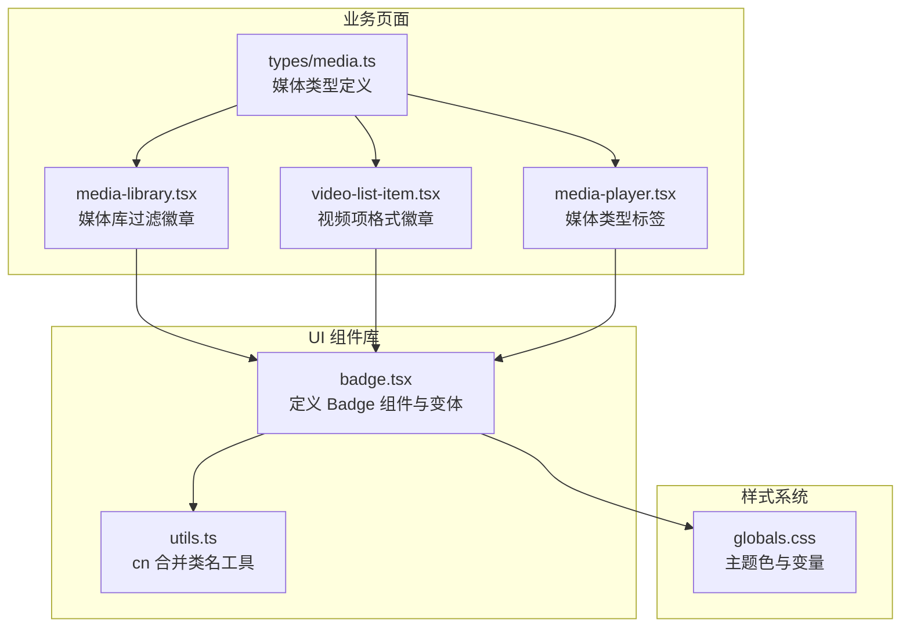
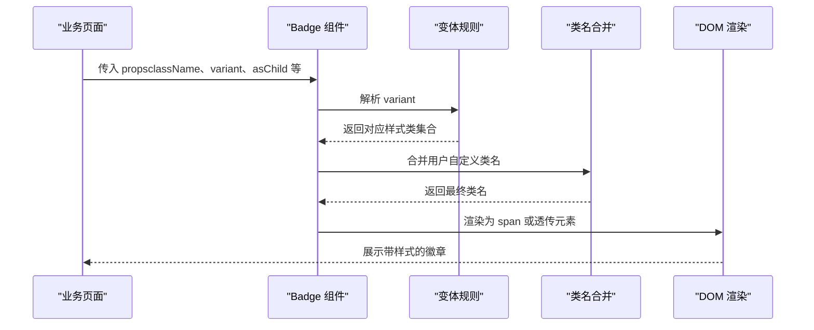
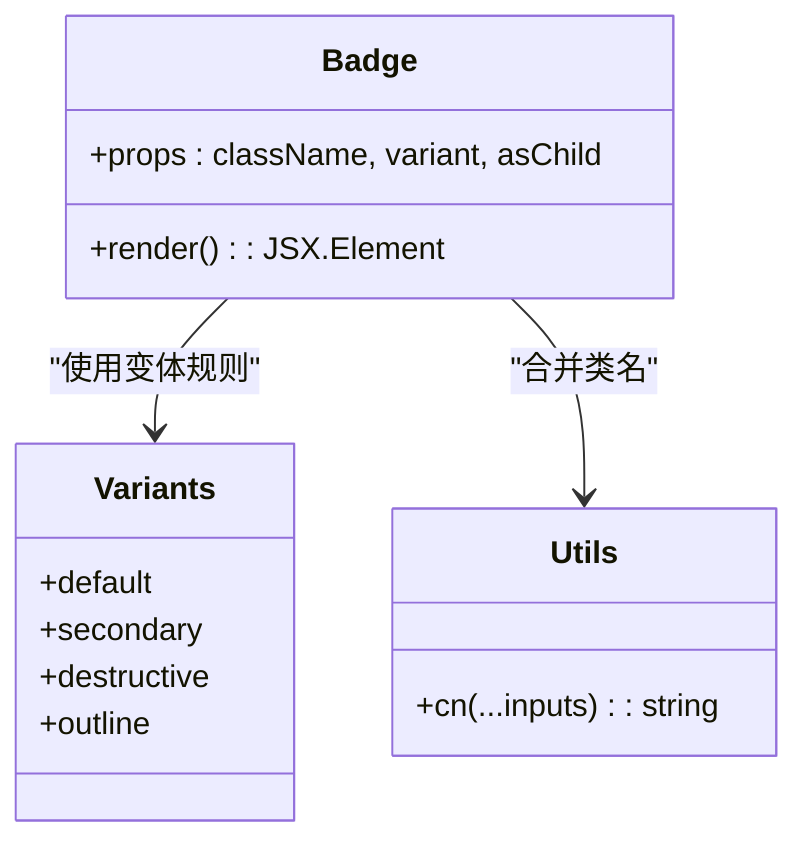
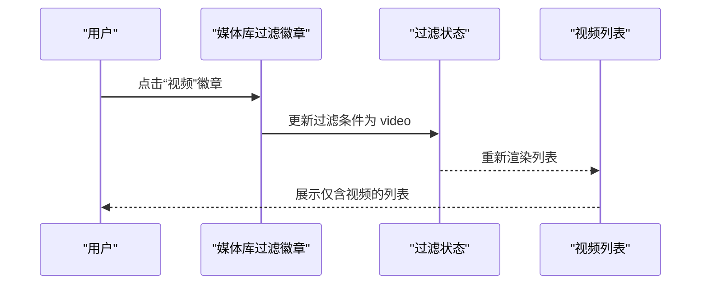
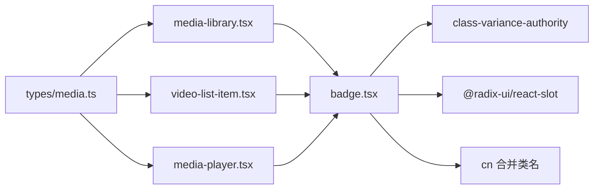

# 徽章组件

<cite>
**本文引用的文件**
- [app/web/components/ui/badge.tsx](file://app/web/components/ui/badge.tsx)
- [app/web/lib/utils.ts](file://app/web/lib/utils.ts)
- [app/web/components/media-library.tsx](file://app/web/components/media-library.tsx)
- [app/web/components/video-list-item.tsx](file://app/web/components/video-list-item.tsx)
- [app/web/components/media-player.tsx](file://app/web/components/media-player.tsx)
- [app/web/types/media.ts](file://app/web/types/media.ts)
- [app/web/app/globals.css](file://app/web/app/globals.css)
</cite>

## 目录
1. [引言](#引言)
2. [项目结构](#项目结构)
3. [核心组件](#核心组件)
4. [架构总览](#架构总览)
5. [详细组件分析](#详细组件分析)
6. [依赖关系分析](#依赖关系分析)
7. [性能考量](#性能考量)
8. [故障排查指南](#故障排查指南)
9. [结论](#结论)
10. [附录](#附录)

## 引言
本文件面向“徽章组件”的使用者与维护者，系统阐述其信息展示与视觉标识能力，覆盖样式变体、颜色体系、尺寸与字体、图标集成、布局协同及典型应用场景（如标签显示、状态指示、分类标识）。文档同时结合项目中的实际使用案例，帮助读者快速理解并正确运用该组件。

## 项目结构
徽章组件位于前端工程的通用 UI 组件库中，采用 Tailwind CSS 与 class-variance-authority 实现变体与样式组合；在业务页面中以多种方式出现，用于展示媒体类型、过滤状态、文件属性等信息。

图表来源
- [app/web/components/ui/badge.tsx](file://app/web/components/ui/badge.tsx#L1-L47)
- [app/web/lib/utils.ts](file://app/web/lib/utils.ts#L1-L7)
- [app/web/components/media-library.tsx](file://app/web/components/media-library.tsx#L48-L80)
- [app/web/components/video-list-item.tsx](file://app/web/components/video-list-item.tsx#L69-L73)
- [app/web/components/media-player.tsx](file://app/web/components/media-player.tsx#L149-L163)
- [app/web/types/media.ts](file://app/web/types/media.ts#L1-L20)
- [app/web/app/globals.css](file://app/web/app/globals.css#L1-L131)

章节来源
- [app/web/components/ui/badge.tsx](file://app/web/components/ui/badge.tsx#L1-L47)
- [app/web/lib/utils.ts](file://app/web/lib/utils.ts#L1-L7)
- [app/web/components/media-library.tsx](file://app/web/components/media-library.tsx#L48-L80)
- [app/web/components/video-list-item.tsx](file://app/web/components/video-list-item.tsx#L69-L73)
- [app/web/components/media-player.tsx](file://app/web/components/media-player.tsx#L149-L163)
- [app/web/types/media.ts](file://app/web/types/media.ts#L1-L20)
- [app/web/app/globals.css](file://app/web/app/globals.css#L1-L131)

## 核心组件
- 组件名称：Badge
- 组件定位：轻量级信息展示与视觉标识元素，常用于标签、状态、分类等场景
- 关键特性：
  - 变体系统：default、secondary、destructive、outline
  - 圆形与紧凑尺寸：内置紧凑尺寸与圆角
  - 图标集成：支持在徽章内嵌入图标，图标尺寸与交互行为受控
  - 无障碍与焦点：支持键盘焦点环与无效态提示
  - 组合渲染：支持 asChild 透传为任意元素（如链接）

章节来源
- [app/web/components/ui/badge.tsx](file://app/web/components/ui/badge.tsx#L1-L47)

## 架构总览
徽章组件通过 class-variance-authority 定义变体规则，借助 cn 工具合并类名，最终渲染为 span 或由 asChild 透传的元素。在业务页面中，徽章与媒体类型、过滤状态、文件属性等数据结合，形成统一的信息展示风格。

图表来源
- [app/web/components/ui/badge.tsx](file://app/web/components/ui/badge.tsx#L1-L47)
- [app/web/lib/utils.ts](file://app/web/lib/utils.ts#L1-L7)

## 详细组件分析

### 组件实现与变体
- 变体定义
  - default：主色背景与前景色，适合常规标签
  - secondary：次级背景与前景色，适合辅助标签
  - destructive：破坏性背景与白色文字，适合警示或错误状态
  - outline：边框与前景色，适合弱化强调或可切换状态
- 尺寸与排版
  - 紧凑尺寸：内置 px-2 py-0.5，适合短文本标签
  - 圆角：rounded-full，适合圆形徽章
  - 字体：text-xs、font-medium，保证信息密度与可读性
  - 间距：gap-1，图标与文本之间留白
- 图标集成
  - 通过选择器 [&>svg] 控制内部图标尺寸与事件
  - 支持作为子元素直接嵌入图标
- 无障碍与焦点
  - focus-visible 边框与 ring 效果，支持键盘导航
  - aria-invalid 与无效态提示
- 渲染策略
  - 默认渲染为 span
  - asChild 为 true 时，使用 Slot 透传为任意元素（如链接）

图表来源
- [app/web/components/ui/badge.tsx](file://app/web/components/ui/badge.tsx#L1-L47)
- [app/web/lib/utils.ts](file://app/web/lib/utils.ts#L1-L7)

章节来源
- [app/web/components/ui/badge.tsx](file://app/web/components/ui/badge.tsx#L1-L47)
- [app/web/lib/utils.ts](file://app/web/lib/utils.ts#L1-L7)

### 样式与颜色体系
- 主题色变量
  - 通过全局 CSS 定义了背景、前景、卡片、强调、破坏性、边框、输入、环等色阶变量
  - 变体中的颜色来源于这些变量，保证深浅色模式一致性
- 变体与颜色映射
  - default：主色背景与前景色
  - secondary：次级背景与前景色
  - destructive：破坏性背景与白色文字
  - outline：边框与前景色，适合弱化强调
- 无效态与焦点
  - 无效态通过 aria-invalid 触发破坏性 ring 与边框
  - 焦点通过 focus-visible 触发 ring 环

章节来源
- [app/web/app/globals.css](file://app/web/app/globals.css#L1-L131)
- [app/web/components/ui/badge.tsx](file://app/web/components/ui/badge.tsx#L1-L47)

### 尺寸规格、字体样式与图标集成
- 尺寸规格
  - 紧凑尺寸：px-2 py-0.5，适合短文本标签
  - 圆角：rounded-full，适合圆形徽章
- 字体样式
  - text-xs：小号字体，适合标签
  - font-medium：中等字重，保证可读性
- 图标集成
  - 通过 [&>svg] 控制图标尺寸与交互
  - 图标与文本之间 gap-1，保证视觉平衡

章节来源
- [app/web/components/ui/badge.tsx](file://app/web/components/ui/badge.tsx#L1-L47)

### 在标签显示、状态指示、分类标识中的应用

#### 标签显示（媒体类型）
- 媒体库过滤徽章
  - 通过 variant 切换“默认/描边”样式，配合点击切换过滤状态
  - 适合在筛选区展示“全部/视频/音频/流媒体”等标签
- 视频项格式徽章
  - 在视频缩略图左上角展示格式标签（如 MP4、WebM、HLS），使用强调色突出
- 媒体类型标签
  - 在媒体播放器中展示媒体类型说明（如 MP4视频、HLS流媒体），用于信息补充

图表来源
- [app/web/components/media-library.tsx](file://app/web/components/media-library.tsx#L48-L80)

章节来源
- [app/web/components/media-library.tsx](file://app/web/components/media-library.tsx#L48-L80)
- [app/web/components/video-list-item.tsx](file://app/web/components/video-list-item.tsx#L69-L73)
- [app/web/components/media-player.tsx](file://app/web/components/media-player.tsx#L149-L163)

### 在布局系统中的协调配合
- Flex 布局
  - Badge 默认 inline-flex，便于在行内与其他元素对齐
- Gap 与对齐
  - gap-1 保证图标与文本间距一致
  - items-center 与 justify-center 保证垂直居中
- 尺寸与自适应
  - w-fit 与 whitespace-nowrap 使徽章宽度自适应内容
  - shrink-0 防止在 flex 中被压缩
- 与卡片、按钮等组件的搭配
  - 与 Card、Button 等组件组合，形成统一的视觉层级

章节来源
- [app/web/components/ui/badge.tsx](file://app/web/components/ui/badge.tsx#L1-L47)

## 依赖关系分析
- 组件依赖
  - class-variance-authority：定义变体规则
  - radix-ui/react-slot：支持 asChild 透传
  - tailwind-merge/clsx：合并类名，避免冲突
- 页面依赖
  - 媒体库过滤徽章依赖媒体类型枚举与过滤状态
  - 视频项格式徽章依赖媒体类型映射
  - 媒体播放器类型标签依赖媒体类型映射

图表来源
- [app/web/components/ui/badge.tsx](file://app/web/components/ui/badge.tsx#L1-L47)
- [app/web/lib/utils.ts](file://app/web/lib/utils.ts#L1-L7)
- [app/web/components/media-library.tsx](file://app/web/components/media-library.tsx#L48-L80)
- [app/web/components/video-list-item.tsx](file://app/web/components/video-list-item.tsx#L69-L73)
- [app/web/components/media-player.tsx](file://app/web/components/media-player.tsx#L149-L163)
- [app/web/types/media.ts](file://app/web/types/media.ts#L1-L20)

章节来源
- [app/web/components/ui/badge.tsx](file://app/web/components/ui/badge.tsx#L1-L47)
- [app/web/lib/utils.ts](file://app/web/lib/utils.ts#L1-L7)
- [app/web/components/media-library.tsx](file://app/web/components/media-library.tsx#L48-L80)
- [app/web/components/video-list-item.tsx](file://app/web/components/video-list-item.tsx#L69-L73)
- [app/web/components/media-player.tsx](file://app/web/components/media-player.tsx#L149-L163)
- [app/web/types/media.ts](file://app/web/types/media.ts#L1-L20)

## 性能考量
- 渲染成本
  - Badge 为轻量级元素，渲染开销极低
  - 变体与类名合并发生在组件初始化阶段，无额外计算负担
- 图标渲染
  - 内嵌图标尺寸受控，避免过大图标导致布局抖动
- 可访问性
  - 焦点环与无效态提示减少重复渲染与状态判断
- 建议
  - 在大量徽章场景中，优先使用紧凑尺寸与简短文案
  - 避免在同一行放置过多徽章，以免影响可读性

[本节为通用指导，不直接分析具体文件]

## 故障排查指南
- 图标不显示或尺寸异常
  - 检查是否正确嵌入图标元素，确认 [&>svg] 选择器生效
  - 确认图标尺寸与徽章尺寸匹配
- 样式冲突
  - 使用 cn 工具合并类名，避免重复覆盖
  - 检查主题色变量是否被覆盖
- 焦点环与无效态
  - 确保 aria-invalid 正确设置，以便触发无效态样式
  - 检查 focus-visible 行为是否被其他样式覆盖

章节来源
- [app/web/components/ui/badge.tsx](file://app/web/components/ui/badge.tsx#L1-L47)
- [app/web/lib/utils.ts](file://app/web/lib/utils.ts#L1-L7)
- [app/web/app/globals.css](file://app/web/app/globals.css#L1-L131)

## 结论
徽章组件以简洁的变体系统与统一的样式基线，为标签、状态与分类提供了清晰的视觉表达。通过紧凑尺寸、圆角与图标集成，既能满足信息密度需求，又能在不同布局中保持一致的观感。结合项目中的媒体类型、过滤状态与文件属性展示，徽章成为提升用户体验的重要视觉元素。

[本节为总结性内容，不直接分析具体文件]

## 附录

### 使用示例与场景指引
- 媒体库过滤徽章
  - 用途：切换“全部/视频/音频/流媒体”等过滤状态
  - 参考路径：[app/web/components/media-library.tsx](file://app/web/components/media-library.tsx#L48-L80)
- 视频项格式徽章
  - 用途：在缩略图左上角展示格式标签（如 MP4、WebM、HLS）
  - 参考路径：[app/web/components/video-list-item.tsx](file://app/web/components/video-list-item.tsx#L69-L73)
- 媒体类型标签
  - 用途：在媒体播放器中展示媒体类型说明（如 MP4视频、HLS流媒体）
  - 参考路径：[app/web/components/media-player.tsx](file://app/web/components/media-player.tsx#L149-L163)
- 媒体类型定义
  - 用途：统一媒体类型枚举与映射
  - 参考路径：[app/web/types/media.ts](file://app/web/types/media.ts#L1-L20)

章节来源
- [app/web/components/media-library.tsx](file://app/web/components/media-library.tsx#L48-L80)
- [app/web/components/video-list-item.tsx](file://app/web/components/video-list-item.tsx#L69-L73)
- [app/web/components/media-player.tsx](file://app/web/components/media-player.tsx#L149-L163)
- [app/web/types/media.ts](file://app/web/types/media.ts#L1-L20)