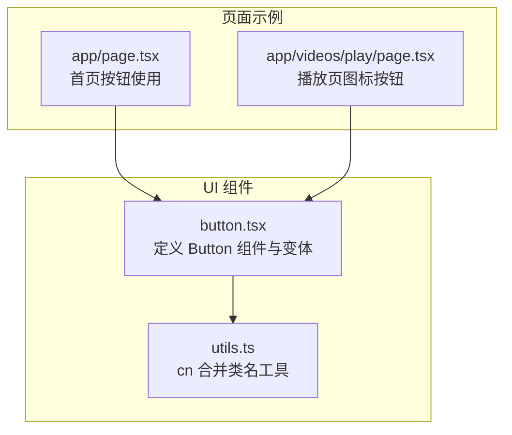
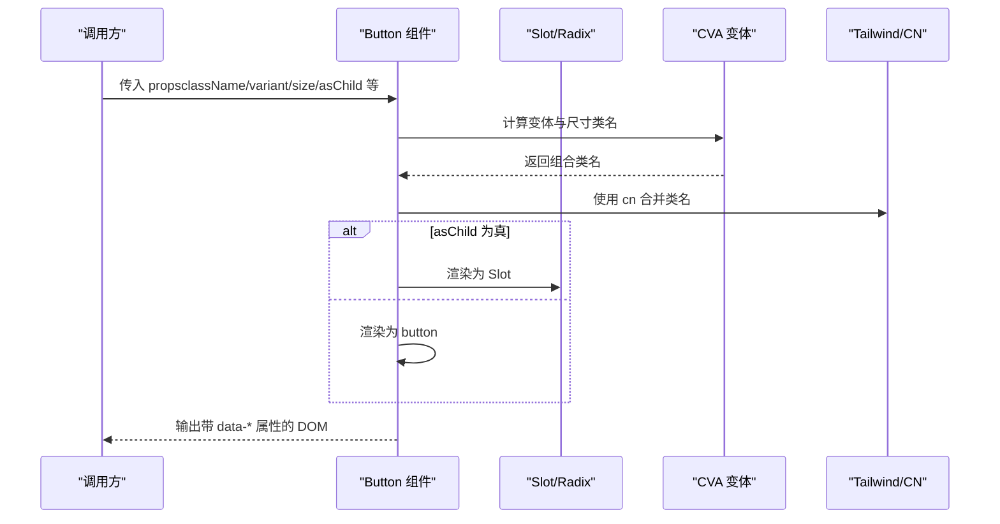
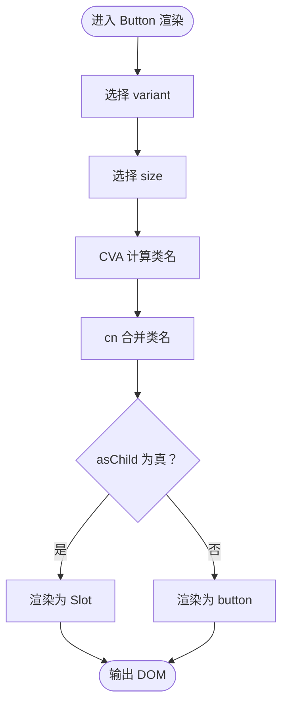
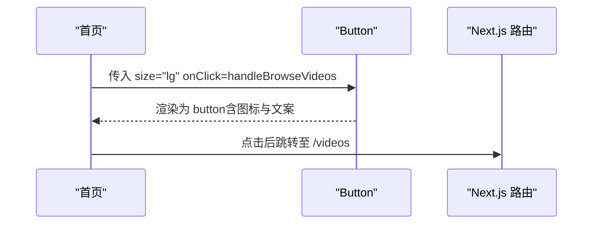
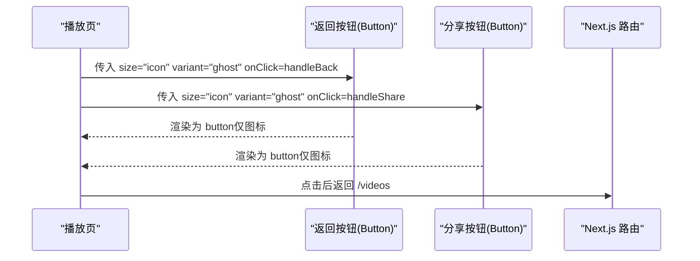
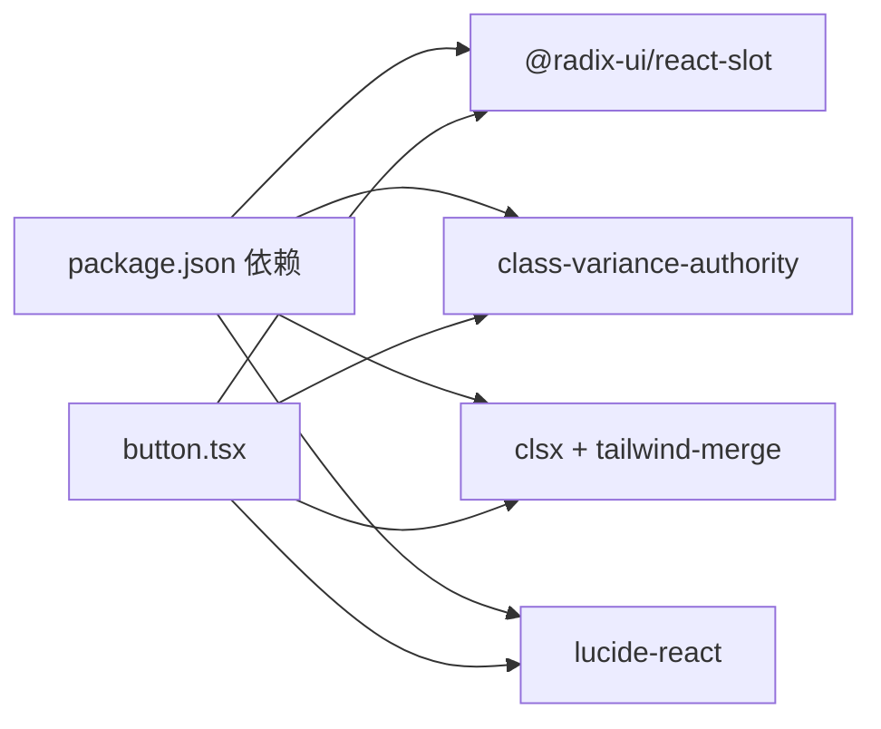

# 按钮组件

<cite>
**本文引用的文件**
- [app/web/components/ui/button.tsx](file://app/web/components/ui/button.tsx)
- [app/web/lib/utils.ts](file://app/web/lib/utils.ts)
- [app/web/app/page.tsx](file://app/web/app/page.tsx)
- [app/web/app/videos/play/page.tsx](file://app/web/app/videos/play/page.tsx)
- [app/web/package.json](file://app/web/package.json)
</cite>

## 目录
1. [引言](#引言)
2. [项目结构](#项目结构)
3. [核心组件](#核心组件)
4. [架构总览](#架构总览)
5. [详细组件分析](#详细组件分析)
6. [依赖关系分析](#依赖关系分析)
7. [性能考量](#性能考量)
8. [故障排查指南](#故障排查指南)
9. [结论](#结论)
10. [附录](#附录)

## 引言
本文件面向使用者与开发者，系统性介绍按钮组件的设计与使用方法。该组件基于 Radix UI Slot 与 class-variance-authority（CVA）实现，提供统一的变体与尺寸体系，支持 SVG 图标内联、禁用与焦点状态的视觉反馈，并在多个页面中以不同场景展示其应用模式。本文将从架构、数据流、处理逻辑、可访问性与性能等方面进行深入解析，并给出常见问题排查与最佳实践建议。

## 项目结构
按钮组件位于前端 Next.js 应用的 UI 组件目录中，配合 Tailwind CSS 与 CVA 的变体系统，形成一致的视觉与交互体验。项目中还包含若干页面示例，展示了按钮在不同场景下的使用方式。

图表来源
- [app/web/components/ui/button.tsx](file://app/web/components/ui/button.tsx#L1-L63)
- [app/web/lib/utils.ts](file://app/web/lib/utils.ts#L1-L7)
- [app/web/app/page.tsx](file://app/web/app/page.tsx#L37-L52)
- [app/web/app/videos/play/page.tsx](file://app/web/app/videos/play/page.tsx#L70-L100)

章节来源
- [app/web/components/ui/button.tsx](file://app/web/components/ui/button.tsx#L1-L63)
- [app/web/lib/utils.ts](file://app/web/lib/utils.ts#L1-L7)
- [app/web/app/page.tsx](file://app/web/app/page.tsx#L37-L52)
- [app/web/app/videos/play/page.tsx](file://app/web/app/videos/play/page.tsx#L70-L100)

## 核心组件
- 组件名称：Button
- 核心能力：
  - 基于 Radix UI Slot 的“透传渲染”能力，支持将 Button 渲染为任意元素（如链接、自定义容器等），同时保留原生 button 的语义与可访问性。
  - 基于 class-variance-authority 的变体与尺寸系统，统一管理外观与尺寸。
  - 通过 data-* 属性暴露变体与尺寸信息，便于主题与调试。
  - 内置禁用态与焦点态视觉反馈，支持 SVG 图标内联与对齐。
- 关键属性：
  - className：追加自定义样式
  - variant：变体（default、destructive、outline、secondary、ghost、link）
  - size：尺寸（default、sm、lg、icon、icon-sm、icon-lg）
  - asChild：是否以 Slot 形式透传渲染
  - 其他原生 button 属性（如 onClick、disabled、type 等）

章节来源
- [app/web/components/ui/button.tsx](file://app/web/components/ui/button.tsx#L1-L63)

## 架构总览
按钮组件的渲染流程如下：根据传入的 variant 与 size，结合 CVA 生成最终类名；通过 asChild 判断渲染为 Slot 或原生 button；将 data-slot、data-variant、data-size 作为语义化与调试标识注入 DOM；借助 cn 工具合并类名，保证 Tailwind 与自定义样式的正确合并。

图表来源
- [app/web/components/ui/button.tsx](file://app/web/components/ui/button.tsx#L1-L63)
- [app/web/lib/utils.ts](file://app/web/lib/utils.ts#L1-L7)

## 详细组件分析

### 变体系统与尺寸规格
- 变体（variant）
  - default：主色背景与前景色，悬停时轻微透明度变化
  - destructive：破坏性动作的警示色，暗色主题下具备更明显的对比
  - outline：边框 + 背景 + 阴影 + 悬停前景色变化，暗色主题下边框与背景有差异化
  - secondary：次级强调色，悬停时轻微透明度变化
  - ghost：仅悬停态有背景变化，适合轻量交互
  - link：纯文字链接样式，悬停时下划线
- 尺寸（size）
  - default：常规高度与内边距，当包含 SVG 时自动调整内边距
  - sm：更小尺寸，适合紧凑布局
  - lg：更大尺寸，适合大按钮
  - icon：方形等宽按钮，适合仅图标场景
  - icon-sm：更小的方形按钮
  - icon-lg：更大的方形按钮

图表来源
- [app/web/components/ui/button.tsx](file://app/web/components/ui/button.tsx#L1-L63)

章节来源
- [app/web/components/ui/button.tsx](file://app/web/components/ui/button.tsx#L1-L63)

### 可访问性与焦点状态
- 焦点可见性：内置聚焦环与边框样式，确保键盘可达性
- 无效状态：通过 aria-invalid 与对应颜色的光晕反馈，提示表单校验状态
- 禁用态：禁用时阻止指针事件并降低不透明度，同时保持可聚焦性以便屏幕阅读器识别
- SVG 内联：自动为内部 SVG 设置 pointer-events:none，避免遮挡点击区域

章节来源
- [app/web/components/ui/button.tsx](file://app/web/components/ui/button.tsx#L1-L63)

### SVG 图标集成
- 支持在按钮内直接嵌入 SVG，组件会自动为内部 SVG 设置合适的尺寸与对齐策略
- 当按钮包含图标时，内边距会按需调整，保证图标与文本的视觉平衡
- 在禁用态下，内部 SVG 也会继承禁用态样式，避免视觉不一致

章节来源
- [app/web/components/ui/button.tsx](file://app/web/components/ui/button.tsx#L1-L63)

### 实际使用示例与场景模式
- 首页大按钮（大尺寸 + 图标 + 文案）
  - 场景：引导用户进入视频库
  - 特点：使用 lg 尺寸、包含图标、较大内边距与字号
  - 参考路径：[app/web/app/page.tsx](file://app/web/app/page.tsx#L37-L52)
- 播放页图标按钮（图标按钮 + 幽灵变体）
  - 场景：返回与分享等轻量操作
  - 特点：使用 icon/icon-sm 尺寸、ghost 变体、较小尺寸与悬停态背景
  - 参考路径：[app/web/app/videos/play/page.tsx](file://app/web/app/videos/play/page.tsx#L70-L100)

图表来源
- [app/web/app/page.tsx](file://app/web/app/page.tsx#L37-L52)

图表来源
- [app/web/app/videos/play/page.tsx](file://app/web/app/videos/play/page.tsx#L70-L100)

章节来源
- [app/web/app/page.tsx](file://app/web/app/page.tsx#L37-L52)
- [app/web/app/videos/play/page.tsx](file://app/web/app/videos/play/page.tsx#L70-L100)

## 依赖关系分析
- 组件依赖
  - @radix-ui/react-slot：提供 Slot 组件，实现 asChild 透传渲染
  - class-variance-authority：提供 CVA 变体系统，集中管理 variant/size 的类名组合
  - tailwind-merge + clsx：合并类名，解决冲突与重复
  - lucide-react：提供图标库，便于在按钮中内联 SVG
- 组件耦合
  - Button 与 utils.cn 解耦良好，通过 cn 合并类名，便于主题与样式扩展
  - 与 Radix UI 的耦合体现在 Slot 的使用，保证可访问性与语义化
- 外部集成
  - 页面通过 import Button 使用组件，无需关心内部实现细节

图表来源
- [app/web/package.json](file://app/web/package.json#L1-L74)
- [app/web/components/ui/button.tsx](file://app/web/components/ui/button.tsx#L1-L63)
- [app/web/lib/utils.ts](file://app/web/lib/utils.ts#L1-L7)

章节来源
- [app/web/package.json](file://app/web/package.json#L1-L74)
- [app/web/components/ui/button.tsx](file://app/web/components/ui/button.tsx#L1-L63)
- [app/web/lib/utils.ts](file://app/web/lib/utils.ts#L1-L7)

## 性能考量
- 渲染开销
  - CVA 计算类名为纯函数，开销极低
  - asChild 透传渲染避免多余 DOM 包裹，减少层级
- 样式合并
  - 使用 tailwind-merge 合并类名，避免重复与冲突，减少样式体积
- 图标渲染
  - 内联 SVG 与尺寸控制在组件内完成，避免额外计算
- 建议
  - 在高频渲染场景中，尽量复用 Button 的变体与尺寸，减少不必要的 props 变化
  - 对于大量按钮的列表，优先使用 icon 系列尺寸，降低视觉噪音与渲染压力

[本节为通用性能建议，不直接分析具体文件]

## 故障排查指南
- 焦点环与光晕不显示
  - 检查是否正确引入主题与 Tailwind 配置，确保 ring 与 focus-visible 样式生效
  - 确认未被外部样式覆盖
- 禁用态不可点击但视觉反馈不足
  - 确认已传入 disabled 属性
  - 检查主题是否覆盖了禁用态样式
- 图标点击区域异常
  - 确保内部 SVG 未设置 pointer-events，组件已自动处理
  - 若自定义 SVG，请确保尺寸与按钮尺寸匹配
- asChild 透传失效
  - 确认传入的子元素为有效可渲染节点
  - 检查父级容器是否阻止了事件传播

章节来源
- [app/web/components/ui/button.tsx](file://app/web/components/ui/button.tsx#L1-L63)

## 结论
按钮组件通过 Radix UI Slot 与 class-variance-authority 的组合，实现了高可定制、强可访问性的 UI 基础能力。其变体与尺寸体系覆盖了从大按钮到图标按钮的广泛场景，配合 SVG 内联与禁用/焦点状态反馈，能够在不同页面中稳定地提供一致的交互体验。建议在实际项目中遵循本文的使用模式与最佳实践，以获得更好的可维护性与一致性。

[本节为总结性内容，不直接分析具体文件]

## 附录
- 变体与尺寸对照表（便于快速查阅）
  - 变体：default、destructive、outline、secondary、ghost、link
  - 尺寸：default、sm、lg、icon、icon-sm、icon-lg
- 常用组合示例（路径参考）
  - 首页大按钮：[app/web/app/page.tsx](file://app/web/app/page.tsx#L37-L52)
  - 播放页图标按钮：[app/web/app/videos/play/page.tsx](file://app/web/app/videos/play/page.tsx#L70-L100)

章节来源
- [app/web/app/page.tsx](file://app/web/app/page.tsx#L37-L52)
- [app/web/app/videos/play/page.tsx](file://app/web/app/videos/play/page.tsx#L70-L100)