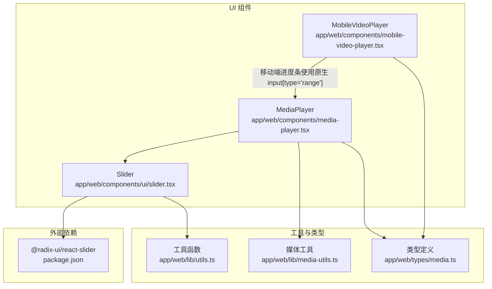
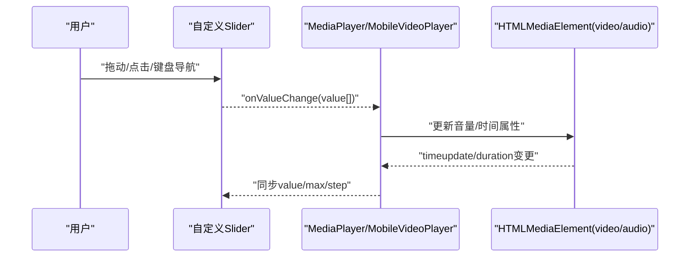
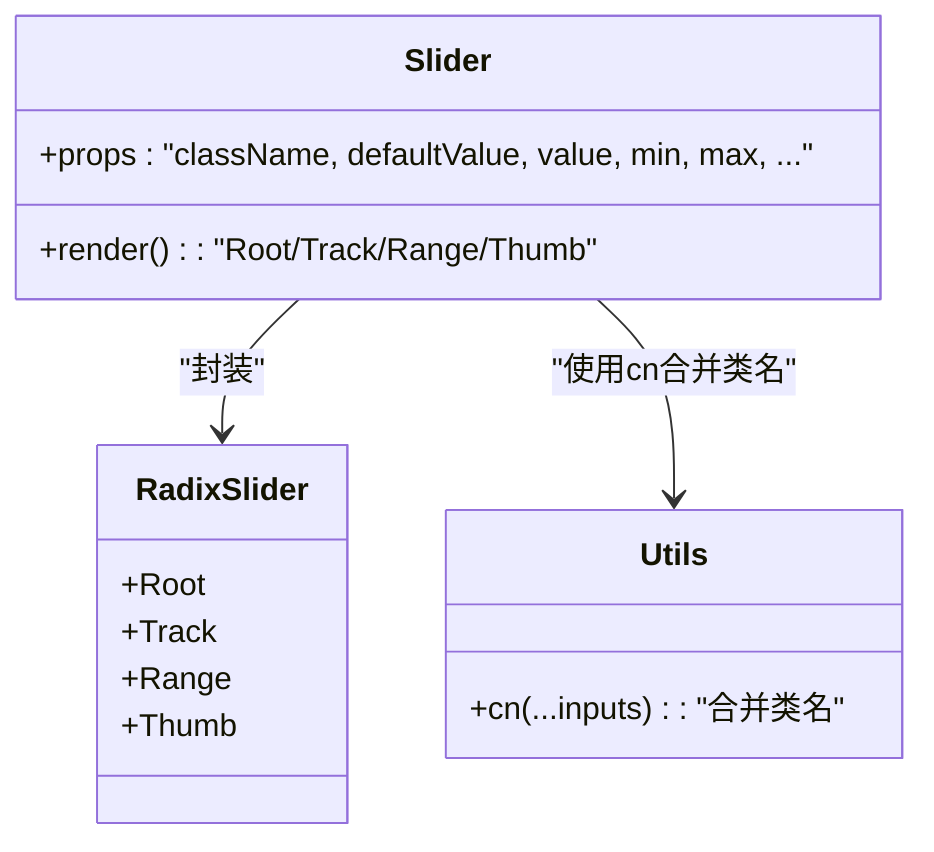
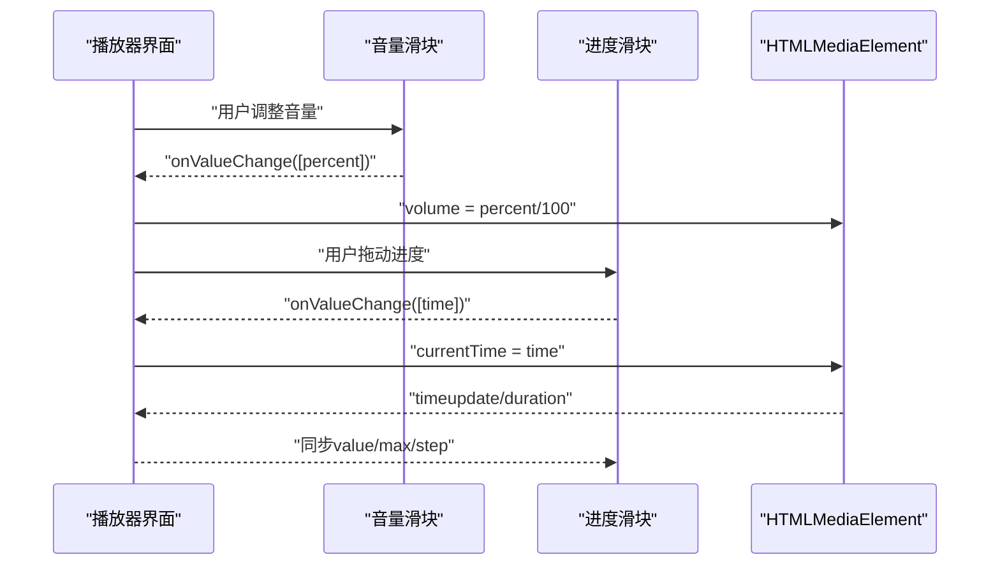
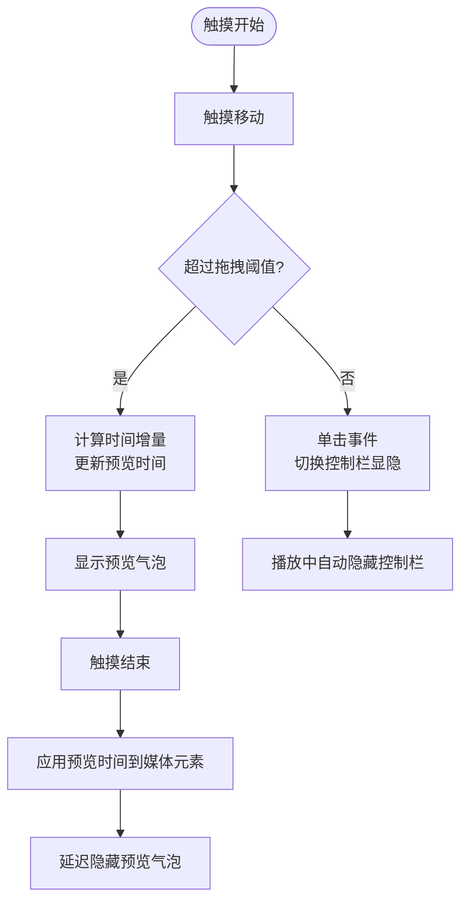
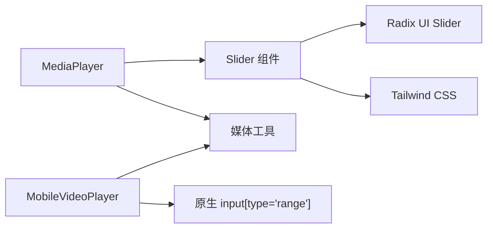

# 滑块组件

<cite>
**本文引用的文件**
- [app/web/components/ui/slider.tsx](file://app/web/components/ui/slider.tsx)
- [app/web/components/media-player.tsx](file://app/web/components/media-player.tsx)
- [app/web/components/mobile-video-player.tsx](file://app/web/components/mobile-video-player.tsx)
- [app/web/lib/utils.ts](file://app/web/lib/utils.ts)
- [app/web/lib/media-utils.ts](file://app/web/lib/media-utils.ts)
- [app/web/types/media.ts](file://app/web/types/media.ts)
- [app/web/package.json](file://app/web/package.json)
</cite>

## 目录
1. [简介](#简介)
2. [项目结构](#项目结构)
3. [核心组件](#核心组件)
4. [架构总览](#架构总览)
5. [详细组件分析](#详细组件分析)
6. [依赖关系分析](#依赖关系分析)
7. [性能考虑](#性能考虑)
8. [故障排查指南](#故障排查指南)
9. [结论](#结论)
10. [附录](#附录)

## 简介
本文件系统性地介绍滑块组件的设计与实现，覆盖交互设计、数值控制、样式定制、轨道与手柄设计、键盘导航与触摸交互、无障碍访问，以及在音量控制、播放进度调节、亮度调节等典型场景中的使用方式，并解释滑块与媒体播放器的集成模式。

## 项目结构
滑块组件位于前端 Next.js 应用中，采用 Radix UI 的可组合基础组件进行封装，结合 Tailwind CSS 实现样式定制。媒体播放器通过该滑块实现音量与进度控制，并在移动端提供触摸拖拽进度的增强体验。

图表来源
- [app/web/components/ui/slider.tsx](file://app/web/components/ui/slider.tsx#L1-L63)
- [app/web/components/media-player.tsx](file://app/web/components/media-player.tsx#L1-L322)
- [app/web/components/mobile-video-player.tsx](file://app/web/components/mobile-video-player.tsx#L1-L479)
- [app/web/lib/utils.ts](file://app/web/lib/utils.ts#L1-L7)
- [app/web/lib/media-utils.ts](file://app/web/lib/media-utils.ts#L1-L43)
- [app/web/types/media.ts](file://app/web/types/media.ts#L1-L20)
- [app/web/package.json](file://app/web/package.json#L1-L200)

章节来源
- [app/web/components/ui/slider.tsx](file://app/web/components/ui/slider.tsx#L1-L63)
- [app/web/components/media-player.tsx](file://app/web/components/media-player.tsx#L1-L322)
- [app/web/components/mobile-video-player.tsx](file://app/web/components/mobile-video-player.tsx#L1-L479)
- [app/web/lib/utils.ts](file://app/web/lib/utils.ts#L1-L7)
- [app/web/lib/media-utils.ts](file://app/web/lib/media-utils.ts#L1-L43)
- [app/web/types/media.ts](file://app/web/types/media.ts#L1-L20)
- [app/web/package.json](file://app/web/package.json#L1-L200)

## 核心组件
- 自定义滑块组件：基于 Radix UI 的 Slider Root、Track、Range、Thumb 构建，支持最小/最大值、步长、多手柄、禁用态、方向（水平/垂直）等通用能力；通过 Tailwind 类名实现轨道与手柄的样式定制。
- 媒体播放器：在桌面端使用自定义滑块实现音量与进度控制；在移动端使用原生 input[type='range'] 实现进度拖拽，并提供触摸预览与自动隐藏控制栏。
- 工具与类型：提供类名合并工具、媒体类型判断与格式化工具、媒体项类型定义。

章节来源
- [app/web/components/ui/slider.tsx](file://app/web/components/ui/slider.tsx#L1-L63)
- [app/web/components/media-player.tsx](file://app/web/components/media-player.tsx#L180-L219)
- [app/web/components/mobile-video-player.tsx](file://app/web/components/mobile-video-player.tsx#L406-L430)
- [app/web/lib/utils.ts](file://app/web/lib/utils.ts#L1-L7)
- [app/web/lib/media-utils.ts](file://app/web/lib/media-utils.ts#L1-L43)
- [app/web/types/media.ts](file://app/web/types/media.ts#L1-L20)

## 架构总览
滑块组件作为媒体播放器的输入控件，通过受控或非受控的方式接收数值，再将用户交互转化为对媒体元素（视频/音频）的属性更新。移动端播放器在滑块基础上，叠加触摸拖拽逻辑以提升交互效率。

图表来源
- [app/web/components/ui/slider.tsx](file://app/web/components/ui/slider.tsx#L1-L63)
- [app/web/components/media-player.tsx](file://app/web/components/media-player.tsx#L105-L128)
- [app/web/components/mobile-video-player.tsx](file://app/web/components/mobile-video-player.tsx#L223-L230)

## 详细组件分析

### 自定义滑块组件（Slider）
- 设计要点
  - 使用 Radix UI 的 Root/Track/Range/Thumb 组合，保证可访问性与跨平台一致性。
  - 支持最小值、最大值、步长、禁用态、方向（水平/垂直）等通用属性。
  - 手柄数量根据 value/defaultValue 推断，支持单手柄与双手柄场景。
  - 轨道与手柄通过 Tailwind 类名实现主题化，便于统一风格与定制。
- 数值控制
  - 支持受控与非受控两种模式，内部根据 value 或 defaultValue 推导当前值数组。
  - 通过 data-slot 属性标记子元素，便于样式覆盖与无障碍识别。
- 样式定制
  - 轨道：背景色、高度/宽度、圆角等由 Track 类名控制。
  - 进度范围：Range 类名控制进度区域的背景与尺寸。
  - 手柄：尺寸、边框、阴影、聚焦环、禁用态等由 Thumb 类名控制。
- 无障碍与键盘
  - 基于 Radix UI 的可访问性语义，支持键盘导航与屏幕阅读器识别。
  - 提供 data-slot 便于辅助技术定位子元素。

图表来源
- [app/web/components/ui/slider.tsx](file://app/web/components/ui/slider.tsx#L1-L63)
- [app/web/lib/utils.ts](file://app/web/lib/utils.ts#L1-L7)

章节来源
- [app/web/components/ui/slider.tsx](file://app/web/components/ui/slider.tsx#L1-L63)
- [app/web/lib/utils.ts](file://app/web/lib/utils.ts#L1-L7)

### 媒体播放器中的滑块集成
- 音量控制
  - 使用自定义 Slider，value 为单元素数组，max=100，step=1。
  - onValueChange 回调将百分比映射到媒体元素的 volume 属性。
- 播放进度控制
  - 使用自定义 Slider，value 为单元素数组，max 为 duration，step=0.1。
  - onValueChange 回调将目标时间写入媒体元素的 currentTime。
- 时间显示与格式化
  - 使用工具函数对秒数进行分钟:秒格式化，用于 UI 显示。
- 媒体类型与路径
  - 通过类型定义与工具函数判断媒体类型与路径规范化，确保播放 URL 正确。

图表来源
- [app/web/components/media-player.tsx](file://app/web/components/media-player.tsx#L180-L219)
- [app/web/components/media-player.tsx](file://app/web/components/media-player.tsx#L266-L278)
- [app/web/lib/media-utils.ts](file://app/web/lib/media-utils.ts#L1-L43)
- [app/web/types/media.ts](file://app/web/types/media.ts#L1-L20)

章节来源
- [app/web/components/media-player.tsx](file://app/web/components/media-player.tsx#L180-L219)
- [app/web/components/media-player.tsx](file://app/web/components/media-player.tsx#L266-L278)
- [app/web/lib/media-utils.ts](file://app/web/lib/media-utils.ts#L1-L43)
- [app/web/types/media.ts](file://app/web/types/media.ts#L1-L20)

### 移动端触摸拖拽进度
- 触摸交互
  - 通过 onTouchStart/Move/End 识别拖拽阈值与方向，计算像素位移换算为时间增量。
  - 拖拽过程中显示预览气泡，结束时应用最终时间并延迟隐藏预览。
  - 单击屏幕切换控制栏显隐，播放中自动隐藏控制栏。
- 进度条实现
  - 使用原生 input[type='range'] 实现进度条，配合样式定制与事件回调完成 seek。
- 与桌面端差异
  - 桌面端使用自定义 Slider；移动端使用原生 input[type='range'] 并补充触摸预览与自动隐藏控制栏。

图表来源
- [app/web/components/mobile-video-player.tsx](file://app/web/components/mobile-video-player.tsx#L233-L299)
- [app/web/components/mobile-video-player.tsx](file://app/web/components/mobile-video-player.tsx#L406-L430)

章节来源
- [app/web/components/mobile-video-player.tsx](file://app/web/components/mobile-video-player.tsx#L233-L299)
- [app/web/components/mobile-video-player.tsx](file://app/web/components/mobile-video-player.tsx#L406-L430)

## 依赖关系分析
- 组件依赖
  - 自定义滑块依赖 Radix UI 的 Slider Primitive，提供无障碍与可组合能力。
  - 播放器依赖自定义滑块与媒体工具函数，实现音量与进度控制。
  - 移动端播放器依赖原生 input[type='range'] 与触摸事件处理。
- 外部依赖
  - @radix-ui/react-slider：滑块基础能力与可访问性。
  - Tailwind CSS：样式定制与主题化。
  - 工具函数 cn：类名合并，避免冲突。

图表来源
- [app/web/components/ui/slider.tsx](file://app/web/components/ui/slider.tsx#L1-L63)
- [app/web/components/media-player.tsx](file://app/web/components/media-player.tsx#L1-L322)
- [app/web/components/mobile-video-player.tsx](file://app/web/components/mobile-video-player.tsx#L1-L479)
- [app/web/package.json](file://app/web/package.json#L1-L200)

章节来源
- [app/web/components/ui/slider.tsx](file://app/web/components/ui/slider.tsx#L1-L63)
- [app/web/components/media-player.tsx](file://app/web/components/media-player.tsx#L1-L322)
- [app/web/components/mobile-video-player.tsx](file://app/web/components/mobile-video-player.tsx#L1-L479)
- [app/web/package.json](file://app/web/package.json#L1-L200)

## 性能考虑
- 渲染开销
  - 自定义滑块为轻量组件，渲染成本低；在频繁更新的场景（如进度条）建议使用受控 value，避免不必要的重渲染。
- 事件处理
  - 播放器的 timeupdate 事件可能高频触发，建议在上层做节流或防抖，减少 UI 更新频率。
- 触摸拖拽
  - 移动端拖拽预览仅在拖拽阶段显示，避免额外 DOM 开销；预览气泡延迟隐藏减少闪烁。
- 样式与主题
  - 使用 Tailwind 类名与 cn 合并，避免重复样式与冲突，降低样式层复杂度。

## 故障排查指南
- 音量滑块无效
  - 检查 onValueChange 是否被调用，确认媒体元素是否存在且已加载。
  - 确认 value 为单元素数组，max=100，step=1。
- 进度滑块无法拖动
  - 检查 onValueChange 回调是否更新媒体元素的 currentTime。
  - 确认 max 为 duration，step 设置合理（如 0.1）。
- 移动端触摸无效
  - 检查 onTouchStart/Move/End 是否绑定，拖拽阈值与时间换算逻辑是否正确。
  - 确认预览气泡显示与隐藏逻辑未被其他交互覆盖。
- 样式异常
  - 检查 Tailwind 类名是否被覆盖，确认 cn 合并顺序与优先级。
  - 确认轨道与手柄类名未被第三方样式覆盖。

章节来源
- [app/web/components/media-player.tsx](file://app/web/components/media-player.tsx#L105-L128)
- [app/web/components/media-player.tsx](file://app/web/components/media-player.tsx#L180-L219)
- [app/web/components/mobile-video-player.tsx](file://app/web/components/mobile-video-player.tsx#L233-L299)
- [app/web/lib/utils.ts](file://app/web/lib/utils.ts#L1-L7)

## 结论
滑块组件通过 Radix UI 提供了可访问、可组合的基础能力，结合 Tailwind CSS 实现灵活的样式定制。在媒体播放器中，滑块承担音量与进度的核心控制职责；移动端则在滑块基础上增加触摸拖拽与控制栏自动隐藏，显著提升交互效率与用户体验。通过合理的数值控制、步长与精度配置，以及样式与无障碍设计，滑块可在多种业务场景中稳定可靠地工作。

## 附录

### 使用示例与最佳实践
- 音量控制
  - 使用单手柄滑块，max=100，step=1，value 为单元素数组，onValueChange 将百分比映射到媒体元素的 volume。
- 播放进度调节
  - 使用单手柄滑块，max=duration，step=0.1，value 为单元素数组，onValueChange 将目标时间写入 currentTime。
- 亮度调节（示意）
  - 若存在亮度控制需求，可复用滑块组件，max=100，step=1，value 为单元素数组，映射到目标亮度属性。
- 键盘导航与无障碍
  - 依赖 Radix UI 的可访问性语义，确保键盘可操作与屏幕阅读器友好。
- 触摸交互
  - 移动端使用原生 input[type='range'] 并结合触摸事件，提供拖拽预览与自动隐藏控制栏。

章节来源
- [app/web/components/media-player.tsx](file://app/web/components/media-player.tsx#L180-L219)
- [app/web/components/media-player.tsx](file://app/web/components/media-player.tsx#L266-L278)
- [app/web/components/mobile-video-player.tsx](file://app/web/components/mobile-video-player.tsx#L406-L430)
- [app/web/components/ui/slider.tsx](file://app/web/components/ui/slider.tsx#L1-L63)