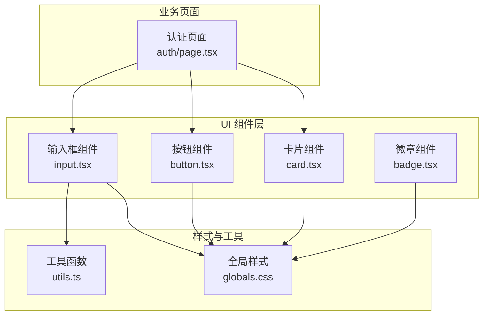
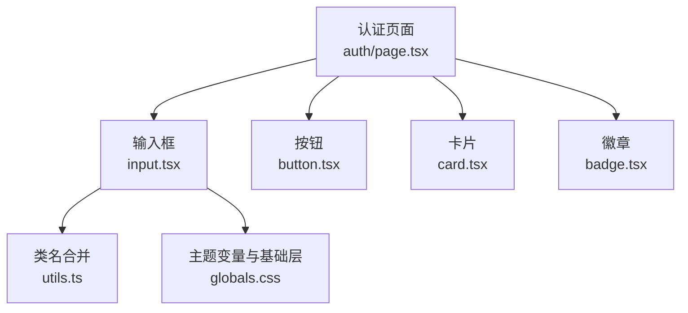
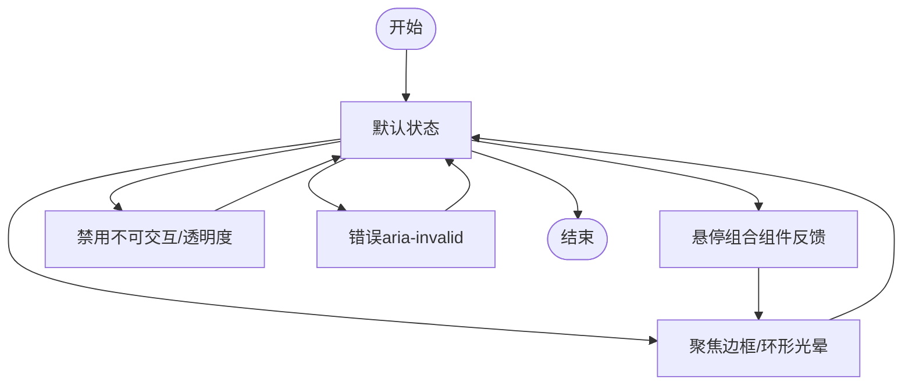
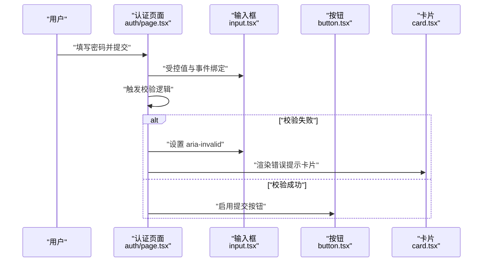
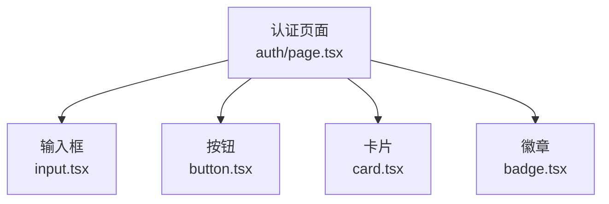
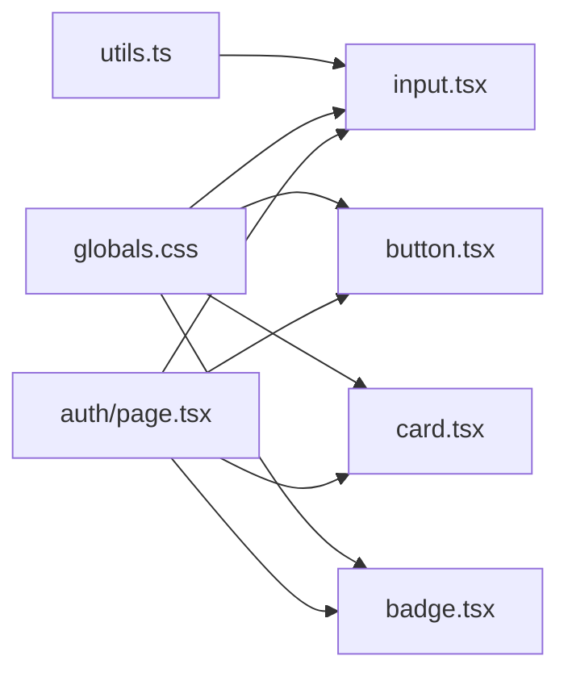

# 输入框组件

<cite>
**本文引用的文件**
- [app/web/components/ui/input.tsx](file://app/web/components/ui/input.tsx)
- [app/web/lib/utils.ts](file://app/web/lib/utils.ts)
- [app/web/app/globals.css](file://app/web/app/globals.css)
- [app/web/app/auth/page.tsx](file://app/web/app/auth/page.tsx)
- [app/web/components/ui/button.tsx](file://app/web/components/ui/button.tsx)
- [app/web/components/ui/card.tsx](file://app/web/components/ui/card.tsx)
- [app/web/components/ui/badge.tsx](file://app/web/components/ui/badge.tsx)
</cite>

## 目录
1. [简介](#简介)
2. [项目结构](#项目结构)
3. [核心组件](#核心组件)
4. [架构总览](#架构总览)
5. [详细组件分析](#详细组件分析)
6. [依赖分析](#依赖分析)
7. [性能考虑](#性能考虑)
8. [故障排查指南](#故障排查指南)
9. [结论](#结论)
10. [附录](#附录)

## 简介
本文件围绕输入框组件进行系统化说明，覆盖其样式系统、状态管理（默认、悬停、聚焦、禁用、错误）、尺寸与边框规范、占位符处理、表单验证与错误提示、无障碍访问支持，以及在搜索、文件路径输入、配置设置等典型场景中的协作方式。文档同时给出与表单组件的协同关系，并通过可视化图表帮助理解组件间的交互流程。

## 项目结构
输入框组件位于前端 Web 层，采用 Tailwind CSS 与原子化类名组合，配合全局主题变量与工具函数实现一致的视觉与交互体验。认证页面展示了输入框在真实表单中的使用方式，包括标签绑定、错误提示与按钮联动。



**图表来源**
- [app/web/components/ui/input.tsx](file://app/web/components/ui/input.tsx#L1-L21)
- [app/web/lib/utils.ts](file://app/web/lib/utils.ts#L1-L7)
- [app/web/app/globals.css](file://app/web/app/globals.css#L1-L131)
- [app/web/app/auth/page.tsx](file://app/web/app/auth/page.tsx#L1-L135)
- [app/web/components/ui/button.tsx](file://app/web/components/ui/button.tsx#L1-L63)
- [app/web/components/ui/card.tsx](file://app/web/components/ui/card.tsx#L1-L93)
- [app/web/components/ui/badge.tsx](file://app/web/components/ui/badge.tsx#L1-L46)

**章节来源**
- [app/web/components/ui/input.tsx](file://app/web/components/ui/input.tsx#L1-L21)
- [app/web/lib/utils.ts](file://app/web/lib/utils.ts#L1-L7)
- [app/web/app/globals.css](file://app/web/app/globals.css#L1-L131)
- [app/web/app/auth/page.tsx](file://app/web/app/auth/page.tsx#L1-L135)

## 核心组件
- 输入框组件：提供统一的输入控件，内置状态样式（聚焦、禁用、错误），支持占位符与选择文本颜色，继承全局主题色。
- 工具函数：合并类名，保证 Tailwind 类冲突时的正确合并。
- 全局样式：定义主题变量与基础层样式，为输入框提供边框、背景、阴影、环形光晕等视觉基线。
- 表单页面：在认证页面中演示输入框与按钮、卡片、徽章的组合使用，展示错误提示与键盘事件处理。

**章节来源**
- [app/web/components/ui/input.tsx](file://app/web/components/ui/input.tsx#L1-L21)
- [app/web/lib/utils.ts](file://app/web/lib/utils.ts#L1-L7)
- [app/web/app/globals.css](file://app/web/app/globals.css#L1-L131)
- [app/web/app/auth/page.tsx](file://app/web/app/auth/page.tsx#L1-L135)

## 架构总览
输入框组件通过原子化类名与全局主题变量实现跨组件一致的外观与交互；在表单中，输入框与按钮、卡片、徽章等组件共同构成完整的用户操作界面。



**图表来源**
- [app/web/components/ui/input.tsx](file://app/web/components/ui/input.tsx#L1-L21)
- [app/web/lib/utils.ts](file://app/web/lib/utils.ts#L1-L7)
- [app/web/app/globals.css](file://app/web/app/globals.css#L1-L131)
- [app/web/app/auth/page.tsx](file://app/web/app/auth/page.tsx#L1-L135)
- [app/web/components/ui/button.tsx](file://app/web/components/ui/button.tsx#L1-L63)
- [app/web/components/ui/card.tsx](file://app/web/components/ui/card.tsx#L1-L93)
- [app/web/components/ui/badge.tsx](file://app/web/components/ui/badge.tsx#L1-L46)

## 详细组件分析

### 输入框组件实现与样式系统
- 组件职责
  - 封装 HTML input，注入统一的类名体系，暴露 type、className 等属性。
  - 内置状态样式：聚焦可见、禁用、错误状态下的视觉反馈。
  - 占位符与选择文本颜色遵循主题变量。
- 样式系统
  - 使用工具函数合并类名，避免重复与冲突。
  - 通过全局 CSS 定义主题变量，输入框继承边框、背景、环形光晕等颜色。
  - 状态类名：
    - 聚焦可见：聚焦时边框与环形光晕高亮。
    - 禁用：禁用指针事件、禁用光标、降低透明度。
    - 错误：基于 aria-invalid 的环形光晕与边框颜色。
- 尺寸与布局
  - 默认高度、内边距、圆角、阴影与文本尺寸遵循统一基线。
  - 支持响应式文本尺寸与宽度扩展。

```mermaid
classDiagram
class Input {
+props : "type, className, ...props"
+render() : "HTMLInputElement"
}
class Utils {
+cn(...inputs) : "合并类名"
}
class GlobalCSS {
+主题变量 : "--background, --foreground, --border, --input, --ring"
+基础层 : "* { border, outline }"
}
Input --> Utils : "使用"
Input --> GlobalCSS : "继承样式"
```

**图表来源**
- [app/web/components/ui/input.tsx](file://app/web/components/ui/input.tsx#L1-L21)
- [app/web/lib/utils.ts](file://app/web/lib/utils.ts#L1-L7)
- [app/web/app/globals.css](file://app/web/app/globals.css#L1-L131)

**章节来源**
- [app/web/components/ui/input.tsx](file://app/web/components/ui/input.tsx#L1-L21)
- [app/web/lib/utils.ts](file://app/web/lib/utils.ts#L1-L7)
- [app/web/app/globals.css](file://app/web/app/globals.css#L1-L131)

### 状态管理与视觉反馈
- 默认状态：继承基础边框、背景与阴影，文本与占位符颜色符合主题。
- 悬停：输入框本身不单独定义悬停样式，但可与按钮等组件组合使用时形成整体悬停反馈。
- 聚焦：聚焦时边框与环形光晕高亮，突出当前输入焦点。
- 禁用：禁用状态下不可交互，透明度降低，光标切换为不允许。
- 错误：当表单校验失败或 aria-invalid 生效时，输入框呈现错误环形光晕与边框颜色。



**图表来源**
- [app/web/components/ui/input.tsx](file://app/web/components/ui/input.tsx#L1-L21)
- [app/web/app/globals.css](file://app/web/app/globals.css#L1-L131)

**章节来源**
- [app/web/components/ui/input.tsx](file://app/web/components/ui/input.tsx#L1-L21)
- [app/web/app/globals.css](file://app/web/app/globals.css#L1-L131)

### 尺寸规格、边框样式与占位符处理
- 尺寸规格
  - 默认高度、内边距与文本尺寸遵循统一基线，支持响应式文本尺寸。
  - 可通过传入 className 自定义宽度与文本尺寸。
- 边框样式
  - 继承边框颜色与圆角，阴影与过渡动画统一。
- 占位符处理
  - 占位符颜色遵循主题变量，确保在浅色与深色模式下具备良好对比度。

**章节来源**
- [app/web/components/ui/input.tsx](file://app/web/components/ui/input.tsx#L1-L21)
- [app/web/app/globals.css](file://app/web/app/globals.css#L1-L131)

### 表单验证集成与错误提示
- 集成方式
  - 在表单中使用输入框时，通过 aria-invalid 属性与错误提示组件配合，实现语义化错误反馈。
  - 认证页面演示了密码输入、键盘事件处理、提交按钮状态联动与错误提示展示。
- 错误提示显示
  - 当校验失败时，输入框根据 aria-invalid 应用错误样式；同时在页面上展示错误信息卡片，提升可读性与可访问性。



**图表来源**
- [app/web/app/auth/page.tsx](file://app/web/app/auth/page.tsx#L1-L135)
- [app/web/components/ui/input.tsx](file://app/web/components/ui/input.tsx#L1-L21)
- [app/web/components/ui/button.tsx](file://app/web/components/ui/button.tsx#L1-L63)
- [app/web/components/ui/card.tsx](file://app/web/components/ui/card.tsx#L1-L93)

**章节来源**
- [app/web/app/auth/page.tsx](file://app/web/app/auth/page.tsx#L1-L135)
- [app/web/components/ui/input.tsx](file://app/web/components/ui/input.tsx#L1-L21)
- [app/web/components/ui/button.tsx](file://app/web/components/ui/button.tsx#L1-L63)
- [app/web/components/ui/card.tsx](file://app/web/components/ui/card.tsx#L1-L93)

### 无障碍访问支持
- 语义化属性
  - 输入框通过 aria-invalid 表达错误状态，便于屏幕阅读器识别。
- 键盘交互
  - 支持键盘事件（如回车提交），与表单联动。
- 对比度与颜色
  - 占位符与选择文本颜色遵循主题变量，确保在明暗模式下具备良好可读性。

**章节来源**
- [app/web/components/ui/input.tsx](file://app/web/components/ui/input.tsx#L1-L21)
- [app/web/app/auth/page.tsx](file://app/web/app/auth/page.tsx#L1-L135)
- [app/web/app/globals.css](file://app/web/app/globals.css#L1-L131)

### 实际使用示例与协作关系
- 认证场景（密码输入）
  - 使用输入框承载密码输入，结合按钮与卡片组件构建登录表单。
  - 通过 aria-invalid 与错误提示卡片实现错误反馈。
- 搜索与配置场景（示意）
  - 搜索功能：输入框用于接收关键词，结合按钮执行搜索动作。
  - 配置设置：输入框用于编辑路径或数值，结合徽章组件展示状态或类型标识。
- 协作组件
  - 按钮：用于提交、取消、操作触发。
  - 卡片：用于承载表单容器与信息展示。
  - 徽章：用于状态标识与类型标签。



**图表来源**
- [app/web/app/auth/page.tsx](file://app/web/app/auth/page.tsx#L1-L135)
- [app/web/components/ui/input.tsx](file://app/web/components/ui/input.tsx#L1-L21)
- [app/web/components/ui/button.tsx](file://app/web/components/ui/button.tsx#L1-L63)
- [app/web/components/ui/card.tsx](file://app/web/components/ui/card.tsx#L1-L93)
- [app/web/components/ui/badge.tsx](file://app/web/components/ui/badge.tsx#L1-L46)

**章节来源**
- [app/web/app/auth/page.tsx](file://app/web/app/auth/page.tsx#L1-L135)
- [app/web/components/ui/input.tsx](file://app/web/components/ui/input.tsx#L1-L21)
- [app/web/components/ui/button.tsx](file://app/web/components/ui/button.tsx#L1-L63)
- [app/web/components/ui/card.tsx](file://app/web/components/ui/card.tsx#L1-L93)
- [app/web/components/ui/badge.tsx](file://app/web/components/ui/badge.tsx#L1-L46)

## 依赖分析
- 组件耦合
  - 输入框依赖工具函数进行类名合并，依赖全局样式提供主题变量与基础层。
  - 表单页面依赖输入框、按钮、卡片与徽章，形成完整的表单交互闭环。
- 外部依赖
  - Tailwind CSS 与原子化类名体系。
  - Radix UI Slot 用于组件包装与变体渲染（按钮、徽章等）。



**图表来源**
- [app/web/lib/utils.ts](file://app/web/lib/utils.ts#L1-L7)
- [app/web/app/globals.css](file://app/web/app/globals.css#L1-L131)
- [app/web/components/ui/input.tsx](file://app/web/components/ui/input.tsx#L1-L21)
- [app/web/components/ui/button.tsx](file://app/web/components/ui/button.tsx#L1-L63)
- [app/web/components/ui/card.tsx](file://app/web/components/ui/card.tsx#L1-L93)
- [app/web/components/ui/badge.tsx](file://app/web/components/ui/badge.tsx#L1-L46)
- [app/web/app/auth/page.tsx](file://app/web/app/auth/page.tsx#L1-L135)

**章节来源**
- [app/web/lib/utils.ts](file://app/web/lib/utils.ts#L1-L7)
- [app/web/app/globals.css](file://app/web/app/globals.css#L1-L131)
- [app/web/components/ui/input.tsx](file://app/web/components/ui/input.tsx#L1-L21)
- [app/web/components/ui/button.tsx](file://app/web/components/ui/button.tsx#L1-L63)
- [app/web/components/ui/card.tsx](file://app/web/components/ui/card.tsx#L1-L93)
- [app/web/components/ui/badge.tsx](file://app/web/components/ui/badge.tsx#L1-L46)
- [app/web/app/auth/page.tsx](file://app/web/app/auth/page.tsx#L1-L135)

## 性能考虑
- 类名合并：通过工具函数合并类名，减少不必要的 DOM 属性计算。
- 原子化样式：Tailwind 原子类减少自定义样式的开销，提升渲染效率。
- 状态切换：聚焦与错误状态仅通过类名切换，避免复杂逻辑与重排重绘。

[本节为通用建议，无需特定文件引用]

## 故障排查指南
- 输入框无聚焦样式
  - 检查是否正确引入全局样式与主题变量。
  - 确认未被外部样式覆盖。
- 错误状态不生效
  - 确保表单中设置了 aria-invalid 或相关状态类名。
  - 检查错误提示组件是否正确渲染。
- 占位符颜色异常
  - 检查主题变量与明暗模式切换逻辑。
- 禁用状态无效
  - 确认禁用属性传递与类名合并逻辑。

**章节来源**
- [app/web/app/globals.css](file://app/web/app/globals.css#L1-L131)
- [app/web/components/ui/input.tsx](file://app/web/components/ui/input.tsx#L1-L21)

## 结论
输入框组件通过统一的样式系统与状态类名，实现了在不同场景下的稳定表现。结合表单页面的实践，输入框与按钮、卡片、徽章等组件协同工作，提供了清晰的视觉反馈与无障碍支持。在实际开发中，建议遵循组件的类名约定与主题变量，确保一致的用户体验。

[本节为总结性内容，无需特定文件引用]

## 附录
- 关键文件路径
  - 输入框组件：[app/web/components/ui/input.tsx](file://app/web/components/ui/input.tsx#L1-L21)
  - 工具函数：[app/web/lib/utils.ts](file://app/web/lib/utils.ts#L1-L7)
  - 全局样式：[app/web/app/globals.css](file://app/web/app/globals.css#L1-L131)
  - 认证页面：[app/web/app/auth/page.tsx](file://app/web/app/auth/page.tsx#L1-L135)
  - 按钮组件：[app/web/components/ui/button.tsx](file://app/web/components/ui/button.tsx#L1-L63)
  - 卡片组件：[app/web/components/ui/card.tsx](file://app/web/components/ui/card.tsx#L1-L93)
  - 徽章组件：[app/web/components/ui/badge.tsx](file://app/web/components/ui/badge.tsx#L1-L46)

[本节为补充信息，无需特定文件引用]