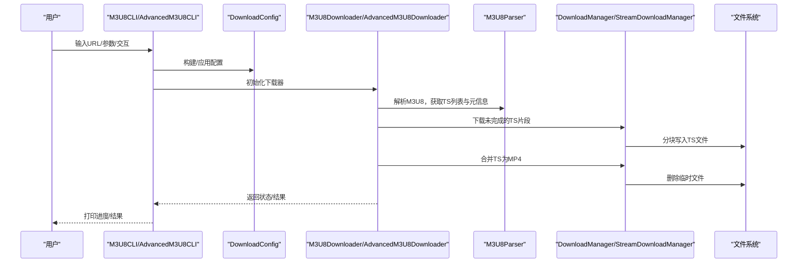
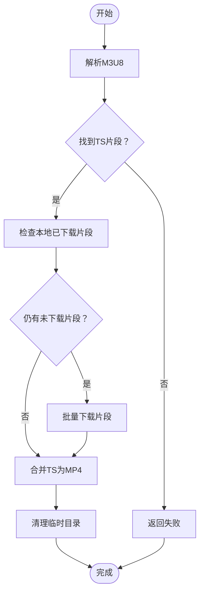
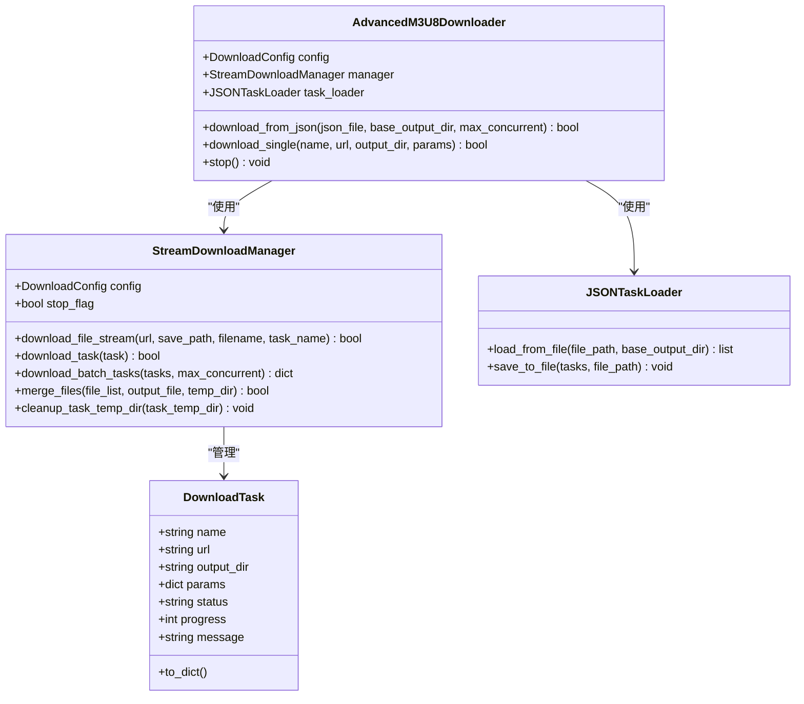
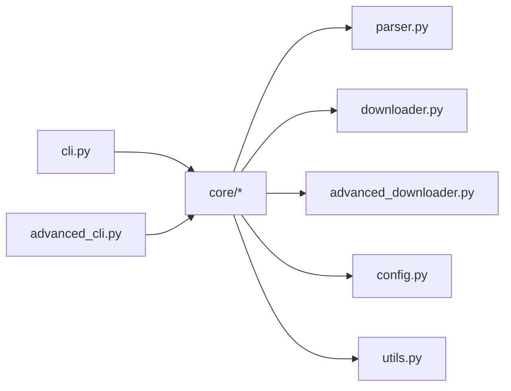

# 下载器核心模块

<cite>
**本文引用的文件**
- [app/downloader/core/__init__.py](file://app/downloader/core/__init__.py)
- [app/downloader/core/downloader.py](file://app/downloader/core/downloader.py)
- [app/downloader/core/advanced_downloader.py](file://app/downloader/core/advanced_downloader.py)
- [app/downloader/core/parser.py](file://app/downloader/core/parser.py)
- [app/downloader/core/config.py](file://app/downloader/core/config.py)
- [app/downloader/core/utils.py](file://app/downloader/core/utils.py)
- [app/downloader/cli/cli.py](file://app/downloader/cli/cli.py)
- [app/downloader/cli/advanced_cli.py](file://app/downloader/cli/advanced_cli.py)
- [app/downloader/run_cli.py](file://app/downloader/run_cli.py)
- [app/downloader/run_advanced_cli.py](file://app/downloader/run_advanced_cli.py)
- [app/downloader/examples/demo.py](file://app/downloader/examples/demo.py)
- [app/downloader/examples/example_usage.py](file://app/downloader/examples/example_usage.py)
- [app/downloader/tests/test_basic.py](file://app/downloader/tests/test_basic.py)
- [app/downloader/tests/test_advanced.py](file://app/downloader/tests/test_advanced.py)
</cite>

## 目录
1. [简介](#简介)
2. [项目结构](#项目结构)
3. [核心组件](#核心组件)
4. [架构总览](#架构总览)
5. [详细组件分析](#详细组件分析)
6. [依赖关系分析](#依赖关系分析)
7. [性能与可靠性](#性能与可靠性)
8. [故障排查指南](#故障排查指南)
9. [结论](#结论)
10. [附录](#附录)

## 简介
本文件聚焦“下载器核心模块”，系统梳理该模块的架构设计、数据流、处理逻辑与集成点，帮助开发者与使用者快速理解并高效使用 M3U8 视频下载能力。核心模块覆盖：
- 基础下载器：M3U8 解析、TS 片段下载、批量合并与清理
- 高级下载器：流式下载、JSON 任务管理、多任务并发控制
- 配置体系：统一的 DownloadConfig 与预设模板
- 工具与 CLI：URL/文件校验、缓存、进度格式化、命令行交互

## 项目结构
核心模块位于 app/downloader/core，围绕“解析—下载—合并—清理”的主流程组织；CLI 层位于 app/downloader/cli，提供命令行交互入口；示例与测试分别位于 examples 与 tests，便于学习与验证。

```mermaid
graph TB
subgraph "核心模块"
P["parser.py<br/>M3U8Parser"]
D["downloader.py<br/>M3U8Downloader/DownloadManager/RetryHandler"]
AD["advanced_downloader.py<br/>AdvancedM3U8Downloader/StreamDownloadManager/JSONTaskLoader/DownloadTask"]
C["config.py<br/>DownloadConfig/ConfigTemplates"]
U["utils.py<br/>FileValidator/URLProcessor/CacheManager/Statistics/格式化工具"]
end
subgraph "CLI"
CLI["cli.py<br/>M3U8CLI"]
ACLI["advanced_cli.py<br/>AdvancedM3U8CLI"]
RUN["run_cli.py"]
ARUN["run_advanced_cli.py"]
end
subgraph "示例与测试"
DEMO["examples/demo.py"]
EX["examples/example_usage.py"]
T1["tests/test_basic.py"]
T2["tests/test_advanced.py"]
end
CLI --> D
CLI --> C
CLI --> U
ACLI --> AD
ACLI --> C
ACLI --> U
RUN --> CLI
ARUN --> ACLI
DEMO --> AD
EX --> D
T1 --> D
T2 --> AD
```

图表来源
- [app/downloader/core/downloader.py](file://app/downloader/core/downloader.py#L1-L501)
- [app/downloader/core/advanced_downloader.py](file://app/downloader/core/advanced_downloader.py#L1-L576)
- [app/downloader/core/parser.py](file://app/downloader/core/parser.py#L1-L159)
- [app/downloader/core/config.py](file://app/downloader/core/config.py#L1-L114)
- [app/downloader/core/utils.py](file://app/downloader/core/utils.py#L1-L290)
- [app/downloader/cli/cli.py](file://app/downloader/cli/cli.py#L1-L292)
- [app/downloader/cli/advanced_cli.py](file://app/downloader/cli/advanced_cli.py#L1-L373)
- [app/downloader/run_cli.py](file://app/downloader/run_cli.py#L1-L25)
- [app/downloader/run_advanced_cli.py](file://app/downloader/run_advanced_cli.py#L1-L17)
- [app/downloader/examples/demo.py](file://app/downloader/examples/demo.py#L1-L275)
- [app/downloader/examples/example_usage.py](file://app/downloader/examples/example_usage.py#L1-L176)
- [app/downloader/tests/test_basic.py](file://app/downloader/tests/test_basic.py#L1-L260)
- [app/downloader/tests/test_advanced.py](file://app/downloader/tests/test_advanced.py#L1-L262)

章节来源
- [app/downloader/core/__init__.py](file://app/downloader/core/__init__.py#L1-L51)

## 核心组件
- 配置层
  - DownloadConfig：统一线程数、超时、重试、块大小、路径、请求头、开关等
  - ConfigTemplates：fast/stable/low_bandwidth 三类预设
- 解析层
  - M3U8Parser：解析 M3U8 内容，提取 TS 列表与分辨率/带宽信息，支持相对路径补全
- 下载层
  - M3U8Downloader：主流程编排（解析→下载→合并→清理），支持中断与日志
  - DownloadManager：通用下载管理器，含重试、批量下载、进度统计、合并与清理
  - RetryHandler：指数退避重试策略
- 高级下载层
  - AdvancedM3U8Downloader：面向多任务场景，封装 StreamDownloadManager 与 JSONTaskLoader
  - StreamDownloadManager：流式下载，逐个下载 TS，实时进度，可控并发
  - JSONTaskLoader：JSON 任务加载/保存，支持相对输出目录解析
  - DownloadTask：任务模型，含状态、进度、消息
- 工具层
  - FileValidator/URLProcessor/CacheManager/Statistics/format_*：URL 校验、域名提取、缓存、统计、格式化
  - 新增工具函数：setup_logger、create_session、extract_filename_from_url
- CLI 层
  - M3U8CLI/AdvancedM3U8CLI：命令行参数解析、交互模式、配置构建、执行下载

章节来源
- [app/downloader/core/config.py](file://app/downloader/core/config.py#L1-L114)
- [app/downloader/core/parser.py](file://app/downloader/core/parser.py#L1-L159)
- [app/downloader/core/downloader.py](file://app/downloader/core/downloader.py#L1-L501)
- [app/downloader/core/advanced_downloader.py](file://app/downloader/core/advanced_downloader.py#L1-L576)
- [app/downloader/core/utils.py](file://app/downloader/core/utils.py#L1-L290)
- [app/downloader/cli/cli.py](file://app/downloader/cli/cli.py#L1-L292)
- [app/downloader/cli/advanced_cli.py](file://app/downloader/cli/advanced_cli.py#L1-L373)

## 架构总览
核心模块采用“配置驱动 + 解析-下载-合并-清理”流水线架构，CLI 层负责参数与交互，核心模块提供可复用的下载能力。



图表来源
- [app/downloader/cli/cli.py](file://app/downloader/cli/cli.py#L1-L292)
- [app/downloader/cli/advanced_cli.py](file://app/downloader/cli/advanced_cli.py#L1-L373)
- [app/downloader/core/downloader.py](file://app/downloader/core/downloader.py#L379-L501)
- [app/downloader/core/advanced_downloader.py](file://app/downloader/core/advanced_downloader.py#L514-L576)
- [app/downloader/core/parser.py](file://app/downloader/core/parser.py#L25-L95)

## 详细组件分析

### 配置与模板（DownloadConfig/ConfigTemplates）
- 关键字段
  - 线程数、连接/读取超时、最大重试次数、重试延迟、块大小、缓冲区大小、临时/输出目录、请求头、SSL 校验、进度与日志开关
- 行为要点
  - 默认线程数为 CPU 核心数的倍数
  - 初始化时确保 temp/output 目录存在
  - 提供 update_headers 与 to_dict 辅助
- 预设模板
  - fast：高并发、低重试、短超时
  - stable：平衡并发与稳定性
  - low_bandwidth：低并发、长重试、小块

章节来源
- [app/downloader/core/config.py](file://app/downloader/core/config.py#L1-L114)

### M3U8 解析器（M3U8Parser）
- 能力
  - 解析 M3U8 内容，提取 TS 列表与分辨率/带宽信息
  - 支持相对路径补全与嵌套 M3U8 的处理
  - 提供 URL 校验、URL 信息提取、基础 URL 提取、M3U8 判断
- 复杂度
  - 时间复杂度 O(N)，N 为行数；空间复杂度 O(M)，M 为 TS 数量

章节来源
- [app/downloader/core/parser.py](file://app/downloader/core/parser.py#L1-L159)

### 基础下载器（M3U8Downloader/DownloadManager/RetryHandler）
- DownloadManager
  - 会话管理（SSL 校验、请求头）、信号处理（SIGINT/SIGTERM 停止）、批量下载（线程池）、进度统计、合并与清理
  - 分块下载避免内存溢出，支持进度回调
- RetryHandler
  - 指数退避重试，最多尝试 N 次
- M3U8Downloader
  - 主流程：解析→下载未完成片段→合并→清理→记录状态
  - 支持中断与日志记录



图表来源
- [app/downloader/core/downloader.py](file://app/downloader/core/downloader.py#L379-L501)
- [app/downloader/core/downloader.py](file://app/downloader/core/downloader.py#L46-L170)

章节来源
- [app/downloader/core/downloader.py](file://app/downloader/core/downloader.py#L1-L501)

### 高级下载器（AdvancedM3U8Downloader/StreamDownloadManager/JSONTaskLoader/DownloadTask）
- StreamDownloadManager
  - 流式下载：逐个下载 TS，实时显示百分比与字节进度
  - 控制并发（max_concurrent），批量任务调度
  - 合并与清理，支持任务级临时目录
- JSONTaskLoader
  - 从 JSON 加载任务列表，支持相对输出目录解析
  - 保存任务列表到 JSON
- DownloadTask
  - 任务模型，含状态、进度、消息与序列化
- AdvancedM3U8Downloader
  - 组合 StreamDownloadManager 与 JSONTaskLoader，提供单任务与 JSON 批量下载入口



图表来源
- [app/downloader/core/advanced_downloader.py](file://app/downloader/core/advanced_downloader.py#L23-L576)

章节来源
- [app/downloader/core/advanced_downloader.py](file://app/downloader/core/advanced_downloader.py#L1-L576)

### 工具与 CLI
- 工具
  - FileValidator/URLProcessor/CacheManager/Statistics/format_*：URL 校验、域名提取、缓存、统计、格式化
  - **新增工具函数**：
    - `setup_logger`：配置并返回日志记录器，支持文件和控制台输出
    - `create_session`：创建配置好的 HTTP 会话，支持 SSL 验证和自定义请求头
    - `extract_filename_from_url`：从 URL 提取文件名，移除查询参数和片段标识
    - `RetryHandler`：重试处理器，支持指数退避策略，已从 downloader.py 迁移至 utils.py
- CLI
  - M3U8CLI/AdvancedM3U8CLI：参数解析、交互模式、配置构建、执行下载
  - run_cli.py/run_advanced_cli.py：启动脚本

章节来源
- [app/downloader/core/utils.py](file://app/downloader/core/utils.py#L1-L290)
- [app/downloader/cli/cli.py](file://app/downloader/cli/cli.py#L1-L292)
- [app/downloader/cli/advanced_cli.py](file://app/downloader/cli/advanced_cli.py#L1-L373)
- [app/downloader/run_cli.py](file://app/downloader/run_cli.py#L1-L25)
- [app/downloader/run_advanced_cli.py](file://app/downloader/run_advanced_cli.py#L1-L17)

## 依赖关系分析
- 模块内聚与耦合
  - downloader 与 advanced_downloader 均依赖 config、parser 与 utils
  - CLI 依赖核心模块与 utils，负责参数与交互
- 外部依赖
  - requests、urllib3、tqdm、concurrent.futures、threading、signal、logging、argparse 等
- 潜在循环依赖
  - 未见直接循环；CLI 仅单向依赖核心模块



图表来源
- [app/downloader/cli/cli.py](file://app/downloader/cli/cli.py#L1-L292)
- [app/downloader/cli/advanced_cli.py](file://app/downloader/cli/advanced_cli.py#L1-L373)
- [app/downloader/core/downloader.py](file://app/downloader/core/downloader.py#L1-L501)
- [app/downloader/core/advanced_downloader.py](file://app/downloader/core/advanced_downloader.py#L1-L576)
- [app/downloader/core/parser.py](file://app/downloader/core/parser.py#L1-L159)
- [app/downloader/core/config.py](file://app/downloader/core/config.py#L1-L114)
- [app/downloader/core/utils.py](file://app/downloader/core/utils.py#L1-L290)

章节来源
- [app/downloader/core/__init__.py](file://app/downloader/core/__init__.py#L1-L51)

## 性能与可靠性
- 并发与吞吐
  - DownloadManager 使用线程池并发下载，DownloadConfig.num_threads 控制并发度
  - StreamDownloadManager 支持 max_concurrent 控制任务并发，逐个下载 TS，降低资源占用
- 稳定性
  - RetryHandler 指数退避重试，降低瞬时失败影响
  - SSL 校验可关闭（verify_ssl），请求头可定制
- 内存与磁盘
  - 分块下载与缓冲区大小可调，避免内存峰值
  - 合并阶段按文件名排序，逐个读取写入，减少内存压力
  - 合并后删除临时文件，避免磁盘占用
- 进度与可观测性
  - CLI 与高级 CLI 提供进度与统计输出
  - 日志开关 enable_logging 可开启下载日志

章节来源
- [app/downloader/core/downloader.py](file://app/downloader/core/downloader.py#L158-L268)
- [app/downloader/core/advanced_downloader.py](file://app/downloader/core/advanced_downloader.py#L283-L335)
- [app/downloader/core/config.py](file://app/downloader/core/config.py#L1-L114)

## 故障排查指南
- 常见问题
  - URL 无效：使用 FileValidator.validate_url 校验；URLProcessor.normalize_url 标准化
  - SSL 证书问题：DownloadConfig.verify_ssl=false（不建议生产使用）
  - 超时/网络不稳定：增大 connect_timeout/read_timeout 或降低 num_threads
  - 权限不足：确认 temp/output 目录可写
  - 中断下载：Ctrl+C 触发 SIGINT，DownloadManager/StreamDownloadManager 停止标志生效
- 日志定位
  - CLI 与高级 CLI 均可启用日志；日志文件 download.log 记录下载过程
- 重试策略
  - 调整 DownloadConfig.max_retries 与 retry_delay；RetryHandler 指数退避
- 合并失败
  - 检查临时目录中 TS 文件是否存在；StreamDownloadManager/DownloadManager 会在合并阶段删除已合并文件

章节来源
- [app/downloader/core/downloader.py](file://app/downloader/core/downloader.py#L66-L106)
- [app/downloader/core/advanced_downloader.py](file://app/downloader/core/advanced_downloader.py#L65-L95)
- [app/downloader/core/utils.py](file://app/downloader/core/utils.py#L1-L290)
- [app/downloader/cli/cli.py](file://app/downloader/cli/cli.py#L1-L292)
- [app/downloader/cli/advanced_cli.py](file://app/downloader/cli/advanced_cli.py#L1-L373)

## 结论
下载器核心模块以“配置驱动 + 解析-下载-合并-清理”为主线，提供了基础与高级两种下载形态：
- 基础形态适合单任务、批量下载与合并
- 高级形态支持流式下载、JSON 任务管理与可控并发，更适合多任务与自动化场景
配合完善的工具与 CLI，用户可在命令行与编程方式下灵活使用，并具备良好的可扩展性与可观测性。

## 附录
- 快速上手
  - 命令行：python -m m3u8.cli <M3U8_URL> 或 python -m m3u8.advanced_cli -i
  - 编程：参考示例与测试，使用 DownloadConfig/ConfigTemplates 构建配置，调用 M3U8Downloader/AdvancedM3U8Downloader
- 示例与测试
  - 示例：examples/demo.py 与 examples/example_usage.py
  - 测试：tests/test_basic.py 与 tests/test_advanced.py

章节来源
- [app/downloader/examples/demo.py](file://app/downloader/examples/demo.py#L1-L275)
- [app/downloader/examples/example_usage.py](file://app/downloader/examples/example_usage.py#L1-L176)
- [app/downloader/tests/test_basic.py](file://app/downloader/tests/test_basic.py#L1-L260)
- [app/downloader/tests/test_advanced.py](file://app/downloader/tests/test_advanced.py#L1-L262)