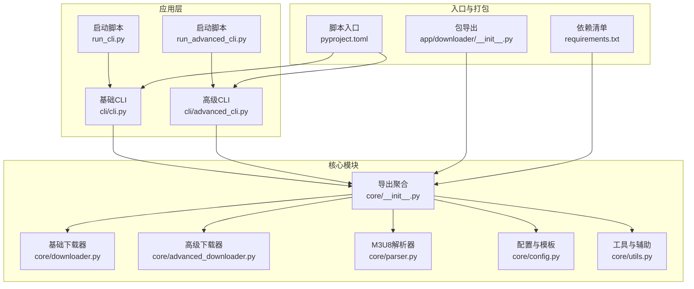
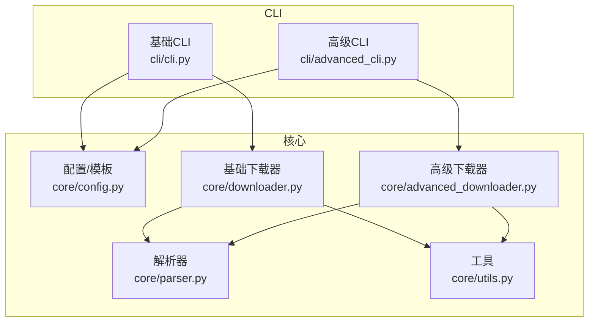
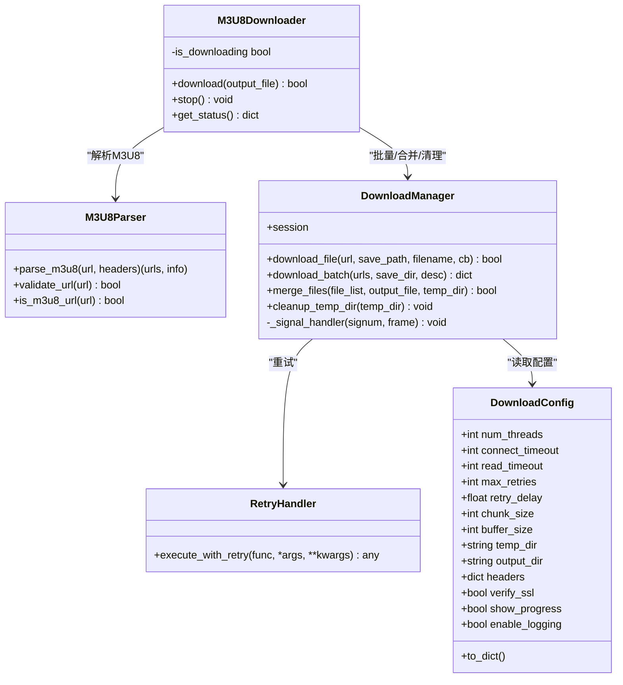
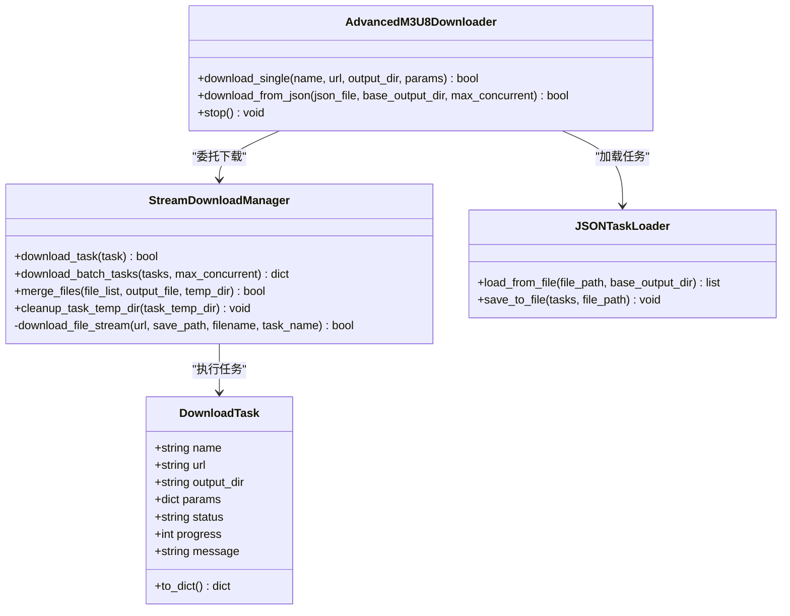
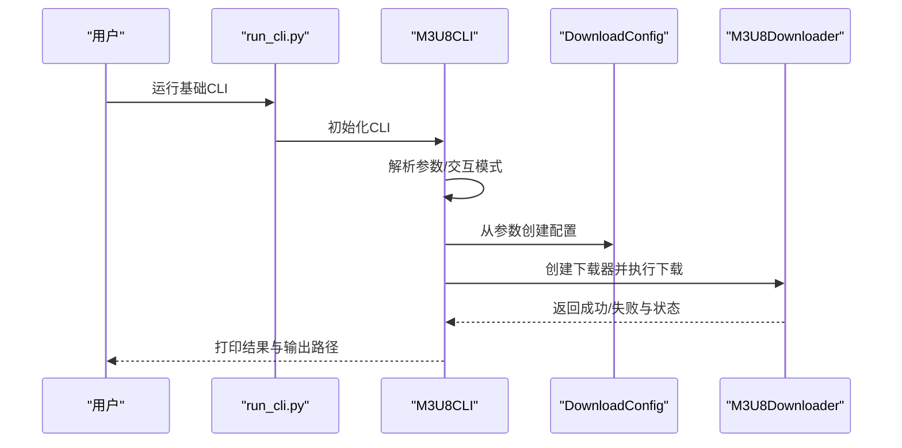
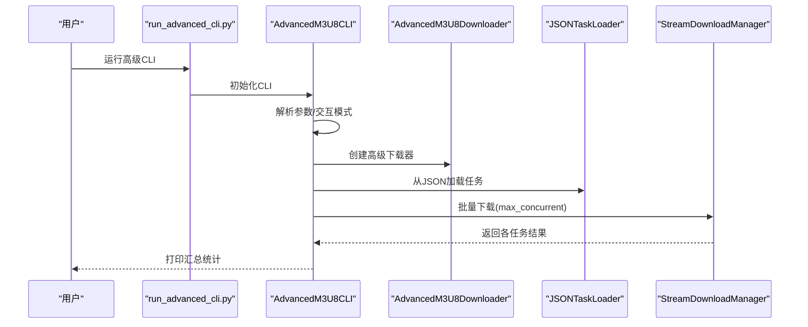
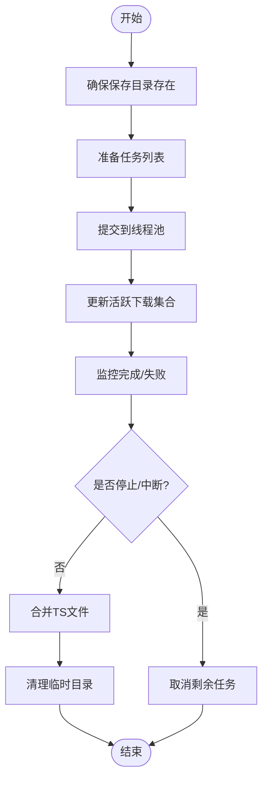
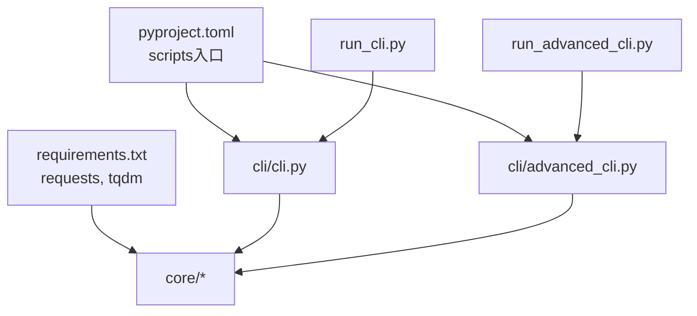

# 下载管理器

<cite>
**本文引用的文件**
- [app/downloader/__init__.py](file://app/downloader/__init__.py)
- [app/downloader/core/__init__.py](file://app/downloader/core/__init__.py)
- [app/downloader/core/downloader.py](file://app/downloader/core/downloader.py)
- [app/downloader/core/advanced_downloader.py](file://app/downloader/core/advanced_downloader.py)
- [app/downloader/core/parser.py](file://app/downloader/core/parser.py)
- [app/downloader/core/config.py](file://app/downloader/core/config.py)
- [app/downloader/core/utils.py](file://app/downloader/core/utils.py)
- [app/downloader/cli/__init__.py](file://app/downloader/cli/__init__.py)
- [app/downloader/cli/cli.py](file://app/downloader/cli/cli.py)
- [app/downloader/cli/advanced_cli.py](file://app/downloader/cli/advanced_cli.py)
- [app/downloader/run_cli.py](file://app/downloader/run_cli.py)
- [app/downloader/run_advanced_cli.py](file://app/downloader/run_advanced_cli.py)
- [app/downloader/examples/example_usage.py](file://app/downloader/examples/example_usage.py)
- [app/downloader/examples/demo.py](file://app/downloader/examples/demo.py)
- [app/downloader/QUICKSTART.md](file://app/downloader/QUICKSTART.md)
- [app/downloader/requirements.txt](file://app/downloader/requirements.txt)
- [app/downloader/pyproject.toml](file://app/downloader/pyproject.toml)
</cite>

## 目录
1. [简介](#简介)
2. [项目结构](#项目结构)
3. [核心组件](#核心组件)
4. [架构总览](#架构总览)
5. [详细组件分析](#详细组件分析)
6. [依赖关系分析](#依赖关系分析)
7. [性能与可靠性](#性能与可靠性)
8. [故障排查指南](#故障排查指南)
9. [结论](#结论)
10. [附录](#附录)

## 简介
本项目是一个模块化的 M3U8 视频下载管理器，支持基础与高级两种下载模式：
- 基础模式：面向单个 M3U8 地址的下载，具备多线程并发、断点续传、错误重试、进度与日志等能力。
- 高级模式：支持流式逐段下载、JSON 任务批量管理、可控并发、任务状态跟踪与实时进度显示。

项目提供命令行工具与编程接口，便于快速上手与集成到自动化流程中。

## 项目结构
整体采用“核心模块 + CLI + 示例 + 启动脚本”的组织方式，核心功能集中在 core 子包，CLI 位于 cli 子包，examples 提供使用示例，run_* 脚本解决模块导入路径问题。

图表来源
- [app/downloader/__init__.py](file://app/downloader/__init__.py#L1-L49)
- [app/downloader/core/__init__.py](file://app/downloader/core/__init__.py#L1-L51)
- [app/downloader/cli/cli.py](file://app/downloader/cli/cli.py#L1-L292)
- [app/downloader/cli/advanced_cli.py](file://app/downloader/cli/advanced_cli.py#L1-L373)
- [app/downloader/run_cli.py](file://app/downloader/run_cli.py#L1-L25)
- [app/downloader/run_advanced_cli.py](file://app/downloader/run_advanced_cli.py#L1-L17)
- [app/downloader/pyproject.toml](file://app/downloader/pyproject.toml#L1-L17)
- [app/downloader/requirements.txt](file://app/downloader/requirements.txt#L1-L3)

章节来源
- [app/downloader/__init__.py](file://app/downloader/__init__.py#L1-L49)
- [app/downloader/core/__init__.py](file://app/downloader/core/__init__.py#L1-L51)
- [app/downloader/QUICKSTART.md](file://app/downloader/QUICKSTART.md#L1-L290)

## 核心组件
- 配置与模板：统一管理线程数、超时、重试、缓冲区、请求头、路径等参数，并提供快速/稳定/低带宽三类预设模板。
- M3U8 解析器：解析远程 M3U8 内容，提取 TS 片段与流信息（分辨率、带宽），支持相对路径补全。
- 基础下载器：封装批量下载、合并、清理、进度与日志、信号中断处理、重试机制等。
- 高级下载器：支持流式逐段下载、任务队列、JSON 任务加载、可控并发、任务状态与实时进度。
- CLI：提供命令行交互与非交互模式，支持参数解析、请求头注入、试运行、模板选择等。
- 工具模块：文件/URL 校验、缓存、统计、格式化、进度跟踪等辅助能力。

章节来源
- [app/downloader/core/config.py](file://app/downloader/core/config.py#L1-L114)
- [app/downloader/core/parser.py](file://app/downloader/core/parser.py#L1-L159)
- [app/downloader/core/downloader.py](file://app/downloader/core/downloader.py#L1-L501)
- [app/downloader/core/advanced_downloader.py](file://app/downloader/core/advanced_downloader.py#L1-L576)
- [app/downloader/core/utils.py](file://app/downloader/core/utils.py#L1-L290)
- [app/downloader/cli/cli.py](file://app/downloader/cli/cli.py#L1-L292)
- [app/downloader/cli/advanced_cli.py](file://app/downloader/cli/advanced_cli.py#L1-L373)

## 架构总览
基础与高级模式共享解析与配置能力，差异在于下载策略与并发模型：
- 基础模式：线程池并发批量下载 TS 片段，完成后统一合并输出。
- 高级模式：逐段流式下载，实时显示进度，支持多任务队列与 JSON 批量。

图表来源
- [app/downloader/cli/cli.py](file://app/downloader/cli/cli.py#L1-L292)
- [app/downloader/cli/advanced_cli.py](file://app/downloader/cli/advanced_cli.py#L1-L373)
- [app/downloader/core/config.py](file://app/downloader/core/config.py#L1-L114)
- [app/downloader/core/parser.py](file://app/downloader/core/parser.py#L1-L159)
- [app/downloader/core/downloader.py](file://app/downloader/core/downloader.py#L1-L501)
- [app/downloader/core/advanced_downloader.py](file://app/downloader/core/advanced_downloader.py#L1-L576)
- [app/downloader/core/utils.py](file://app/downloader/core/utils.py#L1-L290)

## 详细组件分析

### 基础下载器与管理器
- DownloadManager：会话管理、SSL 验证、请求头、重试处理器、信号中断、批量下载、进度统计、TS 合并与临时目录清理。
- M3U8Downloader：主流程编排，解析 M3U8 → 下载缺失片段 → 合并 → 清理 → 返回状态。

图表来源
- [app/downloader/core/config.py](file://app/downloader/core/config.py#L1-L114)
- [app/downloader/core/parser.py](file://app/downloader/core/parser.py#L1-L159)
- [app/downloader/core/downloader.py](file://app/downloader/core/downloader.py#L1-L501)

章节来源
- [app/downloader/core/downloader.py](file://app/downloader/core/downloader.py#L1-L501)
- [app/downloader/core/config.py](file://app/downloader/core/config.py#L1-L114)
- [app/downloader/core/parser.py](file://app/downloader/core/parser.py#L1-L159)

### 高级下载器与任务管理
- StreamDownloadManager：流式逐段下载，实时进度，任务级临时目录，合并与清理。
- AdvancedM3U8Downloader：单任务与 JSON 批量下载入口，任务加载与执行。
- JSONTaskLoader：从 JSON 文件加载/保存任务列表，支持相对输出目录解析。
- DownloadTask：任务数据结构，含状态、进度与消息字段。

图表来源
- [app/downloader/core/advanced_downloader.py](file://app/downloader/core/advanced_downloader.py#L1-L576)

章节来源
- [app/downloader/core/advanced_downloader.py](file://app/downloader/core/advanced_downloader.py#L1-L576)

### CLI 交互与运行流程
- 基础 CLI：参数解析、请求头注入、模板选择、交互/非交互模式、试运行、状态输出。
- 高级 CLI：单任务、JSON 批量、交互创建 JSON、并发控制、确认与进度提示。
- 启动脚本：解决模块导入路径问题，便于直接运行。

图表来源
- [app/downloader/run_cli.py](file://app/downloader/run_cli.py#L1-L25)
- [app/downloader/cli/cli.py](file://app/downloader/cli/cli.py#L1-L292)
- [app/downloader/core/downloader.py](file://app/downloader/core/downloader.py#L1-L501)
- [app/downloader/core/config.py](file://app/downloader/core/config.py#L1-L114)

章节来源
- [app/downloader/cli/cli.py](file://app/downloader/cli/cli.py#L1-L292)
- [app/downloader/run_cli.py](file://app/downloader/run_cli.py#L1-L25)
- [app/downloader/run_advanced_cli.py](file://app/downloader/run_advanced_cli.py#L1-L17)

### 高级 CLI 批量流程

图表来源
- [app/downloader/run_advanced_cli.py](file://app/downloader/run_advanced_cli.py#L1-L17)
- [app/downloader/cli/advanced_cli.py](file://app/downloader/cli/advanced_cli.py#L1-L373)
- [app/downloader/core/advanced_downloader.py](file://app/downloader/core/advanced_downloader.py#L1-L576)

章节来源
- [app/downloader/cli/advanced_cli.py](file://app/downloader/cli/advanced_cli.py#L1-L373)
- [app/downloader/core/advanced_downloader.py](file://app/downloader/core/advanced_downloader.py#L1-L576)

### 复杂逻辑：批量下载与进度更新

图表来源
- [app/downloader/core/downloader.py](file://app/downloader/core/downloader.py#L158-L268)

章节来源
- [app/downloader/core/downloader.py](file://app/downloader/core/downloader.py#L158-L268)

## 依赖关系分析
- 依赖库：requests、tqdm；通过 requirements.txt 与 pyproject.toml 统一声明。
- 模块导入：CLI 通过 run_* 脚本修正 sys.path，或使用完整模块路径运行；CLI 再通过相对导入访问 core。
- 包导出：根 __init__.py 与 core/__init__.py 聚合导出公共 API，便于外部使用。

图表来源
- [app/downloader/requirements.txt](file://app/downloader/requirements.txt#L1-L3)
- [app/downloader/pyproject.toml](file://app/downloader/pyproject.toml#L1-L17)
- [app/downloader/run_cli.py](file://app/downloader/run_cli.py#L1-L25)
- [app/downloader/run_advanced_cli.py](file://app/downloader/run_advanced_cli.py#L1-L17)
- [app/downloader/cli/cli.py](file://app/downloader/cli/cli.py#L1-L292)
- [app/downloader/cli/advanced_cli.py](file://app/downloader/cli/advanced_cli.py#L1-L373)

章节来源
- [app/downloader/requirements.txt](file://app/downloader/requirements.txt#L1-L3)
- [app/downloader/pyproject.toml](file://app/downloader/pyproject.toml#L1-L17)
- [app/downloader/run_cli.py](file://app/downloader/run_cli.py#L1-L25)
- [app/downloader/run_advanced_cli.py](file://app/downloader/run_advanced_cli.py#L1-L17)

## 性能与可靠性
- 并发与吞吐：基础模式使用线程池并发下载 TS 片段，合理设置线程数可提升吞吐；高级模式逐段流式下载，避免过多并发导致资源争用。
- 重试与稳定性：内置指数退避重试，降低瞬时网络波动影响；可配置最大重试次数与延迟。
- 内存与磁盘：分块下载与分块写入，避免大文件占用过多内存；合并时使用缓冲区读取；下载完成后清理临时目录。
- SSL 与请求头：可禁用 SSL 校验（不推荐）；支持自定义请求头，便于绕过站点校验。
- 进度与日志：可选进度条与日志文件，便于监控与排障。

章节来源
- [app/downloader/core/downloader.py](file://app/downloader/core/downloader.py#L1-L501)
- [app/downloader/core/advanced_downloader.py](file://app/downloader/core/advanced_downloader.py#L1-L576)
- [app/downloader/core/config.py](file://app/downloader/core/config.py#L1-L114)

## 故障排查指南
- 模块导入错误：确保从 app 目录使用完整模块路径运行，或使用 run_* 脚本。
- URL 无效：使用 URL 校验与标准化工具，确认协议与域名正确。
- 下载中断：支持 SIGINT/SIGTERM 中断，下载器会停止后续任务并清理临时文件。
- 合并失败：检查 TS 文件完整性与临时目录权限；查看日志定位具体文件。
- 依赖缺失：安装 requirements.txt 中的依赖库。

章节来源
- [app/downloader/QUICKSTART.md](file://app/downloader/QUICKSTART.md#L1-L290)
- [app/downloader/core/utils.py](file://app/downloader/core/utils.py#L1-L290)
- [app/downloader/core/downloader.py](file://app/downloader/core/downloader.py#L1-L501)
- [app/downloader/core/advanced_downloader.py](file://app/downloader/core/advanced_downloader.py#L1-L576)

## 结论
该下载管理器提供了从命令行到编程接口的完整使用路径，兼顾易用性与扩展性。基础模式适合单任务快速下载，高级模式适合多任务、批量与流式场景。通过合理的配置与并发控制，可在不同网络环境下获得稳定高效的下载体验。

## 附录
- 快速开始与常见命令参考见使用指南。
- 编程示例与演示脚本位于 examples 目录，便于学习与集成。

章节来源
- [app/downloader/QUICKSTART.md](file://app/downloader/QUICKSTART.md#L1-L290)
- [app/downloader/examples/example_usage.py](file://app/downloader/examples/example_usage.py#L1-L176)
- [app/downloader/examples/demo.py](file://app/downloader/examples/demo.py#L1-L275)