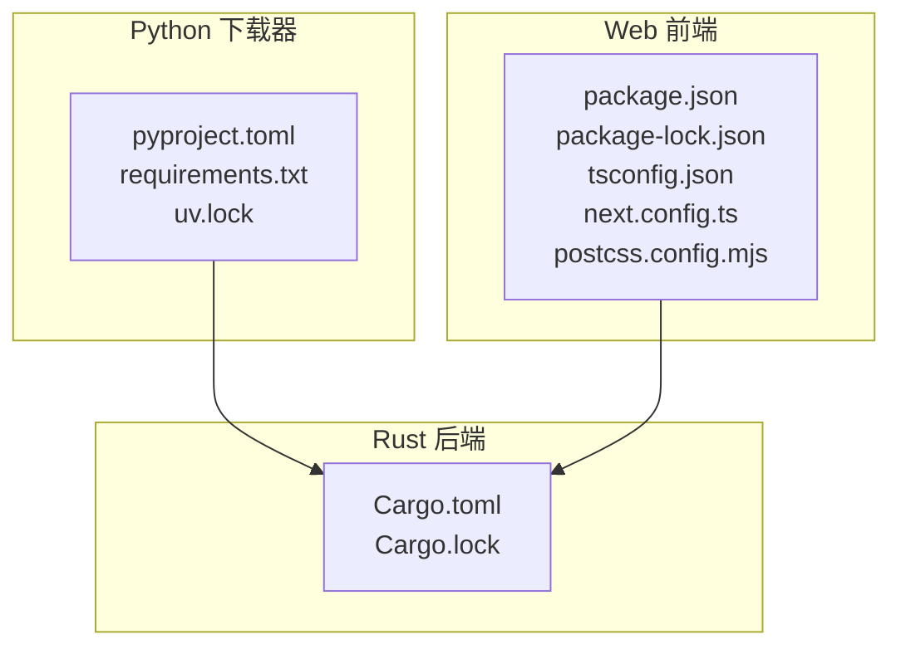
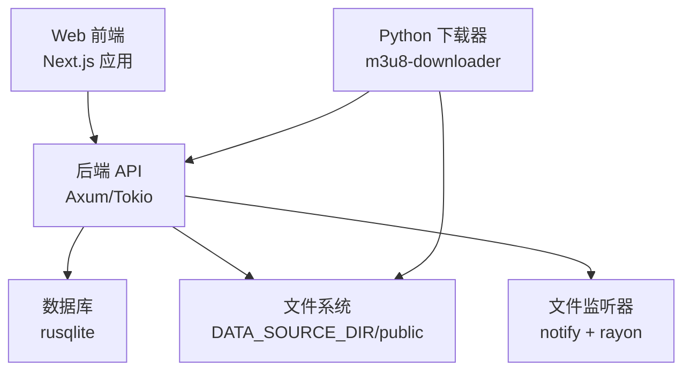
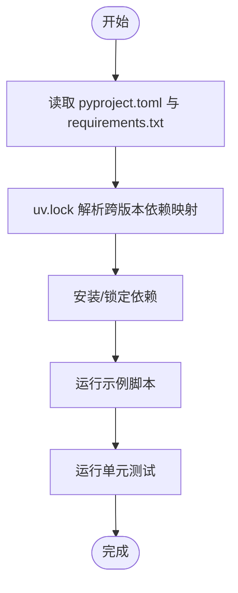
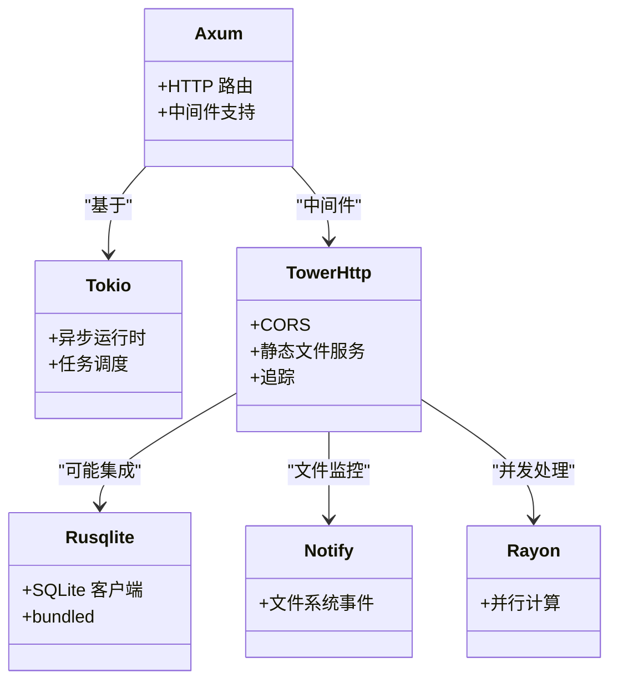
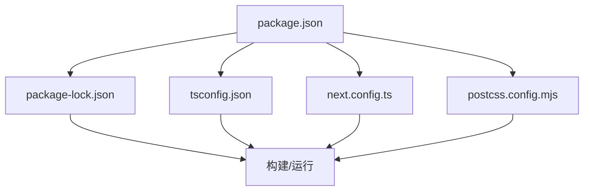
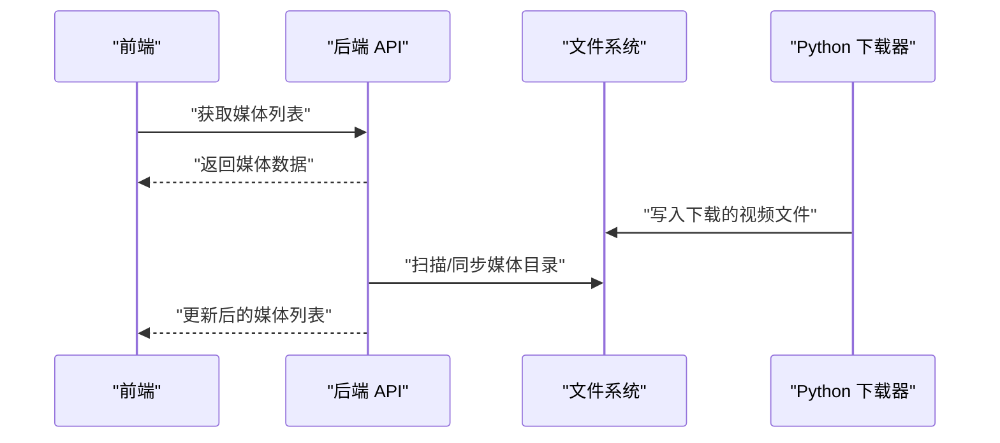

# 依赖配置

<cite>
**本文引用的文件**
- [pyproject.toml](file://app/downloader/pyproject.toml)
- [requirements.txt](file://app/downloader/requirements.txt)
- [uv.lock](file://app/downloader/uv.lock)
- [Cargo.toml](file://app/server/Cargo.toml)
- [Cargo.lock](file://app/server/Cargo.lock)
- [package.json](file://app/web/package.json)
- [package-lock.json](file://app/web/package-lock.json)
- [tsconfig.json](file://app/web/tsconfig.json)
- [next.config.ts](file://app/web/next.config.ts)
- [postcss.config.mjs](file://app/web/postcss.config.mjs)
- [.gitignore（Web）](file://app/web/.gitignore)
- [.gitignore（下载器）](file://app/downloader/.gitignore)
- [route.ts](file://app/web/app/api/media/route.ts)
- [main.rs](file://app/server/src/main.rs)
- [example_usage.py](file://app/downloader/examples/example_usage.py)
- [test_basic.py](file://app/downloader/tests/test_basic.py)
</cite>

## 目录
1. [简介](#简介)
2. [项目结构](#项目结构)
3. [核心组件](#核心组件)
4. [架构总览](#架构总览)
5. [详细组件分析](#详细组件分析)
6. [依赖关系分析](#依赖关系分析)
7. [性能与版本策略](#性能与版本策略)
8. [故障排查指南](#故障排查指南)
9. [结论](#结论)
10. [附录](#附录)

## 简介
本文件聚焦于该仓库中的“依赖配置”，覆盖三类子系统：
- Python 下载器模块：基于 setuptools 的 pyproject.toml、requirements.txt 与 uv.lock，明确运行时依赖与锁定版本。
- Rust 后端服务：基于 Cargo 的 Cargo.toml 与 Cargo.lock，提供 HTTP 服务、文件监控与数据库能力。
- Web 前端：基于 Next.js 的 package.json、package-lock.json、tsconfig.json、next.config.ts 与 PostCSS 配置。

目标是帮助读者快速理解各子系统的依赖来源、版本策略、锁定机制与集成关系，并提供排障与优化建议。

## 项目结构
该仓库采用多语言分层组织：
- app/downloader：Python 模块与命令行工具，提供 M3U8 视频下载能力。
- app/server：Rust 后端，提供视频列表、同步、文件监听与静态资源服务。
- app/web：Next.js 前端，提供媒体库浏览与播放页面。

图表来源
- [pyproject.toml](file://app/downloader/pyproject.toml#L1-L17)
- [requirements.txt](file://app/downloader/requirements.txt#L1-L3)
- [uv.lock](file://app/downloader/uv.lock#L1-L291)
- [Cargo.toml](file://app/server/Cargo.toml#L1-L23)
- [Cargo.lock](file://app/server/Cargo.lock#L1-L800)
- [package.json](file://app/web/package.json#L1-L74)
- [package-lock.json](file://app/web/package-lock.json#L1-L800)
- [tsconfig.json](file://app/web/tsconfig.json#L1-L42)
- [next.config.ts](file://app/web/next.config.ts#L1-L39)
- [postcss.config.mjs](file://app/web/postcss.config.mjs#L1-L6)

章节来源
- [pyproject.toml](file://app/downloader/pyproject.toml#L1-L17)
- [Cargo.toml](file://app/server/Cargo.toml#L1-L23)
- [package.json](file://app/web/package.json#L1-L74)

## 核心组件
- Python 下载器依赖
  - 运行时依赖：requests、tqdm；通过 pyproject.toml 的 [project.dependencies] 与 requirements.txt 双向声明。
  - 版本锁定：uv.lock 提供跨 Python 版本的精确依赖树与哈希校验。
- Rust 后端依赖
  - 核心依赖：axum、tokio、tower-http、serde、rusqlite、notify、rayon 等。
  - 版本锁定：Cargo.lock 提供确定性构建与安全审计依据。
- Web 前端依赖
  - 运行时依赖：Next.js、React、Radix UI、Tailwind 生态、HLS.js 等。
  - TypeScript 编译与打包：tsconfig.json、next.config.ts、postcss.config.mjs。
  - 版本锁定：package-lock.json。

章节来源
- [pyproject.toml](file://app/downloader/pyproject.toml#L1-L17)
- [requirements.txt](file://app/downloader/requirements.txt#L1-L3)
- [uv.lock](file://app/downloader/uv.lock#L1-L291)
- [Cargo.toml](file://app/server/Cargo.toml#L1-L23)
- [Cargo.lock](file://app/server/Cargo.lock#L1-L800)
- [package.json](file://app/web/package.json#L1-L74)
- [tsconfig.json](file://app/web/tsconfig.json#L1-L42)
- [next.config.ts](file://app/web/next.config.ts#L1-L39)
- [postcss.config.mjs](file://app/web/postcss.config.mjs#L1-L6)

## 架构总览
前端通过 Next.js 路由调用后端 API，后端提供视频列表、手动同步、文件监听与静态资源服务；Python 下载器作为独立工具，可被前端或外部流程触发，用于批量下载 M3U8 内容。

图表来源
- [main.rs](file://app/server/src/main.rs#L1-L111)
- [route.ts](file://app/web/app/api/media/route.ts#L1-L73)
- [Cargo.toml](file://app/server/Cargo.toml#L1-L23)
- [pyproject.toml](file://app/downloader/pyproject.toml#L1-L17)

## 详细组件分析

### Python 下载器依赖配置
- 项目元信息与入口
  - pyproject.toml 定义包名、版本、描述、最低 Python 版本与脚本入口（m3u8-cli、m3u8-advanced-cli）。
- 运行时依赖
  - requests：HTTP 请求；tqdm：进度条显示。
  - requirements.txt 与 pyproject.toml 的 dependencies 字段共同约束版本范围。
- 版本锁定与兼容性
  - uv.lock 提供不同 Python 版本标记（如 python_full_version < '3.8'、== '3.8.*'、>= '3.9'）下，requests、urllib3、idna、charset-normalizer 等的精确版本与哈希，确保跨平台一致性与可复现构建。
- 使用示例与测试
  - 示例脚本演示了模块导入、配置模板、解析与验证等常用流程。
  - 测试脚本验证了导入、配置、解析器、下载器、工具函数、CLI 参数解析与文件操作等关键路径。

图表来源
- [pyproject.toml](file://app/downloader/pyproject.toml#L1-L17)
- [requirements.txt](file://app/downloader/requirements.txt#L1-L3)
- [uv.lock](file://app/downloader/uv.lock#L1-L291)
- [example_usage.py](file://app/downloader/examples/example_usage.py#L1-L176)
- [test_basic.py](file://app/downloader/tests/test_basic.py#L1-L260)

章节来源
- [pyproject.toml](file://app/downloader/pyproject.toml#L1-L17)
- [requirements.txt](file://app/downloader/requirements.txt#L1-L3)
- [uv.lock](file://app/downloader/uv.lock#L1-L291)
- [example_usage.py](file://app/downloader/examples/example_usage.py#L1-L176)
- [test_basic.py](file://app/downloader/tests/test_basic.py#L1-L260)

### Rust 后端依赖配置
- 依赖清单
  - web 框架与中间件：axum、tower-http（含 fs、trace、cors）、tower。
  - 数据序列化：serde、serde_json。
  - 文件系统与数据库：walkdir、rusqlite（bundled）。
  - 文件监控与并发：notify、rayon。
  - 日志与工具：log、log4rs、nu-ansi-term、anyhow、regex、chrono。
- 版本锁定
  - Cargo.lock 记录了完整依赖树与 checksum，保证构建一致性与审计溯源。

图表来源
- [Cargo.toml](file://app/server/Cargo.toml#L1-L23)
- [Cargo.lock](file://app/server/Cargo.lock#L1-L800)

章节来源
- [Cargo.toml](file://app/server/Cargo.toml#L1-L23)
- [Cargo.lock](file://app/server/Cargo.lock#L1-L800)

### Web 前端依赖配置
- 依赖生态
  - Next.js 16、React 19、TypeScript、Tailwind CSS、Radix UI、HLS.js、Zod 等。
- 编译与打包
  - tsconfig.json：严格模式、ESNext 目标、bundler 模式、路径别名等。
  - next.config.ts：远程图片源配置、可选的 headers。
  - postcss.config.mjs：Tailwind PostCSS 插件。
- 版本锁定
  - package-lock.json 记录依赖树与哈希，确保 CI 与本地一致。

图表来源
- [package.json](file://app/web/package.json#L1-L74)
- [package-lock.json](file://app/web/package-lock.json#L1-L800)
- [tsconfig.json](file://app/web/tsconfig.json#L1-L42)
- [next.config.ts](file://app/web/next.config.ts#L1-L39)
- [postcss.config.mjs](file://app/web/postcss.config.mjs#L1-L6)

章节来源
- [package.json](file://app/web/package.json#L1-L74)
- [package-lock.json](file://app/web/package-lock.json#L1-L800)
- [tsconfig.json](file://app/web/tsconfig.json#L1-L42)
- [next.config.ts](file://app/web/next.config.ts#L1-L39)
- [postcss.config.mjs](file://app/web/postcss.config.mjs#L1-L6)

## 依赖关系分析
- Python 下载器与后端的交互
  - 下载器作为独立 CLI/库，可直接写入 DATA_SOURCE_DIR（后端静态资源根），从而被后端 /public 路径暴露。
  - 后端提供 /api/sync、/api/watcher 控制端点，可与下载器产出的媒体文件联动。
- 前端与后端的接口
  - 前端通过 Next.js API 路由（如 app/api/media/route.ts）访问后端提供的媒体数据，后端再返回本地媒体列表。
- 依赖一致性与锁定
  - Python：uv.lock 为多 Python 版本提供精确依赖映射，避免版本漂移。
  - Rust：Cargo.lock 提供确定性依赖树，便于审计与复现。
  - Web：package-lock.json 保障前端依赖一致性。

图表来源
- [route.ts](file://app/web/app/api/media/route.ts#L1-L73)
- [main.rs](file://app/server/src/main.rs#L1-L111)
- [pyproject.toml](file://app/downloader/pyproject.toml#L1-L17)

章节来源
- [route.ts](file://app/web/app/api/media/route.ts#L1-L73)
- [main.rs](file://app/server/src/main.rs#L1-L111)
- [pyproject.toml](file://app/downloader/pyproject.toml#L1-L17)

## 性能与版本策略
- Python
  - requests 与 urllib3 的版本随 Python 主版本变化而调整，uv.lock 为每个版本提供最优组合，减少冲突与回退。
  - tqdm 在 Windows 平台依赖 colorama，注意跨平台行为差异。
- Rust
  - rayon 用于并行处理，notify 用于文件系统事件，rusqlite(bundled) 简化 SQLite 部署。
  - tokio 的 full features 提升异步能力，tower-http 的 cors/trace/fs 为开发与调试提供便利。
- Web
  - Next.js 16 与 React 19 提供现代开发体验；Tailwind 与 Radix UI 降低样式与组件成本。
  - HLS.js 支持前端播放 HLS 内容，结合后端 /public 与 /thumbnails 路径实现媒体访问。

章节来源
- [uv.lock](file://app/downloader/uv.lock#L1-L291)
- [Cargo.toml](file://app/server/Cargo.toml#L1-L23)
- [package.json](file://app/web/package.json#L1-L74)

## 故障排查指南
- Python 依赖问题
  - 若出现 requests/urllib3/idna 版本不匹配，优先参考 uv.lock 的跨版本映射进行修复。
  - 确认虚拟环境 Python 版本满足 requires-python（pyproject.toml）。
- Rust 构建问题
  - 若构建失败，检查 Cargo.lock 是否与 Cargo.toml 一致；必要时清理并重新生成锁文件。
  - 关注 rusqlite(bundled) 的系统依赖需求。
- Web 构建问题
  - 若样式或类型报错，检查 tsconfig.json 的 strict、moduleResolution 与 bundler 设置。
  - 若图片加载失败，核对 next.config.ts 的 remotePatterns 与实际域名/IP。
- 常见忽略文件
  - Web/.gitignore 与 downloader/.gitignore 分别屏蔽 node_modules、.next、dist、venv 等，避免提交无关产物。

章节来源
- [uv.lock](file://app/downloader/uv.lock#L1-L291)
- [Cargo.lock](file://app/server/Cargo.lock#L1-L800)
- [tsconfig.json](file://app/web/tsconfig.json#L1-L42)
- [next.config.ts](file://app/web/next.config.ts#L1-L39)
- [.gitignore（Web）](file://app/web/.gitignore#L1-L42)
- [.gitignore（下载器）](file://app/downloader/.gitignore#L1-L37)

## 结论
- 该仓库在三类技术栈上均采用“声明 + 锁定”的依赖管理模式：Python 使用 pyproject.toml + uv.lock，Rust 使用 Cargo.toml + Cargo.lock，Web 使用 package.json + package-lock.json。
- 通过明确的版本策略与锁定文件，项目在多 Python 版本、多操作系统与多浏览器环境下具备更高的可复现性与稳定性。
- 建议在团队协作中统一使用锁定文件进行安装，避免本地差异导致的构建不一致。

## 附录
- 关键文件清单与用途
  - pyproject.toml：Python 包元信息与脚本入口
  - requirements.txt：运行时依赖清单
  - uv.lock：Python 依赖精确锁定与跨版本映射
  - Cargo.toml：Rust 包与依赖声明
  - Cargo.lock：Rust 依赖精确锁定
  - package.json：前端依赖与脚本
  - package-lock.json：前端依赖精确锁定
  - tsconfig.json：TypeScript 编译配置
  - next.config.ts：Next.js 运行时配置
  - postcss.config.mjs：PostCSS 插件配置
  - .gitignore（Web/下载器）：忽略构建产物与虚拟环境