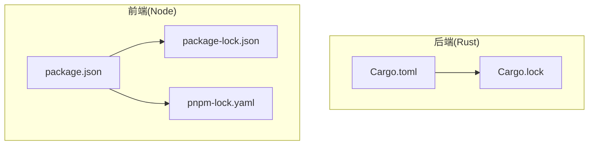
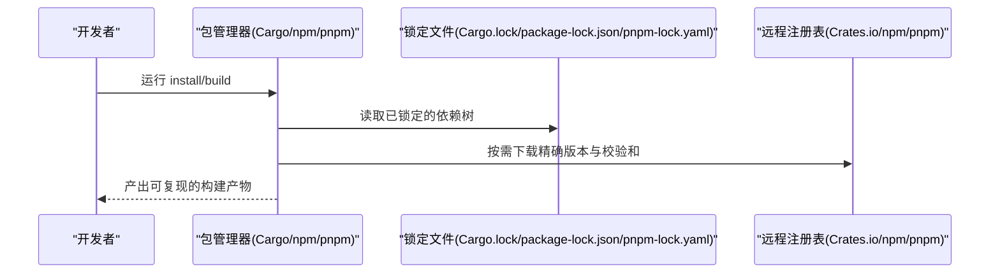
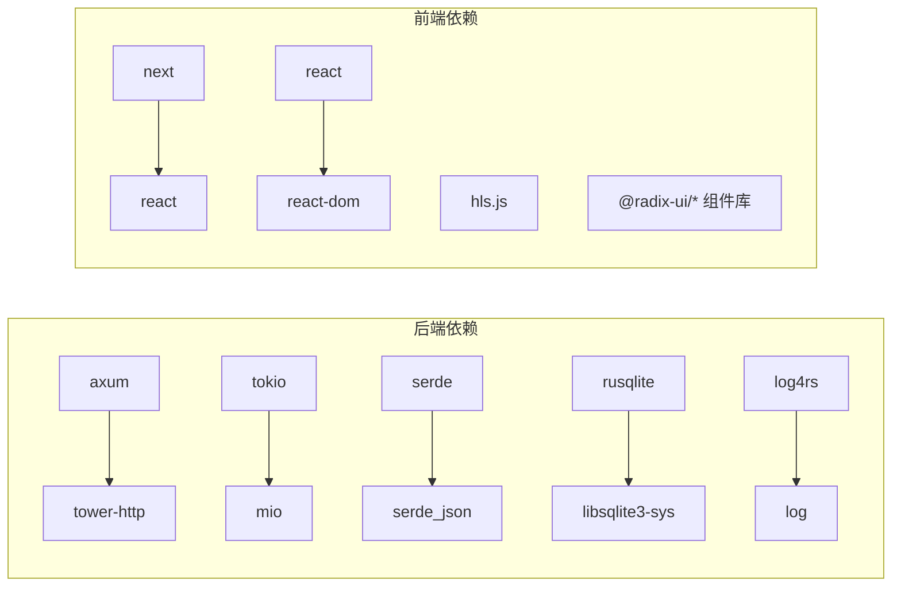

# 依赖锁定文件

<cite>
**本文引用的文件**
- [app/server/Cargo.toml](file://app/server/Cargo.toml)
- [app/server/Cargo.lock](file://app/server/Cargo.lock)
- [app/web/package.json](file://app/web/package.json)
- [app/web/package-lock.json](file://app/web/package-lock.json)
- [app/web/pnpm-lock.yaml](file://app/web/pnpm-lock.yaml)
</cite>

## 目录
1. [简介](#简介)
2. [项目结构](#项目结构)
3. [核心组件](#核心组件)
4. [架构总览](#架构总览)
5. [详细组件分析](#详细组件分析)
6. [依赖关系分析](#依赖关系分析)
7. [性能考量](#性能考量)
8. [故障排查指南](#故障排查指南)
9. [结论](#结论)
10. [附录](#附录)

## 简介
本文件聚焦于仓库中的“依赖锁定文件”，即 Rust 的 Cargo.lock 与前端的 npm 的 package-lock.json、pnpm 的 pnpm-lock.yaml，系统性梳理这些文件的作用、内容组织、版本锁定策略以及对构建一致性与可重复性的保障机制，并提供面向不同技术背景读者的可操作建议与排障指引。

## 项目结构
该仓库包含后端（Rust）与前端（Next.js + React）两套独立的依赖体系：
- 后端：使用 Cargo 管理 Rust 依赖，锁定文件为 Cargo.lock。
- 前端：同时存在 npm 与 pnpm 的锁定文件，用于管理 Node 生态依赖；package.json 中声明了依赖与脚本。

图表来源
- [app/server/Cargo.toml](file://app/server/Cargo.toml#L1-L23)
- [app/server/Cargo.lock](file://app/server/Cargo.lock#L1-L200)
- [app/web/package.json](file://app/web/package.json#L1-L74)
- [app/web/package-lock.json](file://app/web/package-lock.json#L1-L120)
- [app/web/pnpm-lock.yaml](file://app/web/pnpm-lock.yaml#L1-L120)

章节来源
- [app/server/Cargo.toml](file://app/server/Cargo.toml#L1-L23)
- [app/web/package.json](file://app/web/package.json#L1-L74)

## 核心组件
- Cargo.lock（Rust）
  - 自动由 Cargo 生成，记录所有传递依赖的精确版本、校验和与依赖关系，确保跨平台、跨时间的一致性构建。
  - 包含大量 [[package]] 条目，每个条目描述包名、版本、来源与 checksum，并列出直接依赖列表。
- package-lock.json（npm）
  - 记录 npm 安装时的完整依赖树与精确版本，保证团队与 CI 环境一致安装。
  - 锁定文件中包含 packages 字段，键为包路径或规范名称，值包含 resolved、integrity、dependencies 等信息。
- pnpm-lock.yaml（pnpm）
  - 记录 pnpm 的依赖解析结果与包的压缩归档信息，支持 store 共享与硬链接，提升安装效率。
  - 锁定文件采用 YAML 结构，包含 importers 与 packages 两大块，packages 中记录每个包的 resolution、integrity、engines、cpu/os 等元数据。

章节来源
- [app/server/Cargo.lock](file://app/server/Cargo.lock#L1-L200)
- [app/web/package-lock.json](file://app/web/package-lock.json#L1-L120)
- [app/web/pnpm-lock.yaml](file://app/web/pnpm-lock.yaml#L1-L120)

## 架构总览
从“依赖锁定”的视角看，项目整体的依赖管理遵循以下原则：
- 显式声明：通过 Cargo.toml 与 package.json 声明直接依赖。
- 精确锁定：通过 Cargo.lock、package-lock.json、pnpm-lock.yaml 锁定传递依赖的版本与校验和。
- 可复现：CI 与本地环境均基于锁定文件安装，避免“看似相同却因版本漂移导致的差异”。

图表来源
- [app/server/Cargo.toml](file://app/server/Cargo.toml#L1-L23)
- [app/server/Cargo.lock](file://app/server/Cargo.lock#L1-L200)
- [app/web/package.json](file://app/web/package.json#L1-L74)
- [app/web/package-lock.json](file://app/web/package-lock.json#L1-L120)
- [app/web/pnpm-lock.yaml](file://app/web/pnpm-lock.yaml#L1-L120)

## 详细组件分析

### Rust 依赖锁定（Cargo.lock）
- 文件特性
  - 自动生成，不应手动编辑。
  - 版本字段标识格式，包含多条 [[package]]，每条包含 name、version、source、checksum 与 dependencies。
  - 依赖树通过 checksum 与 dependencies 串联，形成稳定的传递依赖图。
- 关键作用
  - 防止上游版本更新导致的不兼容。
  - 在 CI 与多平台环境中保持一致的编译与运行行为。
- 示例片段路径
  - [Rust 依赖条目示例](file://app/server/Cargo.lock#L1-L200)
  - [Rust 依赖条目示例(续)](file://app/server/Cargo.lock#L800-L1200)
  - [Rust 依赖条目示例(续)](file://app/server/Cargo.lock#L1200-L1794)

章节来源
- [app/server/Cargo.lock](file://app/server/Cargo.lock#L1-L200)
- [app/server/Cargo.lock](file://app/server/Cargo.lock#L800-L1200)
- [app/server/Cargo.lock](file://app/server/Cargo.lock#L1200-L1794)

### npm 依赖锁定（package-lock.json）
- 文件特性
  - 由 npm 自动生成，记录完整的依赖树与每个包的 resolved 地址与 integrity 校验。
  - packages 字段以包路径为键，值包含版本、依赖、引擎要求等。
- 关键作用
  - 保证团队成员与 CI 使用完全相同的依赖版本，避免“看似相同”的 package.json 因版本范围导致的差异。
- 示例片段路径
  - [npm 依赖条目示例](file://app/web/package-lock.json#L1-L200)
  - [npm 依赖条目示例(续)](file://app/web/package-lock.json#L800-L1200)
  - [npm 依赖条目示例(续)](file://app/web/package-lock.json#L1200-L2000)

章节来源
- [app/web/package-lock.json](file://app/web/package-lock.json#L1-L200)
- [app/web/package-lock.json](file://app/web/package-lock.json#L800-L1200)
- [app/web/package-lock.json](file://app/web/package-lock.json#L1200-L2000)

### pnpm 依赖锁定（pnpm-lock.yaml）
- 文件特性
  - YAML 格式，包含 importers 与 packages 两部分。
  - packages 中记录 resolution、integrity、engines、cpu/os 等元数据，支持多平台二进制包。
- 关键作用
  - 通过共享 store 与硬链接优化磁盘空间与安装速度；同时保证依赖版本与校验一致。
- 示例片段路径
  - [pnpm 依赖条目示例](file://app/web/pnpm-lock.yaml#L1-L200)
  - [pnpm 依赖条目示例(续)](file://app/web/pnpm-lock.yaml#L800-L1200)
  - [pnpm 依赖条目示例(续)](file://app/web/pnpm-lock.yaml#L1200-L2000)

章节来源
- [app/web/pnpm-lock.yaml](file://app/web/pnpm-lock.yaml#L1-L200)
- [app/web/pnpm-lock.yaml](file://app/web/pnpm-lock.yaml#L800-L1200)
- [app/web/pnpm-lock.yaml](file://app/web/pnpm-lock.yaml#L1200-L2000)

## 依赖关系分析
- 后端（Rust）
  - 直接依赖在 Cargo.toml 中声明，如 axum、tokio、serde、rusqlite、regex、log/log4rs、rayon 等。
  - Cargo.lock 展示了这些依赖的传递依赖与精确版本，例如 tokio 与 mio、bytes、parking_lot 等。
- 前端（Node）
  - 直接依赖在 package.json 中声明，如 next、react、react-dom、lucide-react、hls.js、@radix-ui/* 系列等。
  - npm 与 pnpm 锁定文件分别记录了这些依赖的完整解析结果与二进制分发信息（如各平台 swc、sharp 等）。

图表来源
- [app/server/Cargo.toml](file://app/server/Cargo.toml#L1-L23)
- [app/server/Cargo.lock](file://app/server/Cargo.lock#L1-L200)
- [app/web/package.json](file://app/web/package.json#L1-L74)
- [app/web/package-lock.json](file://app/web/package-lock.json#L1-L200)
- [app/web/pnpm-lock.yaml](file://app/web/pnpm-lock.yaml#L1-L200)

章节来源
- [app/server/Cargo.toml](file://app/server/Cargo.toml#L1-L23)
- [app/web/package.json](file://app/web/package.json#L1-L74)

## 性能考量
- Cargo
  - 通过精确版本与 checksum 减少重复下载与冲突，但体积较大；建议在 CI 中缓存 Cargo registry 缓存目录以加速。
- npm
  - 依赖树扁平化程度影响安装时间；建议优先使用确定性版本范围，减少不必要的升级。
- pnpm
  - 通过 store 与硬链接显著降低磁盘占用与安装时间；建议启用 pnpm 的全局 store 并在 CI 中缓存 store 目录。

[本节为通用指导，不直接分析具体文件]

## 故障排查指南
- Cargo.lock 相关
  - 症状：构建失败或运行时行为异常。
  - 排查要点：
    - 确认 Cargo.lock 未被手动修改。
    - 若升级上游依赖，请执行 cargo update 并提交新的 Cargo.lock。
    - 清理缓存后重试：cargo clean && cargo build。
  - 参考路径
    - [Rust 依赖条目示例](file://app/server/Cargo.lock#L1-L200)
    - [Rust 依赖条目示例(续)](file://app/server/Cargo.lock#L800-L1200)

- package-lock.json 相关
  - 症状：本地与 CI 安装结果不一致。
  - 排查要点：
    - 确认 package-lock.json 已提交并随代码一起推送。
    - 使用 npm ci 而非 npm install 以严格匹配锁定文件。
  - 参考路径
    - [npm 依赖条目示例](file://app/web/package-lock.json#L1-L200)
    - [npm 依赖条目示例(续)](file://app/web/package-lock.json#L800-L1200)

- pnpm-lock.yaml 相关
  - 症状：安装缓慢或磁盘占用高。
  - 排查要点：
    - 确认 pnpm-lock.yaml 已提交并随代码一起推送。
    - 在 CI 中缓存 pnpm store 目录；使用 pnpm install --frozen-lockfile 严格匹配锁定文件。
  - 参考路径
    - [pnpm 依赖条目示例](file://app/web/pnpm-lock.yaml#L1-L200)
    - [pnpm 依赖条目示例(续)](file://app/web/pnpm-lock.yaml#L800-L1200)

章节来源
- [app/server/Cargo.lock](file://app/server/Cargo.lock#L1-L200)
- [app/web/package-lock.json](file://app/web/package-lock.json#L1-L200)
- [app/web/pnpm-lock.yaml](file://app/web/pnpm-lock.yaml#L1-L200)

## 结论
- 依赖锁定文件是实现“可复现构建”的关键：它们将“声明式依赖”转化为“精确版本与校验”，确保团队与环境间的一致性。
- 对于 Rust、npm 与 pnpm 三套生态，应分别维护并提交对应的锁定文件，配合工具链的“严格安装”模式，最大限度降低版本漂移带来的风险。
- 在 CI 中缓存工具链的缓存目录（如 Cargo registry、pnpm store）可显著提升构建效率。

[本节为总结性内容，不直接分析具体文件]

## 附录
- 如何验证锁定文件是否最新
  - Rust：cargo update 后提交 Cargo.lock。
  - npm：npm install 后提交 package-lock.json。
  - pnpm：pnpm install 后提交 pnpm-lock.yaml。
- 如何在 CI 中使用锁定文件
  - Rust：cargo install 依赖后，使用 cargo build 或 cargo test。
  - npm：npm ci。
  - pnpm：pnpm install --frozen-lockfile。

[本节为通用指导，不直接分析具体文件]