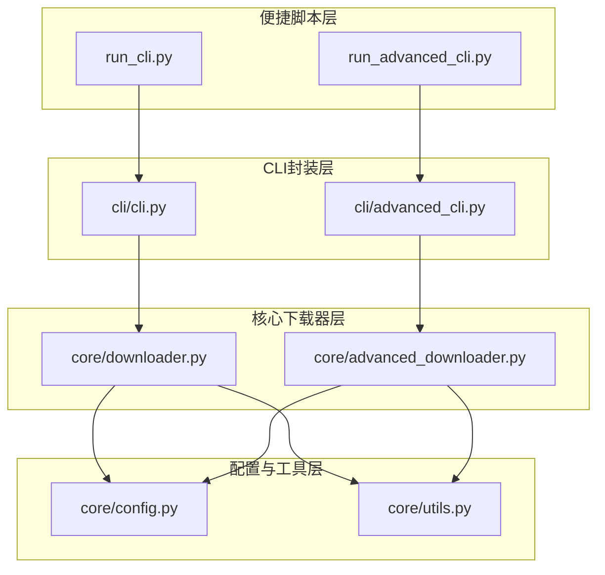
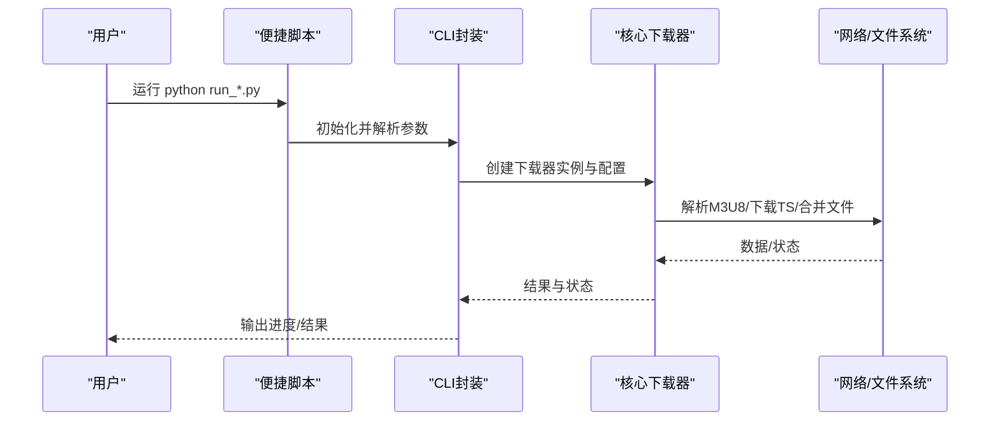
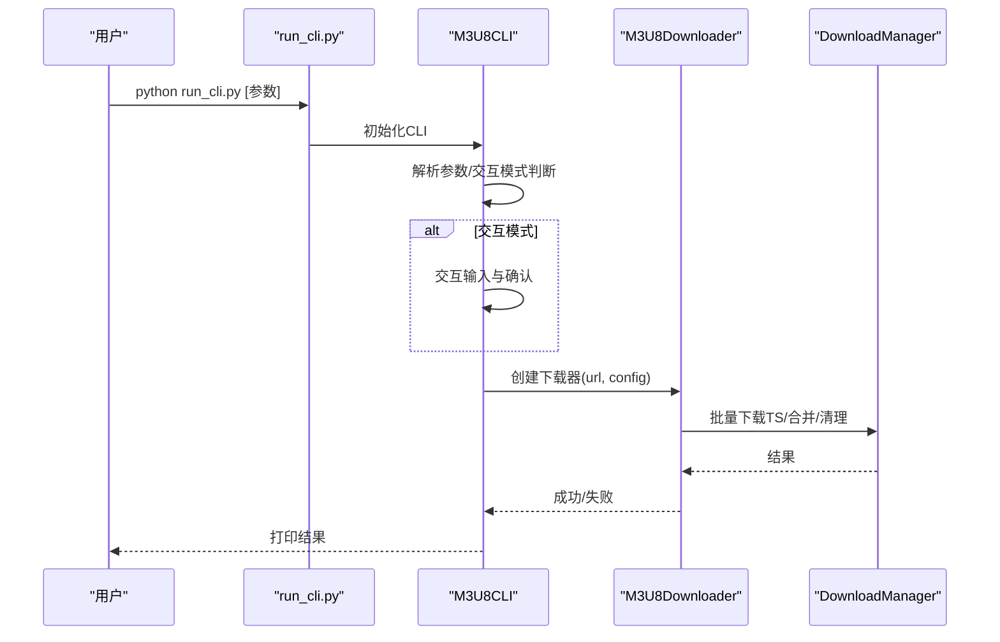
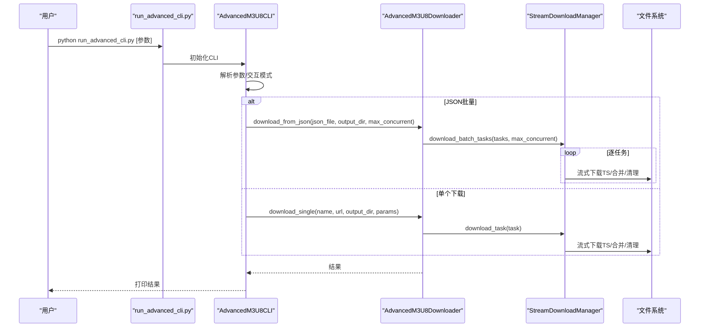
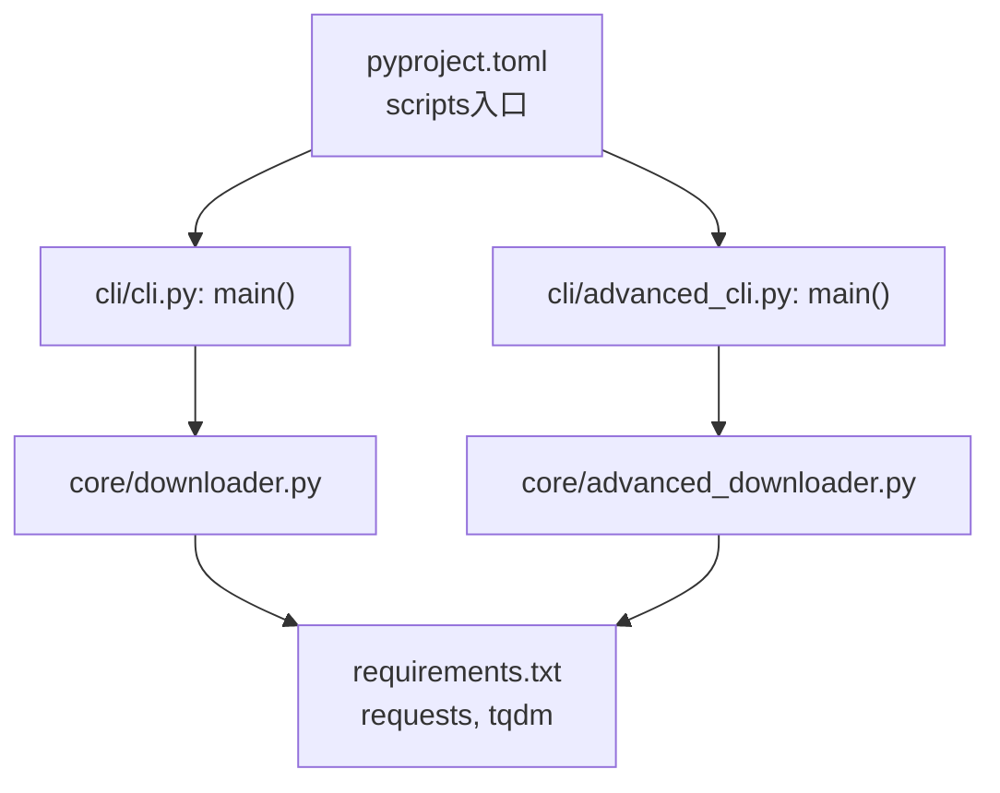

# 便捷脚本

<cite>
**本文引用的文件**
- [run_cli.py](file://app/downloader/run_cli.py)
- [run_advanced_cli.py](file://app/downloader/run_advanced_cli.py)
- [cli.py](file://app/downloader/cli/cli.py)
- [advanced_cli.py](file://app/downloader/cli/advanced_cli.py)
- [downloader.py](file://app/downloader/core/downloader.py)
- [advanced_downloader.py](file://app/downloader/core/advanced_downloader.py)
- [config.py](file://app/downloader/core/config.py)
- [utils.py](file://app/downloader/core/utils.py)
- [QUICKSTART.md](file://app/downloader/QUICKSTART.md)
- [README.md](file://app/downloader/docs/README.md)
- [pyproject.toml](file://app/downloader/pyproject.toml)
- [requirements.txt](file://app/downloader/requirements.txt)
- [tasks.example.json](file://app/downloader/examples/tasks.example.json)
- [tasks.example1.json](file://app/downloader/examples/tasks.example1.json)
- [test_basic.py](file://app/downloader/tests/test_basic.py)
</cite>

## 目录
1. [简介](#简介)
2. [项目结构](#项目结构)
3. [核心组件](#核心组件)
4. [架构总览](#架构总览)
5. [详细组件分析](#详细组件分析)
6. [依赖关系分析](#依赖关系分析)
7. [性能考虑](#性能考虑)
8. [故障排查指南](#故障排查指南)
9. [结论](#结论)
10. [附录](#附录)

## 简介
本文件围绕“便捷脚本”主题，聚焦于下载器模块中的两条启动路径：基础版与高级版命令行入口脚本，以及它们如何通过统一的CLI封装与核心下载器协作，实现“一键运行、即开即用”的使用体验。便捷脚本通过在本地目录直接运行，绕过复杂的模块导入路径限制，降低用户上手门槛；同时保留强大的配置能力与交互模式，满足从单文件到批量任务的多样化需求。

## 项目结构
- app/downloader/run_cli.py：基础版便捷启动脚本
- app/downloader/run_advanced_cli.py：高级版便捷启动脚本
- app/downloader/cli/cli.py：基础版CLI封装
- app/downloader/cli/advanced_cli.py：高级版CLI封装
- app/downloader/core/downloader.py：基础版下载器核心
- app/downloader/core/advanced_downloader.py：高级版下载器核心
- app/downloader/core/config.py：配置参数与模板
- app/downloader/core/utils.py：工具函数（含输入、校验、格式化等）
- app/downloader/QUICKSTART.md：使用指南（含便捷脚本用法）
- app/downloader/docs/README.md：功能说明与命令行参数详解
- app/downloader/pyproject.toml：命令行入口注册
- app/downloader/requirements.txt：依赖声明
- app/downloader/examples/*.json：JSON任务示例
- app/downloader/tests/test_basic.py：基础功能测试

图表来源
- [run_cli.py](file://app/downloader/run_cli.py#L1-L25)
- [run_advanced_cli.py](file://app/downloader/run_advanced_cli.py#L1-L17)
- [cli.py](file://app/downloader/cli/cli.py#L1-L292)
- [advanced_cli.py](file://app/downloader/cli/advanced_cli.py#L1-L377)
- [downloader.py](file://app/downloader/core/downloader.py#L1-L501)
- [advanced_downloader.py](file://app/downloader/core/advanced_downloader.py#L1-L586)
- [config.py](file://app/downloader/core/config.py#L1-L114)
- [utils.py](file://app/downloader/core/utils.py#L1-L290)

章节来源
- [run_cli.py](file://app/downloader/run_cli.py#L1-L25)
- [run_advanced_cli.py](file://app/downloader/run_advanced_cli.py#L1-L17)
- [QUICKSTART.md](file://app/downloader/QUICKSTART.md#L1-L120)

## 核心组件
- 便捷启动脚本
  - run_cli.py：将父目录加入sys.path，导入基础CLI并运行
  - run_advanced_cli.py：将父目录加入sys.path，导入高级CLI并运行
- CLI封装
  - cli.py：基础版CLI，支持参数解析、配置模板、交互模式、URL校验与下载执行
  - advanced_cli.py：高级版CLI，支持JSON批量、流式下载、交互创建JSON、并发控制
- 核心下载器
  - downloader.py：基础版下载器，M3U8解析、TS批量下载、合并与清理
  - advanced_downloader.py：高级版下载器，任务模型、流式下载、批量任务、进度与清理
- 配置与工具
  - config.py：DownloadConfig与ConfigTemplates，提供默认与预设配置
  - utils.py：FileValidator、URLProcessor、格式化与交互辅助函数

章节来源
- [cli.py](file://app/downloader/cli/cli.py#L1-L292)
- [advanced_cli.py](file://app/downloader/cli/advanced_cli.py#L1-L377)
- [downloader.py](file://app/downloader/core/downloader.py#L1-L501)
- [advanced_downloader.py](file://app/downloader/core/advanced_downloader.py#L1-L586)
- [config.py](file://app/downloader/core/config.py#L1-L114)
- [utils.py](file://app/downloader/core/utils.py#L1-L290)

## 架构总览
便捷脚本通过两条路径进入系统：
- 基础版：run_cli.py -> M3U8CLI -> M3U8Downloader -> DownloadManager/Parser
- 高级版：run_advanced_cli.py -> AdvancedM3U8CLI -> AdvancedM3U8Downloader -> StreamDownloadManager/JSONTaskLoader

图表来源
- [run_cli.py](file://app/downloader/run_cli.py#L1-L25)
- [run_advanced_cli.py](file://app/downloader/run_advanced_cli.py#L1-L17)
- [cli.py](file://app/downloader/cli/cli.py#L240-L292)
- [advanced_cli.py](file://app/downloader/cli/advanced_cli.py#L314-L377)
- [downloader.py](file://app/downloader/core/downloader.py#L379-L501)
- [advanced_downloader.py](file://app/downloader/core/advanced_downloader.py#L524-L586)

## 详细组件分析

### 基础版便捷脚本与CLI
- run_cli.py
  - 作用：解决模块导入路径问题，直接运行基础CLI
  - 关键逻辑：添加父目录到sys.path，导入M3U8CLI并执行
- M3U8CLI
  - 参数解析：支持URL、输出、线程、配置模板、超时、请求头、功能开关、交互模式
  - 交互模式：引导用户输入URL、选择配置模板、输出文件名，并确认后执行下载
  - 命令行模式：校验URL、创建配置、推导输出文件名、可试运行、执行下载
  - 下载执行：构造M3U8Downloader，调用download并返回状态

图表来源
- [run_cli.py](file://app/downloader/run_cli.py#L1-L25)
- [cli.py](file://app/downloader/cli/cli.py#L240-L292)
- [downloader.py](file://app/downloader/core/downloader.py#L379-L501)

章节来源
- [run_cli.py](file://app/downloader/run_cli.py#L1-L25)
- [cli.py](file://app/downloader/cli/cli.py#L1-L292)
- [downloader.py](file://app/downloader/core/downloader.py#L1-L501)

### 高级版便捷脚本与CLI
- run_advanced_cli.py
  - 作用：解决模块导入路径问题，直接运行高级CLI
  - 关键逻辑：添加父目录到sys.path，导入AdvancedM3U8CLI并执行
- AdvancedM3U8CLI
  - 参数解析：支持URL、输出、线程、JSON配置、输出目录、并发、配置模板、功能开关、交互模式
  - 交互模式：支持单个下载、JSON批量下载、创建JSON配置文件
  - JSON批量：加载任务、并发控制、逐任务流式下载、合并与清理
  - 单个下载：创建任务并执行流式下载
  - 下载执行：构造AdvancedM3U8Downloader，调用download_from_json或download_single

图表来源
- [run_advanced_cli.py](file://app/downloader/run_advanced_cli.py#L1-L17)
- [advanced_cli.py](file://app/downloader/cli/advanced_cli.py#L314-L377)
- [advanced_downloader.py](file://app/downloader/core/advanced_downloader.py#L524-L586)

章节来源
- [run_advanced_cli.py](file://app/downloader/run_advanced_cli.py#L1-L17)
- [advanced_cli.py](file://app/downloader/cli/advanced_cli.py#L1-L377)
- [advanced_downloader.py](file://app/downloader/core/advanced_downloader.py#L1-L586)

### 配置与模板
- DownloadConfig
  - 默认线程数为CPU核心数的倍数，自动确保临时与输出目录存在
  - 提供to_dict便于导出与调试
- ConfigTemplates
  - fast/stable/low_bandwidth三套预设，覆盖不同网络与性能场景
- URL与文件工具
  - URLProcessor：标准化URL、提取域名、追加查询参数
  - FileValidator：URL与M3U8内容校验、磁盘空间检查
  - 输入与提示：safe_input、confirm_action、print_banner

章节来源
- [config.py](file://app/downloader/core/config.py#L1-L114)
- [utils.py](file://app/downloader/core/utils.py#L1-L290)

### JSON任务与示例
- 任务结构
  - name、url、output_dir、params（可选）
  - 支持相对输出目录，结合基础输出目录统一管理
- 示例文件
  - tasks.example.json：多任务示例，包含质量、语言等参数
  - tasks.example1.json：简化示例

章节来源
- [tasks.example.json](file://app/downloader/examples/tasks.example.json#L1-L31)
- [tasks.example1.json](file://app/downloader/examples/tasks.example1.json#L1-L7)
- [advanced_downloader.py](file://app/downloader/core/advanced_downloader.py#L432-L499)

## 依赖关系分析
- 命令行入口
  - pyproject.toml注册了m3u8-cli与m3u8-advanced-cli两个命令入口，分别指向基础与高级CLI的main函数
- 依赖声明
  - requirements.txt声明requests与tqdm
- 导入路径
  - 便捷脚本通过sys.path.insert解决相对导入问题
  - 正常运行建议从app目录使用-m模块路径，或使用便捷脚本

图表来源
- [pyproject.toml](file://app/downloader/pyproject.toml#L1-L17)
- [requirements.txt](file://app/downloader/requirements.txt#L1-L3)
- [cli.py](file://app/downloader/cli/cli.py#L283-L292)
- [advanced_cli.py](file://app/downloader/cli/advanced_cli.py#L368-L377)
- [downloader.py](file://app/downloader/core/downloader.py#L1-L501)
- [advanced_downloader.py](file://app/downloader/core/advanced_downloader.py#L1-L586)

章节来源
- [pyproject.toml](file://app/downloader/pyproject.toml#L1-L17)
- [requirements.txt](file://app/downloader/requirements.txt#L1-L3)
- [run_cli.py](file://app/downloader/run_cli.py#L1-L25)
- [run_advanced_cli.py](file://app/downloader/run_advanced_cli.py#L1-L17)

## 性能考虑
- 并发与线程
  - 基础版：DownloadManager使用ThreadPoolExecutor控制并发，合理设置线程数可提升吞吐
  - 高级版：支持任务级并发（--max-concurrent），每任务内部TS文件串行下载，避免资源争用
- 重试与超时
  - RetryHandler指数退避策略，降低瞬时失败影响
  - 可配置连接与读取超时，平衡稳定性与速度
- 内存与I/O
  - 流式下载与分块写入，避免大文件内存压力
  - 合并阶段按文件名排序，减少随机访问开销
- 断点续传
  - 自动跳过已存在的TS文件，支持中断后继续

章节来源
- [downloader.py](file://app/downloader/core/downloader.py#L1-L501)
- [advanced_downloader.py](file://app/downloader/core/advanced_downloader.py#L1-L586)
- [config.py](file://app/downloader/core/config.py#L1-L114)

## 故障排查指南
- 模块导入错误
  - 症状：ModuleNotFoundError: No module named 'cli.config'
  - 原因：在错误目录运行-m命令
  - 解决：从app目录运行，使用完整模块路径；或使用便捷脚本
- 依赖缺失
  - 症状：ImportError或运行时报requests/tqdm相关错误
  - 解决：安装requirements.txt中的依赖
- 下载失败
  - 症状：网络波动导致失败
  - 解决：使用稳定模式或增大重试次数；启用日志查看详细错误
- 进度与输出
  - 症状：无进度显示或输出路径不符合预期
  - 解决：检查--no-progress/--output-dir参数；确认临时目录与输出目录权限

章节来源
- [QUICKSTART.md](file://app/downloader/QUICKSTART.md#L220-L290)
- [README.md](file://app/downloader/docs/README.md#L307-L406)
- [test_basic.py](file://app/downloader/tests/test_basic.py#L1-L260)

## 结论
便捷脚本通过两条轻量入口，将复杂的功能封装在CLI与核心下载器中，既降低了用户使用门槛，又保留了高度可配置性与扩展性。基础版适合单文件快速下载，高级版则面向批量任务与更精细的并发控制。配合配置模板、交互模式与JSON任务，用户可在不同场景下高效完成M3U8下载。

## 附录
- 常用命令参考（来自使用指南）
  - 基础版：单个下载、指定输出、指定线程、配置模板、交互模式
  - 高级版：单个下载（流式）、JSON批量、并发控制、输出目录、配置模板
- 编程接口
  - 基础下载器：M3U8Downloader
  - 高级下载器：AdvancedM3U8Downloader，支持单任务与JSON批量
- 测试与示例
  - 基础测试脚本验证模块导入、配置、解析器、下载器、工具与CLI功能
  - 示例JSON任务文件可直接用于批量下载演示

章节来源
- [QUICKSTART.md](file://app/downloader/QUICKSTART.md#L63-L181)
- [README.md](file://app/downloader/docs/README.md#L184-L306)
- [test_basic.py](file://app/downloader/tests/test_basic.py#L1-L260)