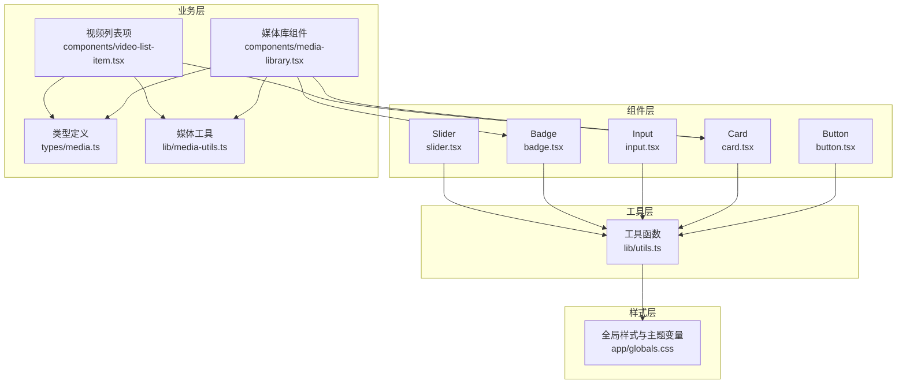
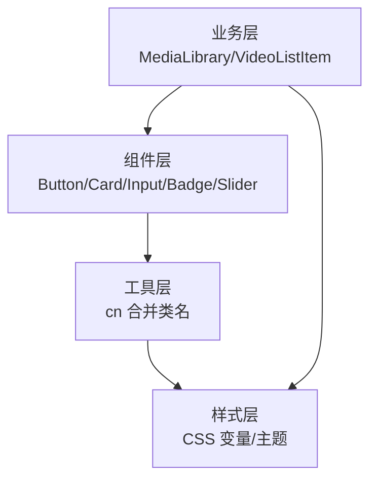
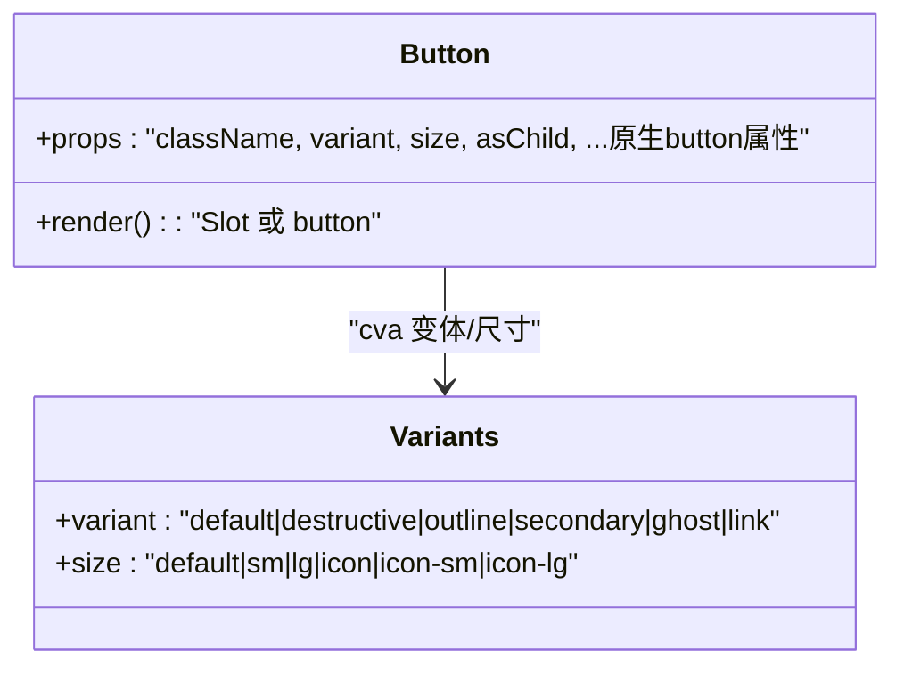
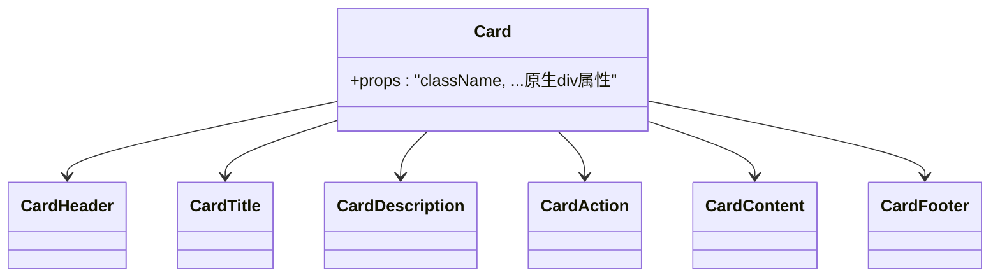
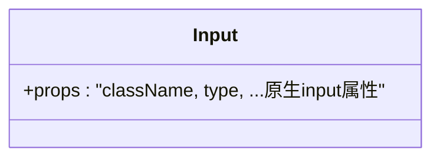
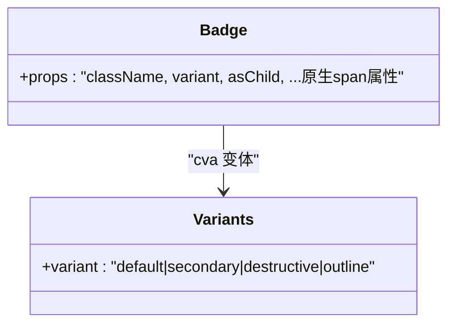
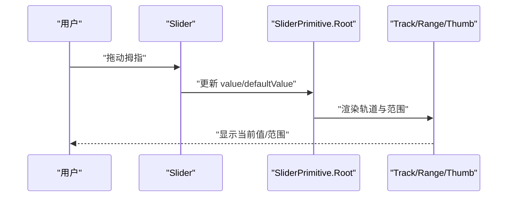
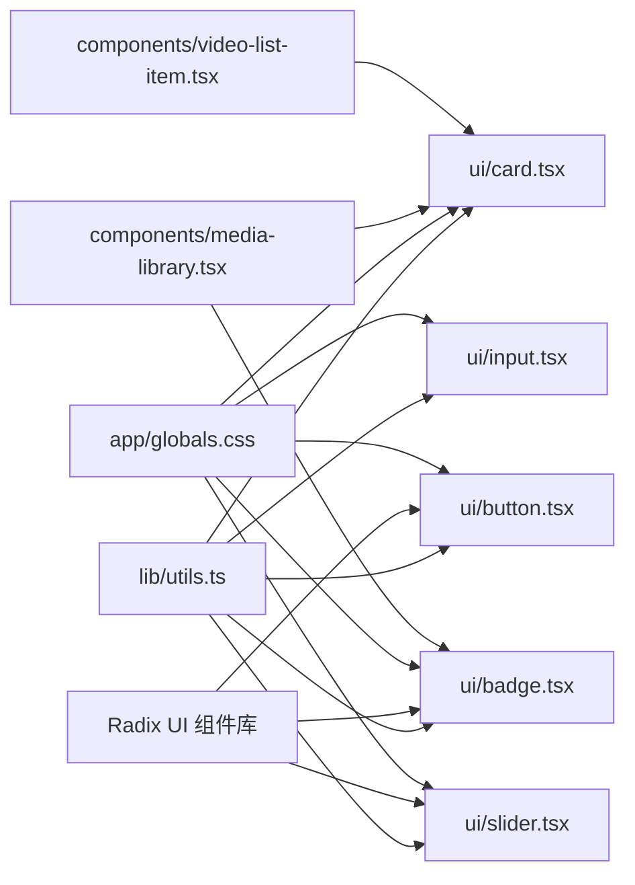
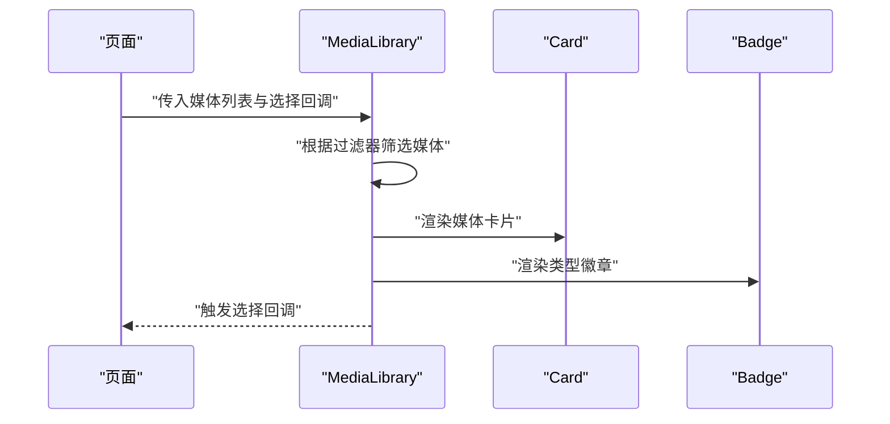

# UI组件库

<cite>
**本文引用的文件**
- [button.tsx](file://app/web/components/ui/button.tsx)
- [card.tsx](file://app/web/components/ui/card.tsx)
- [input.tsx](file://app/web/components/ui/input.tsx)
- [badge.tsx](file://app/web/components/ui/badge.tsx)
- [slider.tsx](file://app/web/components/ui/slider.tsx)
- [utils.ts](file://app/web/lib/utils.ts)
- [globals.css](file://app/web/app/globals.css)
- [package.json](file://app/web/package.json)
- [media-library.tsx](file://app/web/components/media-library.tsx)
- [video-list-item.tsx](file://app/web/components/video-list-item.tsx)
- [media-utils.ts](file://app/web/lib/media-utils.ts)
- [media.ts](file://app/web/types/media.ts)
</cite>

## 目录
1. [简介](#简介)
2. [项目结构](#项目结构)
3. [核心组件](#核心组件)
4. [架构总览](#架构总览)
5. [组件详解](#组件详解)
6. [依赖关系分析](#依赖关系分析)
7. [性能与可维护性](#性能与可维护性)
8. [故障排查指南](#故障排查指南)
9. [结论](#结论)
10. [附录：最佳实践与组合示例](#附录最佳实践与组合示例)

## 简介
本文件为基于 Radix UI 与 Tailwind CSS 的 UI 组件库综合文档，聚焦于按钮、卡片、输入框、徽章与滑块等基础组件的设计原则、实现方式与使用规范。文档涵盖组件属性接口、事件处理、样式定制、主题系统、响应式设计与无障碍访问支持，并提供组件组合使用示例与最佳实践建议，帮助开发者在 Next.js 应用中高效构建一致、可扩展且可访问的界面。

## 项目结构
该 UI 组件库位于 Web 前端工程中，采用按功能模块组织的目录结构：
- 组件定义：app/web/components/ui 下提供基础 UI 组件封装
- 工具函数：app/web/lib 提供通用工具，如类名合并
- 主题与样式：app/web/app/globals.css 定义 CSS 变量与主题变量
- 类型定义：app/web/types 定义媒体数据类型
- 组合示例：app/web/components 下提供媒体库与视频列表等业务组件，展示组件组合使用

图表来源
- [button.tsx](file://app/web/components/ui/button.tsx#L1-L63)
- [card.tsx](file://app/web/components/ui/card.tsx#L1-L93)
- [input.tsx](file://app/web/components/ui/input.tsx#L1-L22)
- [badge.tsx](file://app/web/components/ui/badge.tsx#L1-L47)
- [slider.tsx](file://app/web/components/ui/slider.tsx#L1-L64)
- [utils.ts](file://app/web/lib/utils.ts#L1-L7)
- [globals.css](file://app/web/app/globals.css#L1-L131)
- [media-library.tsx](file://app/web/components/media-library.tsx#L1-L120)
- [video-list-item.tsx](file://app/web/components/video-list-item.tsx#L1-L93)
- [media-utils.ts](file://app/web/lib/media-utils.ts#L1-L43)
- [media.ts](file://app/web/types/media.ts#L1-L20)

章节来源
- [package.json](file://app/web/package.json#L1-L74)

## 核心组件
本节对五个基础组件进行概览：按钮、卡片、输入框、徽章与滑块。它们均通过 Tailwind CSS 实现一致的视觉与交互风格，并结合 Radix UI 提供可访问性与语义化能力。

- 按钮 Button：支持多种变体与尺寸，具备可选的 asChild 渲染模式，用于语义化包裹其他元素；提供焦点可见环与无效状态提示。
- 卡片 Card：提供卡片容器与其子段落（头部、标题、描述、内容、操作、底部），支持栅格布局与边框分隔线样式。
- 输入框 Input：统一输入框外观与焦点环，支持禁用态与无效态提示。
- 徽章 Badge：支持多种变体，可作为语义化容器或原生元素渲染。
- 滑块 Slider：基于 Radix UI 的滑块控件，支持单值与多值拖拽，提供轨道与拇指样式。

章节来源
- [button.tsx](file://app/web/components/ui/button.tsx#L1-L63)
- [card.tsx](file://app/web/components/ui/card.tsx#L1-L93)
- [input.tsx](file://app/web/components/ui/input.tsx#L1-L22)
- [badge.tsx](file://app/web/components/ui/badge.tsx#L1-L47)
- [slider.tsx](file://app/web/components/ui/slider.tsx#L1-L64)

## 架构总览
组件库整体采用“组件 + 工具 + 样式”的分层架构：
- 组件层：以函数组件形式导出，内部通过 Radix Slot 与 cva 控制渲染与变体。
- 工具层：提供类名合并函数，确保 Tailwind 与自定义类名正确合并。
- 样式层：通过 CSS 变量与 @theme 定义主题色板与圆角半径，支持明暗主题切换。
- 业务层：媒体库与视频列表等组件组合基础组件，形成页面级功能模块。

图表来源
- [utils.ts](file://app/web/lib/utils.ts#L1-L7)
- [globals.css](file://app/web/app/globals.css#L1-L131)
- [media-library.tsx](file://app/web/components/media-library.tsx#L1-L120)
- [video-list-item.tsx](file://app/web/components/video-list-item.tsx#L1-L93)

## 组件详解

### 按钮 Button
- 设计原则
  - 使用 cva 定义变体与尺寸，保证样式一致性与可扩展性。
  - 支持 asChild，允许将按钮渲染为非 button 元素（如链接）。
  - 提供焦点可见环与无效状态提示，增强可访问性。
- 关键属性
  - className：自定义类名
  - variant：变体（default/destructive/outline/secondary/ghost/link）
  - size：尺寸（default/sm/lg/icon/icon-sm/icon-lg）
  - asChild：是否以子元素包装渲染
  - 其他原生 button 属性透传
- 事件处理
  - 透传原生事件（如 onClick、onMouseDown 等）
- 样式定制
  - 通过 variant/size 调整背景、边框、阴影、文字颜色与尺寸
  - 支持禁用态与无效态样式
- 无障碍支持
  - 内置 focus-visible 环与 aria-invalid 提示
  - 支持 asChild 以保持语义化标签

图表来源
- [button.tsx](file://app/web/components/ui/button.tsx#L1-L63)

章节来源
- [button.tsx](file://app/web/components/ui/button.tsx#L1-L63)

### 卡片 Card
- 设计原则
  - 提供卡片容器与其子段落，便于结构化内容展示
  - 支持边框与阴影，配合栅格布局实现复杂卡片结构
- 子组件
  - Card：卡片容器
  - CardHeader：卡片头部，支持操作区栅格布局
  - CardTitle：标题
  - CardDescription：描述文本
  - CardAction：右侧操作区
  - CardContent：内容区
  - CardFooter：底部区
- 样式与布局
  - 使用 Tailwind 基础样式与容器查询，适配不同屏幕尺寸
  - 支持边框分隔线与内边距统一
- 无障碍支持
  - 通过语义化 div 结构与 data-slot 标记，便于样式与测试定位

图表来源
- [card.tsx](file://app/web/components/ui/card.tsx#L1-L93)

章节来源
- [card.tsx](file://app/web/components/ui/card.tsx#L1-L93)

### 输入框 Input
- 设计原则
  - 统一输入框外观与焦点环，提升一致性
  - 支持禁用态与无效态提示
- 关键属性
  - className：自定义类名
  - type：原生 input 类型
  - 其他原生 input 属性透传
- 样式定制
  - 统一边框、圆角、内边距与过渡动画
  - 支持文件选择器与占位符样式
- 无障碍支持
  - 内置 focus-visible 环与 aria-invalid 提示

图表来源
- [input.tsx](file://app/web/components/ui/input.tsx#L1-L22)

章节来源
- [input.tsx](file://app/web/components/ui/input.tsx#L1-L22)

### 徽章 Badge
- 设计原则
  - 用于标识状态、类型或标签，支持多种变体
  - 支持 asChild，可作为语义化容器
- 关键属性
  - className：自定义类名
  - variant：变体（default/secondary/destructive/outline）
  - asChild：是否以子元素包装渲染
  - 其他原生 span 属性透传
- 样式定制
  - 通过变体控制背景、边框与文字颜色
  - 支持图标间距与无效态提示
- 无障碍支持
  - 内置 focus-visible 环与 aria-invalid 提示

图表来源
- [badge.tsx](file://app/web/components/ui/badge.tsx#L1-L47)

章节来源
- [badge.tsx](file://app/web/components/ui/badge.tsx#L1-L47)

### 滑块 Slider
- 设计原则
  - 基于 Radix UI 的滑块控件，提供轨道与范围可视化
  - 支持单值与多值拖拽，适配水平与垂直方向
- 关键属性
  - className：自定义类名
  - defaultValue/value：默认值/受控值（支持数组）
  - min/max：数值范围
  - 其他原生 Root 属性透传
- 样式定制
  - 轨道与范围条根据方向设置高度/宽度
  - 拇指提供悬停与焦点环样式
- 无障碍支持
  - 由 Radix UI 提供键盘导航与语义化标签

图表来源
- [slider.tsx](file://app/web/components/ui/slider.tsx#L1-L64)

章节来源
- [slider.tsx](file://app/web/components/ui/slider.tsx#L1-L64)

## 依赖关系分析
- 组件到工具
  - 所有组件通过工具函数合并类名，确保 Tailwind 与自定义类名正确叠加
- 组件到 Radix UI
  - 按钮与徽章使用 Slot 包裹，滑块使用 @radix-ui/react-slider
- 组件到样式
  - 组件样式依赖全局 CSS 变量与主题变量，支持明暗主题
- 业务组件到基础组件
  - 媒体库与视频列表组合使用卡片与徽章，体现组件复用与组合

图表来源
- [utils.ts](file://app/web/lib/utils.ts#L1-L7)
- [button.tsx](file://app/web/components/ui/button.tsx#L1-L63)
- [card.tsx](file://app/web/components/ui/card.tsx#L1-L93)
- [input.tsx](file://app/web/components/ui/input.tsx#L1-L22)
- [badge.tsx](file://app/web/components/ui/badge.tsx#L1-L47)
- [slider.tsx](file://app/web/components/ui/slider.tsx#L1-L64)
- [globals.css](file://app/web/app/globals.css#L1-L131)
- [media-library.tsx](file://app/web/components/media-library.tsx#L1-L120)
- [video-list-item.tsx](file://app/web/components/video-list-item.tsx#L1-L93)

章节来源
- [package.json](file://app/web/package.json#L1-L74)

## 性能与可维护性
- 类名合并策略
  - 使用 clsx 与 tailwind-merge 合并类名，避免重复与冲突，减少样式体积
- 变体与尺寸
  - 通过 cva 定义变体与尺寸，集中管理样式，降低维护成本
- 主题系统
  - 使用 CSS 变量与 @theme 定义主题色板，支持明暗主题切换，减少重复样式
- 组合组件
  - 业务组件通过组合基础组件实现功能，提高复用性与可测试性

章节来源
- [utils.ts](file://app/web/lib/utils.ts#L1-L7)
- [globals.css](file://app/web/app/globals.css#L1-L131)

## 故障排查指南
- 样式未生效
  - 检查类名合并顺序与 Tailwind 配置，确认自定义类名在工具函数之后
  - 确认 CSS 变量已正确注入，明暗主题切换正常
- 变体/尺寸不生效
  - 确认传入的 variant/size 值在组件定义范围内
  - 检查是否被自定义类名覆盖
- 无障碍问题
  - 确保表单控件具备正确的 aria-* 属性
  - 检查 focus-visible 环是否正常显示
- 滑块行为异常
  - 确认 defaultValue/value 与 min/max 设置合理
  - 检查 orientation 是否正确传递

章节来源
- [button.tsx](file://app/web/components/ui/button.tsx#L1-L63)
- [input.tsx](file://app/web/components/ui/input.tsx#L1-L22)
- [badge.tsx](file://app/web/components/ui/badge.tsx#L1-L47)
- [slider.tsx](file://app/web/components/ui/slider.tsx#L1-L64)
- [globals.css](file://app/web/app/globals.css#L1-L131)

## 结论
本 UI 组件库以 Radix UI 与 Tailwind CSS 为基础，通过 cva 变体系统、工具函数与主题变量，实现了高内聚、低耦合的基础组件体系。组件在样式、交互与无障碍方面均遵循一致的设计语言，并通过业务组件组合展示了实际应用场景。建议在新功能开发中优先复用现有组件，遵循变体与尺寸约定，确保一致的用户体验与可维护性。

## 附录：最佳实践与组合示例

### 主题系统与响应式设计
- 使用 CSS 变量与 @theme 定义主题色板，支持明暗主题切换
- 在组件中使用 data-slot 与容器查询，适配不同屏幕尺寸
- 通过 focus-visible 与 aria-* 属性提升可访问性

章节来源
- [globals.css](file://app/web/app/globals.css#L1-L131)

### 组件属性与事件处理清单
- 按钮 Button
  - 属性：className、variant、size、asChild、原生 button 属性
  - 事件：onClick、onMouseDown 等
- 卡片 Card
  - 属性：className、原生 div 属性
  - 子组件：CardHeader/CardTitle/CardDescription/CardAction/CardContent/CardFooter
- 输入框 Input
  - 属性：className、type、原生 input 属性
- 徽章 Badge
  - 属性：className、variant、asChild、原生 span 属性
- 滑块 Slider
  - 属性：className、defaultValue/value、min/max、原生 Root 属性

章节来源
- [button.tsx](file://app/web/components/ui/button.tsx#L1-L63)
- [card.tsx](file://app/web/components/ui/card.tsx#L1-L93)
- [input.tsx](file://app/web/components/ui/input.tsx#L1-L22)
- [badge.tsx](file://app/web/components/ui/badge.tsx#L1-L47)
- [slider.tsx](file://app/web/components/ui/slider.tsx#L1-L64)

### 组件组合使用示例
- 媒体库 MediaLibrary
  - 使用 Card 与 CardContent 展示媒体项
  - 使用 Badge 标识媒体类型与过滤状态
  - 使用 getMediaType 与 formatFileSize 等工具函数处理数据
- 视频列表项 VideoListItem
  - 使用 Card 展示缩略图与信息
  - 使用格式化函数与条件渲染展示时长、分辨率与比特率

图表来源
- [media-library.tsx](file://app/web/components/media-library.tsx#L1-L120)
- [card.tsx](file://app/web/components/ui/card.tsx#L1-L93)
- [badge.tsx](file://app/web/components/ui/badge.tsx#L1-L47)

章节来源
- [media-library.tsx](file://app/web/components/media-library.tsx#L1-L120)
- [video-list-item.tsx](file://app/web/components/video-list-item.tsx#L1-L93)
- [media-utils.ts](file://app/web/lib/media-utils.ts#L1-L43)
- [media.ts](file://app/web/types/media.ts#L1-L20)