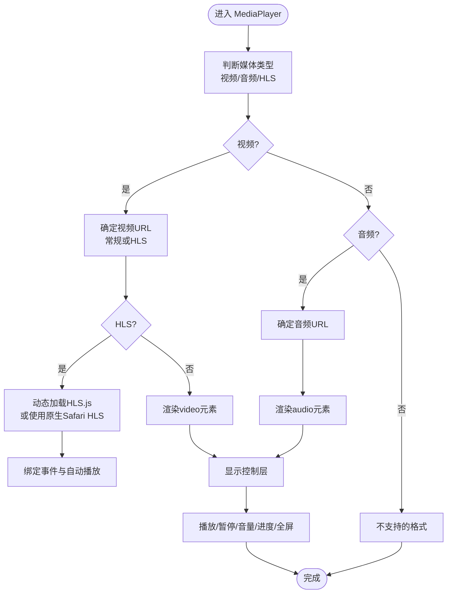

# 前端应用

<cite>
**本文引用的文件**
- [app/web/app/layout.tsx](file://app/web/app/layout.tsx)
- [app/web/app/page.tsx](file://app/web/app/page.tsx)
- [app/web/app/media/page.tsx](file://app/web/app/media/page.tsx)
- [app/web/components/media-library.tsx](file://app/web/components/media-library.tsx)
- [app/web/components/media-player.tsx](file://app/web/components/media-player.tsx)
- [app/web/components/mobile-video-player.tsx](file://app/web/components/mobile-video-player.tsx)
- [app/web/components/video-list-item.tsx](file://app/web/components/video-list-item.tsx)
- [app/web/hooks/useScrollPosition.ts](file://app/web/hooks/useScrollPosition.ts)
- [app/web/lib/media-utils.ts](file://app/web/lib/media-utils.ts)
- [app/web/types/media.ts](file://app/web/types/media.ts)
- [app/web/app/globals.css](file://app/web/app/globals.css)
- [app/web/next.config.ts](file://app/web/next.config.ts)
- [app/web/package.json](file://app/web/package.json)
- [app/web/app/videos/loading.tsx](file://app/web/app/videos/loading.tsx)
</cite>

## 目录
1. [简介](#简介)
2. [项目结构](#项目结构)
3. [核心组件](#核心组件)
4. [架构总览](#架构总览)
5. [详细组件分析](#详细组件分析)
6. [依赖关系分析](#依赖关系分析)
7. [性能与渲染特性](#性能与渲染特性)
8. [故障排查指南](#故障排查指南)
9. [结论](#结论)
10. [附录](#附录)

## 简介
本项目是一个基于 Next.js 的前端应用，专注于移动端视频播放与媒体库展示。应用采用客户端渲染与 Next.js App Router 的页面组织方式，结合 TailwindCSS 与 Radix UI 组件库构建统一的 UI 样式体系；通过原生 HTMLMediaElement 与 HLS.js 实现对 MP4/WebM/HLS/MP3/WAV 等多种媒体格式的支持，并提供统一的播放器控件与响应式布局。

## 项目结构
应用采用 Next.js App Router 的 pages 结构组织，核心页面与组件分布如下：
- 页面层：根布局、首页、媒体页、视频库页、播放页
- 组件层：通用 UI 组件、媒体库、媒体播放器、移动端播放器、视频列表项
- 工具与类型：媒体工具函数、媒体类型定义
- 配置与样式：全局样式、Next 配置、包管理

图表来源
- [app/web/app/layout.tsx](file://app/web/app/layout.tsx#L1-L35)
- [app/web/app/page.tsx](file://app/web/app/page.tsx#L1-L133)
- [app/web/app/media/page.tsx](file://app/web/app/media/page.tsx#L1-L147)
- [app/web/app/videos/page.tsx](file://app/web/app/videos/page.tsx#L1-L259)
- [app/web/components/media-library.tsx](file://app/web/components/media-library.tsx#L1-L120)
- [app/web/components/media-player.tsx](file://app/web/components/media-player.tsx#L1-L322)
- [app/web/components/mobile-video-player.tsx](file://app/web/components/mobile-video-player.tsx#L1-L392)
- [app/web/components/video-list-item.tsx](file://app/web/components/video-list-item.tsx#L1-L93)
- [app/web/lib/media-utils.ts](file://app/web/lib/media-utils.ts#L1-L43)
- [app/web/types/media.ts](file://app/web/types/media.ts#L1-L20)
- [app/web/app/globals.css](file://app/web/app/globals.css#L1-L131)
- [app/web/next.config.ts](file://app/web/next.config.ts#L1-L39)
- [app/web/package.json](file://app/web/package.json#L1-L74)

章节来源
- [app/web/app/layout.tsx](file://app/web/app/layout.tsx#L1-L35)
- [app/web/app/page.tsx](file://app/web/app/page.tsx#L1-L133)
- [app/web/app/media/page.tsx](file://app/web/app/media/page.tsx#L1-L147)
- [app/web/app/videos/page.tsx](file://app/web/app/videos/page.tsx#L1-L259)
- [app/web/app/globals.css](file://app/web/app/globals.css#L1-L131)
- [app/web/next.config.ts](file://app/web/next.config.ts#L1-L39)
- [app/web/package.json](file://app/web/package.json#L1-L74)

## 核心组件
- 媒体库组件：负责根据类型过滤与高亮选中项，展示媒体卡片并触发选择回调。
- 媒体播放器：统一处理视频与音频播放，自动识别 HLS/常规媒体，动态加载 HLS.js 并兼容 Safari 原生 HLS。
- 移动端播放器：针对移动端手势与全屏优化，内置自动隐藏控制层、加载与错误状态提示。
- 视频列表项：展示缩略图、时长、格式、分辨率/大小/码率等元信息，点击进入播放页。
- 滚动位置钩子：在页面间切换时保存/恢复滚动位置，提升移动端浏览体验。
- 媒体工具：类型识别、时长格式化、文件大小格式化、路径规范化。
- 类型定义：标准化媒体项字段，便于跨组件传递与消费。

章节来源
- [app/web/components/media-library.tsx](file://app/web/components/media-library.tsx#L1-L120)
- [app/web/components/media-player.tsx](file://app/web/components/media-player.tsx#L1-L322)
- [app/web/components/mobile-video-player.tsx](file://app/web/components/mobile-video-player.tsx#L1-L392)
- [app/web/components/video-list-item.tsx](file://app/web/components/video-list-item.tsx#L1-L93)
- [app/web/hooks/useScrollPosition.ts](file://app/web/hooks/useScrollPosition.ts#L1-L28)
- [app/web/lib/media-utils.ts](file://app/web/lib/media-utils.ts#L1-L43)
- [app/web/types/media.ts](file://app/web/types/media.ts#L1-L20)

## 架构总览
应用采用“页面 + 组件 + 工具”的分层架构：
- 页面层：负责数据获取、状态管理与路由跳转（如视频库页的 API 请求与过滤逻辑）。
- 组件层：封装可复用 UI 与业务能力（播放器、媒体库、列表项）。
- 工具层：提供类型识别与格式化等纯函数，降低重复逻辑。
- 样式层：通过全局 CSS 定义主题变量与原子类风格，配合 Tailwind v4 主题系统。
- 配置层：Next 配置用于图片远端域名白名单与可选的跨域头。

图表来源
- [app/web/app/videos/page.tsx](file://app/web/app/videos/page.tsx#L1-L259)
- [app/web/components/video-list-item.tsx](file://app/web/components/video-list-item.tsx#L1-L93)
- [app/web/components/media-player.tsx](file://app/web/components/media-player.tsx#L1-L322)
- [app/web/components/mobile-video-player.tsx](file://app/web/components/mobile-video-player.tsx#L1-L392)
- [app/web/lib/media-utils.ts](file://app/web/lib/media-utils.ts#L1-L43)
- [app/web/types/media.ts](file://app/web/types/media.ts#L1-L20)
- [app/web/hooks/useScrollPosition.ts](file://app/web/hooks/useScrollPosition.ts#L1-L28)

## 详细组件分析

### 媒体播放器（统一播放器）
该组件根据媒体类型自动选择视频或音频播放路径，并对 HLS 进行差异化处理：
- 常规视频/音频：直接使用原生媒体元素。
- HLS：优先检测浏览器原生支持，否则动态按需加载 HLS.js 并绑定事件。
- 控件：统一提供播放/暂停、音量、进度条、全屏、下载等能力。
- 交互：鼠标悬停显示控制层，移动端可自动隐藏控制层。

图表来源
- [app/web/components/media-player.tsx](file://app/web/components/media-player.tsx#L1-L322)

章节来源
- [app/web/components/media-player.tsx](file://app/web/components/media-player.tsx#L1-L322)

### 移动端播放器（移动端优化）
该组件针对移动端场景进行深度优化：
- 自动隐藏控制层：在播放状态下定时隐藏，提升沉浸感。
- 手势与全屏：触摸事件重置控制层显示，全屏切换。
- HLS 与常规视频：分别处理原生 HLS 与本地文件路径，动态加载 HLS.js。
- 加载与错误状态：提供加载指示与错误提示，支持一键重试。

图表来源
- [app/web/components/mobile-video-player.tsx](file://app/web/components/mobile-video-player.tsx#L1-L392)

章节来源
- [app/web/components/mobile-video-player.tsx](file://app/web/components/mobile-video-player.tsx#L1-L392)

### 视频库页与播放页（页面级流程）
视频库页负责拉取后端数据、过滤与展示；播放页负责接收选中媒体并渲染播放器。

图表来源
- [app/web/app/videos/page.tsx](file://app/web/app/videos/page.tsx#L1-L259)
- [app/web/components/media-player.tsx](file://app/web/components/media-player.tsx#L1-L322)

章节来源
- [app/web/app/videos/page.tsx](file://app/web/app/videos/page.tsx#L1-L259)
- [app/web/app/videos/loading.tsx](file://app/web/app/videos/loading.tsx#L1-L4)

### 媒体库组件（过滤与高亮）
媒体库组件提供类型过滤（全部/视频/音频/流媒体），并高亮当前选中项，点击回调用于父组件更新选中媒体。

图表来源
- [app/web/components/media-library.tsx](file://app/web/components/media-library.tsx#L1-L120)
- [app/web/lib/media-utils.ts](file://app/web/lib/media-utils.ts#L1-L43)

章节来源
- [app/web/components/media-library.tsx](file://app/web/components/media-library.tsx#L1-L120)
- [app/web/lib/media-utils.ts](file://app/web/lib/media-utils.ts#L1-L43)

### 视频列表项（缩略图与元信息）
视频列表项组件负责展示缩略图、时长、格式、分辨率/大小/码率等信息，并在悬停时显示播放覆盖层。

图表来源
- [app/web/components/video-list-item.tsx](file://app/web/components/video-list-item.tsx#L1-L93)
- [app/web/types/media.ts](file://app/web/types/media.ts#L1-L20)

章节来源
- [app/web/components/video-list-item.tsx](file://app/web/components/video-list-item.tsx#L1-L93)
- [app/web/types/media.ts](file://app/web/types/media.ts#L1-L20)

## 依赖关系分析
- 组件依赖：播放器依赖媒体类型与工具函数；视频库依赖媒体工具进行类型识别；列表项依赖类型定义。
- 第三方库：HLS.js 用于 HLS 流媒体支持；Radix UI 组件库提供基础 UI 能力；TailwindCSS v4 提供样式系统。
- 配置依赖：Next 配置声明远程图片域名白名单；全局样式定义主题变量与字体。

图表来源
- [app/web/components/media-player.tsx](file://app/web/components/media-player.tsx#L1-L322)
- [app/web/components/mobile-video-player.tsx](file://app/web/components/mobile-video-player.tsx#L1-L392)
- [app/web/components/media-library.tsx](file://app/web/components/media-library.tsx#L1-L120)
- [app/web/components/video-list-item.tsx](file://app/web/components/video-list-item.tsx#L1-L93)
- [app/web/lib/media-utils.ts](file://app/web/lib/media-utils.ts#L1-L43)
- [app/web/types/media.ts](file://app/web/types/media.ts#L1-L20)
- [app/web/app/videos/page.tsx](file://app/web/app/videos/page.tsx#L1-L259)
- [app/web/app/globals.css](file://app/web/app/globals.css#L1-L131)
- [app/web/next.config.ts](file://app/web/next.config.ts#L1-L39)
- [app/web/package.json](file://app/web/package.json#L1-L74)

章节来源
- [app/web/package.json](file://app/web/package.json#L1-L74)
- [app/web/next.config.ts](file://app/web/next.config.ts#L1-L39)

## 性能与渲染特性
- 客户端渲染与页面级懒加载：页面通过“use client”启用客户端渲染，组件按需加载（如播放页动态导入播放器）。
- 按需加载 HLS.js：仅在需要时动态引入，减少首屏体积。
- 响应式设计：Tailwind v4 主题系统与断点配合，网格/列表双视图适配不同屏幕尺寸。
- 移动端优化：移动端播放器自动隐藏控制层、全屏与手势交互，提升沉浸体验。
- 图片与资源：Next 配置允许访问指定远程图片源，避免跨域问题；播放器支持 poster 与预加载策略。

章节来源
- [app/web/components/media-player.tsx](file://app/web/components/media-player.tsx#L1-L322)
- [app/web/components/mobile-video-player.tsx](file://app/web/components/mobile-video-player.tsx#L1-L392)
- [app/web/app/globals.css](file://app/web/app/globals.css#L1-L131)
- [app/web/next.config.ts](file://app/web/next.config.ts#L1-L39)

## 故障排查指南
- HLS 播放失败
  - 症状：HLS 初始化或 manifest 解析失败。
  - 排查：确认浏览器是否原生支持 HLS 或已成功动态加载 HLS.js；检查网络与跨域配置。
  - 参考路径：[HLS 初始化与错误处理](file://app/web/components/mobile-video-player.tsx#L43-L92)
- 自动播放被阻止
  - 症状：自动播放失败或静音状态。
  - 排查：移动端通常需要用户交互后才能播放；检查浏览器策略与用户手势。
  - 参考路径：[自动播放与错误捕获](file://app/web/components/mobile-video-player.tsx#L119-L124)
- 图片无法显示
  - 症状：缩略图或占位图不显示。
  - 排查：确认 Next 配置中的远程图片域名白名单；检查路径格式（Windows反斜杠替换）。
  - 参考路径：[远程图片白名单](file://app/web/next.config.ts#L8-L17)，[路径规范化](file://app/web/lib/media-utils.ts#L39-L43)
- 滚动位置丢失
  - 症状：从播放页返回后滚动位置不恢复。
  - 排查：确认 sessionStorage 中保存的位置键值是否存在；检查恢复逻辑与时机。
  - 参考路径：[滚动位置钩子](file://app/web/hooks/useScrollPosition.ts#L1-L28)，[页面恢复逻辑](file://app/web/app/videos/page.tsx#L81-L127)

章节来源
- [app/web/components/mobile-video-player.tsx](file://app/web/components/mobile-video-player.tsx#L43-L92)
- [app/web/components/mobile-video-player.tsx](file://app/web/components/mobile-video-player.tsx#L119-L124)
- [app/web/next.config.ts](file://app/web/next.config.ts#L8-L17)
- [app/web/lib/media-utils.ts](file://app/web/lib/media-utils.ts#L39-L43)
- [app/web/hooks/useScrollPosition.ts](file://app/web/hooks/useScrollPosition.ts#L1-L28)
- [app/web/app/videos/page.tsx](file://app/web/app/videos/page.tsx#L81-L127)

## 结论
本应用通过清晰的页面与组件分层、统一的媒体播放器与工具函数，实现了对多格式媒体的良好支持与移动端优化。借助 Next.js 的客户端渲染与按需加载能力，以及 Tailwind v4 的主题系统，应用在功能完整性与视觉一致性方面表现良好。后续可在服务端渲染、缓存策略与错误边界等方面进一步增强稳定性与性能。

## 附录
- 样式系统与主题
  - 全局样式通过 CSS 变量定义主题色板，Tailwind v4 主题映射到变量，支持明暗主题切换。
  - 参考路径：[全局样式](file://app/web/app/globals.css#L1-L131)
- 字体与排版
  - 通过 Google Fonts 注入 Geist Sans 与 Geist Mono，变量注入到根节点，供 Tailwind 使用。
  - 参考路径：[根布局字体注入](file://app/web/app/layout.tsx#L1-L35)
- 路由与页面组织
  - 页面采用 App Router 的嵌套路由组织，播放页通过动态导入播放器组件，减少首屏负担。
  - 参考路径：[播放页路由](file://app/web/app/videos/page.tsx#L1-L259)，[播放页加载占位](file://app/web/app/videos/loading.tsx#L1-L4)
- 依赖与版本
  - 关键依赖包括 Next.js、Radix UI、HLS.js、TailwindCSS v4 等，版本信息见包清单。
  - 参考路径：[依赖清单](file://app/web/package.json#L1-L74)