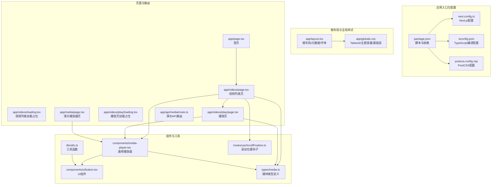
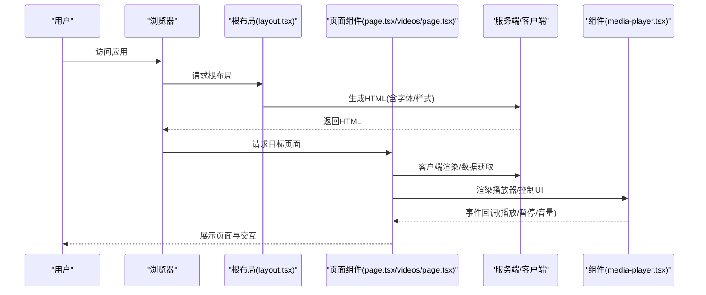
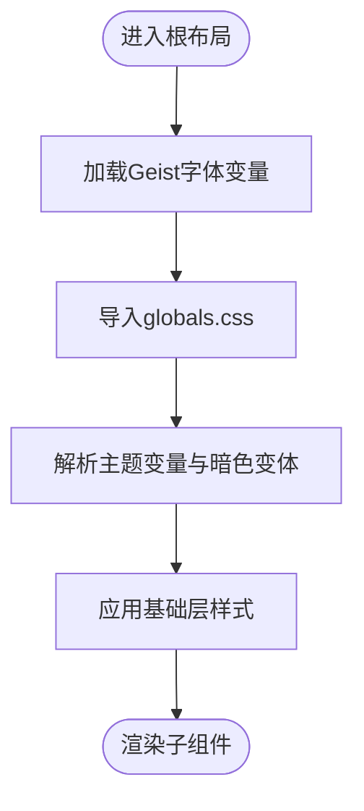
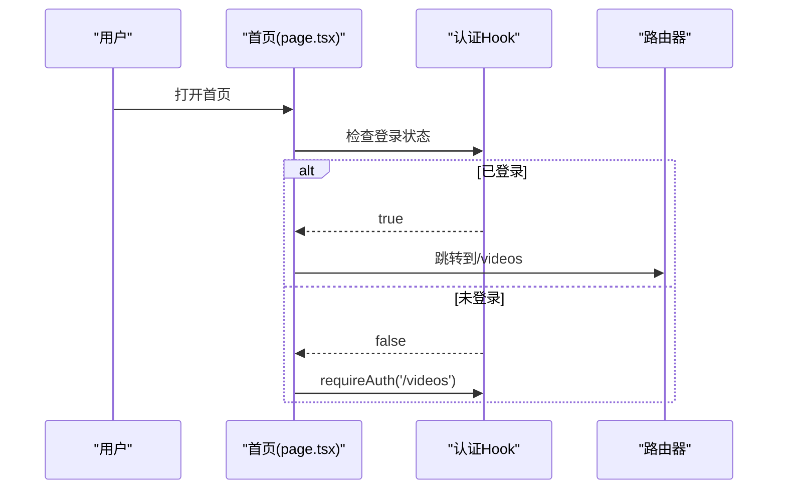
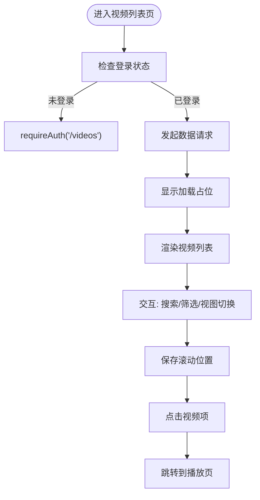
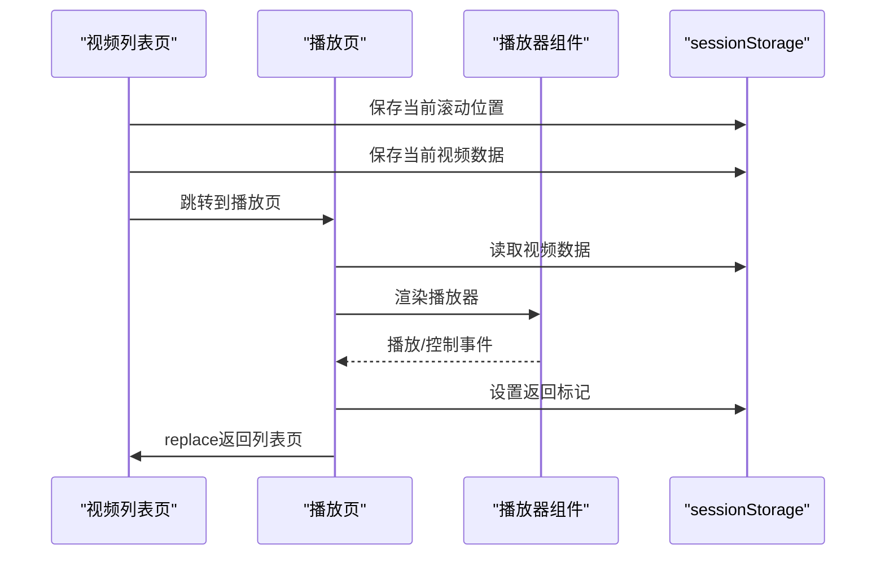
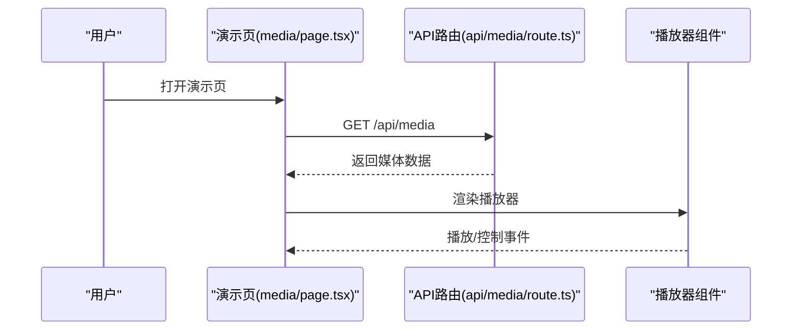
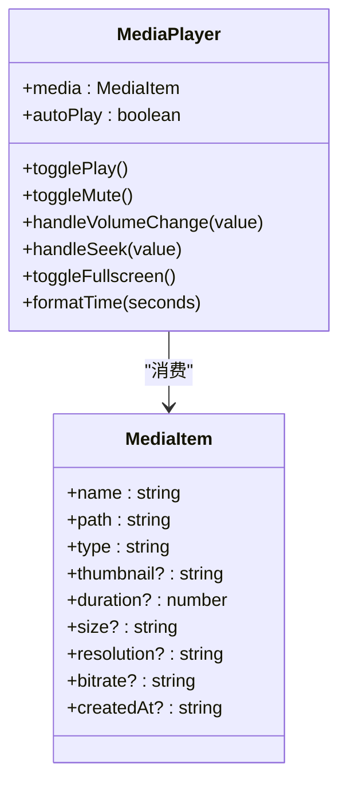
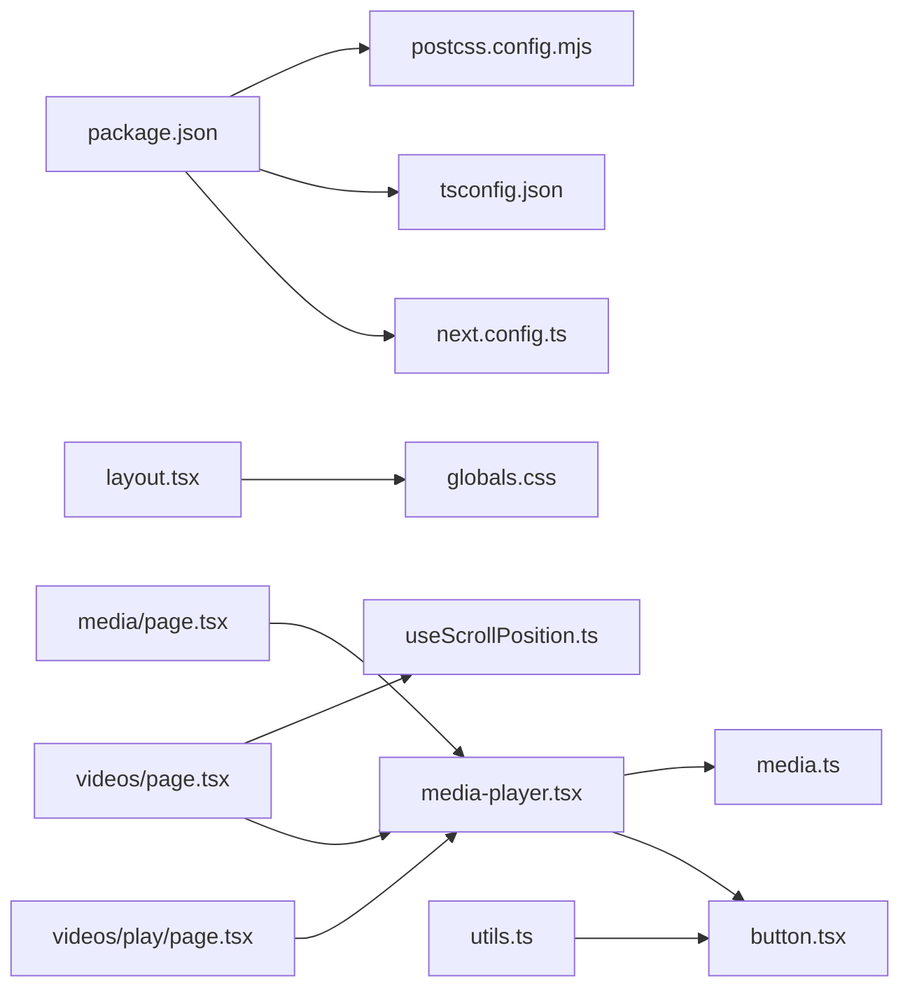

# 应用结构与配置

<cite>
**本文引用的文件**
- [package.json](file://app/web/package.json)
- [next.config.ts](file://app/web/next.config.ts)
- [tsconfig.json](file://app/web/tsconfig.json)
- [layout.tsx](file://app/web/app/layout.tsx)
- [page.tsx（首页）](file://app/web/app/page.tsx)
- [globals.css](file://app/web/app/globals.css)
- [videos/page.tsx](file://app/web/app/videos/page.tsx)
- [videos/loading.tsx](file://app/web/app/videos/loading.tsx)
- [videos/play/page.tsx](file://app/web/app/videos/play/page.tsx)
- [videos/play/loading.tsx](file://app/web/app/videos/play/loading.tsx)
- [media/page.tsx](file://app/web/app/media/page.tsx)
- [api/media/route.ts](file://app/web/app/api/media/route.ts)
- [media-player.tsx](file://app/web/components/media-player.tsx)
- [utils.ts](file://app/web/lib/utils.ts)
- [media.ts（类型定义）](file://app/web/types/media.ts)
- [useScrollPosition.ts](file://app/web/hooks/useScrollPosition.ts)
- [button.tsx](file://app/web/components/ui/button.tsx)
- [postcss.config.mjs](file://app/web/postcss.config.mjs)
</cite>

## 目录
1. [简介](#简介)
2. [项目结构](#项目结构)
3. [核心组件](#核心组件)
4. [架构总览](#架构总览)
5. [详细组件分析](#详细组件分析)
6. [依赖关系分析](#依赖关系分析)
7. [性能考虑](#性能考虑)
8. [故障排查指南](#故障排查指南)
9. [结论](#结论)
10. [附录](#附录)

## 简介
本文件系统性梳理该 Next.js 应用的目录组织原则、页面路由配置与 SSR/CSR 混合架构实现，详解根布局组件设计模式、字体与全局样式的管理方式，并文档化 Next.js 配置项、TypeScript 设置与构建优化策略。同时给出开发与生产环境的配置差异说明，帮助开发者快速理解并扩展该应用。

## 项目结构
应用采用 App Router 的目录组织方式，页面按功能模块划分，静态资源与样式集中管理，组件与类型定义分层清晰。整体结构如下：

图表来源
- [package.json](file://app/web/package.json#L1-L74)
- [next.config.ts](file://app/web/next.config.ts#L1-L39)
- [tsconfig.json](file://app/web/tsconfig.json#L1-L42)
- [postcss.config.mjs](file://app/web/postcss.config.mjs#L1-L6)
- [layout.tsx](file://app/web/app/layout.tsx#L1-L35)
- [globals.css](file://app/web/app/globals.css#L1-L131)
- [page.tsx（首页）](file://app/web/app/page.tsx#L1-L143)
- [videos/page.tsx](file://app/web/app/videos/page.tsx#L1-L267)
- [videos/loading.tsx](file://app/web/app/videos/loading.tsx#L1-L4)
- [videos/play/page.tsx](file://app/web/app/videos/play/page.tsx#L1-L176)
- [videos/play/loading.tsx](file://app/web/app/videos/play/loading.tsx#L1-L31)
- [media/page.tsx](file://app/web/app/media/page.tsx#L1-L147)
- [api/media/route.ts](file://app/web/app/api/media/route.ts#L1-L73)
- [media-player.tsx](file://app/web/components/media-player.tsx#L1-L322)
- [button.tsx](file://app/web/components/ui/button.tsx#L1-L63)
- [utils.ts](file://app/web/lib/utils.ts#L1-L7)
- [useScrollPosition.ts](file://app/web/hooks/useScrollPosition.ts#L1-L28)
- [media.ts（类型定义）](file://app/web/types/media.ts#L1-L20)

章节来源
- [package.json](file://app/web/package.json#L1-L74)
- [next.config.ts](file://app/web/next.config.ts#L1-L39)
- [tsconfig.json](file://app/web/tsconfig.json#L1-L42)
- [postcss.config.mjs](file://app/web/postcss.config.mjs#L1-L6)

## 核心组件
- 根布局与元数据：通过根布局组件统一注入字体变量、全局样式与站点元信息，保证页面一致的视觉与交互基线。
- 字体与主题：使用 Google Fonts 的 Geist Sans/Mono，并通过 CSS 变量与 Tailwind 主题系统实现明暗主题切换。
- 全局样式：基于 Tailwind 与自定义主题变量，覆盖基础元素与组件层级样式，确保一致性与可维护性。
- 页面路由：采用 App Router 的嵌套路由，首页、视频列表、播放页与演示页分别对应不同路径，支持客户端导航与加载占位。
- 播放器组件：根据媒体类型自动选择 HTML5 video/audio 或 HLS.js/Safari 原生 HLS，提供统一的播放控制界面。
- 工具与类型：提供类名合并工具、滚动位置持久化 Hook 与媒体类型定义，提升代码复用与类型安全。

章节来源
- [layout.tsx](file://app/web/app/layout.tsx#L1-L35)
- [globals.css](file://app/web/app/globals.css#L1-L131)
- [page.tsx（首页）](file://app/web/app/page.tsx#L1-L143)
- [videos/page.tsx](file://app/web/app/videos/page.tsx#L1-L267)
- [videos/play/page.tsx](file://app/web/app/videos/play/page.tsx#L1-L176)
- [media-player.tsx](file://app/web/components/media-player.tsx#L1-L322)
- [utils.ts](file://app/web/lib/utils.ts#L1-L7)
- [media.ts（类型定义）](file://app/web/types/media.ts#L1-L20)
- [useScrollPosition.ts](file://app/web/hooks/useScrollPosition.ts#L1-L28)

## 架构总览
应用采用 Next.js App Router 的 SSR/CSR 混合架构：
- 服务端渲染：根布局与页面组件在服务端生成初始 HTML，提升首屏性能与 SEO。
- 客户端交互：通过“use client”指令启用客户端状态与交互逻辑，如路由跳转、滚动恢复、播放器控制等。
- 路由与加载：利用 App Router 的嵌套路由与加载占位组件，提供平滑的过渡体验。
- 数据获取：页面内直接发起 fetch 请求或通过 API 路由返回模拟数据，满足演示与真实场景。

图表来源
- [layout.tsx](file://app/web/app/layout.tsx#L1-L35)
- [page.tsx（首页）](file://app/web/app/page.tsx#L1-L143)
- [videos/page.tsx](file://app/web/app/videos/page.tsx#L1-L267)
- [media-player.tsx](file://app/web/components/media-player.tsx#L1-L322)

## 详细组件分析

### 根布局与全局样式
- 设计模式：根布局负责注入字体变量、全局样式与站点元信息；全局样式通过 Tailwind 与主题变量统一管理，支持明暗主题切换。
- 字体配置：引入 Geist Sans 与 Geist Mono，并通过 CSS 变量暴露给 Tailwind 使用。
- 全局样式：定义主题变量、基础层样式与组件层样式，确保一致的视觉与交互体验。

图表来源
- [layout.tsx](file://app/web/app/layout.tsx#L1-L35)
- [globals.css](file://app/web/app/globals.css#L1-L131)

章节来源
- [layout.tsx](file://app/web/app/layout.tsx#L1-L35)
- [globals.css](file://app/web/app/globals.css#L1-L131)

### 首页与路由守卫
- 首页：展示欢迎信息与功能特性，提供跳转至视频库的入口。
- 路由守卫：通过认证 Hook 实现登录校验，未登录时引导授权并缓存目标路径。

图表来源
- [page.tsx（首页）](file://app/web/app/page.tsx#L1-L143)

章节来源
- [page.tsx（首页）](file://app/web/app/page.tsx#L1-L143)

### 视频列表页（CSR/加载占位/滚动恢复）
- CSR 模式：页面标记“use client”，使用客户端状态管理搜索、筛选、视图模式与视频列表。
- 加载占位：通过 app/videos/loading.tsx 提供骨架屏占位，改善感知性能。
- 滚动恢复：结合 useScrollPosition Hook 与 sessionStorage，在页面间切换时恢复滚动位置，优化移动端体验。
- 授权守卫：进入页面时检查登录状态，未登录则跳转授权。

图表来源
- [videos/page.tsx](file://app/web/app/videos/page.tsx#L1-L267)
- [videos/loading.tsx](file://app/web/app/videos/loading.tsx#L1-L4)
- [useScrollPosition.ts](file://app/web/hooks/useScrollPosition.ts#L1-L28)

章节来源
- [videos/page.tsx](file://app/web/app/videos/page.tsx#L1-L267)
- [videos/loading.tsx](file://app/web/app/videos/loading.tsx#L1-L4)
- [useScrollPosition.ts](file://app/web/hooks/useScrollPosition.ts#L1-L28)

### 播放页（播放器与返回标记）
- 播放器：从 sessionStorage 恢复当前视频数据，进入播放页后设置“返回标记”，离开时清理，确保返回列表页时能正确恢复滚动位置。
- 授权守卫：进入播放页同样进行登录校验。
- 导航：使用 replace 而非 push，避免历史栈膨胀。

图表来源
- [videos/play/page.tsx](file://app/web/app/videos/play/page.tsx#L1-L176)
- [media-player.tsx](file://app/web/components/media-player.tsx#L1-L322)

章节来源
- [videos/play/page.tsx](file://app/web/app/videos/play/page.tsx#L1-L176)
- [media-player.tsx](file://app/web/components/media-player.tsx#L1-L322)

### 演示播放器页与 API 路由
- 演示页：提供 MP4/WebM/HLS/音频等格式的统一播放界面，便于验证播放器能力。
- API 路由：演示从后端获取媒体数据的 API 路由，返回结构化的媒体列表。

图表来源
- [media/page.tsx](file://app/web/app/media/page.tsx#L1-L147)
- [api/media/route.ts](file://app/web/app/api/media/route.ts#L1-L73)
- [media-player.tsx](file://app/web/components/media-player.tsx#L1-L322)

章节来源
- [media/page.tsx](file://app/web/app/media/page.tsx#L1-L147)
- [api/media/route.ts](file://app/web/app/api/media/route.ts#L1-L73)
- [media-player.tsx](file://app/web/components/media-player.tsx#L1-L322)

### 播放器组件（HLS/原生媒体）
- 类型识别：根据 type 自动判断视频/音频/HLS，并选择合适的播放方案。
- HLS 支持：优先动态加载 HLS.js，若不支持则回退到 Safari 原生 HLS。
- 控制界面：统一提供播放/暂停、音量、进度条、全屏与下载等控制。

图表来源
- [media-player.tsx](file://app/web/components/media-player.tsx#L1-L322)
- [media.ts（类型定义）](file://app/web/types/media.ts#L1-L20)

章节来源
- [media-player.tsx](file://app/web/components/media-player.tsx#L1-L322)
- [media.ts（类型定义）](file://app/web/types/media.ts#L1-L20)

## 依赖关系分析
- 依赖管理：通过 package.json 管理 Next.js、React、UI 组件库、Tailwind 与 HLS 播放器等依赖。
- TypeScript：严格模式、增量编译、路径别名与 bundler 解析，配合 Next 插件提升开发体验。
- PostCSS/Tailwind：PostCSS 配置启用 Tailwind 插件，全局样式通过 globals.css 引入并使用主题变量。
- Next 配置：图片远程域名白名单、可选的 CORS 头部配置占位。

图表来源
- [package.json](file://app/web/package.json#L1-L74)
- [next.config.ts](file://app/web/next.config.ts#L1-L39)
- [tsconfig.json](file://app/web/tsconfig.json#L1-L42)
- [postcss.config.mjs](file://app/web/postcss.config.mjs#L1-L6)
- [layout.tsx](file://app/web/app/layout.tsx#L1-L35)
- [globals.css](file://app/web/app/globals.css#L1-L131)
- [videos/page.tsx](file://app/web/app/videos/page.tsx#L1-L267)
- [videos/play/page.tsx](file://app/web/app/videos/play/page.tsx#L1-L176)
- [media/page.tsx](file://app/web/app/media/page.tsx#L1-L147)
- [media-player.tsx](file://app/web/components/media-player.tsx#L1-L322)
- [button.tsx](file://app/web/components/ui/button.tsx#L1-L63)
- [useScrollPosition.ts](file://app/web/hooks/useScrollPosition.ts#L1-L28)
- [media.ts（类型定义）](file://app/web/types/media.ts#L1-L20)
- [utils.ts](file://app/web/lib/utils.ts#L1-L7)

章节来源
- [package.json](file://app/web/package.json#L1-L74)
- [next.config.ts](file://app/web/next.config.ts#L1-L39)
- [tsconfig.json](file://app/web/tsconfig.json#L1-L42)
- [postcss.config.mjs](file://app/web/postcss.config.mjs#L1-L6)

## 性能考虑
- 首屏与感知性能：根布局与页面组件服务端渲染，减少客户端计算；加载占位组件缩短感知等待。
- 客户端优化：使用“use client”仅在必要页面启用，避免不必要的客户端包体积。
- 图片与远程资源：通过 Next 配置的远程图片模式限制资源来源，提升安全性与缓存命中。
- 样式与主题：统一的主题变量与 Tailwind 类名减少重复样式，提高渲染效率。
- 播放器优化：HLS 动态加载与原生回退策略降低首包体积；播放器控制 UI 采用轻量组件。

## 故障排查指南
- 字体与样式异常
  - 检查根布局是否正确引入字体变量与全局样式。
  - 确认 globals.css 中主题变量与暗色变体定义完整。
- 播放器无法播放
  - 确认媒体类型与路径映射正确；HLS 场景检查动态加载是否成功或浏览器原生支持。
  - 检查播放器组件的类型识别逻辑与 URL 清洗。
- 路由与授权问题
  - 首页与视频页均存在授权守卫，确认认证 Hook 的行为与路由跳转逻辑。
- 滚动位置丢失
  - 确认 sessionStorage 的键值一致；移动端返回时需设置“返回标记”并在离开时清理。
- 开发与生产差异
  - 开发环境使用本地端口启动；生产环境通过构建与启动命令运行，注意环境变量与远程资源访问策略。

章节来源
- [layout.tsx](file://app/web/app/layout.tsx#L1-L35)
- [globals.css](file://app/web/app/globals.css#L1-L131)
- [media-player.tsx](file://app/web/components/media-player.tsx#L1-L322)
- [videos/page.tsx](file://app/web/app/videos/page.tsx#L1-L267)
- [videos/play/page.tsx](file://app/web/app/videos/play/page.tsx#L1-L176)
- [useScrollPosition.ts](file://app/web/hooks/useScrollPosition.ts#L1-L28)

## 结论
该应用遵循 Next.js App Router 的现代目录组织与路由模型，结合根布局与全局样式实现一致的视觉与交互体验。通过“use client”与服务端渲染的混合架构，兼顾首屏性能与交互灵活性。播放器组件针对多格式媒体提供统一控制界面，配合加载占位与滚动恢复优化用户体验。TypeScript 与 Tailwind 配置确保了开发效率与样式一致性。建议在生产环境中进一步完善 CORS 与远程资源访问策略，并持续优化播放器与网络请求的错误处理与监控。

## 附录
- 开发环境
  - 启动命令：使用开发脚本在指定端口启动 Next.js 开发服务器。
  - TypeScript：启用严格模式与增量编译，路径别名与 bundler 解析提升开发体验。
  - PostCSS：启用 Tailwind 插件，全局样式通过 globals.css 引入。
- 生产环境
  - 构建与启动：先执行构建，再启动生产服务器。
  - 配置建议：根据实际部署环境完善远程图片与 CORS 头部配置，确保资源访问安全与稳定。

章节来源
- [package.json](file://app/web/package.json#L1-L74)
- [tsconfig.json](file://app/web/tsconfig.json#L1-L42)
- [postcss.config.mjs](file://app/web/postcss.config.mjs#L1-L6)
- [next.config.ts](file://app/web/next.config.ts#L1-L39)