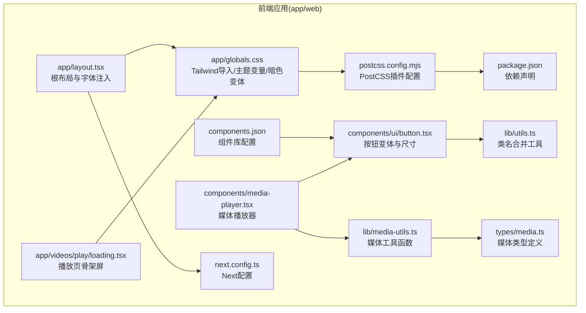
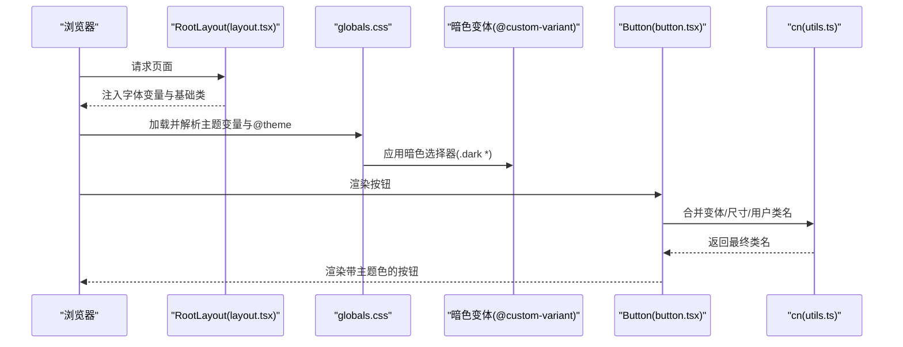
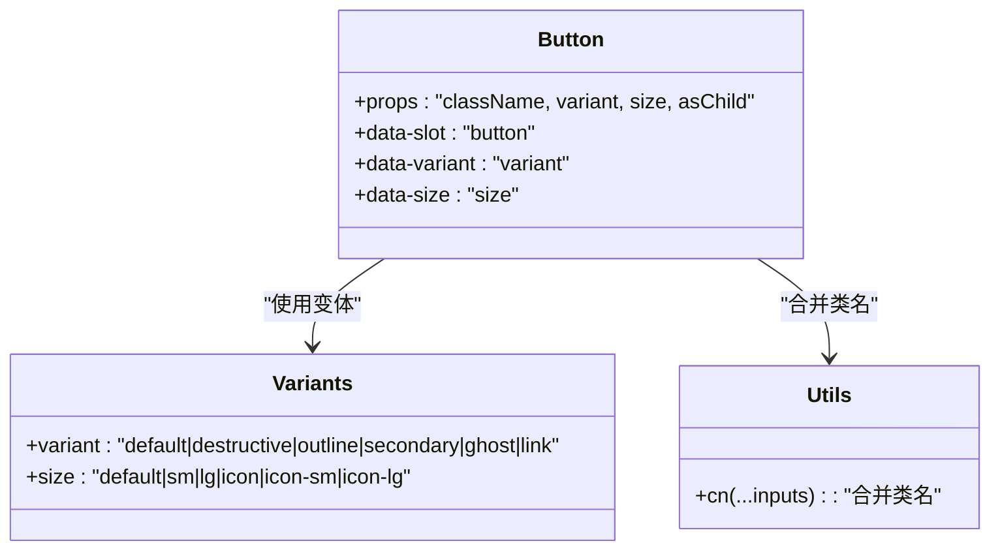
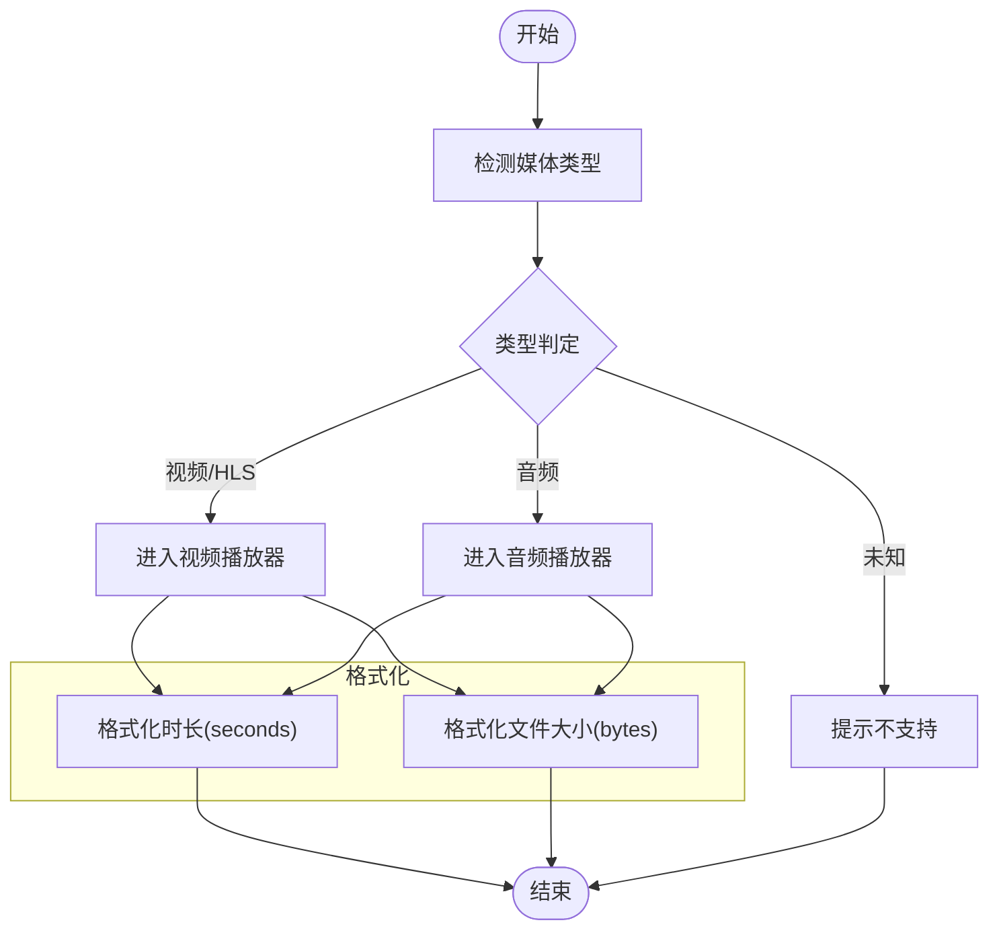
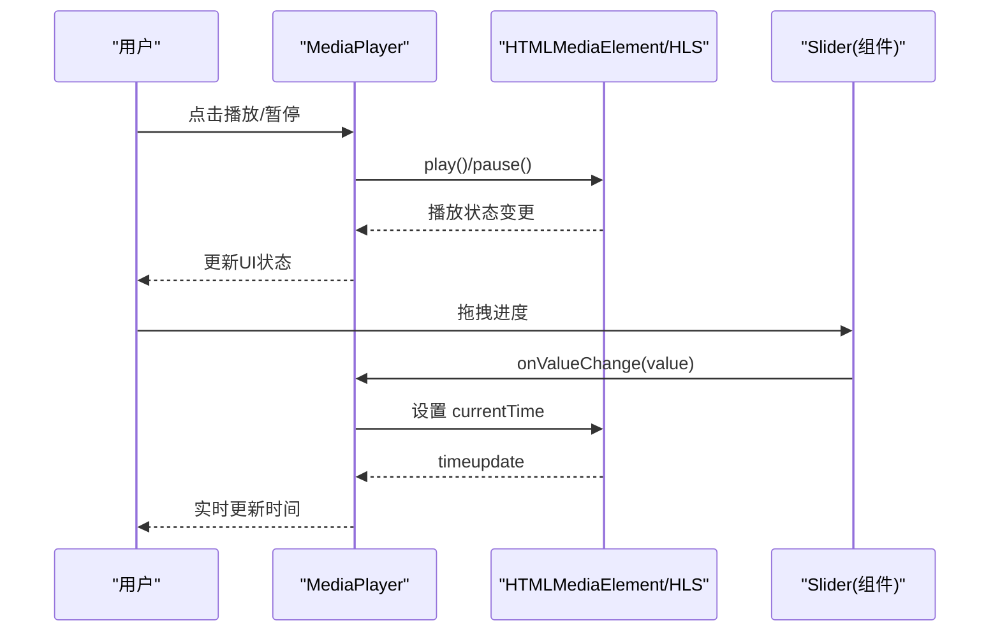
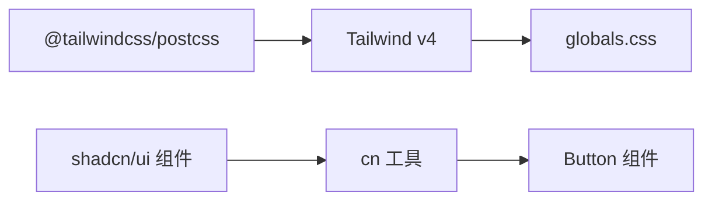

# 样式与主题

<cite>
**本文引用的文件**
- [app/web/app/globals.css](file://app/web/app/globals.css)
- [app/web/app/layout.tsx](file://app/web/app/layout.tsx)
- [app/web/components.json](file://app/web/components.json)
- [app/web/postcss.config.mjs](file://app/web/postcss.config.mjs)
- [app/web/package.json](file://app/web/package.json)
- [app/web/lib/utils.ts](file://app/web/lib/utils.ts)
- [app/web/components/ui/button.tsx](file://app/web/components/ui/button.tsx)
- [app/web/components/media-player.tsx](file://app/web/components/media-player.tsx)
- [app/web/lib/media-utils.ts](file://app/web/lib/media-utils.ts)
- [app/web/types/media.ts](file://app/web/types/media.ts)
- [app/web/app/videos/play/loading.tsx](file://app/web/app/videos/play/loading.tsx)
- [app/web/next.config.ts](file://app/web/next.config.ts)
- [app/server/static/style.css](file://app/server/static/style.css)
</cite>

## 目录
1. [引言](#引言)
2. [项目结构](#项目结构)
3. [核心组件](#核心组件)
4. [架构总览](#架构总览)
5. [详细组件分析](#详细组件分析)
6. [依赖关系分析](#依赖关系分析)
7. [性能考虑](#性能考虑)
8. [故障排查指南](#故障排查指南)
9. [结论](#结论)
10. [附录](#附录)

## 引言
本文件系统化梳理本仓库的样式与主题体系，覆盖 Tailwind CSS 的配置与使用、Geist 字体的集成与变量字体应用、品牌色彩系统与暗色模式、媒体工具函数的实现与优化建议，以及样式最佳实践。文档以“渐进复杂度”呈现，既适合初学者快速上手，也为资深开发者提供深入的技术细节与可视化图示。

## 项目结构
样式与主题相关的核心文件集中在 Web 前端层，采用 Next.js + Tailwind CSS + PostCSS 的现代工作流，并通过 shadcn/ui 组件风格与工具函数进行统一治理。

图表来源
- [app/web/app/layout.tsx](file://app/web/app/layout.tsx#L1-L34)
- [app/web/app/globals.css](file://app/web/app/globals.css#L1-L131)
- [app/web/postcss.config.mjs](file://app/web/postcss.config.mjs#L1-L6)
- [app/web/package.json](file://app/web/package.json#L1-L74)
- [app/web/components.json](file://app/web/components.json#L1-L23)
- [app/web/lib/utils.ts](file://app/web/lib/utils.ts#L1-L7)
- [app/web/components/ui/button.tsx](file://app/web/components/ui/button.tsx#L1-L63)
- [app/web/components/media-player.tsx](file://app/web/components/media-player.tsx#L1-L322)
- [app/web/lib/media-utils.ts](file://app/web/lib/media-utils.ts#L1-L43)
- [app/web/types/media.ts](file://app/web/types/media.ts#L1-L20)
- [app/web/app/videos/play/loading.tsx](file://app/web/app/videos/play/loading.tsx#L1-L30)
- [app/web/next.config.ts](file://app/web/next.config.ts#L1-L39)

章节来源
- [app/web/app/layout.tsx](file://app/web/app/layout.tsx#L1-L34)
- [app/web/app/globals.css](file://app/web/app/globals.css#L1-L131)
- [app/web/postcss.config.mjs](file://app/web/postcss.config.mjs#L1-L6)
- [app/web/package.json](file://app/web/package.json#L1-L74)
- [app/web/components.json](file://app/web/components.json#L1-L23)

## 核心组件
- 主题与色彩系统：通过 CSS 变量与 @theme 定义品牌色板与明暗两套调色，配合暗色变体选择器实现暗色模式。
- 字体系统：使用 next/font/google 注入 Geist 与 Geist Mono 变量字体，全局启用抗锯齿。
- 组件风格：基于 shadcn/ui 的风格配置，使用 class-variance-authority 管理按钮变体与尺寸。
- 工具函数：统一类名合并与媒体格式/尺寸转换工具。
- 构建链路：Tailwind v4 + PostCSS 插件，按需生成样式。

章节来源
- [app/web/app/globals.css](file://app/web/app/globals.css#L1-L131)
- [app/web/app/layout.tsx](file://app/web/app/layout.tsx#L1-L34)
- [app/web/components.json](file://app/web/components.json#L1-L23)
- [app/web/components/ui/button.tsx](file://app/web/components/ui/button.tsx#L1-L63)
- [app/web/lib/utils.ts](file://app/web/lib/utils.ts#L1-L7)

## 架构总览
下图展示样式系统在运行时的关键交互：根布局注入字体变量，全局 CSS 定义主题变量与暗色变体，组件通过变体工具与工具函数组合出一致的视觉与行为。

图表来源
- [app/web/app/layout.tsx](file://app/web/app/layout.tsx#L1-L34)
- [app/web/app/globals.css](file://app/web/app/globals.css#L1-L131)
- [app/web/components/ui/button.tsx](file://app/web/components/ui/button.tsx#L1-L63)
- [app/web/lib/utils.ts](file://app/web/lib/utils.ts#L1-L7)

## 详细组件分析

### Tailwind CSS 配置与使用
- 导入与变体
  - 在全局 CSS 中导入 Tailwind 与动画插件，并定义暗色变体选择器，使主题变量在 .dark 上下文生效。
- @theme 与 CSS 变量映射
  - 通过 @theme inline 将 oklch 色彩变量映射到 Tailwind 颜色通道，统一品牌色与语义色。
- 基础层与重置
  - 在 base 层对边框、轮廓、背景与前景色进行统一应用，保证默认一致性。
- 响应式断点
  - 本项目未显式自定义断点；Tailwind 默认断点满足移动端优先策略。如需扩展，可在 tailwind.config 中添加自定义断点并同步更新组件断点类。

章节来源
- [app/web/app/globals.css](file://app/web/app/globals.css#L1-L131)
- [app/web/postcss.config.mjs](file://app/web/postcss.config.mjs#L1-L6)

### Geist 字体集成与变量字体
- 字体注入
  - 根布局使用 next/font/google 动态注入 Geist Sans 与 Geist Mono，并暴露变量 CSS 变量供全局使用。
- 变量字体优势
  - 通过变量命名与字体族设置，实现字号、字重等的细粒度控制，提升排版灵活性与可维护性。
- 抗锯齿与可读性
  - 在根 body 上应用抗锯齿类，改善文本渲染质量。

章节来源
- [app/web/app/layout.tsx](file://app/web/app/layout.tsx#L1-L34)
- [app/web/app/globals.css](file://app/web/app/globals.css#L77-L116)

### 主题切换机制与暗色模式
- 暗色变体
  - 自定义暗色变体选择器，作用于 .dark 容器，使所有基于主题变量的颜色在暗色模式下自动切换。
- 组件适配
  - 按钮等组件在暗色模式下通过变体类与主题变量实现高对比度与可读性。
- 与第三方库的协同
  - 项目依赖 next-themes，可用于在客户端层面切换 .dark 类，从而驱动暗色模式。该能力未在当前代码中直接体现，但可作为后续增强点。

章节来源
- [app/web/app/globals.css](file://app/web/app/globals.css#L4-L7)
- [app/web/components/ui/button.tsx](file://app/web/components/ui/button.tsx#L1-L63)
- [app/web/package.json](file://app/web/package.json#L1-L74)

### 品牌色彩系统
- oklch 色彩模型
  - 使用 oklch 表达亮度、色度与色相，便于在明暗模式间平滑过渡与一致性调整。
- 色板映射
  - 通过 @theme 将品牌主色、辅助色、强调色、破坏性颜色、边框与输入色等映射为 Tailwind 可用的颜色通道。
- 圆角半径
  - 定义多级圆角变量，配合组件尺寸形成统一的视觉节奏。

章节来源
- [app/web/app/globals.css](file://app/web/app/globals.css#L6-L116)

### UI 组件与变体系统
- 按钮组件
  - 使用 class-variance-authority 定义变体与尺寸，结合 cn 工具进行类名合并，确保在不同模式下的视觉一致性。
- 组件别名与风格
  - 通过 components.json 指定组件风格为 “new-york”，并启用 CSS 变量，保证与主题系统无缝衔接。

图表来源
- [app/web/components/ui/button.tsx](file://app/web/components/ui/button.tsx#L1-L63)
- [app/web/lib/utils.ts](file://app/web/lib/utils.ts#L1-L7)
- [app/web/components.json](file://app/web/components.json#L1-L23)

章节来源
- [app/web/components/ui/button.tsx](file://app/web/components/ui/button.tsx#L1-L63)
- [app/web/lib/utils.ts](file://app/web/lib/utils.ts#L1-L7)
- [app/web/components.json](file://app/web/components.json#L1-L23)

### 媒体工具函数与尺寸计算
- 媒体类型识别
  - 依据 MIME 或扩展名判断媒体类型（视频、音频、HLS），用于播放器与下载逻辑。
- 时间格式化
  - 将秒数格式化为 mm:ss 或 hh:mm:ss，提升可读性。
- 文件大小格式化
  - 将字节数转换为 B/KB/MB/GB，保留一位小数，便于显示。
- 路径规范化
  - 统一路径分隔符与前缀，保证前端 URL 正确拼接。

图表来源
- [app/web/lib/media-utils.ts](file://app/web/lib/media-utils.ts#L1-L43)
- [app/web/types/media.ts](file://app/web/types/media.ts#L1-L20)

章节来源
- [app/web/lib/media-utils.ts](file://app/web/lib/media-utils.ts#L1-L43)
- [app/web/types/media.ts](file://app/web/types/media.ts#L1-L20)

### 媒体播放器组件
- 播放能力
  - 支持 HTML5 视频/音频与 HLS（含 hls.js 与 Safari 原生）。
- 控制面板
  - 提供播放/暂停、静音/取消静音、音量调节、进度拖拽、全屏切换与下载入口。
- 视觉与交互
  - 悬停显示控制栏，使用品牌色与语义色构建一致的控件风格。

图表来源
- [app/web/components/media-player.tsx](file://app/web/components/media-player.tsx#L1-L322)
- [app/web/components/ui/button.tsx](file://app/web/components/ui/button.tsx#L1-L63)

章节来源
- [app/web/components/media-player.tsx](file://app/web/components/media-player.tsx#L1-L322)

### 骨架屏与加载态
- 播放页骨架屏
  - 使用占位色与动画类实现轻量加载反馈，避免白屏与闪烁。
- 品牌色与语义色
  - 通过 muted/background 等语义色构建层次清晰的加载界面。

章节来源
- [app/web/app/videos/play/loading.tsx](file://app/web/app/videos/play/loading.tsx#L1-L30)
- [app/web/app/globals.css](file://app/web/app/globals.css#L118-L131)

## 依赖关系分析
- 构建链路
  - PostCSS 通过 @tailwindcss/postcss 插件接入 Tailwind v4，负责样式编译与输出。
- 组件风格
  - shadcn/ui 风格由 components.json 统一配置，确保组件风格与主题变量一致。
- 工具函数
  - cn 工具基于 clsx 与 tailwind-merge，避免重复与冲突类名，提升样式稳定性。

图表来源
- [app/web/postcss.config.mjs](file://app/web/postcss.config.mjs#L1-L6)
- [app/web/package.json](file://app/web/package.json#L1-L74)
- [app/web/components.json](file://app/web/components.json#L1-L23)
- [app/web/lib/utils.ts](file://app/web/lib/utils.ts#L1-L7)

章节来源
- [app/web/postcss.config.mjs](file://app/web/postcss.config.mjs#L1-L6)
- [app/web/package.json](file://app/web/package.json#L1-L74)
- [app/web/components.json](file://app/web/components.json#L1-L23)
- [app/web/lib/utils.ts](file://app/web/lib/utils.ts#L1-L7)

## 性能考虑
- 按需引入与最小化
  - 仅在需要时引入动画与插件，避免无用样式体积增长。
- 变量字体与缓存
  - 字体变量由 next/font 提供，建议结合 CDN 与缓存策略提升首屏渲染。
- 组件类名合并
  - 使用 cn 工具减少重复与冲突类名，降低样式层叠复杂度。
- 媒体资源优化
  - 播放器按需加载 HLS.js，避免不必要的脚本体积。
- 响应式策略
  - 优先使用 Tailwind 默认断点，必要时再扩展自定义断点，避免过度碎片化。

## 故障排查指南
- 暗色模式无效
  - 确认根元素是否包含 .dark 类；检查 @custom-variant 是否正确应用；确认主题变量在 .dark 上下文中被覆盖。
- 字体未生效
  - 检查根布局是否注入字体变量；确认字体变量名称与全局 CSS 中的映射一致。
- 按钮样式异常
  - 检查变体与尺寸参数是否匹配；确认 cn 工具是否正确合并类名。
- 媒体播放问题
  - 确认媒体类型识别是否正确；HLS 模式下检查 hls.js 是否成功加载；Safari 原生 HLS 需要特定 MIME 类型。
- 构建报错
  - 检查 PostCSS 插件是否安装；确认 Tailwind 版本与插件兼容。

章节来源
- [app/web/app/globals.css](file://app/web/app/globals.css#L1-L131)
- [app/web/app/layout.tsx](file://app/web/app/layout.tsx#L1-L34)
- [app/web/components/ui/button.tsx](file://app/web/components/ui/button.tsx#L1-L63)
- [app/web/components/media-player.tsx](file://app/web/components/media-player.tsx#L1-L322)
- [app/web/postcss.config.mjs](file://app/web/postcss.config.mjs#L1-L6)

## 结论
本项目以 Tailwind v4 为核心，结合 @theme 与 oklch 色彩模型，构建了统一的品牌色彩系统与暗色模式支持；通过 next/font/google 与变量字体提升排版一致性；借助 class-variance-authority 与 cn 工具实现组件风格与类名管理的最佳实践。媒体工具函数与播放器组件则提供了完整的媒体处理与交互体验。建议后续结合 next-themes 实现客户端主题切换，并在需要时扩展自定义断点与主题变量，持续优化性能与可维护性。

## 附录
- 旧版静态样式
  - 服务端静态页面仍使用传统 CSS，建议逐步迁移至前端主题系统，保持风格一致。
  
章节来源
- [app/server/static/style.css](file://app/server/static/style.css#L1-L72)