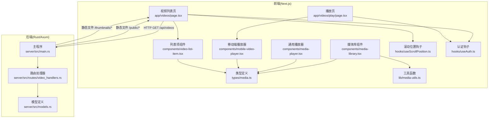
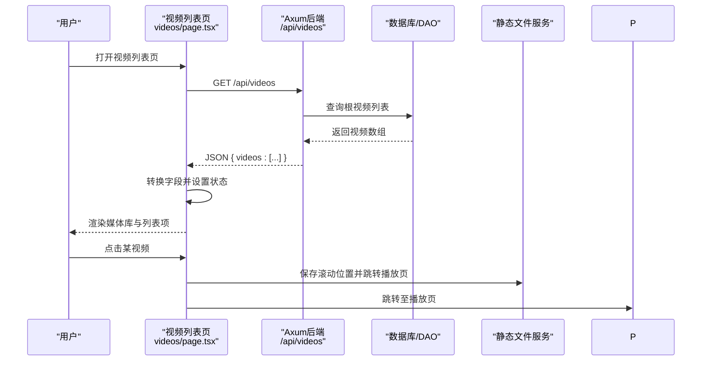
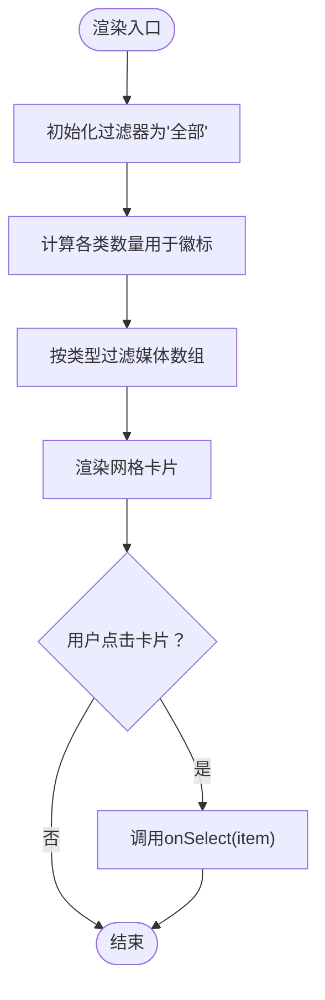
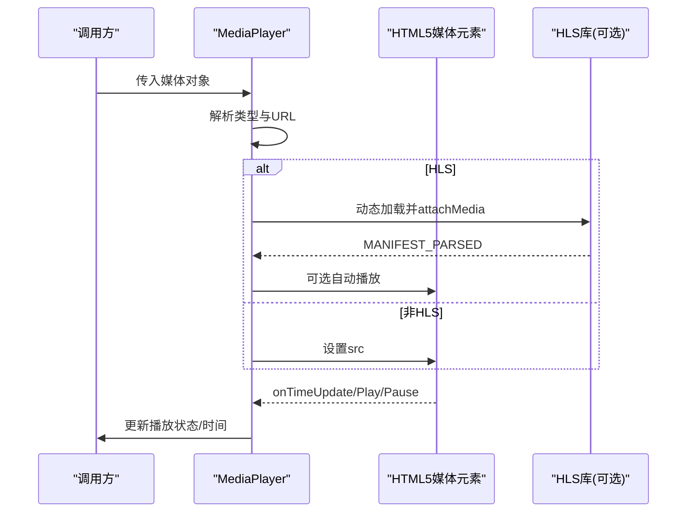
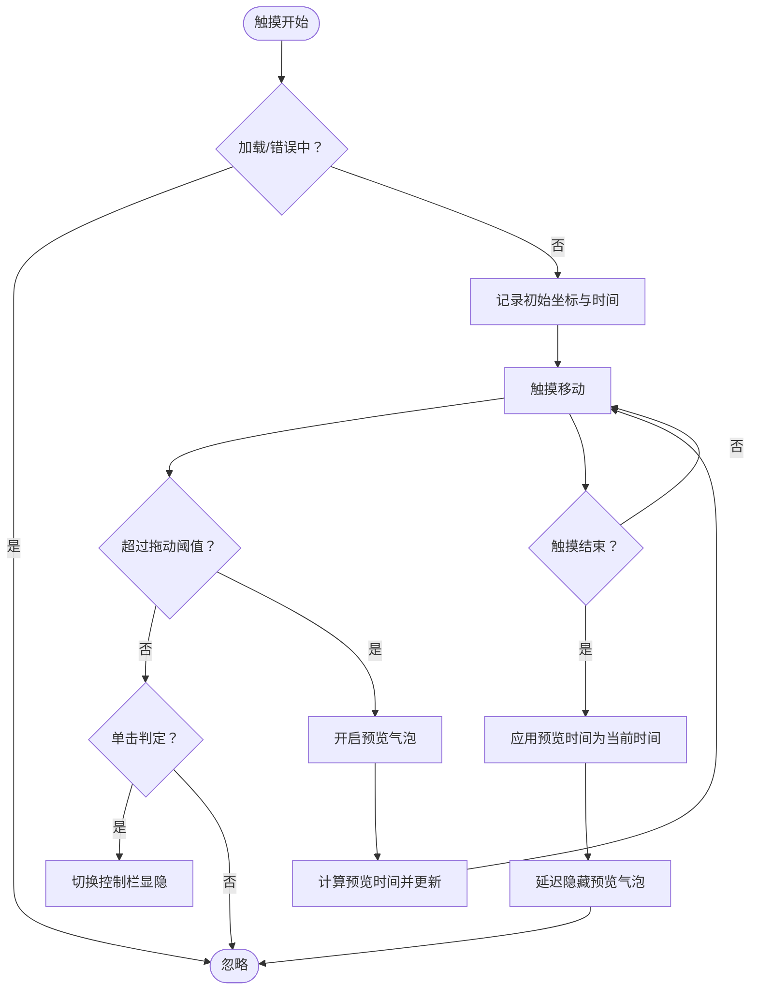
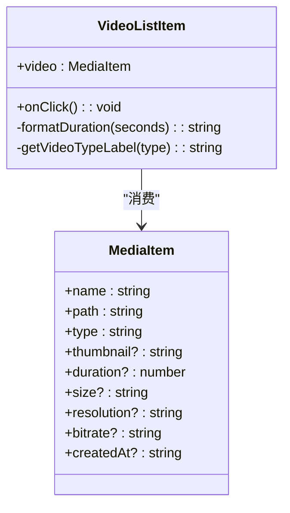
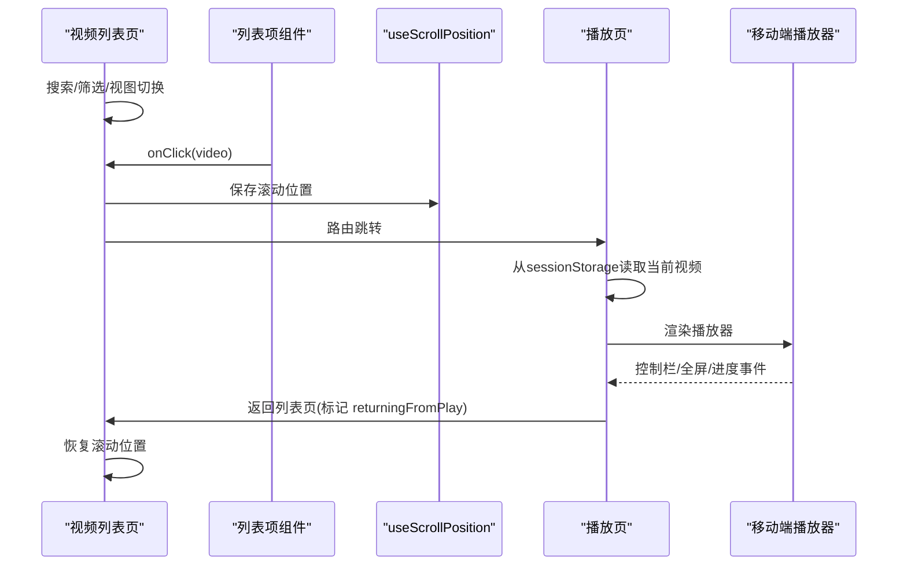
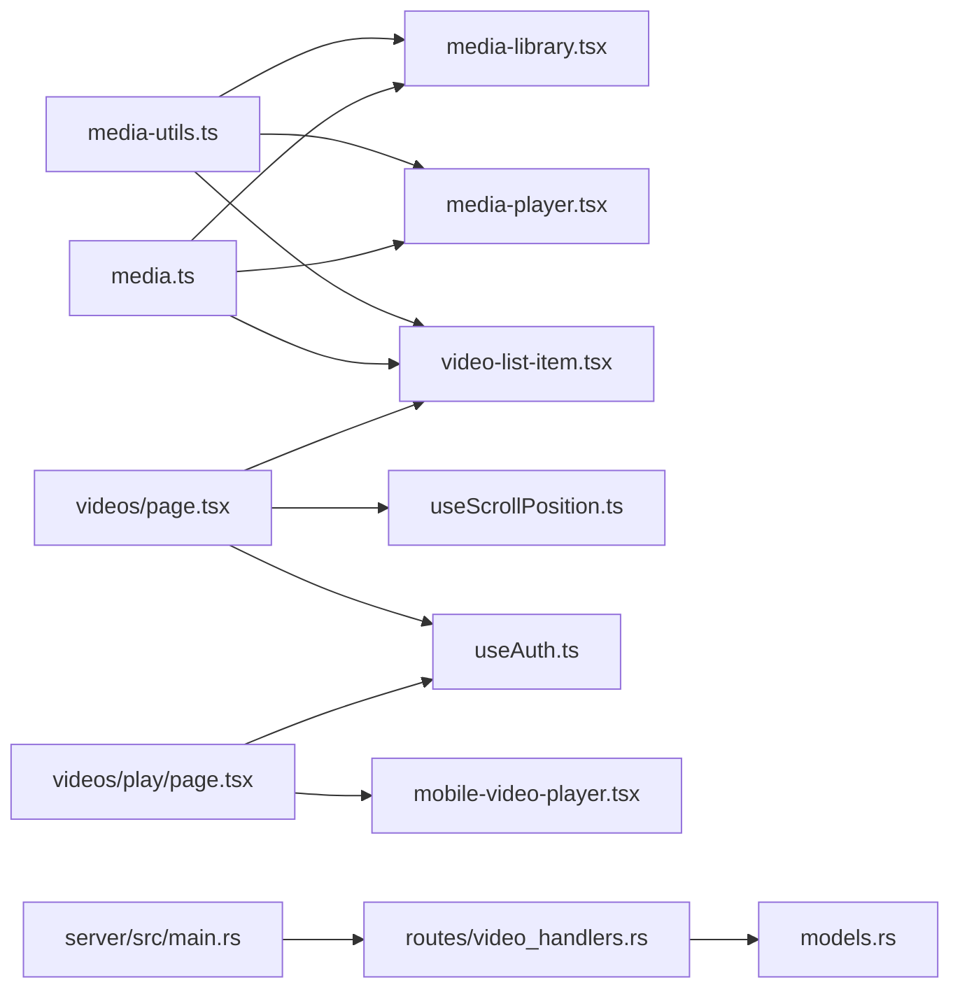

# 核心组件设计

<cite>
**本文引用的文件**
- [media-library.tsx](file://app/web/components/media-library.tsx)
- [media-player.tsx](file://app/web/components/media-player.tsx)
- [mobile-video-player.tsx](file://app/web/components/mobile-video-player.tsx)
- [video-list-item.tsx](file://app/web/components/video-list-item.tsx)
- [videos-page.tsx](file://app/web/app/videos/page.tsx)
- [play-page.tsx](file://app/web/app/videos/play/page.tsx)
- [media.ts](file://app/web/types/media.ts)
- [media-utils.ts](file://app/web/lib/media-utils.ts)
- [useScrollPosition.ts](file://app/web/hooks/useScrollPosition.ts)
- [useAuth.ts](file://app/web/hooks/useAuth.ts)
- [main.rs](file://app/server/src/main.rs)
- [models.rs](file://app/server/src/models.rs)
- [video_handlers.rs](file://app/server/src/routes/video_handlers.rs)
</cite>

## 目录
1. [引言](#引言)
2. [项目结构](#项目结构)
3. [核心组件](#核心组件)
4. [架构总览](#架构总览)
5. [组件详细分析](#组件详细分析)
6. [依赖关系分析](#依赖关系分析)
7. [性能考量](#性能考量)
8. [故障排查指南](#故障排查指南)
9. [结论](#结论)

## 引言
本文件聚焦于视频媒体库前端与后端的核心组件设计，系统阐述以下方面：
- 媒体库组件的实现架构：视频列表渲染、搜索过滤与排序。
- 视频播放器组件的设计模式：播放控制、进度管理、全屏切换。
- 移动端适配的播放器实现：触摸手势支持、进度拖动、预览气泡、响应式布局。
- 视频列表项组件的状态管理与用户交互处理。
- 组件间的通信模式与数据流管理。

该设计以“类型驱动”和“状态最小化”为核心原则，结合前端 Next.js 组件与后端 Rust/Axum 服务，形成前后端协同的媒体播放体验。

## 项目结构
整体采用“前端 Next.js + 后端 Rust/Axum”的双栈架构：
- 前端负责页面与组件（媒体库、播放器、列表项、播放页、授权与滚动位置钩子、工具函数与类型定义）。
- 后端提供媒体资源与元数据服务，通过 REST API 返回视频列表与详情，同时提供静态文件服务。

图表来源
- [videos-page.tsx](file://app/web/app/videos/page.tsx#L1-L267)
- [play-page.tsx](file://app/web/app/videos/play/page.tsx#L1-L176)
- [media-library.tsx](file://app/web/components/media-library.tsx#L1-L120)
- [media-player.tsx](file://app/web/components/media-player.tsx#L1-L322)
- [mobile-video-player.tsx](file://app/web/components/mobile-video-player.tsx#L1-L479)
- [video-list-item.tsx](file://app/web/components/video-list-item.tsx#L1-L93)
- [media.ts](file://app/web/types/media.ts#L1-L20)
- [media-utils.ts](file://app/web/lib/media-utils.ts#L1-L43)
- [useScrollPosition.ts](file://app/web/hooks/useScrollPosition.ts#L1-L28)
- [useAuth.ts](file://app/web/hooks/useAuth.ts#L1-L61)
- [main.rs](file://app/server/src/main.rs#L1-L111)
- [models.rs](file://app/server/src/models.rs#L1-L32)
- [video_handlers.rs](file://app/server/src/routes/video_handlers.rs#L1-L104)

章节来源
- [videos-page.tsx](file://app/web/app/videos/page.tsx#L1-L267)
- [play-page.tsx](file://app/web/app/videos/play/page.tsx#L1-L176)
- [media-library.tsx](file://app/web/components/media-library.tsx#L1-L120)
- [media-player.tsx](file://app/web/components/media-player.tsx#L1-L322)
- [mobile-video-player.tsx](file://app/web/components/mobile-video-player.tsx#L1-L479)
- [video-list-item.tsx](file://app/web/components/video-list-item.tsx#L1-L93)
- [media.ts](file://app/web/types/media.ts#L1-L20)
- [media-utils.ts](file://app/web/lib/media-utils.ts#L1-L43)
- [useScrollPosition.ts](file://app/web/hooks/useScrollPosition.ts#L1-L28)
- [useAuth.ts](file://app/web/hooks/useAuth.ts#L1-L61)
- [main.rs](file://app/server/src/main.rs#L1-L111)
- [models.rs](file://app/server/src/models.rs#L1-L32)
- [video_handlers.rs](file://app/server/src/routes/video_handlers.rs#L1-L104)

## 核心组件
本节从“职责单一、可组合、类型安全”的角度，梳理各核心组件的职责边界与协作方式。

- 媒体库组件（MediaLibrary）
  - 职责：接收媒体列表，提供按类型过滤、网格/卡片渲染、选中态高亮与点击回调。
  - 关键点：基于类型推导进行图标与颜色映射；过滤逻辑在渲染前完成；选中态通过外部传入的选中项进行高亮。
  - 数据来源：来自父组件传递的媒体数组与回调函数。
  - 复杂度：过滤 O(n)，渲染 O(n)。

- 视频播放器组件（MediaPlayer）
  - 职责：根据媒体类型自动选择视频或音频播放器，提供播放/暂停、音量、进度、全屏与下载能力。
  - 关键点：HLS 流媒体通过动态加载库或原生 Safari 支持；进度与音量使用受控组件；时间格式化统一。
  - 数据来源：外部传入的媒体对象（含类型、路径、可选缩略图、时长、大小）。

- 移动端播放器组件（MobileVideoPlayer）
  - 职责：移动端专用播放器，支持触摸手势（单击切换控制栏、拖动调整进度、进度预览气泡）、全屏、错误与加载状态。
  - 关键点：手势识别通过 touchstart/move/end 计算位移与时间差；拖动进度时显示预览气泡；自动隐藏控制栏定时器。
  - 数据来源：外部传入的媒体对象（含缩略图、时长、类型）。

- 视频列表项组件（VideoListItem）
  - 职责：展示单个视频的缩略图、名称、时长、分辨率、大小、比特率、创建时间等元信息。
  - 关键点：悬停效果与覆盖层；格式标签与时长标签的悬浮动画；缩略图缺失时的占位。
  - 数据来源：外部传入的媒体对象与点击回调。

- 类型与工具
  - 类型定义（MediaItem）：统一媒体对象字段，便于跨组件传递与校验。
  - 工具函数（getMediaType、formatFileSize、normalizeMediaPath）：类型识别、尺寸格式化、路径规范化。

章节来源
- [media-library.tsx](file://app/web/components/media-library.tsx#L1-L120)
- [media-player.tsx](file://app/web/components/media-player.tsx#L1-L322)
- [mobile-video-player.tsx](file://app/web/components/mobile-video-player.tsx#L1-L479)
- [video-list-item.tsx](file://app/web/components/video-list-item.tsx#L1-L93)
- [media.ts](file://app/web/types/media.ts#L1-L20)
- [media-utils.ts](file://app/web/lib/media-utils.ts#L1-L43)

## 架构总览
前端与后端通过 REST API 协作：
- 前端视频列表页向后端请求视频列表，解析后传递给媒体库组件与列表项组件。
- 播放页从 sessionStorage 读取当前视频，渲染移动端播放器。
- 后端提供：
  - 视频列表接口：返回视频根目录的媒体集合。
  - 视频详情接口：支持目录与 m3u8 的子项查询。
  - 静态文件服务：/public 与 /thumbnails 目录对外暴露。

图表来源
- [videos-page.tsx](file://app/web/app/videos/page.tsx#L1-L267)
- [main.rs](file://app/server/src/main.rs#L72-L90)
- [video_handlers.rs](file://app/server/src/routes/video_handlers.rs#L14-L28)
- [models.rs](file://app/server/src/models.rs#L1-L32)

## 组件详细分析

### 媒体库组件（MediaLibrary）
- 设计要点
  - 过滤器：支持全部、视频、音频、HLS 四类过滤，过滤逻辑在渲染前完成，减少重复计算。
  - 渲染：网格布局，卡片内包含图标、类型徽标、名称、可选尺寸与分辨率、播放图标。
  - 选中态：通过外部传入的选中项进行高亮，点击触发父组件回调。
- 状态与副作用
  - 本地状态：filter（当前过滤类型）。
  - 依赖：媒体数组与回调函数由父组件注入。
- 性能
  - 过滤与统计均为 O(n)，适合中小规模媒体库。

图表来源
- [media-library.tsx](file://app/web/components/media-library.tsx#L1-L120)
- [media-utils.ts](file://app/web/lib/media-utils.ts#L1-L16)

章节来源
- [media-library.tsx](file://app/web/components/media-library.tsx#L1-L120)
- [media-utils.ts](file://app/web/lib/media-utils.ts#L1-L43)

### 视频播放器组件（MediaPlayer）
- 设计要点
  - 类型识别：根据类型自动选择 video/audio 播放器；HLS 通过动态加载库或原生 Safari 支持。
  - 控制面板：播放/暂停、音量、进度条、时间显示、全屏、下载。
  - 时间管理：统一格式化时间；进度更新与拖动 seek。
- 状态与副作用
  - 本地状态：播放状态、静音、音量、当前时间、总时长、HLS 支持检测。
  - 副作用：HLS 初始化与销毁；事件监听 onPlay/onPause/onTimeUpdate。
- 错误处理
  - 不支持的格式时输出提示信息。

图表来源
- [media-player.tsx](file://app/web/components/media-player.tsx#L1-L322)

章节来源
- [media-player.tsx](file://app/web/components/media-player.tsx#L1-L322)

### 移动端播放器组件（MobileVideoPlayer）
- 设计要点
  - 触摸手势：单击切换控制栏显示；拖动调整进度并显示预览气泡；自动隐藏控制栏。
  - 加载与错误：加载状态指示器；错误状态提示与重试。
  - 全屏：requestFullscreen/exitFullscreen。
- 状态与副作用
  - 本地状态：播放状态、当前时间、总时长、音量、静音、控制栏显隐、加载/错误状态、拖拽状态与预览时间。
  - 副作用：HLS 初始化与销毁；事件监听 loadedmetadata/timeupdate/play/pause/ended/waiting/canplay。
- 性能
  - 拖动进度时仅更新预览时间，松手后才应用到媒体元素，降低频繁 seek 的开销。

图表来源
- [mobile-video-player.tsx](file://app/web/components/mobile-video-player.tsx#L1-L479)

章节来源
- [mobile-video-player.tsx](file://app/web/components/mobile-video-player.tsx#L1-L479)

### 视频列表项组件（VideoListItem）
- 设计要点
  - 缩略图区域：支持图片与占位；悬停显示播放覆盖层；时长与格式标签悬浮动画。
  - 信息区域：名称、分辨率、大小、比特率、创建时间等元信息。
- 状态与交互
  - 本地无状态；通过 onClick 回调与父组件通信。
- 可访问性
  - 图片使用填充与占位策略，避免布局抖动。

图表来源
- [video-list-item.tsx](file://app/web/components/video-list-item.tsx#L1-L93)
- [media.ts](file://app/web/types/media.ts#L1-L20)

章节来源
- [video-list-item.tsx](file://app/web/components/video-list-item.tsx#L1-L93)
- [media.ts](file://app/web/types/media.ts#L1-L20)

### 组件间通信与数据流
- 视频列表页（videos/page.tsx）
  - 职责：拉取视频列表、搜索过滤、类型筛选、视图模式切换、滚动位置持久化、路由守卫。
  - 数据流：从后端 API 获取数据 → 转换字段 → 设置状态 → 传递给媒体库与列表项 → 点击项跳转播放页。
  - 通信：列表项 onClick → 保存滚动位置与当前视频 → 路由跳转至播放页。
- 播放页（videos/play/page.tsx）
  - 职责：从 sessionStorage 读取当前视频 → 渲染移动端播放器 → 展示视频信息卡片 → 返回列表页时标记“从播放页返回”。
  - 通信：播放器内部事件与手势 → 控制栏显隐与进度更新 → 全屏切换。
- 授权与滚动位置
  - useAuth 钩子：提供登录、登出、requireAuth 与认证状态管理。
  - useScrollPosition 钩子：保存与恢复滚动位置，提升移动端体验。

图表来源
- [videos-page.tsx](file://app/web/app/videos/page.tsx#L1-L267)
- [play-page.tsx](file://app/web/app/videos/play/page.tsx#L1-L176)
- [useScrollPosition.ts](file://app/web/hooks/useScrollPosition.ts#L1-L28)
- [useAuth.ts](file://app/web/hooks/useAuth.ts#L1-L61)

章节来源
- [videos-page.tsx](file://app/web/app/videos/page.tsx#L1-L267)
- [play-page.tsx](file://app/web/app/videos/play/page.tsx#L1-L176)
- [useScrollPosition.ts](file://app/web/hooks/useScrollPosition.ts#L1-L28)
- [useAuth.ts](file://app/web/hooks/useAuth.ts#L1-L61)

## 依赖关系分析
- 组件耦合
  - 媒体库与列表项：通过 MediaItem 类型耦合，渲染链路清晰。
  - 播放器：MediaPlayer 与 MobileVideoPlayer 分别面向桌面与移动端，均依赖 MediaItem。
  - 工具与类型：media-utils 与 media.ts 提供类型与通用方法，降低重复实现。
- 外部依赖
  - HLS.js：移动端播放器在非 Safari 环境下动态加载，提升兼容性。
  - 浏览器原生媒体 API：video/audio 标签与 fullscreen API。
- 后端依赖
  - Axum 路由：/api/videos、/api/videos/*path、/api/sync、/api/watcher/*。
  - 静态文件服务：/public 与 /thumbnails。

图表来源
- [media-utils.ts](file://app/web/lib/media-utils.ts#L1-L43)
- [media.ts](file://app/web/types/media.ts#L1-L20)
- [media-library.tsx](file://app/web/components/media-library.tsx#L1-L120)
- [media-player.tsx](file://app/web/components/media-player.tsx#L1-L322)
- [video-list-item.tsx](file://app/web/components/video-list-item.tsx#L1-L93)
- [videos-page.tsx](file://app/web/app/videos/page.tsx#L1-L267)
- [play-page.tsx](file://app/web/app/videos/play/page.tsx#L1-L176)
- [useScrollPosition.ts](file://app/web/hooks/useScrollPosition.ts#L1-L28)
- [useAuth.ts](file://app/web/hooks/useAuth.ts#L1-L61)
- [main.rs](file://app/server/src/main.rs#L72-L90)
- [video_handlers.rs](file://app/server/src/routes/video_handlers.rs#L14-L28)
- [models.rs](file://app/server/src/models.rs#L1-L32)

章节来源
- [media-utils.ts](file://app/web/lib/media-utils.ts#L1-L43)
- [media.ts](file://app/web/types/media.ts#L1-L20)
- [media-library.tsx](file://app/web/components/media-library.tsx#L1-L120)
- [media-player.tsx](file://app/web/components/media-player.tsx#L1-L322)
- [video-list-item.tsx](file://app/web/components/video-list-item.tsx#L1-L93)
- [videos-page.tsx](file://app/web/app/videos/page.tsx#L1-L267)
- [play-page.tsx](file://app/web/app/videos/play/page.tsx#L1-L176)
- [useScrollPosition.ts](file://app/web/hooks/useScrollPosition.ts#L1-L28)
- [useAuth.ts](file://app/web/hooks/useAuth.ts#L1-L61)
- [main.rs](file://app/server/src/main.rs#L72-L90)
- [video_handlers.rs](file://app/server/src/routes/video_handlers.rs#L14-L28)
- [models.rs](file://app/server/src/models.rs#L1-L32)

## 性能考量
- 列表渲染
  - 过滤在渲染前完成，避免重复计算；网格布局使用响应式列数，减少重排。
- 播放器
  - HLS 动态加载仅在需要时进行；移动端拖动进度仅更新预览时间，松手后应用，降低 seek 频率。
  - 自动隐藏控制栏定时器在播放时启用，暂停时保持显示，减少不必要的 DOM 更新。
- 资源访问
  - 后端静态文件服务直接暴露 /public 与 /thumbnails，减少中间层开销。
- 滚动位置
  - 使用 sessionStorage 保存与恢复滚动位置，避免页面重建导致的滚动丢失。

## 故障排查指南
- HLS 播放失败
  - 现象：移动端提示“视频加载失败”或 Safari 报错。
  - 排查：确认路径类型为 HLS；检查动态加载脚本是否成功；查看错误事件回调。
  - 参考路径：[mobile-video-player.tsx](file://app/web/components/mobile-video-player.tsx#L50-L100)
- 自动播放被阻止
  - 现象：自动播放失败，播放状态未更新。
  - 排查：浏览器策略限制；捕获错误并回退到手动播放。
  - 参考路径：[mobile-video-player.tsx](file://app/web/components/mobile-video-player.tsx#L70-L90)
- 拖动进度无效
  - 现象：拖动无反应或进度不更新。
  - 排查：确认触摸事件已绑定；检查阈值与 deltaX 计算；确保松手后应用了预览时间。
  - 参考路径：[mobile-video-player.tsx](file://app/web/components/mobile-video-player.tsx#L232-L299)
- 列表搜索/筛选异常
  - 现象：搜索结果不准确或筛选无效。
  - 排查：确认过滤逻辑与字段大小写；检查类型映射是否正确。
  - 参考路径：[videos-page.tsx](file://app/web/app/videos/page.tsx#L137-L141)、[media-utils.ts](file://app/web/lib/media-utils.ts#L1-L16)
- 授权与路由守卫
  - 现象：未授权访问或跳转异常。
  - 排查：检查 useAuth 钩子状态与 requireAuth 行为；确认 sessionStorage 中的认证标志。
  - 参考路径：[useAuth.ts](file://app/web/hooks/useAuth.ts#L1-L61)、[videos-page.tsx](file://app/web/app/videos/page.tsx#L64-L70)、[play-page.tsx](file://app/web/app/videos/play/page.tsx#L12-L22)
- 滚动位置未恢复
  - 现象：从播放页返回后滚动位置丢失。
  - 排查：确认返回时设置了 returningFromPlay 标记；检查恢复逻辑与多次滚动尝试。
  - 参考路径：[play-page.tsx](file://app/web/app/videos/play/page.tsx#L34-L47)、[videos-page.tsx](file://app/web/app/videos/page.tsx#L90-L135)、[useScrollPosition.ts](file://app/web/hooks/useScrollPosition.ts#L1-L28)

章节来源
- [mobile-video-player.tsx](file://app/web/components/mobile-video-player.tsx#L50-L100)
- [mobile-video-player.tsx](file://app/web/components/mobile-video-player.tsx#L70-L90)
- [mobile-video-player.tsx](file://app/web/components/mobile-video-player.tsx#L232-L299)
- [videos-page.tsx](file://app/web/app/videos/page.tsx#L137-L141)
- [media-utils.ts](file://app/web/lib/media-utils.ts#L1-L16)
- [useAuth.ts](file://app/web/hooks/useAuth.ts#L1-L61)
- [play-page.tsx](file://app/web/app/videos/play/page.tsx#L12-L22)
- [play-page.tsx](file://app/web/app/videos/play/page.tsx#L34-L47)
- [videos-page.tsx](file://app/web/app/videos/page.tsx#L90-L135)
- [useScrollPosition.ts](file://app/web/hooks/useScrollPosition.ts#L1-L28)

## 结论
本设计以类型安全与职责分离为核心，前端组件通过清晰的数据流与事件机制实现媒体库与播放器的解耦；后端以 Axum 提供稳定的服务接口与静态资源服务。移动端播放器在手势识别与控制栏显隐方面提供了良好的交互体验，配合授权与滚动位置持久化，整体提升了用户的使用效率与流畅度。后续可在 HLS 容错、播放器主题与无障碍方面进一步优化。