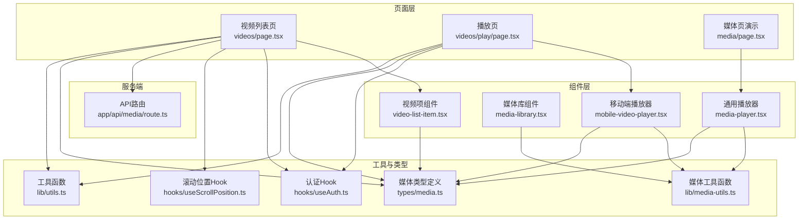
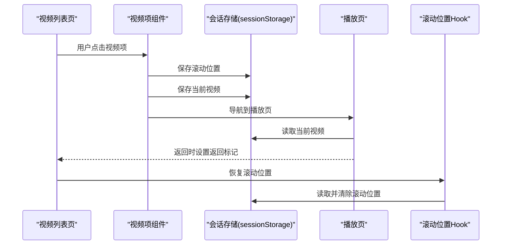
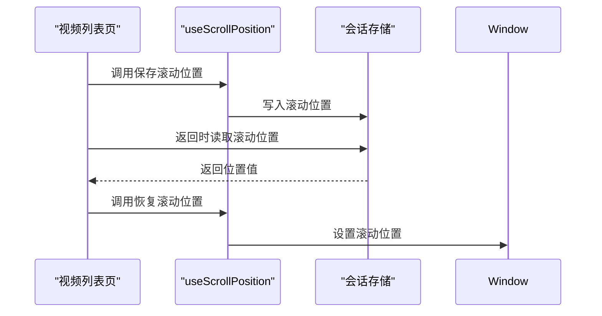
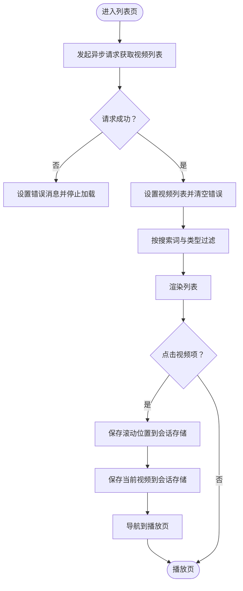
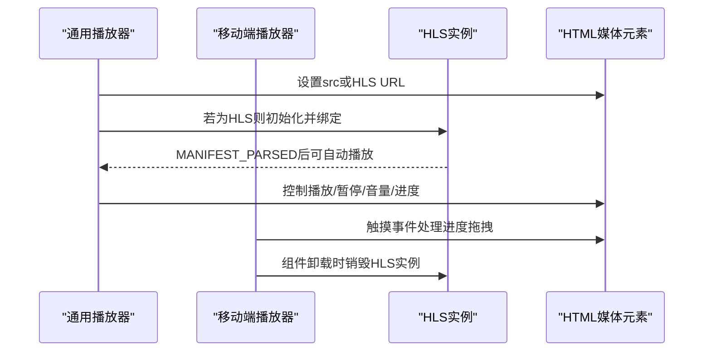
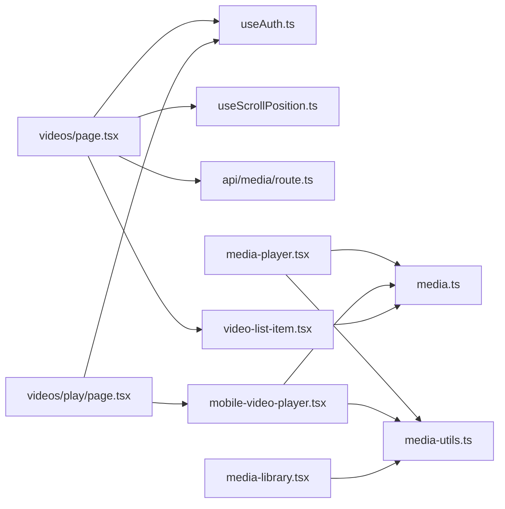

# 状态管理

<cite>
**本文引用的文件**
- [useScrollPosition.ts](file://app/web/hooks/useScrollPosition.ts)
- [media.ts](file://app/web/types/media.ts)
- [media-utils.ts](file://app/web/lib/media-utils.ts)
- [utils.ts](file://app/web/lib/utils.ts)
- [layout.tsx](file://app/web/app/layout.tsx)
- [media/page.tsx](file://app/web/app/media/page.tsx)
- [videos/page.tsx](file://app/web/app/videos/page.tsx)
- [videos/play/page.tsx](file://app/web/app/videos/play/page.tsx)
- [media-library.tsx](file://app/web/components/media-library.tsx)
- [media-player.tsx](file://app/web/components/media-player.tsx)
- [mobile-video-player.tsx](file://app/web/components/mobile-video-player.tsx)
- [video-list-item.tsx](file://app/web/components/video-list-item.tsx)
- [api/media/route.ts](file://app/web/app/api/media/route.ts)
- [useAuth.ts](file://app/web/hooks/useAuth.ts)
</cite>

## 目录
1. [引言](#引言)
2. [项目结构](#项目结构)
3. [核心组件](#核心组件)
4. [架构总览](#架构总览)
5. [详细组件分析](#详细组件分析)
6. [依赖关系分析](#依赖关系分析)
7. [性能考量](#性能考量)
8. [故障排查指南](#故障排查指南)
9. [结论](#结论)
10. [附录](#附录)

## 引言
本文件系统性梳理该视频应用的状态管理模式，涵盖本地状态、全局状态与组件间状态共享；深入解析自定义Hook“滚动位置监听器”的设计思路与使用场景；文档化媒体类型定义与数据结构；总结状态更新策略、性能优化与内存管理要点，并提供调试技巧与常见问题解决方案。

## 项目结构
应用采用Next.js客户端组件模式，前端通过React Hooks与本地存储实现轻量状态管理，配合自定义工具函数与UI组件完成媒体列表、播放器与播放页之间的状态流转。



图表来源
- [videos/page.tsx](file://app/web/app/videos/page.tsx#L1-L267)
- [videos/play/page.tsx](file://app/web/app/videos/play/page.tsx#L1-L176)
- [media/page.tsx](file://app/web/app/media/page.tsx#L1-L147)
- [video-list-item.tsx](file://app/web/components/video-list-item.tsx#L1-L93)
- [media-library.tsx](file://app/web/components/media-library.tsx#L1-L120)
- [media-player.tsx](file://app/web/components/media-player.tsx#L1-L322)
- [mobile-video-player.tsx](file://app/web/components/mobile-video-player.tsx#L1-L479)
- [useAuth.ts](file://app/web/hooks/useAuth.ts#L1-L62)
- [useScrollPosition.ts](file://app/web/hooks/useScrollPosition.ts#L1-L28)
- [media-utils.ts](file://app/web/lib/media-utils.ts#L1-L43)
- [media.ts](file://app/web/types/media.ts#L1-L20)
- [api/media/route.ts](file://app/web/app/api/media/route.ts#L1-L73)

章节来源
- [videos/page.tsx](file://app/web/app/videos/page.tsx#L1-L267)
- [videos/play/page.tsx](file://app/web/app/videos/play/page.tsx#L1-L176)
- [media/page.tsx](file://app/web/app/media/page.tsx#L1-L147)
- [video-list-item.tsx](file://app/web/components/video-list-item.tsx#L1-L93)
- [media-library.tsx](file://app/web/components/media-library.tsx#L1-L120)
- [media-player.tsx](file://app/web/components/media-player.tsx#L1-L322)
- [mobile-video-player.tsx](file://app/web/components/mobile-video-player.tsx#L1-L479)
- [useAuth.ts](file://app/web/hooks/useAuth.ts#L1-L62)
- [useScrollPosition.ts](file://app/web/hooks/useScrollPosition.ts#L1-L28)
- [media-utils.ts](file://app/web/lib/media-utils.ts#L1-L43)
- [media.ts](file://app/web/types/media.ts#L1-L20)
- [api/media/route.ts](file://app/web/app/api/media/route.ts#L1-L73)

## 核心组件
- 本地状态
  - 列表页：搜索词、视图模式、筛选类型、视频列表、加载与错误状态、滚动位置键值。
  - 播放页：当前视频对象、返回标记、授权状态。
  - 播放器组件：播放/暂停、静音、音量、当前时间、总时长、全屏、HLS支持检测、移动端控制显隐与触摸拖拽预览。
- 全局状态
  - 认证状态：通过Hook在会话存储中持久化，用于路由守卫。
  - 滚动位置：通过Hook在会话存储中持久化，跨页面恢复。
- 组件间状态共享
  - 列表项点击 -> 保存滚动位置与当前视频 -> 导航到播放页。
  - 播放页卸载/返回前 -> 设置返回标记 -> 列表页恢复滚动位置。
  - 媒体类型识别与格式化工具在多处复用，统一数据展示。

章节来源
- [videos/page.tsx](file://app/web/app/videos/page.tsx#L1-L267)
- [videos/play/page.tsx](file://app/web/app/videos/play/page.tsx#L1-L176)
- [media-player.tsx](file://app/web/components/media-player.tsx#L1-L322)
- [mobile-video-player.tsx](file://app/web/components/mobile-video-player.tsx#L1-L479)
- [useAuth.ts](file://app/web/hooks/useAuth.ts#L1-L62)
- [useScrollPosition.ts](file://app/web/hooks/useScrollPosition.ts#L1-L28)

## 架构总览
应用采用“页面级状态 + 组件内状态 + 自定义Hook + 工具函数”的轻量状态管理模式，结合会话存储实现跨页面状态持久化。



图表来源
- [videos/page.tsx](file://app/web/app/videos/page.tsx#L137-L151)
- [videos/play/page.tsx](file://app/web/app/videos/play/page.tsx#L23-L40)
- [useScrollPosition.ts](file://app/web/hooks/useScrollPosition.ts#L1-L28)

## 详细组件分析

### 自定义Hook：滚动位置监听器
- 设计目标
  - 在页面离开前保存滚动位置，在返回时恢复滚动位置，提升用户浏览连续性。
- 关键实现
  - 使用会话存储保存/恢复滚动位置。
  - 提供保存与恢复两个方法，便于在不同生命周期钩子中调用。
- 使用场景
  - 列表页：点击进入播放页前保存滚动位置；返回时恢复滚动位置。
  - 播放页：卸载前设置返回标记，确保列表页能正确恢复位置。
- 交互流程



图表来源
- [videos/page.tsx](file://app/web/app/videos/page.tsx#L61-L63)
- [videos/page.tsx](file://app/web/app/videos/page.tsx#L90-L135)
- [videos/page.tsx](file://app/web/app/videos/page.tsx#L143-L151)
- [useScrollPosition.ts](file://app/web/hooks/useScrollPosition.ts#L1-L28)

章节来源
- [useScrollPosition.ts](file://app/web/hooks/useScrollPosition.ts#L1-L28)
- [videos/page.tsx](file://app/web/app/videos/page.tsx#L61-L63)
- [videos/page.tsx](file://app/web/app/videos/page.tsx#L90-L135)
- [videos/page.tsx](file://app/web/app/videos/page.tsx#L143-L151)
- [videos/play/page.tsx](file://app/web/app/videos/play/page.tsx#L34-L40)

### 媒体类型定义与数据结构
- 数据模型
  - 媒体项：名称、路径、类型、可选缩略图、时长、大小、分辨率、比特率、创建时间、字幕路径。
  - 媒体响应：包含媒体数组。
  - 媒体类型枚举：视频、音频、HLS。
- 类型映射与格式化
  - 根据扩展名或标识判断媒体类型（HLS、音频、视频）。
  - 时间与文件大小格式化工具。
- 结构复杂度
  - 类型定义为平面结构，便于快速序列化/反序列化与UI渲染。

```mermaid
classDiagram
class MediaItem {
+string name
+string path
+string type
+string? thumbnail
+number? duration
+string? size
+string? resolution
+string? bitrate
+string? createdAt
+string? subtitle
}
class MediaResponse {
+MediaItem[] videos
}
class MediaType {
<<enum>>
"video"
"audio"
"hls"
}
MediaResponse --> MediaItem : "包含"
```

图表来源
- [media.ts](file://app/web/types/media.ts#L1-L20)

章节来源
- [media.ts](file://app/web/types/media.ts#L1-L20)
- [media-utils.ts](file://app/web/lib/media-utils.ts#L1-L43)

### 媒体工具函数
- 媒体类型识别：根据字符串包含关系判定HLS、音频或视频。
- 时间格式化：将秒数格式化为分:秒。
- 文件大小格式化：将字节转换为人类可读单位。
- 路径规范化：将后端路径转换为前端可用URL。

章节来源
- [media-utils.ts](file://app/web/lib/media-utils.ts#L1-L43)

### 认证与路由守卫
- 认证状态
  - 通过会话存储维护登录状态，支持密码校验与登出。
- 路由守卫
  - 在页面挂载时检查认证状态，未认证则跳转至登录页并缓存目标路径。

章节来源
- [useAuth.ts](file://app/web/hooks/useAuth.ts#L1-L62)
- [videos/page.tsx](file://app/web/app/videos/page.tsx#L64-L69)
- [videos/play/page.tsx](file://app/web/app/videos/play/page.tsx#L16-L21)

### 列表页状态管理
- 本地状态
  - 搜索词、视图模式、筛选类型、视频列表、加载与错误状态。
- 状态更新策略
  - 异步拉取数据，成功后设置列表与错误为空；失败时设置错误消息与加载结束。
  - 点击视频项时先保存滚动位置与当前视频，再导航到播放页。
- 滚动恢复
  - 返回时根据返回标记触发滚动位置恢复逻辑，兼容移动端多次尝试与延迟。



图表来源
- [videos/page.tsx](file://app/web/app/videos/page.tsx#L26-L49)
- [videos/page.tsx](file://app/web/app/videos/page.tsx#L71-L87)
- [videos/page.tsx](file://app/web/app/videos/page.tsx#L137-L151)
- [videos/page.tsx](file://app/web/app/videos/page.tsx#L90-L135)

章节来源
- [videos/page.tsx](file://app/web/app/videos/page.tsx#L1-L267)

### 播放页状态管理
- 本地状态
  - 当前视频对象、返回标记。
- 状态更新策略
  - 首次挂载从会话存储读取视频数据，若不存在则回退到列表页。
  - 卸载或返回前设置返回标记，确保列表页能恢复滚动位置。
- 交互细节
  - 使用replace导航避免历史栈膨胀。

章节来源
- [videos/play/page.tsx](file://app/web/app/videos/play/page.tsx#L1-L176)

### 播放器组件状态管理
- 通用播放器
  - 根据类型选择视频或音频元素，动态加载HLS（Hls.js或Safari原生）。
  - 维护播放/暂停、静音、音量、进度、全屏等状态。
- 移动端播放器
  - 支持触摸拖拽预览进度、自动隐藏控制栏、错误与加载状态提示。
  - 释放资源时销毁HLS实例，避免内存泄漏。



图表来源
- [media-player.tsx](file://app/web/components/media-player.tsx#L32-L81)
- [media-player.tsx](file://app/web/components/media-player.tsx#L83-L129)
- [mobile-video-player.tsx](file://app/web/components/mobile-video-player.tsx#L42-L101)
- [mobile-video-player.tsx](file://app/web/components/mobile-video-player.tsx#L141-L148)

章节来源
- [media-player.tsx](file://app/web/components/media-player.tsx#L1-L322)
- [mobile-video-player.tsx](file://app/web/components/mobile-video-player.tsx#L1-L479)

### 媒体库与列表项组件
- 媒体库
  - 内部维护过滤器状态，按类型过滤媒体项并渲染卡片。
- 列表项
  - 展示缩略图、时长、分辨率、大小、比特率与创建时间等信息。
  - 点击回调向上抛出，由父组件决定导航行为。

章节来源
- [media-library.tsx](file://app/web/components/media-library.tsx#L1-L120)
- [video-list-item.tsx](file://app/web/components/video-list-item.tsx#L1-L93)

### API与数据来源
- API路由
  - 提供模拟媒体数据接口，返回包含视频数组的响应。
- 客户端消费
  - 列表页通过fetch调用API，转换字段并填充本地状态。

章节来源
- [api/media/route.ts](file://app/web/app/api/media/route.ts#L1-L73)
- [videos/page.tsx](file://app/web/app/videos/page.tsx#L26-L49)

## 依赖关系分析
- 组件依赖
  - 列表页依赖认证Hook、滚动位置Hook、API路由与UI组件。
  - 播放页依赖认证Hook与移动端播放器。
  - 播放器组件依赖媒体工具函数与类型定义。
- 工具函数依赖
  - 媒体工具函数被多个组件复用，降低耦合。
- 存储依赖
  - 会话存储用于跨页面状态持久化（滚动位置、视频数据、认证状态）。



图表来源
- [videos/page.tsx](file://app/web/app/videos/page.tsx#L1-L267)
- [videos/play/page.tsx](file://app/web/app/videos/play/page.tsx#L1-L176)
- [media-player.tsx](file://app/web/components/media-player.tsx#L1-L322)
- [mobile-video-player.tsx](file://app/web/components/mobile-video-player.tsx#L1-L479)
- [media-library.tsx](file://app/web/components/media-library.tsx#L1-L120)
- [useAuth.ts](file://app/web/hooks/useAuth.ts#L1-L62)
- [useScrollPosition.ts](file://app/web/hooks/useScrollPosition.ts#L1-L28)
- [media-utils.ts](file://app/web/lib/media-utils.ts#L1-L43)
- [media.ts](file://app/web/types/media.ts#L1-L20)
- [api/media/route.ts](file://app/web/app/api/media/route.ts#L1-L73)

## 性能考量
- 状态持久化
  - 使用会话存储保存滚动位置与视频数据，避免重复请求与状态丢失。
- 资源释放
  - 播放器组件在卸载时销毁HLS实例，减少内存占用。
- 渲染优化
  - 列表页按需渲染与过滤，避免不必要的重绘。
  - 媒体库组件内部过滤，减少父组件状态变更影响范围。
- 网络与加载
  - 播放器按类型选择原生或HLS.js，优先使用原生能力以降低开销。
  - 移动端播放器预加载元数据，减少首帧等待。

章节来源
- [mobile-video-player.tsx](file://app/web/components/mobile-video-player.tsx#L141-L148)
- [media-player.tsx](file://app/web/components/media-player.tsx#L51-L81)
- [videos/page.tsx](file://app/web/app/videos/page.tsx#L137-L151)

## 故障排查指南
- 播放失败
  - 检查HLS支持情况与网络连通性；移动端注意自动播放限制。
  - 查看错误日志与错误状态提示，必要时重新加载。
- 滚动位置未恢复
  - 确认返回标记已设置；检查会话存储中的滚动位置键值是否存在。
  - 移动端可增加延迟重试与多次尝试。
- 列表为空或加载异常
  - 检查API响应结构与字段映射；确认网络请求状态码与错误消息。
- 认证失败
  - 检查会话存储中的认证状态与密码配置；确认路由守卫逻辑执行顺序。

章节来源
- [mobile-video-player.tsx](file://app/web/components/mobile-video-player.tsx#L317-L373)
- [videos/page.tsx](file://app/web/app/videos/page.tsx#L90-L135)
- [videos/page.tsx](file://app/web/app/videos/page.tsx#L227-L248)
- [useAuth.ts](file://app/web/hooks/useAuth.ts#L1-L62)

## 结论
该应用采用轻量的本地状态管理模式，结合自定义Hook与会话存储实现跨页面状态持久化，满足滚动位置恢复、播放页数据传递与认证守卫等需求。通过工具函数统一媒体类型识别与格式化，组件职责清晰、耦合度低。建议在后续迭代中引入更完善的错误边界与状态调试工具，进一步提升可观测性与可维护性。

## 附录
- 最佳实践
  - 将跨页面共享的状态尽量下沉到Hook中，保持组件纯函数特性。
  - 对外部资源（HLS、网络请求）进行错误兜底与重试策略。
  - 使用类型定义约束数据结构，减少运行期错误。
- 可扩展点
  - 引入集中式状态库（如Zustand）以支持更复杂的跨组件共享状态。
  - 增加状态快照与时间旅行调试功能，辅助开发与排错。