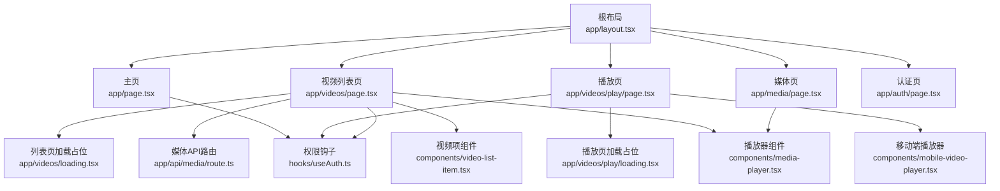
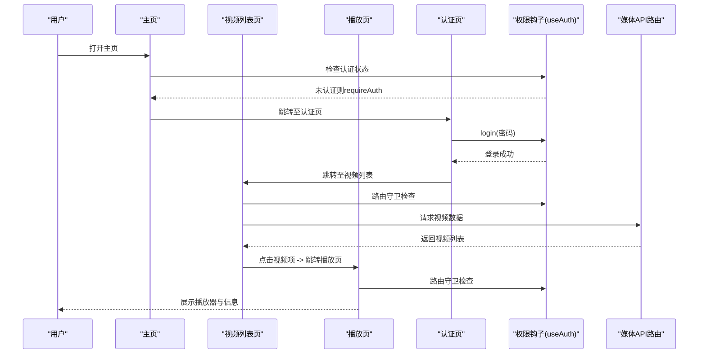
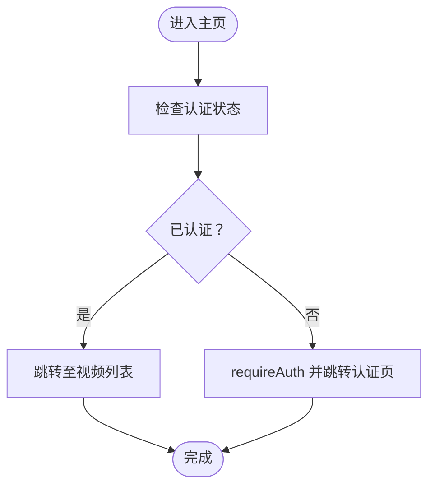
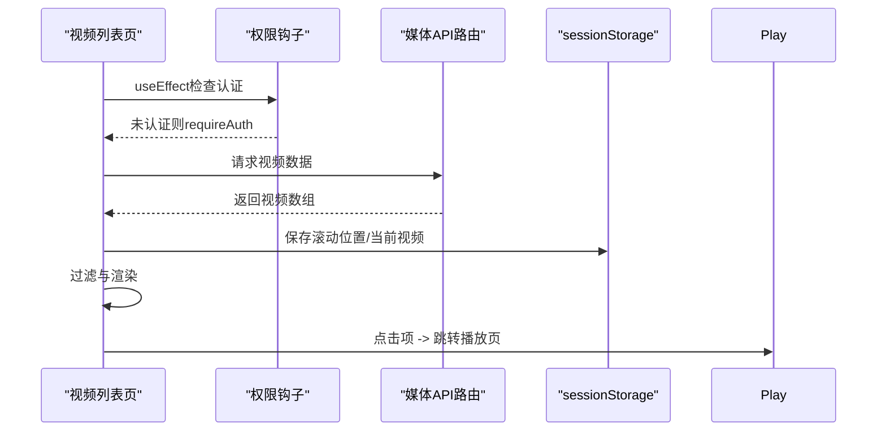
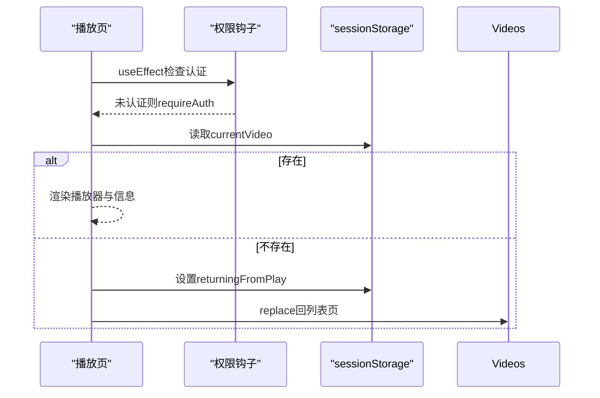
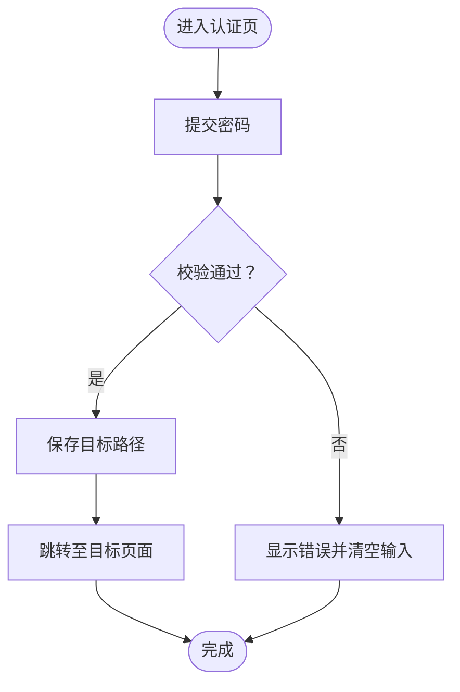
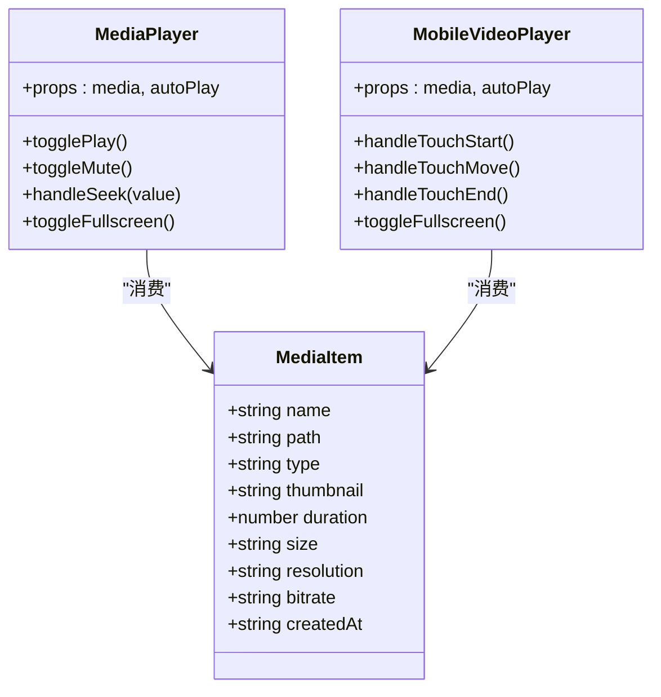
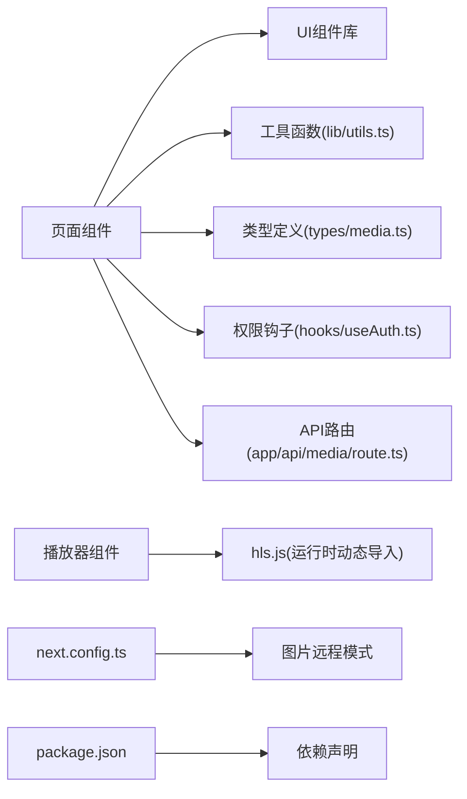

# 页面与路由系统

<cite>
**本文引用的文件**
- [app/web/app/page.tsx](file://app/web/app/page.tsx)
- [app/web/app/layout.tsx](file://app/web/app/layout.tsx)
- [app/web/app/videos/page.tsx](file://app/web/app/videos/page.tsx)
- [app/web/app/videos/loading.tsx](file://app/web/app/videos/loading.tsx)
- [app/web/app/videos/play/page.tsx](file://app/web/app/videos/play/page.tsx)
- [app/web/app/videos/play/loading.tsx](file://app/web/app/videos/play/loading.tsx)
- [app/web/app/media/page.tsx](file://app/web/app/media/page.tsx)
- [app/web/app/api/media/route.ts](file://app/web/app/api/media/route.ts)
- [app/web/app/auth/page.tsx](file://app/web/app/auth/page.tsx)
- [app/web/hooks/useAuth.ts](file://app/web/hooks/useAuth.ts)
- [app/web/types/media.ts](file://app/web/types/media.ts)
- [app/web/components/media-player.tsx](file://app/web/components/media-player.tsx)
- [app/web/components/mobile-video-player.tsx](file://app/web/components/mobile-video-player.tsx)
- [app/web/components/video-list-item.tsx](file://app/web/components/video-list-item.tsx)
- [app/web/lib/utils.ts](file://app/web/lib/utils.ts)
- [app/web/next.config.ts](file://app/web/next.config.ts)
- [app/web/package.json](file://app/web/package.json)
</cite>

## 目录
1. [引言](#引言)
2. [项目结构](#项目结构)
3. [核心组件](#核心组件)
4. [架构总览](#架构总览)
5. [详细组件分析](#详细组件分析)
6. [依赖分析](#依赖分析)
7. [性能考虑](#性能考虑)
8. [故障排查指南](#故障排查指南)
9. [结论](#结论)
10. [附录](#附录)

## 引言
本文件系统性梳理基于 Next.js App Router 的页面与路由体系，涵盖页面文件组织、动态路由参数与嵌套路由配置、页面功能定位与导航关系、页面加载策略与懒加载实现、性能优化技巧、路由守卫与权限控制、以及页面间数据传递机制。文档面向不同技术背景读者，既提供高层概览，也给出代码级分析与可视化图表。

## 项目结构
该工程采用 Next.js App Router 的约定式路由：每个页面通过 app 目录下的文件组织形成路由层级。根布局负责全局样式与字体注入；各业务页面位于 app 下的子目录，形成清晰的命名空间与嵌套关系。认证页面独立于业务路由之外，用于统一的访问控制。

**图表来源**
- [app/web/app/layout.tsx](file://app/web/app/layout.tsx#L1-L35)
- [app/web/app/page.tsx](file://app/web/app/page.tsx#L1-L143)
- [app/web/app/videos/page.tsx](file://app/web/app/videos/page.tsx#L1-L267)
- [app/web/app/videos/loading.tsx](file://app/web/app/videos/loading.tsx#L1-L4)
- [app/web/app/videos/play/page.tsx](file://app/web/app/videos/play/page.tsx#L1-L176)
- [app/web/app/videos/play/loading.tsx](file://app/web/app/videos/play/loading.tsx#L1-L31)
- [app/web/app/media/page.tsx](file://app/web/app/media/page.tsx#L1-L147)
- [app/web/app/api/media/route.ts](file://app/web/app/api/media/route.ts#L1-L73)
- [app/web/app/auth/page.tsx](file://app/web/app/auth/page.tsx#L1-L135)
- [app/web/hooks/useAuth.ts](file://app/web/hooks/useAuth.ts#L1-L62)
- [app/web/components/media-player.tsx](file://app/web/components/media-player.tsx#L1-L322)
- [app/web/components/mobile-video-player.tsx](file://app/web/components/mobile-video-player.tsx#L1-L479)
- [app/web/components/video-list-item.tsx](file://app/web/components/video-list-item.tsx#L1-L93)

**章节来源**
- [app/web/app/layout.tsx](file://app/web/app/layout.tsx#L1-L35)
- [app/web/next.config.ts](file://app/web/next.config.ts#L1-L39)

## 核心组件
- 根布局与全局样式：负责注入字体、全局样式与基础元数据，所有页面共享。
- 主页：引导用户进入视频库，内置认证检查与跳转逻辑。
- 视频列表页：展示视频集合，支持搜索、筛选、网格/列表视图切换，内置滚动位置记忆与错误处理。
- 播放页：移动端优化的播放器容器，支持返回标记与滚动位置恢复。
- 媒体页：演示统一播放器组件，支持多格式媒体。
- 认证页与权限钩子：提供密码校验、登录/登出、重定向与会话管理。
- 组件库：媒体播放器、移动端播放器、视频项组件等。

**章节来源**
- [app/web/app/page.tsx](file://app/web/app/page.tsx#L1-L143)
- [app/web/app/videos/page.tsx](file://app/web/app/videos/page.tsx#L1-L267)
- [app/web/app/videos/play/page.tsx](file://app/web/app/videos/play/page.tsx#L1-L176)
- [app/web/app/media/page.tsx](file://app/web/app/media/page.tsx#L1-L147)
- [app/web/app/auth/page.tsx](file://app/web/app/auth/page.tsx#L1-L135)
- [app/web/hooks/useAuth.ts](file://app/web/hooks/useAuth.ts#L1-L62)
- [app/web/components/media-player.tsx](file://app/web/components/media-player.tsx#L1-L322)
- [app/web/components/mobile-video-player.tsx](file://app/web/components/mobile-video-player.tsx#L1-L479)
- [app/web/components/video-list-item.tsx](file://app/web/components/video-list-item.tsx#L1-L93)

## 架构总览
下图展示页面与路由的交互关系、数据流向与权限控制：

**图表来源**
- [app/web/app/page.tsx](file://app/web/app/page.tsx#L1-L143)
- [app/web/app/videos/page.tsx](file://app/web/app/videos/page.tsx#L1-L267)
- [app/web/app/videos/play/page.tsx](file://app/web/app/videos/play/page.tsx#L1-L176)
- [app/web/app/auth/page.tsx](file://app/web/app/auth/page.tsx#L1-L135)
- [app/web/hooks/useAuth.ts](file://app/web/hooks/useAuth.ts#L1-L62)
- [app/web/app/api/media/route.ts](file://app/web/app/api/media/route.ts#L1-L73)

## 详细组件分析

### 主页（主页导航与认证入口）
- 功能定位：欢迎区、功能介绍、浏览视频库按钮。
- 导航关系：点击“浏览视频库”根据认证状态决定直接跳转或触发认证流程。
- 权限控制：通过权限钩子进行认证检查与重定向。

**图表来源**
- [app/web/app/page.tsx](file://app/web/app/page.tsx#L1-L143)
- [app/web/hooks/useAuth.ts](file://app/web/hooks/useAuth.ts#L1-L62)

**章节来源**
- [app/web/app/page.tsx](file://app/web/app/page.tsx#L1-L143)
- [app/web/hooks/useAuth.ts](file://app/web/hooks/useAuth.ts#L1-L62)

### 视频列表页（数据加载、过滤与导航）
- 数据加载：调用媒体API路由获取视频列表，统一字段映射与默认值处理。
- 过滤与视图：支持按类型筛选与网格/列表视图切换。
- 滚动位置记忆：离开前保存滚动位置，返回时恢复，移动端多策略保障。
- 页面间数据传递：通过 sessionStorage 传递当前视频对象与返回标记。
- 路由守卫：在认证状态变化时执行重定向。

**图表来源**
- [app/web/app/videos/page.tsx](file://app/web/app/videos/page.tsx#L1-L267)
- [app/web/app/api/media/route.ts](file://app/web/app/api/media/route.ts#L1-L73)
- [app/web/hooks/useAuth.ts](file://app/web/hooks/useAuth.ts#L1-L62)

**章节来源**
- [app/web/app/videos/page.tsx](file://app/web/app/videos/page.tsx#L1-L267)
- [app/web/app/api/media/route.ts](file://app/web/app/api/media/route.ts#L1-L73)
- [app/web/hooks/useAuth.ts](file://app/web/hooks/useAuth.ts#L1-L62)

### 播放页（移动端播放器与返回恢复）
- 页面间数据传递：从 sessionStorage 读取当前视频，缺失则回退到列表页。
- 返回标记：卸载时设置“从播放页返回”的标记，配合列表页滚动恢复。
- 路由守卫：认证状态检查，未认证跳转认证页。
- 加载占位：提供骨架屏加载组件，优化首屏体验。

**图表来源**
- [app/web/app/videos/play/page.tsx](file://app/web/app/videos/play/page.tsx#L1-L176)
- [app/web/hooks/useAuth.ts](file://app/web/hooks/useAuth.ts#L1-L62)

**章节来源**
- [app/web/app/videos/play/page.tsx](file://app/web/app/videos/play/page.tsx#L1-L176)
- [app/web/app/videos/play/loading.tsx](file://app/web/app/videos/play/loading.tsx#L1-L31)

### 媒体页（统一播放器演示）
- 功能定位：演示统一播放器组件，支持多格式媒体（视频/音频/HLS）。
- 数据来源：本地模拟数据，便于演示播放器能力。

**章节来源**
- [app/web/app/media/page.tsx](file://app/web/app/media/page.tsx#L1-L147)
- [app/web/components/media-player.tsx](file://app/web/components/media-player.tsx#L1-L322)

### 认证页与权限钩子（路由守卫与会话）
- 认证流程：输入密码，校验后写入会话并跳转至目标页面。
- 会话管理：支持登出并回到认证页。
- 路由守卫：在页面挂载时检查认证状态，必要时重定向并保存目标路径。

**图表来源**
- [app/web/app/auth/page.tsx](file://app/web/app/auth/page.tsx#L1-L135)
- [app/web/hooks/useAuth.ts](file://app/web/hooks/useAuth.ts#L1-L62)

**章节来源**
- [app/web/app/auth/page.tsx](file://app/web/app/auth/page.tsx#L1-L135)
- [app/web/hooks/useAuth.ts](file://app/web/hooks/useAuth.ts#L1-L62)

### 组件级分析：媒体播放器与移动端播放器
- 统一播放器：根据 type 自动识别视频/音频/HLS，动态加载 HLS.js 或使用原生能力。
- 移动端播放器：针对触摸手势优化，支持拖动进度、全屏、加载与错误状态提示。

**图表来源**
- [app/web/types/media.ts](file://app/web/types/media.ts#L1-L20)
- [app/web/components/media-player.tsx](file://app/web/components/media-player.tsx#L1-L322)
- [app/web/components/mobile-video-player.tsx](file://app/web/components/mobile-video-player.tsx#L1-L479)

**章节来源**
- [app/web/types/media.ts](file://app/web/types/media.ts#L1-L20)
- [app/web/components/media-player.tsx](file://app/web/components/media-player.tsx#L1-L322)
- [app/web/components/mobile-video-player.tsx](file://app/web/components/mobile-video-player.tsx#L1-L479)

## 依赖分析
- 路由与页面：App Router 通过 app 目录约定生成路由树，嵌套目录形成父子路由关系。
- 组件依赖：页面依赖自定义组件与UI库，组件之间通过 props 传递数据。
- 外部库：播放器依赖 hls.js（按需动态加载），Next.js 图片组件用于缩略图渲染。
- 配置：next.config.ts 配置图片远程模式与头部策略，package.json 管理依赖版本。

**图表来源**
- [app/web/lib/utils.ts](file://app/web/lib/utils.ts#L1-L7)
- [app/web/types/media.ts](file://app/web/types/media.ts#L1-L20)
- [app/web/hooks/useAuth.ts](file://app/web/hooks/useAuth.ts#L1-L62)
- [app/web/app/api/media/route.ts](file://app/web/app/api/media/route.ts#L1-L73)
- [app/web/next.config.ts](file://app/web/next.config.ts#L1-L39)
- [app/web/package.json](file://app/web/package.json#L1-L74)

**章节来源**
- [app/web/next.config.ts](file://app/web/next.config.ts#L1-L39)
- [app/web/package.json](file://app/web/package.json#L1-L74)

## 性能考虑
- 按需加载与懒编译：播放器组件按需动态导入第三方库，减少初始包体积。
- 骨架屏与占位：列表页与播放页提供加载占位，改善感知性能。
- 滚动位置记忆：离开页面保存滚动位置，返回时快速恢复，提升可用性。
- 图片优化：使用 Next.js 图片组件与远程模式，结合缩略图路径优化渲染。
- 媒体格式适配：优先使用原生支持的格式，必要时动态加载 HLS.js，降低兼容成本。

[本节为通用性能指导，无需特定文件引用]

## 故障排查指南
- 认证失败：检查密码配置与会话状态，确认 requireAuth 是否正确保存重定向路径。
- 视频加载失败：检查 API 返回数据结构与字段映射，确认 type 与 path 正确。
- 播放异常：确认播放器类型判断与 URL 构造逻辑，HLS 源地址与跨域设置。
- 滚动位置不恢复：检查 sessionStorage 写入与读取时机，移动端加载时机差异处理。

**章节来源**
- [app/web/app/auth/page.tsx](file://app/web/app/auth/page.tsx#L1-L135)
- [app/web/app/videos/page.tsx](file://app/web/app/videos/page.tsx#L1-L267)
- [app/web/app/videos/play/page.tsx](file://app/web/app/videos/play/page.tsx#L1-L176)
- [app/web/components/mobile-video-player.tsx](file://app/web/components/mobile-video-player.tsx#L1-L479)

## 结论
本项目以 Next.js App Router 为基础，构建了清晰的页面与路由体系：主页负责入口与认证，视频列表页承载数据与交互，播放页专注移动端体验，媒体页演示统一播放器能力。通过权限钩子实现路由守卫与会话管理，借助 sessionStorage 实现页面间数据传递与滚动位置记忆，并通过按需加载与骨架屏优化性能。整体架构模块化程度高、扩展性强，适合进一步引入动态路由参数与嵌套路由配置。

## 附录
- 动态路由参数与嵌套路由：当前仓库未见动态段（如 [id]）与深层嵌套路由配置文件，若需扩展可在 app 目录下新增相应层级与文件。
- 页面加载策略：利用 App Router 的并发渲染与 Suspense 边界，结合自定义加载组件实现细粒度的加载反馈。
- 权限控制：建议在中间件或服务端拦截器中补充更严格的权限校验，前端仅作为辅助保护。

[本节为概念性内容，无需特定文件引用]