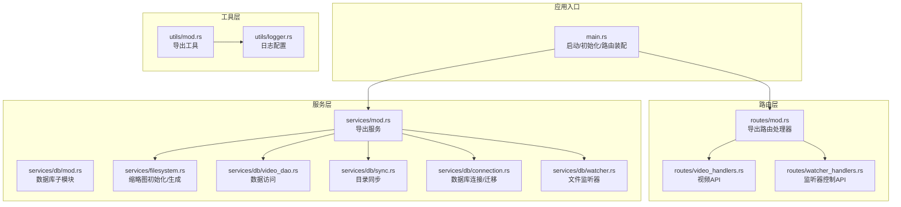
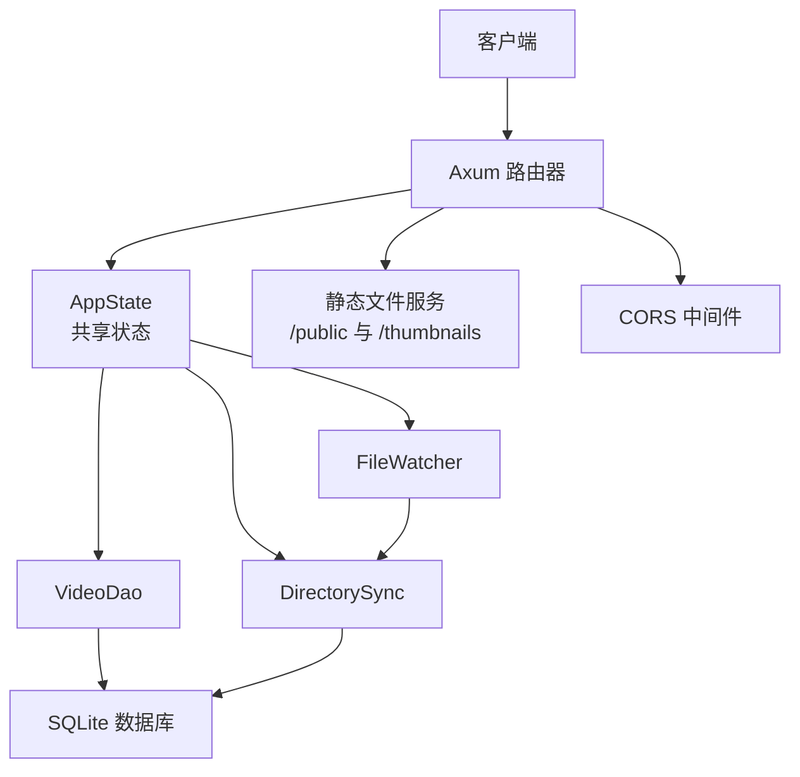
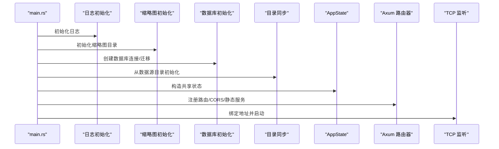
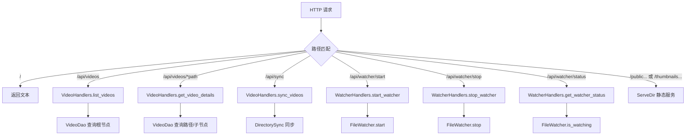
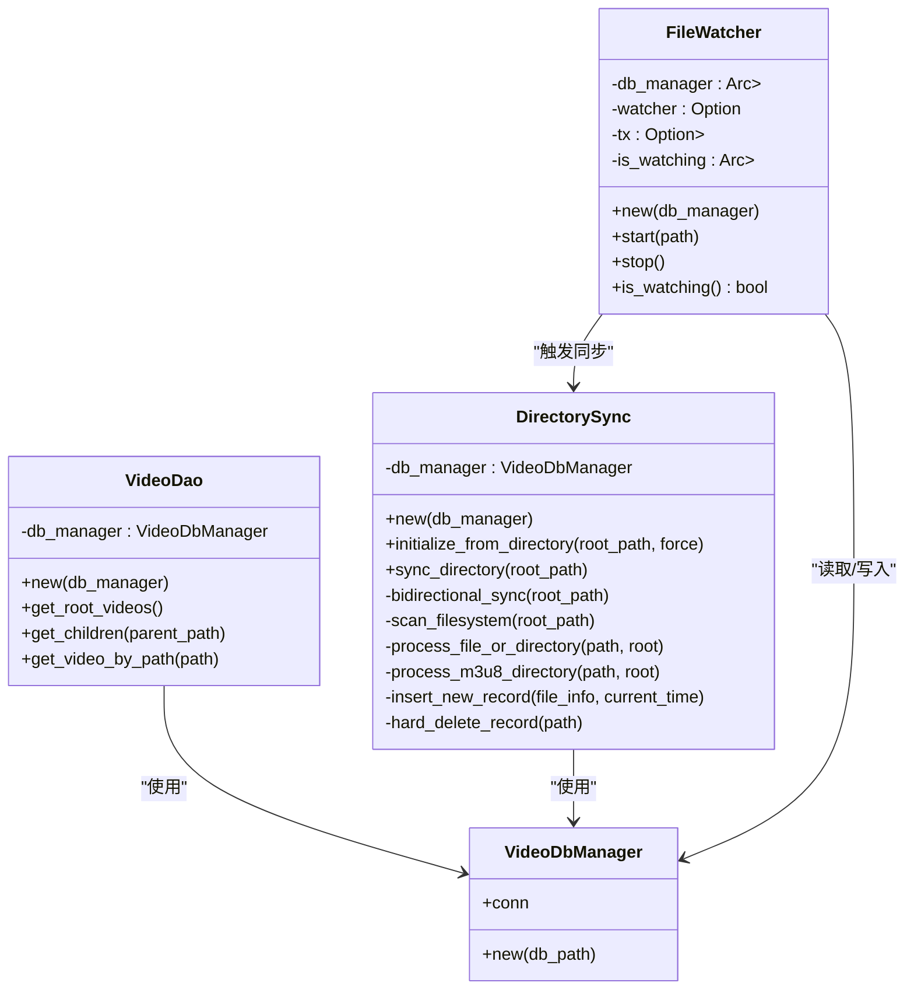
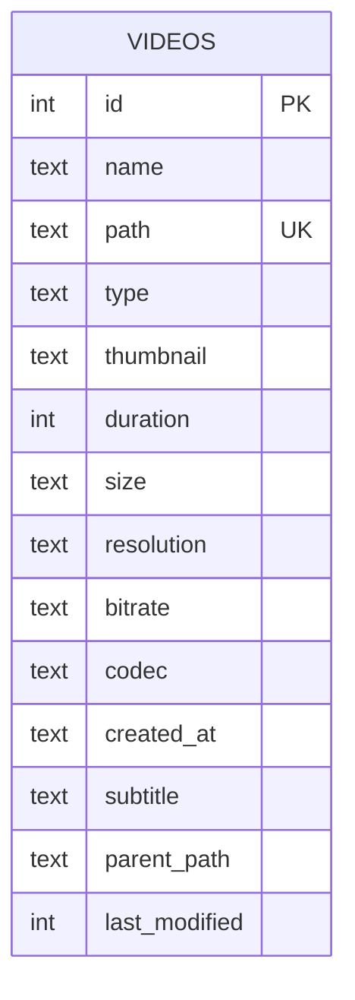
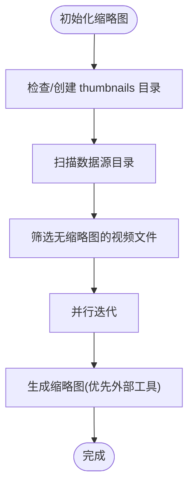
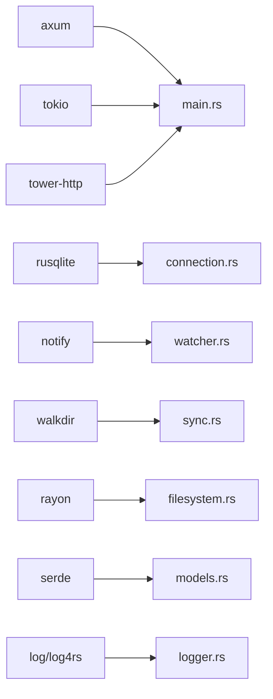

# 后端架构

<cite>
**本文引用的文件**
- [app/server/src/main.rs](file://app/server/src/main.rs)
- [app/server/Cargo.toml](file://app/server/Cargo.toml)
- [app/server/src/models.rs](file://app/server/src/models.rs)
- [app/server/src/routes/mod.rs](file://app/server/src/routes/mod.rs)
- [app/server/src/routes/video_handlers.rs](file://app/server/src/routes/video_handlers.rs)
- [app/server/src/routes/watcher_handlers.rs](file://app/server/src/routes/watcher_handlers.rs)
- [app/server/src/services/mod.rs](file://app/server/src/services/mod.rs)
- [app/server/src/services/db/mod.rs](file://app/server/src/services/db/mod.rs)
- [app/server/src/services/db/connection.rs](file://app/server/src/services/db/connection.rs)
- [app/server/src/services/db/video_dao.rs](file://app/server/src/services/db/video_dao.rs)
- [app/server/src/services/db/sync.rs](file://app/server/src/services/db/sync.rs)
- [app/server/src/services/db/watcher.rs](file://app/server/src/services/db/watcher.rs)
- [app/server/src/services/filesystem.rs](file://app/server/src/services/filesystem.rs)
- [app/server/src/utils/mod.rs](file://app/server/src/utils/mod.rs)
- [app/server/src/utils/logger.rs](file://app/server/src/utils/logger.rs)
</cite>

## 目录
1. [简介](#简介)
2. [项目结构](#项目结构)
3. [核心组件](#核心组件)
4. [架构总览](#架构总览)
5. [详细组件分析](#详细组件分析)
6. [依赖分析](#依赖分析)
7. [性能考虑](#性能考虑)
8. [故障排查指南](#故障排查指南)
9. [结论](#结论)
10. [附录](#附录)

## 简介
本项目是一个基于 Rust 的后端服务，采用 Axum 与 Tokio 构建异步 Web 服务器，结合 SQLite 数据库存储媒体元数据，提供视频资源的浏览、详情查询、手动/自动同步以及缩略图生成能力。系统通过中间件启用跨域支持，并通过静态文件服务对外暴露数据源与缩略图目录。

## 项目结构
后端代码位于 app/server，采用按职责分层的组织方式：
- 应用入口与状态：main.rs 负责启动、初始化日志、数据库、文件监听器与路由，统一注入应用状态。
- 路由层：routes 子模块导出路由处理器，分别处理视频列表、详情、同步与文件监听器控制。
- 服务层：services 子模块包含数据库与文件系统两大领域服务；数据库服务进一步细分为连接、DAO、同步、监听与树构建；文件系统服务负责缩略图初始化与生成。
- 工具层：utils 提供日志、时长解析、m3u8 处理、缩略图保障等通用能力。
- 数据模型：models 定义对外序列化的视频信息与列表结构。

图表来源
- [app/server/src/main.rs](file://app/server/src/main.rs#L1-L111)
- [app/server/src/routes/mod.rs](file://app/server/src/routes/mod.rs#L1-L6)
- [app/server/src/routes/video_handlers.rs](file://app/server/src/routes/video_handlers.rs#L1-L104)
- [app/server/src/routes/watcher_handlers.rs](file://app/server/src/routes/watcher_handlers.rs#L1-L84)
- [app/server/src/services/mod.rs](file://app/server/src/services/mod.rs#L1-L6)
- [app/server/src/services/db/mod.rs](file://app/server/src/services/db/mod.rs#L1-L16)
- [app/server/src/services/db/connection.rs](file://app/server/src/services/db/connection.rs#L1-L122)
- [app/server/src/services/db/video_dao.rs](file://app/server/src/services/db/video_dao.rs#L1-L146)
- [app/server/src/services/db/sync.rs](file://app/server/src/services/db/sync.rs#L1-L413)
- [app/server/src/services/db/watcher.rs](file://app/server/src/services/db/watcher.rs#L1-L182)
- [app/server/src/services/filesystem.rs](file://app/server/src/services/filesystem.rs#L1-L121)
- [app/server/src/utils/mod.rs](file://app/server/src/utils/mod.rs#L1-L14)
- [app/server/src/utils/logger.rs](file://app/server/src/utils/logger.rs#L1-L100)

章节来源
- [app/server/src/main.rs](file://app/server/src/main.rs#L1-L111)
- [app/server/src/routes/mod.rs](file://app/server/src/routes/mod.rs#L1-L6)
- [app/server/src/services/mod.rs](file://app/server/src/services/mod.rs#L1-L6)
- [app/server/src/utils/mod.rs](file://app/server/src/utils/mod.rs#L1-L14)

## 核心组件
- 应用状态 AppState：封装数据库管理器与文件监听器的共享句柄，供路由处理器安全访问。
- 路由处理器：
  - 视频列表与详情：从数据库查询根目录与指定路径的视频信息，支持目录与 m3u8 的子节点查询。
  - 手动同步：触发目录同步，返回同步结果与计数。
  - 文件监听器控制：启动/停止监听器并查询状态。
- 数据访问层：VideoDao 提供根节点、父子关系查询与单条记录查询。
- 数据库层：VideoDbManager 负责连接、表结构与索引初始化、迁移；DirectorySync 实现双向同步；FileWatcher 基于 notify 与 Tokio 实现文件变更监听与去抖同步。
- 文件系统层：initialize_thumbnails_with_source 初始化缩略图目录并批量生成；generate_video_thumbnail 与 generate_default_thumbnail 生成缩略图。
- 工具层：日志、时长解析、m3u8 处理、缩略图保障等。

章节来源
- [app/server/src/main.rs](file://app/server/src/main.rs#L21-L61)
- [app/server/src/routes/video_handlers.rs](file://app/server/src/routes/video_handlers.rs#L1-L104)
- [app/server/src/routes/watcher_handlers.rs](file://app/server/src/routes/watcher_handlers.rs#L1-L84)
- [app/server/src/services/db/video_dao.rs](file://app/server/src/services/db/video_dao.rs#L1-L146)
- [app/server/src/services/db/connection.rs](file://app/server/src/services/db/connection.rs#L1-L122)
- [app/server/src/services/db/sync.rs](file://app/server/src/services/db/sync.rs#L1-L413)
- [app/server/src/services/db/watcher.rs](file://app/server/src/services/db/watcher.rs#L1-L182)
- [app/server/src/services/filesystem.rs](file://app/server/src/services/filesystem.rs#L1-L121)
- [app/server/src/utils/logger.rs](file://app/server/src/utils/logger.rs#L1-L100)

## 架构总览
系统采用“路由层-服务层-数据访问层-数据库/文件系统”的分层设计，配合异步运行时与共享状态实现高并发与低耦合。

图表来源
- [app/server/src/main.rs](file://app/server/src/main.rs#L62-L91)
- [app/server/src/routes/video_handlers.rs](file://app/server/src/routes/video_handlers.rs#L1-L104)
- [app/server/src/routes/watcher_handlers.rs](file://app/server/src/routes/watcher_handlers.rs#L1-L84)
- [app/server/src/services/db/video_dao.rs](file://app/server/src/services/db/video_dao.rs#L1-L146)
- [app/server/src/services/db/sync.rs](file://app/server/src/services/db/sync.rs#L1-L413)
- [app/server/src/services/db/watcher.rs](file://app/server/src/services/db/watcher.rs#L1-L182)

## 详细组件分析

### 应用启动与控制流
- 启动流程要点：
  - 初始化日志与缩略图目录。
  - 初始化数据库并尝试从数据源目录进行同步。
  - 构造共享状态 AppState 并注入路由。
  - 配置 CORS 与静态文件服务。
  - 绑定 TCP 监听并启动服务。

图表来源
- [app/server/src/main.rs](file://app/server/src/main.rs#L27-L110)

章节来源
- [app/server/src/main.rs](file://app/server/src/main.rs#L27-L110)

### 路由层与中间件
- 路由定义：
  - GET /：健康检查返回文本。
  - GET /api/videos：列出根目录视频。
  - GET /api/videos/*path：获取指定路径详情（含子节点）。
  - GET /api/sync：手动触发同步。
  - GET /api/watcher/start|stop|status：监听器控制与状态查询。
  - /public 与 /thumbnails：静态文件服务。
- 中间件：
  - CORS：允许任意来源与常用方法/头。
  - 日志：Axum 与 Tower 提供的请求链路日志可选启用。

图表来源
- [app/server/src/main.rs](file://app/server/src/main.rs#L72-L90)
- [app/server/src/routes/video_handlers.rs](file://app/server/src/routes/video_handlers.rs#L1-L104)
- [app/server/src/routes/watcher_handlers.rs](file://app/server/src/routes/watcher_handlers.rs#L1-L84)

章节来源
- [app/server/src/main.rs](file://app/server/src/main.rs#L72-L90)
- [app/server/src/routes/video_handlers.rs](file://app/server/src/routes/video_handlers.rs#L1-L104)
- [app/server/src/routes/watcher_handlers.rs](file://app/server/src/routes/watcher_handlers.rs#L1-L84)

### 服务层：数据库与同步
- VideoDbManager：创建表与索引，执行迁移逻辑，保证 schema 最新。
- VideoDao：提供根节点查询、父子查询、按路径查询，构建树形结构。
- DirectorySync：双向同步实现，扫描文件系统与数据库差异，插入/删除/变更记录；对 m3u8 目录做特殊处理；支持强制重新初始化与增量同步。
- FileWatcher：基于 notify 的文件系统监听，过滤非内容变更事件，使用 Tokio channel 与去抖策略，定期触发同步。

图表来源
- [app/server/src/services/db/connection.rs](file://app/server/src/services/db/connection.rs#L1-L122)
- [app/server/src/services/db/video_dao.rs](file://app/server/src/services/db/video_dao.rs#L1-L146)
- [app/server/src/services/db/sync.rs](file://app/server/src/services/db/sync.rs#L1-L413)
- [app/server/src/services/db/watcher.rs](file://app/server/src/services/db/watcher.rs#L1-L182)

章节来源
- [app/server/src/services/db/connection.rs](file://app/server/src/services/db/connection.rs#L1-L122)
- [app/server/src/services/db/video_dao.rs](file://app/server/src/services/db/video_dao.rs#L1-L146)
- [app/server/src/services/db/sync.rs](file://app/server/src/services/db/sync.rs#L1-L413)
- [app/server/src/services/db/watcher.rs](file://app/server/src/services/db/watcher.rs#L1-L182)

### 数据访问层与数据模型
- VideoInfo：对外序列化的视频信息结构，包含名称、路径、类型、可选的子节点、缩略图、时长、大小、分辨率、码率、编解码器、创建时间、字幕等。
- VideoList：视频列表容器。
- VideoDao 查询：
  - 根节点查询：限定父路径为 public。
  - 子节点查询：对 m3u8 类型返回空子节点。
  - 单条查询：按唯一路径查询。

图表来源
- [app/server/src/services/db/connection.rs](file://app/server/src/services/db/connection.rs#L16-L34)
- [app/server/src/models.rs](file://app/server/src/models.rs#L1-L32)

章节来源
- [app/server/src/models.rs](file://app/server/src/models.rs#L1-L32)
- [app/server/src/services/db/video_dao.rs](file://app/server/src/services/db/video_dao.rs#L51-L145)

### 文件系统与缩略图
- initialize_thumbnails_with_source：扫描数据源目录，为缺失缩略图的视频生成 jpg 缩略图；使用并行处理加速。
- generate_video_thumbnail/generate_default_thumbnail：调用外部工具生成缩略图，失败时回退到默认 SVG 图标。
- filesystem 模块还提供缩略图保障与 m3u8 相关工具函数。

图表来源
- [app/server/src/services/filesystem.rs](file://app/server/src/services/filesystem.rs#L1-L121)

章节来源
- [app/server/src/services/filesystem.rs](file://app/server/src/services/filesystem.rs#L1-L121)
- [app/server/src/utils/mod.rs](file://app/server/src/utils/mod.rs#L1-L14)

### 异步编程模型与并发策略
- Tokio 运行时：main 函数以 #[tokio::main] 启动，所有网络与 I/O 操作均为异步。
- 共享状态：AppState 使用 Arc<Mutex<T>> 包裹数据库与监听器，确保多任务安全访问。
- 文件监听：notify 事件通过 Tokio mpsc channel 传递，监听任务独立运行并通过去抖降低同步频率。
- 并行处理：缩略图生成使用并行迭代器加速。

章节来源
- [app/server/src/main.rs](file://app/server/src/main.rs#L27-L61)
- [app/server/src/services/db/watcher.rs](file://app/server/src/services/db/watcher.rs#L46-L123)
- [app/server/src/services/filesystem.rs](file://app/server/src/services/filesystem.rs#L1-L47)

### 错误处理机制
- 路由层：数据库错误统一映射为 500 响应；路径不存在返回 404。
- 服务层：DirectorySync 返回 Result，错误通过路由层转换为 HTTP 错误。
- 监听器：start/stop 返回 Result<String>，错误通过路由层映射为 500。
- 日志：使用 log4rs 输出彩色控制台与滚动文件日志，便于定位问题。

章节来源
- [app/server/src/routes/video_handlers.rs](file://app/server/src/routes/video_handlers.rs#L19-L28)
- [app/server/src/routes/video_handlers.rs](file://app/server/src/routes/video_handlers.rs#L44-L69)
- [app/server/src/routes/video_handlers.rs](file://app/server/src/routes/video_handlers.rs#L79-L103)
- [app/server/src/routes/watcher_handlers.rs](file://app/server/src/routes/watcher_handlers.rs#L31-L41)
- [app/server/src/routes/watcher_handlers.rs](file://app/server/src/routes/watcher_handlers.rs#L57-L67)
- [app/server/src/utils/logger.rs](file://app/server/src/utils/logger.rs#L65-L99)

## 依赖分析
- 依赖关系概览：
  - 服务层依赖数据库连接与工具层；路由层依赖服务层与模型。
  - FileWatcher 依赖 DirectorySync 与数据库管理器。
  - 文件系统服务依赖工具层与外部工具。
- 关键外部库：
  - axum/tokio：Web 与异步运行时。
  - tower-http：CORS、静态文件服务。
  - rusqlite：SQLite 访问。
  - notify：文件系统事件监听。
  - walkdir：目录遍历。
  - rayon：并行迭代。
  - log/log4rs：日志。
  - serde/json：序列化。
  - regex/chrono：辅助工具。

图表来源
- [app/server/Cargo.toml](file://app/server/Cargo.toml#L1-L23)
- [app/server/src/main.rs](file://app/server/src/main.rs#L6-L14)
- [app/server/src/services/db/connection.rs](file://app/server/src/services/db/connection.rs#L1-L12)
- [app/server/src/services/db/sync.rs](file://app/server/src/services/db/sync.rs#L1-L15)
- [app/server/src/services/db/watcher.rs](file://app/server/src/services/db/watcher.rs#L1-L10)
- [app/server/src/services/filesystem.rs](file://app/server/src/services/filesystem.rs#L1-L8)
- [app/server/src/models.rs](file://app/server/src/models.rs#L1-L3)
- [app/server/src/utils/logger.rs](file://app/server/src/utils/logger.rs#L1-L12)

章节来源
- [app/server/Cargo.toml](file://app/server/Cargo.toml#L1-L23)

## 性能考虑
- 数据库查询优化：建立 path 与 parent_path 索引，减少根节点与父子查询开销。
- 双向同步策略：首次全量/增量同步，变更检测仅比较关键字段，避免不必要的写入。
- 监听器去抖：事件聚合与固定间隔同步，降低频繁 I/O。
- 并行缩略图生成：利用 rayon 并行处理，缩短初始化时间。
- 静态文件服务：直接由 ServeDir 提供，减少应用层负担。

[本节为通用性能建议，不直接分析具体文件]

## 故障排查指南
- 启动失败：
  - 检查日志配置与输出目录权限。
  - 确认数据库文件可写与迁移成功。
- API 500：
  - 查看数据库连接与查询错误。
  - 检查 m3u8 目录合并与外部工具可用性。
- 监听器无效：
  - 确认监听路径存在且可访问。
  - 检查 is_content_change 过滤规则与去抖间隔。
- 缩略图缺失：
  - 确认外部工具可用与权限。
  - 检查 thumbnails 目录创建与并行写入冲突。

章节来源
- [app/server/src/utils/logger.rs](file://app/server/src/utils/logger.rs#L65-L99)
- [app/server/src/services/db/connection.rs](file://app/server/src/services/db/connection.rs#L43-L64)
- [app/server/src/services/db/sync.rs](file://app/server/src/services/db/sync.rs#L233-L246)
- [app/server/src/services/db/watcher.rs](file://app/server/src/services/db/watcher.rs#L148-L182)
- [app/server/src/services/filesystem.rs](file://app/server/src/services/filesystem.rs#L50-L78)

## 结论
该系统以清晰的分层架构与异步运行时为基础，实现了媒体资源的高效浏览与同步。通过数据库索引、双向同步与监听器去抖等策略，在保证实时性的同时兼顾了性能与稳定性。建议后续可引入更细粒度的错误分类与可观测性指标，以进一步提升运维效率。

[本节为总结性内容，不直接分析具体文件]

## 附录
- 环境变量：
  - DATA_SOURCE_DIR：数据源目录，默认 public。
- API 列表：
  - GET /api/videos：列出根目录视频。
  - GET /api/videos/*path：获取指定路径详情。
  - GET /api/sync：手动同步。
  - GET /api/watcher/start|stop|status：监听器控制与状态查询。
  - /public/*：静态视频文件。
  - /thumbnails/*：静态缩略图。

章节来源
- [app/server/src/main.rs](file://app/server/src/main.rs#L31-L36)
- [app/server/src/main.rs](file://app/server/src/main.rs#L98-L107)