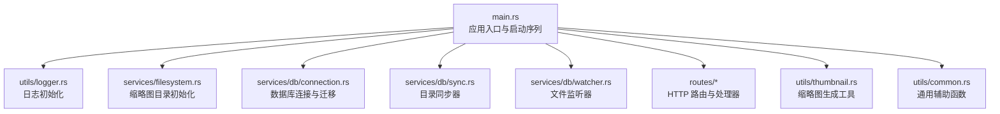
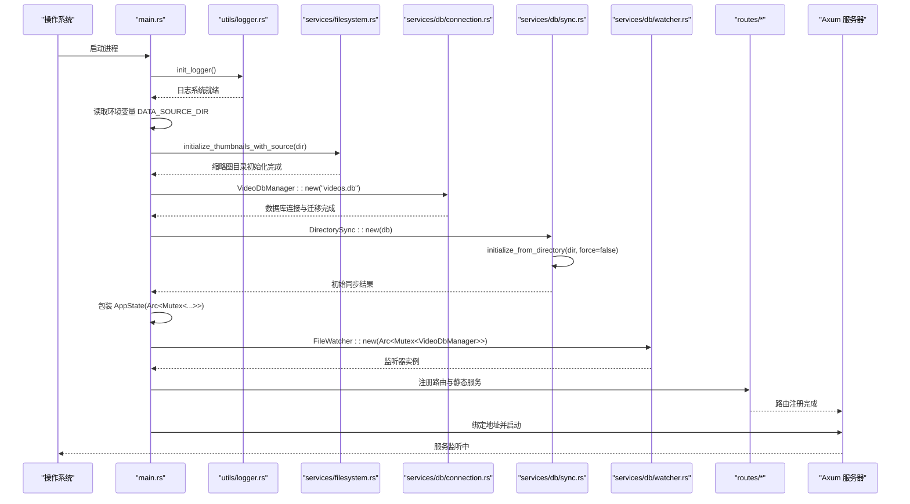
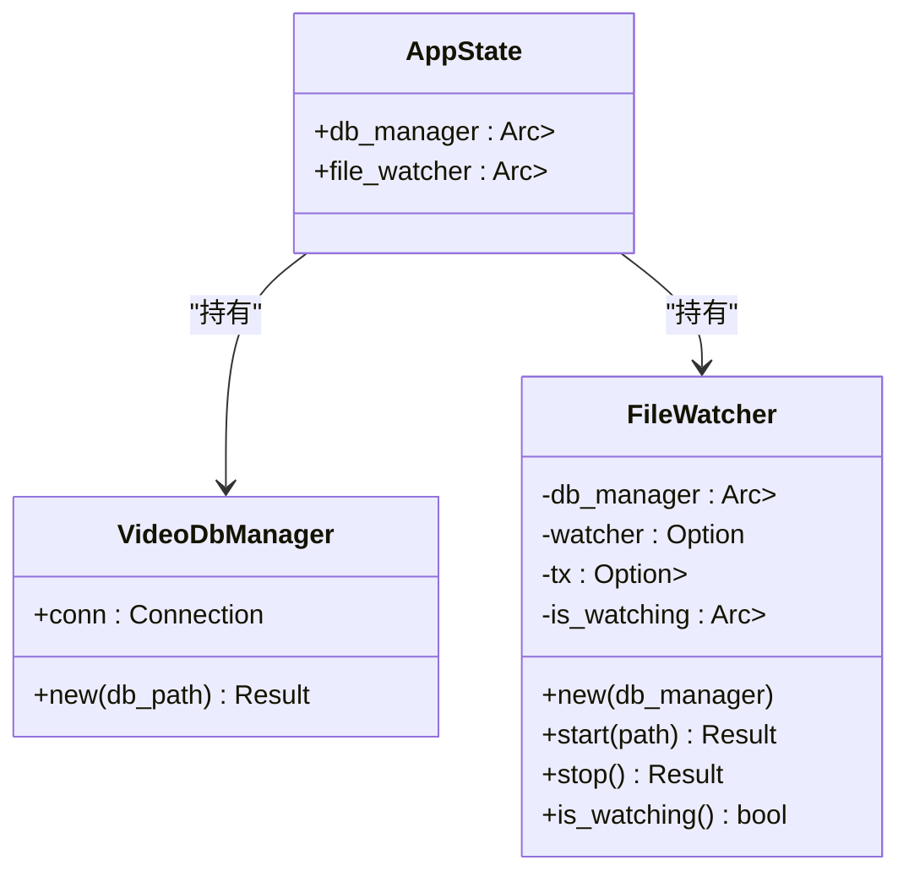
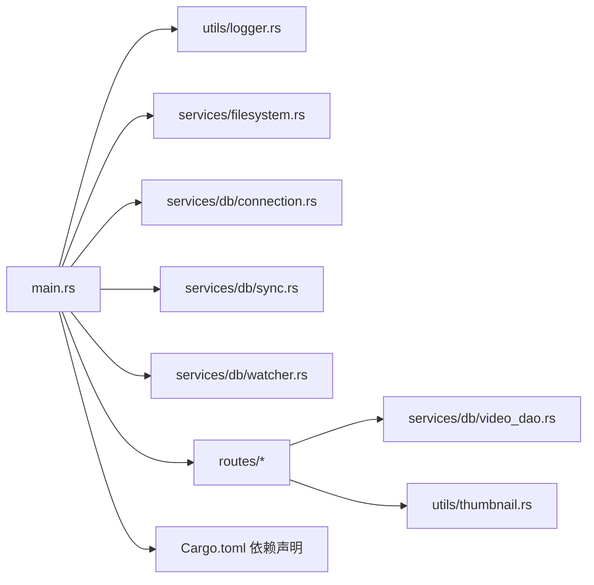

# 应用启动流程

<cite>
**本文引用的文件**
- [app/server/src/main.rs](file://app/server/src/main.rs)
- [app/server/src/utils/logger.rs](file://app/server/src/utils/logger.rs)
- [app/server/src/services/db/connection.rs](file://app/server/src/services/db/connection.rs)
- [app/server/src/services/filesystem.rs](file://app/server/src/services/filesystem.rs)
- [app/server/src/utils/thumbnail.rs](file://app/server/src/utils/thumbnail.rs)
- [app/server/src/services/db/watcher.rs](file://app/server/src/services/db/watcher.rs)
- [app/server/src/services/db/sync.rs](file://app/server/src/services/db/sync.rs)
- [app/server/src/services/db/video_dao.rs](file://app/server/src/services/db/video_dao.rs)
- [app/server/src/route/mod.rs](file://app/server/src/route/mod.rs)
- [app/server/src/route/video_handlers.rs](file://app/server/src/route/video_handlers.rs)
- [app/server/src/route/watcher_handlers.rs](file://app/server/src/route/watcher_handlers.rs)
- [app/server/src/utils/common.rs](file://app/server/src/utils/common.rs)
- [app/server/Cargo.toml](file://app/server/Cargo.toml)
</cite>

## 目录
1. [简介](#简介)
2. [项目结构](#项目结构)
3. [核心组件](#核心组件)
4. [架构总览](#架构总览)
5. [详细组件分析](#详细组件分析)
6. [依赖关系分析](#依赖关系分析)
7. [性能考量](#性能考量)
8. [故障排查指南](#故障排查指南)
9. [结论](#结论)

## 简介
本文件面向 Rust 后端应用的启动流程，系统性梳理从进程入口到服务可用的完整初始化链路。重点覆盖：
- 日志系统初始化与输出策略
- 数据源目录配置与缩略图目录设置
- 数据库连接建立与迁移
- 文件监听器与目录同步机制
- AppState 结构体设计与 Arc<Mutex<T>> 的使用模式
- 环境变量配置、错误处理策略与启动顺序
- 启动失败的常见原因与调试方法

## 项目结构
后端服务位于 app/server，采用模块化组织：
- 入口与路由：main.rs、routes/
- 业务服务：services/db、services/filesystem
- 工具与通用逻辑：utils/
- 依赖声明：Cargo.toml

图表来源
- [app/server/src/main.rs](file://app/server/src/main.rs#L1-L111)
- [app/server/src/utils/logger.rs](file://app/server/src/utils/logger.rs#L1-L100)
- [app/server/src/services/filesystem.rs](file://app/server/src/services/filesystem.rs#L1-L121)
- [app/server/src/services/db/connection.rs](file://app/server/src/services/db/connection.rs#L1-L122)
- [app/server/src/services/db/sync.rs](file://app/server/src/services/db/sync.rs#L1-L120)
- [app/server/src/services/db/watcher.rs](file://app/server/src/services/db/watcher.rs#L1-L164)
- [app/server/src/route/mod.rs](file://app/server/src/route/mod.rs#L1-L6)
- [app/server/src/utils/thumbnail.rs](file://app/server/src/utils/thumbnail.rs#L1-L99)
- [app/server/src/utils/common.rs](file://app/server/src/utils/common.rs#L1-L146)

章节来源
- [app/server/src/main.rs](file://app/server/src/main.rs#L1-L111)
- [app/server/Cargo.toml](file://app/server/Cargo.toml#L1-L23)

## 核心组件
- 日志系统：基于 log4rs 的控制台与滚动文件输出，彩色终端日志，按大小轮转。
- 数据库：rusqlite 连接，自动建表与索引，兼容旧版迁移。
- 缩略图：根据数据源目录批量生成缩略图；运行时按需生成并缓存。
- 文件监听与同步：基于 notify 的文件系统事件监听，配合 DirectorySync 实现增量同步。
- 路由与处理器：Axum 路由注册，提供视频列表、详情、手动同步、监听器启停等接口。
- AppState：统一应用状态，持有数据库与监听器的 Arc<Mutex<T>> 引用，供路由处理器安全共享。

章节来源
- [app/server/src/utils/logger.rs](file://app/server/src/utils/logger.rs#L1-L100)
- [app/server/src/services/db/connection.rs](file://app/server/src/services/db/connection.rs#L1-L122)
- [app/server/src/services/filesystem.rs](file://app/server/src/services/filesystem.rs#L1-L121)
- [app/server/src/utils/thumbnail.rs](file://app/server/src/utils/thumbnail.rs#L1-L99)
- [app/server/src/services/db/watcher.rs](file://app/server/src/services/db/watcher.rs#L1-L164)
- [app/server/src/services/db/sync.rs](file://app/server/src/services/db/sync.rs#L1-L120)
- [app/server/src/route/mod.rs](file://app/server/src/route/mod.rs#L1-L6)
- [app/server/src/main.rs](file://app/server/src/main.rs#L21-L60)

## 架构总览
应用启动时序如下：

图表来源
- [app/server/src/main.rs](file://app/server/src/main.rs#L27-L111)
- [app/server/src/utils/logger.rs](file://app/server/src/utils/logger.rs#L65-L99)
- [app/server/src/services/filesystem.rs](file://app/server/src/services/filesystem.rs#L9-L47)
- [app/server/src/services/db/connection.rs](file://app/server/src/services/db/connection.rs#L12-L47)
- [app/server/src/services/db/sync.rs](file://app/server/src/services/db/sync.rs#L43-L120)
- [app/server/src/services/db/watcher.rs](file://app/server/src/services/db/watcher.rs#L18-L123)
- [app/server/src/route/mod.rs](file://app/server/src/route/mod.rs#L1-L6)

## 详细组件分析

### 日志系统初始化
- 初始化步骤
  - 控制台输出：使用 PatternEncoder 输出到标准输出，并结合 ColorEncoder 实现彩色终端日志。
  - 文件输出：使用 RollingFileAppender，按大小触发轮转，保留固定窗口的旧日志文件。
  - 根级别：设置为 Info，过滤低级别日志。
- 影响范围
  - 启动阶段的日志输出（如数据库初始化、缩略图生成、监听器状态）均通过该初始化生效。
- 可观测性
  - 日志包含时间戳、级别、目标模块与消息正文，便于定位问题。

章节来源
- [app/server/src/utils/logger.rs](file://app/server/src/utils/logger.rs#L1-L100)

### 数据源目录与缩略图目录
- 数据源目录
  - 通过环境变量 DATA_SOURCE_DIR 获取；若未设置，默认使用 "public"。
  - 启动时打印实际使用的目录，便于确认。
- 缩略图目录初始化
  - 首次启动会确保 "thumbnails" 目录存在，并扫描数据源目录中缺少缩略图的媒体文件，使用并行方式批量生成缩略图。
  - 运行时按需生成：当请求访问某媒体缩略图且不存在时，会生成并缓存。
- 生成策略
  - 视频：使用 ffmpeg 截取首帧生成缩略图；失败时回退到默认 SVG 图标。
  - m3u8/ts：优先从 m3u8 对应的 ts 片段生成；否则回退默认图标。
  - 其他媒体：默认图标。

章节来源
- [app/server/src/main.rs](file://app/server/src/main.rs#L31-L37)
- [app/server/src/services/filesystem.rs](file://app/server/src/services/filesystem.rs#L9-L47)
- [app/server/src/utils/thumbnail.rs](file://app/server/src/utils/thumbnail.rs#L1-L99)

### 数据库连接与迁移
- 连接与建表
  - 使用 rusqlite 打开本地数据库文件 "videos.db"。
  - 自动创建 videos 表及必要索引（path、parent_path）。
- 迁移逻辑
  - 检测旧字段 is_deleted 是否存在，若存在则执行结构迁移：创建临时表、复制数据、删除原表并重命名临时表，最后重建索引。
- 错误处理
  - 迁移过程包含异常分支与日志提示；初始化失败会直接中断启动。

章节来源
- [app/server/src/services/db/connection.rs](file://app/server/src/services/db/connection.rs#L1-L122)

### 目录同步与文件监听
- 目录同步
  - DirectorySync::initialize_from_directory 会扫描数据源目录，构建 FileInfo 并与数据库进行双向同步。
  - 支持强制同步参数；同步完成后输出耗时统计。
- 文件监听
  - FileWatcher 基于 notify 监听文件系统事件，使用 mpsc 异步通道接收事件。
  - 防抖策略：事件间隔小于阈值时忽略，避免频繁同步。
  - 内容变更过滤：仅对视频相关路径的创建/修改/删除事件进行处理。
  - 生命周期：start/stop 状态受 Arc<Mutex<bool>> 管理，支持查询状态。

章节来源
- [app/server/src/services/db/sync.rs](file://app/server/src/services/db/sync.rs#L1-L120)
- [app/server/src/services/db/watcher.rs](file://app/server/src/services/db/watcher.rs#L1-L164)

### 路由与处理器
- 路由注册
  - 提供根路径、视频列表、视频详情、手动同步、监听器启停与状态查询等端点。
  - 静态文件服务：/public 与 /thumbnails 分别指向数据源目录与缩略图目录。
- 处理器要点
  - 视频详情：优先从数据库查询；若为目录或 m3u8，补充子节点。
  - 手动同步：调用 DirectorySync::sync_directory 触发同步。
  - 监听器启停：通过 AppState 中的 FileWatcher 实例控制。

章节来源
- [app/server/src/route/mod.rs](file://app/server/src/route/mod.rs#L1-L6)
- [app/server/src/route/video_handlers.rs](file://app/server/src/route/video_handlers.rs#L41-L81)
- [app/server/src/route/watcher_handlers.rs](file://app/server/src/route/watcher_handlers.rs#L49-L83)

### AppState 设计与 Arc<Mutex<T>> 使用
- 设计目的
  - 将数据库管理器与文件监听器封装为统一状态，通过 Arc<Mutex<T>> 在异步上下文中安全共享。
- 使用模式
  - main 中分别创建 Arc<Mutex<VideoDbManager>> 与 Arc<Mutex<FileWatcher>>，再组合成 AppState。
  - 路由处理器通过 State 提取 Arc<AppState>，内部再解包 Mutex 获取具体组件。
- 并发与性能
  - 读多写少场景下，建议在处理器内部短时加锁，避免长时间持有互斥锁。
  - 对于高并发请求，可考虑分层缓存与只读快照以降低锁竞争。

图表来源
- [app/server/src/main.rs](file://app/server/src/main.rs#L21-L60)
- [app/server/src/services/db/connection.rs](file://app/server/src/services/db/connection.rs#L1-L47)
- [app/server/src/services/db/watcher.rs](file://app/server/src/services/db/watcher.rs#L1-L164)

章节来源
- [app/server/src/main.rs](file://app/server/src/main.rs#L21-L60)

## 依赖关系分析
- 启动阶段依赖链
  - main 依赖 logger、filesystem、db/connection、db/sync、db/watcher。
  - 路由依赖 db/video_dao 与 utils/thumbnail。
- 关键外部依赖
  - tokio、axum、tower-http、rusqlite、notify、log/log4rs、rayon、chrono、anyhow。

图表来源
- [app/server/src/main.rs](file://app/server/src/main.rs#L1-L111)
- [app/server/Cargo.toml](file://app/server/Cargo.toml#L1-L23)

章节来源
- [app/server/Cargo.toml](file://app/server/Cargo.toml#L1-L23)

## 性能考量
- 缩略图生成
  - 启动时使用 rayon 并行生成，显著提升大规模媒体库的初始化效率。
  - 运行时按需生成，避免重复计算；生成后缓存至 thumbnails 目录。
- 数据库
  - 建立索引以优化查询；迁移过程采用临时表+重命名，减少锁时间。
- 文件监听
  - 防抖策略降低同步频率；仅对视频相关路径事件响应，减少无效工作。
- 日志
  - 控制台彩色输出便于快速定位；文件轮转避免日志过大影响性能。

[本节为通用性能建议，不直接分析具体文件]

## 故障排查指南
- 启动失败常见原因
  - 数据库文件权限不足或路径不可写："videos.db" 创建失败。
  - ffmpeg 不可用或无权限：缩略图生成失败，回退默认图标但可能影响前端展示。
  - DATA_SOURCE_DIR 指向不存在目录：缩略图初始化与后续同步会失败。
  - 端口占用：默认绑定 3003，若被占用无法启动。
  - 监听器路径不存在：FileWatcher.start 会返回错误。
- 定位方法
  - 查看日志：启动阶段会输出数据库、缩略图、监听器初始化状态。
  - 确认环境变量：DATA_SOURCE_DIR 是否正确设置。
  - 验证目录权限：public 与 thumbnails 目录可读写。
  - 验证 ffmpeg：命令行可执行，且有足够权限。
  - 检查端口占用：更换端口或释放占用进程。
- 解决方案
  - 修复权限与路径：确保 public、thumbnails、videos.db 所在目录具备读写权限。
  - 安装并配置 ffmpeg：确保其在 PATH 中且可执行。
  - 设置正确的 DATA_SOURCE_DIR：指向包含媒体文件的真实目录。
  - 更换端口：修改绑定地址或释放 3003 端口。
  - 重启监听器：停止后再启动，确保路径有效。

章节来源
- [app/server/src/main.rs](file://app/server/src/main.rs#L31-L47)
- [app/server/src/services/filesystem.rs](file://app/server/src/services/filesystem.rs#L49-L121)
- [app/server/src/utils/thumbnail.rs](file://app/server/src/utils/thumbnail.rs#L41-L80)
- [app/server/src/services/db/watcher.rs](file://app/server/src/services/db/watcher.rs#L30-L44)

## 结论
本应用启动流程清晰、模块职责明确：日志先行、目录与缩略图准备、数据库连接与迁移、目录同步与监听器初始化，最终通过 Axum 提供稳定的 HTTP 服务。AppState 通过 Arc<Mutex<T>> 将核心资源安全地暴露给路由处理器。遵循本文档的配置与排错建议，可有效提升启动成功率与运行稳定性。