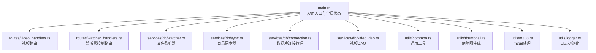
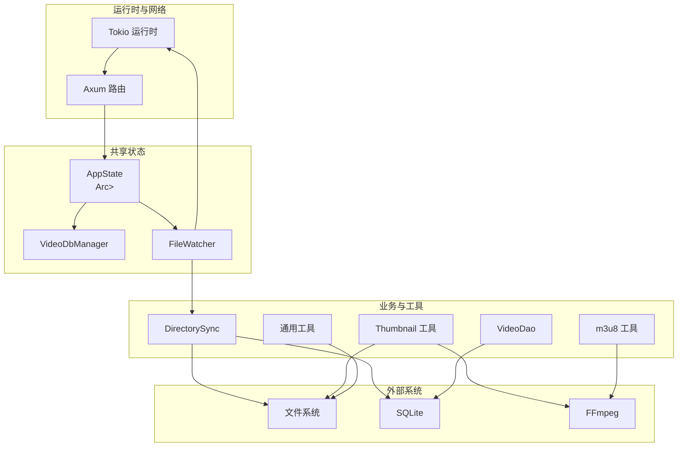
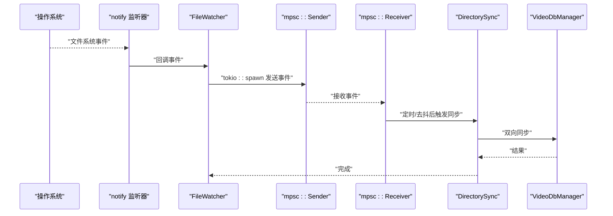
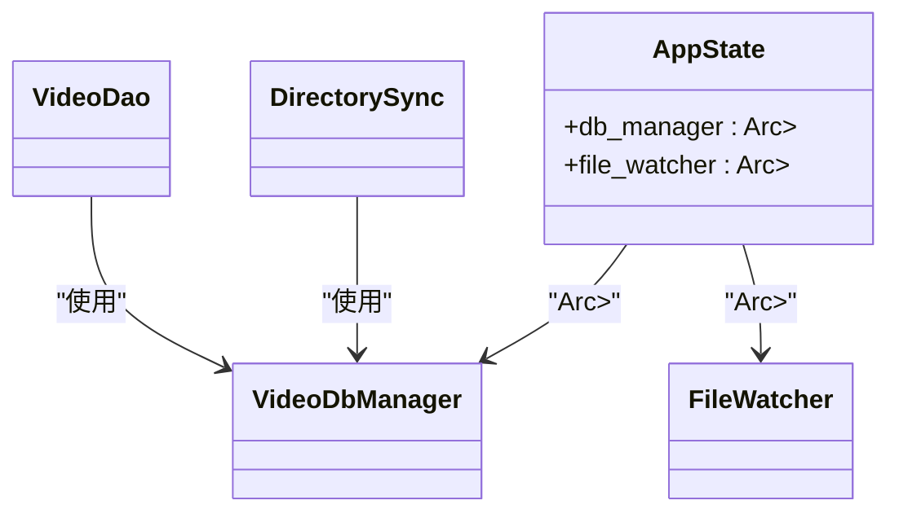
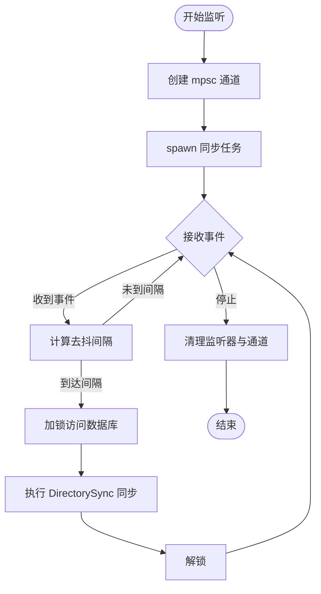
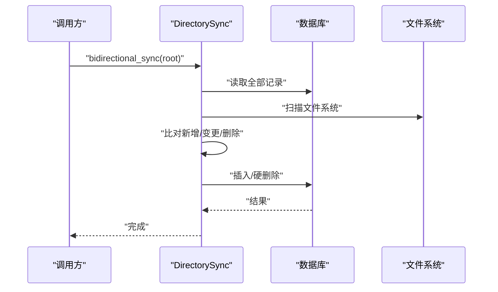
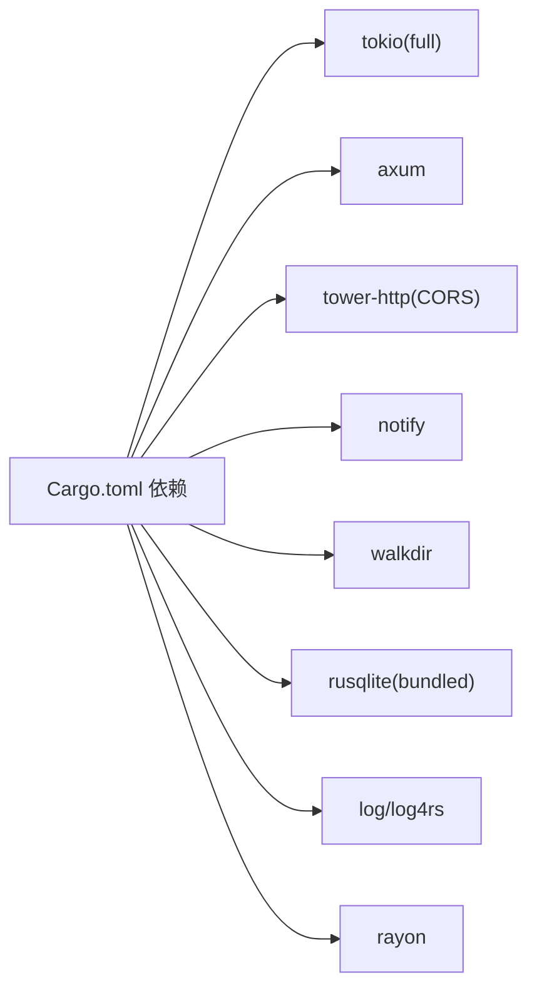

# 异步并发处理

<cite>
**本文引用的文件**
- [app/server/src/main.rs](file://app/server/src/main.rs)
- [app/server/src/routes/video_handlers.rs](file://app/server/src/routes/video_handlers.rs)
- [app/server/src/routes/watcher_handlers.rs](file://app/server/src/routes/watcher_handlers.rs)
- [app/server/src/services/db/watcher.rs](file://app/server/src/services/db/watcher.rs)
- [app/server/src/services/db/sync.rs](file://app/server/src/services/db/sync.rs)
- [app/server/src/services/db/connection.rs](file://app/server/src/services/db/connection.rs)
- [app/server/src/services/db/video_dao.rs](file://app/server/src/services/db/video_dao.rs)
- [app/server/src/utils/common.rs](file://app/server/src/utils/common.rs)
- [app/server/src/utils/thumbnail.rs](file://app/server/src/utils/thumbnail.rs)
- [app/server/src/utils/m3u8.rs](file://app/server/src/utils/m3u8.rs)
- [app/server/src/utils/logger.rs](file://app/server/src/utils/logger.rs)
- [app/server/Cargo.toml](file://app/server/Cargo.toml)
</cite>

## 目录
1. [简介](#简介)
2. [项目结构](#项目结构)
3. [核心组件](#核心组件)
4. [架构总览](#架构总览)
5. [详细组件分析](#详细组件分析)
6. [依赖关系分析](#依赖关系分析)
7. [性能考量](#性能考量)
8. [故障排查指南](#故障排查指南)
9. [结论](#结论)
10. [附录](#附录)

## 简介
本文件围绕异步并发处理机制进行系统化文档化，重点覆盖以下方面：
- Tokio 运行时的使用与任务调度策略
- Arc<Mutex<T>> 共享状态管理模式与线程安全考量
- 文件监控的异步实现、事件处理循环与并发控制
- 背压处理、超时管理与资源清理机制
- 并发性能优化与内存泄漏防护最佳实践

该系统基于 Rust 的异步生态，采用 Tokio 作为运行时，Axum 提供 HTTP 路由与中间件，数据库访问通过 SQLite 完成，文件系统监控使用 notify 库，并结合 mpsc 通道实现事件驱动的自动同步。

## 项目结构
后端服务位于 app/server，主要模块划分如下：
- 入口与应用状态：main.rs 中定义 AppState，包含 Arc<Mutex<VideoDbManager>> 与 Arc<Mutex<FileWatcher>>
- 路由层：video_handlers.rs 与 watcher_handlers.rs 提供 API 接口
- 业务服务：db 模块负责数据库连接、DAO、目录同步与文件监听
- 工具模块：common、thumbnail、m3u8、logger 等辅助功能
- 依赖：Cargo.toml 明确 tokio、notify、axum、rusqlite 等依赖

图表来源
- [app/server/src/main.rs](file://app/server/src/main.rs#L1-L111)
- [app/server/src/routes/video_handlers.rs](file://app/server/src/routes/video_handlers.rs#L1-L104)
- [app/server/src/routes/watcher_handlers.rs](file://app/server/src/routes/watcher_handlers.rs#L1-L84)
- [app/server/src/services/db/watcher.rs](file://app/server/src/services/db/watcher.rs#L1-L182)
- [app/server/src/services/db/sync.rs](file://app/server/src/services/db/sync.rs#L1-L413)
- [app/server/src/services/db/connection.rs](file://app/server/src/services/db/connection.rs#L1-L122)
- [app/server/src/services/db/video_dao.rs](file://app/server/src/services/db/video_dao.rs#L1-L146)
- [app/server/src/utils/common.rs](file://app/server/src/utils/common.rs#L1-L146)
- [app/server/src/utils/thumbnail.rs](file://app/server/src/utils/thumbnail.rs#L1-L99)
- [app/server/src/utils/m3u8.rs](file://app/server/src/utils/m3u8.rs#L1-L148)
- [app/server/src/utils/logger.rs](file://app/server/src/utils/logger.rs#L1-L100)

章节来源
- [app/server/src/main.rs](file://app/server/src/main.rs#L1-L111)
- [app/server/Cargo.toml](file://app/server/Cargo.toml#L1-L23)

## 核心组件
- 应用状态 AppState：持有数据库管理器与文件监听器的 Arc<Mutex<_>>，通过 State 注入到各路由处理器
- 文件监听器 FileWatcher：封装 notify 监听器、Tokio mpsc 通道、内部 is_watching 标志位，实现事件过滤、去抖与异步同步
- 目录同步器 DirectorySync：扫描文件系统与数据库双向同步，支持全量/增量模式
- 数据库连接 VideoDbManager：SQLite 连接与迁移逻辑
- 视频 DAO VideoDao：提供查询接口，构建树形结构与父子关系
- 工具模块：通用文件判断、缩略图生成、m3u8 合并、日志初始化

章节来源
- [app/server/src/main.rs](file://app/server/src/main.rs#L21-L60)
- [app/server/src/services/db/watcher.rs](file://app/server/src/services/db/watcher.rs#L1-L182)
- [app/server/src/services/db/sync.rs](file://app/server/src/services/db/sync.rs#L1-L172)
- [app/server/src/services/db/connection.rs](file://app/server/src/services/db/connection.rs#L1-L122)
- [app/server/src/services/db/video_dao.rs](file://app/server/src/services/db/video_dao.rs#L1-L146)
- [app/server/src/utils/common.rs](file://app/server/src/utils/common.rs#L1-L146)
- [app/server/src/utils/thumbnail.rs](file://app/server/src/utils/thumbnail.rs#L1-L99)
- [app/server/src/utils/m3u8.rs](file://app/server/src/utils/m3u8.rs#L1-L148)
- [app/server/src/utils/logger.rs](file://app/server/src/utils/logger.rs#L1-L100)

## 架构总览
系统采用“HTTP 服务器 + 异步监听 + 数据库”的分层架构。Tokio 运行时驱动异步任务；Axum 路由接收请求；共享状态通过 Arc<Mutex<T>> 保护；文件监控通过 notify 事件与 mpsc 通道解耦；同步逻辑在独立任务中执行，避免阻塞主线程。

图表来源
- [app/server/src/main.rs](file://app/server/src/main.rs#L21-L111)
- [app/server/src/services/db/watcher.rs](file://app/server/src/services/db/watcher.rs#L1-L182)
- [app/server/src/services/db/sync.rs](file://app/server/src/services/db/sync.rs#L1-L413)
- [app/server/src/services/db/connection.rs](file://app/server/src/services/db/connection.rs#L1-L122)
- [app/server/src/services/db/video_dao.rs](file://app/server/src/services/db/video_dao.rs#L1-L146)
- [app/server/src/utils/thumbnail.rs](file://app/server/src/utils/thumbnail.rs#L1-L99)
- [app/server/src/utils/m3u8.rs](file://app/server/src/utils/m3u8.rs#L1-L148)

## 详细组件分析

### Tokio 运行时与任务调度
- 入口使用 #[tokio::main] 启动运行时，绑定 TCP 监听并启动 Axum 服务器
- 文件监听器内部使用 tokio::spawn 启动异步任务，持续从 mpsc 接收事件并执行同步
- 事件回调中通过 tokio::spawn 将事件发送到通道，避免阻塞底层监听器
- 调度策略：事件驱动 + 任务池，适合 I/O 密集型场景；通过通道实现背压

图表来源
- [app/server/src/main.rs](file://app/server/src/main.rs#L108-L111)
- [app/server/src/services/db/watcher.rs](file://app/server/src/services/db/watcher.rs#L46-L123)
- [app/server/src/services/db/sync.rs](file://app/server/src/services/db/sync.rs#L81-L172)

章节来源
- [app/server/src/main.rs](file://app/server/src/main.rs#L27-L111)
- [app/server/src/services/db/watcher.rs](file://app/server/src/services/db/watcher.rs#L46-L123)

### Arc<Mutex<T>> 共享状态管理模式与线程安全
- AppState 将数据库管理器与文件监听器放入 Arc<Mutex<_>>，确保跨任务共享与互斥访问
- 路由处理器通过 State 提取 Arc<AppState>，在每次使用前加锁获取内部资源
- 线程安全要点：
  - 仅在短时间持有锁，避免长时间阻塞
  - 将昂贵操作（如数据库查询）放在锁外进行，减少临界区时间
  - 避免在锁内进行 I/O 或调用可能阻塞的外部程序（如 FFmpeg）

图表来源
- [app/server/src/main.rs](file://app/server/src/main.rs#L21-L60)
- [app/server/src/services/db/connection.rs](file://app/server/src/services/db/connection.rs#L1-L47)
- [app/server/src/services/db/watcher.rs](file://app/server/src/services/db/watcher.rs#L1-L27)
- [app/server/src/services/db/video_dao.rs](file://app/server/src/services/db/video_dao.rs#L1-L20)

章节来源
- [app/server/src/main.rs](file://app/server/src/main.rs#L21-L60)
- [app/server/src/routes/video_handlers.rs](file://app/server/src/routes/video_handlers.rs#L14-L28)
- [app/server/src/routes/watcher_handlers.rs](file://app/server/src/routes/watcher_handlers.rs#L18-L42)

### 文件监控的异步实现、事件处理循环与并发控制
- 事件过滤：仅对内容变化（Create/Modify/Remove）且与视频相关路径进行处理
- 去抖策略：每 5 秒内仅执行一次同步，避免频繁写入数据库
- 并发控制：
  - 回调中通过 tokio::spawn 将事件投递到 mpsc 通道
  - 同步任务从通道接收事件，按序处理，内部再次加锁访问数据库
  - stop 时清空监听器与通道，释放资源

图表来源
- [app/server/src/services/db/watcher.rs](file://app/server/src/services/db/watcher.rs#L46-L123)
- [app/server/src/services/db/watcher.rs](file://app/server/src/services/db/watcher.rs#L125-L182)

章节来源
- [app/server/src/services/db/watcher.rs](file://app/server/src/services/db/watcher.rs#L1-L182)

### 背压处理、超时管理与资源清理
- 背压处理：mpsc::channel 设置容量为 100，限制事件积压；当通道满时 send 会等待消费者消费
- 超时管理：同步任务内部未显式设置超时；建议在 DirectorySync 中对耗时操作（如 FFmpeg、数据库事务）增加超时包装
- 资源清理：stop 时关闭监听器、丢弃 Sender、清空 is_watching 标志，避免悬挂任务

章节来源
- [app/server/src/services/db/watcher.rs](file://app/server/src/services/db/watcher.rs#L46-L123)
- [app/server/src/services/db/watcher.rs](file://app/server/src/services/db/watcher.rs#L125-L182)

### 目录同步与数据库一致性
- 双向同步：先读取数据库记录，再扫描文件系统，最后处理新增/变更/删除
- 关键字段对比：仅比较 name 与 created_at，避免不必要的重复写入
- m3u8 特殊处理：合并为 mp4 并删除原始目录，缩略图生成策略针对不同文件类型

图表来源
- [app/server/src/services/db/sync.rs](file://app/server/src/services/db/sync.rs#L86-L172)
- [app/server/src/services/db/sync.rs](file://app/server/src/services/db/sync.rs#L174-L263)
- [app/server/src/services/db/sync.rs](file://app/server/src/services/db/sync.rs#L298-L376)
- [app/server/src/services/db/video_dao.rs](file://app/server/src/services/db/video_dao.rs#L51-L79)

章节来源
- [app/server/src/services/db/sync.rs](file://app/server/src/services/db/sync.rs#L1-L413)
- [app/server/src/services/db/video_dao.rs](file://app/server/src/services/db/video_dao.rs#L1-L146)

### 缩略图生成与 m3u8 合并
- 缩略图生成：根据文件类型选择不同策略，必要时调用 FFmpeg；若失败生成默认缩略图
- m3u8 合并：调用 FFmpeg 将片段合并为 mp4，并删除原目录

章节来源
- [app/server/src/utils/thumbnail.rs](file://app/server/src/utils/thumbnail.rs#L1-L99)
- [app/server/src/utils/m3u8.rs](file://app/server/src/utils/m3u8.rs#L44-L128)

## 依赖关系分析
- 运行时与网络：tokio(full)、axum、tower-http(CORS)
- 文件系统与监控：notify、walkdir
- 数据库：rusqlite(bundled)
- 工具：regex、chrono、rayon(并行遍历)
- 日志：log、log4rs、nu-ansi-term

图表来源
- [app/server/Cargo.toml](file://app/server/Cargo.toml#L1-L23)

章节来源
- [app/server/Cargo.toml](file://app/server/Cargo.toml#L1-L23)

## 性能考量
- 事件处理链路优化
  - 降低回调开销：在回调中仅做轻量转发，避免在锁内执行 I/O
  - 去抖参数权衡：5 秒间隔可显著降低同步频率，但需根据实际场景调整
  - 通道容量：100 的容量适中，可根据事件密度调整
- 数据库访问优化
  - 批量操作：在 DirectorySync 中尽量减少多次往返，合并插入/删除
  - 索引维护：确保 path 与 parent_path 索引有效
- I/O 与外部进程
  - FFmpeg 调用应避免阻塞主线程；可考虑在独立任务中执行并设置超时
  - 缩略图生成可并行化（注意目录创建的并发安全）
- 内存与资源
  - 避免在锁内持有大量临时数据
  - 及时清理不再使用的 Arc/Mutex 引用，防止循环引用

## 故障排查指南
- 监听器无法启动
  - 检查路径是否存在与权限
  - 确认 is_watching 标志未被错误置位
- 同步未生效
  - 查看去抖间隔是否导致延迟
  - 检查事件过滤条件是否匹配目标路径
- 数据库异常
  - 查看迁移日志与索引状态
  - 检查事务是否正确提交/回滚
- 缩略图与 m3u8 处理失败
  - 确认 FFmpeg 是否可用
  - 检查输出目录权限与磁盘空间

章节来源
- [app/server/src/services/db/watcher.rs](file://app/server/src/services/db/watcher.rs#L125-L182)
- [app/server/src/services/db/connection.rs](file://app/server/src/services/db/connection.rs#L50-L122)
- [app/server/src/utils/thumbnail.rs](file://app/server/src/utils/thumbnail.rs#L1-L99)
- [app/server/src/utils/m3u8.rs](file://app/server/src/utils/m3u8.rs#L44-L128)

## 结论
该系统通过 Tokio 异步运行时与 notify 事件驱动，结合 mpsc 通道与 Arc<Mutex<T>> 共享状态，实现了高效的文件监控与数据库同步。通过去抖、背压与最小化锁持有时间等策略，在保证一致性的同时兼顾了性能与稳定性。建议后续引入超时控制与更细粒度的并发隔离，以进一步提升鲁棒性。

## 附录
- 最佳实践清单
  - 保持锁临界区最小化，避免在锁内进行 I/O 或外部调用
  - 使用去抖与背压策略控制同步频率
  - 为耗时操作增加超时与重试机制
  - 严格管理资源生命周期，及时清理监听器与通道
  - 对缩略图生成与 FFmpeg 调用进行并发安全与错误兜底