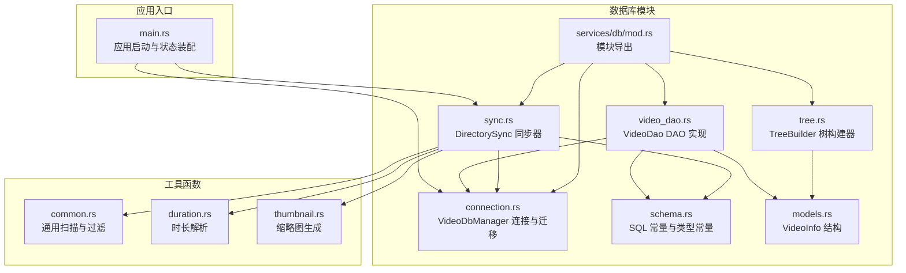
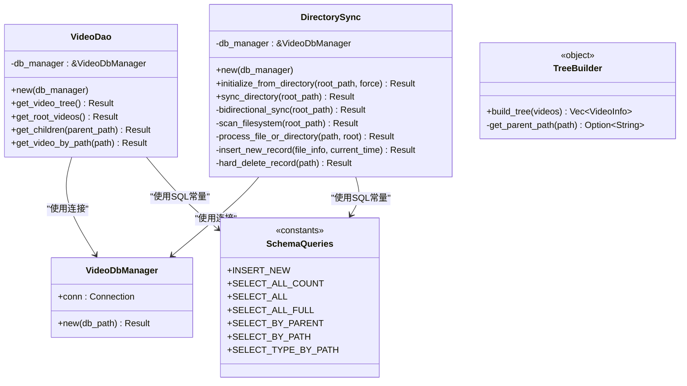
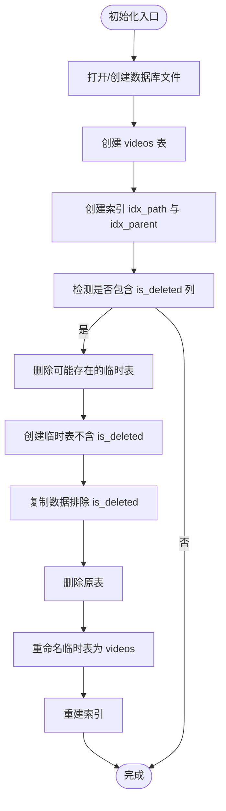
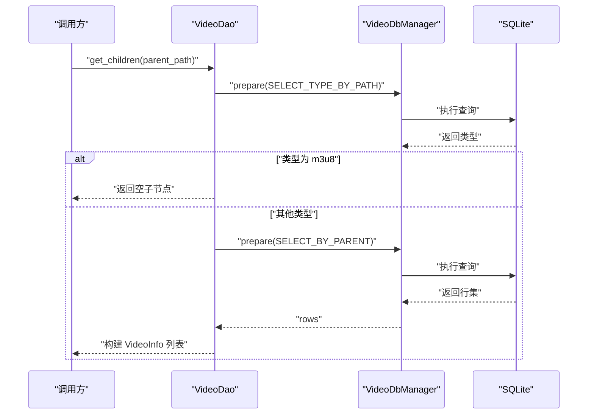
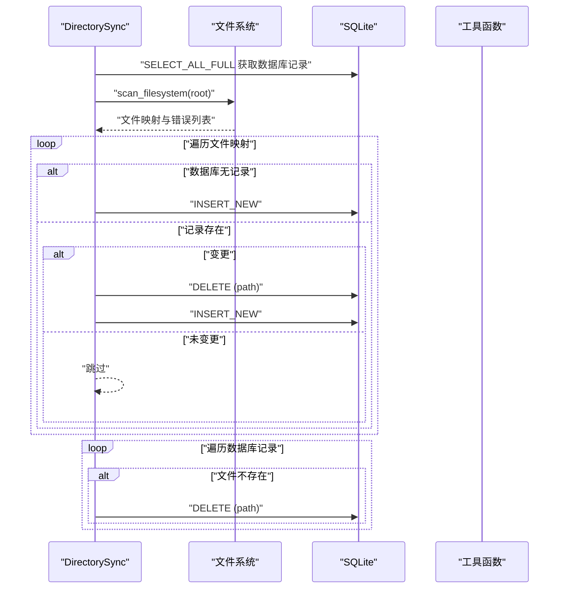
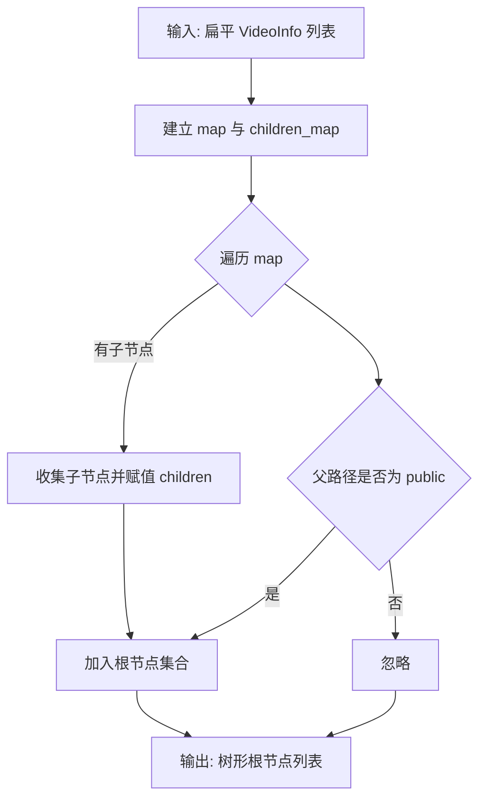
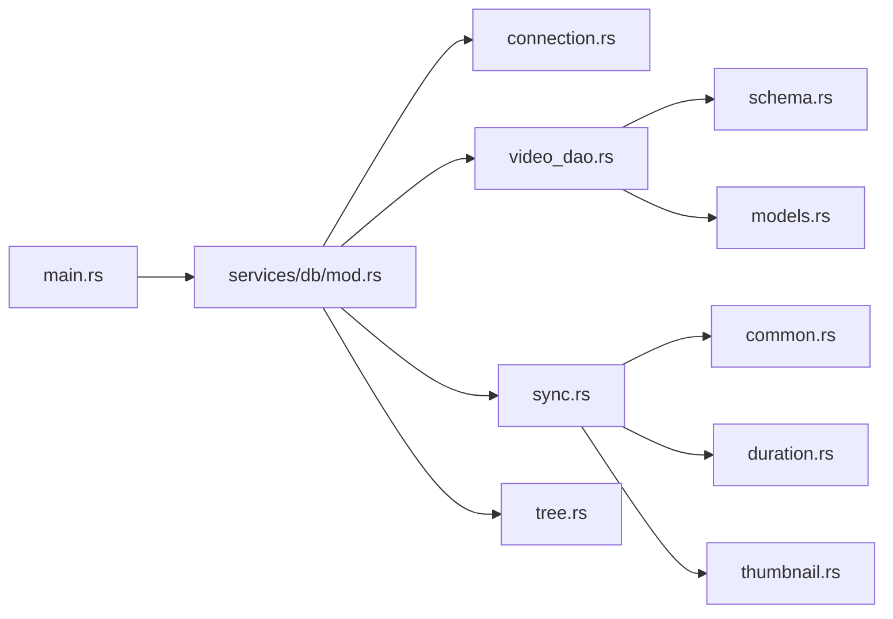

# 数据访问层

<cite>
**本文引用的文件**
- [main.rs](file://app/server/src/main.rs)
- [connection.rs](file://app/server/src/services/db/connection.rs)
- [schema.rs](file://app/server/src/services/db/schema.rs)
- [video_dao.rs](file://app/server/src/services/db/video_dao.rs)
- [sync.rs](file://app/server/src/services/db/sync.rs)
- [tree.rs](file://app/server/src/services/db/tree.rs)
- [models.rs](file://app/server/src/models.rs)
- [common.rs](file://app/server/src/utils/common.rs)
- [duration.rs](file://app/server/src/utils/duration.rs)
- [thumbnail.rs](file://app/server/src/utils/thumbnail.rs)
- [mod.rs](file://app/server/src/services/db/mod.rs)
- [Cargo.toml](file://app/server/Cargo.toml)
</cite>

## 目录
1. [简介](#简介)
2. [项目结构](#项目结构)
3. [核心组件](#核心组件)
4. [架构总览](#架构总览)
5. [详细组件分析](#详细组件分析)
6. [依赖分析](#依赖分析)
7. [性能考虑](#性能考虑)
8. [故障排查指南](#故障排查指南)
9. [结论](#结论)
10. [附录](#附录)

## 简介
本文件面向数据访问层（Data Access Layer），围绕 SQLite 数据库连接管理、事务处理机制、DAO 模式实现、数据库模式设计、目录同步与树形结构管理、批量操作优化以及性能调优与故障恢复进行系统化文档化。重点覆盖以下方面：
- 连接管理与迁移：VideoDbManager 的初始化、表结构创建与索引、历史字段迁移。
- DAO 模式：VideoDao 的 CRUD 与查询优化，树形结构构建。
- 目录同步：双向同步策略、文件系统扫描与变更检测、批量写入。
- 性能与可靠性：索引策略、查询排序、批处理与日志监控。

## 项目结构
数据访问层位于 Rust 后端服务中，采用模块化组织，核心文件如下：
- 连接管理：services/db/connection.rs
- 查询常量与模式：services/db/schema.rs
- DAO 实现：services/db/video_dao.rs
- 同步与树构建：services/db/sync.rs、services/db/tree.rs
- 应用入口与状态：app/server/src/main.rs
- 模型定义：app/server/src/models.rs
- 工具函数：utils/common.rs、utils/duration.rs、utils/thumbnail.rs
- 模块导出：services/db/mod.rs
- 依赖声明：app/server/Cargo.toml

图表来源
- [main.rs](file://app/server/src/main.rs#L1-L111)
- [connection.rs](file://app/server/src/services/db/connection.rs#L1-L122)
- [schema.rs](file://app/server/src/services/db/schema.rs#L1-L42)
- [video_dao.rs](file://app/server/src/services/db/video_dao.rs#L1-L146)
- [sync.rs](file://app/server/src/services/db/sync.rs#L1-L413)
- [tree.rs](file://app/server/src/services/db/tree.rs#L1-L78)
- [models.rs](file://app/server/src/models.rs#L1-L32)
- [common.rs](file://app/server/src/utils/common.rs#L1-L146)
- [duration.rs](file://app/server/src/utils/duration.rs#L1-L66)
- [thumbnail.rs](file://app/server/src/utils/thumbnail.rs#L1-L99)
- [mod.rs](file://app/server/src/services/db/mod.rs#L1-L16)

章节来源
- [main.rs](file://app/server/src/main.rs#L1-L111)
- [mod.rs](file://app/server/src/services/db/mod.rs#L1-L16)

## 核心组件
- VideoDbManager：负责打开/创建数据库、创建表与索引、执行迁移。
- VideoDao：提供树形查询、根目录查询、子节点查询、按路径查询等。
- DirectorySync：双向同步器，扫描文件系统并同步至数据库，支持强制重建与增量同步。
- TreeBuilder：将扁平视频列表转换为树形结构，支持父子关系与根节点识别。
- Schema.queries：集中管理 SQL 常量，保证查询一致性与可维护性。
- 工具函数：is_video_or_container、get_video_duration、get_m3u8_duration、get_ensure_thumbnail 等，支撑同步与展示。

章节来源
- [connection.rs](file://app/server/src/services/db/connection.rs#L1-L122)
- [video_dao.rs](file://app/server/src/services/db/video_dao.rs#L1-L146)
- [sync.rs](file://app/server/src/services/db/sync.rs#L1-L413)
- [tree.rs](file://app/server/src/services/db/tree.rs#L1-L78)
- [schema.rs](file://app/server/src/services/db/schema.rs#L1-L42)
- [models.rs](file://app/server/src/models.rs#L1-L32)
- [common.rs](file://app/server/src/utils/common.rs#L1-L146)
- [duration.rs](file://app/server/src/utils/duration.rs#L1-L66)
- [thumbnail.rs](file://app/server/src/utils/thumbnail.rs#L1-L99)

## 架构总览
数据访问层采用“连接管理 + DAO + 同步器 + 树构建”的分层设计：
- 连接管理：集中创建/迁移数据库，确保表结构与索引就绪。
- DAO：封装查询逻辑，提供树形结构与层级查询能力。
- 同步器：负责文件系统与数据库之间的双向同步，批量写入与删除。
- 树构建：在应用层将扁平结果转为树形结构，便于前端渲染。

图表来源
- [connection.rs](file://app/server/src/services/db/connection.rs#L1-L122)
- [video_dao.rs](file://app/server/src/services/db/video_dao.rs#L1-L146)
- [sync.rs](file://app/server/src/services/db/sync.rs#L1-L413)
- [tree.rs](file://app/server/src/services/db/tree.rs#L1-L78)
- [schema.rs](file://app/server/src/services/db/schema.rs#L1-L42)

## 详细组件分析

### 连接管理与迁移（VideoDbManager）
- 初始化流程
  - 打开数据库文件，若不存在则创建。
  - 创建 videos 表，包含主键、唯一路径、类型、缩略图、时长、大小、分辨率、码率、编解码、创建时间、字幕、父路径、最后修改时间等字段。
  - 创建索引：idx_path（基于 path）、idx_parent（基于 parent_path）。
  - 执行迁移：检测旧版 is_deleted 字段，如存在则重建表并迁移数据，随后重建索引。
- 迁移策略
  - 通过 PRAGMA table_info 检测列是否存在。
  - 采用临时表方案：复制数据后替换原表，避免直接 ALTER TABLE 的限制。
  - 保持数据完整性与索引一致性。

图表来源
- [connection.rs](file://app/server/src/services/db/connection.rs#L1-L122)

章节来源
- [connection.rs](file://app/server/src/services/db/connection.rs#L1-L122)

### 数据访问对象（VideoDao）与查询优化
- 角色定位
  - 作为 DAO 层，封装对 videos 表的查询与树形结构构建。
- 主要方法
  - get_video_tree：获取全部记录并构建树形结构。
  - get_root_videos：按父路径为 public 的根目录项。
  - get_children：按父路径查询子节点；对 m3u8 类型特殊处理，返回空子集。
  - get_video_by_path：按唯一路径查询单条记录。
- 查询优化
  - 使用 schema.queries 中的 SQL 常量，统一排序规则（type 降序、name 升序）。
  - 通过 idx_path 与 idx_parent 索引提升查询效率。
  - 对 m3u8 类型的子节点查询提前判断类型，避免无效扫描。

图表来源
- [video_dao.rs](file://app/server/src/services/db/video_dao.rs#L1-L146)
- [schema.rs](file://app/server/src/services/db/schema.rs#L1-L42)
- [connection.rs](file://app/server/src/services/db/connection.rs#L1-L122)

章节来源
- [video_dao.rs](file://app/server/src/services/db/video_dao.rs#L1-L146)
- [schema.rs](file://app/server/src/services/db/schema.rs#L1-L42)

### 目录同步机制（DirectorySync）
- 双向同步策略
  - 若数据库已有记录且非强制重建，执行增量同步：对比文件系统与数据库，新增/变更硬删除旧记录再插入新记录，删除数据库中不存在的记录。
  - 强制重建时清空表后全量同步。
- 扫描与过滤
  - 使用 walkdir 递归扫描，结合 is_video_or_container 过滤视频/容器/字幕/图片等类型。
  - 对 m3u8 目录特殊处理：合并为 mp4 并生成缩略图，同时记录目录级时长。
  - 对 ts 文件：若同目录存在 m3u8 则跳过。
- 变更检测
  - 仅比较 name 与 created_at，path 为唯一标识。
- 批量写入与删除
  - 新增/变更：硬删除旧记录并插入新记录。
  - 删除：按 path 执行 DELETE。
- 性能与可观测性
  - 分阶段计时：查询、扫描、处理、删除、总耗时。
  - 日志记录扫描错误与统计信息。

图表来源
- [sync.rs](file://app/server/src/services/db/sync.rs#L1-L413)
- [schema.rs](file://app/server/src/services/db/schema.rs#L1-L42)
- [common.rs](file://app/server/src/utils/common.rs#L1-L146)
- [duration.rs](file://app/server/src/utils/duration.rs#L1-L66)
- [thumbnail.rs](file://app/server/src/utils/thumbnail.rs#L1-L99)

章节来源
- [sync.rs](file://app/server/src/services/db/sync.rs#L1-L413)
- [common.rs](file://app/server/src/utils/common.rs#L1-L146)
- [duration.rs](file://app/server/src/utils/duration.rs#L1-L66)
- [thumbnail.rs](file://app/server/src/utils/thumbnail.rs#L1-L99)

### 树形结构管理（TreeBuilder）
- 功能概述
  - 将扁平的 VideoInfo 列表转换为树形结构，自动挂载子节点，并筛选根节点（父路径为 public）。
- 关键步骤
  - 第一遍：建立路径到节点的映射，收集父子关系。
  - 第二遍：为每个节点附加子节点列表，保留根节点集合。
- 复杂度
  - 时间复杂度 O(N)，空间复杂度 O(N)。

图表来源
- [tree.rs](file://app/server/src/services/db/tree.rs#L1-L78)
- [models.rs](file://app/server/src/models.rs#L1-L32)

章节来源
- [tree.rs](file://app/server/src/services/db/tree.rs#L1-L78)
- [models.rs](file://app/server/src/models.rs#L1-L32)

### 数据库模式设计、表关系与索引策略
- 表结构（videos）
  - 主键：id（自增）
  - 唯一约束：path
  - 字段：name、type、thumbnail、duration、size、resolution、bitrate、codec、created_at、subtitle、parent_path、last_modified
- 关系与索引
  - parent_path 与 path 建立索引，支持按父路径查询与唯一路径查询。
  - 排序：SELECT_ALL 与 SELECT_BY_PARENT 使用 type DESC、name ASC，有利于前端展示顺序稳定。
- 迁移策略
  - 自动检测旧字段并重建表，保证兼容性与性能。

章节来源
- [connection.rs](file://app/server/src/services/db/connection.rs#L1-L122)
- [schema.rs](file://app/server/src/services/db/schema.rs#L1-L42)

## 依赖分析
- 外部依赖
  - rusqlite：SQLite 驱动，提供连接、预处理语句、事务支持。
  - walkdir：递归扫描文件系统。
  - notify：文件监听（watcher.rs 未在本文展开，但属于数据库模块生态）。
- 内部依赖
  - services/db/mod.rs 统一导出 VideoDbManager、DirectorySync、VideoDao、FileWatcher。
  - main.rs 通过 Arc<Mutex<...>> 共享数据库连接与文件监听器，保障并发安全。

图表来源
- [main.rs](file://app/server/src/main.rs#L1-L111)
- [mod.rs](file://app/server/src/services/db/mod.rs#L1-L16)
- [connection.rs](file://app/server/src/services/db/connection.rs#L1-L122)
- [video_dao.rs](file://app/server/src/services/db/video_dao.rs#L1-L146)
- [sync.rs](file://app/server/src/services/db/sync.rs#L1-L413)
- [tree.rs](file://app/server/src/services/db/tree.rs#L1-L78)
- [schema.rs](file://app/server/src/services/db/schema.rs#L1-L42)
- [models.rs](file://app/server/src/models.rs#L1-L32)
- [common.rs](file://app/server/src/utils/common.rs#L1-L146)
- [duration.rs](file://app/server/src/utils/duration.rs#L1-L66)
- [thumbnail.rs](file://app/server/src/utils/thumbnail.rs#L1-L99)

章节来源
- [Cargo.toml](file://app/server/Cargo.toml#L1-L22)
- [main.rs](file://app/server/src/main.rs#L1-L111)
- [mod.rs](file://app/server/src/services/db/mod.rs#L1-L16)

## 性能考虑
- 索引与查询
  - idx_path 与 idx_parent 显著降低按路径与按父路径查询的成本。
  - SELECT_ALL 与 SELECT_BY_PARENT 使用稳定的排序策略，利于前端分页与缓存命中。
- 批量写入
  - 新增/变更采用“硬删除 + 插入”，避免 UPDATE 的复杂性；在大数据量场景建议评估批量 INSERT/事务包裹以减少锁竞争。
- I/O 与外部工具
  - get_video_duration 依赖 ffprobe，建议在部署环境预装并限制并发调用频率，或引入本地缓存。
  - 缩略图生成涉及磁盘 IO，建议异步生成与缓存策略。
- 日志与监控
  - 同步器各阶段计时与错误统计，便于定位性能瓶颈与异常。

[本节为通用指导，不直接分析具体文件]

## 故障排查指南
- 数据库迁移失败
  - 现象：迁移过程中断或索引缺失。
  - 排查：确认 is_deleted 是否存在；检查 DROP/CREATE/RENAME 步骤是否成功；重建索引。
  - 参考路径：[connection.rs](file://app/server/src/services/db/connection.rs#L50-L122)
- 同步不生效或重复
  - 现象：新增/变更未反映到数据库。
  - 排查：检查 is_record_changed 的比较字段（name 与 created_at）；确认 path 唯一性；查看扫描过滤逻辑（m3u8/TS）。
  - 参考路径：[sync.rs](file://app/server/src/services/db/sync.rs#L199-L413)
- 查询慢
  - 现象：树形构建或按父路径查询耗时。
  - 排查：确认 idx_path 与 idx_parent 是否存在；检查排序字段是否命中索引；必要时调整查询条件。
  - 参考路径：[connection.rs](file://app/server/src/services/db/connection.rs#L36-L41)
- 缩略图生成失败
  - 现象：缩略图目录创建失败或默认图未生成。
  - 排查：检查 public 与 thumbnails 目录权限；确认 ffmpeg/ffprobe 可用；查看日志耗时。
  - 参考路径：[thumbnail.rs](file://app/server/src/utils/thumbnail.rs#L1-L99)
- 时长解析异常
  - 现象：get_video_duration/get_m3u8_duration 返回空。
  - 排查：确认 ffprobe 可用；检查 m3u8 文件格式与片段路径；查看日志耗时。
  - 参考路径：[duration.rs](file://app/server/src/utils/duration.rs#L1-L66)

章节来源
- [connection.rs](file://app/server/src/services/db/connection.rs#L50-L122)
- [sync.rs](file://app/server/src/services/db/sync.rs#L199-L413)
- [thumbnail.rs](file://app/server/src/utils/thumbnail.rs#L1-L99)
- [duration.rs](file://app/server/src/utils/duration.rs#L1-L66)

## 结论
该数据访问层以 VideoDbManager 为核心，配合 VideoDao、DirectorySync 与 TreeBuilder，实现了从连接初始化、表结构与索引维护、DAO 查询、到目录同步与树形结构构建的完整闭环。通过 SQL 常量与索引策略保障查询性能，借助工具函数完善媒体元数据采集与缩略图生成。建议在生产环境中进一步引入事务封装、批量写入优化与外部工具缓存，以提升吞吐与稳定性。

[本节为总结性内容，不直接分析具体文件]

## 附录
- API 与端点（由 main.rs 暴露）
  - GET /api/videos：列出所有视频
  - GET /api/videos/*path：获取指定路径详情（含子项）
  - GET /api/sync：手动触发数据库同步
  - GET /api/watcher/start | /api/watcher/stop | /api/watcher/status：文件监听器控制与状态查询
- 依赖清单（节选）
  - rusqlite、walkdir、notify、chrono、log、rayon 等

章节来源
- [main.rs](file://app/server/src/main.rs#L72-L110)
- [Cargo.toml](file://app/server/Cargo.toml#L1-L22)