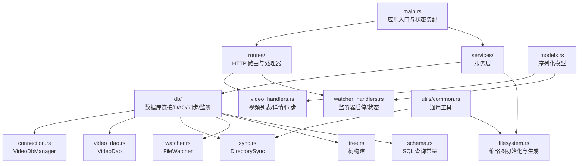
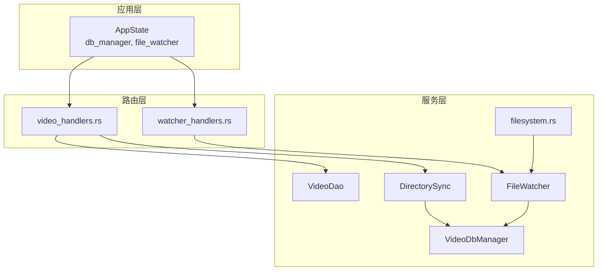
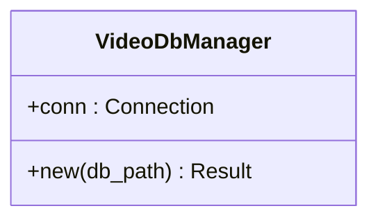
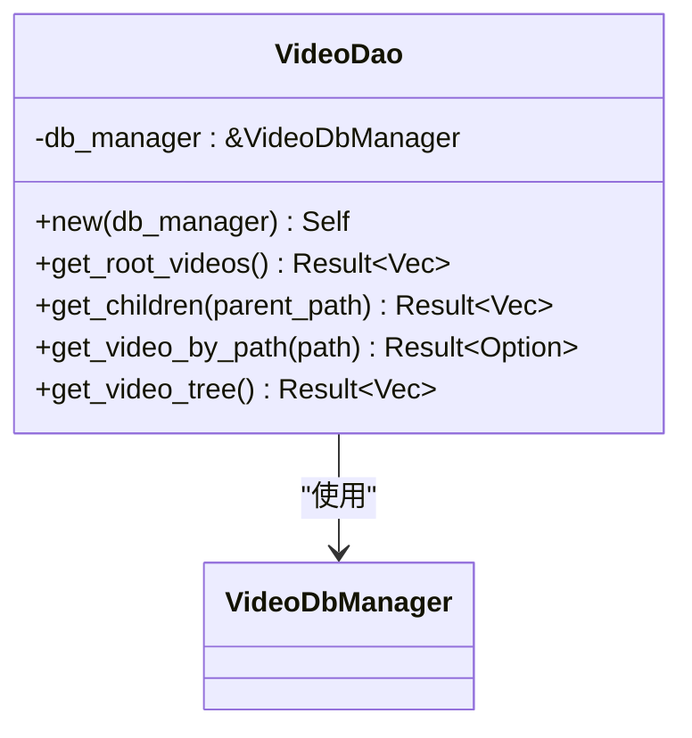
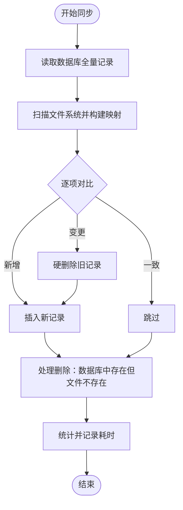
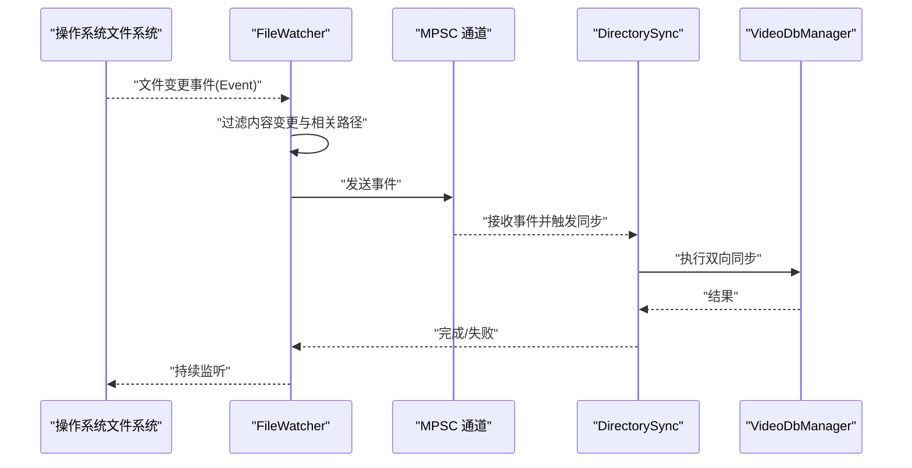
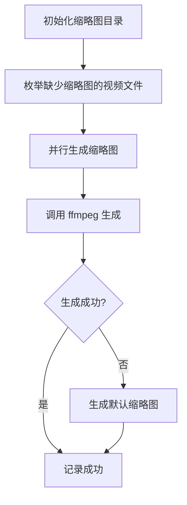
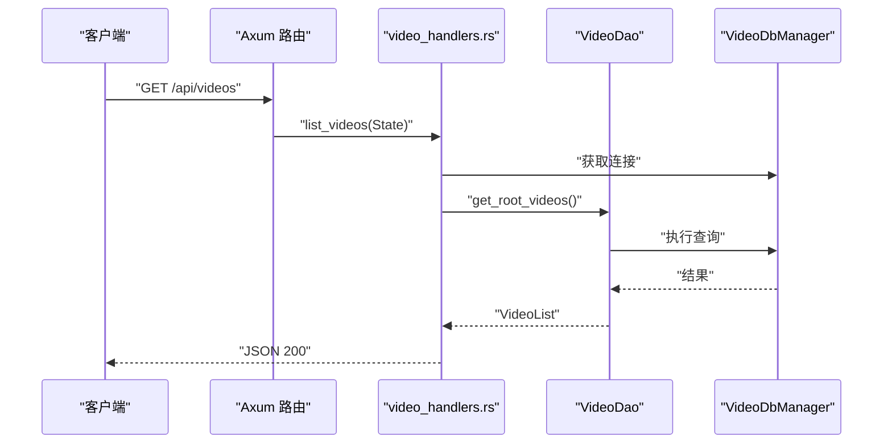
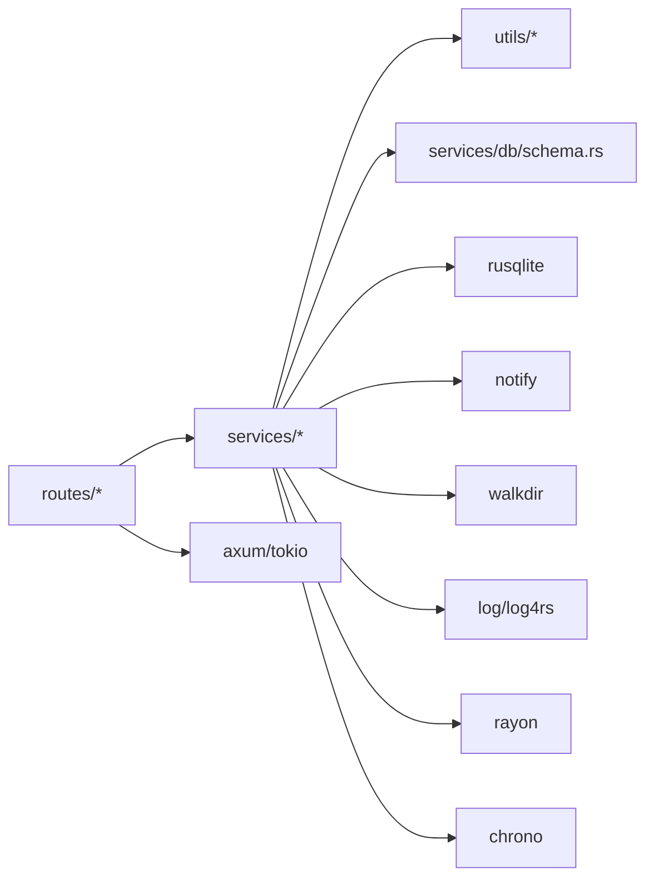

# 服务层架构

<cite>
**本文引用的文件**
- [app/server/src/main.rs](file://app/server/src/main.rs)
- [app/server/src/services/mod.rs](file://app/server/src/services/mod.rs)
- [app/server/src/services/db/mod.rs](file://app/server/src/services/db/mod.rs)
- [app/server/src/services/db/connection.rs](file://app/server/src/services/db/connection.rs)
- [app/server/src/services/db/video_dao.rs](file://app/server/src/services/db/video_dao.rs)
- [app/server/src/services/db/sync.rs](file://app/server/src/services/db/sync.rs)
- [app/server/src/services/db/watcher.rs](file://app/server/src/services/db/watcher.rs)
- [app/server/src/services/db/tree.rs](file://app/server/src/services/db/tree.rs)
- [app/server/src/services/db/schema.rs](file://app/server/src/services/db/schema.rs)
- [app/server/src/services/db/video_dao.rs](file://app/server/src/services/db/video_dao.rs)
- [app/server/src/services/db/sync.rs](file://app/server/src/services/db/sync.rs)
- [app/server/src/services/filesystem.rs](file://app/server/src/services/filesystem.rs)
- [app/server/src/routes/mod.rs](file://app/server/src/routes/mod.rs)
- [app/server/src/routes/video_handlers.rs](file://app/server/src/routes/video_handlers.rs)
- [app/server/src/routes/watcher_handlers.rs](file://app/server/src/routes/watcher_handlers.rs)
- [app/server/src/utils/common.rs](file://app/server/src/utils/common.rs)
- [app/server/src/models.rs](file://app/server/src/models.rs)
- [app/server/Cargo.toml](file://app/server/Cargo.toml)
</cite>

## 目录
1. [简介](#简介)
2. [项目结构](#项目结构)
3. [核心组件](#核心组件)
4. [架构总览](#架构总览)
5. [详细组件分析](#详细组件分析)
6. [依赖分析](#依赖分析)
7. [性能考虑](#性能考虑)
8. [故障排查指南](#故障排查指南)
9. [结论](#结论)
10. [附录](#附录)

## 简介
本文件面向服务层架构，系统性阐述后端服务层的设计模式与职责分离，重点覆盖以下方面：
- 业务逻辑封装与数据访问抽象：通过 DAO 层与数据库管理器解耦业务与持久化细节。
- 核心服务组件：VideoDbManager（数据库连接与迁移）、FileWatcher（文件监听与自动同步）、DirectorySync（目录双向同步）及其交互关系。
- 异步服务调用模式：Tokio 异步运行时、MPSC 通道、事件驱动的文件变更处理。
- 错误传播机制：从服务层到路由层的错误包装与状态码映射。
- 状态管理：全局应用状态、监听器运行状态、并发安全。
- 扩展指南与性能监控：可维护性建议与可观测性实践。

## 项目结构
服务层位于 Rust 后端工程 app/server 下，采用“按域分层 + 模块聚合”的组织方式：
- 顶层入口负责应用初始化、状态装配与路由注册。
- services 子模块进一步细分为 db（数据库相关）与 filesystem（文件系统辅助）两大域。
- routes 子模块承接 HTTP 请求，编排服务层组件并返回响应。
- utils 提供通用工具函数，models 定义序列化模型。

图表来源
- [app/server/src/main.rs](file://app/server/src/main.rs#L1-L111)
- [app/server/src/services/mod.rs](file://app/server/src/services/mod.rs#L1-L6)
- [app/server/src/services/db/mod.rs](file://app/server/src/services/db/mod.rs#L1-L16)
- [app/server/src/services/db/connection.rs](file://app/server/src/services/db/connection.rs#L1-L122)
- [app/server/src/services/db/video_dao.rs](file://app/server/src/services/db/video_dao.rs#L1-L146)
- [app/server/src/services/db/sync.rs](file://app/server/src/services/db/sync.rs#L1-L413)
- [app/server/src/services/db/watcher.rs](file://app/server/src/services/db/watcher.rs#L1-L182)
- [app/server/src/services/db/tree.rs](file://app/server/src/services/db/tree.rs)
- [app/server/src/services/db/schema.rs](file://app/server/src/services/db/schema.rs)
- [app/server/src/services/filesystem.rs](file://app/server/src/services/filesystem.rs#L1-L121)
- [app/server/src/routes/mod.rs](file://app/server/src/routes/mod.rs#L1-L6)
- [app/server/src/routes/video_handlers.rs](file://app/server/src/routes/video_handlers.rs#L1-L104)
- [app/server/src/routes/watcher_handlers.rs](file://app/server/src/routes/watcher_handlers.rs#L1-L84)
- [app/server/src/utils/common.rs](file://app/server/src/utils/common.rs#L1-L146)
- [app/server/src/models.rs](file://app/server/src/models.rs#L1-L32)

章节来源
- [app/server/src/main.rs](file://app/server/src/main.rs#L1-L111)
- [app/server/src/services/mod.rs](file://app/server/src/services/mod.rs#L1-L6)
- [app/server/src/services/db/mod.rs](file://app/server/src/services/db/mod.rs#L1-L16)

## 核心组件
- VideoDbManager：封装 SQLite 连接、表结构初始化与迁移逻辑，提供稳定的数据库会话。
- VideoDao：面向 VideoInfo 的数据访问对象，负责根目录查询、路径查询、父子关系查询与树构建。
- DirectorySync：目录双向同步器，负责扫描文件系统、比对数据库、插入/删除/变更记录，并支持 m3u8 特殊处理。
- FileWatcher：基于 notify 的文件监听器，过滤内容变更事件并通过 Tokio 通道异步触发同步任务，具备防抖与状态管理。
- filesystem 工具：缩略图目录初始化、批量生成缩略图、默认缩略图回退策略。

章节来源
- [app/server/src/services/db/connection.rs](file://app/server/src/services/db/connection.rs#L1-L122)
- [app/server/src/services/db/video_dao.rs](file://app/server/src/services/db/video_dao.rs#L1-L146)
- [app/server/src/services/db/sync.rs](file://app/server/src/services/db/sync.rs#L1-L413)
- [app/server/src/services/db/watcher.rs](file://app/server/src/services/db/watcher.rs#L1-L182)
- [app/server/src/services/filesystem.rs](file://app/server/src/services/filesystem.rs#L1-L121)

## 架构总览
服务层围绕“状态共享 + 事件驱动 + DAO 抽象”展开：
- 应用状态 AppState 持有 VideoDbManager 与 FileWatcher 的共享句柄，供路由层安全访问。
- 路由层通过 State 注入 AppState，调用 VideoDao 与 DirectorySync 执行业务操作。
- FileWatcher 通过事件通道与 DirectorySync 协作，实现文件变更后的自动同步。
- filesystem 模块负责缩略图初始化与生成，提升前端展示体验。

图表来源
- [app/server/src/main.rs](file://app/server/src/main.rs#L21-L61)
- [app/server/src/routes/video_handlers.rs](file://app/server/src/routes/video_handlers.rs#L1-L104)
- [app/server/src/routes/watcher_handlers.rs](file://app/server/src/routes/watcher_handlers.rs#L1-L84)
- [app/server/src/services/db/connection.rs](file://app/server/src/services/db/connection.rs#L1-L122)
- [app/server/src/services/db/video_dao.rs](file://app/server/src/services/db/video_dao.rs#L1-L146)
- [app/server/src/services/db/sync.rs](file://app/server/src/services/db/sync.rs#L1-L413)
- [app/server/src/services/db/watcher.rs](file://app/server/src/services/db/watcher.rs#L1-L182)
- [app/server/src/services/filesystem.rs](file://app/server/src/services/filesystem.rs#L1-L121)

## 详细组件分析

### VideoDbManager（数据库连接与迁移）
- 职责：打开数据库、创建表与索引、执行迁移（兼容旧版本 is_deleted 字段）。
- 设计要点：集中式连接管理，迁移过程原子化（临时表 + 重命名），保证数据一致性。
- 性能：建立 path 与 parent_path 索引，降低查询成本；迁移仅在首次发现旧结构时执行。

图表来源
- [app/server/src/services/db/connection.rs](file://app/server/src/services/db/connection.rs#L1-L122)

章节来源
- [app/server/src/services/db/connection.rs](file://app/server/src/services/db/connection.rs#L1-L122)

### VideoDao（数据访问对象）
- 职责：提供根目录查询、路径查询、父子查询与树构建；屏蔽 SQL 明细。
- 设计要点：通过 VideoDbManager 的连接执行查询；TreeBuilder 构建层次结构；对 m3u8 类型特殊处理（无子节点）。
- 错误传播：DAO 层将底层 Result 上抛至路由层，由路由层转换为 HTTP 错误响应。

图表来源
- [app/server/src/services/db/video_dao.rs](file://app/server/src/services/db/video_dao.rs#L1-L146)
- [app/server/src/services/db/connection.rs](file://app/server/src/services/db/connection.rs#L1-L122)

章节来源
- [app/server/src/services/db/video_dao.rs](file://app/server/src/services/db/video_dao.rs#L1-L146)

### DirectorySync（目录双向同步）
- 职责：扫描文件系统，与数据库进行双向同步；支持强制初始化与增量同步；处理 m3u8 目录合并与缩略图生成。
- 设计要点：先读取数据库全量记录，再扫描文件系统，最后对比插入/删除/变更；对 ts 文件在存在 m3u8 时跳过；对 m3u8 目录进行合并与元数据提取。
- 性能：分阶段记录耗时，便于定位瓶颈；对扫描与处理阶段分别统计新增/变更/删除/跳过数量。

图表来源
- [app/server/src/services/db/sync.rs](file://app/server/src/services/db/sync.rs#L86-L172)

章节来源
- [app/server/src/services/db/sync.rs](file://app/server/src/services/db/sync.rs#L1-L413)

### FileWatcher（文件监听与自动同步）
- 职责：监听指定目录的文件变更事件，过滤内容变更，通过 Tokio 通道异步触发同步任务；具备状态管理与防抖。
- 设计要点：事件过滤器仅接受 mp4/m3u8/ts/vtt/srt/jpg/png/gif 等相关路径；使用 mpsc 通道承载事件；异步任务循环接收事件并在 5 秒内去抖后执行同步。
- 并发与状态：is_watching 标记当前运行状态；stop 时清理监听器与通道；start 防止重复启动。

图表来源
- [app/server/src/services/db/watcher.rs](file://app/server/src/services/db/watcher.rs#L29-L123)
- [app/server/src/services/db/sync.rs](file://app/server/src/services/db/sync.rs#L81-L84)
- [app/server/src/services/db/connection.rs](file://app/server/src/services/db/connection.rs#L1-L122)

章节来源
- [app/server/src/services/db/watcher.rs](file://app/server/src/services/db/watcher.rs#L1-L182)

### filesystem（缩略图初始化与生成）
- 职责：初始化 thumbnails 目录，批量生成缺失的缩略图；当 ffmpeg 不可用时生成默认缩略图。
- 设计要点：并行处理未生成缩略图的视频；对 ffmpeg 失败场景进行降级处理；记录耗时与日志。

图表来源
- [app/server/src/services/filesystem.rs](file://app/server/src/services/filesystem.rs#L1-L121)

章节来源
- [app/server/src/services/filesystem.rs](file://app/server/src/services/filesystem.rs#L1-L121)

### 路由层与错误传播
- video_handlers：提供视频列表、详情与手动同步接口；DAO/同步错误转换为 HTTP 500 与错误消息。
- watcher_handlers：提供监听器启停与状态查询；错误转换为 HTTP 500 与错误消息。
- 错误传播：路由层统一捕获 Result 并映射为响应体与状态码。

图表来源
- [app/server/src/routes/video_handlers.rs](file://app/server/src/routes/video_handlers.rs#L1-L104)
- [app/server/src/services/db/video_dao.rs](file://app/server/src/services/db/video_dao.rs#L1-L146)
- [app/server/src/services/db/connection.rs](file://app/server/src/services/db/connection.rs#L1-L122)

章节来源
- [app/server/src/routes/video_handlers.rs](file://app/server/src/routes/video_handlers.rs#L1-L104)
- [app/server/src/routes/watcher_handlers.rs](file://app/server/src/routes/watcher_handlers.rs#L1-L84)

## 依赖分析
- 内部依赖
  - routes 依赖 services（VideoDao、DirectorySync、FileWatcher）与 models。
  - services/db 依赖 utils（通用工具）与 schema（SQL 常量）。
  - FileWatcher 依赖 DirectorySync 与 VideoDbManager。
- 外部依赖（Cargo.toml）
  - Web 框架与运行时：axum、tokio、tower-http
  - 数据库：rusqlite（bundled）
  - 文件系统与监控：notify、walkdir
  - 日志与并发：log、log4rs、rayon
  - 时间与时序：chrono
  - JSON 序列化：serde、serde_json

图表来源
- [app/server/Cargo.toml](file://app/server/Cargo.toml#L1-L23)
- [app/server/src/routes/mod.rs](file://app/server/src/routes/mod.rs#L1-L6)
- [app/server/src/services/mod.rs](file://app/server/src/services/mod.rs#L1-L6)

章节来源
- [app/server/Cargo.toml](file://app/server/Cargo.toml#L1-L23)

## 性能考虑
- 数据库层
  - 建立 path 与 parent_path 索引，减少查询开销。
  - 迁移流程采用临时表 + 重命名，避免长时间锁表。
- 同步层
  - 分阶段统计耗时（扫描、处理、删除、总耗时），便于定位瓶颈。
  - 对 ts 文件在存在 m3u8 时跳过，避免重复处理。
- 监听层
  - 事件通道缓冲与去抖（5 秒）降低频繁同步带来的压力。
  - 并行生成缩略图（rayon）提升初始化效率。
- 建议
  - 对高频查询引入缓存（如最近一次同步结果）。
  - 监控关键指标：同步耗时、事件积压、错误率。
  - 限制扫描深度与并发度，避免磁盘与 CPU 抖动。

[本节为通用指导，不直接分析具体文件]

## 故障排查指南
- 数据库初始化失败
  - 检查数据库文件权限与路径；确认迁移流程未被中断。
  - 参考路径：[app/server/src/services/db/connection.rs](file://app/server/src/services/db/connection.rs#L1-L122)
- 同步无效果或延迟
  - 查看 FileWatcher 是否运行与事件是否被过滤；确认去抖间隔与监听路径正确。
  - 参考路径：[app/server/src/services/db/watcher.rs](file://app/server/src/services/db/watcher.rs#L29-L123)
- 缩略图未生成
  - 检查 ffmpeg 是否可用；查看默认缩略图回退逻辑。
  - 参考路径：[app/server/src/services/filesystem.rs](file://app/server/src/services/filesystem.rs#L49-L121)
- 路由错误
  - DAO/同步错误会被路由层转换为 500 与错误消息，检查日志定位具体原因。
  - 参考路径：[app/server/src/routes/video_handlers.rs](file://app/server/src/routes/video_handlers.rs#L1-L104), [app/server/src/routes/watcher_handlers.rs](file://app/server/src/routes/watcher_handlers.rs#L1-L84)

章节来源
- [app/server/src/services/db/connection.rs](file://app/server/src/services/db/connection.rs#L1-L122)
- [app/server/src/services/db/watcher.rs](file://app/server/src/services/db/watcher.rs#L1-L182)
- [app/server/src/services/filesystem.rs](file://app/server/src/services/filesystem.rs#L1-L121)
- [app/server/src/routes/video_handlers.rs](file://app/server/src/routes/video_handlers.rs#L1-L104)
- [app/server/src/routes/watcher_handlers.rs](file://app/server/src/routes/watcher_handlers.rs#L1-L84)

## 结论
该服务层通过清晰的职责划分与模块化设计，实现了业务逻辑与数据访问的解耦，结合异步事件驱动与状态管理，提供了稳定可靠的媒体库服务。核心组件之间低耦合、高内聚，具备良好的可扩展性与可观测性基础。后续可在缓存、指标采集与限流等方面进一步增强。

[本节为总结性内容，不直接分析具体文件]

## 附录
- 关键模型
  - VideoInfo：视频/目录信息，支持序列化与可选字段。
  - VideoList：视频列表容器。
  - 参考路径：[app/server/src/models.rs](file://app/server/src/models.rs#L1-L32)
- 工具函数
  - 文件大小格式化、创建时间解析、m3u8/视频判断、缩略图缺失文件枚举等。
  - 参考路径：[app/server/src/utils/common.rs](file://app/server/src/utils/common.rs#L1-L146)

章节来源
- [app/server/src/models.rs](file://app/server/src/models.rs#L1-L32)
- [app/server/src/utils/common.rs](file://app/server/src/utils/common.rs#L1-L146)