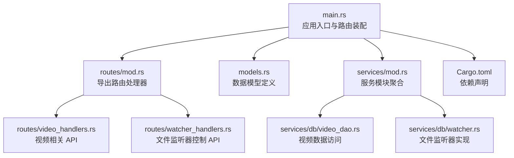
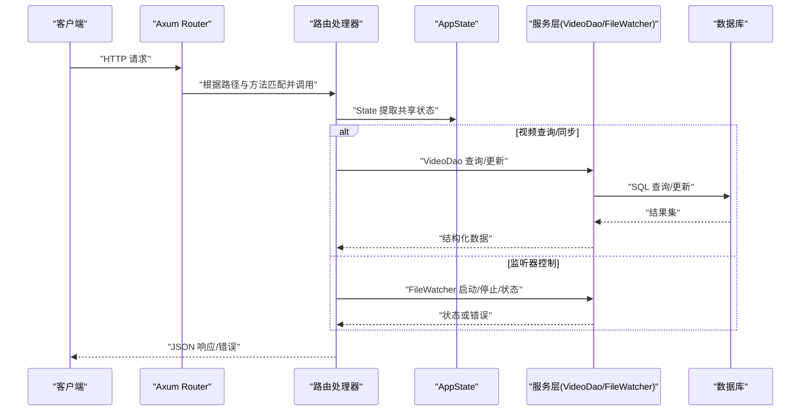
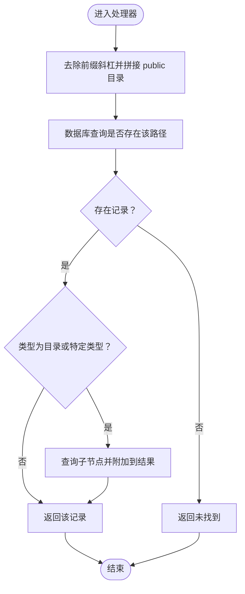
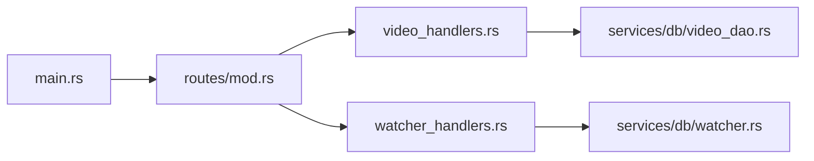
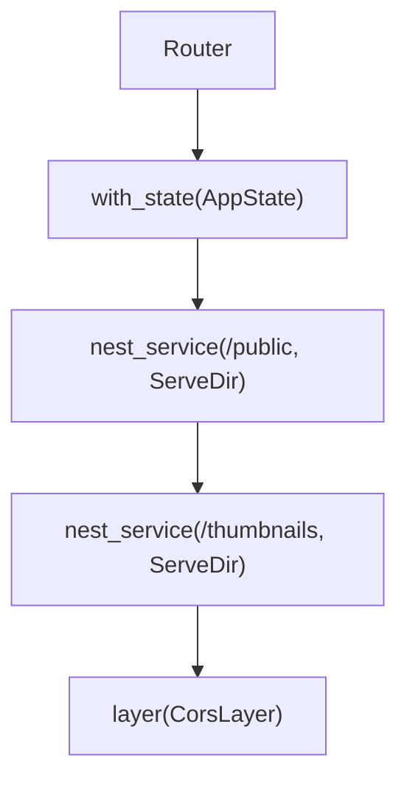
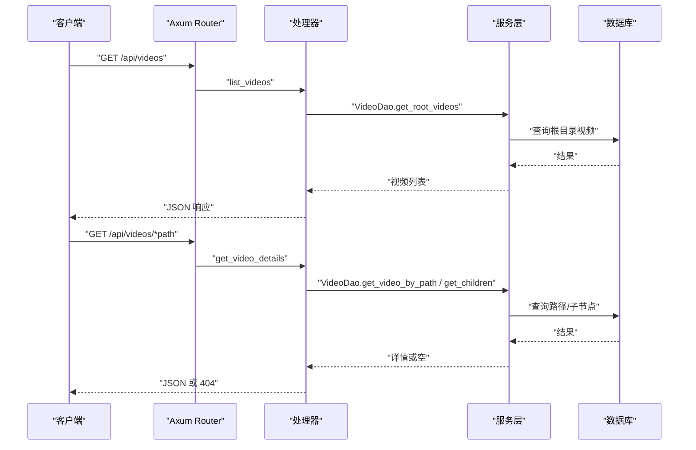
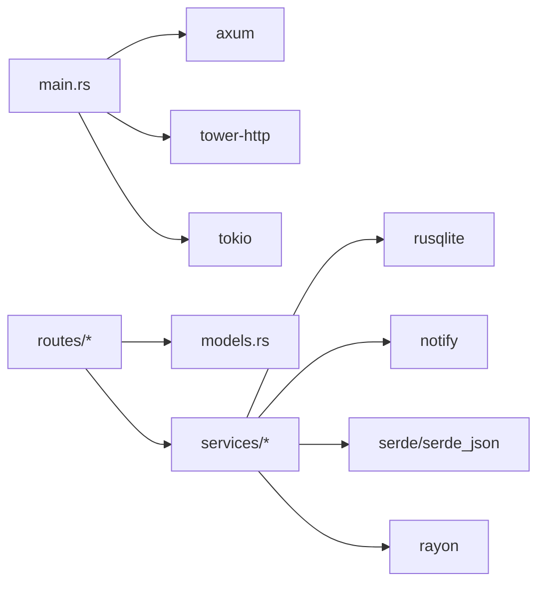

# 路由系统

<cite>
**本文引用的文件**
- [main.rs](file://app/server/src/main.rs)
- [routes/mod.rs](file://app/server/src/routes/mod.rs)
- [routes/video_handlers.rs](file://app/server/src/routes/video_handlers.rs)
- [routes/watcher_handlers.rs](file://app/server/src/routes/watcher_handlers.rs)
- [models.rs](file://app/server/src/models.rs)
- [services/mod.rs](file://app/server/src/services/mod.rs)
- [services/db/video_dao.rs](file://app/server/src/services/db/video_dao.rs)
- [services/db/watcher.rs](file://app/server/src/services/db/watcher.rs)
- [Cargo.toml](file://app/server/Cargo.toml)
</cite>

## 目录
1. [简介](#简介)
2. [项目结构](#项目结构)
3. [核心组件](#核心组件)
4. [架构总览](#架构总览)
5. [详细组件分析](#详细组件分析)
6. [依赖关系分析](#依赖关系分析)
7. [性能考虑](#性能考虑)
8. [故障排查指南](#故障排查指南)
9. [结论](#结论)
10. [附录](#附录)

## 简介
本文件面向后端路由系统，围绕 Axum 框架在本项目中的路由配置进行系统化说明，涵盖：
- HTTP 方法映射与 URL 模式匹配
- 参数提取与路径通配符使用
- 路由模块组织（video_handlers 与 watcher_handlers 的职责划分）
- 路由中间件（CORS 与静态文件服务）的集成方式
- 路由扩展最佳实践与性能优化建议

## 项目结构
后端服务采用模块化组织，路由层位于 routes 子目录，主入口负责构建 Router 并挂载中间件与静态资源服务。

图表来源
- [main.rs](file://app/server/src/main.rs#L1-L110)
- [routes/mod.rs](file://app/server/src/routes/mod.rs#L1-L6)
- [routes/video_handlers.rs](file://app/server/src/routes/video_handlers.rs#L1-L104)
- [routes/watcher_handlers.rs](file://app/server/src/routes/watcher_handlers.rs#L1-L84)
- [models.rs](file://app/server/src/models.rs#L1-L32)
- [services/mod.rs](file://app/server/src/services/mod.rs#L1-L6)
- [services/db/video_dao.rs](file://app/server/src/services/db/video_dao.rs#L1-L146)
- [services/db/watcher.rs](file://app/server/src/services/db/watcher.rs#L1-L182)
- [Cargo.toml](file://app/server/Cargo.toml#L1-L23)

章节来源
- [main.rs](file://app/server/src/main.rs#L1-L110)
- [routes/mod.rs](file://app/server/src/routes/mod.rs#L1-L6)
- [Cargo.toml](file://app/server/Cargo.toml#L1-L23)

## 核心组件
- 应用状态 AppState：集中持有数据库管理器与文件监听器实例，供各处理器通过 State 提取使用。
- 路由处理器：
  - 视频相关：list_videos、get_video_details、sync_videos
  - 监听器控制：start_watcher、stop_watcher、get_watcher_status
- 数据模型：VideoInfo、VideoList 用于 API 响应结构化输出。
- 服务层：
  - VideoDao：封装数据库查询逻辑（根目录视频、按路径查询、子节点查询等）
  - FileWatcher：基于 notify 的文件系统监听器，支持异步事件分发与去抖动同步

章节来源
- [main.rs](file://app/server/src/main.rs#L21-L61)
- [routes/video_handlers.rs](file://app/server/src/routes/video_handlers.rs#L1-L104)
- [routes/watcher_handlers.rs](file://app/server/src/routes/watcher_handlers.rs#L1-L84)
- [models.rs](file://app/server/src/models.rs#L1-L32)
- [services/db/video_dao.rs](file://app/server/src/services/db/video_dao.rs#L1-L146)
- [services/db/watcher.rs](file://app/server/src/services/db/watcher.rs#L1-L182)

## 架构总览
下图展示从客户端请求到处理器执行、再到服务层与数据库交互的整体流程。

图表来源
- [main.rs](file://app/server/src/main.rs#L72-L90)
- [routes/video_handlers.rs](file://app/server/src/routes/video_handlers.rs#L1-L104)
- [routes/watcher_handlers.rs](file://app/server/src/routes/watcher_handlers.rs#L1-L84)
- [services/db/video_dao.rs](file://app/server/src/services/db/video_dao.rs#L1-L146)
- [services/db/watcher.rs](file://app/server/src/services/db/watcher.rs#L1-L182)

## 详细组件分析

### 路由与 HTTP 方法映射
- 路由注册集中在主入口，使用 Router::new() 与 route() 方法绑定路径与处理器。
- 当前路由均使用 GET 方法，符合只读查询与控制接口的设计。
- 路径匹配规则：
  - 固定路径：/、/api/videos、/api/sync、/api/watcher/start、/api/watcher/stop、/api/watcher/status
  - 通配符路径：/api/videos/*path，用于捕获任意子路径并交由处理器解析
- 参数提取：
  - State 提取 AppState，实现跨处理器共享状态
  - Path 提取通配符路径参数，处理器内部进行路径规范化与数据库查询

章节来源
- [main.rs](file://app/server/src/main.rs#L72-L89)
- [routes/video_handlers.rs](file://app/server/src/routes/video_handlers.rs#L30-L70)

### URL 模式匹配与参数提取
- 通配符匹配：/api/videos/*path 将捕获斜杠后的剩余部分作为字符串参数，处理器内部移除前缀斜杠并拼接 public 目录，形成最终查询路径。
- 路径规范化：
  - 去除多余前缀斜杠
  - 与 public 目录组合，确保查询路径指向实际数据源
- 数据库查询：
  - 若目标为目录或特定类型，则递归查询子节点
  - 若未命中数据库记录，返回未找到

图表来源
- [routes/video_handlers.rs](file://app/server/src/routes/video_handlers.rs#L30-L70)
- [services/db/video_dao.rs](file://app/server/src/services/db/video_dao.rs#L81-L119)

章节来源
- [routes/video_handlers.rs](file://app/server/src/routes/video_handlers.rs#L30-L70)
- [services/db/video_dao.rs](file://app/server/src/services/db/video_dao.rs#L81-L119)

### 路由模块组织：video_handlers 与 watcher_handlers
- video_handlers：
  - list_videos：列出根目录（public）下的视频与目录
  - get_video_details：按路径获取详情，必要时返回子节点
  - sync_videos：手动触发数据库与文件系统同步
- watcher_handlers：
  - start_watcher：启动文件监听器，自动同步数据库
  - stop_watcher：停止文件监听器
  - get_watcher_status：查询监听器当前状态
- 路由导出：通过 routes/mod.rs 将处理器函数导出，便于主入口统一引用

图表来源
- [routes/mod.rs](file://app/server/src/routes/mod.rs#L1-L6)
- [routes/video_handlers.rs](file://app/server/src/routes/video_handlers.rs#L1-L104)
- [routes/watcher_handlers.rs](file://app/server/src/routes/watcher_handlers.rs#L1-L84)
- [services/db/video_dao.rs](file://app/server/src/services/db/video_dao.rs#L1-L146)
- [services/db/watcher.rs](file://app/server/src/services/db/watcher.rs#L1-L182)

章节来源
- [routes/mod.rs](file://app/server/src/routes/mod.rs#L1-L6)
- [routes/video_handlers.rs](file://app/server/src/routes/video_handlers.rs#L1-L104)
- [routes/watcher_handlers.rs](file://app/server/src/routes/watcher_handlers.rs#L1-L84)

### 路由中间件：CORS 与静态文件服务
- CORS 配置：
  - 使用 tower_http::cors::CorsLayer 构建
  - 允许来源：*（生产环境建议限制具体域名）
  - 允许方法：GET、POST、OPTIONS
  - 允许头：*（可按需收紧）
- 静态文件服务：
  - /public 下的文件通过 nest_service 挂载 ServeDir，指向数据源目录（可通过环境变量 DATA_SOURCE_DIR 动态配置）
  - /thumbnails 下的文件通过 nest_service 挂载 ServeDir，指向缩略图目录
- 中间件叠加顺序：
  - with_state(AppState) 在前，确保处理器能访问共享状态
  - layer(cors) 在后，使 CORS 生效

图表来源
- [main.rs](file://app/server/src/main.rs#L62-L90)
- [Cargo.toml](file://app/server/Cargo.toml#L1-L23)

章节来源
- [main.rs](file://app/server/src/main.rs#L62-L90)
- [Cargo.toml](file://app/server/Cargo.toml#L1-L23)

### 处理器工作流与错误处理
- 视频处理器：
  - list_videos：直接查询根目录视频列表并返回 JSON
  - get_video_details：先查数据库，若命中且为目录/特定类型则查询子节点；未命中返回未找到；数据库异常返回服务器错误
  - sync_videos：触发同步并返回结果与计数；失败返回服务器错误
- 监听器处理器：
  - start_watcher：若已在运行则返回状态；否则尝试启动并返回状态或错误
  - stop_watcher：若未运行则返回状态；否则尝试停止并返回状态或错误
  - get_watcher_status：返回当前运行状态与提示信息

图表来源
- [routes/video_handlers.rs](file://app/server/src/routes/video_handlers.rs#L14-L70)
- [services/db/video_dao.rs](file://app/server/src/services/db/video_dao.rs#L51-L119)

章节来源
- [routes/video_handlers.rs](file://app/server/src/routes/video_handlers.rs#L14-L104)
- [routes/watcher_handlers.rs](file://app/server/src/routes/watcher_handlers.rs#L18-L84)

## 依赖关系分析
- 框架与中间件：
  - axum：Web 框架
  - tower-http：包含 CORS 与 ServeDir 等中间件
- 数据库与文件系统：
  - rusqlite：SQLite 访问
  - notify：文件系统事件监听
- 并发与工具：
  - tokio：异步运行时
  - serde/serde_json：序列化与反序列化
  - rayon：并行计算（用于潜在的批量处理）

图表来源
- [Cargo.toml](file://app/server/Cargo.toml#L1-L23)
- [main.rs](file://app/server/src/main.rs#L1-L110)
- [routes/mod.rs](file://app/server/src/routes/mod.rs#L1-L6)
- [models.rs](file://app/server/src/models.rs#L1-L32)
- [services/mod.rs](file://app/server/src/services/mod.rs#L1-L6)

章节来源
- [Cargo.toml](file://app/server/Cargo.toml#L1-L23)

## 性能考虑
- 路由匹配与参数提取
  - 通配符路径会增加匹配开销，建议尽量减少通配符层级与数量，或在处理器内尽早短路
  - 对于高频查询，可考虑缓存热点路径的查询结果（如根目录列表）
- 数据库访问
  - VideoDao 的查询使用预编译语句，注意 SQL 查询索引设计（如按路径查询的索引）
  - 批量查询时避免 N+1 查询，合并子节点查询
- 文件监听器
  - 监听器采用 5 秒去抖动，降低频繁同步带来的数据库压力
  - 仅对视频相关扩展名与目录变更进行过滤，减少无关事件
- 静态文件服务
  - ServeDir 默认具备缓存控制策略，建议结合 CDN 与浏览器缓存头进一步优化
- 并发与锁
  - AppState 内部使用 Mutex 包裹共享状态，注意避免长临界区；可拆分更细粒度的状态以提升并发性

[本节为通用性能建议，无需特定文件引用]

## 故障排查指南
- CORS 相关问题
  - 现象：前端跨域请求被拒绝
  - 排查：确认 CORS 配置允许来源与方法；生产环境建议限制具体来源
- 静态文件无法访问
  - 现象：/public 或 /thumbnails 返回 404
  - 排查：确认数据源目录与缩略图目录存在且可读；检查 DATA_SOURCE_DIR 环境变量
- 数据库查询异常
  - 现象：视频详情接口返回服务器错误
  - 排查：检查数据库连接与表结构；确认路径规范化逻辑正确
- 监听器无法启动
  - 现象：启动监听器失败或无反应
  - 排查：确认监听路径存在；查看监听器状态与错误日志；检查去抖动与事件过滤逻辑

章节来源
- [main.rs](file://app/server/src/main.rs#L62-L90)
- [routes/video_handlers.rs](file://app/server/src/routes/video_handlers.rs#L14-L104)
- [routes/watcher_handlers.rs](file://app/server/src/routes/watcher_handlers.rs#L18-L84)
- [services/db/watcher.rs](file://app/server/src/services/db/watcher.rs#L29-L123)

## 结论
本路由系统以 Axum 为核心，通过清晰的模块划分与中间件集成，实现了视频资源的查询、同步与文件监听器控制，并提供了静态文件服务。建议在生产环境中收紧 CORS 配置、优化数据库查询与缓存策略、拆分 AppState 的锁粒度，并对监听器事件进行更精细的过滤与限流，以获得更好的稳定性与性能。

[本节为总结性内容，无需特定文件引用]

## 附录
- 可扩展方向
  - 新增路由：遵循现有命名与模块划分，新增处理器并在 routes/mod.rs 导出
  - 中间件：在 with_state 之后、layer(cors) 之前插入其他中间件（如鉴权、限流）
  - 错误处理：统一错误响应格式，便于前端一致处理
- 最佳实践清单
  - 明确职责边界：video_handlers 专注视频数据，watcher_handlers 专注监听器控制
  - 参数校验：对路径参数进行白名单与长度限制
  - 日志与追踪：为关键路径添加日志与请求追踪
  - 安全加固：限制 CORS 来源、启用 HTTPS、对敏感接口鉴权

[本节为概念性内容，无需特定文件引用]