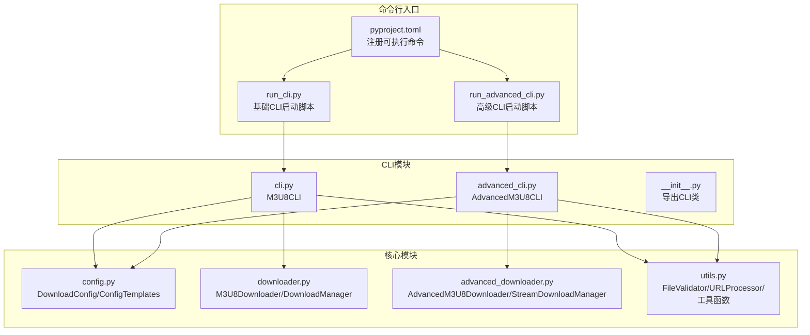
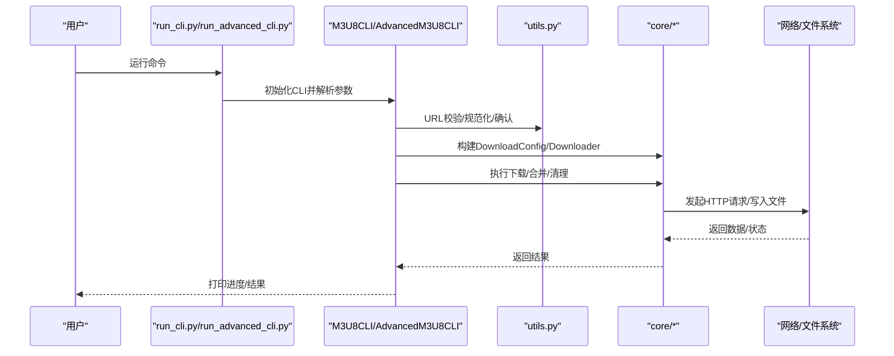
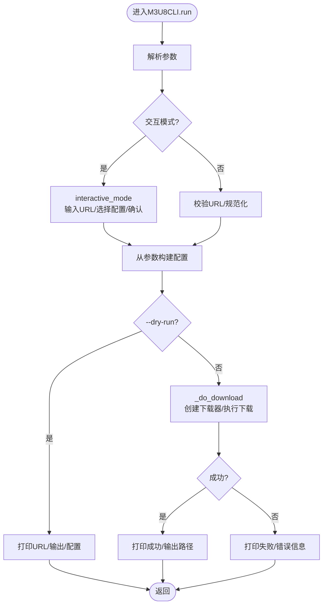
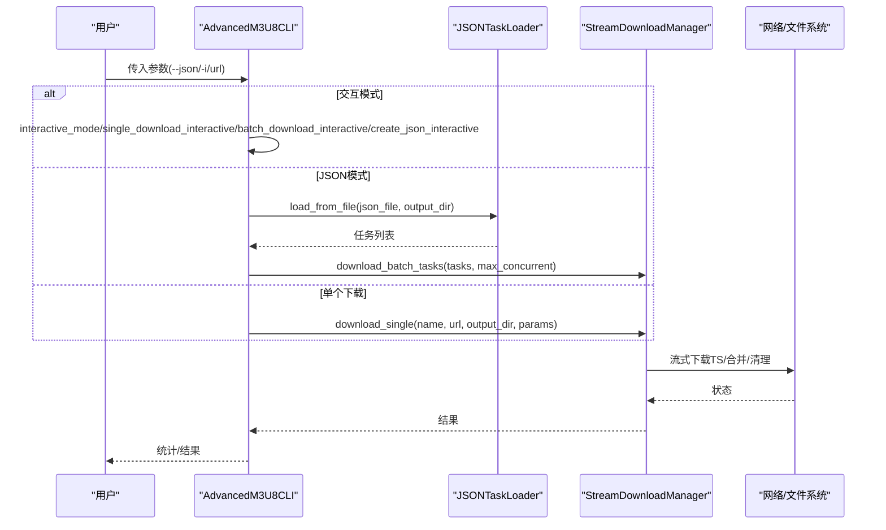
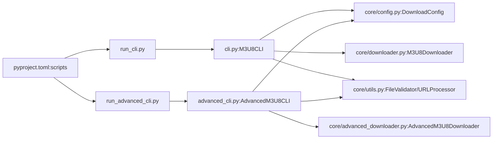

# 命令行接口模块

<cite>
**本文引用的文件**
- [run_cli.py](file://app/downloader/run_cli.py)
- [run_advanced_cli.py](file://app/downloader/run_advanced_cli.py)
- [__init__.py](file://app/downloader/cli/__init__.py)
- [cli.py](file://app/downloader/cli/cli.py)
- [advanced_cli.py](file://app/downloader/cli/advanced_cli.py)
- [config.py](file://app/downloader/core/config.py)
- [downloader.py](file://app/downloader/core/downloader.py)
- [advanced_downloader.py](file://app/downloader/core/advanced_downloader.py)
- [utils.py](file://app/downloader/core/utils.py)
- [QUICKSTART.md](file://app/downloader/QUICKSTART.md)
- [pyproject.toml](file://app/downloader/pyproject.toml)
</cite>

## 目录
1. [简介](#简介)
2. [项目结构](#项目结构)
3. [核心组件](#核心组件)
4. [架构总览](#架构总览)
5. [详细组件分析](#详细组件分析)
6. [依赖关系分析](#依赖关系分析)
7. [性能与可用性考量](#性能与可用性考量)
8. [故障排查指南](#故障排查指南)
9. [结论](#结论)
10. [附录](#附录)

## 简介
本文件聚焦于“命令行接口模块”，系统梳理基础 CLI 与高级 CLI 的设计、参数体系、交互流程、与核心下载器的集成关系，并给出可操作的使用建议与排障指引。读者无需深入源码即可理解如何通过命令行高效完成单个或批量的 M3U8 视频下载。

## 项目结构
命令行接口位于 app/downloader/cli 目录，分别提供基础 CLI 与高级 CLI 两个入口；二者均通过便捷启动脚本与可执行命令进行调用；核心下载能力由 app/downloader/core 下的配置、下载器与工具模块提供。

图表来源
- [run_cli.py](file://app/downloader/run_cli.py#L1-L25)
- [run_advanced_cli.py](file://app/downloader/run_advanced_cli.py#L1-L17)
- [cli.py](file://app/downloader/cli/cli.py#L1-L292)
- [advanced_cli.py](file://app/downloader/cli/advanced_cli.py#L1-L373)
- [config.py](file://app/downloader/core/config.py#L1-L114)
- [downloader.py](file://app/downloader/core/downloader.py#L1-L501)
- [advanced_downloader.py](file://app/downloader/core/advanced_downloader.py#L1-L576)
- [utils.py](file://app/downloader/core/utils.py#L1-L290)
- [pyproject.toml](file://app/downloader/pyproject.toml#L1-L17)

章节来源
- [run_cli.py](file://app/downloader/run_cli.py#L1-L25)
- [run_advanced_cli.py](file://app/downloader/run_advanced_cli.py#L1-L17)
- [pyproject.toml](file://app/downloader/pyproject.toml#L1-L17)

## 核心组件
- 基础 CLI（M3U8CLI）
  - 负责解析命令行参数、构建 DownloadConfig、执行单个下载、交互模式与试运行。
  - 关键方法：parse_arguments、create_config_from_args、interactive_mode、run、_do_download。
- 高级 CLI（AdvancedM3U8CLI）
  - 在基础 CLI 上扩展 JSON 任务加载、批量并发下载、交互式 JSON 创建等能力。
  - 关键方法：parse_arguments、create_config_from_args、interactive_mode、single_download_interactive、batch_download_interactive、create_json_interactive、run。
- 配置（DownloadConfig/ConfigTemplates）
  - 定义线程数、超时、重试、缓冲区、路径、请求头、SSL 校验、进度与日志开关等。
  - 提供 fast/stable/low_bandwidth 三套预设模板。
- 下载器
  - 基础：M3U8Downloader + DownloadManager（批量下载、合并 TS、清理临时文件）。
  - 高级：AdvancedM3U8Downloader + StreamDownloadManager（流式下载、逐个 TS 实时进度、批量任务并发控制）。
- 工具（utils）
  - URL/文件校验、URL 规范化、确认与安全输入、横幅打印、格式化等。

章节来源
- [cli.py](file://app/downloader/cli/cli.py#L1-L292)
- [advanced_cli.py](file://app/downloader/cli/advanced_cli.py#L1-L373)
- [config.py](file://app/downloader/core/config.py#L1-L114)
- [downloader.py](file://app/downloader/core/downloader.py#L1-L501)
- [advanced_downloader.py](file://app/downloader/core/advanced_downloader.py#L1-L576)
- [utils.py](file://app/downloader/core/utils.py#L1-L290)

## 架构总览
CLI 层负责参数解析与交互，核心层负责下载与合并逻辑，工具层提供通用能力。两者通过 DownloadConfig 与 DownloadManager/StreamDownloadManager 解耦。

图表来源
- [run_cli.py](file://app/downloader/run_cli.py#L1-L25)
- [run_advanced_cli.py](file://app/downloader/run_advanced_cli.py#L1-L17)
- [cli.py](file://app/downloader/cli/cli.py#L1-L292)
- [advanced_cli.py](file://app/downloader/cli/advanced_cli.py#L1-L373)
- [downloader.py](file://app/downloader/core/downloader.py#L1-L501)
- [advanced_downloader.py](file://app/downloader/core/advanced_downloader.py#L1-L576)
- [utils.py](file://app/downloader/core/utils.py#L1-L290)

## 详细组件分析

### 基础 CLI（M3U8CLI）
- 参数体系
  - 基本：url、-o/--output、-t/--threads
  - 配置：--profile、--max-retries、--retry-delay、--connect-timeout、--read-timeout
  - 路径：--temp-dir、--output-dir
  - 请求头：--headers（JSON 或 key=value）、--user-agent、--referer
  - 功能：--no-ssl-verify、--no-progress、--no-logging、--dry-run
  - 交互：-i/--interactive
- 运行流程
  - 解析参数 → 校验 URL → 生成/应用配置 → 试运行/交互/下载 → 结果反馈
- 交互模式
  - 输入 URL、选择配置模板、自定义线程/重试、确认后执行下载
- 关键实现位置
  - 参数解析与配置应用：[cli.py](file://app/downloader/cli/cli.py#L22-L114)
  - 交互流程：[cli.py](file://app/downloader/cli/cli.py#L138-L206)
  - 执行下载：[cli.py](file://app/downloader/cli/cli.py#L207-L239)
  - 主运行与试运行：[cli.py](file://app/downloader/cli/cli.py#L240-L292)

图表来源
- [cli.py](file://app/downloader/cli/cli.py#L22-L292)

章节来源
- [cli.py](file://app/downloader/cli/cli.py#L1-L292)

### 高级 CLI（AdvancedM3U8CLI）
- 参数体系
  - 基本：url、-o/--output、-t/--threads
  - JSON：--json、--output-dir、--max-concurrent
  - 配置：--profile、--max-retries、--retry-delay、--connect-timeout、--read-timeout
  - 功能：--no-ssl-verify、--no-progress、--no-logging
  - 交互：-i/--interactive
- 运行流程
  - 解析参数 → 交互模式（单个/批量/创建JSON）或 JSON 模式/单个下载 → 构建配置 → 执行下载 → 统计结果
- 交互模式
  - 单个下载：输入 URL/配置/输出 → 确认 → 流式下载 TS → 合并 → 清理
  - 批量下载：加载 JSON → 设置并发 → 并发执行任务 → 统计结果
  - 创建 JSON：交互式收集任务 → 保存为 tasks.json
- 关键实现位置
  - 参数解析与配置应用：[advanced_cli.py](file://app/downloader/cli/advanced_cli.py#L22-L104)
  - 交互模式与单个下载：[advanced_cli.py](file://app/downloader/cli/advanced_cli.py#L105-L173)
  - 批量下载与 JSON 加载：[advanced_cli.py](file://app/downloader/cli/advanced_cli.py#L174-L225)
  - 创建 JSON 任务：[advanced_cli.py](file://app/downloader/cli/advanced_cli.py#L226-L289)
  - 主运行与单个下载：[advanced_cli.py](file://app/downloader/cli/advanced_cli.py#L290-L373)

图表来源
- [advanced_cli.py](file://app/downloader/cli/advanced_cli.py#L105-L373)
- [advanced_downloader.py](file://app/downloader/core/advanced_downloader.py#L423-L576)

章节来源
- [advanced_cli.py](file://app/downloader/cli/advanced_cli.py#L1-L373)
- [advanced_downloader.py](file://app/downloader/core/advanced_downloader.py#L1-L576)

### 配置与模板（DownloadConfig/ConfigTemplates）
- DownloadConfig
  - 字段：num_threads、connect_timeout、read_timeout、max_retries、retry_delay、chunk_size、buffer_size、temp_dir、output_dir、headers、verify_ssl、show_progress、enable_logging
  - 默认行为：自动根据 CPU 核心数设置线程数；确保 temp_dir 与 output_dir 存在
- ConfigTemplates
  - fast：高并发、短超时、少重试
  - stable：平衡配置
  - low_bandwidth：低并发、较大块、较长重试间隔
- 关键实现位置
  - [config.py](file://app/downloader/core/config.py#L1-L114)

章节来源
- [config.py](file://app/downloader/core/config.py#L1-L114)

### 下载器与管理器
- 基础下载器（downloader.py）
  - M3U8Downloader：解析 M3U8 → 下载缺失 TS → 合并 → 清理临时目录
  - DownloadManager：批量下载、进度统计、合并、清理、重试与日志
- 高级下载器（advanced_downloader.py）
  - AdvancedM3U8Downloader：面向任务的高级下载器
  - StreamDownloadManager：流式下载、逐个 TS 实时进度、批量任务并发控制
- 关键实现位置
  - [downloader.py](file://app/downloader/core/downloader.py#L1-L501)
  - [advanced_downloader.py](file://app/downloader/core/advanced_downloader.py#L1-L576)

章节来源
- [downloader.py](file://app/downloader/core/downloader.py#L1-L501)
- [advanced_downloader.py](file://app/downloader/core/advanced_downloader.py#L1-L576)

### 工具模块（utils.py）
- FileValidator：URL 格式校验、M3U8 内容校验、磁盘空间检查
- URLProcessor：URL 规范化、域名提取、追加查询参数
- 其他：进度跟踪、缓存管理、统计、格式化、横幅打印、确认与安全输入
- 关键实现位置
  - [utils.py](file://app/downloader/core/utils.py#L1-L290)

章节来源
- [utils.py](file://app/downloader/core/utils.py#L1-L290)

## 依赖关系分析
- CLI 与核心模块
  - M3U8CLI 依赖 DownloadConfig、M3U8Downloader、FileValidator、URLProcessor、utils
  - AdvancedM3U8CLI 依赖 DownloadConfig、AdvancedM3U8Downloader、FileValidator、URLProcessor、utils
- 可执行入口
  - pyproject.toml 中注册了 m3u8-cli 与 m3u8-advanced-cli 两个命令，分别指向对应 CLI 的 main 函数
- 运行方式
  - 推荐从 app 目录使用完整模块路径运行，或使用便捷脚本 run_cli.py/run_advanced_cli.py

图表来源
- [cli.py](file://app/downloader/cli/cli.py#L1-L292)
- [advanced_cli.py](file://app/downloader/cli/advanced_cli.py#L1-L373)
- [config.py](file://app/downloader/core/config.py#L1-L114)
- [downloader.py](file://app/downloader/core/downloader.py#L1-L501)
- [advanced_downloader.py](file://app/downloader/core/advanced_downloader.py#L1-L576)
- [utils.py](file://app/downloader/core/utils.py#L1-L290)
- [run_cli.py](file://app/downloader/run_cli.py#L1-L25)
- [run_advanced_cli.py](file://app/downloader/run_advanced_cli.py#L1-L17)
- [pyproject.toml](file://app/downloader/pyproject.toml#L1-L17)

章节来源
- [pyproject.toml](file://app/downloader/pyproject.toml#L1-L17)
- [run_cli.py](file://app/downloader/run_cli.py#L1-L25)
- [run_advanced_cli.py](file://app/downloader/run_advanced_cli.py#L1-L17)

## 性能与可用性考量
- 线程数与并发
  - 默认线程数基于 CPU 核心数；可通过 --threads 或 --profile 调整
  - 高级 CLI 支持 --max-concurrent 控制批量任务并发
- 超时与重试
  - connect/read 超时与重试次数可调；低带宽模板降低并发与提高重试间隔
- 进度与日志
  - 可禁用进度条与日志以减少开销；默认启用进度条与日志
- 断点续传
  - 已存在的 TS 文件会被跳过，重复运行可继续下载未完成部分
- SSL 与请求头
  - 可禁用 SSL 校验（不推荐）；支持自定义请求头与 Referer/User-Agent

章节来源
- [config.py](file://app/downloader/core/config.py#L1-L114)
- [downloader.py](file://app/downloader/core/downloader.py#L1-L501)
- [advanced_downloader.py](file://app/downloader/core/advanced_downloader.py#L1-L576)
- [cli.py](file://app/downloader/cli/cli.py#L1-L292)
- [advanced_cli.py](file://app/downloader/cli/advanced_cli.py#L1-L373)

## 故障排查指南
- 模块导入错误（No module named 'cli.config'）
  - 原因：在错误目录运行导致相对导入越界
  - 解决：从 app 目录使用完整模块路径运行，或使用便捷脚本
- URL 无效
  - 使用 FileValidator.validate_url 校验；必要时用 URLProcessor.normalize_url 规范化
- 下载失败
  - 检查网络与代理；调整 --profile 为 stable；适当增大 --max-retries 与 --retry-delay
  - 若为 SSL 问题，可临时使用 --no-ssl-verify（仅限调试）
- 性能不佳
  - 使用 --profile fast 或增加 -t；合理设置 --max-concurrent
- 交互确认
  - 使用 confirm_action 进行关键操作确认；安全输入使用 safe_input

章节来源
- [QUICKSTART.md](file://app/downloader/QUICKSTART.md#L1-L290)
- [utils.py](file://app/downloader/core/utils.py#L1-L290)
- [cli.py](file://app/downloader/cli/cli.py#L1-L292)
- [advanced_cli.py](file://app/downloader/cli/advanced_cli.py#L1-L373)

## 结论
命令行接口模块提供了简洁而强大的下载体验：基础 CLI 适合单次下载与交互；高级 CLI 适合批量任务与流式监控。通过 DownloadConfig/ConfigTemplates 与 DownloadManager/StreamDownloadManager 的解耦设计，CLI 既能满足初学者的易用性，也能满足高级用户的灵活性与可观测性。

## 附录
- 可执行命令
  - m3u8-cli → 对应 M3U8CLI.main
  - m3u8-advanced-cli → 对应 AdvancedM3U8CLI.main
- 运行建议
  - 从 app 目录使用完整模块路径运行，或使用 run_cli.py/run_advanced_cli.py 便捷脚本

章节来源
- [pyproject.toml](file://app/downloader/pyproject.toml#L1-L17)
- [QUICKSTART.md](file://app/downloader/QUICKSTART.md#L1-L290)