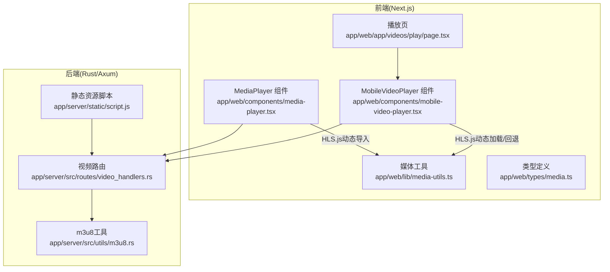
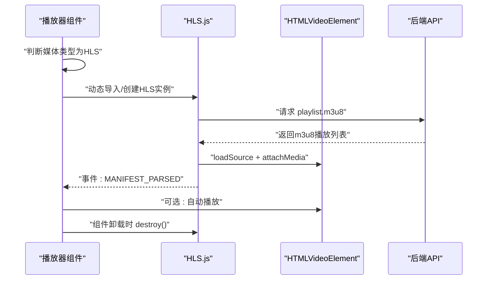
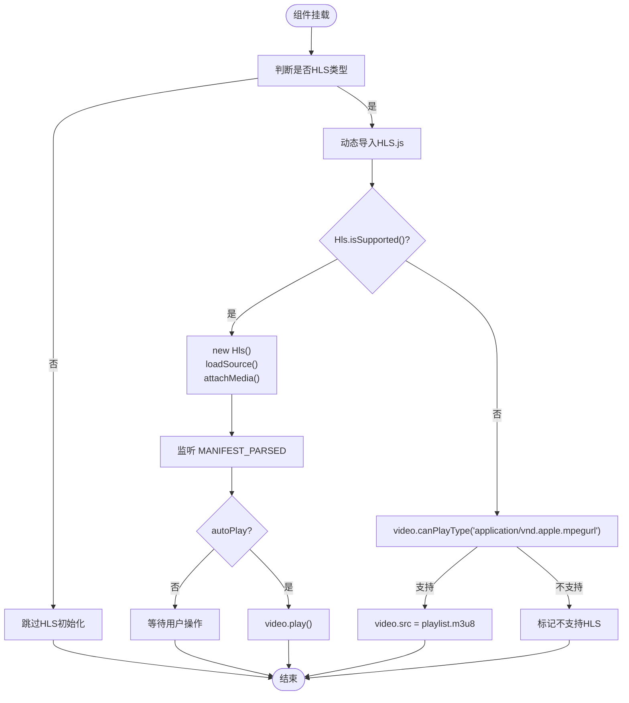
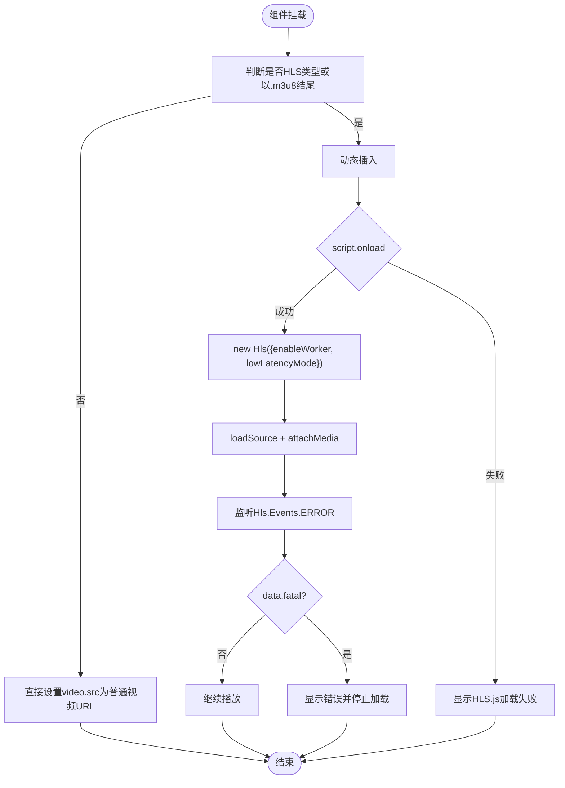
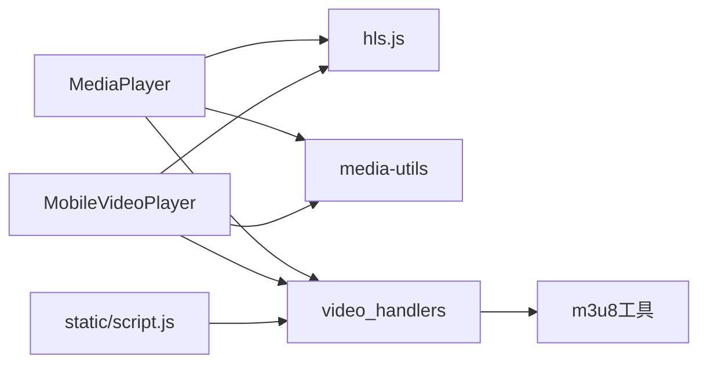

# HLS流媒体处理

<cite>
**本文引用的文件**
- [README.md](file://README.md)
- [app/web/components/media-player.tsx](file://app/web/components/media-player.tsx)
- [app/web/components/mobile-video-player.tsx](file://app/web/components/mobile-video-player.tsx)
- [app/web/lib/media-utils.ts](file://app/web/lib/media-utils.ts)
- [app/web/types/media.ts](file://app/web/types/media.ts)
- [app/web/app/videos/play/page.tsx](file://app/web/app/videos/play/page/page.tsx)
- [app/server/src/utils/m3u8.rs](file://app/server/src/utils/m3u8.rs)
- [app/server/src/routes/video_handlers.rs](file://app/server/src/routes/video_handlers.rs)
- [app/server/static/script.js](file://app/server/static/script.js)
</cite>

## 目录
1. [引言](#引言)
2. [项目结构](#项目结构)
3. [核心组件](#核心组件)
4. [架构总览](#架构总览)
5. [详细组件分析](#详细组件分析)
6. [依赖关系分析](#依赖关系分析)
7. [性能考量](#性能考量)
8. [故障排查指南](#故障排查指南)
9. [结论](#结论)
10. [附录](#附录)

## 引言
本文件面向HLS流媒体处理的前端与后端实现，系统性阐述：
- HLS.js库的集成方式与初始化流程
- 浏览器原生支持与HLS.js回退策略
- playlist.m3u8的处理与动态加载机制
- 播放器生命周期管理（HLS实例创建、销毁与错误处理）
- 性能优化与兼容性处理建议

该文档同时结合仓库中的前端播放器组件、媒体工具与后端路由/工具，帮助读者快速理解并落地HLS播放能力。

## 项目结构
项目由前后端两部分组成：
- 前端（Next.js应用）：负责媒体播放器渲染、HLS.js集成、播放控制与UI交互
- 后端（Rust + Axum）：提供视频列表与详情API、静态文件服务、m3u8工具与目录扫描

图表来源
- [app/web/components/media-player.tsx](file://app/web/components/media-player.tsx#L1-L120)
- [app/web/components/mobile-video-player.tsx](file://app/web/components/mobile-video-player.tsx#L42-L178)
- [app/web/lib/media-utils.ts](file://app/web/lib/media-utils.ts#L1-L43)
- [app/web/types/media.ts](file://app/web/types/media.ts#L1-L20)
- [app/web/app/videos/play/page.tsx](file://app/web/app/videos/play/page.tsx#L1-L176)
- [app/server/src/routes/video_handlers.rs](file://app/server/src/routes/video_handlers.rs#L1-L104)
- [app/server/src/utils/m3u8.rs](file://app/server/src/utils/m3u8.rs#L1-L148)
- [app/server/static/script.js](file://app/server/static/script.js#L1-L67)

章节来源
- [README.md](file://README.md#L1-L120)
- [app/web/components/media-player.tsx](file://app/web/components/media-player.tsx#L1-L120)
- [app/web/components/mobile-video-player.tsx](file://app/web/components/mobile-video-player.tsx#L42-L178)
- [app/server/src/routes/video_handlers.rs](file://app/server/src/routes/video_handlers.rs#L1-L104)

## 核心组件
- 媒体类型识别与URL构造
  - 前端根据媒体类型决定是否走HLS路径，并将目录型HLS映射到playlist.m3u8
  - 参考：[getMediaUrl](file://app/web/components/media-player.tsx#L33-L43)
- HLS.js动态导入与初始化
  - 前端在检测到HLS类型时，动态import hls.js并在支持时创建HLS实例，绑定媒体元素
  - 参考：[loadHls](file://app/web/components/media-player.tsx#L54-L81)
- 原生HLS回退策略
  - 若HLS.js不可用，则检测video.canPlayType("application/vnd.apple.mpegurl")，在Safari等原生支持HLS的环境下直接赋值src
  - 参考：[原生回退](file://app/web/components/media-player.tsx#L73-L77)
- 播放器生命周期管理
  - 组件卸载时销毁HLS实例，避免内存泄漏
  - 参考：[销毁逻辑](file://app/web/components/media-player.tsx#L70-L72)
- 媒体工具与类型判断
  - getMediaType将包含"hls"或等于"m3u8"的类型统一为"hls"
  - 参考：[getMediaType](file://app/web/lib/media-utils.ts#L3-L15)
- 后端API与m3u8工具
  - 视频详情接口支持目录与m3u8类型，返回子项列表
  - m3u8工具提供目录扫描、查找与合并MP4的能力
  - 参考：[get_video_details](file://app/server/src/routes/video_handlers.rs#L30-L70)、[has_m3u8_file/check_m3u8_file](file://app/server/src/utils/m3u8.rs#L7-L41)

章节来源
- [app/web/components/media-player.tsx](file://app/web/components/media-player.tsx#L33-L81)
- [app/web/lib/media-utils.ts](file://app/web/lib/media-utils.ts#L3-L15)
- [app/server/src/routes/video_handlers.rs](file://app/server/src/routes/video_handlers.rs#L30-L70)
- [app/server/src/utils/m3u8.rs](file://app/server/src/utils/m3u8.rs#L7-L41)

## 架构总览
HLS播放的整体流程如下：
- 前端根据媒体类型判断是否为HLS
- 若为HLS：动态加载HLS.js；若HLS.js不可用则回退至原生HLS
- HLS.js加载成功后，loadSource加载playlist.m3u8，attachMedia绑定video元素
- MANIFEST_PARSED事件触发后按需自动播放
- 组件卸载时销毁HLS实例，防止资源泄露

图表来源
- [app/web/components/media-player.tsx](file://app/web/components/media-player.tsx#L54-L81)
- [app/server/src/routes/video_handlers.rs](file://app/server/src/routes/video_handlers.rs#L30-L70)

## 详细组件分析

### 前端HLS播放器组件（MediaPlayer）
- 功能要点
  - 根据类型构造播放URL：目录型HLS指向playlist.m3u8
  - 动态import hls.js，检测Hls.isSupported()后创建实例并绑定媒体
  - 原生回退：video.canPlayType("application/vnd.apple.mpegurl")成立时直接赋值src
  - 生命周期：组件卸载时destroy()释放资源
- 关键流程图（基于组件逻辑）

图表来源
- [app/web/components/media-player.tsx](file://app/web/components/media-player.tsx#L33-L81)

章节来源
- [app/web/components/media-player.tsx](file://app/web/components/media-player.tsx#L33-L81)

### 移动端HLS播放器组件（MobileVideoPlayer）
- 功能要点
  - 与MediaPlayer类似，但使用动态script标签加载hls.js
  - 支持enableWorker与lowLatencyMode等配置
  - 监听Hls.Events.ERROR进行致命错误处理
  - 组件卸载时destroy()释放HLS实例
- 关键流程图（基于组件逻辑）

图表来源
- [app/web/components/mobile-video-player.tsx](file://app/web/components/mobile-video-player.tsx#L42-L100)
- [app/web/components/mobile-video-player.tsx](file://app/web/components/mobile-video-player.tsx#L141-L148)

章节来源
- [app/web/components/mobile-video-player.tsx](file://app/web/components/mobile-video-player.tsx#L42-L100)
- [app/web/components/mobile-video-player.tsx](file://app/web/components/mobile-video-player.tsx#L141-L148)

### 媒体类型识别与URL构造
- getMediaType将"hls"或"m3u8"统一为"hls"类型，便于前端统一处理
- getMediaUrl将目录型HLS映射到playlist.m3u8，其他类型直接返回原始路径
- normalizeMediaPath用于前端URL规范化

章节来源
- [app/web/lib/media-utils.ts](file://app/web/lib/media-utils.ts#L3-L15)
- [app/web/lib/media-utils.ts](file://app/web/lib/media-utils.ts#L39-L43)
- [app/web/components/media-player.tsx](file://app/web/components/media-player.tsx#L33-L43)

### 后端API与m3u8工具
- 视频详情接口
  - 对目录与m3u8类型返回子项列表，便于前端渲染HLS目录树
  - 参考：[get_video_details](file://app/server/src/routes/video_handlers.rs#L30-L70)
- m3u8工具
  - has_m3u8_file/check_m3u8_file：快速检测目录中是否存在m3u8文件
  - merge_m3u8_to_mp4：将m3u8合并为mp4（依赖ffmpeg），并清理原目录
  - 参考：[has_m3u8_file/check_m3u8_file](file://app/server/src/utils/m3u8.rs#L7-L41)、[merge_m3u8_to_mp4](file://app/server/src/utils/m3u8.rs#L50-L127)

章节来源
- [app/server/src/routes/video_handlers.rs](file://app/server/src/routes/video_handlers.rs#L30-L70)
- [app/server/src/utils/m3u8.rs](file://app/server/src/utils/m3u8.rs#L7-L41)
- [app/server/src/utils/m3u8.rs](file://app/server/src/utils/m3u8.rs#L50-L127)

## 依赖关系分析
- 前端播放器依赖
  - hls.js：动态导入与实例化
  - HTMLVideoElement：媒体绑定与事件监听
  - 媒体工具：类型识别与URL规范化
- 后端依赖
  - Axum：路由与响应
  - m3u8工具：目录扫描与合并MP4
  - 静态资源：示例页面与脚本

图表来源
- [app/web/components/media-player.tsx](file://app/web/components/media-player.tsx#L54-L81)
- [app/web/components/mobile-video-player.tsx](file://app/web/components/mobile-video-player.tsx#L42-L100)
- [app/web/lib/media-utils.ts](file://app/web/lib/media-utils.ts#L1-L43)
- [app/server/src/routes/video_handlers.rs](file://app/server/src/routes/video_handlers.rs#L1-L104)
- [app/server/src/utils/m3u8.rs](file://app/server/src/utils/m3u8.rs#L1-L148)
- [app/server/static/script.js](file://app/server/static/script.js#L1-L67)

章节来源
- [app/web/components/media-player.tsx](file://app/web/components/media-player.tsx#L54-L81)
- [app/web/components/mobile-video-player.tsx](file://app/web/components/mobile-video-player.tsx#L42-L100)
- [app/server/src/routes/video_handlers.rs](file://app/server/src/routes/video_handlers.rs#L1-L104)

## 性能考量
- 播放器初始化
  - 使用动态import("hls.js")按需加载，减少首屏体积
  - 参考：[动态导入](file://app/web/components/media-player.tsx#L56-L56)
- 低延迟与工作线程
  - MobileVideoPlayer启用enableWorker与lowLatencyMode，降低延迟
  - 参考：[Hls配置](file://app/web/components/mobile-video-player.tsx#L66-L69)
- 自动播放策略
  - MediaPlayer在MANIFEST_PARSED后按autoPlay条件播放，避免早期失败
  - 参考：[自动播放](file://app/web/components/media-player.tsx#L64-L68)
- 生命周期管理
  - 组件卸载时destroy()释放HLS实例，避免内存泄漏
  - 参考：[销毁](file://app/web/components/media-player.tsx#L70-L72)、[销毁](file://app/web/components/mobile-video-player.tsx#L143-L147)
- 后端静态资源
  - 使用/public前缀直接提供静态文件，配合CDN可进一步加速
  - 参考：[静态访问示例](file://README.md#L160-L164)

章节来源
- [app/web/components/media-player.tsx](file://app/web/components/media-player.tsx#L54-L81)
- [app/web/components/mobile-video-player.tsx](file://app/web/components/mobile-video-player.tsx#L66-L69)
- [README.md](file://README.md#L160-L164)

## 故障排查指南
- HLS.js加载失败
  - 现象：移动端组件显示“HLS.js加载失败”
  - 排查：确认网络可达与CDN可用；检查script.onerror回调
  - 参考：[onerror处理](file://app/web/components/mobile-video-player.tsx#L95-L98)
- 浏览器不支持HLS
  - 现象：显示“浏览器不支持HLS视频播放”
  - 排查：确认canPlayType检测路径；Safari原生支持HLS
  - 参考：[原生回退](file://app/web/components/mobile-video-player.tsx#L55-L59)
- HLS错误事件
  - 现象：Hls.Events.ERROR fatal为true时停止加载
  - 排查：检查playlist.m3u8可访问性、跨域与网络状况
  - 参考：[ERROR处理](file://app/web/components/mobile-video-player.tsx#L83-L89)
- 自动播放失败
  - 现象：video.play()抛错，isPlaying保持false
  - 排查：移动端自动播放策略限制，建议引导用户交互后再播放
  - 参考：[autoplay失败处理](file://app/web/components/mobile-video-player.tsx#L77-L81)
- 后端m3u8合并失败
  - 现象：merge_m3u8_to_mp4返回错误
  - 排查：确认ffmpeg安装与权限；检查m3u8路径与输出目录
  - 参考：[合并MP4](file://app/server/src/utils/m3u8.rs#L88-L127)

章节来源
- [app/web/components/mobile-video-player.tsx](file://app/web/components/mobile-video-player.tsx#L55-L98)
- [app/web/components/mobile-video-player.tsx](file://app/web/components/mobile-video-player.tsx#L77-L81)
- [app/server/src/utils/m3u8.rs](file://app/server/src/utils/m3u8.rs#L88-L127)

## 结论
本项目在前端实现了完善的HLS播放能力：动态加载HLS.js、原生回退、生命周期管理与错误处理；在后端提供了m3u8工具与API支持，便于HLS目录的发现与管理。通过合理的性能优化与兼容性处理，可在多平台稳定播放HLS流媒体。

## 附录
- 浏览器兼容性
  - Chrome/Edge/Firefox/Safari均支持；Safari原生HLS
  - 参考：[README浏览器兼容性](file://README.md#L152-L158)
- 播放页集成
  - 播放页通过sessionStorage传递当前视频，移动端播放器作为容器
  - 参考：[播放页](file://app/web/app/videos/play/page.tsx#L1-L176)

章节来源
- [README.md](file://README.md#L152-L158)
- [app/web/app/videos/play/page.tsx](file://app/web/app/videos/play/page.tsx#L1-L176)