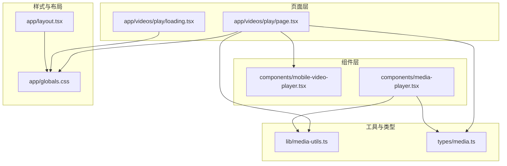
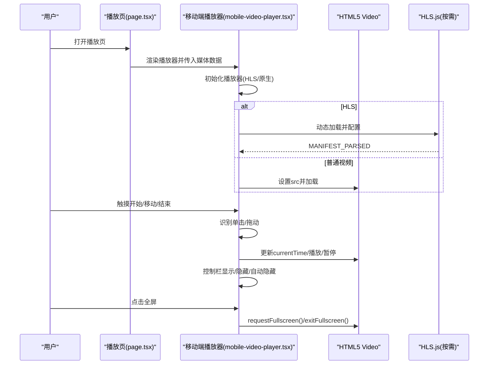
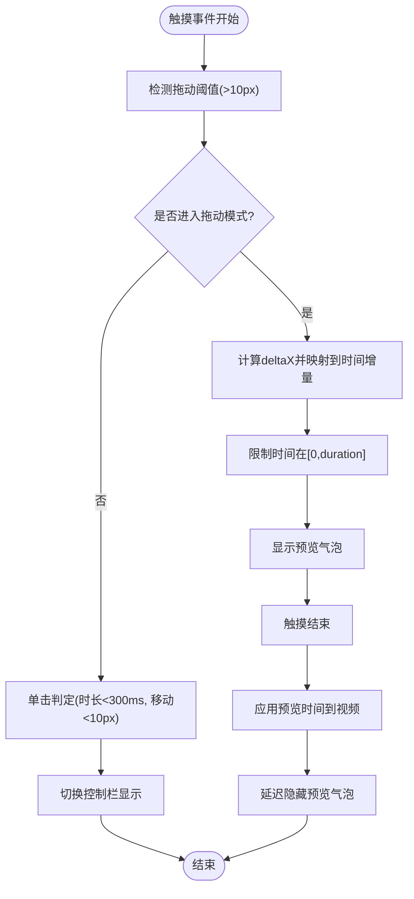
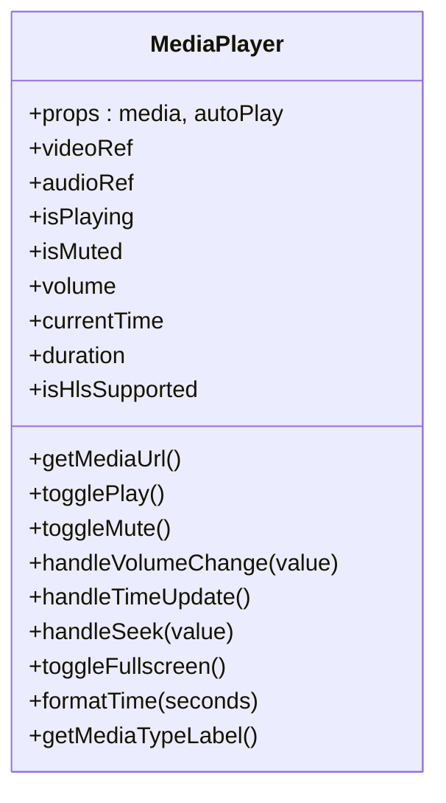
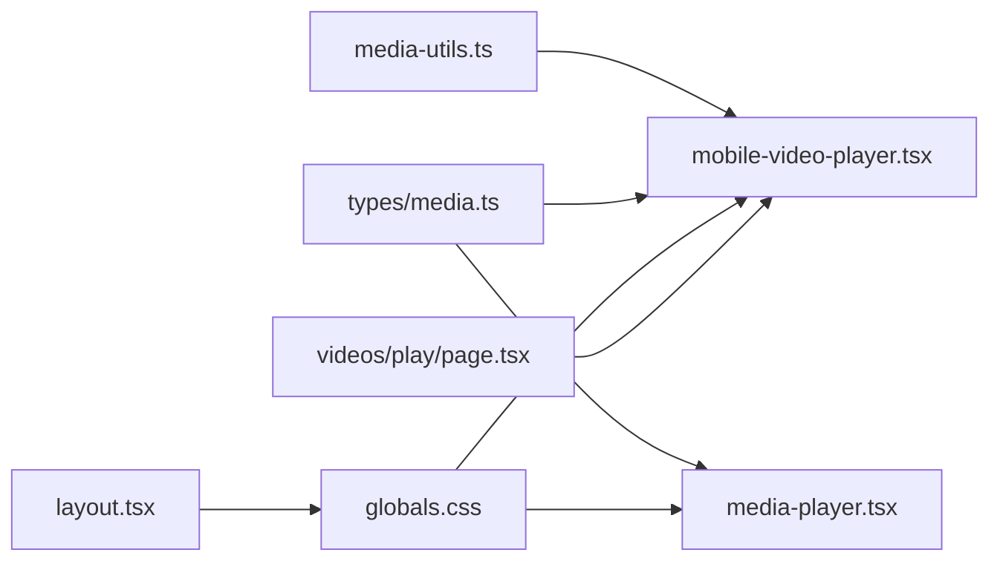

# 响应式播放器设计

<cite>
**本文引用的文件**
- [app/web/components/mobile-video-player.tsx](file://app/web/components/mobile-video-player.tsx)
- [app/web/components/media-player.tsx](file://app/web/components/media-player.tsx)
- [app/web/app/videos/play/page.tsx](file://app/web/app/videos/play/page.tsx)
- [app/web/app/videos/play/loading.tsx](file://app/web/app/videos/play/loading.tsx)
- [app/web/lib/media-utils.ts](file://app/web/lib/media-utils.ts)
- [app/web/types/media.ts](file://app/web/types/media.ts)
- [app/web/app/layout.tsx](file://app/web/app/layout.tsx)
- [app/web/app/globals.css](file://app/web/app/globals.css)
- [app/web/IMPLEMENTATION.md](file://app/web/IMPLEMENTATION.md)
- [app/web/README.md](file://app/web/README.md)
- [app/server/static/style.css](file://app/server/static/style.css)
</cite>

## 目录
1. [引言](#引言)
2. [项目结构](#项目结构)
3. [核心组件](#核心组件)
4. [架构总览](#架构总览)
5. [详细组件分析](#详细组件分析)
6. [依赖关系分析](#依赖关系分析)
7. [性能考量](#性能考量)
8. [故障排查指南](#故障排查指南)
9. [结论](#结论)
10. [附录](#附录)

## 引言
本文件系统性梳理该视频播放器的响应式设计与移动端手势交互实现，重点覆盖：
- 桌面端与移动端播放器的差异化设计策略
- 移动端触摸手势支持与手势控制实现
- 自适应布局与不同屏幕尺寸下的播放器尺寸调整
- 移动端特有的播放器功能（全屏、加载/错误状态、进度预览气泡等）
- 跨设备兼容性测试与调试要点

## 项目结构
前端采用 Next.js + Tailwind CSS 构建，播放器以组件形式复用，页面通过路由承载播放器与信息卡片，全局样式统一管理。

图表来源
- [app/web/app/videos/play/page.tsx](file://app/web/app/videos/play/page.tsx#L1-L176)
- [app/web/app/videos/play/loading.tsx](file://app/web/app/videos/play/loading.tsx#L1-L31)
- [app/web/components/mobile-video-player.tsx](file://app/web/components/mobile-video-player.tsx#L1-L479)
- [app/web/components/media-player.tsx](file://app/web/components/media-player.tsx#L1-L322)
- [app/web/lib/media-utils.ts](file://app/web/lib/media-utils.ts#L1-L43)
- [app/web/types/media.ts](file://app/web/types/media.ts#L1-L20)
- [app/web/app/layout.tsx](file://app/web/app/layout.tsx#L1-L35)
- [app/web/app/globals.css](file://app/web/app/globals.css#L1-L131)

章节来源
- [app/web/app/videos/play/page.tsx](file://app/web/app/videos/play/page.tsx#L1-L176)
- [app/web/app/videos/play/loading.tsx](file://app/web/app/videos/play/loading.tsx#L1-L31)
- [app/web/components/mobile-video-player.tsx](file://app/web/components/mobile-video-player.tsx#L1-L479)
- [app/web/components/media-player.tsx](file://app/web/components/media-player.tsx#L1-L322)
- [app/web/lib/media-utils.ts](file://app/web/lib/media-utils.ts#L1-L43)
- [app/web/types/media.ts](file://app/web/types/media.ts#L1-L20)
- [app/web/app/layout.tsx](file://app/web/app/layout.tsx#L1-L35)
- [app/web/app/globals.css](file://app/web/app/globals.css#L1-L131)

## 核心组件
- 移动端播放器组件：提供触摸手势、进度预览、自动隐藏控制栏、全屏等功能，适配移动端横竖屏与安全区域。
- 桌面端播放器组件：基于 HTML5 video/audio，提供通用播放控制与 HLS 支持，适合桌面端交互。
- 页面承载组件：视频播放页负责导航、信息卡片展示与移动端播放器容器。
- 工具函数：媒体类型识别、时长格式化、文件大小格式化、路径规范化。
- 类型定义：MediaItem、MediaType，统一前后端数据契约。

章节来源
- [app/web/components/mobile-video-player.tsx](file://app/web/components/mobile-video-player.tsx#L1-L479)
- [app/web/components/media-player.tsx](file://app/web/components/media-player.tsx#L1-L322)
- [app/web/app/videos/play/page.tsx](file://app/web/app/videos/play/page.tsx#L1-L176)
- [app/web/lib/media-utils.ts](file://app/web/lib/media-utils.ts#L1-L43)
- [app/web/types/media.ts](file://app/web/types/media.ts#L1-L20)

## 架构总览
移动端播放器作为页面的核心渲染单元，负责：
- 媒体资源加载（HLS/普通视频）
- 触摸手势识别与进度拖动
- 控制栏显示/隐藏与自动隐藏
- 加载/错误状态提示
- 全屏切换
- 播放状态指示与预览气泡

图表来源
- [app/web/app/videos/play/page.tsx](file://app/web/app/videos/play/page.tsx#L1-L176)
- [app/web/components/mobile-video-player.tsx](file://app/web/components/mobile-video-player.tsx#L1-L479)

## 详细组件分析

### 移动端播放器组件（手势与自适应）
- 触摸手势支持
  - 单击切换控制栏显示；拖动调整进度；拖动过程显示进度预览气泡；拖动结束后延迟隐藏预览气泡。
  - 通过阈值区分单击与拖动，防默认滚动行为。
- 自适应布局
  - 使用宽高比类名保证视频容器比例一致；容器内使用对象填充策略适配不同纵横比。
  - 页面顶部导航栏与底部安全区结合，适配刘海屏/圆角屏。
- 全屏与沉浸式体验
  - 提供全屏切换；播放状态在控制栏隐藏时于中央显示短暂指示器。
- 加载/错误状态
  - 加载中提供现代加载动画；错误时提供提示与“重新加载”入口。
- HLS 支持
  - 原生 HLS（Safari）与动态加载 HLS.js 并配置工作线程与低延迟模式。

图表来源
- [app/web/components/mobile-video-player.tsx](file://app/web/components/mobile-video-player.tsx#L232-L299)

章节来源
- [app/web/components/mobile-video-player.tsx](file://app/web/components/mobile-video-player.tsx#L1-L479)
- [app/web/app/videos/play/page.tsx](file://app/web/app/videos/play/page.tsx#L1-L176)

### 桌面端播放器组件（通用控制与 HLS）
- 媒体类型识别：根据类型自动选择 video/audio，并处理 HLS（原生或 HLS.js）。
- 控制栏：播放/暂停、静音、音量、进度条、全屏、下载。
- 时间格式化与媒体类型标签。
- HLS 初始化：支持 manifest 解析后自动播放。

图表来源
- [app/web/components/media-player.tsx](file://app/web/components/media-player.tsx#L1-L322)

章节来源
- [app/web/components/media-player.tsx](file://app/web/components/media-player.tsx#L1-L322)

### 页面承载与信息卡片
- 顶部导航栏：返回按钮、标题、分享按钮。
- 播放器容器：包裹移动端播放器，设置圆角与阴影。
- 信息卡片：分辨率、类型、大小、比特率、时长、创建时间、文件路径等。
- 底部安全区域：适配刘海屏底部安全区。

章节来源
- [app/web/app/videos/play/page.tsx](file://app/web/app/videos/play/page.tsx#L1-L176)

### 工具与类型
- 媒体类型识别：将扩展名归类为 hls/audio/video。
- 时长格式化：支持小时单位。
- 文件大小格式化：B/KB/MB/GB。
- 路径规范化：将后端路径转换为前端可用 URL。
- MediaItem/ MediaType：统一媒体数据结构与类型。

章节来源
- [app/web/lib/media-utils.ts](file://app/web/lib/media-utils.ts#L1-L43)
- [app/web/types/media.ts](file://app/web/types/media.ts#L1-L20)

## 依赖关系分析
- 组件依赖
  - 播放页依赖移动端播放器组件与工具函数。
  - 移动端播放器依赖 UI Button、类型定义与媒体工具。
  - 桌面端播放器依赖 UI 组件与媒体工具。
- 样式依赖
  - 全局样式统一字体、颜色与基础排版；页面容器使用容器类与安全区域类。
- 第三方库
  - HLS.js：按需动态加载，用于非 Safari 的 HLS 播放。
  - Lucide React 图标：统一图标风格。

图表来源
- [app/web/lib/media-utils.ts](file://app/web/lib/media-utils.ts#L1-L43)
- [app/web/types/media.ts](file://app/web/types/media.ts#L1-L20)
- [app/web/app/globals.css](file://app/web/app/globals.css#L1-L131)
- [app/web/app/layout.tsx](file://app/web/app/layout.tsx#L1-L35)
- [app/web/app/videos/play/page.tsx](file://app/web/app/videos/play/page.tsx#L1-L176)
- [app/web/components/mobile-video-player.tsx](file://app/web/components/mobile-video-player.tsx#L1-L479)
- [app/web/components/media-player.tsx](file://app/web/components/media-player.tsx#L1-L322)

章节来源
- [app/web/lib/media-utils.ts](file://app/web/lib/media-utils.ts#L1-L43)
- [app/web/types/media.ts](file://app/web/types/media.ts#L1-L20)
- [app/web/app/globals.css](file://app/web/app/globals.css#L1-L131)
- [app/web/app/layout.tsx](file://app/web/app/layout.tsx#L1-L35)
- [app/web/app/videos/play/page.tsx](file://app/web/app/videos/play/page.tsx#L1-L176)
- [app/web/components/mobile-video-player.tsx](file://app/web/components/mobile-video-player.tsx#L1-L479)
- [app/web/components/media-player.tsx](file://app/web/components/media-player.tsx#L1-L322)

## 性能考量
- 触摸事件与状态更新
  - 拖动过程中实时更新预览时间，避免节流以保证体验；控制栏自动隐藏计时器在组件卸载时清理，拖动时暂停计时器。
- HLS 加载
  - 动态按需加载 HLS.js，启用工作线程与低延迟模式，manifest 解析后自动播放。
- 样式与渲染
  - 使用 Tailwind 原子类减少样式复杂度；渐变遮罩与过渡动画在 hover/显示时使用，避免过度重绘。
- 资源路径
  - 路径规范化避免 Windows 分隔符导致的请求异常；HLS 使用原生或外部 CDN 脚本，减少本地体积。

章节来源
- [app/web/IMPLEMENTATION.md](file://app/web/IMPLEMENTATION.md#L239-L266)
- [app/web/components/mobile-video-player.tsx](file://app/web/components/mobile-video-player.tsx#L1-L479)
- [app/web/lib/media-utils.ts](file://app/web/lib/media-utils.ts#L1-L43)

## 故障排查指南
- 播放失败
  - 检查媒体类型与路径；确认 HLS.js 是否成功加载；查看错误事件回调与控制台日志。
- 自动播放失败
  - 移动端/浏览器策略限制，组件已捕获并降级为暂停状态；可在用户交互后再次尝试播放。
- 横竖屏切换
  - 全屏切换后，容器宽高比保持不变；若出现黑边，检查对象填充策略与 poster 设置。
- 加载/错误状态
  - 加载中提供旋转动画；错误时提供“重新加载”按钮；确认网络连通与 CORS 配置。
- 安全区域与导航栏
  - 顶部导航栏与底部安全区确保内容不被遮挡；若出现遮挡，检查安全区域类与容器内边距。

章节来源
- [app/web/components/mobile-video-player.tsx](file://app/web/components/mobile-video-player.tsx#L1-L479)
- [app/web/app/videos/play/page.tsx](file://app/web/app/videos/play/page.tsx#L1-L176)
- [app/web/IMPLEMENTATION.md](file://app/web/IMPLEMENTATION.md#L281-L320)

## 结论
该播放器在移动端实现了完整的触摸手势交互与沉浸式体验，同时通过全局样式与容器布局保障了跨设备的一致性。桌面端播放器提供了通用控制与 HLS 支持，满足多场景需求。整体设计遵循响应式原则，结合工具函数与类型定义，形成清晰的组件边界与可维护性。

## 附录

### 桌面端与移动端差异化设计策略
- 交互方式
  - 桌面端：鼠标悬停显示控制栏，进度条拖动为主；移动端：触摸手势识别，单击/拖动双通道控制。
- 控制栏布局
  - 桌面端：控制栏位于底部，包含完整控件；移动端：控制栏更紧凑，底部进度条+左右按钮，中央播放/暂停指示器。
- 媒体类型处理
  - 桌面端：优先原生支持的视频格式；移动端：统一通过 HLS.js 或原生 HLS，提升兼容性。
- 自适应与全屏
  - 桌面端：全屏切换与窗口尺寸变化；移动端：全屏与安全区域适配，避免系统 UI 遮挡。

章节来源
- [app/web/components/media-player.tsx](file://app/web/components/media-player.tsx#L1-L322)
- [app/web/components/mobile-video-player.tsx](file://app/web/components/mobile-video-player.tsx#L1-L479)
- [app/web/app/videos/play/page.tsx](file://app/web/app/videos/play/page.tsx#L1-L176)

### 移动端触摸手势支持与实现
- 单击切换控制栏：通过触摸时长与位移阈值区分单击与拖动。
- 拖动进度调整：计算横向位移映射到时间增量，限制在有效范围内。
- 进度预览气泡：拖动时显示当前预览时间，结束后延迟隐藏。
- 自动隐藏控制栏：播放状态下定时隐藏，暂停时保持显示。
- 全屏切换：请求全屏与退出全屏。

章节来源
- [app/web/components/mobile-video-player.tsx](file://app/web/components/mobile-video-player.tsx#L232-L299)
- [app/web/IMPLEMENTATION.md](file://app/web/IMPLEMENTATION.md#L101-L178)

### 自适应布局与屏幕尺寸调整
- 宽高比：容器使用宽高比类名保证视频比例一致。
- 对象填充：视频元素使用对象填充策略适配不同纵横比。
- 安全区域：顶部导航栏与底部安全区结合，适配刘海屏/圆角屏。
- 页面容器：使用容器类与内边距，确保内容在不同宽度下居中与留白。

章节来源
- [app/web/app/videos/play/page.tsx](file://app/web/app/videos/play/page.tsx#L1-L176)
- [app/web/app/globals.css](file://app/web/app/globals.css#L1-L131)

### 移动端特有功能
- 全屏：支持全屏切换，提供沉浸式观看体验。
- 加载/错误状态：现代化加载动画与错误提示，支持一键重试。
- 播放状态指示：控制栏隐藏时在中央短暂显示播放/暂停状态。
- 安全区域：底部安全区确保内容不被系统栏遮挡。

章节来源
- [app/web/components/mobile-video-player.tsx](file://app/web/components/mobile-video-player.tsx#L317-L478)
- [app/web/app/videos/play/page.tsx](file://app/web/app/videos/play/page.tsx#L1-L176)

### 跨设备兼容性测试与调试
- 推荐测试环境：iOS Safari、Android Chrome、不同屏幕尺寸设备。
- 已测试环境：Chrome（桌面+移动模拟器）、Next.js 开发服务器。
- 兼容性注意：HLS 原生支持与动态加载 HLS.js；部分浏览器需要安全上下文；移动端触摸事件 API 支持情况。
- 调试要点：关注自动播放策略、HLS 加载错误事件、全屏切换回调、安全区域与导航栏遮挡问题。

章节来源
- [app/web/README.md](file://app/web/README.md#L152-L158)
- [app/web/IMPLEMENTATION.md](file://app/web/IMPLEMENTATION.md#L189-L200)
- [app/server/static/style.css](file://app/server/static/style.css#L60-L72)