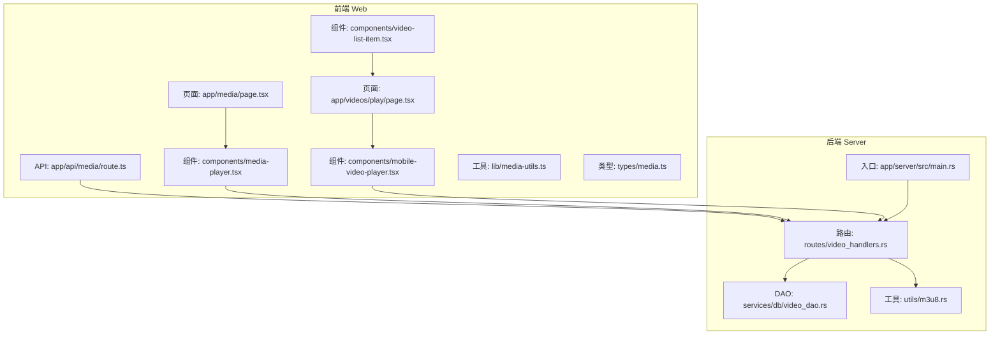
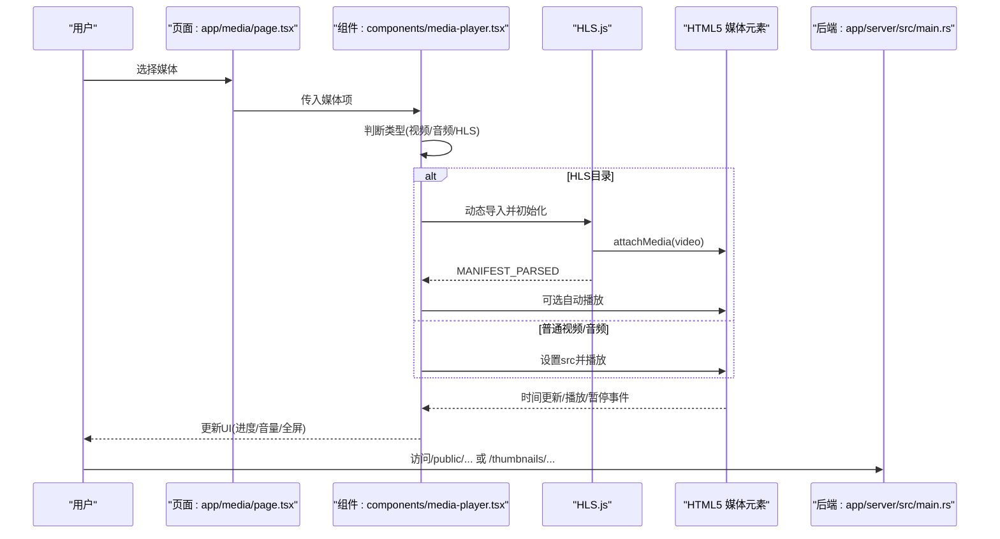
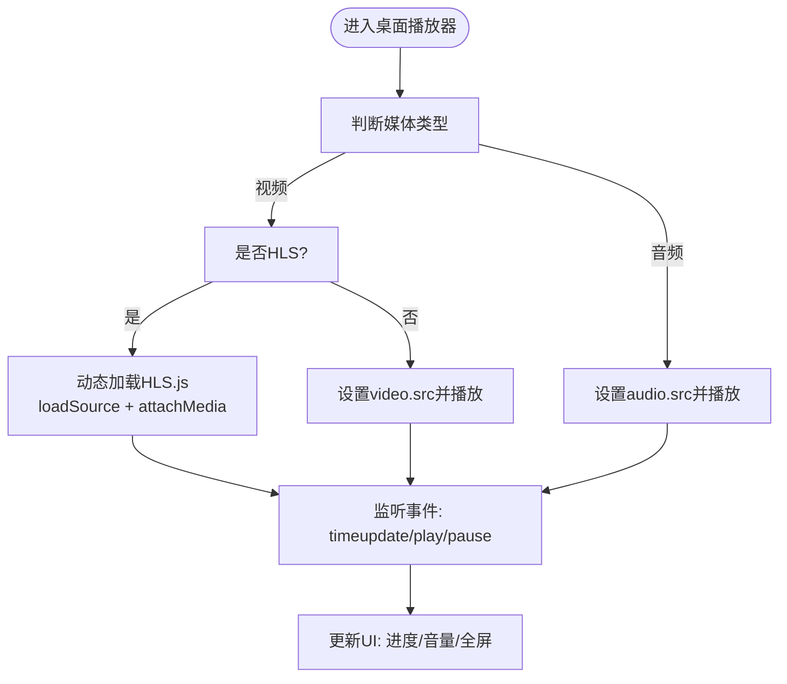
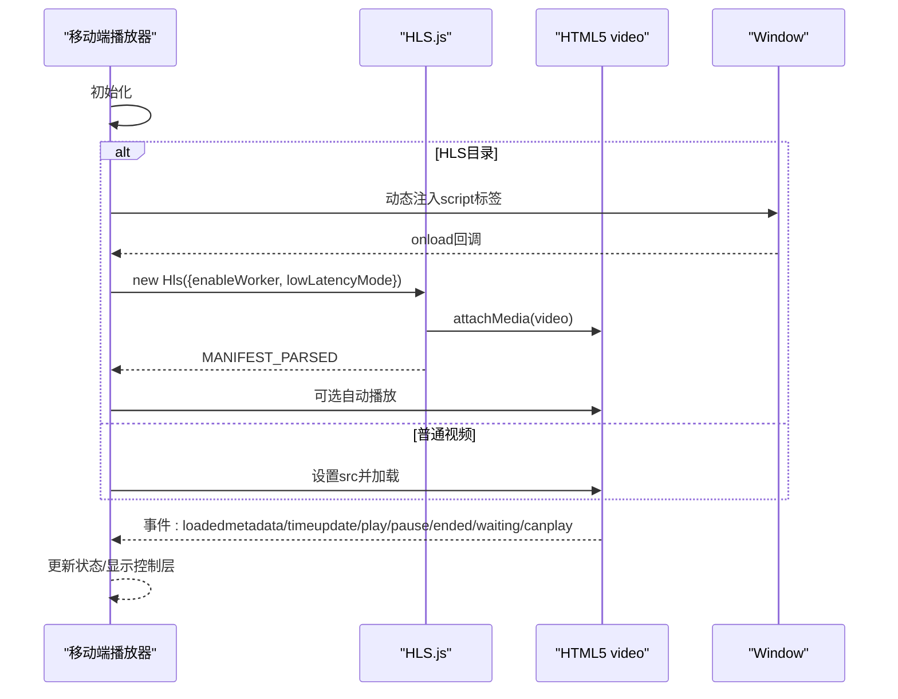
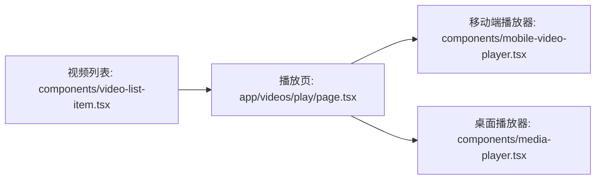
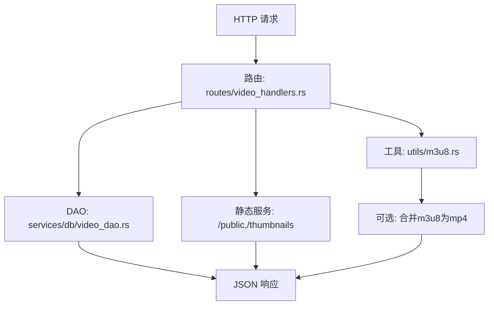
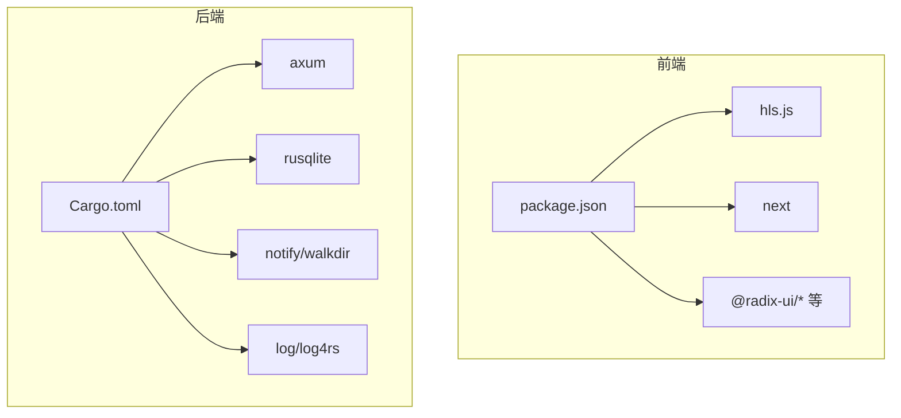

# 媒体播放功能

<cite>
**本文引用的文件**
- [app/server/src/main.rs](file://app/server/src/main.rs)
- [app/server/src/routes/video_handlers.rs](file://app/server/src/routes/video_handlers.rs)
- [app/server/src/utils/m3u8.rs](file://app/server/src/utils/m3u8.rs)
- [app/server/src/services/db/video_dao.rs](file://app/server/src/services/db/video_dao.rs)
- [app/web/app/media/page.tsx](file://app/web/app/media/page.tsx)
- [app/web/app/api/media/route.ts](file://app/web/app/api/media/route.ts)
- [app/web/app/videos/play/page.tsx](file://app/web/app/videos/play/page.tsx)
- [app/web/components/media-player.tsx](file://app/web/components/media-player.tsx)
- [app/web/components/mobile-video-player.tsx](file://app/web/components/mobile-video-player.tsx)
- [app/web/components/video-list-item.tsx](file://app/web/components/video-list-item.tsx)
- [app/web/lib/media-utils.ts](file://app/web/lib/media-utils.ts)
- [app/web/types/media.ts](file://app/web/types/media.ts)
- [app/web/package.json](file://app/web/package.json)
- [app/server/Cargo.toml](file://app/server/Cargo.toml)
</cite>

## 目录
1. [简介](#简介)
2. [项目结构](#项目结构)
3. [核心组件](#核心组件)
4. [架构总览](#架构总览)
5. [组件详解](#组件详解)
6. [依赖关系分析](#依赖关系分析)
7. [性能与优化](#性能与优化)
8. [故障排查指南](#故障排查指南)
9. [结论](#结论)
10. [附录](#附录)

## 简介
本文件系统性地文档化了媒体播放功能，涵盖多格式支持（MP4直连播放、HLS流媒体）、播放器组件设计（桌面版与移动端差异化）、HLS.js集成与流媒体控制、播放进度与音量控制、全屏功能、字幕与播放列表管理、错误处理策略、性能优化与兼容性注意事项。文档基于仓库现有实现进行分析与总结，帮助开发者快速理解与扩展播放能力。

## 项目结构
该工程采用前后端分离架构：
- 后端（Rust + Axum）负责媒体索引、目录扫描、HLS目录检测与m3u8合并为MP4（可选）、静态资源服务与CORS。
- 前端（Next.js + React）负责播放器UI、播放控制、移动端手势控制、错误提示与页面导航。

图表来源
- [app/web/app/media/page.tsx](file://app/web/app/media/page.tsx#L1-L147)
- [app/web/app/videos/play/page.tsx](file://app/web/app/videos/play/page.tsx#L1-L167)
- [app/web/components/media-player.tsx](file://app/web/components/media-player.tsx#L1-L322)
- [app/web/components/mobile-video-player.tsx](file://app/web/components/mobile-video-player.tsx#L1-L392)
- [app/web/app/api/media/route.ts](file://app/web/app/api/media/route.ts#L1-L73)
- [app/server/src/main.rs](file://app/server/src/main.rs#L1-L111)
- [app/server/src/routes/video_handlers.rs](file://app/server/src/routes/video_handlers.rs#L1-L104)
- [app/server/src/services/db/video_dao.rs](file://app/server/src/services/db/video_dao.rs#L1-L146)
- [app/server/src/utils/m3u8.rs](file://app/server/src/utils/m3u8.rs#L1-L148)

章节来源
- [app/server/src/main.rs](file://app/server/src/main.rs#L1-L111)
- [app/web/app/media/page.tsx](file://app/web/app/media/page.tsx#L1-L147)

## 核心组件
- 播放器组件（桌面版）：根据媒体类型自动选择HTML5 video/audio标签或HLS.js；提供播放/暂停、音量、进度条、全屏、下载等控制。
- 播放器组件（移动端）：针对触摸交互优化，内置加载/错误状态、自动隐藏控制层、手势触发控制显示、全屏切换。
- 媒体列表组件：展示媒体项、时长、格式、缩略图等信息，点击进入播放页。
- 媒体工具函数：类型判断、时长格式化、文件大小格式化、路径规范化。
- 类型定义：统一的媒体项接口，便于前后端协作。

章节来源
- [app/web/components/media-player.tsx](file://app/web/components/media-player.tsx#L1-L322)
- [app/web/components/mobile-video-player.tsx](file://app/web/components/mobile-video-player.tsx#L1-L392)
- [app/web/components/video-list-item.tsx](file://app/web/components/video-list-item.tsx#L1-L93)
- [app/web/lib/media-utils.ts](file://app/web/lib/media-utils.ts#L1-L43)
- [app/web/types/media.ts](file://app/web/types/media.ts#L1-L20)

## 架构总览
整体流程：
- 前端页面加载媒体列表（或直接进入播放页），根据媒体类型决定播放器渲染。
- 对于HLS目录，前端拼接 playlist.m3u8 并动态加载HLS.js；对于原生HLS（Safari），直接使用原生能力。
- 对于普通视频/音频，直接使用HTML5媒体元素播放。
- 后端提供静态资源服务（public/thumbnails）与API（列出视频、详情、手动同步）。

图表来源
- [app/web/app/media/page.tsx](file://app/web/app/media/page.tsx#L1-L147)
- [app/web/components/media-player.tsx](file://app/web/components/media-player.tsx#L1-L322)
- [app/server/src/main.rs](file://app/server/src/main.rs#L72-L90)

## 组件详解

### 播放器组件（桌面版）
- 多格式支持
  - 视频：mp4、webm、ogg、hls_directory、hls、m3u8
  - 音频：mp3、wav、aac、flac、ogg
  - HLS目录：自动拼接 playlist.m3u8 并动态加载HLS.js；若浏览器原生支持HLS，则直接使用原生能力
- 控制功能
  - 播放/暂停：切换HTML5媒体元素状态
  - 音量：静音切换与滑块调节
  - 进度：时间更新与拖拽跳转
  - 全屏：请求/退出全屏
  - 下载：提供下载链接
- 错误与兼容
  - 自动检测HLS支持，优先使用HLS.js，否则回退到原生HLS
  - 未识别格式时提示不支持

图表来源
- [app/web/components/media-player.tsx](file://app/web/components/media-player.tsx#L33-L120)
- [app/web/components/media-player.tsx](file://app/web/components/media-player.tsx#L165-L238)
- [app/web/components/media-player.tsx](file://app/web/components/media-player.tsx#L241-L311)

章节来源
- [app/web/components/media-player.tsx](file://app/web/components/media-player.tsx#L1-L322)

### 播放器组件（移动端）
- 交互优化
  - 触摸手势：点击/滑动重置控制层显示计时器，避免长时间遮挡
  - 控制层渐隐渐显，底部进度条与控制按钮布局优化
  - 全屏切换、播放/暂停、重新开始（参考组件内逻辑）
- HLS处理
  - 原生HLS（iOS Safari）：直接设置src
  - 其他浏览器：动态加载hls.js，启用worker与低延迟模式
  - 错误处理：fatal错误提示“视频加载失败”，脚本加载失败提示“HLS.js加载失败”
- 加载与错误状态
  - 加载中：旋转指示器
  - 错误：弹出错误信息与“重新加载”按钮
- 路径与预览
  - 支持从public目录直连播放
  - 可设置poster（缩略图）

图表来源
- [app/web/components/mobile-video-player.tsx](file://app/web/components/mobile-video-player.tsx#L34-L125)
- [app/web/components/mobile-video-player.tsx](file://app/web/components/mobile-video-player.tsx#L142-L178)
- [app/web/components/mobile-video-player.tsx](file://app/web/components/mobile-video-player.tsx#L227-L297)

章节来源
- [app/web/components/mobile-video-player.tsx](file://app/web/components/mobile-video-player.tsx#L1-L392)

### 媒体列表与播放页
- 媒体列表：展示缩略图、时长、格式标签、尺寸/码率等元信息，点击进入播放页
- 播放页：固定顶部导航栏、播放器容器、信息卡片（分辨率、类型、大小、码率、上传时间、文件名）

图表来源
- [app/web/components/video-list-item.tsx](file://app/web/components/video-list-item.tsx#L1-L93)
- [app/web/app/videos/play/page.tsx](file://app/web/app/videos/play/page.tsx#L1-L167)
- [app/web/components/mobile-video-player.tsx](file://app/web/components/mobile-video-player.tsx#L1-L392)
- [app/web/components/media-player.tsx](file://app/web/components/media-player.tsx#L1-L322)

章节来源
- [app/web/components/video-list-item.tsx](file://app/web/components/video-list-item.tsx#L1-L93)
- [app/web/app/videos/play/page.tsx](file://app/web/app/videos/play/page.tsx#L1-L167)

### 后端媒体服务与HLS处理
- 静态资源服务
  - /public/... 提供视频文件直连
  - /thumbnails/... 提供缩略图
- API
  - 列出根目录视频：/api/videos
  - 获取指定路径详情：/api/videos/[path]
  - 手动同步数据库：/api/sync
  - 文件监听器控制：/api/watcher/start、/api/watcher/stop、/api/watcher/status
- HLS目录检测与m3u8处理
  - 检测目录下是否存在m3u8文件
  - 可选将m3u8目录合并为mp4（调用FFmpeg），并删除原目录
- 数据访问
  - DAO提供根目录视频查询、子节点查询、按路径查询

图表来源
- [app/server/src/main.rs](file://app/server/src/main.rs#L72-L90)
- [app/server/src/routes/video_handlers.rs](file://app/server/src/routes/video_handlers.rs#L1-L104)
- [app/server/src/services/db/video_dao.rs](file://app/server/src/services/db/video_dao.rs#L1-L146)
- [app/server/src/utils/m3u8.rs](file://app/server/src/utils/m3u8.rs#L1-L148)

章节来源
- [app/server/src/main.rs](file://app/server/src/main.rs#L72-L90)
- [app/server/src/routes/video_handlers.rs](file://app/server/src/routes/video_handlers.rs#L1-L104)
- [app/server/src/utils/m3u8.rs](file://app/server/src/utils/m3u8.rs#L1-L148)
- [app/server/src/services/db/video_dao.rs](file://app/server/src/services/db/video_dao.rs#L1-L146)

## 依赖关系分析
- 前端依赖
  - React生态与UI组件库（Radix UI、Tailwind等）
  - HLS.js用于HLS播放
  - Next.js用于SSR/CSR与路由
- 后端依赖
  - Axum作为Web框架
  - rusqlite用于SQLite数据库
  - notify/walkdir用于文件系统监控与遍历
  - log/log4rs用于日志

图表来源
- [app/web/package.json](file://app/web/package.json#L1-L74)
- [app/server/Cargo.toml](file://app/server/Cargo.toml#L1-L23)

章节来源
- [app/web/package.json](file://app/web/package.json#L1-L74)
- [app/server/Cargo.toml](file://app/server/Cargo.toml#L1-L23)

## 性能与优化
- 播放器性能
  - HLS.js启用worker与低延迟模式（移动端组件）
  - 预加载metadata，减少首帧等待
  - 移动端控制层自动隐藏，降低渲染开销
- 资源加载
  - 静态资源通过后端ServeDir提供，避免跨域问题
  - HLS目录直接指向playlist.m3u8，减少额外请求
- 数据库与索引
  - 根目录视频查询与子节点查询使用SQL预编译语句，避免重复解析
  - m3u8目录可选合并为MP4，减少HLS复杂度
- 前端优化
  - 条件渲染（HLS vs 原生），避免不必要的初始化
  - 使用受控组件更新进度与音量，减少重绘

章节来源
- [app/web/components/mobile-video-player.tsx](file://app/web/components/mobile-video-player.tsx#L53-L91)
- [app/server/src/utils/m3u8.rs](file://app/server/src/utils/m3u8.rs#L1-L148)
- [app/server/src/services/db/video_dao.rs](file://app/server/src/services/db/video_dao.rs#L1-L146)

## 故障排查指南
- HLS无法播放
  - 检查是否为HLS目录或m3u8类型，确认playlist.m3u8路径正确
  - 若浏览器不支持HLS，需确保HLS.js已成功加载并初始化
  - fatal错误会触发错误提示，检查网络与跨域设置
- 自动播放失败
  - 移动端/部分浏览器限制自动播放，组件内已捕获并回退到手动播放
- 资源无法访问
  - 确认后端静态服务已启动，/public与/thumbnails路径可访问
  - 检查CORS配置
- 数据库不同步
  - 使用手动同步接口刷新数据库索引

章节来源
- [app/web/components/mobile-video-player.tsx](file://app/web/components/mobile-video-player.tsx#L75-L91)
- [app/web/components/mobile-video-player.tsx](file://app/web/components/mobile-video-player.tsx#L119-L125)
- [app/server/src/main.rs](file://app/server/src/main.rs#L62-L90)
- [app/server/src/routes/video_handlers.rs](file://app/server/src/routes/video_handlers.rs#L72-L104)

## 结论
该媒体播放功能通过前后端协同实现了多格式支持与跨平台播放体验。桌面版与移动端分别针对各自交互特点进行了优化，HLS.js与原生HLS能力互补，保证了广泛的兼容性。后端提供了完善的静态资源服务与数据库索引能力，辅以可选的m3u8合并策略，进一步简化了播放链路。后续可在错误上报、字幕与播放列表管理方面继续增强。

## 附录

### 字幕文件处理
- 当前实现未见专门的字幕加载与切换逻辑。如需支持，可在播放器组件中引入track元素与字幕切换UI，并在后端提供字幕文件的静态服务路径。

章节来源
- [app/web/components/media-player.tsx](file://app/web/components/media-player.tsx#L165-L238)
- [app/server/src/main.rs](file://app/server/src/main.rs#L85-L89)

### 播放列表管理
- 当前页面未实现播放列表的自动构建与切换。可基于后端的children查询结果与前端路由，实现列表渲染与下一集自动播放逻辑。

章节来源
- [app/server/src/routes/video_handlers.rs](file://app/server/src/routes/video_handlers.rs#L30-L70)
- [app/server/src/services/db/video_dao.rs](file://app/server/src/services/db/video_dao.rs#L81-L119)

### 类型与工具函数
- 类型定义：统一的MediaItem接口，便于前后端协作
- 工具函数：类型判断、时长/大小格式化、路径规范化

章节来源
- [app/web/types/media.ts](file://app/web/types/media.ts#L1-L20)
- [app/web/lib/media-utils.ts](file://app/web/lib/media-utils.ts#L1-L43)