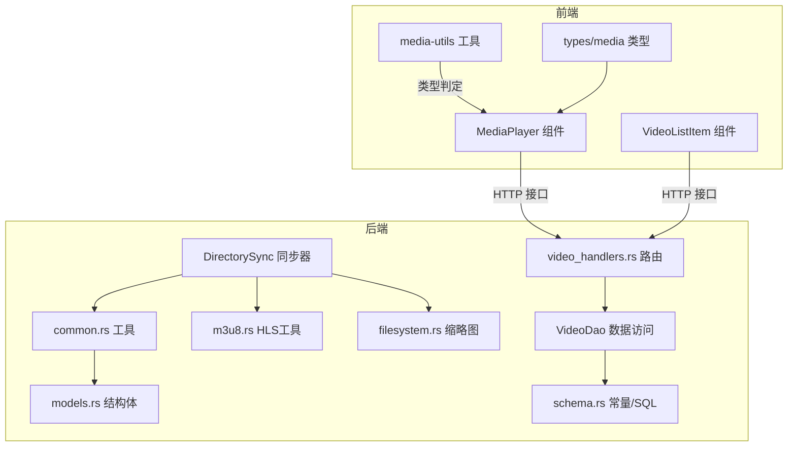
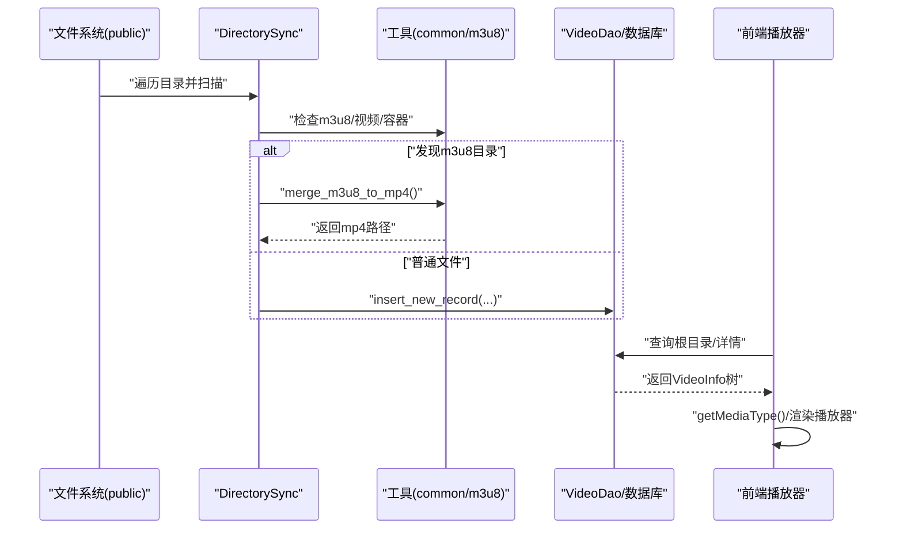
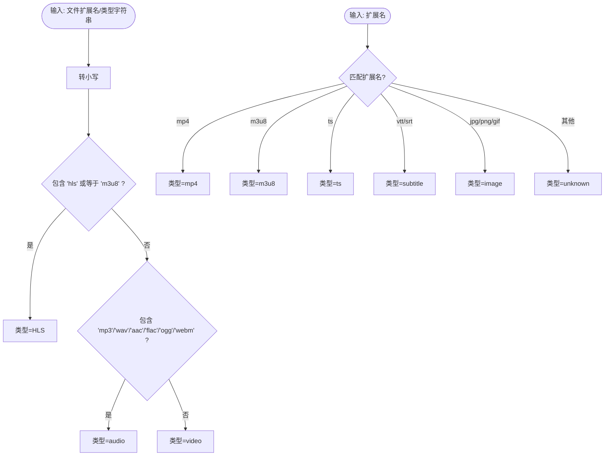
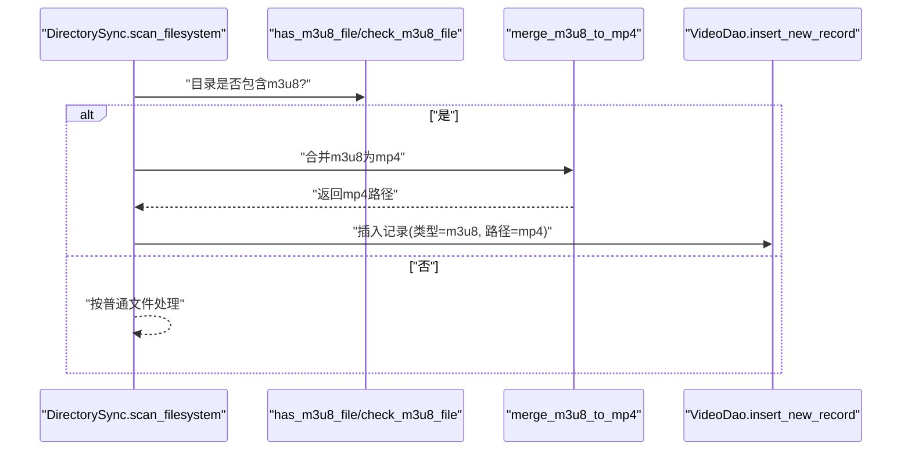
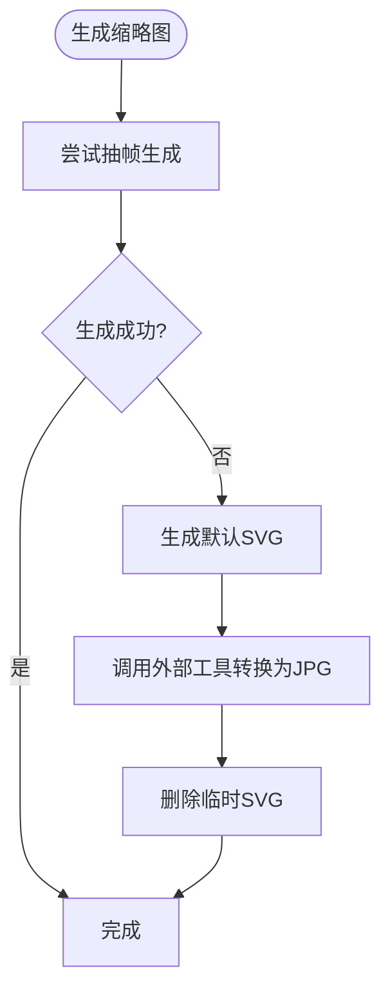
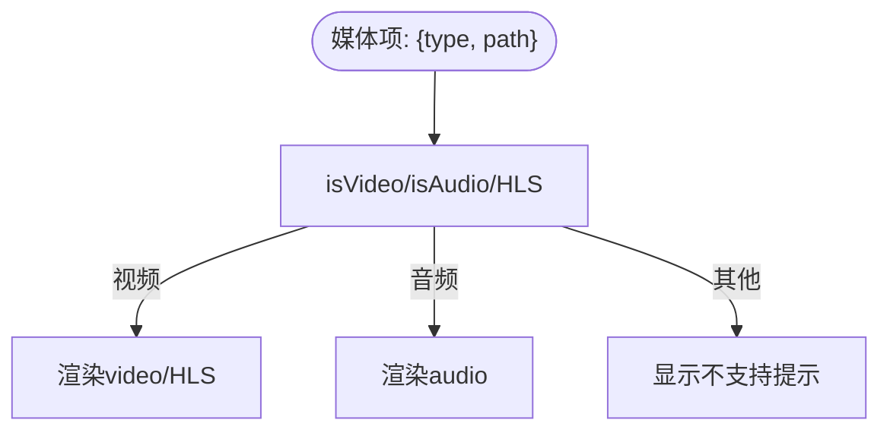
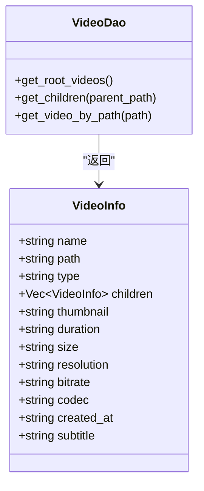
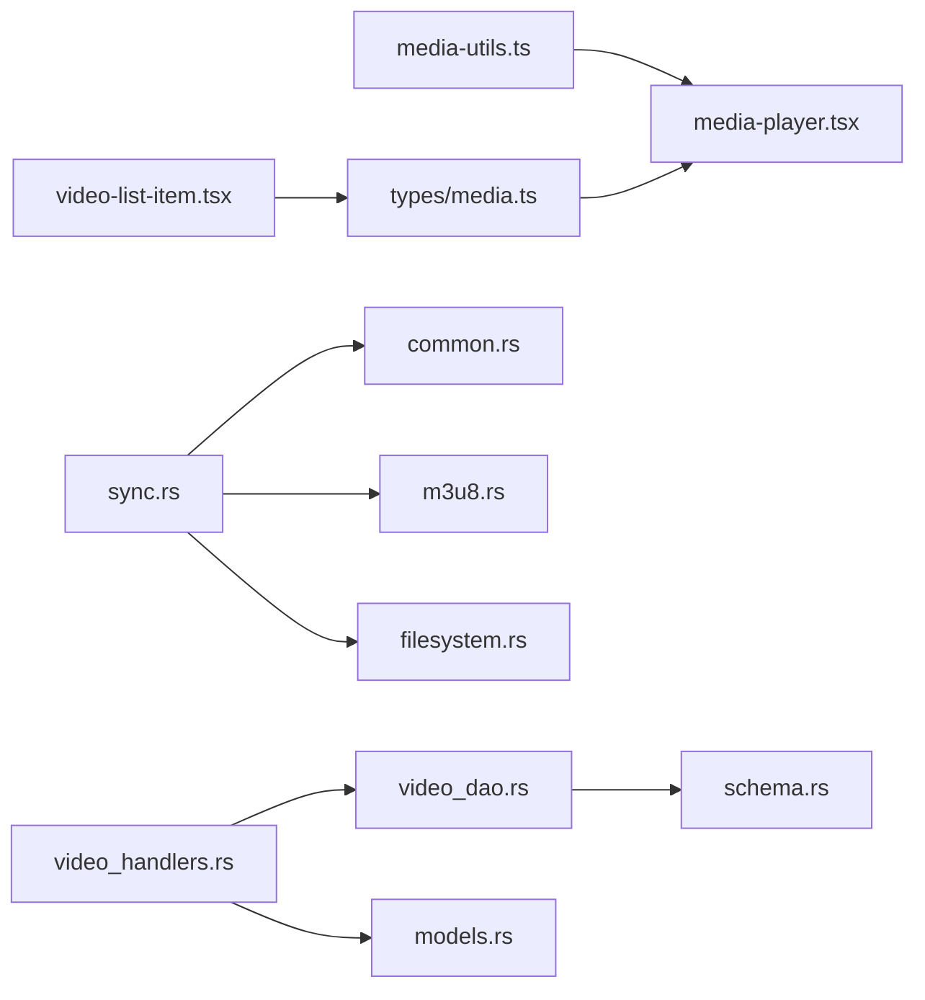

# 媒体格式支持

<cite>
**本文引用的文件**
- [m3u8.rs](file://app/server/src/utils/m3u8.rs)
- [filesystem.rs](file://app/server/src/services/filesystem.rs)
- [media-utils.ts](file://app/web/lib/media-utils.ts)
- [media.ts](file://app/web/types/media.ts)
- [models.rs](file://app/server/src/models.rs)
- [common.rs](file://app/server/src/utils/common.rs)
- [video_handlers.rs](file://app/server/src/routes/video_handlers.rs)
- [video_dao.rs](file://app/server/src/services/db/video_dao.rs)
- [sync.rs](file://app/server/src/services/db/sync.rs)
- [schema.rs](file://app/server/src/services/db/schema.rs)
- [media-player.tsx](file://app/web/components/media-player.tsx)
- [video-list-item.tsx](file://app/web/components/video-list-item.tsx)
- [tasks.example.json](file://app/downloader/examples/tasks.example.json)
</cite>

## 目录
1. [简介](#简介)
2. [项目结构](#项目结构)
3. [核心组件](#核心组件)
4. [架构总览](#架构总览)
5. [详细组件分析](#详细组件分析)
6. [依赖关系分析](#依赖关系分析)
7. [性能考量](#性能考量)
8. [故障排查指南](#故障排查指南)
9. [结论](#结论)
10. [附录](#附录)

## 简介
本文件系统性地文档化了媒体格式支持机制，覆盖视频（MP4、WebM、OGG）、音频（MP3、WAV、AAC、FLAC、OGG、WebM）与流媒体（HLS/M3U8）的识别、处理与播放策略；详述了HLS目录结构与合并流程；解释了媒体类型判断算法与扩展名映射规则；明确了不支持格式的错误处理与用户提示；并提供新增格式的支持扩展指南与最佳实践。

## 项目结构
- 后端（Rust）负责文件系统扫描、数据库同步、HLS目录合并、缩略图生成与元数据提取，并通过HTTP接口提供媒体树与详情。
- 前端（Next.js/React）负责媒体类型判定、播放器渲染（HLS动态加载与原生支持检测）、UI展示与下载。

图表来源
- [media-player.tsx](file://app/web/components/media-player.tsx#L1-L322)
- [video-list-item.tsx](file://app/web/components/video-list-item.tsx#L1-L42)
- [media-utils.ts](file://app/web/lib/media-utils.ts#L1-L43)
- [media.ts](file://app/web/types/media.ts#L1-L20)
- [video_handlers.rs](file://app/server/src/routes/video_handlers.rs#L1-L104)
- [video_dao.rs](file://app/server/src/services/db/video_dao.rs#L1-L146)
- [sync.rs](file://app/server/src/services/db/sync.rs#L1-L413)
- [common.rs](file://app/server/src/utils/common.rs#L1-L146)
- [m3u8.rs](file://app/server/src/utils/m3u8.rs#L1-L148)
- [filesystem.rs](file://app/server/src/services/filesystem.rs#L1-L121)
- [schema.rs](file://app/server/src/services/db/schema.rs#L1-L42)
- [models.rs](file://app/server/src/models.rs#L1-L32)

章节来源
- [media-player.tsx](file://app/web/components/media-player.tsx#L1-L322)
- [video_handlers.rs](file://app/server/src/routes/video_handlers.rs#L1-L104)
- [sync.rs](file://app/server/src/services/db/sync.rs#L1-L413)

## 核心组件
- 媒体类型判定（前端）：根据字符串包含关系与扩展名集合进行分类，区分 HLS、音频与视频。
- 后端类型映射：基于扩展名将文件映射为 MP4、M3U8、TS、字幕、图片等类型。
- HLS 目录合并：扫描目录内 m3u8，调用外部工具合并为 mp4 并清理原始目录。
- 缩略图生成：使用外部工具生成默认缩略图或从视频抽帧生成。
- 数据层：统一模型与DAO，支持目录与文件的树形结构查询与子节点过滤（HLS目录返回空）。

章节来源
- [media-utils.ts](file://app/web/lib/media-utils.ts#L1-L43)
- [schema.rs](file://app/server/src/services/db/schema.rs#L1-L42)
- [sync.rs](file://app/server/src/services/db/sync.rs#L298-L376)
- [m3u8.rs](file://app/server/src/utils/m3u8.rs#L1-L148)
- [filesystem.rs](file://app/server/src/services/filesystem.rs#L1-L121)
- [models.rs](file://app/server/src/models.rs#L1-L32)
- [video_dao.rs](file://app/server/src/services/db/video_dao.rs#L80-L119)

## 架构总览
媒体处理链路分为“扫描与入库”和“播放与展示”两条主线：
- 扫描与入库：遍历 public 目录，识别视频/容器，HLS目录触发合并，生成缩略图，写入数据库。
- 播放与展示：前端根据类型选择原生播放或 HLS.js，音频与视频分别渲染对应控件。

图表来源
- [sync.rs](file://app/server/src/services/db/sync.rs#L199-L263)
- [common.rs](file://app/server/src/utils/common.rs#L42-L94)
- [m3u8.rs](file://app/server/src/utils/m3u8.rs#L44-L128)
- [video_dao.rs](file://app/server/src/services/db/video_dao.rs#L51-L119)
- [media-player.tsx](file://app/web/components/media-player.tsx#L32-L81)

## 详细组件分析

### 媒体类型判定与映射
- 前端判定逻辑
  - 若包含“hls”或等于“m3u8”，标记为 HLS。
  - 若包含“mp3/wav/aac/flac/ogg/webm”之一，标记为 audio。
  - 其他情况标记为 video。
- 后端扩展名映射
  - mp4 → mp4
  - m3u8 → m3u8
  - ts → ts
  - vtt/srt → subtitle
  - jpg/png/gif → image
  - 其他 → unknown
- 特殊规则
  - ts 文件若同目录存在 m3u8，则跳过 ts（避免重复处理）。
  - HLS 目录在数据库中以 m3u8 类型记录，且其子节点为空（文件不单独存储）。

图表来源
- [media-utils.ts](file://app/web/lib/media-utils.ts#L1-L16)
- [sync.rs](file://app/server/src/services/db/sync.rs#L309-L316)
- [common.rs](file://app/server/src/utils/common.rs#L318-L325)

章节来源
- [media-utils.ts](file://app/web/lib/media-utils.ts#L1-L16)
- [sync.rs](file://app/server/src/services/db/sync.rs#L309-L325)
- [common.rs](file://app/server/src/utils/common.rs#L318-L325)

### HLS 目录结构与合并流程
- 目录结构要求
  - HLS 目录需包含一个顶层 m3u8 文件；该目录会被视为“HLS目录”。
  - 若目录内存在 ts 分片，且同目录存在 m3u8，则 ts 分片会被跳过（由 m3u8 统一处理）。
- 合并流程
  - 扫描到 m3u8 目录时，定位顶层 m3u8 文件，调用外部工具合并为 mp4。
  - 合并参数采用直接流拷贝并修复 AAC 流；成功后删除原始目录，仅保留 mp4。
  - 数据库记录类型为 m3u8，路径指向生成的 mp4 文件。
- 播放策略
  - 前端若类型为 HLS/M3U8，优先使用 HLS.js；若浏览器原生支持，则直接设置 src 指向 m3u8。

图表来源
- [sync.rs](file://app/server/src/services/db/sync.rs#L233-L296)
- [m3u8.rs](file://app/server/src/utils/m3u8.rs#L44-L128)
- [common.rs](file://app/server/src/utils/common.rs#L1-L23)

章节来源
- [sync.rs](file://app/server/src/services/db/sync.rs#L233-L296)
- [m3u8.rs](file://app/server/src/utils/m3u8.rs#L44-L128)
- [media-player.tsx](file://app/web/components/media-player.tsx#L32-L81)

### 缩略图生成与回退策略
- 抽帧生成：对视频使用外部工具抽取首帧生成缩略图。
- 默认缩略图：若抽帧失败，生成包含类型文字的 SVG 并转换为 JPG。
- 目标位置：统一输出至 thumbnails 目录，文件名为原文件名（不含扩展名）+ .jpg。

图表来源
- [filesystem.rs](file://app/server/src/services/filesystem.rs#L49-L121)

章节来源
- [filesystem.rs](file://app/server/src/services/filesystem.rs#L49-L121)

### 媒体播放器与不支持格式提示
- 播放器选择
  - 视频类型：mp4/webm/ogg/hls_directory/hls/m3u8 使用 video 标签或 HLS.js/Safari 原生。
  - 音频类型：mp3/wav/aac/flac/ogg 使用 audio 标签。
- 不支持格式
  - 若类型既非视频也非音频，则显示“不支持的媒体格式”提示。

图表来源
- [media-player.tsx](file://app/web/components/media-player.tsx#L45-L81)
- [media-player.tsx](file://app/web/components/media-player.tsx#L313-L321)

章节来源
- [media-player.tsx](file://app/web/components/media-player.tsx#L45-L81)
- [media-player.tsx](file://app/web/components/media-player.tsx#L313-L321)

### 数据模型与查询
- 模型字段：名称、路径、类型、缩略图、时长、大小、分辨率、比特率、编解码器、创建时间、字幕等。
- DAO 查询：
  - 根目录查询、按路径查询、按父路径查询。
  - 若父路径类型为 m3u8，则返回空子节点（HLS目录不展开分片）。

图表来源
- [models.rs](file://app/server/src/models.rs#L1-L32)
- [video_dao.rs](file://app/server/src/services/db/video_dao.rs#L51-L119)

章节来源
- [models.rs](file://app/server/src/models.rs#L1-L32)
- [video_dao.rs](file://app/server/src/services/db/video_dao.rs#L80-L119)

## 依赖关系分析
- 前端依赖
  - 媒体类型枚举与工具函数决定播放器渲染与标签显示。
  - 列表组件依赖类型映射进行标签文案展示。
- 后端依赖
  - 同步器依赖工具函数进行类型判断与目录扫描。
  - HLS 合并依赖外部工具链（如 FFmpeg）。
  - DAO 依赖数据库查询常量与模型结构。

图表来源
- [media-utils.ts](file://app/web/lib/media-utils.ts#L1-L43)
- [media-player.tsx](file://app/web/components/media-player.tsx#L1-L322)
- [media.ts](file://app/web/types/media.ts#L1-L20)
- [video-list-item.tsx](file://app/web/components/video-list-item.tsx#L1-L42)
- [sync.rs](file://app/server/src/services/db/sync.rs#L1-L413)
- [common.rs](file://app/server/src/utils/common.rs#L1-L146)
- [m3u8.rs](file://app/server/src/utils/m3u8.rs#L1-L148)
- [filesystem.rs](file://app/server/src/services/filesystem.rs#L1-L121)
- [video_dao.rs](file://app/server/src/services/db/video_dao.rs#L1-L146)
- [schema.rs](file://app/server/src/services/db/schema.rs#L1-L42)
- [video_handlers.rs](file://app/server/src/routes/video_handlers.rs#L1-L104)
- [models.rs](file://app/server/src/models.rs#L1-L32)

章节来源
- [sync.rs](file://app/server/src/services/db/sync.rs#L1-L413)
- [video_dao.rs](file://app/server/src/services/db/video_dao.rs#L1-L146)

## 性能考量
- 扫描与同步
  - 使用深度限制与并行处理优化目录扫描与缩略图生成。
  - 增量同步减少全量扫描开销。
- 播放性能
  - HLS 使用原生支持或 HLS.js，避免额外转码。
  - 视频抽帧缩略图采用固定时间点，降低计算成本。
- I/O 与外部工具
  - 合并与抽帧依赖外部工具，建议预装并配置环境变量，避免阻塞主流程。

[本节为通用指导，无需列出具体文件来源]

## 故障排查指南
- 合并失败（HLS → MP4）
  - 现象：日志显示合并失败或外部工具返回错误。
  - 排查：确认外部工具可用、m3u8 路径正确、磁盘空间充足；检查目录权限。
  - 参考：[m3u8.rs](file://app/server/src/utils/m3u8.rs#L88-L127)
- 缩略图生成失败
  - 现象：抽帧失败，回退到默认缩略图。
  - 排查：确认外部工具可用、输入文件可读、临时文件清理成功。
  - 参考：[filesystem.rs](file://app/server/src/services/filesystem.rs#L49-L121)
- 数据库查询异常
  - 现象：接口返回内部错误或找不到路径。
  - 排查：检查数据库连接、SQL 语句、路径规范化（前后端均需处理反斜杠与 public 前缀）。
  - 参考：[video_handlers.rs](file://app/server/src/routes/video_handlers.rs#L14-L70), [video_dao.rs](file://app/server/src/services/db/video_dao.rs#L121-L145)
- 播放器不工作
  - 现象：HLS 无法播放或报“不支持的媒体格式”。
  - 排查：确认类型判定正确、HLS.js 加载成功、Safari 原生支持条件满足；检查路径归一化。
  - 参考：[media-player.tsx](file://app/web/components/media-player.tsx#L32-L81), [media-utils.ts](file://app/web/lib/media-utils.ts#L1-L16)

章节来源
- [m3u8.rs](file://app/server/src/utils/m3u8.rs#L88-L127)
- [filesystem.rs](file://app/server/src/services/filesystem.rs#L49-L121)
- [video_handlers.rs](file://app/server/src/routes/video_handlers.rs#L14-L70)
- [video_dao.rs](file://app/server/src/services/db/video_dao.rs#L121-L145)
- [media-player.tsx](file://app/web/components/media-player.tsx#L32-L81)
- [media-utils.ts](file://app/web/lib/media-utils.ts#L1-L16)

## 结论
本系统通过前后端协同实现了对主流视频与音频格式的识别与播放，对 HLS 提供了目录级的自动合并与播放策略。类型判定清晰、目录结构明确、错误处理完备，具备良好的扩展性与可维护性。

[本节为总结性内容，无需列出具体文件来源]

## 附录

### 支持的媒体格式与目录结构
- 视频：mp4、webm、ogg
- 音频：mp3、wav、aac、flac、ogg、webm
- 流媒体：m3u8（HLS），目录内需包含顶层 m3u8 文件
- 字幕：vtt、srt
- 图片：jpg、png、gif
- 其他：unknown（将被忽略或跳过）

章节来源
- [media-utils.ts](file://app/web/lib/media-utils.ts#L1-L16)
- [sync.rs](file://app/server/src/services/db/sync.rs#L309-L316)
- [common.rs](file://app/server/src/utils/common.rs#L84-L91)

### 新格式支持扩展指南与最佳实践
- 前端扩展
  - 在类型判定处增加扩展名映射，确保渲染与标签文案正确。
  - 如为流媒体（如 HLS），确保播放器逻辑支持相应协议。
  - 参考：[media-utils.ts](file://app/web/lib/media-utils.ts#L1-L16), [media-player.tsx](file://app/web/components/media-player.tsx#L45-L81)
- 后端扩展
  - 在类型映射处添加扩展名分支，必要时补充元数据提取与缩略图策略。
  - 若为容器类（如 HLS 目录），设计目录扫描与合并流程，确保数据库记录与实际资源一致。
  - 参考：[sync.rs](file://app/server/src/services/db/sync.rs#L309-L376), [m3u8.rs](file://app/server/src/utils/m3u8.rs#L44-L128)
- 数据层扩展
  - 在模型与查询中补充新字段（如新编解码器、分辨率等），并在 DAO 中更新映射。
  - 参考：[models.rs](file://app/server/src/models.rs#L1-L32), [video_dao.rs](file://app/server/src/services/db/video_dao.rs#L19-L49)
- 目录结构与示例
  - HLS 示例任务文件展示了标准的 m3u8 URL 与输出目录组织方式，可作为新增 HLS 资源的参考模板。
  - 参考：[tasks.example.json](file://app/downloader/examples/tasks.example.json#L1-L31)