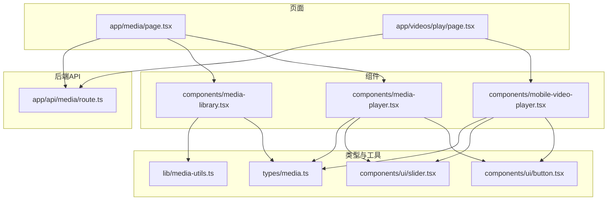
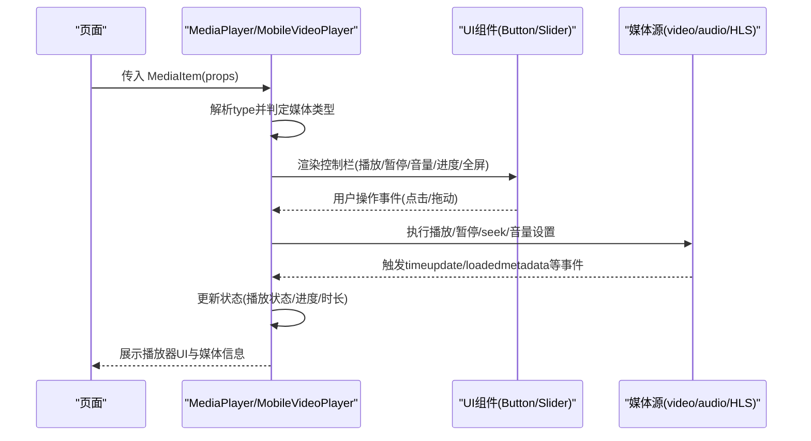
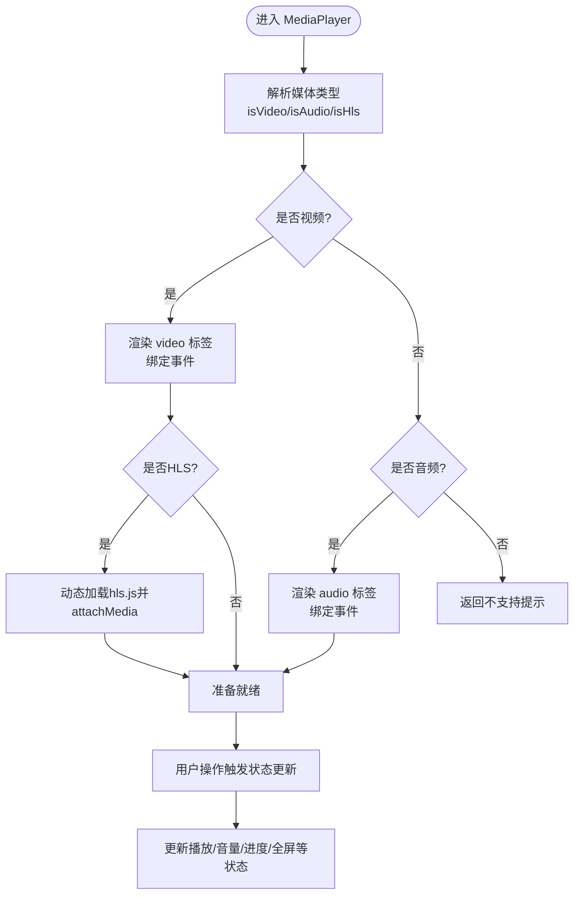
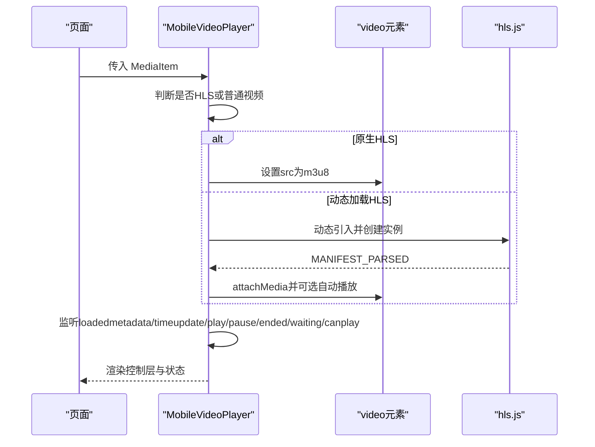
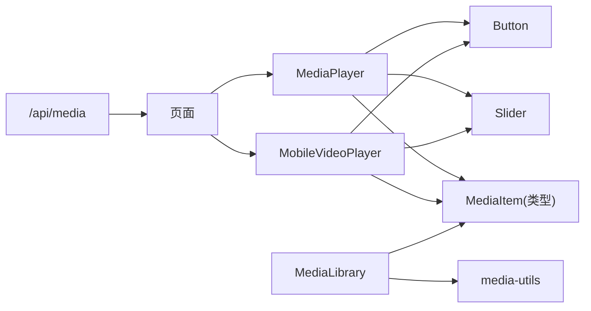

# 播放器组件架构

<cite>
**本文引用的文件**
- [media-player.tsx](file://app/web/components/media-player.tsx)
- [mobile-video-player.tsx](file://app/web/components/mobile-video-player.tsx)
- [media.ts](file://app/web/types/media.ts)
- [media-utils.ts](file://app/web/lib/media-utils.ts)
- [media-library.tsx](file://app/web/components/media-library.tsx)
- [button.tsx](file://app/web/components/ui/button.tsx)
- [slider.tsx](file://app/web/components/ui/slider.tsx)
- [page.tsx（媒体页）](file://app/web/app/media/page.tsx)
- [page.tsx（播放页）](file://app/web/app/videos/play/page.tsx)
- [route.ts（媒体API）](file://app/web/app/api/media/route.ts)
- [README.md（Web端）](file://app/web/README.md)
</cite>

## 目录
1. [简介](#简介)
2. [项目结构](#项目结构)
3. [核心组件](#核心组件)
4. [架构总览](#架构总览)
5. [组件详解](#组件详解)
6. [依赖关系分析](#依赖关系分析)
7. [性能考量](#性能考量)
8. [故障排查指南](#故障排查指南)
9. [结论](#结论)
10. [附录](#附录)

## 简介
本文件系统化梳理前端多媒体播放器组件的架构设计，重点围绕 MediaPlayer 与 MobileVideoPlayer 的统一抽象、状态管理机制、props 接口与类型定义、条件渲染策略（按媒体类型动态选择播放器实现）、以及组件复用与扩展的最佳实践。文档同时结合媒体类型识别工具、UI 组件与页面使用场景，帮助开发者快速理解并高效扩展播放器能力。

## 项目结构
该播放器体系位于 Next.js 前端工程中，采用“页面-组件-类型-工具函数”的分层组织方式：
- 类型定义：统一 MediaItem 接口与 MediaType 枚举，约束媒体数据结构
- 工具函数：媒体类型识别、格式化时长/大小、路径规范化
- UI 组件：Button、Slider 等基础控件，用于构建播放器控制栏
- 播放器组件：MediaPlayer（通用桌面/混合场景）、MobileVideoPlayer（移动端优化）
- 页面与库：媒体页演示播放器使用；媒体库组件负责筛选与列表展示

图表来源
- [page.tsx（媒体页）](file://app/web/app/media/page.tsx#L1-L147)
- [page.tsx（播放页）](file://app/web/app/videos/play/page.tsx#L1-L176)
- [media-player.tsx](file://app/web/components/media-player.tsx#L1-L322)
- [mobile-video-player.tsx](file://app/web/components/mobile-video-player.tsx#L1-L479)
- [media-library.tsx](file://app/web/components/media-library.tsx#L1-L120)
- [media.ts](file://app/web/types/media.ts#L1-L20)
- [media-utils.ts](file://app/web/lib/media-utils.ts#L1-L43)
- [button.tsx](file://app/web/components/ui/button.tsx#L1-L63)
- [slider.tsx](file://app/web/components/ui/slider.tsx#L1-L64)
- [route.ts（媒体API）](file://app/web/app/api/media/route.ts#L1-L73)

章节来源
- [README.md（Web端）](file://app/web/README.md#L1-L158)

## 核心组件
- MediaPlayer：统一抽象视频与音频播放器，基于媒体类型自动选择 video/audio 或 HLS 实现，提供播放/暂停、音量、进度、全屏、下载等控制。
- MobileVideoPlayer：移动端专用播放器，内置触摸拖拽进度、自动隐藏控制栏、错误与加载状态提示、HLS 原生与 hls.js 双通道支持。
- MediaLibrary：媒体库列表组件，支持按类型过滤与选中项高亮，配合工具函数进行类型识别与格式化。
- UI 组件：Button、Slider 提供一致的交互体验与可访问性。
- 类型与工具：MediaItem、MediaType、getMediaType、formatDuration、formatFileSize、normalizeMediaPath。

章节来源
- [media-player.tsx](file://app/web/components/media-player.tsx#L1-L322)
- [mobile-video-player.tsx](file://app/web/components/mobile-video-player.tsx#L1-L479)
- [media-library.tsx](file://app/web/components/media-library.tsx#L1-L120)
- [media.ts](file://app/web/types/media.ts#L1-L20)
- [media-utils.ts](file://app/web/lib/media-utils.ts#L1-L43)
- [button.tsx](file://app/web/components/ui/button.tsx#L1-L63)
- [slider.tsx](file://app/web/components/ui/slider.tsx#L1-L64)

## 架构总览
播放器架构遵循“类型驱动 + 条件渲染 + 统一状态”的设计模式：
- 类型识别：通过 getMediaType 将原始 type 归类为 video/audio/hls，决定渲染路径
- 条件渲染：MediaPlayer 根据 isVideo/isAudio 分支渲染 video/audio；MobileVideoPlayer 内部分支处理 HLS 与普通视频
- 统一状态：播放/暂停、音量、静音、进度、时长、全屏等状态在组件内部通过 useState 管理，并通过事件回调同步更新
- 外部集成：页面通过 props 注入 MediaItem，支持自动播放、下载链接、缩略图等

图表来源
- [media-player.tsx](file://app/web/components/media-player.tsx#L1-L322)
- [mobile-video-player.tsx](file://app/web/components/mobile-video-player.tsx#L1-L479)
- [button.tsx](file://app/web/components/ui/button.tsx#L1-L63)
- [slider.tsx](file://app/web/components/ui/slider.tsx#L1-L64)

## 组件详解

### MediaPlayer 组件
- 设计模式
  - 统一抽象：同一组件同时支持视频与音频播放，通过媒体类型判断选择 video/audio
  - 条件渲染：根据 isVideo/isAudio 分支渲染不同 UI 结构
  - HLS 支持：当 type 为 hls_directory/hls/m3u8 时，动态加载 hls.js 并 attachMedia
- 状态管理
  - 播放状态：isPlaying
  - 静音状态：isMuted
  - 音量：volume（Slider 双向绑定）
  - 进度：currentTime/duration（timeupdate 同步）
  - HLS 支持检测：isHlsSupported
- Props 接口
  - media: MediaItem（包含 name/path/type，以及可选 thumbnail/duration/size）
  - autoPlay?: boolean
- 事件与回调
  - onPlay/onPause：切换 isPlaying
  - onTimeUpdate：更新 currentTime/duration
  - togglePlay/toggleMute/handleVolumeChange/handleSeek/toggleFullscreen
- 条件渲染逻辑
  - isVideo: 渲染 video 标签与视频控制栏
  - isAudio: 渲染 audio 标签与音频控制栏
  - 其他类型：返回“不支持的媒体格式”提示
- HLS 初始化流程
  - 动态导入 hls.js
  - 若支持则创建实例并加载 playlist.m3u8
  - 若不支持但浏览器原生支持 m3u8，则直接赋值 src
  - autoPlay 时在 MANIFEST_PARSED 后触发 play

图表来源
- [media-player.tsx](file://app/web/components/media-player.tsx#L1-L322)

章节来源
- [media-player.tsx](file://app/web/components/media-player.tsx#L1-L322)
- [media.ts](file://app/web/types/media.ts#L1-L20)
- [media-utils.ts](file://app/web/lib/media-utils.ts#L1-L43)
- [button.tsx](file://app/web/components/ui/button.tsx#L1-L63)
- [slider.tsx](file://app/web/components/ui/slider.tsx#L1-L64)

### MobileVideoPlayer 组件
- 设计模式
  - 移动端优先：触摸手势拖拽进度、自动隐藏控制栏、加载/错误状态提示
  - 双通道 HLS：优先尝试原生 m3u8，否则动态加载 hls.js
- 状态管理
  - 播放状态：isPlaying
  - 音量：volume（数值）
  - 静音：isMuted
  - 进度：currentTime/duration
  - 控制栏可见：showControls（自动隐藏）
  - 加载/错误：isLoading/error
  - 拖拽预览：isDragging/previewTime/showPreview
- Props 接口
  - media: MediaItem
  - autoPlay?: boolean
- 事件与回调
  - 触摸事件：handleTouchStart/handleTouchMove/handleTouchEnd（拖拽进度预览与确认）
  - 播放控制：togglePlay/toggleFullscreen
  - 进度拖动：handleSeek（受控输入）
  - 生命周期：initPlayer（HLS/普通视频初始化），清理 hlsRef
- 错误与加载
  - 错误状态：error 字符串，提供“重新加载”按钮
  - 加载状态：isLoading，显示加载动画
- 条件渲染逻辑
  - error 存在时渲染错误面板
  - 正常情况下渲染 video 标签与控制层（含底部进度条、控制按钮、预览气泡）

图表来源
- [mobile-video-player.tsx](file://app/web/components/mobile-video-player.tsx#L1-L479)

章节来源
- [mobile-video-player.tsx](file://app/web/components/mobile-video-player.tsx#L1-L479)
- [media.ts](file://app/web/types/media.ts#L1-L20)
- [button.tsx](file://app/web/components/ui/button.tsx#L1-L63)
- [slider.tsx](file://app/web/components/ui/slider.tsx#L1-L64)

### 媒体类型识别与工具函数
- getMediaType：将原始 type 归类为 hls/audio/video，便于统一处理
- formatDuration/formatFileSize：格式化时长与文件大小
- normalizeMediaPath：路径规范化，适配前端 URL

章节来源
- [media-utils.ts](file://app/web/lib/media-utils.ts#L1-L43)
- [media.ts](file://app/web/types/media.ts#L1-L20)

### 页面与库集成
- MediaPage：演示 MediaPlayer 的使用，包含视频与音频列表，点击切换选中媒体
- VideoPlayPage：移动端播放页，使用 MobileVideoPlayer，支持分享、返回、信息展示
- MediaLibrary：媒体库组件，支持按类型过滤与选中项高亮，配合 getMediaType 使用

章节来源
- [page.tsx（媒体页）](file://app/web/app/media/page.tsx#L1-L147)
- [page.tsx（播放页）](file://app/web/app/videos/play/page.tsx#L1-L176)
- [media-library.tsx](file://app/web/components/media-library.tsx#L1-L120)
- [media-utils.ts](file://app/web/lib/media-utils.ts#L1-L43)

## 依赖关系分析
- 组件间依赖
  - MediaPlayer/MobileVideoPlayer 依赖 UI 组件 Button、Slider
  - 两者均依赖 MediaItem 类型定义
  - MediaLibrary 依赖 MediaItem 与媒体工具函数
- 外部依赖
  - MediaPlayer 在 HLS 场景下动态导入 hls.js
  - MobileVideoPlayer 在非原生 HLS 时动态加载 hls.js
- 数据流
  - 页面通过 props 传递 MediaItem
  - 组件内部通过事件回调更新状态
  - 页面可基于状态进行导航或分享等操作

图表来源
- [media-player.tsx](file://app/web/components/media-player.tsx#L1-L322)
- [mobile-video-player.tsx](file://app/web/components/mobile-video-player.tsx#L1-L479)
- [media-library.tsx](file://app/web/components/media-library.tsx#L1-L120)
- [media.ts](file://app/web/types/media.ts#L1-L20)
- [media-utils.ts](file://app/web/lib/media-utils.ts#L1-L43)
- [route.ts（媒体API）](file://app/web/app/api/media/route.ts#L1-L73)

章节来源
- [media-player.tsx](file://app/web/components/media-player.tsx#L1-L322)
- [mobile-video-player.tsx](file://app/web/components/mobile-video-player.tsx#L1-L479)
- [media-library.tsx](file://app/web/components/media-library.tsx#L1-L120)
- [media.ts](file://app/web/types/media.ts#L1-L20)
- [media-utils.ts](file://app/web/lib/media-utils.ts#L1-L43)
- [route.ts（媒体API）](file://app/web/app/api/media/route.ts#L1-L73)

## 性能考量
- 播放器初始化
  - MediaPlayer：仅在 HLS 场景下动态加载 hls.js，避免不必要的包体积
  - MobileVideoPlayer：在非原生 HLS 时才动态加载 hls.js，减少首屏负担
- 事件监听
  - MediaPlayer：使用 onTimeUpdate 等事件同步状态，避免轮询
  - MobileVideoPlayer：在组件卸载时销毁 HLS 实例，防止内存泄漏
- 渲染优化
  - 条件渲染：根据媒体类型只渲染必要 UI，减少 DOM 节点
  - 控制栏透明度过渡：hover 时显示，降低频繁重绘
- 资源加载
  - 使用原生 video/audio 标签，充分利用浏览器硬件解码
  - HLS 源尽量使用 CDN 与合理的分片策略

章节来源
- [media-player.tsx](file://app/web/components/media-player.tsx#L1-L322)
- [mobile-video-player.tsx](file://app/web/components/mobile-video-player.tsx#L1-L479)

## 故障排查指南
- HLS 播放失败
  - 现象：MobileVideoPlayer 显示错误提示或无法播放
  - 排查：确认浏览器是否原生支持 m3u8；若不支持，检查 hls.js 是否成功加载；查看 fatal 错误事件
  - 处置：降级为原生 HLS 或修复 HLS 源
- 自动播放被阻止
  - 现象：autoPlay 失败
  - 排查：移动端/浏览器策略限制；查看控制台错误
  - 处置：引导用户交互后再播放，或提供手动播放按钮
- 进度条不更新
  - 现象：进度条不动
  - 排查：确认已绑定 timeupdate 事件；检查媒体源是否有效
  - 处置：确保媒体源可访问，必要时刷新页面
- 音量/静音无效
  - 现象：音量调节无效
  - 排查：确认当前渲染的是 video/audio 元素；检查 volume 值范围
  - 处置：修正音量值与 muted 状态映射

章节来源
- [mobile-video-player.tsx](file://app/web/components/mobile-video-player.tsx#L1-L479)
- [media-player.tsx](file://app/web/components/media-player.tsx#L1-L322)

## 结论
该播放器架构以“类型驱动 + 条件渲染 + 统一状态”为核心，实现了视频与音频的统一抽象，并针对移动端提供了更丰富的交互与状态管理。通过清晰的类型定义、工具函数与 UI 组件，组件具备良好的可复用性与扩展性。未来可在 HLS 错误恢复、播放统计埋点、字幕与多轨音轨支持等方面进一步增强。

## 附录

### Props 接口与类型定义
- MediaItem
  - 字段：name、path、type（必填），thumbnail、duration、size（可选）
  - 建议扩展：resolution、bitrate、createdAt、subtitle
- MediaPlayerProps
  - media: MediaItem
  - autoPlay?: boolean
- MobileVideoPlayerProps
  - media: MediaItem
  - autoPlay?: boolean
- MediaType
  - "video" | "audio" | "hls"

章节来源
- [media.ts](file://app/web/types/media.ts#L1-L20)

### 使用示例与最佳实践
- 基础集成
  - 在页面中引入 MediaPlayer，传入 MediaItem 即可
- 与 API 集成
  - 通过 /api/media 获取媒体列表，选择目标 MediaItem 传入播放器
- 条件渲染与类型识别
  - 使用 getMediaType 判断类型，按需渲染不同播放器
- 移动端体验
  - 使用 MobileVideoPlayer，开启触摸拖拽与自动隐藏控制栏
- 自定义播放器开发指南
  - 保持统一的 props 接口（media/autoPlay）
  - 使用 useState 管理播放/音量/进度/全屏等状态
  - 事件绑定：timeupdate/loadedmetadata/play/pause/ended/waiting/canplay
  - 错误与加载状态：error/loading
  - HLS 支持：优先原生，否则动态加载 hls.js 并销毁实例
  - UI 一致性：复用 Button/Slider 等 UI 组件

章节来源
- [README.md（Web端）](file://app/web/README.md#L57-L124)
- [media-utils.ts](file://app/web/lib/media-utils.ts#L1-L43)
- [media-player.tsx](file://app/web/components/media-player.tsx#L1-L322)
- [mobile-video-player.tsx](file://app/web/components/mobile-video-player.tsx#L1-L479)
- [route.ts（媒体API）](file://app/web/app/api/media/route.ts#L1-L73)