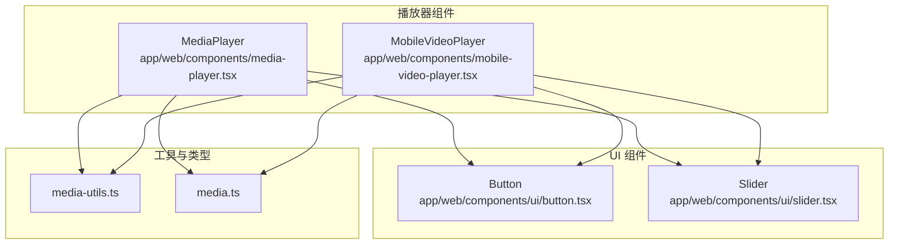
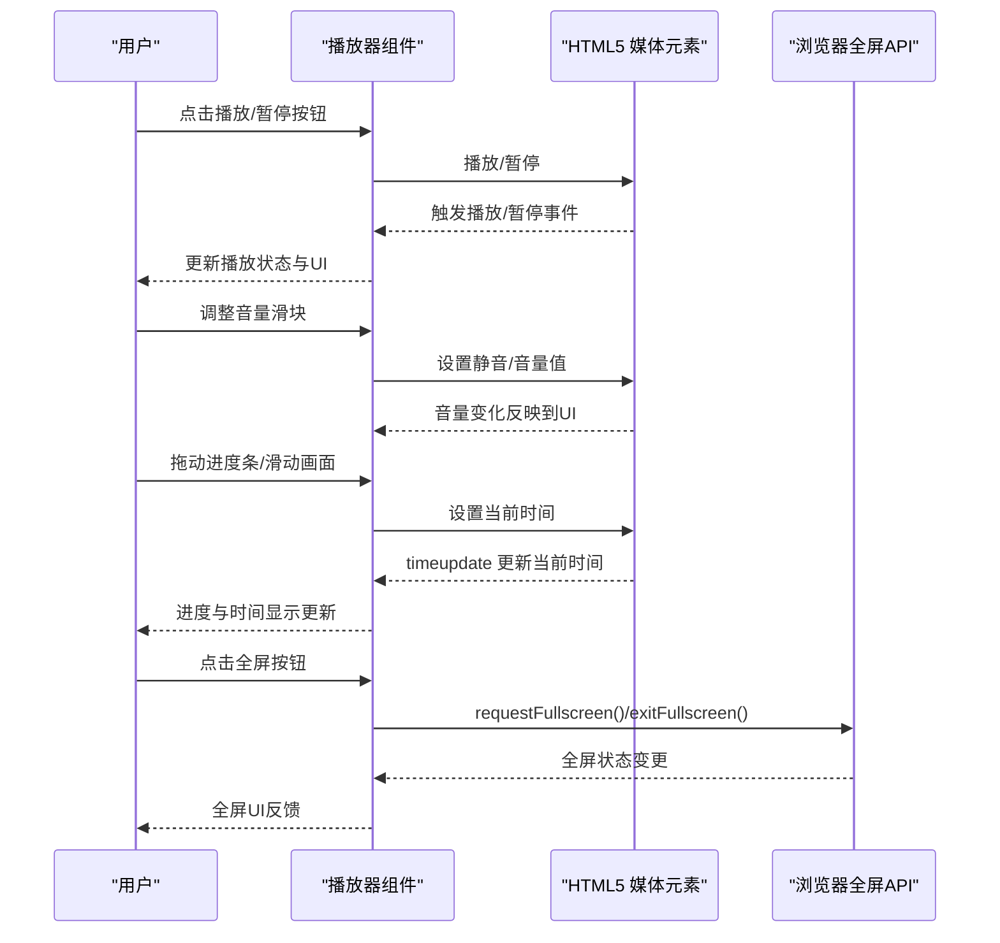
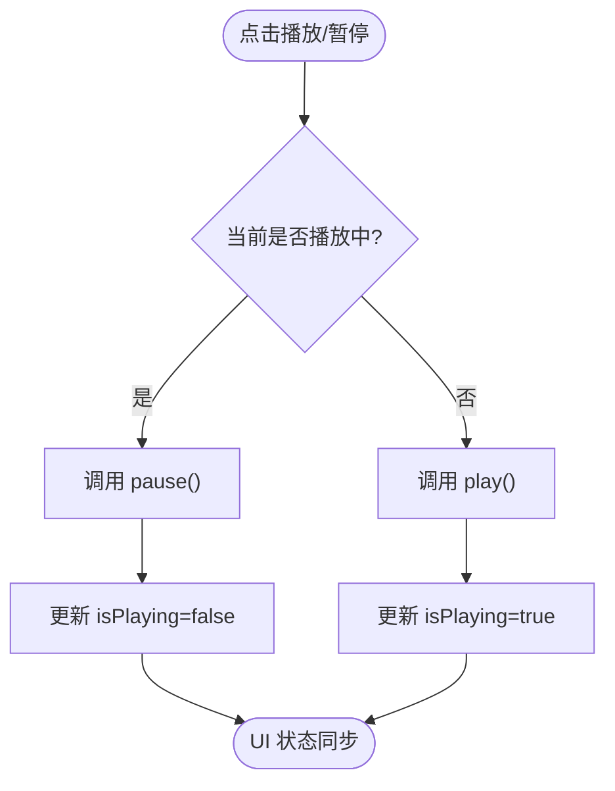
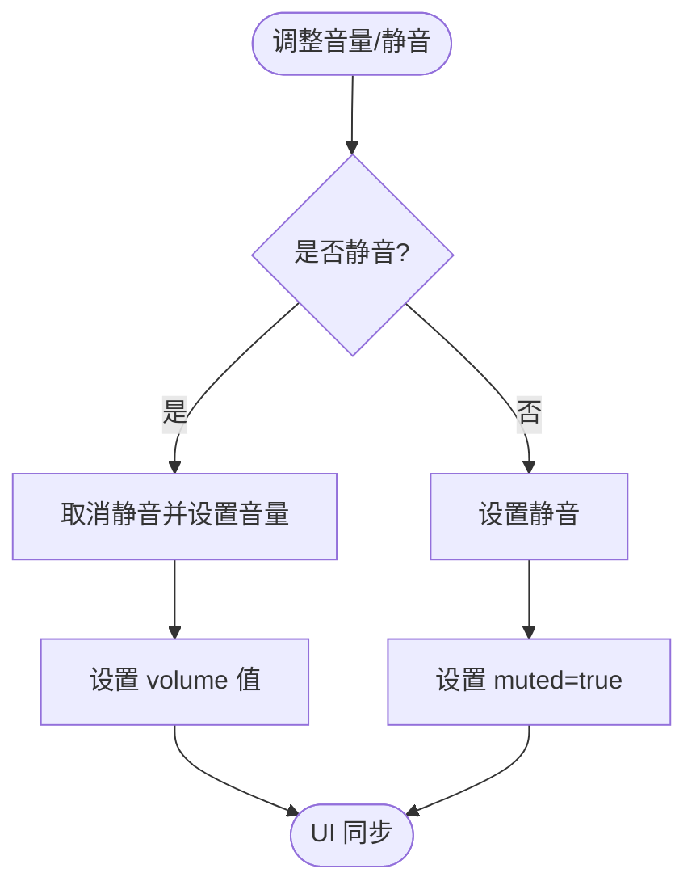
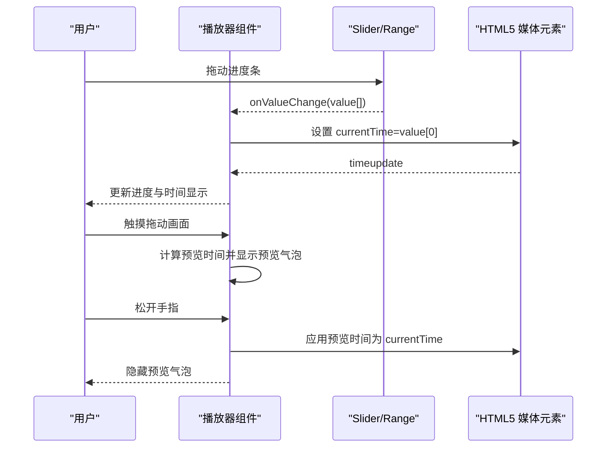
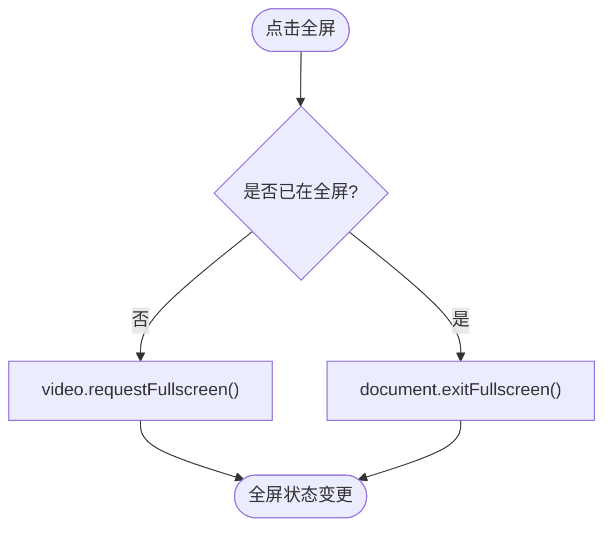
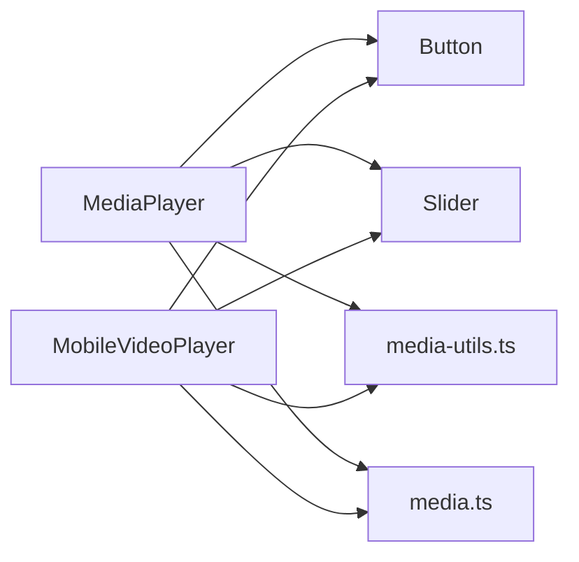

# 播放控制功能

<cite>
**本文引用的文件**
- [media-player.tsx](file://app/web/components/media-player.tsx)
- [mobile-video-player.tsx](file://app/web/components/mobile-video-player.tsx)
- [slider.tsx](file://app/web/components/ui/slider.tsx)
- [button.tsx](file://app/web/components/ui/button.tsx)
- [media-utils.ts](file://app/web/lib/media-utils.ts)
- [media.ts](file://app/web/types/media.ts)
- [IMPLEMENTATION.md](file://app/web/IMPLEMENTATION.md)
- [README.md](file://app/web/README.md)
</cite>

## 目录
1. [引言](#引言)
2. [项目结构](#项目结构)
3. [核心组件](#核心组件)
4. [架构总览](#架构总览)
5. [详细组件分析](#详细组件分析)
6. [依赖关系分析](#依赖关系分析)
7. [性能考量](#性能考量)
8. [故障排查指南](#故障排查指南)
9. [结论](#结论)

## 引言
本文件聚焦于播放控制功能的实现与使用说明，涵盖播放/暂停、音量控制（含静音）、进度控制（拖拽与时间跳转）、全屏控制，以及键盘快捷键与无障碍访问的实现方案。文档基于仓库中的前端组件与工具函数，结合实现说明文档，帮助开发者快速理解与扩展播放器控制能力。

## 项目结构
播放控制功能主要分布在两个播放器组件中：
- 桌面/通用播放器组件：负责视频与音频的统一控制，包含播放/暂停、音量、静音、进度条、全屏等。
- 移动端播放器组件：针对触摸交互优化，包含播放/暂停、全屏、进度拖拽与预览、控制栏自动隐藏等。

图表来源
- [media-player.tsx](file://app/web/components/media-player.tsx#L1-L322)
- [mobile-video-player.tsx](file://app/web/components/mobile-video-player.tsx#L1-L479)
- [button.tsx](file://app/web/components/ui/button.tsx#L1-L63)
- [slider.tsx](file://app/web/components/ui/slider.tsx#L1-L64)
- [media-utils.ts](file://app/web/lib/media-utils.ts#L1-L43)
- [media.ts](file://app/web/types/media.ts#L1-L20)

章节来源
- [media-player.tsx](file://app/web/components/media-player.tsx#L1-L322)
- [mobile-video-player.tsx](file://app/web/components/mobile-video-player.tsx#L1-L479)
- [button.tsx](file://app/web/components/ui/button.tsx#L1-L63)
- [slider.tsx](file://app/web/components/ui/slider.tsx#L1-L64)
- [media-utils.ts](file://app/web/lib/media-utils.ts#L1-L43)
- [media.ts](file://app/web/types/media.ts#L1-L20)

## 核心组件
- MediaPlayer：支持视频与音频播放，提供播放/暂停、静音、音量调节、进度拖动、全屏切换、时间显示与下载入口。
- MobileVideoPlayer：针对移动端触摸交互优化，提供播放/暂停、全屏、进度拖拽与预览、控制栏自动隐藏、加载与错误状态处理。

章节来源
- [media-player.tsx](file://app/web/components/media-player.tsx#L1-L322)
- [mobile-video-player.tsx](file://app/web/components/mobile-video-player.tsx#L1-L479)

## 架构总览
播放控制的总体流程如下：
- 播放/暂停：切换内部状态并在原生元素上调用播放/暂停。
- 音量控制：切换静音状态或设置音量值，同步到原生元素。
- 进度控制：通过 Slider 或原生 range 输入，更新 currentTime 并设置到原生元素。
- 全屏控制：调用浏览器全屏 API，退出时恢复。
- 事件绑定：监听原生元素的播放、暂停、timeupdate 等事件，驱动 UI 状态更新。

图表来源
- [media-player.tsx](file://app/web/components/media-player.tsx#L83-L139)
- [mobile-video-player.tsx](file://app/web/components/mobile-video-player.tsx#L209-L313)

## 详细组件分析

### 播放/暂停控制
- 状态管理：组件内部维护 isPlaying 状态，切换时调用原生元素的 play/pause。
- 事件驱动：监听播放与暂停事件，确保 UI 与媒体元素状态一致。
- 适用对象：视频与音频分别使用 video/audio 元素，组件根据类型自动选择。

图表来源
- [media-player.tsx](file://app/web/components/media-player.tsx#L83-L94)
- [mobile-video-player.tsx](file://app/web/components/mobile-video-player.tsx#L209-L221)

章节来源
- [media-player.tsx](file://app/web/components/media-player.tsx#L83-L94)
- [mobile-video-player.tsx](file://app/web/components/mobile-video-player.tsx#L209-L221)

### 音量控制与静音切换
- 静音切换：切换 isMuted 状态并设置媒体元素的 muted 属性。
- 音量调节：通过 Slider 接收数值数组，设置媒体元素的 volume（0~1）。
- 适用对象：视频与音频共享同一逻辑。

图表来源
- [media-player.tsx](file://app/web/components/media-player.tsx#L96-L112)
- [slider.tsx](file://app/web/components/ui/slider.tsx#L1-L64)

章节来源
- [media-player.tsx](file://app/web/components/media-player.tsx#L96-L112)
- [slider.tsx](file://app/web/components/ui/slider.tsx#L1-L64)

### 进度控制（拖拽与时间跳转）
- Slider 进度条：使用 Radix UI Slider，onValueChange 回调中设置 currentTime 并同步到媒体元素。
- 原生 range 输入：移动端组件提供原生 range 输入，onChange 时更新 currentTime。
- 触摸拖拽（移动端）：通过 Touch Events 识别拖动，计算预览时间并显示预览气泡；结束时应用预览时间并隐藏预览。
- 事件驱动：timeupdate 事件持续更新当前时间，保证 UI 与播放进度一致。

图表来源
- [media-player.tsx](file://app/web/components/media-player.tsx#L113-L129)
- [mobile-video-player.tsx](file://app/web/components/mobile-video-player.tsx#L223-L299)
- [slider.tsx](file://app/web/components/ui/slider.tsx#L1-L64)

章节来源
- [media-player.tsx](file://app/web/components/media-player.tsx#L113-L129)
- [mobile-video-player.tsx](file://app/web/components/mobile-video-player.tsx#L223-L299)
- [slider.tsx](file://app/web/components/ui/slider.tsx#L1-L64)

### 全屏控制
- 触发方式：点击全屏按钮，调用 video 元素的 requestFullscreen 或 document.exitFullscreen。
- 适用对象：仅视频播放器支持全屏。
- 退出机制：若已处于全屏，则退出全屏。

图表来源
- [media-player.tsx](file://app/web/components/media-player.tsx#L130-L139)
- [mobile-video-player.tsx](file://app/web/components/mobile-video-player.tsx#L303-L313)

章节来源
- [media-player.tsx](file://app/web/components/media-player.tsx#L130-L139)
- [mobile-video-player.tsx](file://app/web/components/mobile-video-player.tsx#L303-L313)

### 键盘快捷键与无障碍访问（实现方案）
- 键盘快捷键建议
  - 空格键：播放/暂停
  - M：静音/取消静音
  - ←/→：小步前进/后退（例如每次 5 秒）
  - ↑/↓：音量增减（例如每次 5%）
  - F：全屏切换
- 无障碍访问建议
  - 为按钮添加 aria-label 或 title，明确功能（如“播放”、“暂停”、“静音”、“全屏”）。
  - 为 Slider 添加 aria-valuemin、aria-valuemax、aria-valuenow，辅助读屏软件播报进度。
  - 为播放器容器添加 role="region" 与 aria-label，标识为媒体播放区域。
  - 提供键盘可达性：Tab 顺序合理，焦点可见，避免仅通过鼠标操作。
- 实现要点
  - 在组件顶层容器添加 aria-* 属性与 role。
  - 为按钮与控件提供合适的 title 或 aria-label。
  - 对 Slider 设置 aria 属性，确保读屏可感知当前值与范围。
  - 为全屏切换提供键盘触发入口（如 Enter/Space），并在 UI 中提示快捷键。

章节来源
- [media-player.tsx](file://app/web/components/media-player.tsx#L165-L239)
- [mobile-video-player.tsx](file://app/web/components/mobile-video-player.tsx#L431-L478)
- [button.tsx](file://app/web/components/ui/button.tsx#L1-L63)
- [slider.tsx](file://app/web/components/ui/slider.tsx#L1-L64)

## 依赖关系分析
- 组件依赖
  - MediaPlayer 依赖 Button 与 Slider 组件，依赖媒体工具函数与类型定义。
  - MobileVideoPlayer 依赖 Button、Slider、媒体工具函数与类型定义。
- 事件与状态耦合
  - 播放/暂停、音量、静音、进度、全屏均通过组件内部状态与原生媒体事件联动。
- 外部依赖
  - HLS 支持通过动态导入 hls.js（桌面组件），移动端组件在特定条件下加载 hls.js。
  - 浏览器全屏 API 由浏览器提供。

图表来源
- [media-player.tsx](file://app/web/components/media-player.tsx#L1-L322)
- [mobile-video-player.tsx](file://app/web/components/mobile-video-player.tsx#L1-L479)
- [button.tsx](file://app/web/components/ui/button.tsx#L1-L63)
- [slider.tsx](file://app/web/components/ui/slider.tsx#L1-L64)
- [media-utils.ts](file://app/web/lib/media-utils.ts#L1-L43)
- [media.ts](file://app/web/types/media.ts#L1-L20)

章节来源
- [media-player.tsx](file://app/web/components/media-player.tsx#L1-L322)
- [mobile-video-player.tsx](file://app/web/components/mobile-video-player.tsx#L1-L479)
- [button.tsx](file://app/web/components/ui/button.tsx#L1-L63)
- [slider.tsx](file://app/web/components/ui/slider.tsx#L1-L64)
- [media-utils.ts](file://app/web/lib/media-utils.ts#L1-L43)
- [media.ts](file://app/web/types/media.ts#L1-L20)

## 性能考量
- 事件节流与渲染优化
  - 进度拖拽过程实时更新预览，避免过度节流影响体验；控制栏切换使用状态管理，减少重复渲染。
  - 自动隐藏计时器在组件卸载时正确清理，拖动时暂停自动隐藏计时器。
- 计时器与状态管理
  - 使用 useRef 存储计时器句柄，避免闭包捕获导致的泄漏。
  - 使用 useState 管理局部状态，避免不必要的组件重渲染。
- 媒体加载与 HLS
  - 桌面组件按需动态加载 hls.js，移动端组件在需要时动态加载，降低首屏体积。

章节来源
- [IMPLEMENTATION.md](file://app/web/IMPLEMENTATION.md#L240-L252)

## 故障排查指南
- 播放失败
  - 检查媒体 URL 是否正确，确认后端静态资源可访问。
  - 若为 HLS，确认浏览器支持情况或动态加载 hls.js 成功。
- 音量无效
  - 确认 isMuted 与 volume 值设置逻辑正确，避免静音与音量同时设置导致冲突。
- 进度跳转无效
  - 确认 Slider 的 value 与 max 正确，handleSeek 中已将 value[0] 设置到 currentTime。
  - 检查 timeupdate 事件是否触发，确保 UI 与媒体元素同步。
- 全屏不生效
  - 确认点击的是视频元素而非其他 DOM；部分浏览器需要用户手势触发全屏。
- 触摸拖拽无效
  - 确认未处于加载/错误状态；检查触摸事件阈值与预览时间计算逻辑。

章节来源
- [media-player.tsx](file://app/web/components/media-player.tsx#L113-L139)
- [mobile-video-player.tsx](file://app/web/components/mobile-video-player.tsx#L232-L299)
- [IMPLEMENTATION.md](file://app/web/IMPLEMENTATION.md#L225-L238)

## 结论
该播放器组件提供了完善的播放控制能力：播放/暂停、音量与静音、进度拖拽与时间跳转、全屏切换，并针对移动端触摸交互进行了优化。通过事件驱动与状态同步，UI 与媒体元素保持一致。建议在现有基础上补充键盘快捷键与无障碍属性，进一步提升可用性与可访问性。