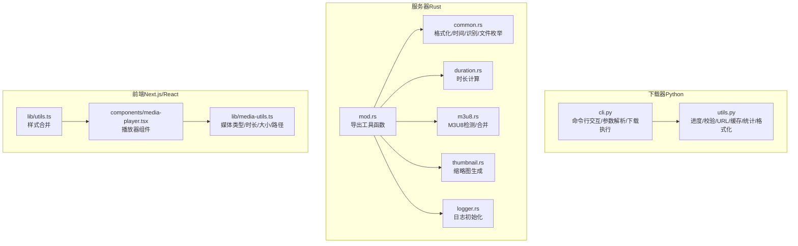
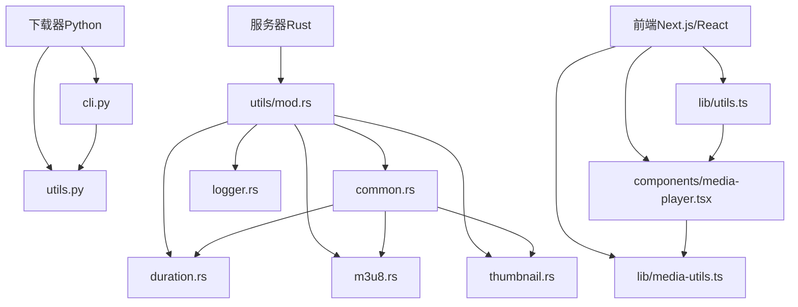
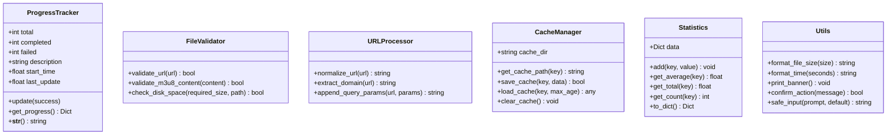
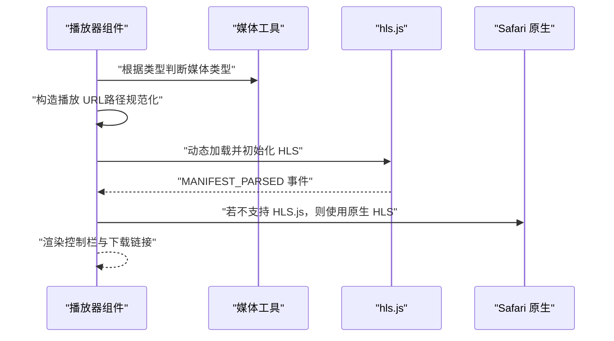
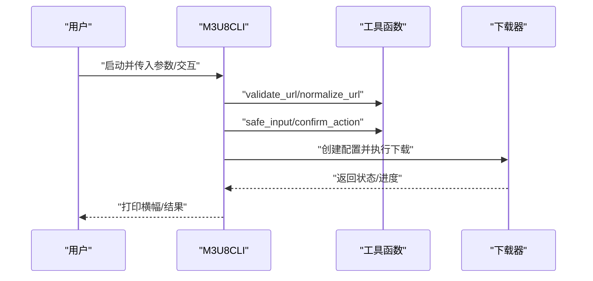
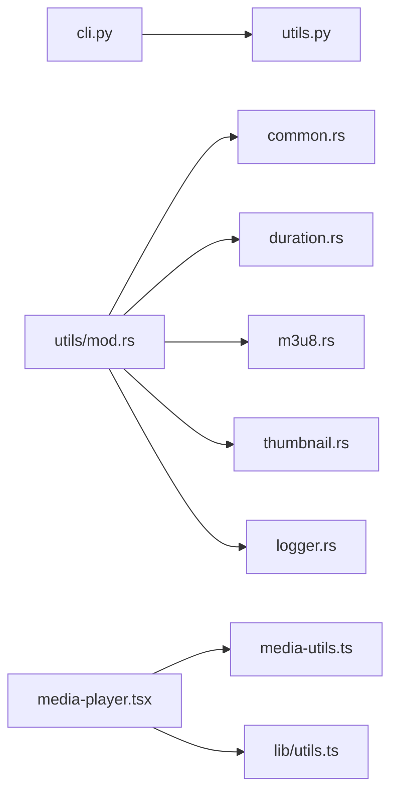

# 工具函数

<cite>
**本文引用的文件**
- [app/downloader/core/utils.py](file://app/downloader/core/utils.py)
- [app/downloader/cli/cli.py](file://app/downloader/cli/cli.py)
- [app/server/src/utils/mod.rs](file://app/server/src/utils/mod.rs)
- [app/server/src/utils/common.rs](file://app/server/src/utils/common.rs)
- [app/server/src/utils/duration.rs](file://app/server/src/utils/duration.rs)
- [app/server/src/utils/m3u8.rs](file://app/server/src/utils/m3u8.rs)
- [app/server/src/utils/thumbnail.rs](file://app/server/src/utils/thumbnail.rs)
- [app/server/src/utils/logger.rs](file://app/server/src/utils/logger.rs)
- [app/web/lib/utils.ts](file://app/web/lib/utils.ts)
- [app/web/lib/media-utils.ts](file://app/web/lib/media-utils.ts)
- [app/web/components/media-player.tsx](file://app/web/components/media-player.tsx)
- [README.md](file://README.md)
</cite>

## 目录
1. [引言](#引言)
2. [项目结构](#项目结构)
3. [核心组件](#核心组件)
4. [架构总览](#架构总览)
5. [详细组件分析](#详细组件分析)
6. [依赖关系分析](#依赖关系分析)
7. [性能考量](#性能考量)
8. [故障排查指南](#故障排查指南)
9. [结论](#结论)
10. [附录](#附录)

## 引言
本章节聚焦于项目中的“工具函数”能力，覆盖下载器侧的通用工具、服务器侧的通用工具、前端侧的通用工具与媒体工具，以及它们在系统中的协作方式。通过对各语言与模块的工具函数进行分层梳理，帮助读者快速定位与使用这些能力。

## 项目结构
- 下载器工具（Python）：位于 app/downloader/core/utils.py，提供进度跟踪、文件校验、URL处理、缓存、统计与格式化等工具。
- 下载器CLI（Python）：位于 app/downloader/cli/cli.py，封装命令行交互、参数解析、配置生成与下载执行流程，内部大量使用工具函数。
- 服务器工具（Rust）：位于 app/server/src/utils/*，提供文件大小格式化、创建时间提取、视频/容器识别、M3U8检测与合并、时长计算、缩略图生成、日志初始化等。
- 前端工具（TypeScript/React）：位于 app/web/lib/* 与 app/web/components/*，提供样式合并、媒体类型判定、时长/大小格式化、播放器组件等。
- 项目总说明：README.md，概述了整体架构与工具函数在系统中的作用。

图表来源
- [app/downloader/core/utils.py](file://app/downloader/core/utils.py#L1-L290)
- [app/downloader/cli/cli.py](file://app/downloader/cli/cli.py#L1-L292)
- [app/server/src/utils/mod.rs](file://app/server/src/utils/mod.rs#L1-L14)
- [app/server/src/utils/common.rs](file://app/server/src/utils/common.rs#L1-L146)
- [app/server/src/utils/duration.rs](file://app/server/src/utils/duration.rs#L1-L66)
- [app/server/src/utils/m3u8.rs](file://app/server/src/utils/m3u8.rs#L1-L148)
- [app/server/src/utils/thumbnail.rs](file://app/server/src/utils/thumbnail.rs#L1-L99)
- [app/server/src/utils/logger.rs](file://app/server/src/utils/logger.rs#L1-L100)
- [app/web/lib/utils.ts](file://app/web/lib/utils.ts#L1-L7)
- [app/web/lib/media-utils.ts](file://app/web/lib/media-utils.ts#L1-L43)
- [app/web/components/media-player.tsx](file://app/web/components/media-player.tsx#L1-L322)

章节来源
- [README.md](file://README.md#L1-L200)

## 核心组件
- 下载器工具（Python）
  - 进度跟踪器：记录完成/失败/总任务数、速度、耗时、ETA 等。
  - 文件验证器：URL 格式校验、M3U8 内容格式校验、磁盘空间检查。
  - URL 处理器：URL 标准化、域名提取、查询参数拼接。
  - 缓存管理器：MD5 命中的缓存路径生成、保存与加载（带过期控制）、清空缓存。
  - 统计器：按键聚合数值，提供总和、平均值、计数与字典转换。
  - 格式化与交互：文件大小/时间格式化、欢迎横幅、确认与安全输入。
- 服务器工具（Rust）
  - common：文件大小格式化、创建时间提取、视频/容器识别、文件枚举、无缩略图文件筛选。
  - duration：基于 ffprobe 的视频时长获取；解析 M3U8 计算总时长。
  - m3u8：检测目录中是否存在 M3U8；查找并合并 M3U8 为 MP4。
  - thumbnail：根据文件类型生成缩略图，支持 m3u8 从首个 ts 片段生成。
  - logger：彩色控制台与滚动文件日志初始化。
- 前端工具（TypeScript/React）
  - 样式合并：clsx/tailwind-merge 组合类名。
  - 媒体工具：媒体类型判定、时长格式化、大小格式化、路径规范化。
  - 播放器组件：统一的视频/音频播放器，支持 HLS（hls.js）与原生 HLS。

章节来源
- [app/downloader/core/utils.py](file://app/downloader/core/utils.py#L1-L290)
- [app/server/src/utils/common.rs](file://app/server/src/utils/common.rs#L1-L146)
- [app/server/src/utils/duration.rs](file://app/server/src/utils/duration.rs#L1-L66)
- [app/server/src/utils/m3u8.rs](file://app/server/src/utils/m3u8.rs#L1-L148)
- [app/server/src/utils/thumbnail.rs](file://app/server/src/utils/thumbnail.rs#L1-L99)
- [app/server/src/utils/logger.rs](file://app/server/src/utils/logger.rs#L1-L100)
- [app/web/lib/utils.ts](file://app/web/lib/utils.ts#L1-L7)
- [app/web/lib/media-utils.ts](file://app/web/lib/media-utils.ts#L1-L43)
- [app/web/components/media-player.tsx](file://app/web/components/media-player.tsx#L1-L322)

## 架构总览
工具函数在系统中承担“横切关注点”的角色，贯穿下载、服务与前端三层：
- 下载器侧：为 CLI 与下载流程提供输入校验、URL 处理、缓存与进度统计。
- 服务器侧：为 API 与媒体处理提供文件识别、时长计算、M3U8 合并与缩略图生成。
- 前端侧：为 UI 与播放器提供样式与媒体工具，保证一致的用户体验。

图表来源
- [app/downloader/cli/cli.py](file://app/downloader/cli/cli.py#L1-L292)
- [app/downloader/core/utils.py](file://app/downloader/core/utils.py#L1-L290)
- [app/server/src/utils/mod.rs](file://app/server/src/utils/mod.rs#L1-L14)
- [app/server/src/utils/common.rs](file://app/server/src/utils/common.rs#L1-L146)
- [app/server/src/utils/duration.rs](file://app/server/src/utils/duration.rs#L1-L66)
- [app/server/src/utils/m3u8.rs](file://app/server/src/utils/m3u8.rs#L1-L148)
- [app/server/src/utils/thumbnail.rs](file://app/server/src/utils/thumbnail.rs#L1-L99)
- [app/server/src/utils/logger.rs](file://app/server/src/utils/logger.rs#L1-L100)
- [app/web/lib/utils.ts](file://app/web/lib/utils.ts#L1-L7)
- [app/web/lib/media-utils.ts](file://app/web/lib/media-utils.ts#L1-L43)
- [app/web/components/media-player.tsx](file://app/web/components/media-player.tsx#L1-L322)

## 详细组件分析

### 下载器工具（Python）组件分析
- 进度跟踪器 ProgressTracker
  - 关键字段：total/completed/failed/description/start_time/last_update
  - 关键方法：update/get_progress/__str__
  - 用途：在下载流程中统计完成/失败、速度、耗时与 ETA
- 文件验证器 FileValidator
  - 关键方法：validate_url/validate_m3u8_content/check_disk_space
  - 用途：URL 格式校验、M3U8 内容合法性检查、磁盘空间预留检查
- URL 处理器 URLProcessor
  - 关键方法：normalize_url/extract_domain/append_query_params
  - 用途：标准化 URL、提取域名、拼接查询参数
- 缓存管理器 CacheManager
  - 关键方法：get_cache_path/save_cache/load_cache/clear_cache
  - 用途：基于 MD5 的缓存文件管理，带过期控制
- 统计器 Statistics
  - 关键方法：add/get_average/get_total/get_count/to_dict
  - 用途：对数值序列进行聚合统计
- 格式化与交互函数
  - format_file_size/format_time/print_banner/confirm_action/safe_input
  - 用途：输出友好格式、用户确认与安全输入

图表来源
- [app/downloader/core/utils.py](file://app/downloader/core/utils.py#L1-L290)

章节来源
- [app/downloader/core/utils.py](file://app/downloader/core/utils.py#L1-L290)

### 服务器工具（Rust）组件分析
- common 工具
  - format_size：按 B/KB/MB/GB 格式化文件大小
  - get_systemtime_created/get_created_at：提取文件创建时间（北京时间）
  - has_video_file/is_video_or_container：识别视频/容器类型
  - get_files：枚举当前目录下符合条件的文件（名称、大小、创建时间、路径）
  - get_files_without_thumbnails：对比源文件与缩略图目录，筛选缺失缩略图的文件
- duration 工具
  - get_video_duration：调用 ffprobe 获取视频时长并格式化为 hh:mm:ss
  - get_m3u8_duration：解析 index.m3u8 的 EXTINF 行累加总时长
- m3u8 工具
  - has_m3u8_file/check_m3u8_file：检测与定位目录中的 m3u8 文件
  - merge_m3u8_to_mp4：调用 ffmpeg 合并 m3u8 为 mp4 并清理原目录
- thumbnail 工具
  - get_ensure_thumbnail：按文件类型生成缩略图，支持 m3u8 从首个 ts 片段生成
- logger 工具
  - init_logger：彩色控制台与滚动文件日志初始化

图表来源
- [app/server/src/utils/duration.rs](file://app/server/src/utils/duration.rs#L1-L66)

章节来源
- [app/server/src/utils/common.rs](file://app/server/src/utils/common.rs#L1-L146)
- [app/server/src/utils/duration.rs](file://app/server/src/utils/duration.rs#L1-L66)
- [app/server/src/utils/m3u8.rs](file://app/server/src/utils/m3u8.rs#L1-L148)
- [app/server/src/utils/thumbnail.rs](file://app/server/src/utils/thumbnail.rs#L1-L99)
- [app/server/src/utils/logger.rs](file://app/server/src/utils/logger.rs#L1-L100)

### 前端工具（TypeScript/React）组件分析
- 样式合并工具 cn
  - 用途：合并 clsx 与 tailwind-merge，避免重复与冲突类名
- 媒体工具
  - getMediaType：根据类型字符串判断 hls/audio/video
  - formatDuration：将秒数格式化为 mm:ss 或 hh:mm:ss
  - formatFileSize：将字节格式化为 B/KB/MB/GB
  - normalizeMediaPath：将后端路径转换为前端可用 URL
- 媒体播放器组件
  - 支持视频/音频播放，HLS（hls.js）与 Safari 原生 HLS
  - 提供播放/暂停、音量、进度、全屏、下载等控制

图表来源
- [app/web/components/media-player.tsx](file://app/web/components/media-player.tsx#L1-L322)
- [app/web/lib/media-utils.ts](file://app/web/lib/media-utils.ts#L1-L43)

章节来源
- [app/web/lib/utils.ts](file://app/web/lib/utils.ts#L1-L7)
- [app/web/lib/media-utils.ts](file://app/web/lib/media-utils.ts#L1-L43)
- [app/web/components/media-player.tsx](file://app/web/components/media-player.tsx#L1-L322)

### 下载器 CLI 与工具函数的协作
- CLI 负责参数解析、配置生成、交互提示与下载执行
- CLI 在多个环节调用工具函数：
  - URL 校验与标准化
  - 用户确认与安全输入
  - 输出友好格式（横幅、进度信息）

图表来源
- [app/downloader/cli/cli.py](file://app/downloader/cli/cli.py#L1-L292)
- [app/downloader/core/utils.py](file://app/downloader/core/utils.py#L1-L290)

章节来源
- [app/downloader/cli/cli.py](file://app/downloader/cli/cli.py#L1-L292)
- [app/downloader/core/utils.py](file://app/downloader/core/utils.py#L1-L290)

## 依赖关系分析
- 下载器工具与 CLI 的耦合
  - CLI 直接依赖 utils.py 中的 FileValidator、URLProcessor、print_banner、safe_input、confirm_action 等
- 服务器工具的聚合
  - utils/mod.rs 将 common/duration/m3u8/thumbnail/logger 的公共 API 暴露给其他模块
- 前端工具与组件的解耦
  - lib/media-utils.ts 与 components/media-player.tsx 通过媒体类型与路径工具解耦具体播放实现

图表来源
- [app/downloader/cli/cli.py](file://app/downloader/cli/cli.py#L1-L292)
- [app/downloader/core/utils.py](file://app/downloader/core/utils.py#L1-L290)
- [app/server/src/utils/mod.rs](file://app/server/src/utils/mod.rs#L1-L14)
- [app/server/src/utils/common.rs](file://app/server/src/utils/common.rs#L1-L146)
- [app/server/src/utils/duration.rs](file://app/server/src/utils/duration.rs#L1-L66)
- [app/server/src/utils/m3u8.rs](file://app/server/src/utils/m3u8.rs#L1-L148)
- [app/server/src/utils/thumbnail.rs](file://app/server/src/utils/thumbnail.rs#L1-L99)
- [app/server/src/utils/logger.rs](file://app/server/src/utils/logger.rs#L1-L100)
- [app/web/lib/media-utils.ts](file://app/web/lib/media-utils.ts#L1-L43)
- [app/web/lib/utils.ts](file://app/web/lib/utils.ts#L1-L7)
- [app/web/components/media-player.tsx](file://app/web/components/media-player.tsx#L1-L322)

章节来源
- [app/downloader/cli/cli.py](file://app/downloader/cli/cli.py#L1-L292)
- [app/downloader/core/utils.py](file://app/downloader/core/utils.py#L1-L290)
- [app/server/src/utils/mod.rs](file://app/server/src/utils/mod.rs#L1-L14)
- [app/web/lib/media-utils.ts](file://app/web/lib/media-utils.ts#L1-L43)
- [app/web/lib/utils.ts](file://app/web/lib/utils.ts#L1-L7)
- [app/web/components/media-player.tsx](file://app/web/components/media-player.tsx#L1-L322)

## 性能考量
- 下载器侧
  - ProgressTracker 仅在必要时计算速度与 ETA，避免频繁时间戳开销。
  - CacheManager 使用 MD5 作为缓存键，减少 IO；max_age 控制缓存新鲜度。
  - FileValidator.check_disk_space 采用一次性检查策略，失败时回退为“假设足够空间”，降低异常路径成本。
- 服务器侧
  - common.rs 使用 WalkDir 限制深度与过滤条件，避免深层递归带来的性能损耗。
  - duration.rs 依赖外部工具（ffprobe/ffmpeg），注意进程启动与 I/O 成本；建议在批量处理时合并调用。
  - m3u8.rs 合并前先查找并清理输出文件，减少重复写入。
- 前端侧
  - media-utils.ts 的 formatFileSize 使用对数计算，复杂度低；normalizeMediaPath 仅做简单替换，开销极小。
  - media-player.tsx 在 HLS 不受支持时回退原生方案，避免不必要的初始化。

[本节为通用指导，不直接分析具体文件，故无章节来源]

## 故障排查指南
- 下载器侧
  - URL 校验失败：确认 URL 是否以 http(s) 开头，或使用 URLProcessor.normalize_url 标准化后再校验。
  - 磁盘空间不足：使用 FileValidator.check_disk_space 预检，或在下载前清理缓存。
  - 进度异常：检查 ProgressTracker.update 调用频率与时间戳更新。
- 服务器侧
  - 时长计算失败：确认系统已安装 ffprobe/ffmpeg，且路径可执行；duration.rs 返回 None 时检查输入路径与权限。
  - M3U8 合并失败：查看 m3u8.rs 的错误日志，确认 index.m3u8 存在与片段路径正确。
  - 缩略图生成失败：检查 thumbnail.rs 的文件类型分支与父目录创建逻辑。
  - 日志异常：检查 logger.rs 的日志轮转策略与目录权限。
- 前端侧
  - HLS 播放失败：确认浏览器支持情况，必要时引入 hls.js；检查媒体路径是否经 normalizeMediaPath 正确转换。

章节来源
- [app/downloader/core/utils.py](file://app/downloader/core/utils.py#L1-L290)
- [app/server/src/utils/duration.rs](file://app/server/src/utils/duration.rs#L1-L66)
- [app/server/src/utils/m3u8.rs](file://app/server/src/utils/m3u8.rs#L1-L148)
- [app/server/src/utils/thumbnail.rs](file://app/server/src/utils/thumbnail.rs#L1-L99)
- [app/server/src/utils/logger.rs](file://app/server/src/utils/logger.rs#L1-L100)
- [app/web/lib/media-utils.ts](file://app/web/lib/media-utils.ts#L1-L43)
- [app/web/components/media-player.tsx](file://app/web/components/media-player.tsx#L1-L322)

## 结论
工具函数在本项目中承担了“横切能力”的核心地位：下载器侧负责输入校验、URL 处理与进度统计；服务器侧负责媒体识别、时长与合并、缩略图生成与日志；前端侧负责样式与媒体工具，保障一致的交互体验。通过模块化的工具函数设计，系统实现了高内聚、低耦合的能力复用与扩展。

[本节为总结性内容，不直接分析具体文件，故无章节来源]

## 附录
- 使用建议
  - 下载器侧：优先使用 FileValidator 与 URLProcessor，结合 CacheManager 与 Statistics 提升稳定性与可观测性。
  - 服务器侧：在批量处理时合并外部工具调用，减少进程启动开销；合理设置日志级别与轮转策略。
  - 前端侧：统一使用 media-utils.ts 的格式化函数，确保 UI 一致性；播放器组件按需引入 hls.js。

[本节为通用建议，不直接分析具体文件，故无章节来源]