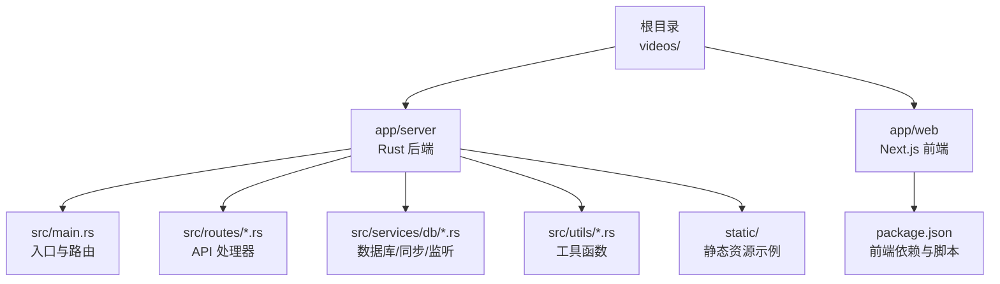
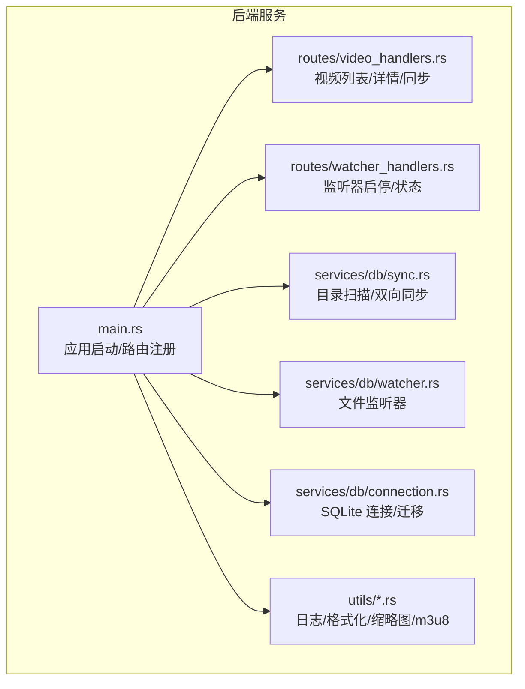
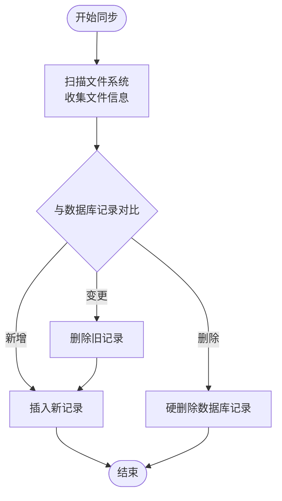
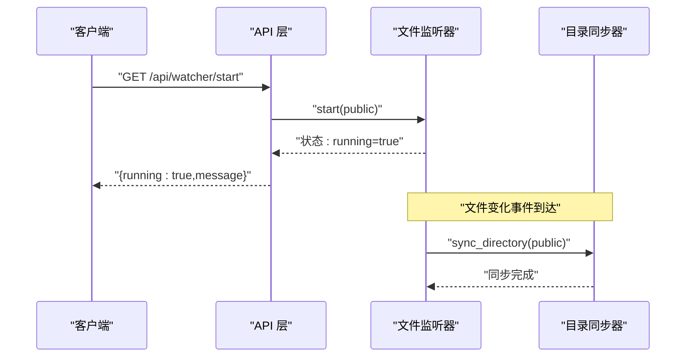
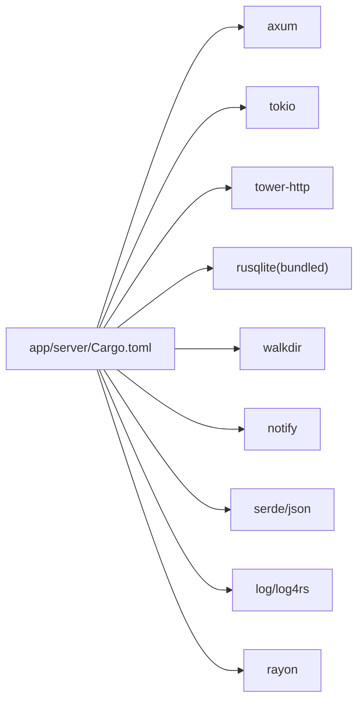

# 快速开始

<cite>
**本文引用的文件**
- [README.md](file://README.md)
- [app/server/README.md](file://app/server/README.md)
- [app/server/Cargo.toml](file://app/server/Cargo.toml)
- [app/server/src/main.rs](file://app/server/src/main.rs)
- [app/server/src/routes/mod.rs](file://app/server/src/routes/mod.rs)
- [app/server/src/routes/video_handlers.rs](file://app/server/src/routes/video_handlers.rs)
- [app/server/src/routes/watcher_handlers.rs](file://app/server/src/routes/watcher_handlers.rs)
- [app/server/src/services/mod.rs](file://app/server/src/services/mod.rs)
- [app/server/src/services/db/connection.rs](file://app/server/src/services/db/connection.rs)
- [app/server/src/services/db/video_dao.rs](file://app/server/src/services/db/video_dao.rs)
- [app/server/src/services/db/sync.rs](file://app/server/src/services/db/sync.rs)
- [app/server/src/services/db/watcher.rs](file://app/server/src/services/db/watcher.rs)
- [app/server/src/utils/mod.rs](file://app/server/src/utils/mod.rs)
- [app/server/static/index.html](file://app/server/static/index.html)
- [app/web/package.json](file://app/web/package.json)
</cite>

## 目录
1. [简介](#简介)
2. [项目结构](#项目结构)
3. [核心组件](#核心组件)
4. [架构总览](#架构总览)
5. [详细组件分析](#详细组件分析)
6. [依赖关系分析](#依赖关系分析)
7. [性能注意事项](#性能注意事项)
8. [故障排查指南](#故障排查指南)
9. [结论](#结论)
10. [附录](#附录)

## 简介
本指南面向首次部署“视频文件服务器”的用户，提供从环境准备、Rust 工具链安装验证、项目克隆与依赖安装，到开发与生产模式启动、后台运行配置、基础 API 调用与静态文件访问的全流程说明。文档中的每一步都配有具体命令与预期输出提示，确保新手也能顺利完成部署。

## 项目结构
该仓库包含两个主要部分：
- app/server：基于 Rust + Axum 的后端服务，提供 REST API 与静态文件服务，并内置 SQLite 数据库存储视频元数据。
- app/web：基于 Next.js 的前端示例应用（非必需，后端可独立运行）。

图表来源
- [README.md](file://README.md#L252-L303)
- [app/server/src/main.rs](file://app/server/src/main.rs#L72-L90)
- [app/server/src/routes/mod.rs](file://app/server/src/routes/mod.rs#L1-L6)
- [app/server/src/services/db/mod.rs](file://app/server/src/services/db/mod.rs#L1-L16)
- [app/server/src/utils/mod.rs](file://app/server/src/utils/mod.rs#L1-L14)
- [app/server/static/index.html](file://app/server/static/index.html#L1-L26)
- [app/web/package.json](file://app/web/package.json#L1-L20)

章节来源
- [README.md](file://README.md#L252-L303)

## 核心组件
- 服务器入口与路由
  - 入口文件负责初始化日志、数据库、文件监听器，构建路由并绑定监听地址。
  - 路由包括 API 端点与静态文件服务挂载。
- 数据库与同步
  - 使用 SQLite 存储视频元数据；提供目录扫描、双向同步、索引优化与迁移。
- 文件监听器
  - 基于文件系统事件自动触发数据库同步，带防抖与过滤策略。
- 工具与类型
  - 提供日志初始化、尺寸格式化、创建时间解析、缩略图生成、m3u8 处理等工具函数。
- 前端示例
  - Next.js 示例应用，包含页面与组件，便于联调与演示。

章节来源
- [app/server/src/main.rs](file://app/server/src/main.rs#L21-L110)
- [app/server/src/services/db/connection.rs](file://app/server/src/services/db/connection.rs#L1-L48)
- [app/server/src/services/db/sync.rs](file://app/server/src/services/db/sync.rs#L43-L84)
- [app/server/src/services/db/watcher.rs](file://app/server/src/services/db/watcher.rs#L29-L145)
- [app/server/src/utils/mod.rs](file://app/server/src/utils/mod.rs#L1-L14)
- [app/web/package.json](file://app/web/package.json#L1-L20)

## 架构总览
后端采用异步运行时与中间件栈，提供 REST API 与静态文件服务，并通过数据库与文件系统实现视频目录的自动发现与元数据管理。

图表来源
- [app/server/src/main.rs](file://app/server/src/main.rs#L72-L90)
- [app/server/src/routes/video_handlers.rs](file://app/server/src/routes/video_handlers.rs#L1-L104)
- [app/server/src/routes/watcher_handlers.rs](file://app/server/src/routes/watcher_handlers.rs#L1-L84)
- [app/server/src/services/db/sync.rs](file://app/server/src/services/db/sync.rs#L86-L172)
- [app/server/src/services/db/watcher.rs](file://app/server/src/services/db/watcher.rs#L29-L145)
- [app/server/src/services/db/connection.rs](file://app/server/src/services/db/connection.rs#L1-L48)
- [app/server/src/utils/mod.rs](file://app/server/src/utils/mod.rs#L1-L14)

## 详细组件分析

### 启动与运行模式
- 环境要求检查
  - 系统：Windows 10/11、Linux(Ubuntu 20.04+)、macOS 10.15+
  - 内存：建议 2GB 以上
  - 存储：至少 100MB 可用空间
  - 软件：Rust 工具链（rustc、cargo）、Git、终端
- Rust 工具链安装与验证
  - 安装：参考项目说明中的安装脚本与验证命令
  - 验证：查看 rustc 与 cargo 版本
- 克隆与依赖安装
  - 进入项目目录后，进入 app/server 并执行构建命令
  - 可选：使用 release 模式构建以获得更佳性能
- 开发模式启动
  - 在 app/server 目录执行运行命令，服务器默认监听在 0.0.0.0:3000
- 生产模式启动
  - 先构建 release，再运行 release 可执行文件
- 后台运行
  - Linux/macOS：使用 nohup 后台运行并重定向日志
  - Windows：使用 start /b 后台运行并重定向日志

预期输出（示例）
- 启动日志包含监听地址、CORS 状态、缩略图与数据库初始化信息
- 控制台打印可用 API 列表与文件监听器状态提示

章节来源
- [README.md](file://README.md#L36-L128)
- [app/server/README.md](file://app/server/README.md#L138-L160)
- [app/server/src/main.rs](file://app/server/src/main.rs#L92-L110)

### API 端点与调用示例
- 视频列表（第一层）
  - 方法：GET
  - 路径：/api/videos
  - 返回：videos 数组，包含 name、path、type、size、created_at、thumbnail 等字段
- 视频详情
  - 方法：GET
  - 路径：/api/videos/{path}
  - 返回：指定路径的视频信息，若为目录则包含 children
- 手动同步数据库
  - 方法：GET
  - 路径：/api/sync
  - 返回：同步结果与计数
- 文件监听器控制
  - 启动：GET /api/watcher/start
  - 停止：GET /api/watcher/stop
  - 状态：GET /api/watcher/status
- 静态文件访问
  - 视频与字幕：/public/{filename}
  - 缩略图：/thumbnails/{...}
  - 示例页面：/static/index.html

调用示例（命令行）
- 获取视频列表：curl http://localhost:3000/api/videos
- 获取视频详情：curl http://localhost:3000/api/videos/1221
- 直接下载视频：curl -O http://localhost:3000/public/video1.mp4
- 浏览器访问：http://localhost:3000/public/video1.mp4

章节来源
- [app/server/README.md](file://app/server/README.md#L32-L107)
- [app/server/src/main.rs](file://app/server/src/main.rs#L72-L90)
- [app/server/src/routes/video_handlers.rs](file://app/server/src/routes/video_handlers.rs#L1-L104)
- [app/server/src/routes/watcher_handlers.rs](file://app/server/src/routes/watcher_handlers.rs#L1-L84)
- [app/server/static/index.html](file://app/server/static/index.html#L1-L26)

### 数据库与目录同步
- 数据库初始化
  - 启动时创建 videos 表与索引，执行迁移逻辑
- 目录扫描与同步
  - 支持 MP4、M3U8、TS、VTT/SRT、图片等类型识别
  - 对 m3u8 目录进行特殊处理，合并为可播放路径
  - 双向同步：文件系统变更触发数据库更新，删除文件也会清理数据库
- 查询与树形结构
  - 提供根目录查询、按父路径查询、按路径查询等 DAO 方法
  - 支持构建树形结构（用于层级展示）

图表来源
- [app/server/src/services/db/sync.rs](file://app/server/src/services/db/sync.rs#L116-L172)
- [app/server/src/services/db/video_dao.rs](file://app/server/src/services/db/video_dao.rs#L51-L119)
- [app/server/src/services/db/connection.rs](file://app/server/src/services/db/connection.rs#L1-L48)

章节来源
- [app/server/src/services/db/connection.rs](file://app/server/src/services/db/connection.rs#L1-L48)
- [app/server/src/services/db/sync.rs](file://app/server/src/services/db/sync.rs#L198-L263)
- [app/server/src/services/db/video_dao.rs](file://app/server/src/services/db/video_dao.rs#L51-L119)

### 文件监听器
- 启动监听
  - 递归监听 public 目录，过滤非视频相关事件
  - 防抖策略：事件聚合，避免频繁同步
- 停止监听
  - 清理监听器与通道，标记停止状态
- 状态查询
  - 返回 running 与 message 字段

图表来源
- [app/server/src/routes/watcher_handlers.rs](file://app/server/src/routes/watcher_handlers.rs#L18-L42)
- [app/server/src/services/db/watcher.rs](file://app/server/src/services/db/watcher.rs#L29-L145)
- [app/server/src/services/db/sync.rs](file://app/server/src/services/db/sync.rs#L81-L84)

章节来源
- [app/server/src/routes/watcher_handlers.rs](file://app/server/src/routes/watcher_handlers.rs#L1-L84)
- [app/server/src/services/db/watcher.rs](file://app/server/src/services/db/watcher.rs#L29-L145)

### 静态文件服务
- public 目录下的文件可通过 /public/... 访问
- thumbnails 目录下的缩略图可通过 /thumbnails/... 访问
- static 目录下的示例页面可通过 /static/... 访问

章节来源
- [app/server/src/main.rs](file://app/server/src/main.rs#L85-L90)
- [app/server/static/index.html](file://app/server/static/index.html#L1-L26)

## 依赖关系分析
- Rust 依赖
  - Web 框架与运行时：axum、tokio
  - HTTP 中间件：tower-http（含静态文件服务、CORS、追踪）
  - 数据库：rusqlite（捆绑版）
  - 文件系统与监听：walkdir、notify
  - 序列化：serde、serde_json
  - 日志：log、log4rs
  - 并行：rayon
- 前端依赖（可选）
  - Next.js、React、TailwindCSS、hls.js 等

图表来源
- [app/server/Cargo.toml](file://app/server/Cargo.toml#L6-L23)

章节来源
- [app/server/Cargo.toml](file://app/server/Cargo.toml#L6-L23)

## 性能注意事项
- 使用 release 模式运行以获得最佳性能
- 目录扫描深度与文件数量会影响同步耗时，建议合理规划目录结构
- 对大量视频场景，可考虑缓存目录扫描结果或分页查询
- 静态文件访问由中间件提供，建议结合 CDN 加速静态资源

## 故障排查指南
常见问题与解决思路
- 服务器启动失败
  - 检查端口是否被占用；确认 public 目录存在且具备读取权限
- 端口修改
  - 在入口文件中修改监听地址与端口后重新编译
- 视频格式支持
  - 当前支持 MP4、M3U8、TS、VTT、SRT；其他格式需扩展类型识别
- 缩略图缺失
  - 需要预先生成同名 .jpg 缩略图文件
- HLS 流媒体
  - 将 m3u8 与 ts 文件置于同一目录，服务器会识别为 HLS 目录

章节来源
- [README.md](file://README.md#L482-L510)
- [app/server/README.md](file://app/server/README.md#L237-L245)

## 结论
通过本指南，您可以在本地快速完成 Rust 环境准备、项目构建与运行，并掌握 API 调用与静态文件访问的基本方法。根据实际需求，可进一步启用文件监听器、优化性能与扩展功能。

## 附录

### 快速命令清单
- 安装 Rust 工具链与验证
  - 安装脚本与验证命令参见项目说明
- 克隆与依赖安装
  - 进入 app/server 目录后执行构建命令
- 开发模式启动
  - 在 app/server 目录执行运行命令
- 生产模式启动
  - 先构建 release，再运行 release
- 后台运行
  - Linux/macOS 使用 nohup；Windows 使用 start /b

章节来源
- [README.md](file://README.md#L50-L128)