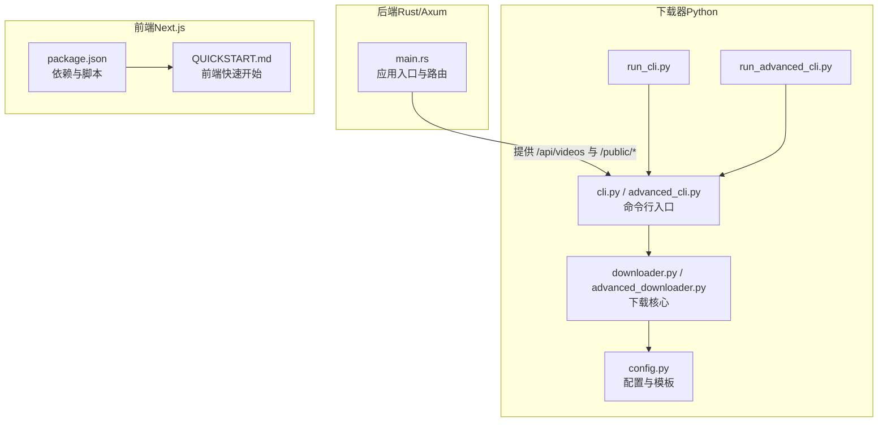
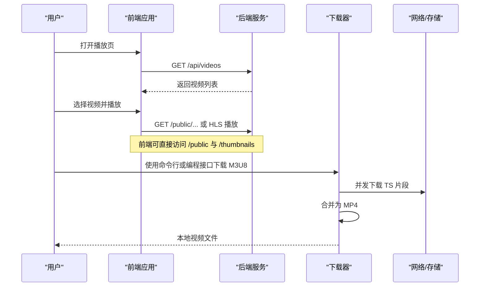
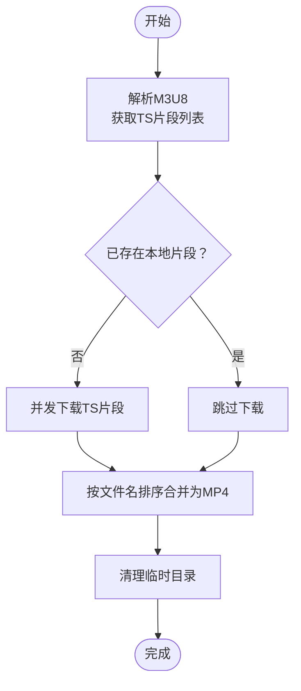
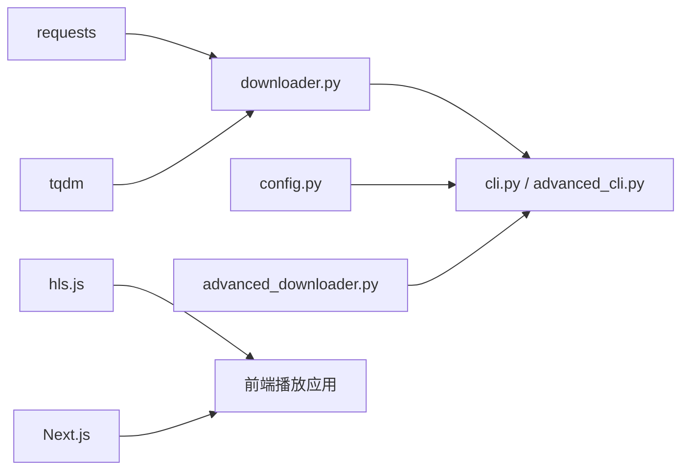

# 快速开始

<cite>
**本文引用的文件**
- [README.md](file://README.md)
- [QUICKSTART.md（下载器）](file://app/downloader/QUICKSTART.md)
- [run_cli.py](file://app/downloader/run_cli.py)
- [run_advanced_cli.py](file://app/downloader/run_advanced_cli.py)
- [cli.py](file://app/downloader/cli/cli.py)
- [advanced_cli.py](file://app/downloader/cli/advanced_cli.py)
- [downloader.py](file://app/downloader/core/downloader.py)
- [advanced_downloader.py](file://app/downloader/core/advanced_downloader.py)
- [config.py](file://app/downloader/core/config.py)
- [example_usage.py](file://app/downloader/examples/example_usage.py)
- [main.rs](file://app/server/src/main.rs)
- [QUICKSTART.md（前端）](file://app/web/QUICKSTART.md)
- [package.json](file://app/web/package.json)
</cite>

## 目录
1. [引言](#引言)
2. [项目结构](#项目结构)
3. [核心组件](#核心组件)
4. [架构总览](#架构总览)
5. [详细组件分析](#详细组件分析)
6. [依赖关系分析](#依赖关系分析)
7. [性能注意事项](#性能注意事项)
8. [故障排查指南](#故障排查指南)
9. [结论](#结论)

## 引言
本“快速开始”面向希望尽快上手本项目的用户，涵盖三大能力：
- 后端视频服务器：基于 Rust/Axum 的高性能视频服务，提供 REST API 与静态资源访问。
- 下载器模块：Python 实现的 M3U8 视频下载器，支持命令行与编程接口，具备断点续传、并发控制、配置模板与 JSON 批量任务。
- 前端播放应用：Next.js 应用，提供视频列表与播放体验，并新增密码验证与移动端手势优化。

本指南将给出最短路径的安装、启动与使用步骤，帮助你快速体验各模块的核心功能。

## 项目结构
项目采用多模块组织，核心目录如下：
- app/server：Rust/Axum 后端，提供视频扫描、API 与静态文件服务。
- app/downloader：Python 下载器模块，包含 CLI 与核心下载逻辑。
- app/web：Next.js 前端应用，提供视频播放与交互体验。

图表来源
- [main.rs](file://app/server/src/main.rs#L1-L111)
- [cli.py](file://app/downloader/cli/cli.py#L1-L292)
- [advanced_cli.py](file://app/downloader/cli/advanced_cli.py#L1-L377)
- [downloader.py](file://app/downloader/core/downloader.py#L1-L501)
- [advanced_downloader.py](file://app/downloader/core/advanced_downloader.py#L1-L586)
- [config.py](file://app/downloader/core/config.py#L1-L114)
- [run_cli.py](file://app/downloader/run_cli.py#L1-L25)
- [run_advanced_cli.py](file://app/downloader/run_advanced_cli.py#L1-L17)
- [package.json](file://app/web/package.json#L1-L74)
- [QUICKSTART.md（前端）](file://app/web/QUICKSTART.md#L1-L313)

章节来源
- [README.md](file://README.md#L253-L317)
- [main.rs](file://app/server/src/main.rs#L1-L111)

## 核心组件
- 后端服务（Rust/Axum）
  - 提供视频列表与详情 API、手动同步接口、文件监听器控制端点，以及静态资源服务。
  - 默认监听端口与目录可通过代码与环境变量配置。
- 下载器（Python）
  - 基础 CLI：支持命令行参数、配置模板、交互模式、断点续传与进度显示。
  - 高级 CLI：支持 JSON 批量任务、并发控制、流式下载与任务管理。
  - 核心模块：M3U8 解析、多线程下载、重试与合并、日志与信号处理。
- 前端应用（Next.js）
  - 提供视频列表与播放页面，支持密码验证、移动端手势控制与进度预览。

章节来源
- [README.md](file://README.md#L103-L165)
- [QUICKSTART.md（下载器）](file://app/downloader/QUICKSTART.md#L1-L120)
- [QUICKSTART.md（前端）](file://app/web/QUICKSTART.md#L1-L80)

## 架构总览
后端负责视频资源与元数据管理；下载器通过解析 M3U8 并并发下载 TS 片段，再合并为 MP4；前端通过 API 获取视频列表与播放 HLS。

图表来源
- [main.rs](file://app/server/src/main.rs#L72-L110)
- [README.md](file://README.md#L130-L165)
- [cli.py](file://app/downloader/cli/cli.py#L240-L292)
- [advanced_cli.py](file://app/downloader/cli/advanced_cli.py#L314-L377)
- [downloader.py](file://app/downloader/core/downloader.py#L379-L501)
- [advanced_downloader.py](file://app/downloader/core/advanced_downloader.py#L524-L586)

## 详细组件分析

### 后端服务（Rust/Axum）
- 启动与端口
  - 开发模式：在 app/server 目录执行构建与运行。
  - 生产模式：构建优化版本后运行。
  - 默认监听地址与端口可在代码中调整。
- API 与静态资源
  - 视频列表与详情：/api/videos 与 /api/videos/*path
  - 手动同步：/api/sync
  - 文件监听器控制：/api/watcher/start、/api/watcher/stop、/api/watcher/status
  - 静态资源：/public/<文件>、/thumbnails/<文件>
- CORS 与日志
  - 默认启用 CORS，允许所有来源与方法。
  - 初始化日志与状态打印，便于调试。

章节来源
- [README.md](file://README.md#L103-L165)
- [main.rs](file://app/server/src/main.rs#L72-L110)

### 下载器（Python）
- 基础 CLI
  - 支持 URL 参数、输出文件、线程数、配置模板（fast/stable/low_bandwidth）、请求头、禁用 SSL 验证、禁用进度与日志、试运行、交互模式等。
  - 交互模式提供友好引导，支持自定义配置。
- 高级 CLI
  - 支持 JSON 批量任务、最大并发数、输出目录、配置模板与交互模式。
  - 提供 JSON 任务创建向导，可保存为文件后批量执行。
- 核心流程
  - M3U8 解析：获取 TS 片段列表与解析信息。
  - 并发下载：线程池下载未完成的 TS 片段，支持断点续传。
  - 合并与清理：按文件名排序合并为 MP4，并清理临时目录。
- 配置与模板
  - 默认线程数根据 CPU 核心数计算；可自定义超时、重试、块大小、缓冲区、路径、请求头、SSL 验证、进度与日志开关。
  - 提供 fast、stable、low_bandwidth 三套模板，覆盖不同网络与性能需求。

图表来源
- [downloader.py](file://app/downloader/core/downloader.py#L379-L501)
- [advanced_downloader.py](file://app/downloader/core/advanced_downloader.py#L432-L586)

章节来源
- [cli.py](file://app/downloader/cli/cli.py#L1-L292)
- [advanced_cli.py](file://app/downloader/cli/advanced_cli.py#L1-L377)
- [downloader.py](file://app/downloader/core/downloader.py#L1-L501)
- [advanced_downloader.py](file://app/downloader/core/advanced_downloader.py#L1-L586)
- [config.py](file://app/downloader/core/config.py#L1-L114)
- [run_cli.py](file://app/downloader/run_cli.py#L1-L25)
- [run_advanced_cli.py](file://app/downloader/run_advanced_cli.py#L1-L17)
- [example_usage.py](file://app/downloader/examples/example_usage.py#L1-L176)

### 前端播放应用（Next.js）
- 启动与访问
  - 在 app/web 目录执行开发服务器，访问 http://localhost:13000。
- 密码验证
  - 首次访问需要输入密码，默认值可在环境变量中修改。
  - 刷新页面无需重复输入，关闭浏览器后需重新验证。
- 移动端交互优化
  - 单击视频画面显示/隐藏控制栏；拖动画面左右滑动调整进度；拖动时显示时间预览气泡。
- 环境与依赖
  - 使用 Next.js 16、Tailwind、Radix UI 组件库与 hls.js 播放 HLS。

章节来源
- [QUICKSTART.md（前端）](file://app/web/QUICKSTART.md#L1-L120)
- [package.json](file://app/web/package.json#L1-L74)

## 依赖关系分析
- 下载器依赖
  - requests：HTTP 下载与会话。
  - tqdm：进度条显示。
- 前端依赖
  - Next.js、hls.js：HLS 播放。
  - Radix UI、Tailwind：UI 组件与样式。
- 后端依赖
  - Axum、Tokio、Tower-HTTP、Serde、WalkDir 等（详见项目说明）。

图表来源
- [requirements.txt](file://app/downloader/requirements.txt#L1-L3)
- [downloader.py](file://app/downloader/core/downloader.py#L1-L501)
- [advanced_downloader.py](file://app/downloader/core/advanced_downloader.py#L1-L586)
- [cli.py](file://app/downloader/cli/cli.py#L1-L292)
- [advanced_cli.py](file://app/downloader/cli/advanced_cli.py#L1-L377)
- [config.py](file://app/downloader/core/config.py#L1-L114)
- [package.json](file://app/web/package.json#L1-L74)

章节来源
- [README.md](file://README.md#L385-L474)
- [requirements.txt](file://app/downloader/requirements.txt#L1-L3)
- [package.json](file://app/web/package.json#L1-L74)

## 性能注意事项
- 下载器
  - 线程数与超时：根据网络状况选择合适配置模板（fast/stable/low_bandwidth），或自定义线程数、重试与超时。
  - 断点续传：重复运行相同命令即可继续下载未完成片段。
  - 合并策略：TS 片段按文件名排序合并，避免乱序导致播放异常。
- 前端
  - HLS 播放需引入 hls.js；移动端手势依赖触摸设备或触摸板。
- 后端
  - 生产模式使用优化构建；CDN 可加速静态资源访问。

章节来源
- [QUICKSTART.md（下载器）](file://app/downloader/QUICKSTART.md#L249-L290)
- [README.md](file://README.md#L202-L252)
- [QUICKSTART.md（前端）](file://app/web/QUICKSTART.md#L115-L160)

## 故障排查指南
- 下载器常见问题
  - 无法从 downloader 目录直接运行模块：需从 app 目录使用完整模块路径，或使用便捷脚本。
  - ModuleNotFoundError: No module named 'cli.config'：确认在正确目录运行并使用完整模块路径。
  - 下载速度慢：使用快速模式或增大线程数；检查网络与代理。
  - 下载失败：下载器支持断点续传，直接重新运行命令继续。
- 前端常见问题
  - 拖动功能不工作：需要触摸屏或触摸板支持；PC 端使用进度条调整。
  - 忘记密码：查看 .env.local 中的 NEXT_PUBLIC_APP_PASSWORD 配置。
  - 清除登录状态：在浏览器控制台移除 sessionStorage 中的 authenticated 键。
- 后端常见问题
  - 服务器启动失败：检查端口占用与 public 目录权限。
  - 修改端口：在 main.rs 中修改 SocketAddr 端口号并重新编译。

章节来源
- [QUICKSTART.md（下载器）](file://app/downloader/QUICKSTART.md#L225-L290)
- [QUICKSTART.md（前端）](file://app/web/QUICKSTART.md#L115-L160)
- [README.md](file://README.md#L604-L623)

## 结论
通过本“快速开始”，你可以：
- 启动后端服务并访问视频 API 与静态资源；
- 使用下载器命令行或编程接口下载 M3U8 视频；
- 运行前端应用体验视频播放与移动端交互优化。

建议在实际使用中结合网络环境选择合适的下载配置模板，并在生产环境中使用优化构建与 CDN 加速静态资源。