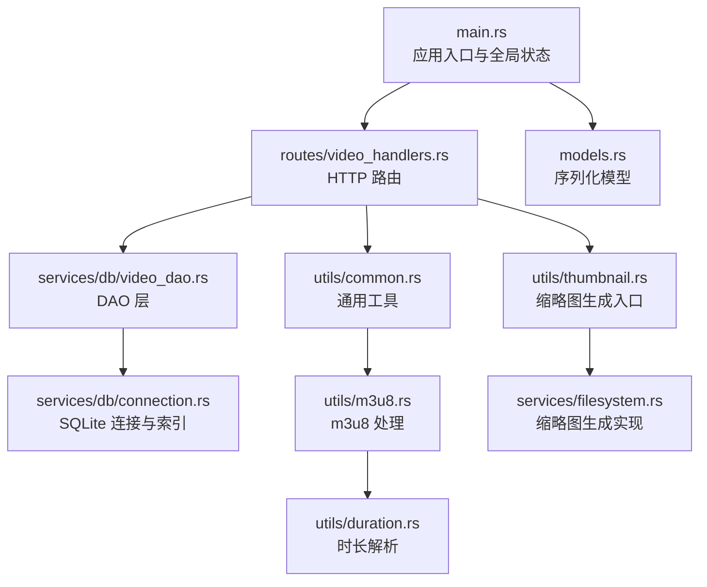
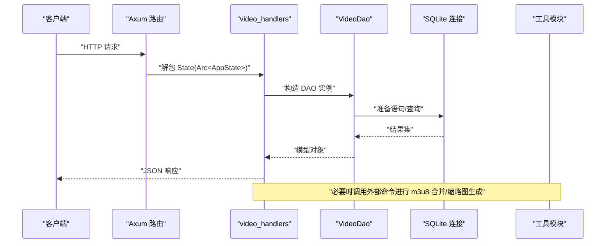
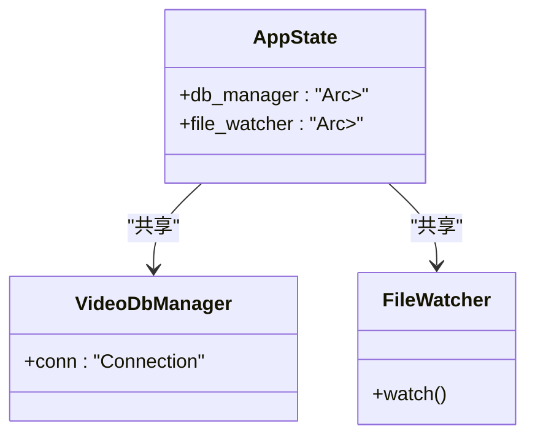
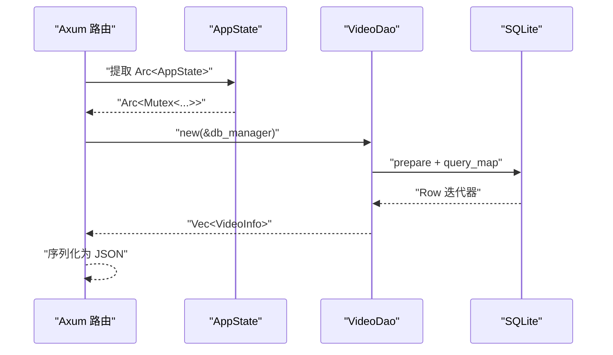
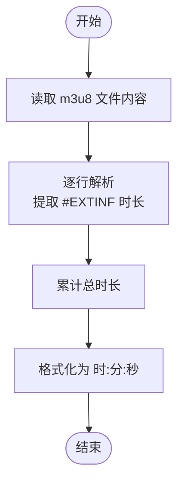
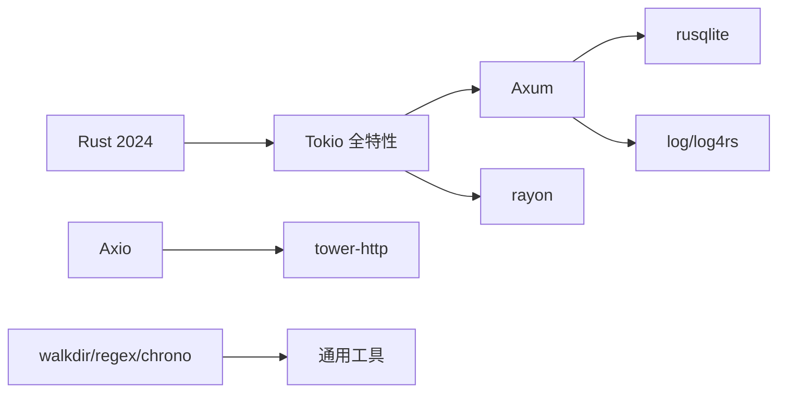

# 内存管理优化

<cite>
**本文引用的文件**
- [app/server/src/main.rs](file://app/server/src/main.rs)
- [app/server/src/models.rs](file://app/server/src/models.rs)
- [app/server/src/routes/video_handlers.rs](file://app/server/src/routes/video_handlers.rs)
- [app/server/src/utils/common.rs](file://app/server/src/utils/common.rs)
- [app/server/src/utils/m3u8.rs](file://app/server/src/utils/m3u8.rs)
- [app/server/src/utils/duration.rs](file://app/server/src/utils/duration.rs)
- [app/server/src/utils/thumbnail.rs](file://app/server/src/utils/thumbnail.rs)
- [app/server/src/services/filesystem.rs](file://app/server/src/services/filesystem.rs)
- [app/server/src/services/db/connection.rs](file://app/server/src/services/db/connection.rs)
- [app/server/src/services/db/video_dao.rs](file://app/server/src/services/db/video_dao.rs)
- [app/server/Cargo.toml](file://app/server/Cargo.toml)
- [app/server/README.md](file://app/server/README.md)
</cite>

## 目录
1. [简介](#简介)
2. [项目结构](#项目结构)
3. [核心组件](#核心组件)
4. [架构总览](#架构总览)
5. [详细组件分析](#详细组件分析)
6. [依赖关系分析](#依赖关系分析)
7. [性能考量](#性能考量)
8. [故障排查指南](#故障排查指南)
9. [结论](#结论)
10. [附录](#附录)

## 简介
本指南聚焦于高性能场景下的内存管理优化，结合仓库现有实现，系统阐述以下主题：
- Rust 所有权系统在高并发与高吞吐场景中的应用策略
- 零拷贝与内存池的可选实现思路
- 字符串处理优化：Cow、String 与 &str 的选择原则
- 大文件处理的内存优化：流式处理与分块读取
- 内存分配器与垃圾回收相关性能考虑
- 内存泄漏检测工具与常见陷阱规避

本指南既提供面向工程实践的建议，也给出与代码实际对应的可视化图示与来源标注。

## 项目结构
后端采用 Rust + Axum + Tokio，模块化组织如下：
- 应用入口与全局状态：main.rs
- 路由层：video_handlers.rs
- 业务模型：models.rs
- 工具与通用逻辑：common.rs、m3u8.rs、duration.rs、thumbnail.rs
- 文件系统与缩略图：filesystem.rs
- 数据库层：connection.rs、video_dao.rs
- 依赖与构建：Cargo.toml



**图表来源**
- [app/server/src/main.rs](file://app/server/src/main.rs#L1-L111)
- [app/server/src/routes/video_handlers.rs](file://app/server/src/routes/video_handlers.rs#L1-L104)
- [app/server/src/services/db/video_dao.rs](file://app/server/src/services/db/video_dao.rs#L1-L146)
- [app/server/src/services/db/connection.rs](file://app/server/src/services/db/connection.rs#L1-L122)
- [app/server/src/utils/common.rs](file://app/server/src/utils/common.rs#L1-L146)
- [app/server/src/utils/m3u8.rs](file://app/server/src/utils/m3u8.rs#L1-L148)
- [app/server/src/utils/duration.rs](file://app/server/src/utils/duration.rs#L40-L65)
- [app/server/src/utils/thumbnail.rs](file://app/server/src/utils/thumbnail.rs#L1-L99)
- [app/server/src/services/filesystem.rs](file://app/server/src/services/filesystem.rs#L1-L121)
- [app/server/src/models.rs](file://app/server/src/models.rs#L1-L32)

**章节来源**
- [app/server/src/main.rs](file://app/server/src/main.rs#L1-L111)
- [app/server/Cargo.toml](file://app/server/Cargo.toml#L1-L23)

## 核心组件
- 全局状态与并发共享：应用状态通过 Arc<Mutex<T>> 在各路由之间共享，确保跨请求的安全访问。
- 路由与数据访问：Axum 路由调用 DAO 层，DAO 通过 SQLite 查询并构造模型对象。
- 工具链与外部进程：m3u8 合并与缩略图生成通过外部命令执行，注意其对内存与 I/O 的影响。
- 并发与 I/O：缩略图批量生成使用并行迭代器，提升吞吐。

**章节来源**
- [app/server/src/main.rs](file://app/server/src/main.rs#L21-L61)
- [app/server/src/routes/video_handlers.rs](file://app/server/src/routes/video_handlers.rs#L1-L104)
- [app/server/src/services/db/video_dao.rs](file://app/server/src/services/db/video_dao.rs#L1-L146)
- [app/server/src/services/filesystem.rs](file://app/server/src/services/filesystem.rs#L1-L121)

## 架构总览
后端采用典型的 Web 服务架构：HTTP 请求经路由进入业务层，DAO 访问数据库，工具模块负责外部进程与文件系统操作。



**图表来源**
- [app/server/src/routes/video_handlers.rs](file://app/server/src/routes/video_handlers.rs#L1-L104)
- [app/server/src/services/db/video_dao.rs](file://app/server/src/services/db/video_dao.rs#L1-L146)
- [app/server/src/services/db/connection.rs](file://app/server/src/services/db/connection.rs#L1-L122)
- [app/server/src/utils/m3u8.rs](file://app/server/src/utils/m3u8.rs#L1-L148)
- [app/server/src/utils/thumbnail.rs](file://app/server/src/utils/thumbnail.rs#L1-L99)

## 详细组件分析

### 组件A：全局状态与并发共享（Arc<Mutex<T>>）
- 设计要点
  - 使用 Arc<Mutex<VideoDbManager>> 和 Arc<Mutex<FileWatcher>> 在多任务间共享资源。
  - 路由处理器通过 State 提取 Arc<AppState>，内部再锁住 Mutex 获取具体实例。
- 内存与性能
  - Arc 引用计数零拷贝共享，减少复制成本；Mutex 在高并发下可能成为热点，需关注锁粒度与持有时间。
  - 建议：尽量缩短持有锁的时间，避免在锁内做阻塞 I/O 或外部进程调用。



**图表来源**
- [app/server/src/main.rs](file://app/server/src/main.rs#L21-L61)

**章节来源**
- [app/server/src/main.rs](file://app/server/src/main.rs#L21-L61)
- [app/server/src/routes/video_handlers.rs](file://app/server/src/routes/video_handlers.rs#L1-L28)

### 组件B：路由与数据访问（DAO + 模型）
- 设计要点
  - 路由函数接收 State<Arc<AppState>>，内部锁定 Mutex 获取 DAO 实例。
  - DAO 通过 rusqlite 的 prepare/query_map 构造模型对象，最终序列化为 JSON。
- 内存与性能
  - query_map 逐行映射，避免一次性加载全部结果到内存；模型字段按需序列化。
  - 建议：对大结果集使用分页或流式输出；对可选字段使用 skip_serializing_if 减少序列化开销。



**图表来源**
- [app/server/src/routes/video_handlers.rs](file://app/server/src/routes/video_handlers.rs#L1-L104)
- [app/server/src/services/db/video_dao.rs](file://app/server/src/services/db/video_dao.rs#L1-L146)
- [app/server/src/models.rs](file://app/server/src/models.rs#L1-L32)

**章节来源**
- [app/server/src/routes/video_handlers.rs](file://app/server/src/routes/video_handlers.rs#L1-L104)
- [app/server/src/services/db/video_dao.rs](file://app/server/src/services/db/video_dao.rs#L1-L146)
- [app/server/src/models.rs](file://app/server/src/models.rs#L1-L32)

### 组件C：m3u8 合并与时长解析（外部进程与文本处理）
- 设计要点
  - 使用外部命令合并 m3u8 为 mp4，并在必要时删除原目录。
  - 时长解析通过读取 m3u8 文本并累加片段时长，最后格式化为时:分:秒。
- 内存与性能
  - 大文件读取建议采用分块读取与流式处理，避免一次性读入内存。
  - 外部进程调用会带来额外开销，建议异步执行并限制并发数。



**图表来源**
- [app/server/src/utils/duration.rs](file://app/server/src/utils/duration.rs#L40-L65)

**章节来源**
- [app/server/src/utils/m3u8.rs](file://app/server/src/utils/m3u8.rs#L1-L148)
- [app/server/src/utils/duration.rs](file://app/server/src/utils/duration.rs#L40-L65)

### 组件D：缩略图生成（并行与外部进程）
- 设计要点
  - 使用并行迭代器对缺失缩略图的文件进行批量生成。
  - 通过外部命令生成缩略图，失败时回退到默认缩略图。
- 内存与性能
  - 并行生成显著提升吞吐，但需注意磁盘与外部进程的资源竞争。
  - 建议：限制并行度、缓存缩略图路径、避免重复生成。

```mermaid
sequenceDiagram
participant Init as "初始化缩略图"
participant Scan as "扫描缺失文件"
participant Par as "并行迭代"
participant Gen as "生成缩略图"
Init->>Scan : "获取无缩略图文件"
Scan-->>Init : "Vec<(name, path)>"
Init->>Par : "并行处理"
Par->>Gen : "为每个文件生成缩略图"
Gen-->>Par : "完成/失败"
Par-->>Init : "统计耗时"
```

**图表来源**
- [app/server/src/services/filesystem.rs](file://app/server/src/services/filesystem.rs#L1-L121)
- [app/server/src/utils/thumbnail.rs](file://app/server/src/utils/thumbnail.rs#L1-L99)

**章节来源**
- [app/server/src/services/filesystem.rs](file://app/server/src/services/filesystem.rs#L1-L121)
- [app/server/src/utils/thumbnail.rs](file://app/server/src/utils/thumbnail.rs#L1-L99)

### 组件E：通用工具与文件遍历
- 设计要点
  - 使用 walkdir 遍历目录，控制最大深度，过滤视频与容器类型。
  - 提供格式化大小、创建时间等辅助函数。
- 内存与性能
  - 深度控制与早期过滤能有效降低内存占用与 CPU 开销。
  - 建议：对大目录使用分批处理与增量更新策略。

**章节来源**
- [app/server/src/utils/common.rs](file://app/server/src/utils/common.rs#L1-L146)

## 依赖关系分析
- 语言与运行时
  - Rust 版本：2024 edition
  - 运行时：Tokio 全特性
- Web 与 HTTP
  - Axum、tower-http（CORS、静态文件服务）
- 数据库与并发
  - rusqlite（SQLite）、rayon（并行迭代）
- 日志与工具
  - log、log4rs、walkdir、notify、regex、chrono



**图表来源**
- [app/server/Cargo.toml](file://app/server/Cargo.toml#L1-L23)

**章节来源**
- [app/server/Cargo.toml](file://app/server/Cargo.toml#L1-L23)

## 性能考量
- 所有权与并发
  - 使用 Arc 共享不可变状态，使用 Mutex 保护可变状态；尽量缩短锁持有时间，避免在锁内执行 I/O 或外部进程调用。
- 数据库访问
  - 使用索引（path、parent_path）加速查询；对大结果集采用分页或流式输出。
- 外部进程与 I/O
  - m3u8 合并与缩略图生成通过外部命令执行，建议异步执行并限制并发；对大文件采用分块读取与流式处理。
- 并行策略
  - 使用 rayon 并行处理缩略图生成，但需根据磁盘与 CPU 资源调整并行度，避免资源争用。
- 字符串与序列化
  - 模型字段使用可选类型与 skip_serializing_if，减少不必要的序列化负载。
- 分配器与 GC
  - Rust 无传统 GC，主要依赖栈与堆分配；建议使用 Arena/Pool 模式管理临时缓冲区，避免频繁小对象分配。

[本节为通用性能指导，不直接分析具体文件，故无“章节来源”标注]

## 故障排查指南
- 外部命令失败
  - m3u8 合并与缩略图生成依赖外部命令，若失败需检查命令可用性与权限；回退到默认缩略图。
- 数据库迁移
  - 自动迁移流程会重建表与索引，确保数据库版本兼容；如失败需检查权限与磁盘空间。
- 并发与死锁
  - 路由中对 Mutex 的使用要短路且可超时；避免在锁内进行长时间 I/O。
- 日志与监控
  - 使用日志记录关键路径耗时与错误，便于定位瓶颈。

**章节来源**
- [app/server/src/utils/m3u8.rs](file://app/server/src/utils/m3u8.rs#L1-L148)
- [app/server/src/services/db/connection.rs](file://app/server/src/services/db/connection.rs#L1-L122)
- [app/server/src/services/filesystem.rs](file://app/server/src/services/filesystem.rs#L1-L121)

## 结论
本项目在高并发与多媒体处理场景下，通过合理的所有权与并发模型、数据库索引、外部进程异步化与并行处理，实现了较好的性能与可维护性。为进一步优化内存与吞吐，建议引入更细粒度的锁策略、流式处理与分块读取、Arena/Pool 模式以及更完善的监控与日志体系。

[本节为总结性内容，不直接分析具体文件，故无“章节来源”标注]

## 附录

### 字符串处理优化：Cow、String 与 &str 的选择原则
- 优先使用 &str 作为输入参数，避免不必要的所有权转移
- 对于可能修改或需要独立生命周期的数据，使用 String
- 对于中间态的借用与所有权切换，使用 Cow<str> 在借用与拥有之间灵活切换

[本节为通用指导，不直接分析具体文件，故无“章节来源”标注]

### 大文件处理的内存优化技巧
- 分块读取：按固定字节数读取，边读边处理，避免一次性加载到内存
- 流式处理：将处理过程流水线化，降低峰值内存占用
- 外部进程：对大文件转码或合并，使用管道与流式 I/O，减少中间文件

[本节为通用指导，不直接分析具体文件，故无“章节来源”标注]

### 内存分配器与垃圾回收相关性能考虑
- Rust 无 GC，主要依赖栈与堆分配；建议使用 Arena/Pool 模式管理临时缓冲区
- 避免频繁的小对象分配，合并与复用缓冲区
- 对热点路径进行内存分配统计与采样，识别潜在的分配热点

[本节为通用指导，不直接分析具体文件，故无“章节来源”标注]

### 内存泄漏检测工具与常见陷阱
- 工具：valgrind/memcheck、AddressSanitizer、heaptrack
- 常见陷阱
  - 循环引用导致的内存泄漏（Rust 通过所有权避免，但 FFI 场景需谨慎）
  - 长期持有锁内的大对象，导致内存占用过高
  - 外部进程未正确清理临时文件或句柄

[本节为通用指导，不直接分析具体文件，故无“章节来源”标注]