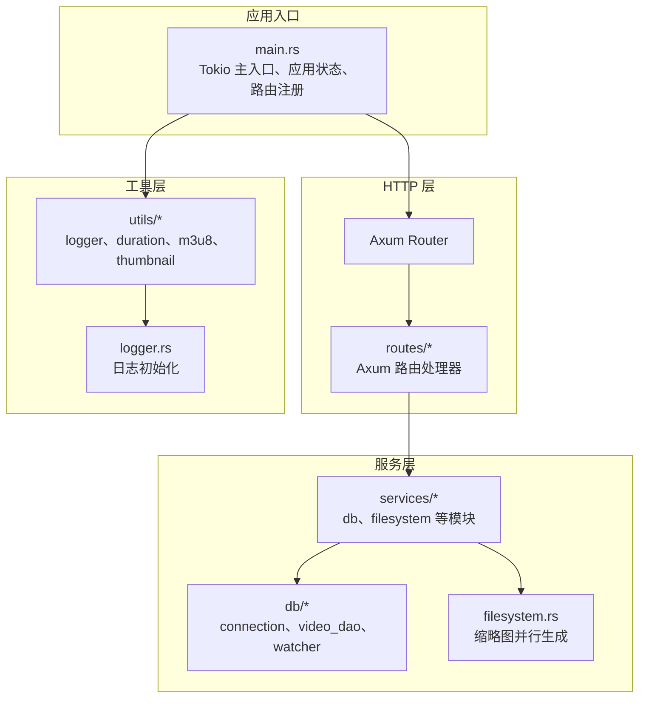
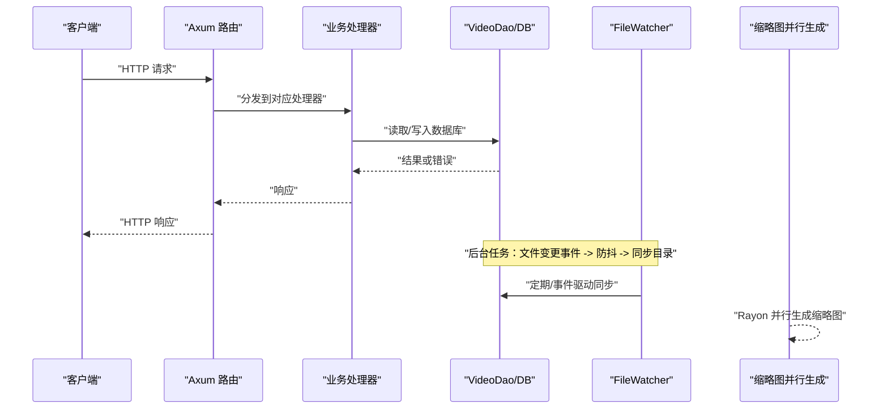
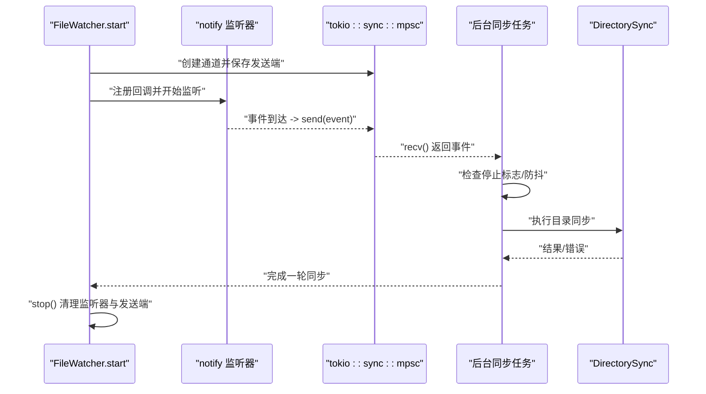
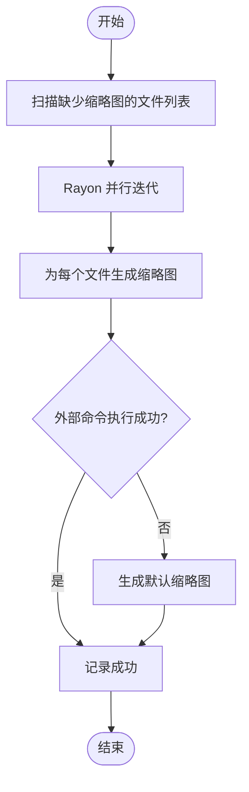
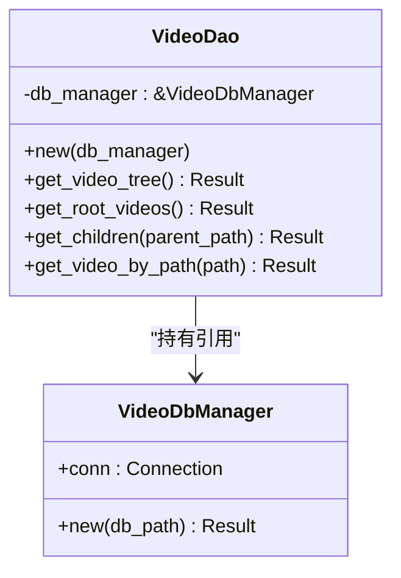
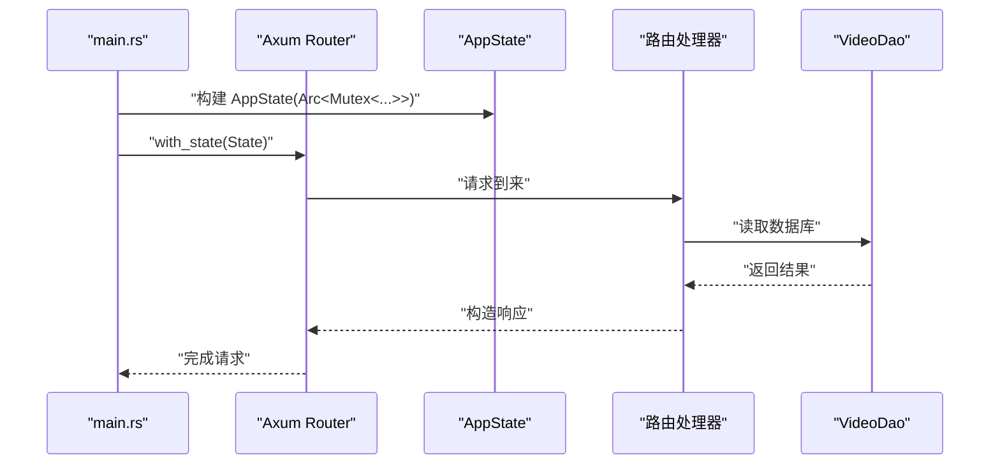
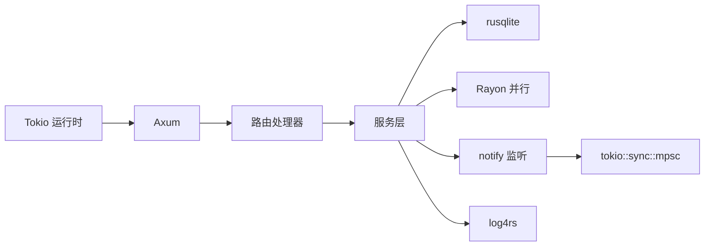

# 异步并发优化

<cite>
**本文引用的文件**
- [app/server/src/main.rs](file://app/server/src/main.rs)
- [app/server/Cargo.toml](file://app/server/Cargo.toml)
- [app/server/src/services/mod.rs](file://app/server/src/services/mod.rs)
- [app/server/src/utils/mod.rs](file://app/server/src/utils/mod.rs)
- [app/server/src/services/db/connection.rs](file://app/server/src/services/db/connection.rs)
- [app/server/src/services/db/video_dao.rs](file://app/server/src/services/db/video_dao.rs)
- [app/server/src/services/db/watcher.rs](file://app/server/src/services/db/watcher.rs)
- [app/server/src/services/filesystem.rs](file://app/server/src/services/filesystem.rs)
- [app/server/src/utils/logger.rs](file://app/server/src/utils/logger.rs)
</cite>

## 目录
1. [简介](#简介)
2. [项目结构](#项目结构)
3. [核心组件](#核心组件)
4. [架构总览](#架构总览)
5. [详细组件分析](#详细组件分析)
6. [依赖关系分析](#依赖关系分析)
7. [性能考量](#性能考量)
8. [故障排查指南](#故障排查指南)
9. [结论](#结论)
10. [附录](#附录)

## 简介
本指南围绕 Rust 与 Tokio 的异步并发模型，结合本仓库中的实际实现，系统讲解以下主题：
- Tokio 运行时的任务调度与并发模型
- 异步函数最佳实践：Future 链式调用、错误传播与取消
- 并行处理策略：Rayon 并行计算与 Tokio 任务池配置
- 并发安全编程：Arc、Mutex、RwLock 的正确使用
- 死锁检测与避免、内存泄漏预防
- 性能基准思路与对比方法（基于现有实现进行可扩展性评估）

本指南在不直接粘贴代码的前提下，通过“章节来源”定位到具体文件与行号，帮助读者快速定位实现细节。

## 项目结构
后端采用 Rust + Axum + Tokio，数据库使用 rusqlite，文件系统缩略图生成使用 Rayon 并行化，文件变更监听使用 notify + Tokio channel。应用状态通过 Arc<Mutex<T>> 在各模块间共享。

图表来源
- [app/server/src/main.rs](file://app/server/src/main.rs#L1-L111)
- [app/server/src/services/mod.rs](file://app/server/src/services/mod.rs#L1-L6)
- [app/server/src/utils/mod.rs](file://app/server/src/utils/mod.rs#L1-L14)
- [app/server/src/services/db/connection.rs](file://app/server/src/services/db/connection.rs#L1-L122)
- [app/server/src/services/db/video_dao.rs](file://app/server/src/services/db/video_dao.rs#L1-L146)
- [app/server/src/services/db/watcher.rs](file://app/server/src/services/db/watcher.rs#L1-L182)
- [app/server/src/services/filesystem.rs](file://app/server/src/services/filesystem.rs#L1-L121)
- [app/server/src/utils/logger.rs](file://app/server/src/utils/logger.rs#L1-L100)

章节来源
- [app/server/src/main.rs](file://app/server/src/main.rs#L1-L111)
- [app/server/Cargo.toml](file://app/server/Cargo.toml#L1-L23)

## 核心组件
- 应用状态与并发容器
  - 应用状态通过 Arc<Mutex<...>> 包裹，确保跨模块共享与线程安全访问。[main.rs](file://app/server/src/main.rs#L21-L30)
- Tokio 运行时与任务
  - 使用 #[tokio::main] 启动运行时；Axum 服务器在 TcpListener 上异步接受连接；文件监听器使用 tokio::spawn 启动后台任务。[main.rs](file://app/server/src/main.rs#L27-L111)
- 数据库与 DAO
  - VideoDbManager 负责连接与迁移；VideoDao 提供查询接口。[connection.rs](file://app/server/src/services/db/connection.rs#L1-L122) [video_dao.rs](file://app/server/src/services/db/video_dao.rs#L1-L146)
- 文件监听与自动同步
  - FileWatcher 使用 notify 创建文件系统监听器，通过 tokio::sync::mpsc 发送事件，后台任务接收并执行目录同步，带防抖逻辑。[watcher.rs](file://app/server/src/services/db/watcher.rs#L1-L182)
- 缩略图并行生成
  - filesystem.rs 使用 Rayon 并行迭代待生成缩略图的文件集，对每个文件异步触发外部命令生成缩略图。[filesystem.rs](file://app/server/src/services/filesystem.rs#L1-L121)
- 日志与可观测性
  - logger.rs 初始化 log4rs 控制台与滚动文件输出，便于并发场景下的调试与追踪。[logger.rs](file://app/server/src/utils/logger.rs#L1-L100)

章节来源
- [app/server/src/main.rs](file://app/server/src/main.rs#L21-L60)
- [app/server/src/services/db/connection.rs](file://app/server/src/services/db/connection.rs#L1-L122)
- [app/server/src/services/db/video_dao.rs](file://app/server/src/services/db/video_dao.rs#L1-L146)
- [app/server/src/services/db/watcher.rs](file://app/server/src/services/db/watcher.rs#L1-L182)
- [app/server/src/services/filesystem.rs](file://app/server/src/services/filesystem.rs#L1-L121)
- [app/server/src/utils/logger.rs](file://app/server/src/utils/logger.rs#L1-L100)

## 架构总览
下图展示了请求进入、异步处理与后台任务之间的交互关系。

图表来源
- [app/server/src/main.rs](file://app/server/src/main.rs#L72-L111)
- [app/server/src/services/db/watcher.rs](file://app/server/src/services/db/watcher.rs#L29-L123)
- [app/server/src/services/db/video_dao.rs](file://app/server/src/services/db/video_dao.rs#L1-L146)
- [app/server/src/services/filesystem.rs](file://app/server/src/services/filesystem.rs#L1-L121)

## 详细组件分析

### 组件A：文件监听与自动同步（并发与取消）
- 设计要点
  - 使用 tokio::sync::mpsc 建立有界通道，接收 notify 事件；后台任务循环接收事件并执行同步，具备防抖与停止标志位。[watcher.rs](file://app/server/src/services/db/watcher.rs#L29-L123)
  - 停止时将标志位置为 false，并清理监听器与发送端，避免悬挂任务与资源泄漏。[watcher.rs](file://app/server/src/services/db/watcher.rs#L125-L138)
- 取消与生命周期
  - 通过 is_watching 标志位在任务内部轮询判断是否退出；收到事件后进行防抖，避免频繁同步。[watcher.rs](file://app/server/src/services/db/watcher.rs#L55-L88)
- 错误传播
  - 监听器创建与启动失败会返回错误字符串；事件处理中捕获错误并打印，避免崩溃影响其他任务。[watcher.rs](file://app/server/src/services/db/watcher.rs#L90-L114)

图表来源
- [app/server/src/services/db/watcher.rs](file://app/server/src/services/db/watcher.rs#L29-L123)
- [app/server/src/services/db/watcher.rs](file://app/server/src/services/db/watcher.rs#L125-L138)

章节来源
- [app/server/src/services/db/watcher.rs](file://app/server/src/services/db/watcher.rs#L1-L182)

### 组件B：缩略图并行生成（Rayon 并行计算）
- 设计要点
  - 使用 Rayon 的 par_iter + for_each 并行遍历待生成缩略图的文件集合，每个文件独立生成缩略图。[filesystem.rs](file://app/server/src/services/filesystem.rs#L20-L47)
  - 生成过程调用外部命令（如 ffmpeg），并在失败时回退到默认缩略图。[filesystem.rs](file://app/server/src/services/filesystem.rs#L49-L121)
- 并发安全
  - 并行生成缩略图时注意目标目录的并发创建，示例中对父目录存在性进行了检查与创建，建议在高并发场景下进一步加锁或使用原子创建策略，避免竞态。[filesystem.rs](file://app/server/src/services/filesystem.rs#L31-L41)
- 性能与吞吐
  - 并行度取决于 Rayon 默认线程数与 CPU 核心数；可通过环境变量或线程池配置调整。[Cargo.toml](file://app/server/Cargo.toml#L1-L23)

图表来源
- [app/server/src/services/filesystem.rs](file://app/server/src/services/filesystem.rs#L1-L121)

章节来源
- [app/server/src/services/filesystem.rs](file://app/server/src/services/filesystem.rs#L1-L121)
- [app/server/Cargo.toml](file://app/server/Cargo.toml#L1-L23)

### 组件C：数据库访问与并发安全
- 设计要点
  - VideoDbManager 持有 rusqlite 连接；VideoDao 提供查询接口。[connection.rs](file://app/server/src/services/db/connection.rs#L1-L122) [video_dao.rs](file://app/server/src/services/db/video_dao.rs#L1-L146)
  - 应用状态中数据库管理器被 Arc<Mutex<...>> 包裹，跨模块共享。[main.rs](file://app/server/src/main.rs#L49-L60)
- 并发安全
  - 读写共享需通过 Mutex 保护；建议在高频读场景引入 RwLock 以提升并发读性能。[main.rs](file://app/server/src/main.rs#L21-L30)
- 错误传播
  - 数据库操作返回 Result，DAO 层向上抛出；建议在上层统一映射为标准错误类型以便链式处理。[video_dao.rs](file://app/server/src/services/db/video_dao.rs#L1-L146)

图表来源
- [app/server/src/services/db/connection.rs](file://app/server/src/services/db/connection.rs#L1-L122)
- [app/server/src/services/db/video_dao.rs](file://app/server/src/services/db/video_dao.rs#L1-L146)

章节来源
- [app/server/src/services/db/connection.rs](file://app/server/src/services/db/connection.rs#L1-L122)
- [app/server/src/services/db/video_dao.rs](file://app/server/src/services/db/video_dao.rs#L1-L146)
- [app/server/src/main.rs](file://app/server/src/main.rs#L49-L60)

### 组件D：应用状态与路由（共享状态与并发）
- 设计要点
  - AppState 包含 Arc<Mutex<VideoDbManager>> 与 Arc<Mutex<FileWatcher>>，通过 with_state 注入到 Axum。[main.rs](file://app/server/src/main.rs#L21-L30) [main.rs](file://app/server/src/main.rs#L90-L111)
  - 路由模块导出处理器，Axum 在运行时异步处理请求。[services/mod.rs](file://app/server/src/services/mod.rs#L1-L6)

图表来源
- [app/server/src/main.rs](file://app/server/src/main.rs#L56-L111)
- [app/server/src/services/mod.rs](file://app/server/src/services/mod.rs#L1-L6)

章节来源
- [app/server/src/main.rs](file://app/server/src/main.rs#L21-L30)
- [app/server/src/main.rs](file://app/server/src/main.rs#L90-L111)
- [app/server/src/services/mod.rs](file://app/server/src/services/mod.rs#L1-L6)

## 依赖关系分析
- 运行时与并发
  - Tokio 提供异步运行时与任务调度；Axum 基于 Tokio；notify 与 tokio::sync::mpsc 协同实现事件驱动的后台任务。[main.rs](file://app/server/src/main.rs#L27-L111) [watcher.rs](file://app/server/src/services/db/watcher.rs#L1-L182)
- 并行计算
  - Rayon 用于 CPU 密集型任务（缩略图生成）的并行化；可通过线程池配置与并行度调优。[filesystem.rs](file://app/server/src/services/filesystem.rs#L1-L121) [Cargo.toml](file://app/server/Cargo.toml#L1-L23)
- 数据库与日志
  - rusqlite 提供本地数据库能力；log4rs 提供彩色控制台与滚动文件日志，便于并发场景观测。[connection.rs](file://app/server/src/services/db/connection.rs#L1-L122) [logger.rs](file://app/server/src/utils/logger.rs#L1-L100)

图表来源
- [app/server/src/main.rs](file://app/server/src/main.rs#L27-L111)
- [app/server/src/services/db/watcher.rs](file://app/server/src/services/db/watcher.rs#L1-L182)
- [app/server/src/services/filesystem.rs](file://app/server/src/services/filesystem.rs#L1-L121)
- [app/server/src/utils/logger.rs](file://app/server/src/utils/logger.rs#L1-L100)
- [app/server/Cargo.toml](file://app/server/Cargo.toml#L1-L23)

章节来源
- [app/server/Cargo.toml](file://app/server/Cargo.toml#L1-L23)

## 性能考量
- 并行策略选择
  - I/O 密集：优先使用 Tokio 任务与异步 I/O（如文件监听、HTTP 服务）。[main.rs](file://app/server/src/main.rs#L27-L111) [watcher.rs](file://app/server/src/services/db/watcher.rs#L29-L123)
  - CPU 密集：使用 Rayon 并行化（如缩略图生成）。[filesystem.rs](file://app/server/src/services/filesystem.rs#L20-L47)
- 通道与背压
  - 使用有界 mpsc 通道限制事件积压，避免内存膨胀；根据业务需求调整容量与超时策略。[watcher.rs](file://app/server/src/services/db/watcher.rs#L47-L54)
- 防抖与批处理
  - 文件监听采用防抖减少同步频率，降低数据库压力。[watcher.rs](file://app/server/src/services/db/watcher.rs#L55-L88)
- 线程池与并行度
  - Rayon 默认并行度与 CPU 核心数相关；可通过环境变量或线程池配置进行调优。[Cargo.toml](file://app/server/Cargo.toml#L1-L23)
- 数据库并发
  - 高并发读场景建议使用 RwLock 分离读写锁；写操作尽量合并批量提交以减少锁竞争。[main.rs](file://app/server/src/main.rs#L21-L30) [connection.rs](file://app/server/src/services/db/connection.rs#L1-L122)

## 故障排查指南
- 文件监听未生效
  - 检查路径是否存在与权限；确认监听器已启动且 is_watching 标志为真；查看事件过滤逻辑是否命中视频相关扩展名。[watcher.rs](file://app/server/src/services/db/watcher.rs#L30-L123) [watcher.rs](file://app/server/src/services/db/watcher.rs#L147-L182)
- 同步失败或卡顿
  - 查看防抖间隔与事件积压；确认通道容量与任务处理耗时；检查数据库同步是否阻塞。[watcher.rs](file://app/server/src/services/db/watcher.rs#L55-L88)
- 缩略图生成异常
  - 外部命令执行失败时会回退到默认缩略图；检查 ffmpeg 是否可用与输入输出路径权限。[filesystem.rs](file://app/server/src/services/filesystem.rs#L49-L121)
- 日志与可观测性
  - 使用 log4rs 输出彩色控制台与滚动文件日志，定位并发问题与错误堆栈。[logger.rs](file://app/server/src/utils/logger.rs#L1-L100)
- 死锁与资源泄漏
  - 避免在持有 Mutex 的临界区内执行长时间 I/O 或再次加锁；确保 stop() 清理监听器与发送端；及时 drop 通道与任务句柄。[watcher.rs](file://app/server/src/services/db/watcher.rs#L125-L138)

章节来源
- [app/server/src/services/db/watcher.rs](file://app/server/src/services/db/watcher.rs#L29-L182)
- [app/server/src/services/filesystem.rs](file://app/server/src/services/filesystem.rs#L49-L121)
- [app/server/src/utils/logger.rs](file://app/server/src/utils/logger.rs#L1-L100)

## 结论
本项目在异步并发方面体现了清晰的职责分离与合理的并发模式选择：Tokio 负责 I/O 与事件驱动任务，Rayon 负责 CPU 密集型并行计算，Arc<Mutex> 实现跨模块共享状态的安全访问。通过通道、防抖与日志体系，系统在可维护性与可观测性上具备良好基础。后续可在以下方向进一步优化：
- 使用 RwLock 改善数据库高并发读性能
- 通过配置调整 Rayon 并行度与 Tokio 任务池参数
- 引入更细粒度的错误类型与统一的错误传播链路
- 增加性能基准脚本，对比不同并发策略下的吞吐与延迟

## 附录
- 关键实现位置参考
  - 应用主入口与状态注入：[main.rs](file://app/server/src/main.rs#L27-L111)
  - 文件监听与同步：[watcher.rs](file://app/server/src/services/db/watcher.rs#L29-L182)
  - 缩略图并行生成：[filesystem.rs](file://app/server/src/services/filesystem.rs#L1-L121)
  - 数据库连接与迁移：[connection.rs](file://app/server/src/services/db/connection.rs#L1-L122)
  - 数据访问对象：[video_dao.rs](file://app/server/src/services/db/video_dao.rs#L1-L146)
  - 日志初始化：[logger.rs](file://app/server/src/utils/logger.rs#L1-L100)
  - 依赖与特性：[Cargo.toml](file://app/server/Cargo.toml#L1-L23)