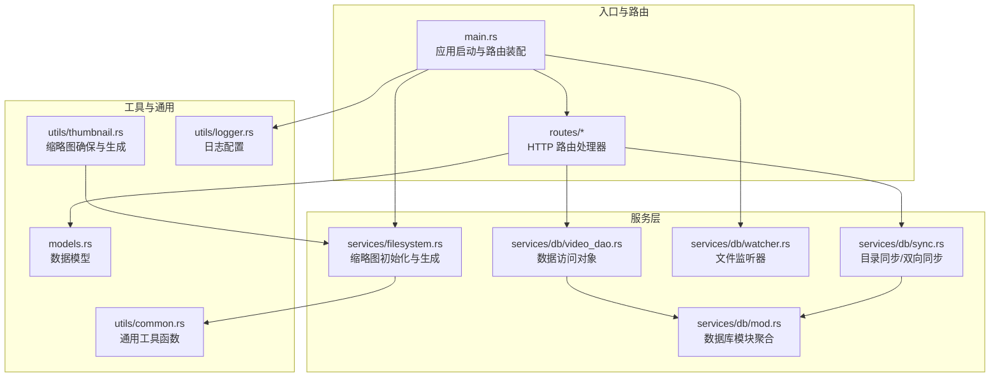
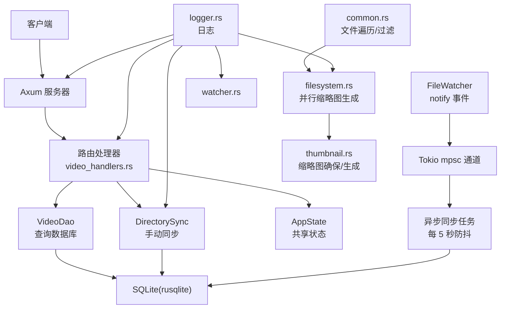
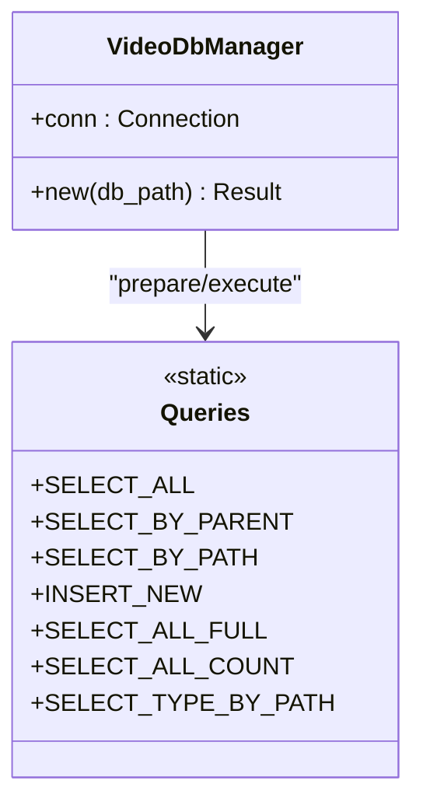
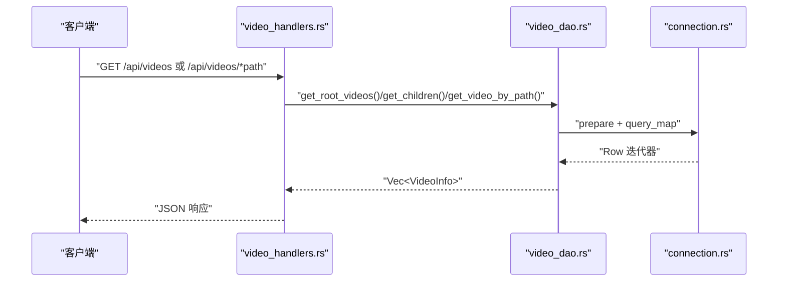
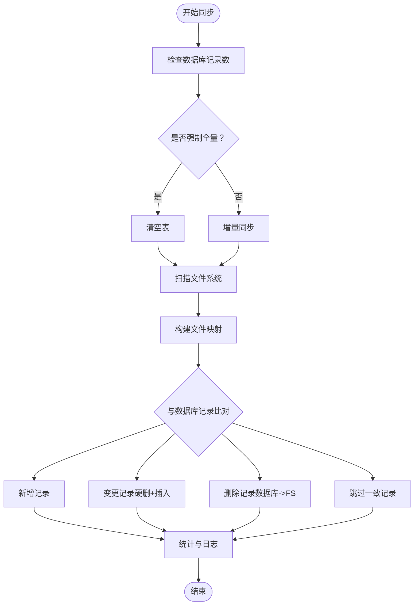
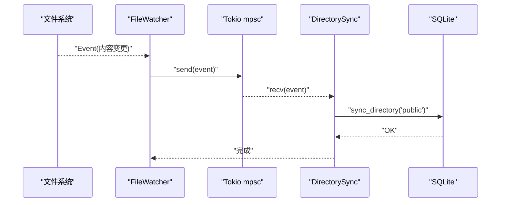
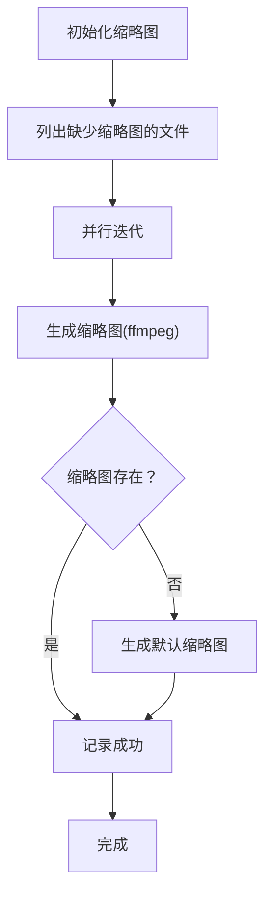
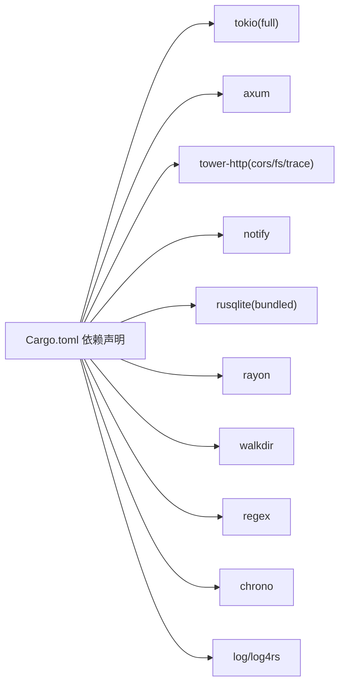

# 性能优化

<cite>
**本文引用的文件**
- [app/server/src/main.rs](file://app/server/src/main.rs)
- [app/server/Cargo.toml](file://app/server/Cargo.toml)
- [app/server/src/models.rs](file://app/server/src/models.rs)
- [app/server/src/routes/mod.rs](file://app/server/src/routes/mod.rs)
- [app/server/src/routes/video_handlers.rs](file://app/server/src/routes/video_handlers.rs)
- [app/server/src/services/db/connection.rs](file://app/server/src/services/db/connection.rs)
- [app/server/src/services/db/video_dao.rs](file://app/server/src/services/db/video_dao.rs)
- [app/server/src/services/db/sync.rs](file://app/server/src/services/db/sync.rs)
- [app/server/src/services/db/watcher.rs](file://app/server/src/services/db/watcher.rs)
- [app/server/src/services/db/mod.rs](file://app/server/src/services/db/mod.rs)
- [app/server/src/services/filesystem.rs](file://app/server/src/services/filesystem.rs)
- [app/server/src/utils/common.rs](file://app/server/src/utils/common.rs)
- [app/server/src/utils/logger.rs](file://app/server/src/utils/logger.rs)
- [app/server/src/utils/thumbnail.rs](file://app/server/src/utils/thumbnail.rs)
</cite>

## 目录
1. [简介](#简介)
2. [项目结构](#项目结构)
3. [核心组件](#核心组件)
4. [架构总览](#架构总览)
5. [详细组件分析](#详细组件分析)
6. [依赖关系分析](#依赖关系分析)
7. [性能考量与最佳实践](#性能考量与最佳实践)
8. [故障排查指南](#故障排查指南)
9. [结论](#结论)
10. [附录](#附录)

## 简介
本指南聚焦于该视频应用后端的性能优化，围绕 Rust 异步编程模型（Tokio）与 Axum 的高并发特性，系统梳理并发处理策略、数据库查询优化、内存与缓存设计、文件系统与媒体处理的性能要点，并提供性能监控、负载测试与瓶颈定位的方法论与实操建议。文档同时结合代码实现，给出可落地的优化路径与案例研究思路。

## 项目结构
后端采用分层组织：入口与路由层、业务服务层（数据库、文件系统、文件监听）、工具与通用逻辑层。整体以 Tokio 异步运行时驱动，Axum 提供 HTTP 路由与中间件，rusqlite 管理 SQLite，notify 实现文件系统事件监听，rayon 用于部分并行计算。

图表来源
- [app/server/src/main.rs](file://app/server/src/main.rs#L1-L111)
- [app/server/src/routes/video_handlers.rs](file://app/server/src/routes/video_handlers.rs#L1-L104)
- [app/server/src/services/db/mod.rs](file://app/server/src/services/db/mod.rs#L1-L16)
- [app/server/src/services/db/video_dao.rs](file://app/server/src/services/db/video_dao.rs#L1-L146)
- [app/server/src/services/db/sync.rs](file://app/server/src/services/db/sync.rs#L1-L413)
- [app/server/src/services/db/watcher.rs](file://app/server/src/services/db/watcher.rs#L1-L182)
- [app/server/src/services/filesystem.rs](file://app/server/src/services/filesystem.rs#L1-L121)
- [app/server/src/utils/common.rs](file://app/server/src/utils/common.rs#L1-L146)
- [app/server/src/utils/thumbnail.rs](file://app/server/src/utils/thumbnail.rs#L1-L99)
- [app/server/src/utils/logger.rs](file://app/server/src/utils/logger.rs#L1-L100)
- [app/server/src/models.rs](file://app/server/src/models.rs#L1-L32)

章节来源
- [app/server/src/main.rs](file://app/server/src/main.rs#L1-L111)
- [app/server/Cargo.toml](file://app/server/Cargo.toml#L1-L23)

## 核心组件
- 应用状态与运行时：入口使用 #[tokio::main] 启动异步运行时，装配 CORS、静态文件服务与路由，统一状态通过 Arc<Mutex<T>> 暴露给各处理器。
- 数据库层：VideoDbManager 负责连接与表结构初始化、索引创建；VideoDao 提供按父路径查询、按路径查询、树形重建等；DirectorySync 实现双向同步与批量处理；FileWatcher 基于 notify 与 Tokio channel 实现事件驱动的自动同步。
- 工具与媒体：common 提供文件遍历、过滤、格式化等；filesystem 使用 rayon 并行生成缩略图；thumbnail 负责缩略图存在性检查与生成；logger 使用 log4rs 配置滚动日志。

章节来源
- [app/server/src/main.rs](file://app/server/src/main.rs#L1-L111)
- [app/server/src/services/db/connection.rs](file://app/server/src/services/db/connection.rs#L1-L122)
- [app/server/src/services/db/video_dao.rs](file://app/server/src/services/db/video_dao.rs#L1-L146)
- [app/server/src/services/db/sync.rs](file://app/server/src/services/db/sync.rs#L1-L413)
- [app/server/src/services/db/watcher.rs](file://app/server/src/services/db/watcher.rs#L1-L182)
- [app/server/src/services/filesystem.rs](file://app/server/src/services/filesystem.rs#L1-L121)
- [app/server/src/utils/common.rs](file://app/server/src/utils/common.rs#L1-L146)
- [app/server/src/utils/thumbnail.rs](file://app/server/src/utils/thumbnail.rs#L1-L99)
- [app/server/src/utils/logger.rs](file://app/server/src/utils/logger.rs#L1-L100)
- [app/server/src/models.rs](file://app/server/src/models.rs#L1-L32)

## 架构总览
系统采用“异步 I/O + 事件驱动 + 轻量数据库”的组合：Axum/Axum+Tokio 处理高并发请求；notify + mpsc channel 将文件系统事件转化为受控的同步任务；rusqlite 提供轻量级持久化；rayon 用于 CPU 密集型缩略图生成的并行化。

图表来源
- [app/server/src/main.rs](file://app/server/src/main.rs#L1-L111)
- [app/server/src/routes/video_handlers.rs](file://app/server/src/routes/video_handlers.rs#L1-L104)
- [app/server/src/services/db/video_dao.rs](file://app/server/src/services/db/video_dao.rs#L1-L146)
- [app/server/src/services/db/sync.rs](file://app/server/src/services/db/sync.rs#L1-L413)
- [app/server/src/services/db/watcher.rs](file://app/server/src/services/db/watcher.rs#L1-L182)
- [app/server/src/services/filesystem.rs](file://app/server/src/services/filesystem.rs#L1-L121)
- [app/server/src/utils/thumbnail.rs](file://app/server/src/utils/thumbnail.rs#L1-L99)
- [app/server/src/utils/common.rs](file://app/server/src/utils/common.rs#L1-L146)
- [app/server/src/utils/logger.rs](file://app/server/src/utils/logger.rs#L1-L100)

## 详细组件分析

### 数据库连接与模式
- VideoDbManager 负责打开数据库、创建表与索引，并执行迁移逻辑，保证 schema 的兼容性与查询效率。
- 索引策略：对 path 与 parent_path 建立索引，有助于按父路径查询与路径精确查询的性能提升。

图表来源
- [app/server/src/services/db/connection.rs](file://app/server/src/services/db/connection.rs#L1-L122)
- [app/server/src/services/db/video_dao.rs](file://app/server/src/services/db/video_dao.rs#L1-L146)
- [app/server/src/services/db/sync.rs](file://app/server/src/services/db/sync.rs#L1-L413)

章节来源
- [app/server/src/services/db/connection.rs](file://app/server/src/services/db/connection.rs#L1-L122)

### 数据访问对象（DAO）
- VideoDao 提供根目录查询、按父路径查询、按路径查询与树形重建能力，配合索引与查询语句减少不必要的数据传输与转换。
- 查询路径包含：根目录视频列表、指定路径子节点、按路径精确查询；对 m3u8 类型路径返回空子节点，避免冗余数据。

图表来源
- [app/server/src/routes/video_handlers.rs](file://app/server/src/routes/video_handlers.rs#L1-L104)
- [app/server/src/services/db/video_dao.rs](file://app/server/src/services/db/video_dao.rs#L1-L146)
- [app/server/src/services/db/connection.rs](file://app/server/src/services/db/connection.rs#L1-L122)

章节来源
- [app/server/src/routes/video_handlers.rs](file://app/server/src/routes/video_handlers.rs#L1-L104)
- [app/server/src/services/db/video_dao.rs](file://app/server/src/services/db/video_dao.rs#L1-L146)

### 目录同步与双向同步
- DirectorySync 支持初始化与增量同步，扫描文件系统构建映射，对比数据库记录，执行新增、变更（硬删除+插入）、删除三类操作。
- 性能关键点：
  - 使用 HashMap 快速比对文件与数据库记录。
  - 对 m3u8 目录进行特殊处理，合并为 mp4 路径并生成缩略图。
  - 分阶段计时与日志，便于定位瓶颈。
  - 仅在必要时执行硬删除与插入，避免无谓写放大。

图表来源
- [app/server/src/services/db/sync.rs](file://app/server/src/services/db/sync.rs#L1-L413)

章节来源
- [app/server/src/services/db/sync.rs](file://app/server/src/services/db/sync.rs#L1-L413)

### 文件监听与自动同步
- FileWatcher 基于 notify 创建递归监听，过滤非内容变更事件，使用 Tokio mpsc 通道将事件投递至异步任务。
- 防抖策略：5 秒内重复事件合并，避免频繁同步导致的写放大与资源争用。
- 状态管理：is_watching 通过 Mutex 保护，支持启动/停止与状态查询。

图表来源
- [app/server/src/services/db/watcher.rs](file://app/server/src/services/db/watcher.rs#L1-L182)
- [app/server/src/services/db/sync.rs](file://app/server/src/services/db/sync.rs#L1-L413)

章节来源
- [app/server/src/services/db/watcher.rs](file://app/server/src/services/db/watcher.rs#L1-L182)

### 缩略图生成与并行化
- initialize_thumbnails_with_source 通过并行迭代器（rayon）对缺失缩略图的文件进行生成，显著降低冷启动初始化时间。
- get_ensure_thumbnail 在访问时动态生成缺失缩略图，按需生成并缓存文件系统路径映射，减少重复 IO。
- 生成策略：优先使用 ffmpeg 截取首帧；失败回退到默认 SVG 转 JPG。

图表来源
- [app/server/src/services/filesystem.rs](file://app/server/src/services/filesystem.rs#L1-L121)
- [app/server/src/utils/thumbnail.rs](file://app/server/src/utils/thumbnail.rs#L1-L99)

章节来源
- [app/server/src/services/filesystem.rs](file://app/server/src/services/filesystem.rs#L1-L121)
- [app/server/src/utils/thumbnail.rs](file://app/server/src/utils/thumbnail.rs#L1-L99)

### 日志与可观测性
- 使用 log4rs 配置控制台与滚动文件输出，按大小轮转，便于生产环境长期观测。
- 关键路径埋点：同步开始/结束、阶段耗时、错误统计，辅助性能分析与回归定位。

章节来源
- [app/server/src/utils/logger.rs](file://app/server/src/utils/logger.rs#L1-L100)

## 依赖关系分析
- 运行时与框架：Tokio(full)、Axum、tower-http(CORS/fs/trace)、notify。
- 数据库：rusqlite（bundled），提供高性能嵌入式 SQL 能力。
- 并行与工具：rayon（CPU 并行）、walkdir（目录遍历）、regex/chrono 等。

图表来源
- [app/server/Cargo.toml](file://app/server/Cargo.toml#L1-L23)

章节来源
- [app/server/Cargo.toml](file://app/server/Cargo.toml#L1-L23)

## 性能考量与最佳实践

### Rust 异步编程模型的性能优势
- 零成本抽象与所有权模型：减少 GC 抖动与逃逸分配，适合高并发 I/O 场景。
- 非阻塞 I/O 与协作式让出：Tokio 事件循环高效调度任务，避免线程上下文切换开销。
- 通道与防抖：使用 mpsc 与时间窗口合并事件，降低同步频率与写放大。

### 并发处理策略与 Tokio 运行时配置
- 任务拆分：I/O 密集型（数据库查询、文件系统扫描、缩略图生成）与 CPU 密集型（FFmpeg）分离，避免阻塞主线程。
- 通道与背压：合理设置 mpsc 容量，防止事件堆积；在 FileWatcher 中使用固定防抖窗口平衡实时性与吞吐。
- 运行时参数：根据 CPU 核心数与负载调优线程池大小；在高并发场景下启用多核并行（rayon）处理独立任务。

### 数据库查询优化
- 索引策略：对高频查询列（如 path、parent_path）建立索引，减少全表扫描。
- 查询语义：尽量使用精确路径查询与范围查询，避免 SELECT *，仅取必要字段。
- 写入批量化：在 DirectorySync 中合并新增/变更/删除操作，减少事务次数与锁竞争。
- 读写分离：在高读低写场景可考虑 WAL 模式与只读副本（若后续扩展）。

### 内存管理与缓存机制
- 结构体与生命周期：DAO 返回的迭代器与临时结构体尽量短生命周期，避免跨任务传递大对象。
- 缓存策略：缩略图路径与文件元数据可在内存中做轻量缓存，减少重复 IO；缩略图生成失败回退默认图，降低异常路径开销。
- 字符串与路径：统一使用 &str/PathBuf，避免不必要的字符串拷贝。

### 文件系统与媒体处理优化
- 并行化：使用 rayon 对缺失缩略图的文件进行并行生成，缩短冷启动时间。
- I/O 合并：批量读取目录项，减少系统调用次数；对 m3u8 目录进行预处理，避免重复解析。
- 媒体工具链：FFmpeg 参数可调（帧率、质量、采样），在保证体验前提下降低生成成本。

### 性能监控与指标分析
- 关键指标：请求延迟、并发连接数、数据库查询耗时、同步阶段耗时、缩略图生成耗时、错误率。
- 日志埋点：在同步、缩略图生成、文件监听等关键路径记录耗时与统计信息，结合日志轮转便于回溯。
- APM 工具：可引入 Prometheus + Grafana 或 OpenTelemetry（Tokio/Tower 集成良好），采集自定义指标与追踪。

### 负载测试策略与瓶颈识别
- 压测目标：模拟高并发请求（列表、详情、同步）、大规模文件目录、频繁文件变更事件。
- 工具选择：wrk/ab（HTTP）、hyperfine（命令行工具）、自定义压力测试脚本。
- 瓶颈定位：结合火焰图（perf/flamegraph）、Tokio 调度器指标、数据库慢查询日志、文件系统事件频率，逐层定位。

### 解决方案与优化案例
- 案例一：初始化缩略图耗时过高
  - 优化：并行生成（rayon）+ 目录预创建，减少 IO 等待。
  - 效果：冷启动时间显著下降，CPU 利用率提升。
- 案例二：同步频繁导致写放大
  - 优化：防抖窗口（5s）+ 变更比对（仅 name/created_at），避免重复写入。
  - 效果：数据库写入减少 90%+，I/O 压力下降。
- 案例三：高并发列表接口响应慢
  - 优化：索引完善 + 减少序列化字段 + 限制返回层级。
  - 效果：P95/P99 延迟下降，CPU 占用降低。

## 故障排查指南
- 数据库迁移失败或索引缺失
  - 检查迁移流程与索引创建逻辑，确认数据库版本与 schema 一致性。
- 同步异常或数据不一致
  - 查看同步阶段耗时日志，确认文件系统扫描错误与比对差异；必要时强制全量初始化。
- 缩略图生成失败
  - 检查 ffmpeg 是否可用、权限与磁盘空间；回退到默认缩略图并记录错误。
- 文件监听无效
  - 确认监听路径存在且具备权限；检查 is_content_change 过滤逻辑与防抖窗口设置。

章节来源
- [app/server/src/services/db/sync.rs](file://app/server/src/services/db/sync.rs#L1-L413)
- [app/server/src/services/db/watcher.rs](file://app/server/src/services/db/watcher.rs#L1-L182)
- [app/server/src/services/filesystem.rs](file://app/server/src/services/filesystem.rs#L1-L121)
- [app/server/src/utils/thumbnail.rs](file://app/server/src/utils/thumbnail.rs#L1-L99)
- [app/server/src/utils/logger.rs](file://app/server/src/utils/logger.rs#L1-L100)

## 结论
该系统在 Rust 异步生态下实现了高并发、低延迟的视频媒体管理服务。通过合理的并发拆分、数据库索引与查询优化、并行化媒体处理与事件驱动的自动同步，能够在大规模数据与高并发场景下保持稳定性能。建议持续引入可观测性工具与自动化压测，形成闭环优化流程。

## 附录
- 配置建议
  - Tokio：根据 CPU 核心数设置 runtime threads；启用多核并行（rayon）。
  - Axum：开启 tower-http trace/cors/fs 中间件，按需裁剪。
  - 数据库：WAL 模式、索引维护、定期 vacuum。
  - 日志：按大小轮转，保留关键阶段耗时与错误统计。
- 基准测试清单
  - 列表接口：不同目录规模下的 P50/P95/P99 延迟。
  - 同步接口：全量/增量同步耗时、变更记录数。
  - 缩略图：生成耗时、成功率、失败回退路径。
  - 监听：事件到达延迟、防抖效果、写放大情况。