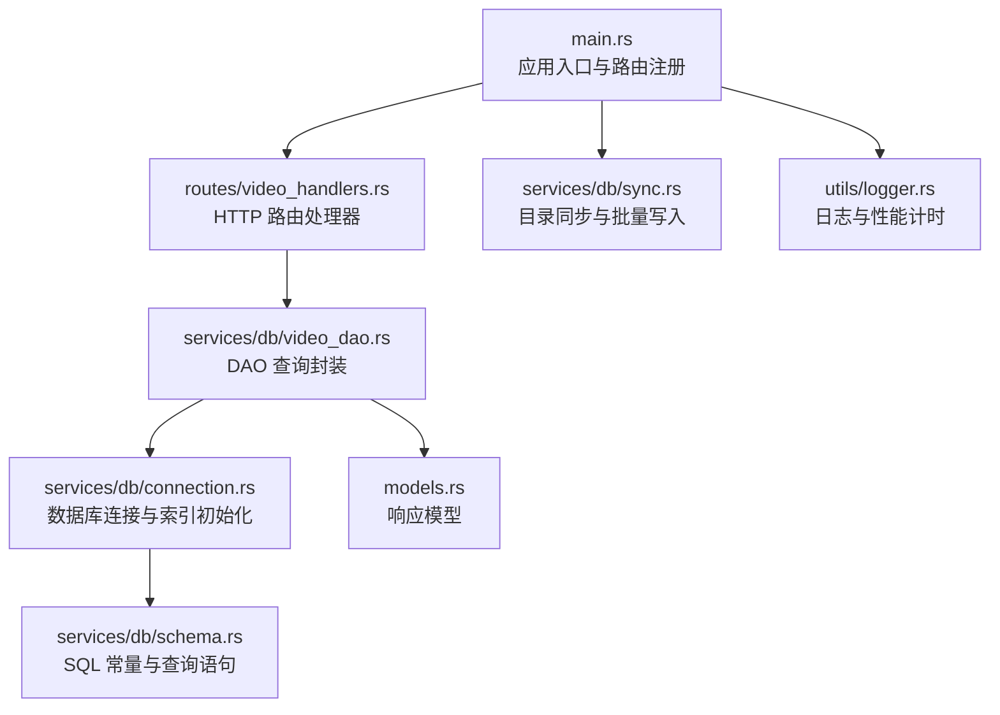
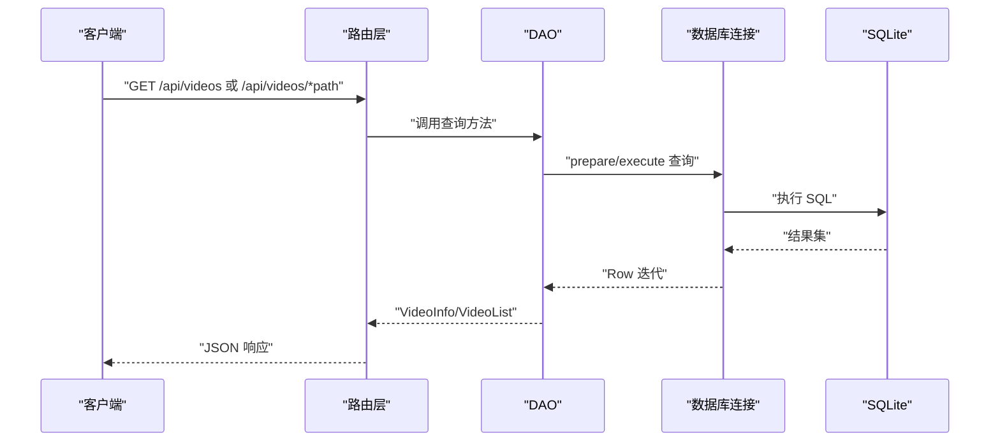
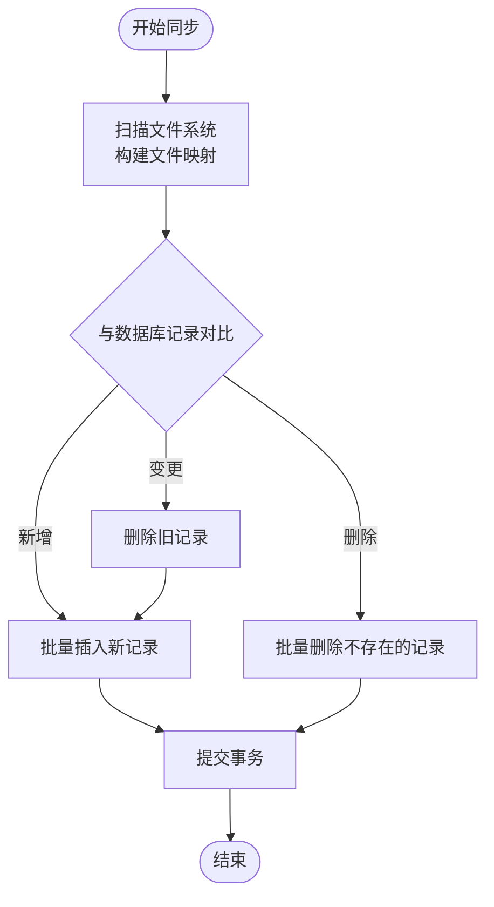
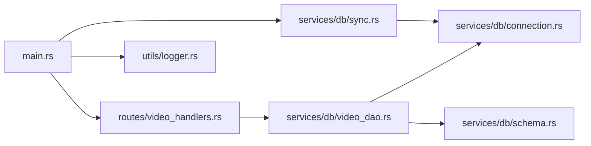

# 数据库性能优化

<cite>
**本文引用的文件**
- [main.rs](file://app/server/src/main.rs)
- [routes/video_handlers.rs](file://app/server/src/routes/video_handlers.rs)
- [services/db/connection.rs](file://app/server/src/services/db/connection.rs)
- [services/db/schema.rs](file://app/server/src/services/db/schema.rs)
- [services/db/video_dao.rs](file://app/server/src/services/db/video_dao.rs)
- [services/db/sync.rs](file://app/server/src/services/db/sync.rs)
- [Cargo.toml](file://app/server/Cargo.toml)
- [utils/logger.rs](file://app/server/src/utils/logger.rs)
- [models.rs](file://app/server/src/models.rs)
</cite>

## 目录
1. [简介](#简介)
2. [项目结构](#项目结构)
3. [核心组件](#核心组件)
4. [架构总览](#架构总览)
5. [详细组件分析](#详细组件分析)
6. [依赖关系分析](#依赖关系分析)
7. [性能考量](#性能考量)
8. [故障排查指南](#故障排查指南)
9. [结论](#结论)
10. [附录](#附录)

## 简介
本指南围绕 SQLite 在该视频媒体库项目中的性能优化展开，结合现有代码实现，系统性地给出索引设计、查询计划分析、连接池与事务管理、批量操作与预编译语句、表结构优化、慢查询日志与瓶颈识别，以及可复现的性能对比与评估方法。目标是帮助开发者在不改变业务逻辑的前提下，显著提升查询与同步性能，并建立可持续的性能监控与优化流程。

## 项目结构
后端采用 Rust + Axum，数据库使用 SQLite（rusqlite）。应用启动时初始化数据库、执行目录同步，并通过路由暴露视频列表与详情查询；DAO 层封装查询；同步器负责全量/增量扫描与双向一致性维护；日志模块提供运行期性能指标输出。

图表来源
- [main.rs](file://app/server/src/main.rs#L1-L111)
- [routes/video_handlers.rs](file://app/server/src/routes/video_handlers.rs#L1-L104)
- [services/db/connection.rs](file://app/server/src/services/db/connection.rs#L1-L122)
- [services/db/schema.rs](file://app/server/src/services/db/schema.rs#L1-L42)
- [services/db/video_dao.rs](file://app/server/src/services/db/video_dao.rs#L1-L146)
- [services/db/sync.rs](file://app/server/src/services/db/sync.rs#L1-L413)
- [utils/logger.rs](file://app/server/src/utils/logger.rs#L1-L100)
- [models.rs](file://app/server/src/models.rs#L1-L32)

章节来源
- [main.rs](file://app/server/src/main.rs#L1-L111)
- [Cargo.toml](file://app/server/Cargo.toml#L1-L23)

## 核心组件
- 数据库连接与初始化：负责建表、索引创建与迁移。
- DAO 层：封装常用查询（根目录视频、按父路径查询、按路径查询、树形重建）。
- 同步器：全量/增量扫描文件系统，进行双向一致性维护，包含大量批量写入与删除。
- 路由层：对外提供视频列表与详情查询接口。
- 日志与计时：在关键路径输出耗时，便于性能分析。

章节来源
- [services/db/connection.rs](file://app/server/src/services/db/connection.rs#L1-L122)
- [services/db/video_dao.rs](file://app/server/src/services/db/video_dao.rs#L1-L146)
- [services/db/sync.rs](file://app/server/src/services/db/sync.rs#L1-L413)
- [routes/video_handlers.rs](file://app/server/src/routes/video_handlers.rs#L1-L104)
- [utils/logger.rs](file://app/server/src/utils/logger.rs#L1-L100)

## 架构总览
应用通过路由触发 DAO 查询，DAO 通过 rusqlite 的 Connection 执行 SQL；同步器在后台进行批量写入与删除，期间会多次 prepare 与 execute。整体采用单连接模式，通过 Arc<Mutex<>> 在多任务间共享。

图表来源
- [routes/video_handlers.rs](file://app/server/src/routes/video_handlers.rs#L1-L104)
- [services/db/video_dao.rs](file://app/server/src/services/db/video_dao.rs#L1-L146)
- [services/db/connection.rs](file://app/server/src/services/db/connection.rs#L1-L122)

## 详细组件分析

### 数据库连接与索引设计
- 建表字段覆盖媒体元信息，主键自增，path 字段唯一，parent_path 用于层级组织。
- 已创建 path 与 parent_path 两个索引，有助于按路径查询与按父目录分组查询。
- 迁移逻辑自动清理历史列并重建索引，保证结构演进的平滑性。

优化建议
- 为高频过滤字段（如 type、created_at）考虑复合索引，减少排序与过滤成本。
- 将 last_modified 设为索引，配合增量同步策略可显著降低扫描范围。
- 对 parent_path 建立索引已具备，但需确保查询条件始终命中该索引（避免函数包裹导致失效）。

章节来源
- [services/db/connection.rs](file://app/server/src/services/db/connection.rs#L1-L122)
- [services/db/schema.rs](file://app/server/src/services/db/schema.rs#L1-L42)

### 查询封装与执行效率
- 根目录查询与按父路径查询均使用参数化查询，避免拼接与注入风险。
- 树形重建在内存中完成，DAO 返回扁平列表后由上层构建树，避免复杂 SQL 递归。
- 查询语句包含排序，建议评估是否必要（排序成本与前端渲染成本权衡）。

优化建议
- 对 SELECT_ALL 与 SELECT_BY_PARENT 的 ORDER BY 字段建立合适的索引组合，减少排序开销。
- 若前端仅展示部分字段，尽量裁剪 SELECT 列，减少 IO 与序列化成本。
- 对于树形构建，若数据量大，可考虑分页或延迟加载子节点。

章节来源
- [services/db/video_dao.rs](file://app/server/src/services/db/video_dao.rs#L1-L146)
- [services/db/schema.rs](file://app/server/src/services/db/schema.rs#L1-L42)

### 目录同步与批量操作
- 同步器在双向同步中执行大量 INSERT 与 DELETE，且多次 prepare/query，存在性能优化空间。
- 已有计时输出，便于定位瓶颈阶段。

优化建议
- 使用事务包裹批量写入，减少 WAL 切换与磁盘刷写次数。
- 合并重复的 prepare 调用，复用 Statement。
- 对 INSERT 使用“一次性多值插入”或批量绑定，减少 SQL 解析与执行次数。
- 对 DELETE 使用 IN 子句或临时表匹配，减少多次单条删除。

图表来源
- [services/db/sync.rs](file://app/server/src/services/db/sync.rs#L1-L413)

章节来源
- [services/db/sync.rs](file://app/server/src/services/db/sync.rs#L1-L413)

### 预编译语句与参数绑定
- 所有查询均使用 prepare + 参数绑定，符合安全与性能最佳实践。
- 建议在热点路径复用 Statement，避免重复解析 SQL。

章节来源
- [services/db/video_dao.rs](file://app/server/src/services/db/video_dao.rs#L1-L146)
- [services/db/schema.rs](file://app/server/src/services/db/schema.rs#L1-L42)

### 连接池与并发访问
- 当前实现为单连接 + Mutex 共享，适合小规模并发与开发调试。
- 生产环境建议引入连接池（如 r2d2 或 deadpool），并按读写比例拆分连接。

章节来源
- [main.rs](file://app/server/src/main.rs#L1-L111)
- [Cargo.toml](file://app/server/Cargo.toml#L1-L23)

### 事务管理最佳实践
- 同步器中涉及多次 execute，建议将批量写入放入单个事务中，失败回滚。
- 对于只读查询，保持短事务，避免长时间持有锁。

章节来源
- [services/db/sync.rs](file://app/server/src/services/db/sync.rs#L1-L413)

### 表结构优化建议
- 字段类型：path、type、codec、resolution、bitrate、subtitle、parent_path 等为文本，建议评估是否可改为更紧凑表示（如枚举映射、整型编码）。
- 约束设计：path 唯一约束合理；last_modified 可考虑加入 CHECK 约束确保非负。
- 新增字段：type、created_at、last_modified 建议建立索引；parent_path 已有索引。

章节来源
- [services/db/connection.rs](file://app/server/src/services/db/connection.rs#L1-L122)

### 慢查询日志与瓶颈识别
- 已在关键路径输出耗时（查询、扫描、处理、删除、总耗时），可用于定位瓶颈。
- 建议补充 SQLite 的慢查询日志配置（PRAGMA）与 EXPLAIN QUERY PLAN 分析。

章节来源
- [services/db/sync.rs](file://app/server/src/services/db/sync.rs#L1-L413)
- [utils/logger.rs](file://app/server/src/utils/logger.rs#L1-L100)

## 依赖关系分析
- 路由层依赖 DAO 与应用状态（共享数据库连接）。
- DAO 依赖连接与 SQL 常量。
- 同步器依赖连接与工具函数，负责批量写入。
- 日志模块提供统一输出。

图表来源
- [main.rs](file://app/server/src/main.rs#L1-L111)
- [routes/video_handlers.rs](file://app/server/src/routes/video_handlers.rs#L1-L104)
- [services/db/video_dao.rs](file://app/server/src/services/db/video_dao.rs#L1-L146)
- [services/db/connection.rs](file://app/server/src/services/db/connection.rs#L1-L122)
- [services/db/schema.rs](file://app/server/src/services/db/schema.rs#L1-L42)
- [services/db/sync.rs](file://app/server/src/services/db/sync.rs#L1-L413)
- [utils/logger.rs](file://app/server/src/utils/logger.rs#L1-L100)

章节来源
- [main.rs](file://app/server/src/main.rs#L1-L111)
- [routes/video_handlers.rs](file://app/server/src/routes/video_handlers.rs#L1-L104)
- [services/db/video_dao.rs](file://app/server/src/services/db/video_dao.rs#L1-L146)
- [services/db/connection.rs](file://app/server/src/services/db/connection.rs#L1-L122)
- [services/db/schema.rs](file://app/server/src/services/db/schema.rs#L1-L42)
- [services/db/sync.rs](file://app/server/src/services/db/sync.rs#L1-L413)
- [utils/logger.rs](file://app/server/src/utils/logger.rs#L1-L100)

## 性能考量
- 索引策略
  - 已有 path 与 parent_path 索引，建议为 type、created_at、last_modified 建立复合索引，覆盖常见过滤与排序场景。
  - 避免在 WHERE 子句中对索引列使用函数或表达式，防止索引失效。
- 批量写入
  - 使用事务包裹批量 INSERT/DELETE，减少磁盘刷写与 WAL 切换。
  - 复用 Statement，减少 SQL 解析成本。
- 查询优化
  - 仅选择需要的列，避免 SELECT *。
  - 对 ORDER BY 字段建立合适索引，必要时在应用层做分页。
- 连接与并发
  - 单连接 + Mutex 在高并发下成为瓶颈，建议引入连接池并按读写分离。
- 日志与监控
  - 借助现有计时输出，持续记录关键阶段耗时，形成性能基线。

## 故障排查指南
- 同步耗时异常
  - 检查扫描阶段与处理阶段的耗时日志，定位是 I/O 还是 CPU 密集。
  - 关注错误列表，确认权限与路径有效性。
- 查询缓慢
  - 使用 EXPLAIN QUERY PLAN 分析查询计划，确认索引是否被使用。
  - 检查 WHERE 与 ORDER BY 是否命中索引。
- 写入阻塞
  - 确认是否遗漏事务包裹，或是否存在长时间持有锁的查询。
- 数据不一致
  - 核对迁移逻辑与唯一约束，确保 path 唯一性。

章节来源
- [services/db/sync.rs](file://app/server/src/services/db/sync.rs#L1-L413)
- [utils/logger.rs](file://app/server/src/utils/logger.rs#L1-L100)

## 结论
当前实现已具备良好的基础：参数化查询、索引与迁移机制、清晰的日志计时。进一步优化的关键在于：引入连接池、批量事务、复用 Statement、为热点字段建立复合索引、裁剪查询列与分页策略。通过持续的性能基线与 EXPLAIN 分析，可稳步提升查询与同步效率。

## 附录

### 实际性能对比与评估方法
- 基线测量
  - 在相同硬件与数据规模下，分别测试“无事务批量写入”与“事务包裹批量写入”的总耗时与吞吐量。
  - 对比“全量扫描 + 排序”与“带索引过滤 + 限制返回列”的查询耗时。
- 指标收集
  - 记录扫描耗时、处理变更耗时、删除耗时、总耗时，形成对比表格。
- 优化验证
  - 引入连接池前后对比 QPS 与 P95 延迟。
  - 引入复合索引前后对比慢查询占比与平均响应时间。

### 优化前后效果评估示例（步骤说明）
- 步骤 1：准备测试数据集（N 条记录），记录初始查询与同步耗时。
- 步骤 2：实施索引优化（新增复合索引）与事务包裹批量写入。
- 步骤 3：再次执行相同测试，对比查询与同步耗时变化。
- 步骤 4：记录吞吐量与延迟指标，形成报告。