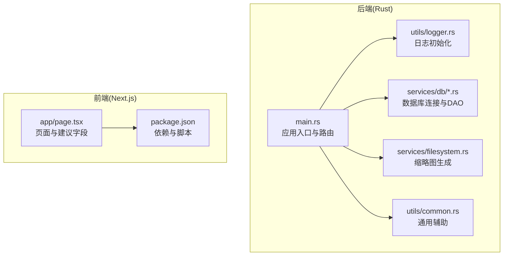
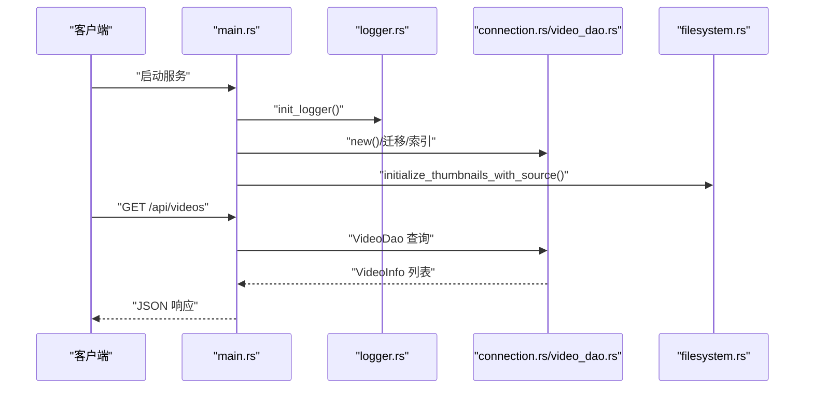
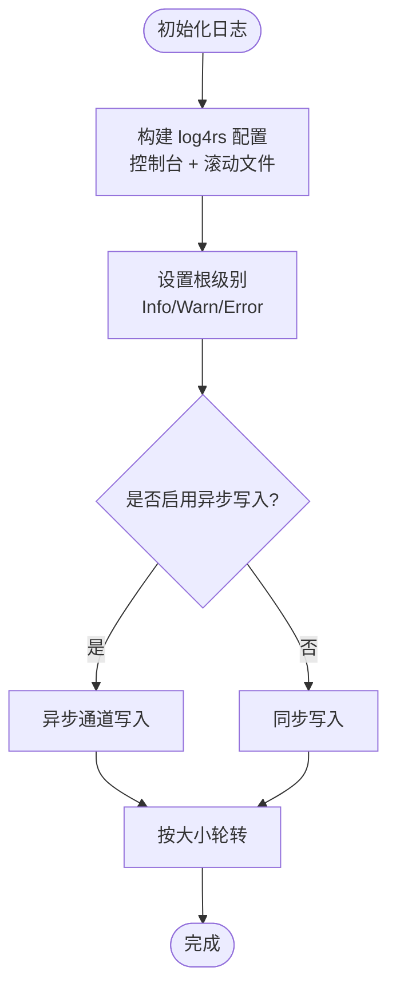
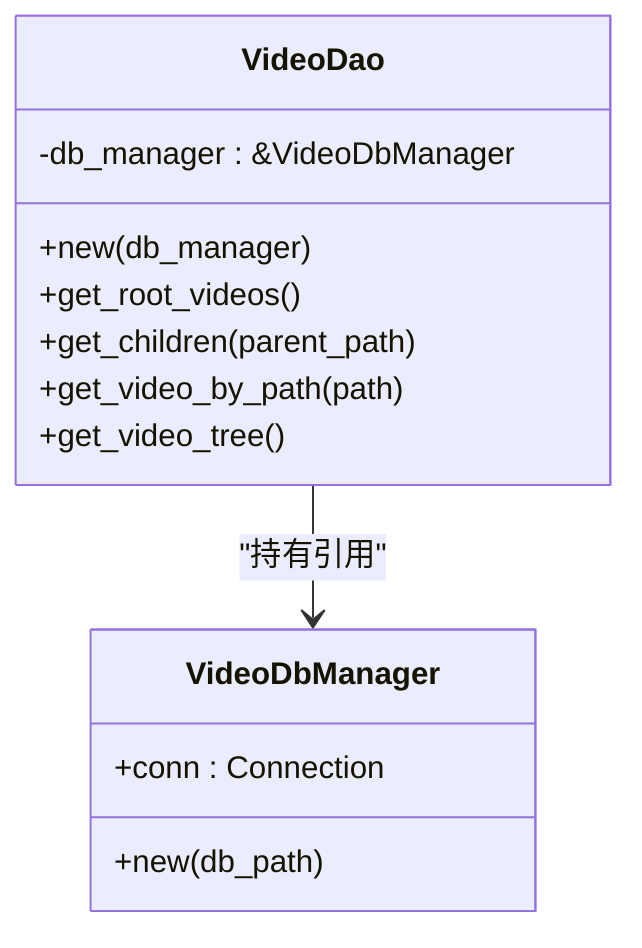
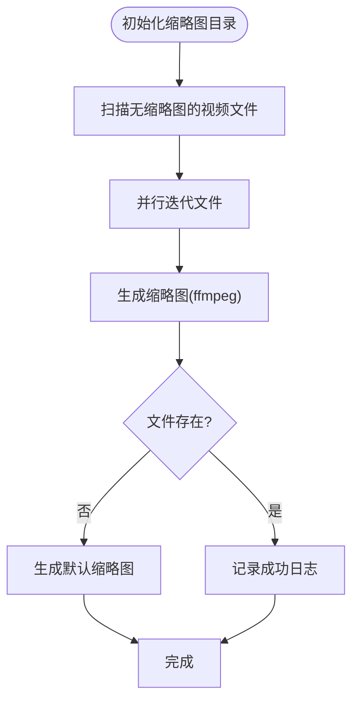
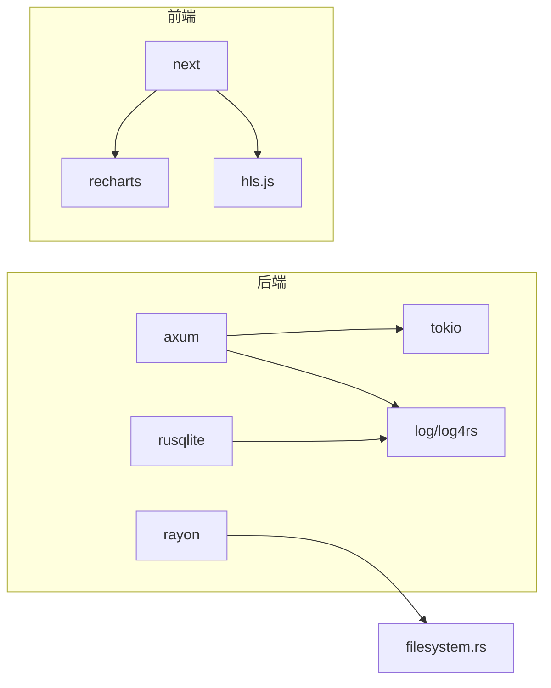

# 监控与性能分析

<cite>
**本文引用的文件**
- [app/server/src/utils/logger.rs](file://app/server/src/utils/logger.rs)
- [app/server/src/main.rs](file://app/server/src/main.rs)
- [app/server/Cargo.toml](file://app/server/Cargo.toml)
- [app/server/src/services/db/connection.rs](file://app/server/src/services/db/connection.rs)
- [app/server/src/services/db/video_dao.rs](file://app/server/src/services/db/video_dao.rs)
- [app/server/src/services/filesystem.rs](file://app/server/src/services/filesystem.rs)
- [app/server/src/utils/common.rs](file://app/server/src/utils/common.rs)
- [app/web/package.json](file://app/web/package.json)
- [app/web/app/page.tsx](file://app/web/app/page.tsx)
</cite>

## 目录
1. [简介](#简介)
2. [项目结构](#项目结构)
3. [核心组件](#核心组件)
4. [架构总览](#架构总览)
5. [详细组件分析](#详细组件分析)
6. [依赖关系分析](#依赖关系分析)
7. [性能考量](#性能考量)
8. [故障排查指南](#故障排查指南)
9. [结论](#结论)
10. [附录](#附录)

## 简介
本指南聚焦于该视频项目的监控与性能分析实践，围绕日志系统的性能影响与优化（异步写入、日志级别控制）、性能指标采集（CPU、内存、I/O延迟等）、性能分析工具使用（perf、valgrind、火焰图）、APM集成（分布式追踪与性能监控面板）、性能回归检测与自动化监控设置，以及从问题发现到解决的完整案例流程进行系统化梳理。文档同时结合仓库现有实现，给出可落地的优化建议与最佳实践。

## 项目结构
后端采用 Rust + Axum 的异步服务，前端采用 Next.js。日志系统基于 log4rs 实现，数据库使用 rusqlite，文件系统缩略图生成依赖 ffmpeg。整体结构清晰，便于在现有基础上扩展监控与性能分析能力。

**图表来源**
- [app/server/src/main.rs](file://app/server/src/main.rs#L1-L111)
- [app/server/src/utils/logger.rs](file://app/server/src/utils/logger.rs#L1-L100)
- [app/server/src/services/db/connection.rs](file://app/server/src/services/db/connection.rs#L1-L122)
- [app/server/src/services/db/video_dao.rs](file://app/server/src/services/db/video_dao.rs#L1-L146)
- [app/server/src/services/filesystem.rs](file://app/server/src/services/filesystem.rs#L1-L121)
- [app/server/src/utils/common.rs](file://app/server/src/utils/common.rs#L1-L146)
- [app/web/app/page.tsx](file://app/web/app/page.tsx#L1-L143)
- [app/web/package.json](file://app/web/package.json#L1-L74)

**章节来源**
- [app/server/src/main.rs](file://app/server/src/main.rs#L1-L111)
- [app/server/src/utils/logger.rs](file://app/server/src/utils/logger.rs#L1-L100)
- [app/server/src/services/db/connection.rs](file://app/server/src/services/db/connection.rs#L1-L122)
- [app/server/src/services/db/video_dao.rs](file://app/server/src/services/db/video_dao.rs#L1-L146)
- [app/server/src/services/filesystem.rs](file://app/server/src/services/filesystem.rs#L1-L121)
- [app/server/src/utils/common.rs](file://app/server/src/utils/common.rs#L1-L146)
- [app/web/app/page.tsx](file://app/web/app/page.tsx#L1-L143)
- [app/web/package.json](file://app/web/package.json#L1-L74)

## 核心组件
- 日志系统：基于 log4rs 的控制台与滚动文件输出，支持彩色编码与按大小轮转，当前根级别为 Info。
- 数据库层：rusqlite 连接管理与迁移逻辑，包含索引优化与查询映射。
- 文件系统与缩略图：并行扫描与生成缩略图，调用 ffmpeg，具备错误降级与默认缩略图生成。
- Web 页面：对后端返回字段提出建议，便于前端侧性能优化（如预加载、懒加载、尺寸与分辨率信息）。

**章节来源**
- [app/server/src/utils/logger.rs](file://app/server/src/utils/logger.rs#L1-L100)
- [app/server/src/services/db/connection.rs](file://app/server/src/services/db/connection.rs#L1-L122)
- [app/server/src/services/db/video_dao.rs](file://app/server/src/services/db/video_dao.rs#L1-L146)
- [app/server/src/services/filesystem.rs](file://app/server/src/services/filesystem.rs#L1-L121)
- [app/web/app/page.tsx](file://app/web/app/page.tsx#L1-L143)

## 架构总览
后端服务启动时初始化日志、数据库与文件监听器，提供视频列表、详情、手动同步与文件监听器启停等 API；前端页面建议后端返回更丰富的媒体元数据，以提升前端渲染与播放性能。

**图表来源**
- [app/server/src/main.rs](file://app/server/src/main.rs#L1-L111)
- [app/server/src/utils/logger.rs](file://app/server/src/utils/logger.rs#L1-L100)
- [app/server/src/services/db/connection.rs](file://app/server/src/services/db/connection.rs#L1-L122)
- [app/server/src/services/db/video_dao.rs](file://app/server/src/services/db/video_dao.rs#L1-L146)
- [app/server/src/services/filesystem.rs](file://app/server/src/services/filesystem.rs#L1-L121)

## 详细组件分析

### 日志系统与性能优化
- 当前实现要点
  - 控制台与滚动文件双输出，按大小轮转，根级别为 Info。
  - 彩色编码增强可读性，但会引入额外 CPU 开销。
- 性能影响与优化策略
  - 异步日志写入：将日志写入拆分为异步通道，避免阻塞请求处理线程。
  - 日志级别控制：在生产环境提升至 Warn 或更高，减少 Info/Debug 的高频写入。
  - 编码与格式：简化 PatternEncoder 格式，减少字符串拼接与时间格式化成本。
  - 轮转策略：增大单文件阈值或启用时间轮转，降低频繁轮转带来的系统调用次数。
  - 多目标输出：仅在调试阶段开启控制台输出，生产保留文件输出。

**图表来源**
- [app/server/src/utils/logger.rs](file://app/server/src/utils/logger.rs#L1-L100)

**章节来源**
- [app/server/src/utils/logger.rs](file://app/server/src/utils/logger.rs#L1-L100)

### 数据库层性能分析
- 连接与索引
  - 初始化时创建视频表与索引，有助于加速路径与父目录查询。
- 查询与映射
  - DAO 层使用 prepare + query_map，逐行映射为业务模型，注意避免 N+1 查询。
- 优化建议
  - 批量插入/更新：对批量导入场景使用事务包裹，减少 WAL 切换。
  - 索引覆盖：根据常见查询条件（如 parent_path、path）评估是否需要复合索引。
  - 迁移幂等：现有迁移逻辑已考虑旧表结构，建议在变更 schema 时保持幂等与最小变更。

**图表来源**
- [app/server/src/services/db/connection.rs](file://app/server/src/services/db/connection.rs#L1-L122)
- [app/server/src/services/db/video_dao.rs](file://app/server/src/services/db/video_dao.rs#L1-L146)

**章节来源**
- [app/server/src/services/db/connection.rs](file://app/server/src/services/db/connection.rs#L1-L122)
- [app/server/src/services/db/video_dao.rs](file://app/server/src/services/db/video_dao.rs#L1-L146)

### 文件系统与缩略图生成性能
- 并行处理
  - 使用 rayon 并行遍历与生成缩略图，显著缩短初始化时间。
- 外部命令调用
  - 通过 ffmpeg 生成缩略图，若失败则降级为默认 SVG 生成。
- 性能影响与优化
  - I/O 与 CPU：缩略图生成为 CPU 密集型任务，建议限制并发度或分批生成。
  - 失败降级：出现 ffmpeg 错误时生成默认缩略图，保证可用性。
  - 目录并发：多线程创建目录需注意竞态，可使用原子创建或加锁。

**图表来源**
- [app/server/src/services/filesystem.rs](file://app/server/src/services/filesystem.rs#L1-L121)

**章节来源**
- [app/server/src/services/filesystem.rs](file://app/server/src/services/filesystem.rs#L1-L121)
- [app/server/src/utils/common.rs](file://app/server/src/utils/common.rs#L1-L146)

### 前端性能建议与监控
- 字段建议
  - 建议后端返回 type、path、thumbnail、duration、resolution、size、bitrate 等字段，便于前端做预加载、懒加载与自适应播放。
- 性能优化方向
  - 渲染优化：利用分辨率与尺寸信息选择合适画质，减少不必要的重排与重绘。
  - 媒体加载：优先加载缩略图与低分辨率片段，再逐步提升质量。
  - 分析工具：使用浏览器性能面板、网络面板与 FPS 监控，定位卡顿与加载瓶颈。

**章节来源**
- [app/web/app/page.tsx](file://app/web/app/page.tsx#L1-L143)
- [app/web/package.json](file://app/web/package.json#L1-L74)

## 依赖关系分析
- 后端依赖
  - axum/tokio：异步运行时与 Web 框架
  - rusqlite：SQLite 客户端，支持捆绑编译
  - rayon：并行计算
  - log/log4rs：日志框架与配置
- 前端依赖
  - next：SSR/CSR 框架
  - recharts：可视化图表（可用于监控面板）
  - hls.js：HLS 播放

**图表来源**
- [app/server/Cargo.toml](file://app/server/Cargo.toml#L1-L23)
- [app/web/package.json](file://app/web/package.json#L1-L74)

**章节来源**
- [app/server/Cargo.toml](file://app/server/Cargo.toml#L1-L23)
- [app/web/package.json](file://app/web/package.json#L1-L74)

## 性能考量
- CPU 使用率
  - 缩略图生成为 CPU 密集型，可通过限制并行度或分批处理缓解峰值。
  - 日志编码与格式化会增加 CPU 开销，建议在生产关闭彩色编码与复杂格式。
- 内存占用
  - 查询映射与并行迭代需关注中间集合大小，避免 OOM。
  - ffmpeg 进程与临时文件需及时清理，防止磁盘与内存压力。
- I/O 延迟
  - 数据库读写与文件系统 I/O 是主要瓶颈，建议使用 SSD、合理索引与批量事务。
  - 日志轮转与文件写入频率过高会放大 I/O 延迟，应优化轮转策略。
- 线程与并发
  - rayon 默认使用系统线程池，需根据 CPU 核数与负载动态调整并行度。
  - tokio 事件循环与异步任务需避免长时间阻塞，必要时拆分为独立任务。

[本节为通用指导，不直接分析具体文件]

## 故障排查指南
- 日志级别过低导致性能下降
  - 现象：CPU 占用升高、磁盘写入频繁。
  - 措施：提升根级别至 Warn 或 Error，减少 Info/Debug 写入。
- 缩略图生成失败
  - 现象：ffmpeg 报错、缩略图缺失。
  - 措施：检查 ffmpeg 是否安装与权限，降级为默认缩略图并记录错误。
- 数据库查询慢
  - 现象：响应时间增长、锁等待。
  - 措施：确认索引是否生效，避免全表扫描；对批量操作使用事务。
- 前端播放卡顿
  - 现象：首帧延迟高、缓冲频繁。
  - 措施：提供分辨率与码率字段，前端按网络状况自适应；使用 recharts 监控播放指标。

**章节来源**
- [app/server/src/utils/logger.rs](file://app/server/src/utils/logger.rs#L1-L100)
- [app/server/src/services/filesystem.rs](file://app/server/src/services/filesystem.rs#L1-L121)
- [app/server/src/services/db/video_dao.rs](file://app/server/src/services/db/video_dao.rs#L1-L146)
- [app/web/app/page.tsx](file://app/web/app/page.tsx#L1-L143)

## 结论
通过在现有实现基础上引入异步日志、精细化日志级别控制、并行与限速的缩略图生成策略、数据库索引与事务优化，以及前端字段建议与可视化监控，可以有效降低 CPU 与 I/O 压力，提升整体吞吐与稳定性。后续可进一步接入 APM 工具与自动化回归监控，形成闭环的性能保障体系。

[本节为总结性内容，不直接分析具体文件]

## 附录

### 性能分析工具使用建议
- perf（Linux）
  - 用于采样 CPU 使用热点，识别热点函数与调用栈。
- valgrind（内存）
  - 用于检测内存泄漏与越界访问，适合在开发环境启用。
- 火焰图
  - 将 perf 采样结果可视化为火焰图，直观呈现 CPU 时间分布。

[本节为通用指导，不直接分析具体文件]

### APM 集成与监控面板
- 分布式追踪
  - 在请求链路中注入 TraceId，跨服务传递上下文，结合日志与指标统一检索。
- 性能监控面板
  - 使用 recharts 展示关键指标（P95/P99 延迟、错误率、吞吐），并与告警联动。

[本节为通用指导，不直接分析具体文件]

### 性能回归检测与自动化监控
- 回归检测
  - 在 CI 中加入基准测试与性能门禁，对比关键指标阈值。
- 自动化监控
  - 设置 Prometheus/Grafana 指标采集与告警规则，结合日志与追踪进行根因分析。

[本节为通用指导，不直接分析具体文件]

### 实际案例：从问题发现到解决
- 发现问题
  - 用户反馈视频列表加载缓慢，浏览器网络面板显示大量缩略图请求。
- 根因分析
  - 后端未返回缩略图 URL，前端一次性请求全部缩略图；缩略图生成为 CPU 密集型。
- 解决方案
  - 后端返回 thumbnail 字段；前端改为懒加载与占位图；后端限制缩略图并发生成。
- 验证与回归
  - 通过性能面板与日志级别控制验证效果，并在 CI 中加入回归门禁。

[本节为通用指导，不直接分析具体文件]