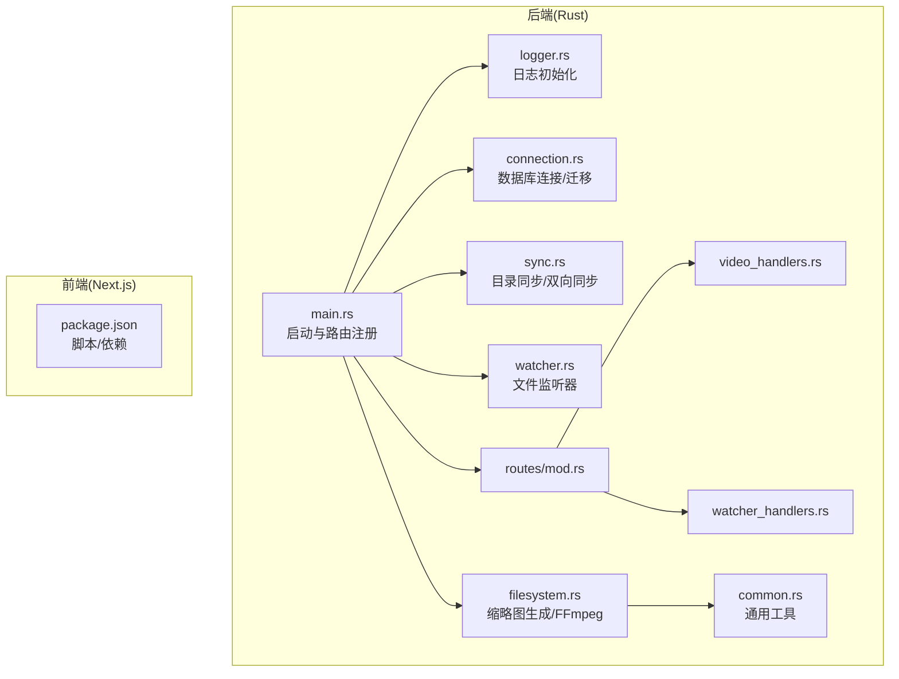
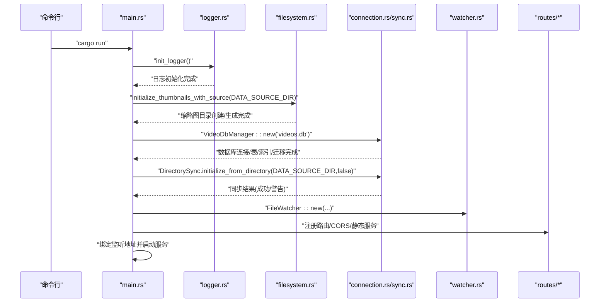
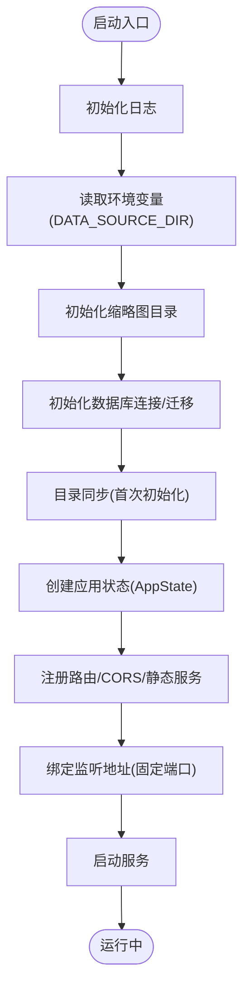
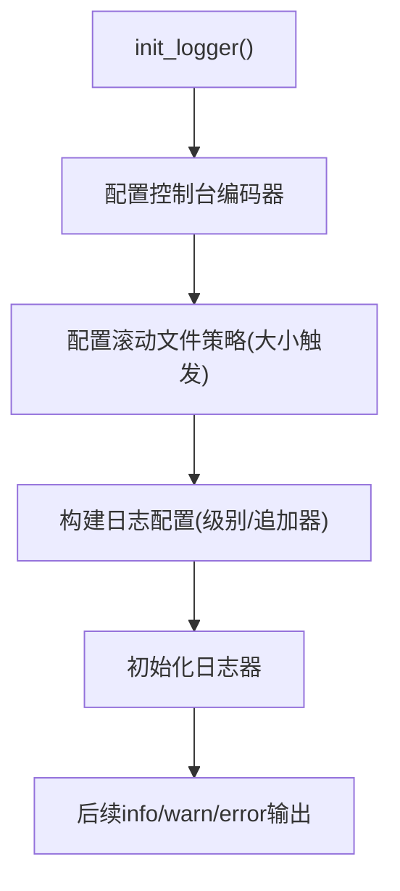
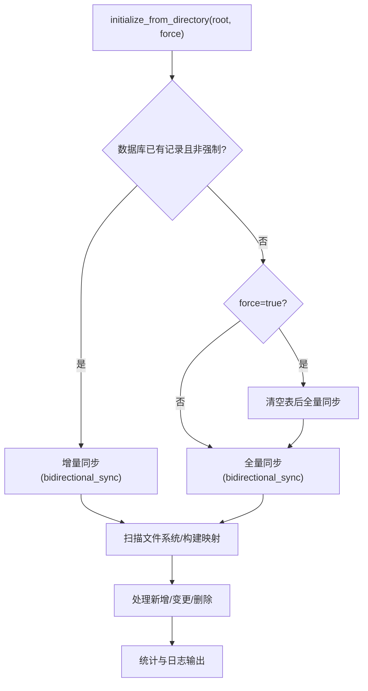
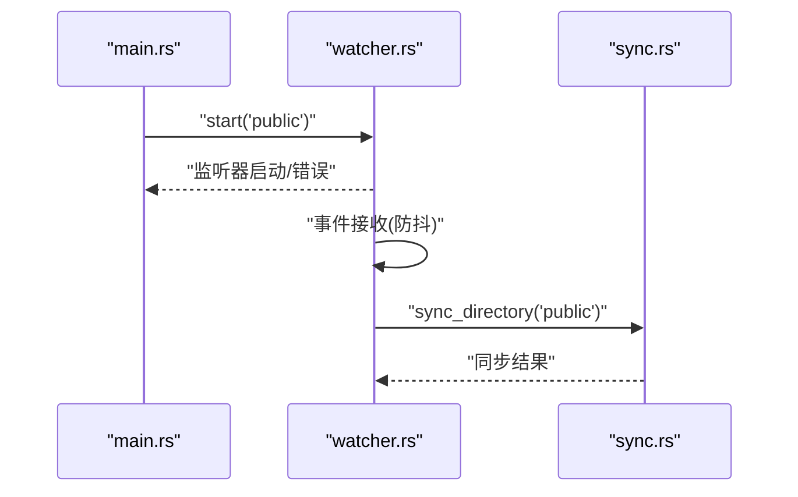
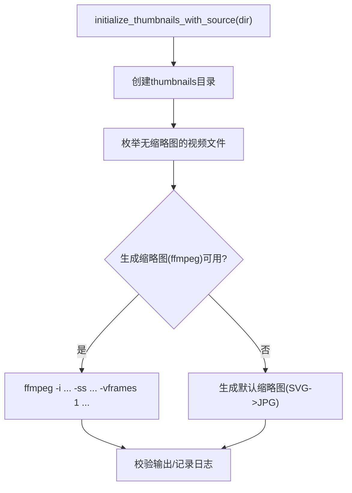
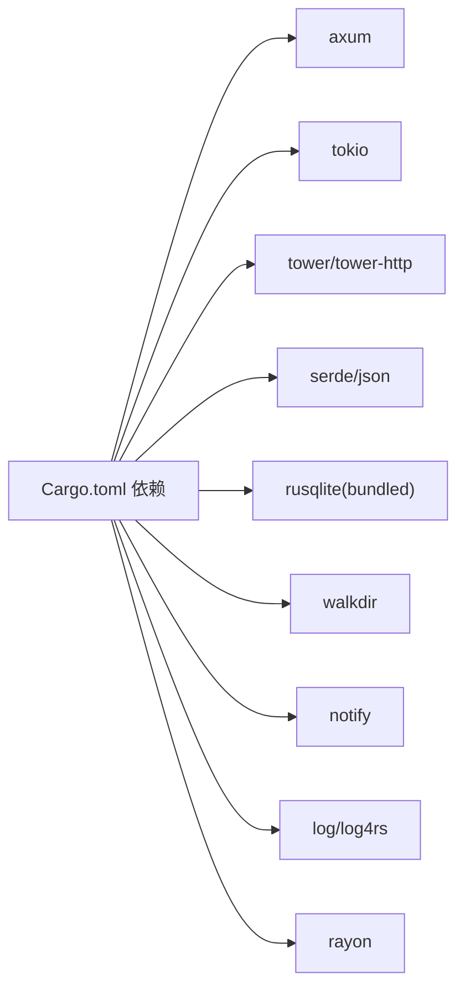

# 启动问题

<cite>
**本文引用的文件**
- [app/server/Cargo.toml](file://app/server/Cargo.toml)
- [app/server/src/main.rs](file://app/server/src/main.rs)
- [app/server/src/utils/logger.rs](file://app/server/src/utils/logger.rs)
- [app/server/src/services/db/connection.rs](file://app/server/src/services/db/connection.rs)
- [app/server/src/services/db/sync.rs](file://app/server/src/services/db/sync.rs)
- [app/server/src/services/db/watcher.rs](file://app/server/src/services/db/watcher.rs)
- [app/server/src/services/filesystem.rs](file://app/server/src/services/filesystem.rs)
- [app/server/src/utils/common.rs](file://app/server/src/utils/common.rs)
- [app/server/src/routes/mod.rs](file://app/server/src/routes/mod.rs)
- [app/server/src/routes/video_handlers.rs](file://app/server/src/routes/video_handlers.rs)
- [app/server/src/routes/watcher_handlers.rs](file://app/server/src/routes/watcher_handlers.rs)
- [app/server/.gitignore](file://app/server/.gitignore)
- [app/server/README.md](file://app/server/README.md)
- [README.md](file://README.md)
</cite>

## 目录
1. [简介](#简介)
2. [项目结构](#项目结构)
3. [核心组件](#核心组件)
4. [架构总览](#架构总览)
5. [详细组件分析](#详细组件分析)
6. [依赖关系分析](#依赖关系分析)
7. [性能注意事项](#性能注意事项)
8. [故障排除指南](#故障排除指南)
9. [结论](#结论)
10. [附录](#附录)

## 简介
本指南聚焦“启动问题”的系统性故障排除，覆盖服务器无法启动的常见情形：端口占用、依赖缺失、权限问题、配置错误、运行时异常等。结合项目实际代码与日志输出，提供可操作的诊断步骤、错误定位方法、日志分析技巧与跨平台排查要点。

## 项目结构
- 后端为 Rust 服务，基于 Axum/Tokio 提供 REST API 与静态文件服务，内置数据库初始化、目录扫描、缩略图生成与文件监听能力。
- 前端为 Next.js 应用，位于 app/web，与后端服务通过 /api/* 接口交互。
- 后端默认监听地址与端口在主程序中固定配置；数据库文件、缩略图目录、日志目录在运行时创建。

图表来源
- [app/server/src/main.rs](file://app/server/src/main.rs#L1-L111)
- [app/server/src/utils/logger.rs](file://app/server/src/utils/logger.rs#L1-L100)
- [app/server/src/services/db/connection.rs](file://app/server/src/services/db/connection.rs#L1-L122)
- [app/server/src/services/db/sync.rs](file://app/server/src/services/db/sync.rs#L1-L413)
- [app/server/src/services/db/watcher.rs](file://app/server/src/services/db/watcher.rs#L1-L182)
- [app/server/src/services/filesystem.rs](file://app/server/src/services/filesystem.rs#L1-L121)
- [app/server/src/utils/common.rs](file://app/server/src/utils/common.rs#L1-L146)
- [app/server/src/routes/mod.rs](file://app/server/src/routes/mod.rs#L1-L6)
- [app/server/src/routes/video_handlers.rs](file://app/server/src/routes/video_handlers.rs#L1-L104)
- [app/server/src/routes/watcher_handlers.rs](file://app/server/src/routes/watcher_handlers.rs#L1-L84)
- [app/server/Cargo.toml](file://app/server/Cargo.toml#L1-L23)
- [app/server/README.md](file://app/server/README.md#L138-L160)

章节来源
- [app/server/src/main.rs](file://app/server/src/main.rs#L1-L111)
- [app/server/README.md](file://app/server/README.md#L138-L160)

## 核心组件
- 应用入口与生命周期
  - 初始化日志、读取环境变量、初始化缩略图目录、建立数据库连接、执行目录同步、创建应用状态、注册路由与 CORS、绑定监听地址并启动服务。
- 日志系统
  - 控制台彩色输出与滚动文件日志，便于快速定位启动阶段的错误信息。
- 数据库与目录同步
  - 数据库连接与迁移、双向同步策略、扫描深度与过滤规则、错误收集与统计。
- 文件监听器
  - 基于事件队列的文件系统监听，防抖同步，仅对视频相关类型敏感。
- 缩略图生成
  - 依赖 FFmpeg，若不可用则回退到默认缩略图；缩略图目录在首次运行时创建。
- 路由与控制器
  - 视频列表、详情、手动同步、监听器启停与状态查询等 API。

章节来源
- [app/server/src/main.rs](file://app/server/src/main.rs#L1-L111)
- [app/server/src/utils/logger.rs](file://app/server/src/utils/logger.rs#L1-L100)
- [app/server/src/services/db/connection.rs](file://app/server/src/services/db/connection.rs#L1-L122)
- [app/server/src/services/db/sync.rs](file://app/server/src/services/db/sync.rs#L1-L413)
- [app/server/src/services/db/watcher.rs](file://app/server/src/services/db/watcher.rs#L1-L182)
- [app/server/src/services/filesystem.rs](file://app/server/src/services/filesystem.rs#L1-L121)
- [app/server/src/routes/video_handlers.rs](file://app/server/src/routes/video_handlers.rs#L1-L104)
- [app/server/src/routes/watcher_handlers.rs](file://app/server/src/routes/watcher_handlers.rs#L1-L84)

## 架构总览
后端启动流程的关键节点如下：

图表来源
- [app/server/src/main.rs](file://app/server/src/main.rs#L1-L111)
- [app/server/src/utils/logger.rs](file://app/server/src/utils/logger.rs#L1-L100)
- [app/server/src/services/filesystem.rs](file://app/server/src/services/filesystem.rs#L1-L121)
- [app/server/src/services/db/connection.rs](file://app/server/src/services/db/connection.rs#L1-L122)
- [app/server/src/services/db/sync.rs](file://app/server/src/services/db/sync.rs#L1-L413)
- [app/server/src/services/db/watcher.rs](file://app/server/src/services/db/watcher.rs#L1-L182)

## 详细组件分析

### 组件A：启动与路由注册
- 关键点
  - 日志初始化在最前，便于捕获早期错误。
  - 从环境变量读取数据源目录，若未设置则默认 public。
  - 初始化缩略图目录与数据库，随后进行目录同步。
  - 注册 API 路由与静态文件服务，启用 CORS。
  - 固定绑定监听地址与端口。
- 常见问题
  - 环境变量未设置导致目录不正确。
  - 数据库文件权限不足或被占用。
  - 监听端口被占用导致启动失败。

图表来源
- [app/server/src/main.rs](file://app/server/src/main.rs#L1-L111)

章节来源
- [app/server/src/main.rs](file://app/server/src/main.rs#L1-L111)

### 组件B：日志系统
- 关键点
  - 控制台彩色输出与滚动文件日志，按大小轮转。
  - 启动时打印关键信息，便于快速定位问题。
- 故障定位
  - 若无日志输出，优先检查日志初始化是否成功。
  - 查看日志文件是否被权限阻止写入。

图表来源
- [app/server/src/utils/logger.rs](file://app/server/src/utils/logger.rs#L1-L100)

章节来源
- [app/server/src/utils/logger.rs](file://app/server/src/utils/logger.rs#L1-L100)

### 组件C：数据库与目录同步
- 关键点
  - 数据库连接、表结构与索引创建、迁移逻辑。
  - 目录同步支持增量与全量，扫描深度受限，错误收集与统计。
- 故障定位
  - 数据库打开失败通常与权限或路径有关。
  - 同步失败需查看日志中的扫描错误与处理统计。

图表来源
- [app/server/src/services/db/sync.rs](file://app/server/src/services/db/sync.rs#L1-L413)
- [app/server/src/services/db/connection.rs](file://app/server/src/services/db/connection.rs#L1-L122)

章节来源
- [app/server/src/services/db/sync.rs](file://app/server/src/services/db/sync.rs#L1-L413)
- [app/server/src/services/db/connection.rs](file://app/server/src/services/db/connection.rs#L1-L122)

### 组件D：文件监听器
- 关键点
  - 使用事件通道与防抖策略，仅对视频相关类型敏感。
  - 监听路径不存在会导致启动失败。
- 故障定位
  - 启动时报路径不存在或监听失败，需检查监听路径与权限。

图表来源
- [app/server/src/services/db/watcher.rs](file://app/server/src/services/db/watcher.rs#L1-L182)
- [app/server/src/services/db/sync.rs](file://app/server/src/services/db/sync.rs#L1-L413)

章节来源
- [app/server/src/services/db/watcher.rs](file://app/server/src/services/db/watcher.rs#L1-L182)

### 组件E：缩略图生成与FFmpeg
- 关键点
  - 首次运行创建缩略图目录；尝试使用 FFmpeg 生成缩略图，失败则回退默认缩略图。
  - 依赖外部工具 FFmpeg，需确保其在 PATH 中可用。
- 故障定位
  - FFmpeg 不存在或不可执行会导致缩略图生成失败，但不影响服务启动。

图表来源
- [app/server/src/services/filesystem.rs](file://app/server/src/services/filesystem.rs#L1-L121)
- [app/server/src/utils/common.rs](file://app/server/src/utils/common.rs#L1-L146)

章节来源
- [app/server/src/services/filesystem.rs](file://app/server/src/services/filesystem.rs#L1-L121)
- [app/server/src/utils/common.rs](file://app/server/src/utils/common.rs#L1-L146)

## 依赖关系分析
- Rust 依赖集中在 app/server/Cargo.toml，包括 Web 框架、异步运行时、HTTP 中间件、序列化、SQLite、文件系统遍历、通知、日志、并行计算等。
- 后端与前端分别独立运行，后端提供 /api/* 与静态文件服务，前端通过 Next.js 脚本启动。

图表来源
- [app/server/Cargo.toml](file://app/server/Cargo.toml#L1-L23)

章节来源
- [app/server/Cargo.toml](file://app/server/Cargo.toml#L1-L23)

## 性能注意事项
- 目录扫描深度限制与过滤规则有助于减少 IO 压力。
- 并行处理缩略图生成与数据库操作，注意 CPU 与磁盘资源。
- 监听器采用防抖策略，避免频繁同步造成抖动。
- 生产环境建议使用 release 构建与合适的日志级别。

## 故障排除指南

### 一、启动失败：端口占用
- 现象
  - 启动时报错，提示地址已在使用或绑定失败。
- 诊断步骤
  - 确认监听端口是否被占用（默认固定端口）。
  - 在不同系统上使用 netstat/ss/lsof 等工具查看占用进程。
- 解决方案
  - 修改监听端口或释放占用端口。
  - 若需固定端口，确保系统权限允许绑定该端口。

章节来源
- [app/server/src/main.rs](file://app/server/src/main.rs#L92-L110)

### 二、启动失败：依赖缺失
- 现象
  - 编译阶段报错，提示找不到依赖或工具链版本不满足。
- 诊断步骤
  - 验证 Rust 工具链版本与 cargo 是否可用。
  - 检查 Cargo.toml 中依赖是否完整，网络代理是否正常。
- 解决方案
  - 安装/升级 Rust 工具链，清理缓存后重试构建。
  - 确保网络可访问 crates.io 或配置镜像源。

章节来源
- [README.md](file://README.md#L36-L68)
- [app/server/Cargo.toml](file://app/server/Cargo.toml#L1-L23)

### 三、启动失败：权限问题
- 现象
  - 数据库文件创建/打开失败；日志目录写入失败；缩略图目录创建失败。
- 诊断步骤
  - 检查工作目录权限，确认可读写数据库文件、日志目录与缩略图目录。
  - 检查 .gitignore 中的忽略项，确认不会误删关键目录。
- 解决方案
  - 以具备足够权限的用户运行，或调整目录权限与所有权。
  - 确保 public/thumbnails/logs 目录存在且可写。

章节来源
- [app/server/.gitignore](file://app/server/.gitignore#L1-L5)
- [app/server/src/main.rs](file://app/server/src/main.rs#L31-L47)
- [app/server/src/utils/logger.rs](file://app/server/src/utils/logger.rs#L73-L99)
- [app/server/src/services/filesystem.rs](file://app/server/src/services/filesystem.rs#L13-L20)

### 四、启动失败：数据库初始化异常
- 现象
  - 数据库连接失败、表创建失败、迁移失败。
- 诊断步骤
  - 查看数据库初始化日志与迁移过程输出。
  - 检查数据库文件路径与权限，确认 SQLite 可用。
- 解决方案
  - 更换数据库文件路径或修复权限。
  - 如需重置，可删除数据库文件后重启（注意数据丢失风险）。

章节来源
- [app/server/src/main.rs](file://app/server/src/main.rs#L38-L47)
- [app/server/src/services/db/connection.rs](file://app/server/src/services/db/connection.rs#L1-L122)

### 五、启动失败：目录同步失败
- 现象
  - 首次初始化目录同步报错或警告。
- 诊断步骤
  - 查看同步日志中的扫描错误与处理统计。
  - 确认数据源目录存在且可读。
- 解决方案
  - 修正目录权限与路径，必要时手动同步或重试。

章节来源
- [app/server/src/main.rs](file://app/server/src/main.rs#L42-L47)
- [app/server/src/services/db/sync.rs](file://app/server/src/services/db/sync.rs#L1-L413)

### 六、启动失败：FFmpeg 依赖缺失
- 现象
  - 缩略图生成失败，日志出现 FFmpeg 错误。
- 诊断步骤
  - 在命令行执行 ffmpeg -version，确认其可用。
- 解决方案
  - 安装 FFmpeg 并加入 PATH，或使用默认缩略图回退逻辑。

章节来源
- [app/server/src/services/filesystem.rs](file://app/server/src/services/filesystem.rs#L52-L78)

### 七、启动失败：监听器启动失败
- 现象
  - 启动监听器时报路径不存在或监听失败。
- 诊断步骤
  - 检查监听路径是否存在与可访问。
- 解决方案
  - 修正监听路径或创建目录后再启动。

章节来源
- [app/server/src/services/db/watcher.rs](file://app/server/src/services/db/watcher.rs#L41-L44)

### 八、启动脚本与日志分析技巧
- 启动脚本
  - 开发模式：在 app/server 目录执行 cargo run。
  - 生产模式：cargo build --release 后运行。
- 日志分析
  - 关注启动阶段的日志输出，尤其是数据库初始化、目录同步、监听器启动等关键节点。
  - 查看滚动日志文件，定位具体错误行与上下文。

章节来源
- [README.md](file://README.md#L103-L118)
- [app/server/README.md](file://app/server/README.md#L138-L160)
- [app/server/src/utils/logger.rs](file://app/server/src/utils/logger.rs#L73-L99)

### 九、不同操作系统下的排查要点
- Windows
  - 管理员权限运行，避免端口占用与权限不足。
  - 确认 PATH 中包含 FFmpeg。
- Linux/macOS
  - 使用 lsof/netstat 检查端口占用。
  - 确保用户对工作目录与数据库文件有读写权限。
- 通用
  - 使用 release 构建以获得更稳定的运行时表现。
  - 合理设置日志级别，避免生产环境产生过多日志。

章节来源
- [README.md](file://README.md#L36-L68)
- [app/server/README.md](file://app/server/README.md#L138-L160)

## 结论
启动问题通常源于端口占用、依赖缺失、权限不足或配置错误。通过日志初始化、数据库与目录同步的阶段性输出，可以快速定位问题所在。建议在开发与生产环境中分别采用 debug/release 构建，并完善日志与监控，以便高效排障与预防。

## 附录

### 常见错误代码与含义（基于代码行为）
- 数据库初始化失败
  - 可能原因：数据库文件路径不可写、SQLite 初始化失败、迁移异常。
  - 定位依据：数据库初始化日志与迁移过程输出。
- 目录同步失败
  - 可能原因：根目录不存在、扫描权限不足、文件系统访问异常。
  - 定位依据：同步日志中的扫描错误与处理统计。
- 监听器启动失败
  - 可能原因：监听路径不存在、系统权限不足、底层通知库初始化失败。
  - 定位依据：监听器启动错误信息与事件过滤逻辑。
- FFmpeg 依赖缺失
  - 可能原因：ffmpeg 不在 PATH 中或不可执行。
  - 定位依据：缩略图生成日志中的 FFmpeg 错误与默认缩略图回退。

章节来源
- [app/server/src/main.rs](file://app/server/src/main.rs#L38-L47)
- [app/server/src/services/db/sync.rs](file://app/server/src/services/db/sync.rs#L1-L413)
- [app/server/src/services/db/watcher.rs](file://app/server/src/services/db/watcher.rs#L1-L182)
- [app/server/src/services/filesystem.rs](file://app/server/src/services/filesystem.rs#L52-L78)