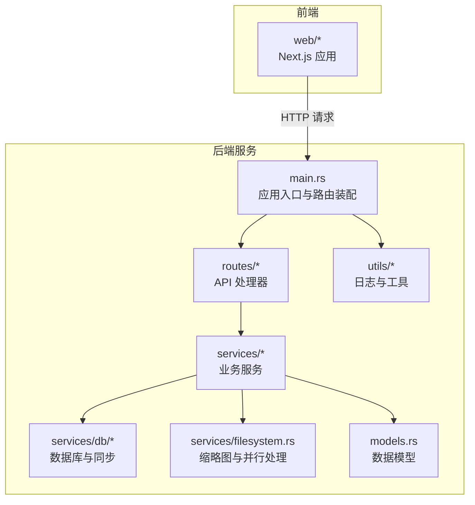
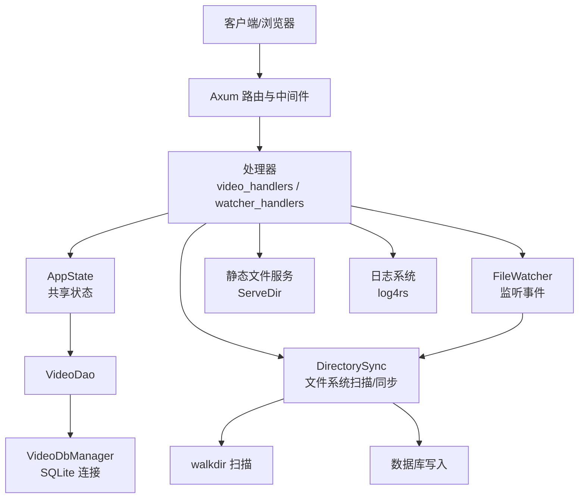
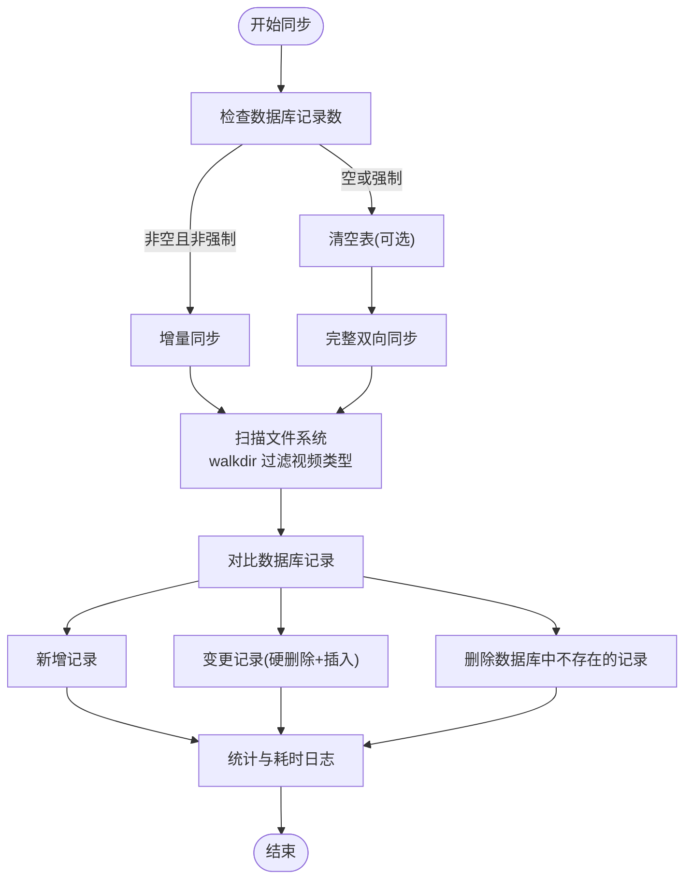
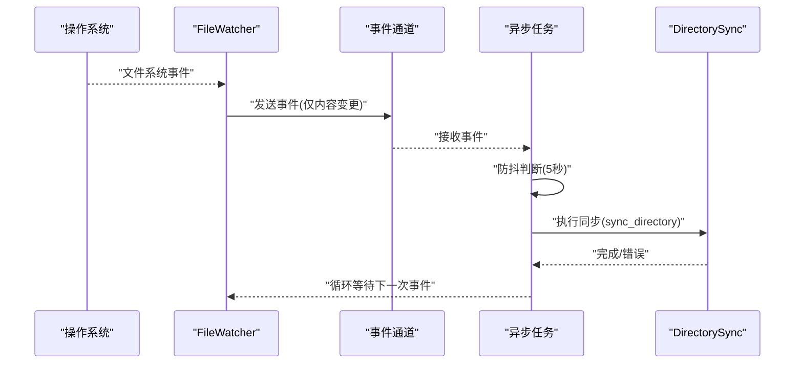
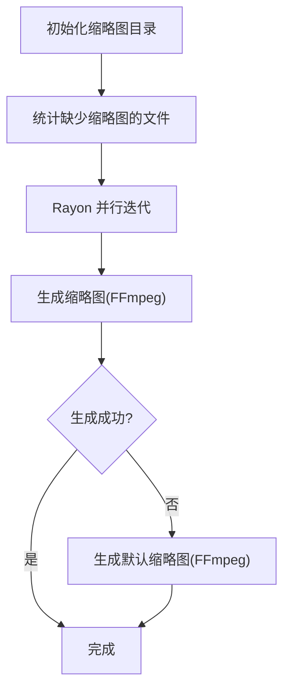
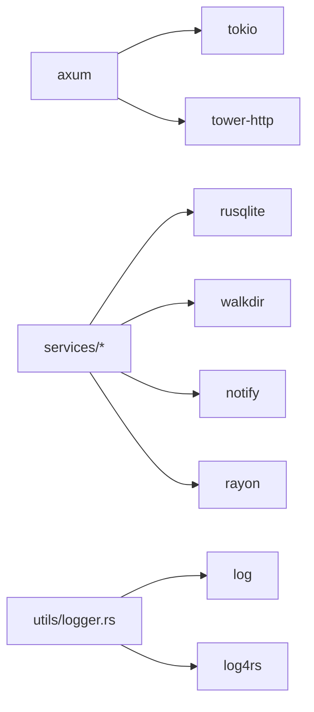

# 性能问题

<cite>
**本文引用的文件**
- [app/server/src/main.rs](file://app/server/src/main.rs)
- [app/server/Cargo.toml](file://app/server/Cargo.toml)
- [app/server/src/routes/video_handlers.rs](file://app/server/src/routes/video_handlers.rs)
- [app/server/src/routes/watcher_handlers.rs](file://app/server/src/routes/watcher_handlers.rs)
- [app/server/src/services/mod.rs](file://app/server/src/services/mod.rs)
- [app/server/src/services/db/mod.rs](file://app/server/src/services/db/mod.rs)
- [app/server/src/services/db/connection.rs](file://app/server/src/services/db/connection.rs)
- [app/server/src/services/db/video_dao.rs](file://app/server/src/services/db/video_dao.rs)
- [app/server/src/services/db/sync.rs](file://app/server/src/services/db/sync.rs)
- [app/server/src/services/db/watcher.rs](file://app/server/src/services/db/watcher.rs)
- [app/server/src/services/filesystem.rs](file://app/server/src/services/filesystem.rs)
- [app/server/src/utils/logger.rs](file://app/server/src/utils/logger.rs)
- [app/server/src/models.rs](file://app/server/src/models.rs)
</cite>

## 目录
1. [简介](#简介)
2. [项目结构](#项目结构)
3. [核心组件](#核心组件)
4. [架构总览](#架构总览)
5. [详细组件分析](#详细组件分析)
6. [依赖关系分析](#依赖关系分析)
7. [性能考量](#性能考量)
8. [故障排查指南](#故障排查指南)
9. [结论](#结论)
10. [附录](#附录)

## 简介
本指南聚焦于该视频媒体库服务的性能问题诊断与优化实践，覆盖以下方面：
- CPU 使用率过高：文件系统扫描、缩略图生成、数据库写入、并发任务调度
- 内存占用异常：大查询结果集、批量同步过程中的中间结构、日志滚动策略
- I/O 等待时间长：磁盘扫描、外部进程调用（FFmpeg）、数据库写入
- 并发处理：Tokio 异步运行时、通道与防抖、Rayon 并行处理
- 具体场景优化：文件系统扫描、数据库查询与索引、静态文件服务、缩略图生成
- 性能基准测试方法与建议

## 项目结构
后端采用 Rust + Axum + Tokio，前端为 Next.js。后端负责：
- API 路由与静态文件服务
- 数据库连接与访问层
- 文件系统扫描与目录同步
- 文件监听与自动同步
- 缩略图生成与默认占位图回退

图表来源
- [app/server/src/main.rs](file://app/server/src/main.rs#L1-L111)
- [app/server/src/routes/mod.rs](file://app/server/src/routes/mod.rs#L1-L6)
- [app/server/src/services/mod.rs](file://app/server/src/services/mod.rs#L1-L6)
- [app/server/src/services/db/mod.rs](file://app/server/src/services/db/mod.rs#L1-L16)
- [app/server/src/services/filesystem.rs](file://app/server/src/services/filesystem.rs#L1-L121)
- [app/server/src/utils/logger.rs](file://app/server/src/utils/logger.rs#L1-L100)
- [app/server/src/models.rs](file://app/server/src/models.rs#L1-L32)

章节来源
- [app/server/src/main.rs](file://app/server/src/main.rs#L1-L111)
- [app/server/Cargo.toml](file://app/server/Cargo.toml#L1-L23)

## 核心组件
- 应用状态与全局锁：共享数据库与文件监听器通过互斥锁持有，便于在多路由间复用，但需注意锁粒度与并发瓶颈
- 路由层：提供视频列表、详情、手动同步、文件监听启停与状态查询；同时挂载静态文件服务
- 数据库层：SQLite 连接管理、索引、DAO 查询、双向同步与文件监听器集成
- 文件系统层：缩略图初始化与并行生成、FFmpeg 调用、默认缩略图回退
- 工具与日志：彩色日志、滚动文件日志、性能计时

章节来源
- [app/server/src/main.rs](file://app/server/src/main.rs#L1-L111)
- [app/server/src/routes/video_handlers.rs](file://app/server/src/routes/video_handlers.rs#L1-L104)
- [app/server/src/routes/watcher_handlers.rs](file://app/server/src/routes/watcher_handlers.rs#L1-L84)
- [app/server/src/services/db/connection.rs](file://app/server/src/services/db/connection.rs#L1-L122)
- [app/server/src/services/db/video_dao.rs](file://app/server/src/services/db/video_dao.rs#L1-L146)
- [app/server/src/services/db/sync.rs](file://app/server/src/services/db/sync.rs#L1-L413)
- [app/server/src/services/db/watcher.rs](file://app/server/src/services/db/watcher.rs#L1-L182)
- [app/server/src/services/filesystem.rs](file://app/server/src/services/filesystem.rs#L1-L121)
- [app/server/src/utils/logger.rs](file://app/server/src/utils/logger.rs#L1-L100)
- [app/server/src/models.rs](file://app/server/src/models.rs#L1-L32)

## 架构总览
后端以 Axum 作为 Web 框架，Tokio 作为异步运行时，Rusqlite 访问 SQLite，Notify 实现文件系统事件监听，Rayon 用于缩略图并行生成，Tower 提供 CORS 与静态文件服务。

图表来源
- [app/server/src/main.rs](file://app/server/src/main.rs#L1-L111)
- [app/server/src/routes/video_handlers.rs](file://app/server/src/routes/video_handlers.rs#L1-L104)
- [app/server/src/routes/watcher_handlers.rs](file://app/server/src/routes/watcher_handlers.rs#L1-L84)
- [app/server/src/services/db/connection.rs](file://app/server/src/services/db/connection.rs#L1-L122)
- [app/server/src/services/db/video_dao.rs](file://app/server/src/services/db/video_dao.rs#L1-L146)
- [app/server/src/services/db/sync.rs](file://app/server/src/services/db/sync.rs#L1-L413)
- [app/server/src/services/db/watcher.rs](file://app/server/src/services/db/watcher.rs#L1-L182)
- [app/server/src/services/filesystem.rs](file://app/server/src/services/filesystem.rs#L1-L121)
- [app/server/src/utils/logger.rs](file://app/server/src/utils/logger.rs#L1-L100)

## 详细组件分析

### 应用入口与路由装配
- 初始化日志、数据库、缩略图目录
- 注册 API 路由与静态文件服务（public 与 thumbnails）
- 配置 CORS 与监听地址
- 通过 AppState 共享数据库与文件监听器实例

章节来源
- [app/server/src/main.rs](file://app/server/src/main.rs#L1-L111)

### 视频 API 处理器
- 列出根目录视频：查询数据库根节点并序列化为 JSON
- 获取路径详情：优先从数据库匹配，支持目录与 m3u8 的子项查询
- 手动同步：触发目录同步流程并返回统计结果

章节来源
- [app/server/src/routes/video_handlers.rs](file://app/server/src/routes/video_handlers.rs#L1-L104)
- [app/server/src/models.rs](file://app/server/src/models.rs#L1-L32)

### 文件监听器处理器
- 启动/停止/查询监听器状态
- 与 FileWatcher 协作，基于通道接收事件并进行防抖同步

章节来源
- [app/server/src/routes/watcher_handlers.rs](file://app/server/src/routes/watcher_handlers.rs#L1-L84)
- [app/server/src/services/db/watcher.rs](file://app/server/src/services/db/watcher.rs#L1-L182)

### 数据库连接与索引
- 初始化表结构与必要索引（path、parent_path）
- 运行迁移逻辑，兼容旧列并重建索引
- 提供查询计数、按父路径查询、按路径查询等常用查询

章节来源
- [app/server/src/services/db/connection.rs](file://app/server/src/services/db/connection.rs#L1-L122)
- [app/server/src/services/db/video_dao.rs](file://app/server/src/services/db/video_dao.rs#L1-L146)

### 目录同步与文件扫描
- 双向同步：文件系统 -> 数据库 + 数据库 -> 文件系统
- 扫描策略：walkdir 递归扫描，过滤视频相关类型，处理 m3u8 目录合并
- 性能计时：分阶段记录扫描、处理、删除、清理等耗时
- 变更判定：基于名称与创建时间差异，必要时硬删除旧记录并插入新记录

图表来源
- [app/server/src/services/db/sync.rs](file://app/server/src/services/db/sync.rs#L1-L413)

章节来源
- [app/server/src/services/db/sync.rs](file://app/server/src/services/db/sync.rs#L1-L413)

### 文件监听与异步调度
- 使用 notify 监听文件系统事件，过滤仅内容相关变更
- 通过 mpsc 通道传递事件，Tokio 任务循环接收并执行同步
- 防抖策略：固定间隔内去抖，避免频繁同步

图表来源
- [app/server/src/services/db/watcher.rs](file://app/server/src/services/db/watcher.rs#L1-L182)
- [app/server/src/services/db/sync.rs](file://app/server/src/services/db/sync.rs#L1-L413)

章节来源
- [app/server/src/services/db/watcher.rs](file://app/server/src/services/db/watcher.rs#L1-L182)

### 缩略图生成与并行处理
- 初始化缩略图目录，统计缺失缩略图的文件集合
- 使用 Rayon 并行遍历，逐个生成缩略图
- 通过 FFmpeg 生成缩略图，失败时生成默认占位图并回退

图表来源
- [app/server/src/services/filesystem.rs](file://app/server/src/services/filesystem.rs#L1-L121)

章节来源
- [app/server/src/services/filesystem.rs](file://app/server/src/services/filesystem.rs#L1-L121)

### 日志与性能观测
- 彩色控制台与滚动文件日志，便于定位性能热点
- 关键路径加入耗时日志（扫描、处理、删除、同步总耗时）

章节来源
- [app/server/src/utils/logger.rs](file://app/server/src/utils/logger.rs#L1-L100)
- [app/server/src/services/db/sync.rs](file://app/server/src/services/db/sync.rs#L1-L413)

## 依赖关系分析
- 运行时依赖：Tokio（异步）、Axum（Web）、Notify（文件监听）、Rayon（并行）
- 存储与工具：Rusqlite（SQLite）、walkdir（扫描）、log/log4rs（日志）
- 静态文件：tower-http ServeDir

图表来源
- [app/server/Cargo.toml](file://app/server/Cargo.toml#L1-L23)
- [app/server/src/main.rs](file://app/server/src/main.rs#L1-L111)

章节来源
- [app/server/Cargo.toml](file://app/server/Cargo.toml#L1-L23)

## 性能考量

### CPU 使用率过高
- 文件系统扫描与过滤：walkdir 递归扫描，建议限制扫描深度或启用更细粒度的过滤规则，减少无效目录遍历
- 缩略图并行生成：Rayon 默认并行度可能过高导致上下文切换开销，建议根据 CPU 核心数与 I/O 负载动态调整
- FFmpeg 调用：外部进程阻塞，建议限制并发生成数量或引入队列限流，避免 CPU 与 I/O 抢占
- 数据库写入：批量插入与硬删除可能造成写放大，建议评估事务批处理与索引维护成本

优化建议
- 控制 Rayon 并行度：通过环境变量或配置项设置并行度上限
- 限流缩略图生成：使用信号量或有界通道限制同时执行的 FFmpeg 进程数
- 分批写入：将大量插入/删除放入事务中，减少索引维护次数

章节来源
- [app/server/src/services/db/sync.rs](file://app/server/src/services/db/sync.rs#L1-L413)
- [app/server/src/services/filesystem.rs](file://app/server/src/services/filesystem.rs#L1-L121)

### 内存占用异常
- 大查询结果集：一次性加载所有记录到内存，建议分页或流式处理
- 同步过程中的中间结构：HashMap、Vec 等在大规模扫描时会占用较多内存，建议分段处理与及时释放
- 日志滚动：当前滚动策略按大小轮转，建议结合时间窗口策略与压缩，避免日志膨胀

优化建议
- 分页查询：对根目录与子项查询增加分页参数
- 流式处理：使用迭代器与延迟计算，避免一次性收集全部结果
- 日志轮转：结合大小与时间双触发，定期清理历史日志

章节来源
- [app/server/src/services/db/video_dao.rs](file://app/server/src/services/db/video_dao.rs#L1-L146)
- [app/server/src/utils/logger.rs](file://app/server/src/utils/logger.rs#L1-L100)

### I/O 等待时间长
- 磁盘扫描：walkdir 递归扫描可能遇到大量小文件与深层目录，建议缓存目录元数据或使用更高效的扫描策略
- 外部进程：FFmpeg 生成缩略图为阻塞 I/O，建议异步化与限流
- 数据库写入：SQLite 在高并发写入时可能成为瓶颈，建议评估 WAL 模式与连接池策略

优化建议
- 扫描优化：对公共目录建立索引与缓存，减少重复扫描
- 异步 I/O：将 FFmpeg 调用放入后台任务，使用有界队列控制并发
- 数据库优化：开启 WAL、合理使用索引、批量写入

章节来源
- [app/server/src/services/db/sync.rs](file://app/server/src/services/db/sync.rs#L1-L413)
- [app/server/src/services/filesystem.rs](file://app/server/src/services/filesystem.rs#L1-L121)
- [app/server/src/services/db/connection.rs](file://app/server/src/services/db/connection.rs#L1-L122)

### 并发处理相关
- 线程池与运行时：Tokio 默认多核运行，注意避免在阻塞函数中执行长时间 I/O
- 异步任务调度：文件监听事件通过通道异步处理，建议为不同类型事件设置优先级
- 资源竞争：AppState 中的互斥锁在高并发路由中可能成为热点，建议拆分锁粒度或使用无锁结构

优化建议
- 使用非阻塞 I/O：将阻塞操作放入专用线程池或后台任务
- 事件优先级：对“删除/修改”事件优先处理，对“创建”事件可延后
- 锁拆分：将数据库与文件监听器的锁分离，降低争用

章节来源
- [app/server/src/main.rs](file://app/server/src/main.rs#L1-L111)
- [app/server/src/services/db/watcher.rs](file://app/server/src/services/db/watcher.rs#L1-L182)

### 文件系统扫描性能优化
- 过滤策略：仅处理视频相关扩展名与目录，避免无关文件
- 深度控制：限制扫描深度，或对深层目录采用采样策略
- 缓存与增量：记录上次扫描时间戳，仅处理变更文件

章节来源
- [app/server/src/services/db/sync.rs](file://app/server/src/services/db/sync.rs#L1-L413)

### 数据库查询优化
- 索引：已创建 path 与 parent_path 索引，建议根据查询模式补充复合索引
- 查询模式：根目录查询按父路径过滤，详情查询按路径精确匹配，保持高效
- 写入优化：批量插入与删除尽量使用事务包裹，减少索引重建次数

章节来源
- [app/server/src/services/db/connection.rs](file://app/server/src/services/db/connection.rs#L1-L122)
- [app/server/src/services/db/video_dao.rs](file://app/server/src/services/db/video_dao.rs#L1-L146)

### 静态文件服务性能调优
- ServeDir 直接提供静态文件，建议结合 CDN 或反向代理缓存策略
- 路径映射：public 与 thumbnails 分别挂载，确保访问路径清晰
- 压缩与缓存头：在上游网关或 Nginx 层启用 Gzip/Brotli 与强缓存

章节来源
- [app/server/src/main.rs](file://app/server/src/main.rs#L1-L111)

### 缩略图生成性能调优
- 并行度：根据 CPU 与磁盘 I/O 能力调整并行度
- 回退策略：FFmpeg 失败时生成默认缩略图，保证用户体验
- 预生成：启动时预生成缩略图，避免首次访问延迟

章节来源
- [app/server/src/services/filesystem.rs](file://app/server/src/services/filesystem.rs#L1-L121)

### 性能基准测试方法
- 接口压测：使用 wrk/ab 对 /api/videos、/api/videos/*path、/api/sync 等端点进行 QPS 与 P95/P99 延迟测试
- 扫描基准：准备不同规模的媒体目录，测量扫描与同步耗时，记录新增/变更/删除比例
- 并发测试：模拟多文件同时变更，观察防抖与同步吞吐
- 资源监控：结合系统监控工具观察 CPU、内存、磁盘 I/O、网络与进程数

## 故障排查指南
- 启动与初始化
  - 数据库初始化失败：检查数据库路径权限与迁移逻辑
  - 缩略图目录创建失败：确认工作目录与权限
- API 错误
  - 数据库错误：查看处理器中的错误响应与状态码
  - 路径不存在：确认 public/thumbnails 目录与挂载路径
- 文件监听
  - 监听失败：检查路径是否存在与权限
  - 事件过多：调整防抖间隔或过滤规则
- 缩略图生成
  - FFmpeg 不存在或失败：安装 FFmpeg 并验证命令可用
  - 默认缩略图回退：确认 SVG 生成与删除流程

章节来源
- [app/server/src/main.rs](file://app/server/src/main.rs#L1-L111)
- [app/server/src/routes/video_handlers.rs](file://app/server/src/routes/video_handlers.rs#L1-L104)
- [app/server/src/routes/watcher_handlers.rs](file://app/server/src/routes/watcher_handlers.rs#L1-L84)
- [app/server/src/services/db/watcher.rs](file://app/server/src/services/db/watcher.rs#L1-L182)
- [app/server/src/services/filesystem.rs](file://app/server/src/services/filesystem.rs#L1-L121)

## 结论
本项目在文件系统扫描、数据库同步、文件监听与静态文件服务方面具备清晰的模块划分。性能优化的关键在于：
- 控制扫描范围与深度，减少无效 I/O
- 通过并行与限流平衡 CPU 与 I/O
- 合理使用索引与事务，降低数据库写入开销
- 通过日志与计时定位瓶颈，持续进行基准测试与回归验证

## 附录
- 常用端点
  - GET /api/videos：列出根目录视频
  - GET /api/videos/*path：获取路径详情（含子项）
  - GET /api/sync：手动同步数据库
  - GET /api/watcher/start：启动文件监听
  - GET /api/watcher/stop：停止文件监听
  - GET /api/watcher/status：查询监听状态
- 静态文件
  - /public/*：数据源目录
  - /thumbnails/*：缩略图目录