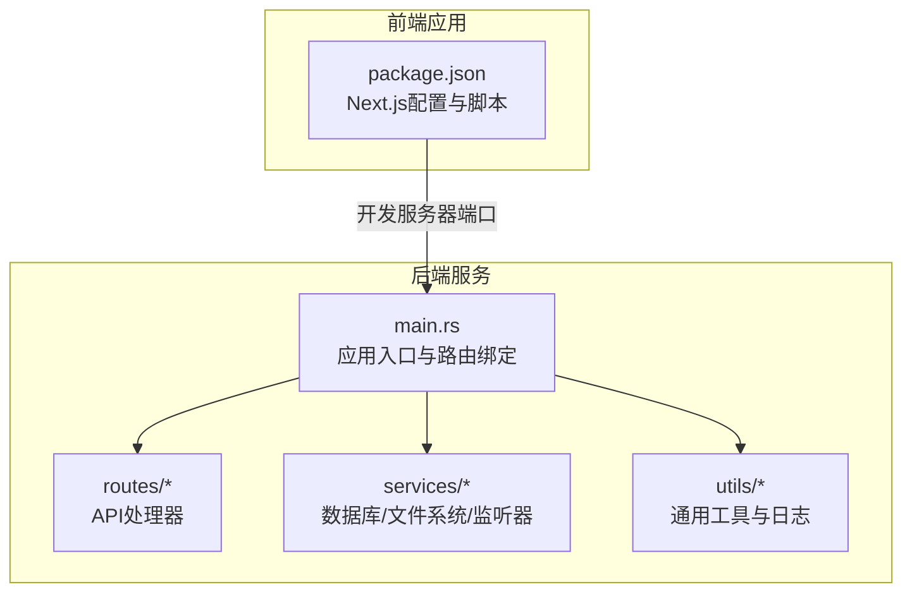
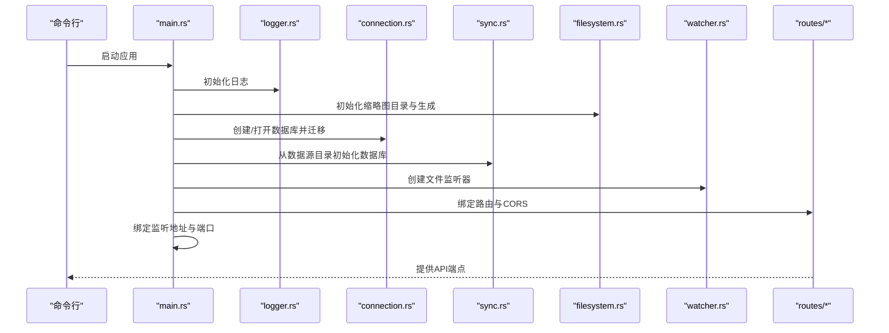
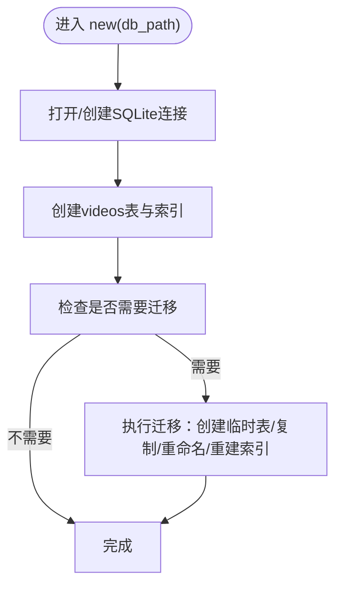
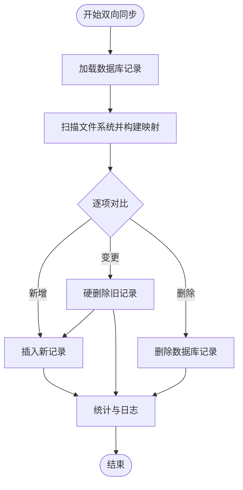
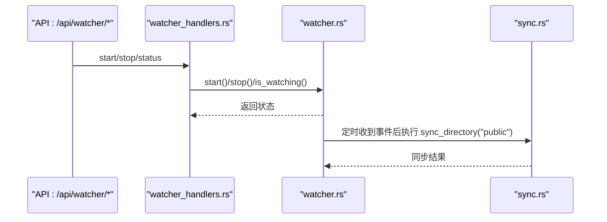
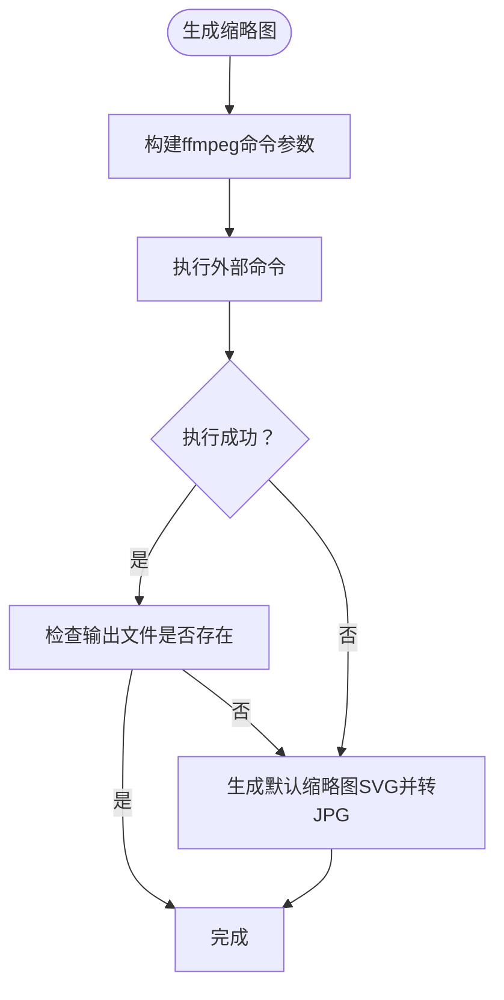
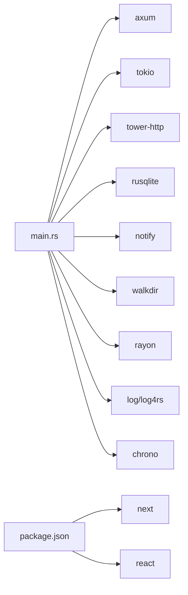

# 故障排除

<cite>
**本文引用的文件**
- [app/server/src/main.rs](file://app/server/src/main.rs)
- [app/server/src/utils/logger.rs](file://app/server/src/utils/logger.rs)
- [app/server/src/services/db/connection.rs](file://app/server/src/services/db/connection.rs)
- [app/server/src/services/db/sync.rs](file://app/server/src/services/db/sync.rs)
- [app/server/src/services/db/video_dao.rs](file://app/server/src/services/db/video_dao.rs)
- [app/server/src/services/db/watcher.rs](file://app/server/src/services/db/watcher.rs)
- [app/server/src/routes/video_handlers.rs](file://app/server/src/routes/video_handlers.rs)
- [app/server/src/routes/watcher_handlers.rs](file://app/server/src/routes/watcher_handlers.rs)
- [app/server/src/services/filesystem.rs](file://app/server/src/services/filesystem.rs)
- [app/server/src/utils/common.rs](file://app/server/src/utils/common.rs)
- [app/server/Cargo.toml](file://app/server/Cargo.toml)
- [app/web/package.json](file://app/web/package.json)
- [README.md](file://README.md)
</cite>

## 目录
1. [简介](#简介)
2. [项目结构](#项目结构)
3. [核心组件](#核心组件)
4. [架构总览](#架构总览)
5. [详细组件分析](#详细组件分析)
6. [依赖关系分析](#依赖关系分析)
7. [性能考虑](#性能考虑)
8. [故障排除指南](#故障排除指南)
9. [结论](#结论)
10. [附录](#附录)

## 简介
本指南聚焦于该视频媒体库服务的故障排除与运维实践，覆盖启动失败、端口冲突、权限问题、日志分析、性能瓶颈、网络与数据库异常、调试工具使用及预防性维护建议。文档基于实际代码实现进行归纳总结，帮助开发者与运维人员快速定位问题并恢复系统稳定。

## 项目结构
后端采用 Rust + Axum + Tokio，前端采用 Next.js。后端负责：
- API 路由与状态管理
- 数据库初始化与同步
- 文件系统监听与缩略图生成
- 日志配置与输出

前端负责媒体库展示与播放页面。

图表来源
- [app/server/src/main.rs](file://app/server/src/main.rs#L1-L111)
- [app/server/Cargo.toml](file://app/server/Cargo.toml#L1-L23)
- [app/web/package.json](file://app/web/package.json#L1-L74)

章节来源
- [app/server/src/main.rs](file://app/server/src/main.rs#L1-L111)
- [app/server/Cargo.toml](file://app/server/Cargo.toml#L1-L23)
- [app/web/package.json](file://app/web/package.json#L1-L74)

## 核心组件
- 应用状态与生命周期
  - 应用入口初始化日志、数据源目录、数据库、文件监听器，并绑定路由与中间件。
  - 默认监听地址与端口固定，可通过环境变量调整数据源目录。
- 数据库层
  - SQLite 连接管理与表结构初始化、索引与迁移逻辑。
  - DAO 层封装查询与树形结构重建。
- 目录同步与文件监听
  - 双向同步：文件系统 → 数据库 + 数据库 → 文件系统。
  - 文件监听器基于事件过滤与防抖，支持自动同步。
- 缩略图生成
  - 通过外部工具生成缩略图，失败时回退默认图标。
- 日志系统
  - 控制台彩色输出与滚动文件日志，按级别输出。

章节来源
- [app/server/src/main.rs](file://app/server/src/main.rs#L1-L111)
- [app/server/src/utils/logger.rs](file://app/server/src/utils/logger.rs#L1-L100)
- [app/server/src/services/db/connection.rs](file://app/server/src/services/db/connection.rs#L1-L122)
- [app/server/src/services/db/video_dao.rs](file://app/server/src/services/db/video_dao.rs#L1-L146)
- [app/server/src/services/db/sync.rs](file://app/server/src/services/db/sync.rs#L1-L413)
- [app/server/src/services/db/watcher.rs](file://app/server/src/services/db/watcher.rs#L1-L182)
- [app/server/src/services/filesystem.rs](file://app/server/src/services/filesystem.rs#L1-L121)
- [app/server/src/utils/common.rs](file://app/server/src/utils/common.rs#L1-L146)

## 架构总览
后端服务启动流程与关键交互如下：

图表来源
- [app/server/src/main.rs](file://app/server/src/main.rs#L1-L111)
- [app/server/src/utils/logger.rs](file://app/server/src/utils/logger.rs#L1-L100)
- [app/server/src/services/db/connection.rs](file://app/server/src/services/db/connection.rs#L1-L122)
- [app/server/src/services/db/sync.rs](file://app/server/src/services/db/sync.rs#L1-L413)
- [app/server/src/services/filesystem.rs](file://app/server/src/services/filesystem.rs#L1-L121)
- [app/server/src/services/db/watcher.rs](file://app/server/src/services/db/watcher.rs#L1-L182)
- [app/server/src/routes/video_handlers.rs](file://app/server/src/routes/video_handlers.rs#L1-L104)
- [app/server/src/routes/watcher_handlers.rs](file://app/server/src/routes/watcher_handlers.rs#L1-L84)

## 详细组件分析

### 数据库连接与迁移
- 初始化时创建表与索引；若检测到旧列则执行迁移，确保兼容性。
- 迁移过程包含临时表、数据复制、索引重建等步骤，失败会中断但不影响后续启动。

图表来源
- [app/server/src/services/db/connection.rs](file://app/server/src/services/db/connection.rs#L1-L122)

章节来源
- [app/server/src/services/db/connection.rs](file://app/server/src/services/db/connection.rs#L1-L122)

### 目录同步与双向一致性
- 从文件系统扫描构建映射，对比数据库记录，执行新增、变更硬删除再插入、删除清理。
- 支持 m3u8 目录合并与 mp4 生成、缩略图路径确保、字幕与元数据提取。
- 同步过程包含阶段计时与统计，便于性能分析与问题定位。

图表来源
- [app/server/src/services/db/sync.rs](file://app/server/src/services/db/sync.rs#L1-L413)

章节来源
- [app/server/src/services/db/sync.rs](file://app/server/src/services/db/sync.rs#L1-L413)

### 文件监听器与自动同步
- 基于事件过滤仅对内容变化触发，内部使用通道与定时防抖，避免频繁同步。
- 支持启动/停止与状态查询，状态通过共享状态暴露。

图表来源
- [app/server/src/routes/watcher_handlers.rs](file://app/server/src/routes/watcher_handlers.rs#L1-L84)
- [app/server/src/services/db/watcher.rs](file://app/server/src/services/db/watcher.rs#L1-L182)
- [app/server/src/services/db/sync.rs](file://app/server/src/services/db/sync.rs#L1-L413)

章节来源
- [app/server/src/routes/watcher_handlers.rs](file://app/server/src/routes/watcher_handlers.rs#L1-L84)
- [app/server/src/services/db/watcher.rs](file://app/server/src/services/db/watcher.rs#L1-L182)

### 缩略图生成与回退机制
- 使用外部工具生成缩略图，失败时回退默认图标；并行处理提升效率。
- 若 ffmpeg 不可用或生成失败，会记录错误并写入日志。

图表来源
- [app/server/src/services/filesystem.rs](file://app/server/src/services/filesystem.rs#L1-L121)

章节来源
- [app/server/src/services/filesystem.rs](file://app/server/src/services/filesystem.rs#L1-L121)

### 日志系统与输出
- 控制台彩色输出与滚动文件日志，按级别输出，便于快速定位问题。
- 日志路径与轮转策略在初始化时配置。

章节来源
- [app/server/src/utils/logger.rs](file://app/server/src/utils/logger.rs#L1-L100)

## 依赖关系分析
- 后端依赖
  - Web 框架与运行时：Axum、Tokio、Tower
  - 数据库：rusqlite（捆绑）
  - 文件系统与监听：walkdir、notify
  - 并行与日志：rayon、log/log4rs、chrono、nu-ansi-term、anyhow
- 前端依赖
  - Next.js、React 生态、HLS 工具等

图表来源
- [app/server/Cargo.toml](file://app/server/Cargo.toml#L1-L23)
- [app/web/package.json](file://app/web/package.json#L1-L74)

章节来源
- [app/server/Cargo.toml](file://app/server/Cargo.toml#L1-L23)
- [app/web/package.json](file://app/web/package.json#L1-L74)

## 性能考虑
- 并行处理
  - 缩略图生成使用并行迭代器，可显著降低批量处理时间。
- I/O 与数据库
  - 同步过程包含阶段计时与统计，建议结合日志观察各阶段耗时。
  - 索引（path、parent_path）有助于查询加速。
- 外部工具
  - ffmpeg 的调用可能成为瓶颈，建议确保其可用与版本匹配。
- 端口与并发
  - 单实例绑定固定端口，高并发场景需评估资源与线程池配置。

章节来源
- [app/server/src/services/filesystem.rs](file://app/server/src/services/filesystem.rs#L1-L121)
- [app/server/src/services/db/connection.rs](file://app/server/src/services/db/connection.rs#L1-L122)
- [app/server/src/services/db/sync.rs](file://app/server/src/services/db/sync.rs#L1-L413)

## 故障排除指南

### 启动失败
常见原因与排查步骤：
- 端口占用
  - 服务默认绑定固定端口，若被占用将导致启动失败。
  - 排查：确认端口占用情况，更换端口或释放占用进程。
- 数据库初始化失败
  - 数据库文件损坏或权限不足可能导致初始化失败。
  - 排查：检查数据库文件是否存在与可写；必要时删除旧文件后重启。
- 缩略图目录初始化失败
  - 目录创建或权限问题导致缩略图初始化失败。
  - 排查：确认缩略图目录可写，权限正确。
- 外部工具缺失
  - 缩略图生成依赖外部工具，若不可用将产生错误日志。
  - 排查：安装并验证外部工具可用性。

章节来源
- [app/server/src/main.rs](file://app/server/src/main.rs#L1-L111)
- [app/server/src/services/db/connection.rs](file://app/server/src/services/db/connection.rs#L1-L122)
- [app/server/src/services/filesystem.rs](file://app/server/src/services/filesystem.rs#L1-L121)

### 端口冲突
- 现象：启动时报错，无法绑定端口。
- 处理：释放占用端口或修改监听地址/端口（当前代码固定端口，如需更改请在入口处调整）。

章节来源
- [app/server/src/main.rs](file://app/server/src/main.rs#L92-L109)

### 权限问题
- 数据库文件读写权限不足
  - 现象：数据库初始化或同步失败。
  - 处理：赋予运行用户对数据库文件与数据源目录的读写权限。
- 缩略图目录权限不足
  - 现象：缩略图生成失败或无法创建目录。
  - 处理：确保缩略图目录可写，必要时手动创建并赋权。
- 外部工具权限不足
  - 现象：缩略图生成报错。
  - 处理：确保外部工具可执行且路径在环境变量中。

章节来源
- [app/server/src/services/db/connection.rs](file://app/server/src/services/db/connection.rs#L1-L122)
- [app/server/src/services/filesystem.rs](file://app/server/src/services/filesystem.rs#L1-L121)

### 日志分析与错误代码参考
- 日志位置与级别
  - 控制台彩色输出与滚动文件日志，级别包含 Info/Warn/Error/Debug/Trace。
  - 日志文件路径与轮转策略在初始化时配置。
- 常见错误类别
  - 数据库错误：查询/迁移/插入失败。
  - 文件系统错误：目录不存在、权限不足、外部工具调用失败。
  - 监听器错误：监听路径不存在、监听器已在运行/未运行。
- 建议
  - 结合日志中的阶段计时与统计信息定位瓶颈。
  - 出现错误时优先查看最近的日志片段与上下文。

章节来源
- [app/server/src/utils/logger.rs](file://app/server/src/utils/logger.rs#L1-L100)
- [app/server/src/services/db/sync.rs](file://app/server/src/services/db/sync.rs#L1-L413)
- [app/server/src/routes/video_handlers.rs](file://app/server/src/routes/video_handlers.rs#L1-L104)
- [app/server/src/routes/watcher_handlers.rs](file://app/server/src/routes/watcher_handlers.rs#L1-L84)

### 性能问题识别与优化
- 识别
  - 关注同步阶段耗时与统计：数据库记录加载、文件系统扫描、处理变更与删除、清理阶段。
  - 观察日志中的阶段计时，定位最慢环节。
- 优化
  - 并行化：缩略图生成已使用并行，可进一步评估 I/O 与 CPU 资源。
  - I/O 优化：减少不必要的外部工具调用次数，缓存元数据。
  - 数据库优化：确保索引有效，避免全表扫描；合理分批处理大数据集。
  - 外部工具：确保工具可用与高效，必要时升级版本。

章节来源
- [app/server/src/services/db/sync.rs](file://app/server/src/services/db/sync.rs#L1-L413)
- [app/server/src/services/filesystem.rs](file://app/server/src/services/filesystem.rs#L1-L121)

### 网络连接问题排查
- API 无法访问
  - 检查服务是否正常启动、端口是否被占用。
  - 确认 CORS 配置允许跨域访问。
- 前后端联调
  - 前端开发端口与后端端口需保持连通；若跨域，确认后端允许来源。
- 路由与状态
  - 使用提供的 API 端点验证服务状态与功能。

章节来源
- [app/server/src/main.rs](file://app/server/src/main.rs#L72-L109)
- [app/web/package.json](file://app/web/package.json#L1-L74)

### 数据库连接异常处理
- 初始化失败
  - 检查数据库文件是否存在与权限；必要时删除后重启以重建。
- 查询/迁移错误
  - 查看迁移日志与错误提示，确认表结构与索引状态。
- 写入/删除失败
  - 检查并发写入与锁竞争；必要时降低并发或优化事务粒度。

章节来源
- [app/server/src/services/db/connection.rs](file://app/server/src/services/db/connection.rs#L1-L122)
- [app/server/src/services/db/video_dao.rs](file://app/server/src/services/db/video_dao.rs#L1-L146)

### 调试工具使用指南
- 日志工具
  - 使用内置日志系统输出详细阶段信息，结合时间戳定位问题。
- 外部工具
  - 确保外部工具可用并可执行；在缩略图生成失败时优先验证其可用性。
- 并发与性能
  - 利用阶段计时与统计信息评估性能瓶颈，针对性优化。

章节来源
- [app/server/src/utils/logger.rs](file://app/server/src/utils/logger.rs#L1-L100)
- [app/server/src/services/filesystem.rs](file://app/server/src/services/filesystem.rs#L1-L121)

### 开发环境问题解决方案
- 端口冲突
  - 更改后端监听端口或释放占用端口。
- 依赖缺失
  - 安装并验证外部工具与运行时依赖。
- 跨域问题
  - 确认后端 CORS 配置与前端请求来源一致。

章节来源
- [app/server/src/main.rs](file://app/server/src/main.rs#L72-L109)
- [app/server/Cargo.toml](file://app/server/Cargo.toml#L1-L23)
- [app/web/package.json](file://app/web/package.json#L1-L74)

### 预防性维护与健康检查清单
- 定期检查
  - 数据库文件完整性与权限
  - 缩略图目录空间与权限
  - 外部工具可用性
- 监控与告警
  - 关注日志中的错误与异常
  - 定期执行同步与健康检查 API
- 版本与升级
  - 及时更新依赖与外部工具，确保兼容性
- 备份与回滚
  - 数据库文件定期备份，出现问题可快速回滚

章节来源
- [app/server/src/utils/logger.rs](file://app/server/src/utils/logger.rs#L1-L100)
- [app/server/src/services/db/sync.rs](file://app/server/src/services/db/sync.rs#L1-L413)

## 结论
本指南基于实际代码实现，提供了从启动、网络、数据库到性能与日志的系统化故障排除方法。建议在日常运维中结合日志与阶段计时信息，建立定期健康检查与备份机制，确保系统稳定运行。

## 附录
- 快速参考
  - 启动端口与路由：参见应用入口与路由绑定。
  - 数据库初始化与迁移：参见数据库连接模块。
  - 同步与监听：参见目录同步与文件监听器模块。
  - 缩略图生成：参见文件系统模块。
  - 日志配置：参见日志模块。

章节来源
- [app/server/src/main.rs](file://app/server/src/main.rs#L72-L109)
- [app/server/src/services/db/connection.rs](file://app/server/src/services/db/connection.rs#L1-L122)
- [app/server/src/services/db/sync.rs](file://app/server/src/services/db/sync.rs#L1-L413)
- [app/server/src/services/db/watcher.rs](file://app/server/src/services/db/watcher.rs#L1-L182)
- [app/server/src/services/filesystem.rs](file://app/server/src/services/filesystem.rs#L1-L121)
- [app/server/src/utils/logger.rs](file://app/server/src/utils/logger.rs#L1-L100)
- [README.md](file://README.md)